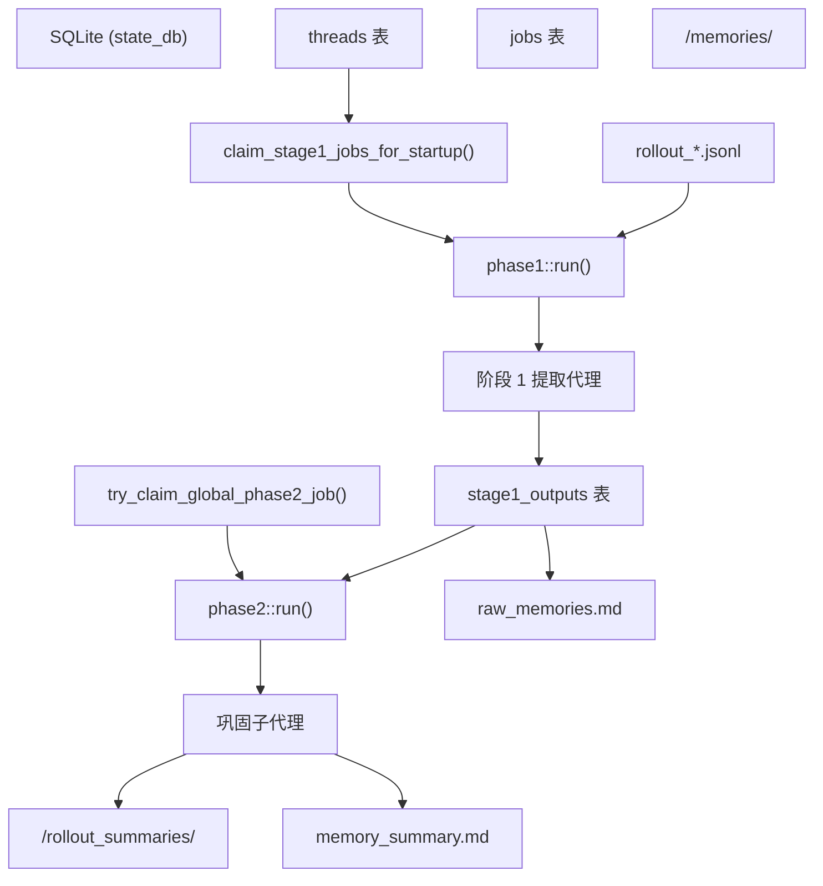

# 记忆系统

相关源文件

-   [codex-rs/core/src/contextual_user_message.rs](https://github.com/openai/codex/blob/d807d44a/codex-rs/core/src/contextual_user_message.rs)
-   [codex-rs/core/src/contextual_user_message_tests.rs](https://github.com/openai/codex/blob/d807d44a/codex-rs/core/src/contextual_user_message_tests.rs)
-   [codex-rs/core/src/memories/README.md](https://github.com/openai/codex/blob/d807d44a/codex-rs/core/src/memories/README.md?plain=1)
-   [codex-rs/core/src/memories/mod.rs](https://github.com/openai/codex/blob/d807d44a/codex-rs/core/src/memories/mod.rs)
-   [codex-rs/core/src/memories/phase1.rs](https://github.com/openai/codex/blob/d807d44a/codex-rs/core/src/memories/phase1.rs)
-   [codex-rs/core/src/memories/phase1_tests.rs](https://github.com/openai/codex/blob/d807d44a/codex-rs/core/src/memories/phase1_tests.rs)
-   [codex-rs/core/src/memories/phase2.rs](https://github.com/openai/codex/blob/d807d44a/codex-rs/core/src/memories/phase2.rs)
-   [codex-rs/core/src/memories/prompts.rs](https://github.com/openai/codex/blob/d807d44a/codex-rs/core/src/memories/prompts.rs)
-   [codex-rs/core/src/memories/start.rs](https://github.com/openai/codex/blob/d807d44a/codex-rs/core/src/memories/start.rs)
-   [codex-rs/core/src/memories/storage.rs](https://github.com/openai/codex/blob/d807d44a/codex-rs/core/src/memories/storage.rs)
-   [codex-rs/core/src/memories/tests.rs](https://github.com/openai/codex/blob/d807d44a/codex-rs/core/src/memories/tests.rs)
-   [codex-rs/core/src/realtime_context.rs](https://github.com/openai/codex/blob/d807d44a/codex-rs/core/src/realtime_context.rs)
-   [codex-rs/core/src/realtime_context_tests.rs](https://github.com/openai/codex/blob/d807d44a/codex-rs/core/src/realtime_context_tests.rs)
-   [codex-rs/core/templates/memories/consolidation.md](https://github.com/openai/codex/blob/d807d44a/codex-rs/core/templates/memories/consolidation.md?plain=1)
-   [codex-rs/core/templates/memories/read_path.md](https://github.com/openai/codex/blob/d807d44a/codex-rs/core/templates/memories/read_path.md?plain=1)
-   [codex-rs/core/templates/memories/stage_one_input.md](https://github.com/openai/codex/blob/d807d44a/codex-rs/core/templates/memories/stage_one_input.md?plain=1)
-   [codex-rs/core/templates/memories/stage_one_system.md](https://github.com/openai/codex/blob/d807d44a/codex-rs/core/templates/memories/stage_one_system.md?plain=1)
-   [codex-rs/core/tests/suite/memories.rs](https://github.com/openai/codex/blob/d807d44a/codex-rs/core/tests/suite/memories.rs)
-   [codex-rs/state/migrations/0020_threads_model_reasoning_effort.sql](https://github.com/openai/codex/blob/d807d44a/codex-rs/state/migrations/0020_threads_model_reasoning_effort.sql)
-   [codex-rs/state/src/extract.rs](https://github.com/openai/codex/blob/d807d44a/codex-rs/state/src/extract.rs)
-   [codex-rs/state/src/model/memories.rs](https://github.com/openai/codex/blob/d807d44a/codex-rs/state/src/model/memories.rs)
-   [codex-rs/state/src/model/thread_metadata.rs](https://github.com/openai/codex/blob/d807d44a/codex-rs/state/src/model/thread_metadata.rs)
-   [codex-rs/state/src/runtime/memories.rs](https://github.com/openai/codex/blob/d807d44a/codex-rs/state/src/runtime/memories.rs)
-   [codex-rs/state/src/runtime/test_support.rs](https://github.com/openai/codex/blob/d807d44a/codex-rs/state/src/runtime/test_support.rs)
-   [codex-rs/state/src/runtime/threads.rs](https://github.com/openai/codex/blob/d807d44a/codex-rs/state/src/runtime/threads.rs)

记忆系统是一个多阶段流水线，旨在从过去的对话 rollout 中提取、巩固并将持久知识注入到当前代理上下文中。它允许代理保持长期连续性，记住用户偏好，并跨不同会话重用经过验证的工作流。

## 架构概述

系统在两个主要阶段运行：**启动提取 (阶段 1)** 和 **全局巩固 (阶段 2)**。这些阶段将数据从原始执行日志 (rollout) 转换为结构化的、可搜索的记忆文件夹。

### 记忆流水线数据流

下图说明了从完成的 `Rollout` 到新 `Session` 中注入的上下文的流程。

**图表：记忆提取与巩固流水线**

来源： [codex-rs/core/src/memories/mod.rs1-15](https://github.com/openai/codex/blob/d807d44a/codex-rs/core/src/memories/mod.rs#L1-L15) [codex-rs/core/src/memories/phase1.rs81-123](https://github.com/openai/codex/blob/d807d44a/codex-rs/core/src/memories/phase1.rs#L81-L123) [codex-rs/core/src/memories/phase2.rs43-161](https://github.com/openai/codex/blob/d807d44a/codex-rs/core/src/memories/phase2.rs#L43-L161)

---

## 阶段 1：启动提取

阶段 1 识别“陈旧”线程（自上次记忆提取以来更新过的线程），并运行一个轻量级代理来总结它们。

### 关键逻辑

1.  **作业选择**：系统在 `threads` 表中扫描处于年龄窗口（例如 `max_age_days`）内且至少闲置了一段最短时间（`min_rollout_idle_hours`）的活跃线程 [codex-rs/state/src/runtime/memories.rs122-159](https://github.com/openai/codex/blob/d807d44a/codex-rs/state/src/runtime/memories.rs#L122-L159)
2.  **并发**：提取作业并行运行，由 `CONCURRENCY_LIMIT`（默认 8）管理 [codex-rs/core/src/memories/mod.rs41](https://github.com/openai/codex/blob/d807d44a/codex-rs/core/src/memories/mod.rs#L41-L41)
3.  **提取**：通常使用 `gpt-5.1-codex-mini` 模型将原始 `.jsonl` rollout 转换为 `StageOneOutput` 结构体，其中包含 `raw_memory`（详细 Markdown）和 `rollout_summary`（简要回顾） [codex-rs/core/src/memories/phase1.rs35-79](https://github.com/openai/codex/blob/d807d44a/codex-rs/core/src/memories/phase1.rs#L35-L79)
4.  **持久化**：结果存储在状态数据库的 `stage1_outputs` 表中 [codex-rs/state/src/runtime/memories.rs50-56](https://github.com/openai/codex/blob/d807d44a/codex-rs/state/src/runtime/memories.rs#L50-L56)

来源： [codex-rs/core/src/memories/phase1.rs1-180](https://github.com/openai/codex/blob/d807d44a/codex-rs/core/src/memories/phase1.rs#L1-L180) [codex-rs/state/src/runtime/memories.rs122-218](https://github.com/openai/codex/blob/d807d44a/codex-rs/state/src/runtime/memories.rs#L122-L218)

---

## 阶段 2：全局巩固

阶段 2 充当“记忆写入代理”，定期将单个阶段 1 输出合并到全局记忆结构中。

### 实现细节

-   **全局锁**：每个 `codex_home` 每次只能运行一个巩固进程，通过在 `jobs` 表中添加 `JOB_KIND_MEMORY_CONSOLIDATE_GLOBAL` 条目并使用 `try_claim_global_phase2_job` 来管理 [codex-rs/state/src/runtime/memories.rs21-22](https://github.com/openai/codex/blob/d807d44a/codex-rs/state/src/runtime/memories.rs#L21-L22)
-   **子代理派生**：它派生一个来源为 `SubAgentSource::MemoryConsolidation` 的子代理 [codex-rs/core/src/memories/phase2.rs131](https://github.com/openai/codex/blob/d807d44a/codex-rs/core/src/memories/phase2.rs#L131-L131)
-   **伪影同步**：在代理运行之前，系统使用 `sync_rollout_summaries_from_memories` 和 `rebuild_raw_memories_file_from_memories` 将本地文件系统与数据库同步 [codex-rs/core/src/memories/phase2.rs98-114](https://github.com/openai/codex/blob/d807d44a/codex-rs/core/src/memories/phase2.rs#L98-L114)

**图表：记忆存储结构**

来源： [codex-rs/core/src/memories/phase2.rs43-161](https://github.com/openai/codex/blob/d807d44a/codex-rs/core/src/memories/phase2.rs#L43-L161) [codex-rs/core/src/memories/storage.rs12-60](https://github.com/openai/codex/blob/d807d44a/codex-rs/core/src/memories/storage.rs#L12-L60) [codex-rs/core/templates/memories/consolidation.md17-36](https://github.com/openai/codex/blob/d807d44a/codex-rs/core/templates/memories/consolidation.md?plain=1#L17-L36)

---

## 存储与布局

记忆存储在 `codex_home` 内专用的 `memories` 目录中。

| 文件/目录 | 用途 |
| --- | --- |
| `memory_summary.md` | 注入到每个 Prompt 中的高层导航摘要。 |
| `MEMORY.md` | 汇总洞察的可搜索注册表和手册。 |
| `raw_memories.md` | 阶段 1 输出的临时合并，用作阶段 2 的输入。 |
| `rollout_summaries/` | 每个线程的回顾，包含吸取的教训和证据片段。 |
| `skills/` | 可重用的程序和脚本（例如 `SKILL.md`）。 |

### Rollout 总结命名

`rollout_summaries/` 中的文件名使用 `rollout_summary_file_stem` 生成，它结合了 `ThreadId`、时间戳片段和可选的 `rollout_slug` [codex-rs/core/src/memories/storage.rs171-200](https://github.com/openai/codex/blob/d807d44a/codex-rs/core/src/memories/storage.rs#L171-L200)

来源： [codex-rs/core/src/memories/mod.rs101-111](https://github.com/openai/codex/blob/d807d44a/codex-rs/core/src/memories/mod.rs#L101-L111) [codex-rs/core/src/memories/storage.rs62-96](https://github.com/openai/codex/blob/d807d44a/codex-rs/core/src/memories/storage.rs#L62-L96) [codex-rs/core/templates/memories/consolidation.md20-35](https://github.com/openai/codex/blob/d807d44a/codex-rs/core/templates/memories/consolidation.md?plain=1#L20-L35)

---

## 上下文注入 (启动)

在初始化新 `Session` 期间，系统将记忆指导注入到模型的开发者指令中。

### 读取路径

函数 `build_memory_tool_developer_instructions` 读取 `memory_summary.md` 并将其包裹在 `read_path.md` 模板中 [codex-rs/core/src/memories/prompts.rs158-179](https://github.com/openai/codex/blob/d807d44a/codex-rs/core/src/memories/prompts.rs#L158-L179)

-   **Token 限制**：注入的 `memory_summary.md` 被截断至 `MEMORY_TOOL_DEVELOPER_INSTRUCTIONS_SUMMARY_TOKEN_LIMIT`（5,000 Token）以保留上下文窗口 [codex-rs/core/src/memories/mod.rs47](https://github.com/openai/codex/blob/d807d44a/codex-rs/core/src/memories/mod.rs#L47-L47)
-   **引用**：代理被指示使用 `<oai-mem-citation>` 块来引用记忆文件夹中的特定文件和行号范围 [codex-rs/core/templates/memories/read_path.md82-122](https://github.com/openai/codex/blob/d807d44a/codex-rs/core/templates/memories/read_path.md?plain=1#L82-L122)
-   **使用跟踪**：当代理引用记忆时，系统调用 `record_stage1_output_usage` 来增加数据库中的 `usage_count` 并更新 `last_usage` [codex-rs/state/src/runtime/memories.rs89-120](https://github.com/openai/codex/blob/d807d44a/codex-rs/state/src/runtime/memories.rs#L89-L120)

来源： [codex-rs/core/src/memories/prompts.rs158-179](https://github.com/openai/codex/blob/d807d44a/codex-rs/core/src/memories/prompts.rs#L158-L179) [codex-rs/core/templates/memories/read_path.md1-130](https://github.com/openai/codex/blob/d807d44a/codex-rs/core/templates/memories/read_path.md?plain=1#L1-L130) [codex-rs/state/src/runtime/memories.rs89-120](https://github.com/openai/codex/blob/d807d44a/codex-rs/state/src/runtime/memories.rs#L89-L120)
