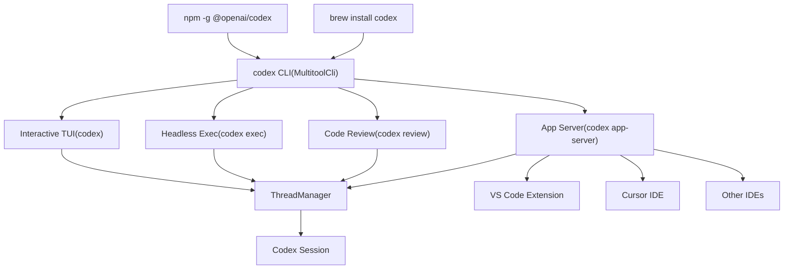
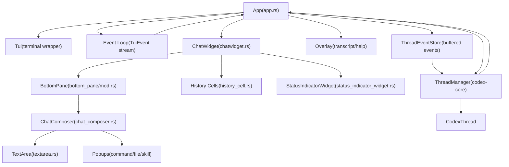
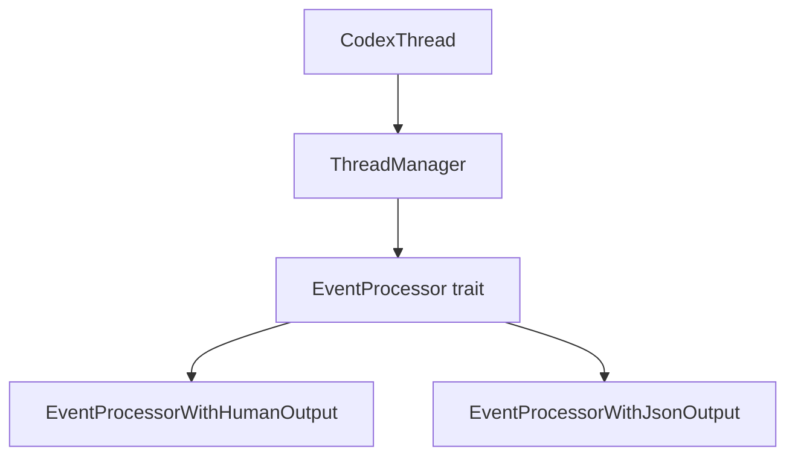

# 用户界面

相关源文件

-   [codex-rs/Cargo.lock](https://github.com/openai/codex/blob/d807d44a/codex-rs/Cargo.lock)
-   [codex-rs/Cargo.toml](https://github.com/openai/codex/blob/d807d44a/codex-rs/Cargo.toml)
-   [codex-rs/README.md](https://github.com/openai/codex/blob/d807d44a/codex-rs/README.md?plain=1)
-   [codex-rs/cli/Cargo.toml](https://github.com/openai/codex/blob/d807d44a/codex-rs/cli/Cargo.toml)
-   [codex-rs/cli/src/lib.rs](https://github.com/openai/codex/blob/d807d44a/codex-rs/cli/src/lib.rs)
-   [codex-rs/cli/src/main.rs](https://github.com/openai/codex/blob/d807d44a/codex-rs/cli/src/main.rs)
-   [codex-rs/config.md](https://github.com/openai/codex/blob/d807d44a/codex-rs/config.md?plain=1)
-   [codex-rs/core/Cargo.toml](https://github.com/openai/codex/blob/d807d44a/codex-rs/core/Cargo.toml)
-   [codex-rs/core/src/codex.rs](https://github.com/openai/codex/blob/d807d44a/codex-rs/core/src/codex.rs)
-   [codex-rs/core/src/flags.rs](https://github.com/openai/codex/blob/d807d44a/codex-rs/core/src/flags.rs)
-   [codex-rs/core/src/lib.rs](https://github.com/openai/codex/blob/d807d44a/codex-rs/core/src/lib.rs)
-   [codex-rs/core/src/model\_provider\_info.rs](https://github.com/openai/codex/blob/d807d44a/codex-rs/core/src/model_provider_info.rs)
-   [codex-rs/core/src/rollout/policy.rs](https://github.com/openai/codex/blob/d807d44a/codex-rs/core/src/rollout/policy.rs)
-   [codex-rs/exec/Cargo.toml](https://github.com/openai/codex/blob/d807d44a/codex-rs/exec/Cargo.toml)
-   [codex-rs/exec/src/cli.rs](https://github.com/openai/codex/blob/d807d44a/codex-rs/exec/src/cli.rs)
-   [codex-rs/exec/src/event\_processor.rs](https://github.com/openai/codex/blob/d807d44a/codex-rs/exec/src/event_processor.rs)
-   [codex-rs/exec/src/event\_processor\_with\_human\_output.rs](https://github.com/openai/codex/blob/d807d44a/codex-rs/exec/src/event_processor_with_human_output.rs)
-   [codex-rs/exec/src/lib.rs](https://github.com/openai/codex/blob/d807d44a/codex-rs/exec/src/lib.rs)
-   [codex-rs/mcp-server/src/codex\_tool\_runner.rs](https://github.com/openai/codex/blob/d807d44a/codex-rs/mcp-server/src/codex_tool_runner.rs)
-   [codex-rs/protocol/src/protocol.rs](https://github.com/openai/codex/blob/d807d44a/codex-rs/protocol/src/protocol.rs)
-   [codex-rs/tui/Cargo.toml](https://github.com/openai/codex/blob/d807d44a/codex-rs/tui/Cargo.toml)
-   [codex-rs/tui/src/app.rs](https://github.com/openai/codex/blob/d807d44a/codex-rs/tui/src/app.rs)
-   [codex-rs/tui/src/app\_event.rs](https://github.com/openai/codex/blob/d807d44a/codex-rs/tui/src/app_event.rs)
-   [codex-rs/tui/src/bottom\_pane/chat\_composer.rs](https://github.com/openai/codex/blob/d807d44a/codex-rs/tui/src/bottom_pane/chat_composer.rs)
-   [codex-rs/tui/src/bottom\_pane/mod.rs](https://github.com/openai/codex/blob/d807d44a/codex-rs/tui/src/bottom_pane/mod.rs)
-   [codex-rs/tui/src/chatwidget.rs](https://github.com/openai/codex/blob/d807d44a/codex-rs/tui/src/chatwidget.rs)
-   [codex-rs/tui/src/chatwidget/tests.rs](https://github.com/openai/codex/blob/d807d44a/codex-rs/tui/src/chatwidget/tests.rs)
-   [codex-rs/tui/src/cli.rs](https://github.com/openai/codex/blob/d807d44a/codex-rs/tui/src/cli.rs)
-   [codex-rs/tui/src/history\_cell.rs](https://github.com/openai/codex/blob/d807d44a/codex-rs/tui/src/history_cell.rs)
-   [codex-rs/tui/src/lib.rs](https://github.com/openai/codex/blob/d807d44a/codex-rs/tui/src/lib.rs)
-   [codex-rs/tui/src/slash\_command.rs](https://github.com/openai/codex/blob/d807d44a/codex-rs/tui/src/slash_command.rs)

## 目的与范围

本文档描述了用户与 Codex 交互的用户侧界面：用于交互式会话的 **终端用户界面（TUI）**、用于非交互自动化的**无头执行模式**（`codex exec`）、分发到不同模式的 **CLI 入口点**，以及用于 IDE 集成的 **App Server**。每种界面都提供不同的交互模型，同时共享相同的底层核心引擎。

关于这些界面的配置，请参见 [Configuration System](/openai/codex/2.2-configuration-system)。关于在所有界面间协调异步通信的协议层，请参见 [Protocol Layer (Submission/Event System)](/openai/codex/2.1-protocol-layer-(submissionevent-system))。

---

## 执行模式概览

Codex 支持四种不同的执行模式，每种模式都针对不同用例进行了优化：

**执行模式特征：**

| 模式 | 交互式 | 输出格式 | 主要使用场景 |
| --- | --- | --- | --- |
| TUI | 是 | 富终端 UI | 人工驱动的开发会话 |
| Exec | 否 | 纯文本或 JSONL | CI/CD、脚本编排、自动化 |
| Review | 否 | 纯文本 | 代码审查工作流 |
| App Server | 是（通过 IDE） | JSON-RPC | IDE 集成（VS Code、Cursor） |

来源： [codex-rs/cli/src/main.rs56-111](https://github.com/openai/codex/blob/d807d44a/codex-rs/cli/src/main.rs#L56-L111) [codex-rs/tui/src/lib.rs1-139](https://github.com/openai/codex/blob/d807d44a/codex-rs/tui/src/lib.rs#L1-L139) [codex-rs/exec/src/lib.rs1-100](https://github.com/openai/codex/blob/d807d44a/codex-rs/exec/src/lib.rs#L1-L100)

---

## CLI 入口点与多工具分发

`codex` 二进制充当多工具入口，并基于子命令分发到不同执行模式。其入口点是定义在 [codex-rs/cli/src/main.rs56-82](https://github.com/openai/codex/blob/d807d44a/codex-rs/cli/src/main.rs#L56-L82) 中的 `MultitoolCli`。

详见 [CLI Entry Points and Multitool Dispatch](/openai/codex/4.3-cli-entry-points-and-multitool-dispatch)。

---

## 终端用户界面（TUI）

### 组件层级

TUI 被组织为分层的小部件层级结构，在状态管理、输入处理和渲染之间具有清晰分离：

**关键组件：**

| 组件 | 文件 | 职责 |
| --- | --- | --- |
| `App` | [codex-rs/tui/src/app.rs1-177](https://github.com/openai/codex/blob/d807d44a/codex-rs/tui/src/app.rs#L1-L177) | 顶层事件循环、线程切换与生命周期管理。 |
| `ChatWidget` | [codex-rs/tui/src/chatwidget.rs1-150](https://github.com/openai/codex/blob/d807d44a/codex-rs/tui/src/chatwidget.rs#L1-L150) | 消费协议事件、构建 `HistoryCell`，并驱动视口渲染。 |
| `BottomPane` | [codex-rs/tui/src/bottom\_pane/mod.rs156-161](https://github.com/openai/codex/blob/d807d44a/codex-rs/tui/src/bottom_pane/mod.rs#L156-L161) | 拥有提示输入与聚焦交互视图栈的容器。 |
| `ChatComposer` | [codex-rs/tui/src/bottom\_pane/chat\_composer.rs128-148](https://github.com/openai/codex/blob/d807d44a/codex-rs/tui/src/bottom_pane/chat_composer.rs#L128-L148) | 负责编辑输入缓冲区，并将按键路由到活动弹窗。 |
| `HistoryCell` | [codex-rs/tui/src/history\_cell.rs98-168](https://github.com/openai/codex/blob/d807d44a/codex-rs/tui/src/history_cell.rs#L98-L168) | 表示会话历史中单个可渲染单元的 trait。 |

详见 [Terminal User Interface (TUI)](/openai/codex/4.1-terminal-user-interface-(tui))。

---

## 无头执行模式（codex exec）

`codex exec` 模式提供非交互自动化能力。它使用 `EventProcessor` trait 来处理传入的协议事件，并将其格式化为终端输出或结构化 JSONL。

详见 [Headless Execution Mode (codex exec)](/openai/codex/4.2-headless-execution-mode-(codex-exec))。

---

## 会话恢复与分叉

Codex 支持恢复现有线程，或对其进行分叉以创建独立的会话路径。这通过将 rollout 持久化层中的事件重放到 UI 状态中来管理。

详见 [Session Resumption and Forking](/openai/codex/4.4-session-resumption-and-forking)。

---

## App Server 与 IDE 集成

App Server 通过 JSON-RPC 2.0 协议向 IDE 客户端暴露 Codex 功能。它管理 `ThreadManager`，并路由诸如 `thread/start` 和 `turn/start` 之类的请求。

详见 [App Server and IDE Integration](/openai/codex/4.5-app-server-and-ide-integration)。

---

## TUI App Server 变体（tui\_app\_server）

`tui_app_server` crate 提供一个 TUI 前端，它通过 App Server 协议与核心系统通信，而不是直接与 core 集成。

详见 [TUI App Server Variant (tui\_app\_server)](/openai/codex/4.6-tui-app-server-variant-(tui_app_server))。

---

## 来源汇总

-   **App 编排**: [codex-rs/tui/src/app.rs1-177](https://github.com/openai/codex/blob/d807d44a/codex-rs/tui/src/app.rs#L1-L177)
-   **TUI 核心**: [codex-rs/tui/src/chatwidget.rs1-150](https://github.com/openai/codex/blob/d807d44a/codex-rs/tui/src/chatwidget.rs#L1-L150) [codex-rs/tui/src/history\_cell.rs1-168](https://github.com/openai/codex/blob/d807d44a/codex-rs/tui/src/history_cell.rs#L1-L168)
-   **输入系统**: [codex-rs/tui/src/bottom\_pane/mod.rs1-161](https://github.com/openai/codex/blob/d807d44a/codex-rs/tui/src/bottom_pane/mod.rs#L1-L161) [codex-rs/tui/src/bottom\_pane/chat\_composer.rs1-148](https://github.com/openai/codex/blob/d807d44a/codex-rs/tui/src/bottom_pane/chat_composer.rs#L1-L148)
-   **CLI 分发**: [codex-rs/cli/src/main.rs56-111](https://github.com/openai/codex/blob/d807d44a/codex-rs/cli/src/main.rs#L56-L111)
-   **协议定义**: [codex-rs/protocol/src/protocol.rs101-180](https://github.com/openai/codex/blob/d807d44a/codex-rs/protocol/src/protocol.rs#L101-L180)
-   **核心会话**: [codex-rs/core/src/codex.rs1-189](https://github.com/openai/codex/blob/d807d44a/codex-rs/core/src/codex.rs#L1-L189)
