# 终端用户界面（TUI）

相关源文件

-   [codex-rs/clippy.toml](https://github.com/openai/codex/blob/d807d44a/codex-rs/clippy.toml)
-   [codex-rs/core/src/codex.rs](https://github.com/openai/codex/blob/d807d44a/codex-rs/core/src/codex.rs)
-   [codex-rs/core/src/rollout/policy.rs](https://github.com/openai/codex/blob/d807d44a/codex-rs/core/src/rollout/policy.rs)
-   [codex-rs/exec/src/event\_processor.rs](https://github.com/openai/codex/blob/d807d44a/codex-rs/exec/src/event_processor.rs)
-   [codex-rs/exec/src/event\_processor\_with\_human\_output.rs](https://github.com/openai/codex/blob/d807d44a/codex-rs/exec/src/event_processor_with_human_output.rs)
-   [codex-rs/mcp-server/src/codex\_tool\_runner.rs](https://github.com/openai/codex/blob/d807d44a/codex-rs/mcp-server/src/codex_tool_runner.rs)
-   [codex-rs/protocol/src/protocol.rs](https://github.com/openai/codex/blob/d807d44a/codex-rs/protocol/src/protocol.rs)
-   [codex-rs/tui/src/app.rs](https://github.com/openai/codex/blob/d807d44a/codex-rs/tui/src/app.rs)
-   [codex-rs/tui/src/app\_event.rs](https://github.com/openai/codex/blob/d807d44a/codex-rs/tui/src/app_event.rs)
-   [codex-rs/tui/src/bottom\_pane/chat\_composer.rs](https://github.com/openai/codex/blob/d807d44a/codex-rs/tui/src/bottom_pane/chat_composer.rs)
-   [codex-rs/tui/src/bottom\_pane/mod.rs](https://github.com/openai/codex/blob/d807d44a/codex-rs/tui/src/bottom_pane/mod.rs)
-   [codex-rs/tui/src/chatwidget.rs](https://github.com/openai/codex/blob/d807d44a/codex-rs/tui/src/chatwidget.rs)
-   [codex-rs/tui/src/chatwidget/tests.rs](https://github.com/openai/codex/blob/d807d44a/codex-rs/tui/src/chatwidget/tests.rs)
-   [codex-rs/tui/src/history\_cell.rs](https://github.com/openai/codex/blob/d807d44a/codex-rs/tui/src/history_cell.rs)
-   [codex-rs/tui/src/render/highlight.rs](https://github.com/openai/codex/blob/d807d44a/codex-rs/tui/src/render/highlight.rs)
-   [codex-rs/tui/src/render/snapshots/codex\_tui\_\_render\_\_highlight\_\_tests\_\_ansi\_family\_foreground\_palette.snap](https://github.com/openai/codex/blob/d807d44a/codex-rs/tui/src/render/snapshots/codex_tui__render__highlight__tests__ansi_family_foreground_palette.snap)
-   [codex-rs/tui/src/shimmer.rs](https://github.com/openai/codex/blob/d807d44a/codex-rs/tui/src/shimmer.rs)
-   [codex-rs/tui/src/slash\_command.rs](https://github.com/openai/codex/blob/d807d44a/codex-rs/tui/src/slash_command.rs)
-   [codex-rs/tui/src/snapshots/codex\_tui\_\_diff\_render\_\_tests\_\_theme\_scope\_background\_resolution.snap](https://github.com/openai/codex/blob/d807d44a/codex-rs/tui/src/snapshots/codex_tui__diff_render__tests__theme_scope_background_resolution.snap)
-   [codex-rs/tui/src/snapshots/codex\_tui\_\_pager\_overlay\_\_tests\_\_static\_overlay\_snapshot\_basic.snap](https://github.com/openai/codex/blob/d807d44a/codex-rs/tui/src/snapshots/codex_tui__pager_overlay__tests__static_overlay_snapshot_basic.snap)
-   [codex-rs/tui/src/style.rs](https://github.com/openai/codex/blob/d807d44a/codex-rs/tui/src/style.rs)
-   [codex-rs/tui/src/terminal\_palette.rs](https://github.com/openai/codex/blob/d807d44a/codex-rs/tui/src/terminal_palette.rs)
-   [codex-rs/tui/src/theme\_picker.rs](https://github.com/openai/codex/blob/d807d44a/codex-rs/tui/src/theme_picker.rs)
-   [codex-rs/tui/src/tui.rs](https://github.com/openai/codex/blob/d807d44a/codex-rs/tui/src/tui.rs)
-   [codex-rs/tui/src/tui/frame\_requester.rs](https://github.com/openai/codex/blob/d807d44a/codex-rs/tui/src/tui/frame_requester.rs)
-   [codex-rs/tui/styles.md](https://github.com/openai/codex/blob/d807d44a/codex-rs/tui/styles.md?plain=1)

## 目的与范围

终端用户界面（TUI）是 Codex 的交互式聊天界面，使用 `ratatui` 渲染库实现了一个全功能终端应用。TUI 提供实时会话展示、输入编写、审批工作流以及多代理线程管理。

本文档涵盖顶层 TUI 架构、组件层级和事件驱动协调机制。关于特定子系统的详细内容：

-   **[App Event Loop and Initialization](/openai/codex/4.1.1-app-event-loop-and-initialization)** - App 事件循环与初始化
-   **[ChatWidget and Conversation Display](/openai/codex/4.1.2-chatwidget-and-conversation-display)** - ChatWidget 会话展示
-   **[BottomPane and Input System](/openai/codex/4.1.3-bottompane-and-input-system)** - BottomPane 输入系统
-   **[Status Line and Footer Rendering](/openai/codex/4.1.4-status-line-and-footer-rendering)** - 状态行与页脚渲染
-   **[Interactive Overlays and Popups](/openai/codex/4.1.5-interactive-overlays-and-popups)** - 交互式覆盖层与弹窗

TUI 通过 `Op` 提交队列与 `Event` 流和核心引擎集成，并将 UI 状态管理与底层代理执行解耦。

---

## 组件层级

### TUI 结构概览

TUI 采用分层小部件架构，其中 `App` 在协议层与 UI 树之间进行协调。

```mermaid
flowchart TD
    App["App(app.rs)Top-level coordinator"]
    TuiFramework["Tui Framework(tui.rs)Terminal management"]
    AppEventChannel["AppEvent ChannelUI coordination bus"]
    ChatWidget["ChatWidget(chatwidget.rs)Conversation state machine"]
    TranscriptCells["transcript_cells: Vec<Arc<dyn HistoryCell>>Committed history"]
    ActiveCell["active_cell: Option<Box<dyn HistoryCell>>Streaming in-progress cell"]
    BottomPane["BottomPane(bottom_pane/mod.rs)Footer container"]
    ChatComposer["ChatComposer(chat_composer.rs)Text input + history"]
    ViewStack["view_stack: Vec<Box<dyn BottomPaneView>>Overlays/popups"]
    StatusWidget["StatusIndicatorWidgetTask running indicator"]
    UserCell["UserHistoryCellUser message display"]
    AgentCell["AgentMessageCellAssistant output"]
    ExecCell["ExecCellShell command groups"]
    McpCell["McpToolCallCellMCP tool invocations"]
    WebSearchCell["WebSearchCellWeb search results"]
    ApprovalOverlay["ApprovalOverlayApproval requests"]
    SelectionView["list_selection_viewGeneric picker"]
    RequestUserInputOverlay["RequestUserInputOverlayMCP input forms"]
    OpChannel["codex_op_txUnboundedSender<Op>"]
    EventStream["Event streamfrom ThreadManager"]

    App --> TuiFramework
    App --> ChatWidget
    App --> BottomPane
    App --> AppEventChannel
    ChatWidget --> TranscriptCells
    ChatWidget --> ActiveCell
    ChatWidget --> OpChannel
    TranscriptCells --> UserCell
    TranscriptCells --> AgentCell
    TranscriptCells --> ExecCell
    TranscriptCells --> McpCell
    TranscriptCells --> WebSearchCell
    BottomPane --> ChatComposer
    BottomPane --> ViewStack
    BottomPane --> StatusWidget
    ViewStack --> ApprovalOverlay
    ViewStack --> SelectionView
    ViewStack --> RequestUserInputOverlay
    ChatWidget --> AppEventChannel
    BottomPane --> AppEventChannel
    EventStream --> ChatWidget
    ChatWidget --> EventStream
```

1.  **App** ([codex-rs/tui/src/app.rs171-400](https://github.com/openai/codex/blob/d807d44a/codex-rs/tui/src/app.rs#L171-L400)) 拥有顶层状态，并编排渲染、输入路由与线程管理。
2.  **ChatWidget** ([codex-rs/tui/src/chatwidget.rs542-711](https://github.com/openai/codex/blob/d807d44a/codex-rs/tui/src/chatwidget.rs#L542-L711)) 将会话历史维护为 `transcript_cells`（已提交）与 `active_cell`（流式中），并将协议事件转换为 UI 更新。
3.  **BottomPane** ([codex-rs/tui/src/bottom\_pane/mod.rs161-189](https://github.com/openai/codex/blob/d807d44a/codex-rs/tui/src/bottom_pane/mod.rs#L161-L189)) 包含用于输入的 `ChatComposer` 以及用于审批提示等瞬态覆盖层的 `view_stack`。
4.  **HistoryCell** ([codex-rs/tui/src/history\_cell.rs98-168](https://github.com/openai/codex/blob/d807d44a/codex-rs/tui/src/history_cell.rs#L98-L168)) trait 定义了可渲染转录单元，并支持感知宽度的布局。

来源： [codex-rs/tui/src/app.rs171-400](https://github.com/openai/codex/blob/d807d44a/codex-rs/tui/src/app.rs#L171-L400) [codex-rs/tui/src/chatwidget.rs542-711](https://github.com/openai/codex/blob/d807d44a/codex-rs/tui/src/chatwidget.rs#L542-L711) [codex-rs/tui/src/bottom\_pane/mod.rs161-189](https://github.com/openai/codex/blob/d807d44a/codex-rs/tui/src/bottom_pane/mod.rs#L161-L189) [codex-rs/tui/src/history\_cell.rs98-168](https://github.com/openai/codex/blob/d807d44a/codex-rs/tui/src/history_cell.rs#L98-L168)

---

## 事件驱动架构

TUI 使用双通道事件架构来管理来自代理的异步更新，同时保持对用户输入的响应性。

### 事件流模式

> **[Mermaid sequence]**
> *(图表结构无法解析)*

1.  **输入路径**：用户按键事件流经 `Tui` → `App` → 小部件树。`BottomPane` 在本地处理大多数输入，并返回 `InputResult` 用于提交/命令。`ChatWidget` 处理未消费按键（导航、中断）。
2.  **协议路径**：核心事件到达 `ThreadManager` 事件流，经 `App::handle_codex_event` 路由，并分发到 `ChatWidget::handle_codex_event`（[codex-rs/tui/src/chatwidget.rs1458-2056](https://github.com/openai/codex/blob/d807d44a/codex-rs/tui/src/chatwidget.rs#L1458-L2056)）。
3.  **AppEvent 总线**：小部件发出 `AppEvent`（[codex-rs/tui/src/app\_event.rs75-455](https://github.com/openai/codex/blob/d807d44a/codex-rs/tui/src/app_event.rs#L75-L455)）以请求应用级动作（打开选择器、持久化配置、退出）。`App` 在主循环中轮询 `app_event_rx` 并分发到处理器。
4.  **动画协同**：流式输出使用 `AppEvent::StartCommitAnimation` / `StopCommitAnimation` 启动/停止后台线程，该线程定期发送 `CommitTick` 事件，以触发缓冲区排空与 UI 更新。

来源： [codex-rs/tui/src/app\_event.rs75-455](https://github.com/openai/codex/blob/d807d44a/codex-rs/tui/src/app_event.rs#L75-L455) [codex-rs/tui/src/chatwidget.rs1458-2056](https://github.com/openai/codex/blob/d807d44a/codex-rs/tui/src/chatwidget.rs#L1458-L2056) [codex-rs/tui/src/app.rs1119-1250](https://github.com/openai/codex/blob/d807d44a/codex-rs/tui/src/app.rs#L1119-L1250)

---

## 主要组件

### App

`App` 结构体是顶层协调器。它复用并路由来自终端、内部 `AppEvent` 总线以及活动代理线程协议事件流的输入（[codex-rs/tui/src/app.rs171-400](https://github.com/openai/codex/blob/d807d44a/codex-rs/tui/src/app.rs#L171-L400)）。

**线程管理**：每个线程都有一个 `ThreadEventChannel`，其中包含有界 MPSC 通道与事件缓冲存储（[codex-rs/tui/src/app.rs138-143](https://github.com/openai/codex/blob/d807d44a/codex-rs/tui/src/app.rs#L138-L143)）。切换线程时，应用会将缓冲事件重放到新的 `ChatWidget` 以恢复 UI 状态。

### ChatWidget

`ChatWidget`（[codex-rs/tui/src/chatwidget.rs542-711](https://github.com/openai/codex/blob/d807d44a/codex-rs/tui/src/chatwidget.rs#L542-L711)）是会话状态机。它将 `EventMsg` 变体（如 `AgentMessageDelta` 或 `ExecCommandBegin`）转换为对 `active_cell` 的更新，或将新的 `HistoryCell` 追加到转录历史。

### BottomPane

`BottomPane`（[codex-rs/tui/src/bottom\_pane/mod.rs161-189](https://github.com/openai/codex/blob/d807d44a/codex-rs/tui/src/bottom_pane/mod.rs#L161-L189)）管理交互式页脚。它拥有用于文本输入的 `ChatComposer`（[codex-rs/tui/src/bottom\_pane/chat\_composer.rs144-146](https://github.com/openai/codex/blob/d807d44a/codex-rs/tui/src/bottom_pane/chat_composer.rs#L144-L146)）以及用于瞬态覆盖层的 `view_stack`。输入会先路由到栈顶视图，再回退到 composer。

### HistoryCell 系统

`HistoryCell` trait（[codex-rs/tui/src/history\_cell.rs98-168](https://github.com/openai/codex/blob/d807d44a/codex-rs/tui/src/history_cell.rs#L98-L168)）定义了转录条目的渲染契约。它同时支持标准显示和专用“transcript”视图（由 `Ctrl+T` 触发）。

| 单元类型 | 用途 |
| --- | --- |
| `UserHistoryCell` | 带文本元素与附件的用户消息（[codex-rs/tui/src/history\_cell.rs200-371](https://github.com/openai/codex/blob/d807d44a/codex-rs/tui/src/history_cell.rs#L200-L371)）。 |
| `AgentMessageCell` | 支持 markdown 的助手文本输出（[codex-rs/tui/src/history\_cell.rs440-471](https://github.com/openai/codex/blob/d807d44a/codex-rs/tui/src/history_cell.rs#L440-L471)）。 |
| `ExecCell` | 展示 shell 命令分组与工具输出。 |
| `McpToolCallCell` | 渲染 Model Context Protocol 工具调用（[codex-rs/tui/src/history\_cell.rs1014-1177](https://github.com/openai/codex/blob/d807d44a/codex-rs/tui/src/history_cell.rs#L1014-L1177)）。 |

来源： [codex-rs/tui/src/app.rs171-400](https://github.com/openai/codex/blob/d807d44a/codex-rs/tui/src/app.rs#L171-L400) [codex-rs/tui/src/chatwidget.rs542-711](https://github.com/openai/codex/blob/d807d44a/codex-rs/tui/src/chatwidget.rs#L542-L711) [codex-rs/tui/src/bottom\_pane/mod.rs161-189](https://github.com/openai/codex/blob/d807d44a/codex-rs/tui/src/bottom_pane/mod.rs#L161-L189) [codex-rs/tui/src/history\_cell.rs98-168](https://github.com/openai/codex/blob/d807d44a/codex-rs/tui/src/history_cell.rs#L98-L168)

---

## Slash 命令

TUI 通过 `SlashCommand` 枚举（[codex-rs/tui/src/slash\_command.rs12-67](https://github.com/openai/codex/blob/d807d44a/codex-rs/tui/src/slash_command.rs#L12-L67)）及其关联弹窗 UI 实现 slash 命令。

-   **发现**：`SlashCommand::description()` 提供在模糊匹配弹窗中显示的帮助文本（[codex-rs/tui/src/slash\_command.rs71-119](https://github.com/openai/codex/blob/d807d44a/codex-rs/tui/src/slash_command.rs#L71-L119)）。
-   **参数**：`/review` 或 `/plan` 等命令支持内联参数（[codex-rs/tui/src/slash\_command.rs128-137](https://github.com/openai/codex/blob/d807d44a/codex-rs/tui/src/slash_command.rs#L128-L137)）。
-   **任务约束**：`available_during_task()` 判断代理忙碌时命令是否可执行（[codex-rs/tui/src/slash\_command.rs140-185](https://github.com/openai/codex/blob/d807d44a/codex-rs/tui/src/slash_command.rs#L140-L185)）。

来源： [codex-rs/tui/src/slash\_command.rs12-185](https://github.com/openai/codex/blob/d807d44a/codex-rs/tui/src/slash_command.rs#L12-L185)

---

## 状态与页脚

页脚区域包含 `StatusIndicatorWidget`（[codex-rs/tui/src/bottom\_pane/mod.rs150](https://github.com/openai/codex/blob/d807d44a/codex-rs/tui/src/bottom_pane/mod.rs#L150-L150)），它为代理活动提供可视反馈，包括：

-   **任务运行中**：动画旋转器与 “Working” 标题。
-   **已用时长**：当前轮次持续时间。
-   **中断提示**：如何停止运行中任务的指引（例如 “esc to interrupt”）。

详见 **[Status Line and Footer Rendering](/openai/codex/4.1.4-status-line-and-footer-rendering)**。

来源： [codex-rs/tui/src/bottom\_pane/mod.rs150](https://github.com/openai/codex/blob/d807d44a/codex-rs/tui/src/bottom_pane/mod.rs#L150-L150) [codex-rs/tui/src/chatwidget.rs18-27](https://github.com/openai/codex/blob/d807d44a/codex-rs/tui/src/chatwidget.rs#L18-L27)
