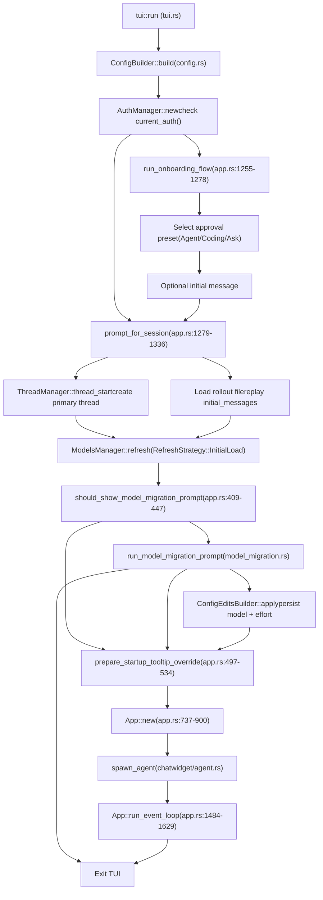
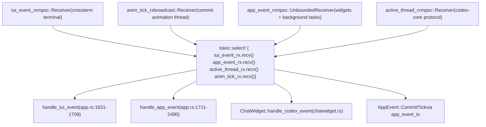
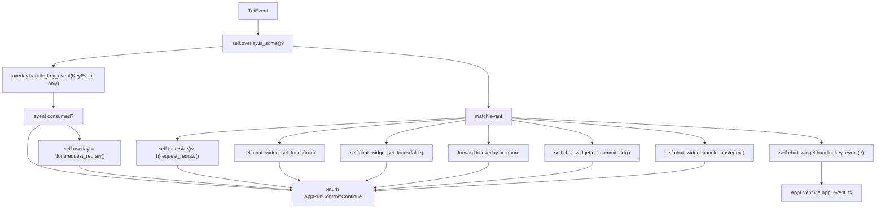
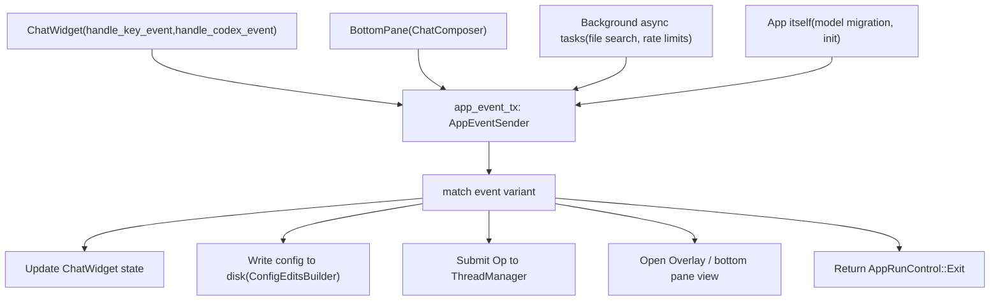
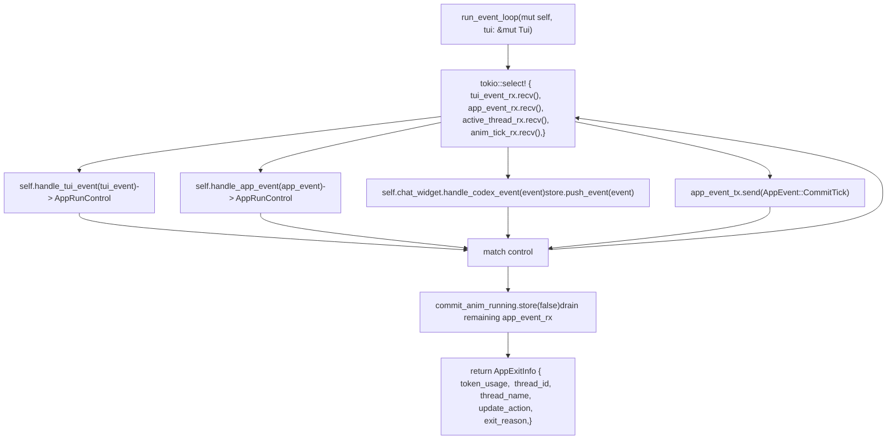
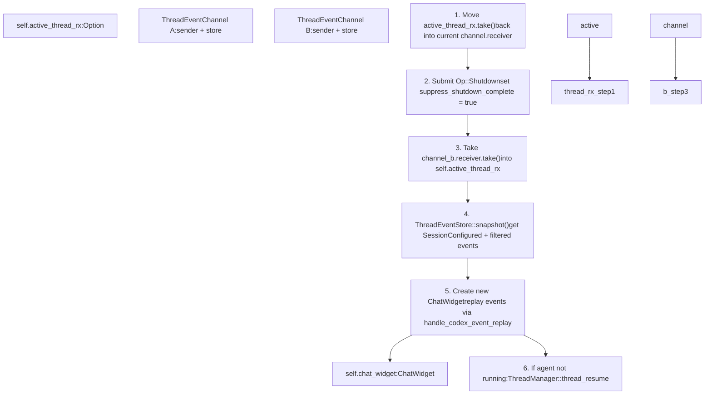
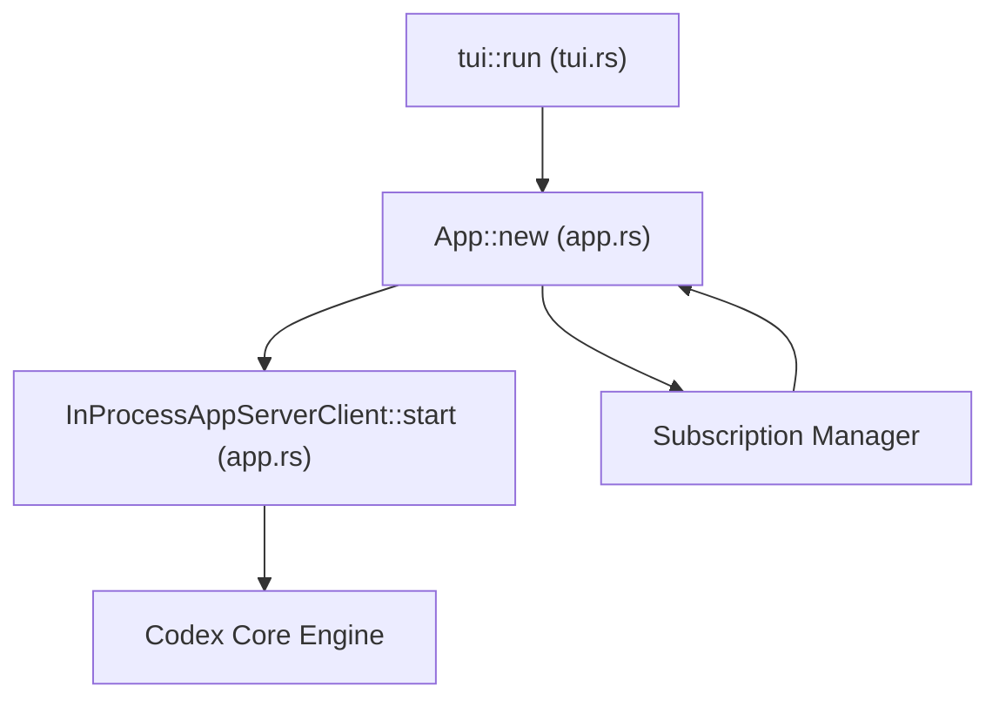

# App 事件循环与初始化

相关源文件

-   [codex-rs/clippy.toml](https://github.com/openai/codex/blob/d807d44a/codex-rs/clippy.toml)
-   [codex-rs/core/src/codex.rs](https://github.com/openai/codex/blob/d807d44a/codex-rs/core/src/codex.rs)
-   [codex-rs/core/src/rollout/policy.rs](https://github.com/openai/codex/blob/d807d44a/codex-rs/core/src/rollout/policy.rs)
-   [codex-rs/exec/src/event\_processor.rs](https://github.com/openai/codex/blob/d807d44a/codex-rs/exec/src/event_processor.rs)
-   [codex-rs/exec/src/event\_processor\_with\_human\_output.rs](https://github.com/openai/codex/blob/d807d44a/codex-rs/exec/src/event_processor_with_human_output.rs)
-   [codex-rs/mcp-server/src/codex\_tool\_runner.rs](https://github.com/openai/codex/blob/d807d44a/codex-rs/mcp-server/src/codex_tool_runner.rs)
-   [codex-rs/protocol/src/protocol.rs](https://github.com/openai/codex/blob/d807d44a/codex-rs/protocol/src/protocol.rs)
-   [codex-rs/tui/src/app.rs](https://github.com/openai/codex/blob/d807d44a/codex-rs/tui/src/app.rs)
-   [codex-rs/tui/src/app\_event.rs](https://github.com/openai/codex/blob/d807d44a/codex-rs/tui/src/app_event.rs)
-   [codex-rs/tui/src/bottom\_pane/chat\_composer.rs](https://github.com/openai/codex/blob/d807d44a/codex-rs/tui/src/bottom_pane/chat_composer.rs)
-   [codex-rs/tui/src/bottom\_pane/mod.rs](https://github.com/openai/codex/blob/d807d44a/codex-rs/tui/src/bottom_pane/mod.rs)
-   [codex-rs/tui/src/chatwidget.rs](https://github.com/openai/codex/blob/d807d44a/codex-rs/tui/src/chatwidget.rs)
-   [codex-rs/tui/src/chatwidget/tests.rs](https://github.com/openai/codex/blob/d807d44a/codex-rs/tui/src/chatwidget/tests.rs)
-   [codex-rs/tui/src/history\_cell.rs](https://github.com/openai/codex/blob/d807d44a/codex-rs/tui/src/history_cell.rs)
-   [codex-rs/tui/src/render/highlight.rs](https://github.com/openai/codex/blob/d807d44a/codex-rs/tui/src/render/highlight.rs)
-   [codex-rs/tui/src/render/snapshots/codex\_tui\_\_render\_\_highlight\_\_tests\_\_ansi\_family\_foreground\_palette.snap](https://github.com/openai/codex/blob/d807d44a/codex-rs/tui/src/render/snapshots/codex_tui__render__highlight__tests__ansi_family_foreground_palette.snap)
-   [codex-rs/tui/src/shimmer.rs](https://github.com/openai/codex/blob/d807d44a/codex-rs/tui/src/shimmer.rs)
-   [codex-rs/tui/src/slash\_command.rs](https://github.com/openai/codex/blob/d807d44a/codex-rs/tui/src/slash_command.rs)
-   [codex-rs/tui/src/snapshots/codex\_tui\_\_diff\_render\_\_tests\_\_theme\_scope\_background\_resolution.snap](https://github.com/openai/codex/blob/d807d44a/codex-rs/tui/src/snapshots/codex_tui__diff_render__tests__theme_scope_background_resolution.snap)
-   [codex-rs/tui/src/snapshots/codex\_tui\_\_pager\_overlay\_\_tests\_\_static\_overlay\_snapshot\_basic.snap](https://github.com/openai/codex/blob/d807d44a/codex-rs/tui/src/snapshots/codex_tui__pager_overlay__tests__static_overlay_snapshot_basic.snap)
-   [codex-rs/tui/src/style.rs](https://github.com/openai/codex/blob/d807d44a/codex-rs/tui/src/style.rs)
-   [codex-rs/tui/src/terminal\_palette.rs](https://github.com/openai/codex/blob/d807d44a/codex-rs/tui/src/terminal_palette.rs)
-   [codex-rs/tui/src/theme\_picker.rs](https://github.com/openai/codex/blob/d807d44a/codex-rs/tui/src/theme_picker.rs)
-   [codex-rs/tui/src/tui.rs](https://github.com/openai/codex/blob/d807d44a/codex-rs/tui/src/tui.rs)
-   [codex-rs/tui/src/tui/frame\_requester.rs](https://github.com/openai/codex/blob/d807d44a/codex-rs/tui/src/tui/frame_requester.rs)
-   [codex-rs/tui/styles.md](https://github.com/openai/codex/blob/d807d44a/codex-rs/tui/styles.md?plain=1)

## 目的与范围

本页记录了 TUI 中 `App` 结构体的主事件循环、初始化序列和事件分发机制。`App` 作为顶层编排器，负责协调终端 UI、管理多个会话线程，并在 UI 层与核心代理系统之间路由事件。

关于聊天界面渲染与协议事件处理的细节，请参见 [ChatWidget and Conversation Display](/openai/codex/4.1.2-chatwidget-and-conversation-display)。关于输入处理与 composer 状态，请参见 [BottomPane and Input System](/openai/codex/4.1.3-bottompane-and-input-system)。

---

## App 结构体

`App` 定义于 [codex-rs/tui/src/app.rs641-709](https://github.com/openai/codex/blob/d807d44a/codex-rs/tui/src/app.rs#L641-L709)，并持有顶层 TUI 状态。它协调终端 UI 渲染、多线程会话管理，以及 UI 层与 `codex-core` 之间的事件路由。`App` 下方的所有小部件都仅通过 `AppEvent` 消息与其通信。

### 核心字段

| 字段 | 类型 | 用途 |
| --- | --- | --- |
| `server` | `Arc<ThreadManager>` | 通过 `codex-core` 管理多个会话线程 |
| `session_telemetry` | `SessionTelemetry` | 跟踪会话级遥测与指标 |
| `app_event_tx` | `AppEventSender` | 小部件到应用通信的内部事件通道 |
| `chat_widget` | `ChatWidget` | 活跃聊天界面，会渲染会话 UI |
| `auth_manager` | `Arc<AuthManager>` | 认证状态与令牌刷新 |
| `config` | `Config` | 由所有层解析得到的配置 |
| `active_profile` | `Option<String>` | 用于作用域写入的活动配置 profile 名称 |
| `cli_kv_overrides` | `Vec<(String, TomlValue)>` | CLI `-c key=value` 覆盖项 |
| `file_search` | `FileSearchManager` | 用于 `@` 提及的异步文件搜索 |
| `transcript_cells` | `Vec<Arc<dyn HistoryCell>>` | transcript 覆盖层（`Ctrl+T`）的已提交历史 |
| `overlay` | `Option<Overlay>` | 全屏覆盖层（transcript、diff、picker） |
| `enhanced_keys_supported` | `bool` | 终端是否支持增强按键上报 |
| `commit_anim_running` | `Arc<AtomicBool>` | 控制后台 commit 动画线程 |
| `backtrack` | `BacktrackState` | Esc 回退状态（撤销/导航） |
| `suppress_shutdown_complete` | `bool` | 用于有意线程切换的一次性保护开关 |
| `pending_shutdown_exit_thread_id` | `Option<ThreadId>` | 其 `ShutdownComplete` 触发退出的线程 |
| `thread_event_channels` | `HashMap<ThreadId, ThreadEventChannel>` | 每线程事件缓冲（容量 32,768） |
| `thread_event_listener_tasks` | `HashMap<ThreadId, JoinHandle<()>>` | 监听线程事件的后台任务 |
| `active_thread_id` | `Option<ThreadId>` | 当前显示的线程 |
| `active_thread_rx` | `Option<mpsc::Receiver<Event>>` | 活动线程的协议事件接收器 |
| `primary_thread_id` | `Option<ThreadId>` | 用于子代理故障转移的主（根）线程 |
| `primary_session_configured` | `Option<SessionConfiguredEvent>` | 用于故障转移的主线程会话配置 |

来源： [codex-rs/tui/src/app.rs641-709](https://github.com/openai/codex/blob/d807d44a/codex-rs/tui/src/app.rs#L641-L709)

### 组件关系

**图：`App` 结构体字段与事件通道**

```mermaid
flowchart TD
    auth_manager["auth_manager: Arc<AuthManager>"]
    session_telemetry["session_telemetry: SessionTelemetry"]
    server["server: Arc<ThreadManager>"]
    chat_widget["chat_widget: ChatWidget"]
    file_search["file_search: FileSearchManager"]
    transcript_cells["transcript_cells: Vec<Arc<dyn HistoryCell>>"]
    overlay["overlay: Option<Overlay>"]
    thread_event_channels["thread_event_channels:HashMap<ThreadId, ThreadEventChannel>"]
    active_thread_rx["active_thread_rx:Option<mpsc::Receiver<Event>>"]
    backtrack["backtrack: BacktrackState"]
    app_event_tx["app_event_tx: AppEventSender"]
    codex_op_tx["ChatWidget.codex_op_tx:UnboundedSender<Op>"]
    bottom_pane["BottomPane"]
    composer["ChatComposer"]

    chat --> widget_bottom_pane
    bottom --> pane_composer
    active --> thread_rx_chat_widget
    codex --> op_tx_server
    AppStruct --> SharedServices
    AppStruct --> EventChannels
    app --> event_tx_AppStruct
```

来源： [codex-rs/tui/src/app.rs641-709](https://github.com/openai/codex/blob/d807d44a/codex-rs/tui/src/app.rs#L641-L709) [codex-rs/tui/src/chatwidget.rs542-544](https://github.com/openai/codex/blob/d807d44a/codex-rs/tui/src/chatwidget.rs#L542-L544)

`App` 为活动线程持有单个 `ChatWidget` 实例。在线程切换时，`App` 会创建新的 `ChatWidget`，并从目标线程的 `ThreadEventStore` 重放缓冲事件。

---

## AppEventSender 与 AppEvent 消息总线

`AppEventSender` 定义于 [codex-rs/tui/src/app\_event\_sender.rs1-23](https://github.com/openai/codex/blob/d807d44a/codex-rs/tui/src/app_event_sender.rs#L1-L23)，是 `tokio::sync::mpsc::UnboundedSender<AppEvent>` 的可克隆包装。它为小部件和后台任务回传到 `App` 主循环提供通信通道。

该包装类型有两个目的：

-   作为具名、可检索抽象，便于发现所有事件发射点
-   防止小部件直接耦合到 `App` 内部实现

初始化期间，`AppEventSender` 的克隆会分发给：

-   `ChatWidget`（通过 `ChatWidgetInit`）
-   `BottomPane` 和 `ChatComposer`
-   `FileSearchManager` 及其他异步后台任务

来源： [codex-rs/tui/src/app\_event\_sender.rs1-23](https://github.com/openai/codex/blob/d807d44a/codex-rs/tui/src/app_event_sender.rs#L1-L23) [codex-rs/tui/src/chatwidget.rs469-485](https://github.com/openai/codex/blob/d807d44a/codex-rs/tui/src/chatwidget.rs#L469-L485) [codex-rs/tui/src/bottom\_pane/mod.rs202-223](https://github.com/openai/codex/blob/d807d44a/codex-rs/tui/src/bottom_pane/mod.rs#L202-L223)

### AppEvent 变体

`AppEvent` 定义于 [codex-rs/tui/src/app\_event.rs70-300](https://github.com/openai/codex/blob/d807d44a/codex-rs/tui/src/app_event.rs#L70-L300)。下面按功能分组其变体：

**协议转发**

| 变体 | 描述 |
| --- | --- |
| `CodexEvent(Event)` | 来自 codex-core 的原始协议事件，路由到活动 `ChatWidget` |
| `CodexOp(Op)` | 将 `Op` 转发给当前代理，无需穿透小部件层 |
| `SubmitThreadOp { thread_id, op }` | 无论当前焦点如何，将 `Op` 提交到指定线程 |
| `ThreadEvent { thread_id, event }` | 将非主线程协议事件路由到应用级线程路由器 |

**会话与线程生命周期**

| 变体 | 描述 |
| --- | --- |
| `NewSession` | 关闭当前代理并启动新线程 |
| `ClearUi` | 清空终端与回滚缓存，启动新会话（保留可恢复性） |
| `OpenResumePicker` | 显示恢复选择器覆盖层 |
| `ForkCurrentSession` | 将当前会话分叉为新线程 |
| `OpenAgentPicker` | 打开多线程代理选择器 |
| `SelectAgentThread(ThreadId)` | 将活动线程切换到给定 ID |

**退出控制**

| 变体 | 描述 |
| --- | --- |
| `Exit(ExitMode)` | 请求退出。`ExitMode::ShutdownFirst` 触发优雅关闭；`ExitMode::Immediate` 跳过清理 |
| `FatalExitRequest(String)` | 发出致命错误信号；显示错误并退出 |

**异步任务结果**

| 变体 | 描述 |
| --- | --- |
| `StartFileSearch(String)` | 启动用于 `@`\-提及补全的异步文件搜索 |
| `FileSearchResult { query, matches }` | 将文件搜索结果回传到活动小部件 |
| `RateLimitSnapshotFetched(RateLimitSnapshot)` | 回传轮询得到的速率限制数据 |
| `ConnectorsLoaded { result, is_final }` | 回传预取的 app-connector 状态 |
| `DiffResult(String)` | 回传用于 diff 覆盖层的 git diff 字符串 |

**历史与渲染**

| 变体 | 描述 |
| --- | --- |
| `InsertHistoryCell(Box<dyn HistoryCell>)` | 向转录追加一个已渲染单元 |
| `ApplyThreadRollback { num_turns }` | 在线程回滚后裁剪转录单元 |
| `StartCommitAnimation` / `StopCommitAnimation` / `CommitTick` | 控制后台流式 commit 动画线程 |

**模型与配置更新**

| 变体 | 描述 |
| --- | --- |
| `UpdateModel(String)` | 更新运行中应用的活动模型 slug |
| `UpdateReasoningEffort(Option<ReasoningEffort>)` | 更新当前推理强度级别 |
| `UpdateCollaborationMode(CollaborationModeMask)` | 更新活动协作模式掩码 |
| `UpdatePersonality(Personality)` | 更新当前 personality |
| `PersistModelSelection { model, effort }` | 将模型与强度写入相应配置层 |
| `PersistPersonalitySelection { personality }` | 将 personality 选择写入配置 |
| `PersistServiceTierSelection { service_tier }` | 将 service tier 写入配置 |
| `PersistModelMigrationPromptAcknowledged { from_model, to_model }` | 记录模型迁移确认 |

**UI / 覆盖层动作**

| 变体 | 描述 |
| --- | --- |
| `OpenAppLink { app_id, ... }` | 在底部面板中打开 app-link 视图 |
| `OpenUrlInBrowser { url }` | 在默认浏览器中打开 URL |
| `RefreshConnectors { force_refetch }` | 触发 connector 状态刷新 |
| `OpenReasoningPopup { model }` | 打开 reasoning-effort 选择弹窗 |
| `OpenPlanReasoningScopePrompt { model, effort }` | 打开 plan 模式推理范围提示 |
| `OpenAllModelsPopup { models }` | 打开完整模型选择器覆盖层 |
| `OpenFullAccessConfirmation { preset, ... }` | 启用 full-access 沙箱模式前进行确认 |

**音频 / 实时**

| 变体 | 描述 |
| --- | --- |
| `OpenRealtimeAudioDeviceSelection { kind }` | 打开麦克风或扬声器设备选择器 |
| `PersistRealtimeAudioDeviceSelection { kind, name }` | 将音频设备选择写入顶层配置 |
| `RestartRealtimeAudioDevice { kind }` | 重启所选音频设备 |
| `TranscriptionFailed { id, error }` | 语音转写失败通知 |

来源： [codex-rs/tui/src/app\_event.rs70-300](https://github.com/openai/codex/blob/d807d44a/codex-rs/tui/src/app_event.rs#L70-L300)

---

## 初始化序列

TUI 初始化遵循多阶段序列，处理入门引导、认证、配置解析、会话选择与模型迁移提示。

### 初始化流程

**图：从 `tui::run` 到 `App::run_event_loop` 的 TUI 初始化序列**

来源： [codex-rs/tui/src/app.rs1184-1476](https://github.com/openai/codex/blob/d807d44a/codex-rs/tui/src/app.rs#L1184-L1476) [codex-rs/tui/src/app.rs737-900](https://github.com/openai/codex/blob/d807d44a/codex-rs/tui/src/app.rs#L737-L900) [codex-rs/tui/src/app.rs409-534](https://github.com/openai/codex/blob/d807d44a/codex-rs/tui/src/app.rs#L409-L534)

### 入门引导流程

对于首次运行用户或缺少认证的情况，TUI 会展示入门引导流程，引导用户完成：

1.  **认证**：通过 ChatGPT OAuth 登录或输入 API key
2.  **审批预设选择**：在 Agent、Coding、Ask 模式之间选择
3.  **初始消息输入**：可选提示，用于启动第一次会话

引导状态在 [codex-rs/cli/src/onboarding.rs](https://github.com/openai/codex/blob/d807d44a/codex-rs/cli/src/onboarding.rs) 中跟踪，并由 [codex-rs/tui/src/app.rs1255-1278](https://github.com/openai/codex/blob/d807d44a/codex-rs/tui/src/app.rs#L1255-L1278) 调用。引导成功后，TUI 继续进行会话创建。

来源： [codex-rs/tui/src/app.rs1255-1278](https://github.com/openai/codex/blob/d807d44a/codex-rs/tui/src/app.rs#L1255-L1278)

### 会话选择

认证通过后，用户会被提示选择启动新会话或恢复现有会话。恢复选择器会从 `$CODEX_HOME/session_index.jsonl` 加载会话索引，并显示线程元数据（名称、最近更新时间戳）。

若选择恢复，`App` 会通过以下方式重建会话：

1.  加载 rollout 文件（`$CODEX_HOME/sessions/<thread_id>.jsonl`）
2.  将初始消息重放到 `ChatWidget` 历史
3.  将工作目录设置为会话上次已知的 CWD

来源： [codex-rs/tui/src/app.rs1279-1336](https://github.com/openai/codex/blob/d807d44a/codex-rs/tui/src/app.rs#L1279-L1336)

### 模型迁移提示

模型列表刷新后，`App` 会检查已配置模型是否存在升级路径（例如 `gpt-4` → `gpt-5.1`）。若可升级且之前未确认，TUI 会展示包含升级细节的迁移提示。

用户可以：

-   **接受**：更新 `config.model` 与 `config.model_reasoning_effort`，持久化该选择，并记录迁移确认
-   **拒绝**：在不更改模型的情况下持久化确认状态
-   **退出**：立即退出 TUI

迁移状态记录在 `config.notices.model_migrations`（`from_model` → `to_model` 的映射）中，以避免重复提示。

来源： [codex-rs/tui/src/app.rs412-515](https://github.com/openai/codex/blob/d807d44a/codex-rs/tui/src/app.rs#L412-L515) [codex-rs/tui/src/model\_migration.rs](https://github.com/openai/codex/blob/d807d44a/codex-rs/tui/src/model_migration.rs)

---

## 事件循环架构

`App` 主循环会在轮询终端输入事件（`TuiEvent`）、处理内部应用事件（`AppEvent`）以及处理流式输出的 commit 动画 tick 之间交替执行。

### 事件源

**图：`App::run_event_loop` 中四路 `tokio::select!`**

来源： [codex-rs/tui/src/app.rs1484-1629](https://github.com/openai/codex/blob/d807d44a/codex-rs/tui/src/app.rs#L1484-L1629)

### TuiEvent 处理

`TuiEvent` 定义于 [codex-rs/tui/src/tui.rs45-58](https://github.com/openai/codex/blob/d807d44a/codex-rs/tui/src/tui.rs#L45-L58)，是终端后端（crossterm）产生的原始事件类型。其变体包含 `Key`、`Paste`、`Resize`、`FocusGained`、`FocusLost`、`Mouse`，以及用于流式动画的内部 `CommitTick`。

**图：`handle_tui_event` 分发路径（app.rs:1631-1709）**

来源： [codex-rs/tui/src/app.rs1631-1709](https://github.com/openai/codex/blob/d807d44a/codex-rs/tui/src/app.rs#L1631-L1709) [codex-rs/tui/src/tui.rs45-58](https://github.com/openai/codex/blob/d807d44a/codex-rs/tui/src/tui.rs#L45-L58)

### AppEvent 分发

`App` 通过 `handle_app_event` 处理 `AppEvent`，并根据事件变体分发到专用处理器。高频事件（例如 `InsertHistoryCell`、`CommitTick`）内联处理。复杂流程（例如 `OpenResumePicker`、`ForkCurrentSession`）调用专用异步方法。

**图：`AppEvent` 的发射源与 `handle_app_event` 中的处理目标**

来源： [codex-rs/tui/src/app.rs1711-2490](https://github.com/openai/codex/blob/d807d44a/codex-rs/tui/src/app.rs#L1711-L2490) [codex-rs/tui/src/app\_event.rs70-300](https://github.com/openai/codex/blob/d807d44a/codex-rs/tui/src/app_event.rs#L70-L300)

### 主循环结构

`App::run_event_loop`（app.rs:1484-1629）实现了四路 `tokio::select!` 轮询：

1.  `tui_event_rx` — 来自 crossterm 的终端事件
2.  `app_event_rx` — 小部件与后台任务事件
3.  `active_thread_rx` — 来自 `codex-core` 的协议事件
4.  `anim_tick_rx` — commit 动画 tick（若启用）

**图：`run_event_loop` 控制流（app.rs:1484-1629）**

`AppRunControl`（app.rs:156-159）有两个变体：`Continue` 和 `Exit(ExitReason)`。`ExitReason`（app.rs:162-165）是 `UserRequested` 或 `Fatal(String)`。`AppExitInfo`（app.rs:135-152）为调用方携带会话摘要数据。

来源： [codex-rs/tui/src/app.rs135-165](https://github.com/openai/codex/blob/d807d44a/codex-rs/tui/src/app.rs#L135-L165) [codex-rs/tui/src/app.rs1484-1629](https://github.com/openai/codex/blob/d807d44a/codex-rs/tui/src/app.rs#L1484-L1629)

---

## 多线程支持

`App` 通过 `ThreadManager` 与按线程划分的事件缓冲系统支持多个并发会话线程。这让用户在线程间切换时不会丢失事件历史。

### 线程事件通道

每个线程都有专用的 `ThreadEventChannel`（app.rs:381-407）：

| 字段 | 类型 | 用途 |
| --- | --- | --- |
| `sender` | `mpsc::Sender<Event>` | 接收来自 `codex-core` 代理的协议事件 |
| `receiver` | `Option<mpsc::Receiver<Event>>` | 活动线程持有 receiver；非活动时为 `None` |
| `store` | `Arc<Mutex<ThreadEventStore>>` | 非活动线程的有界缓冲（容量 32,768） |

`THREAD_EVENT_CHANNEL_CAPACITY` 定义在 app.rs:122，值为 `32768`。当线程**活动**时，其 receiver 会移动到 `App::active_thread_rx`，事件直接流入 `ChatWidget::handle_codex_event`。当线程**非活动**时，后台任务（`spawn_event_listener`）会将事件缓冲到 `ThreadEventStore`。

`ThreadEventStore`（app.rs:270-378）跟踪：

| 字段 | 用途 |
| --- | --- |
| `session_configured: Option<Event>` | 最近一次 `SessionConfigured`（始终保留，不会被驱逐） |
| `buffer: VecDeque<Event>` | 环形缓冲（满时淘汰最旧事件） |
| `user_message_ids: HashSet<String>` | 按 ID 对 `UserMessage` 事件去重 |
| `pending_interactive_replay` | `PendingInteractiveReplayState` — 为重放过滤事件（待审批） |
| `input_state: Option<ThreadInputState>` | 捕获 composer 状态用于线程恢复 |

来源： [codex-rs/tui/src/app.rs122](https://github.com/openai/codex/blob/d807d44a/codex-rs/tui/src/app.rs#L122-L122) [codex-rs/tui/src/app.rs270-407](https://github.com/openai/codex/blob/d807d44a/codex-rs/tui/src/app.rs#L270-L407)

### 线程切换流程

`App::handle_select_agent_thread`（app.rs:2492-2636）实现线程切换：

1.  **保存活动接收器**：将 `self.active_thread_rx` 移回当前线程的 `ThreadEventChannel.receiver`
2.  **关闭当前代理**：提交 `Op::Shutdown` 并设置 `self.suppress_shutdown_complete = true`
3.  **激活目标接收器**：将目标线程的 `receiver` 取出到 `self.active_thread_rx`
4.  **重放缓冲事件**：调用 `ThreadEventStore::snapshot()`（app.rs:344-361）获取 `SessionConfigured` + 过滤事件，创建新的 `ChatWidget`，并通过 `handle_codex_event_replay` 重放
5.  **按需恢复代理**：若代理未运行，调用 `ThreadManager::thread_resume`

`suppress_shutdown_complete` 可防止 `ShutdownComplete` 触发子代理故障转移逻辑（app.rs:688）。`pending_shutdown_exit_thread_id` 跟踪用户触发的退出，使 `ShutdownComplete` 导致进程退出而非故障转移（app.rs:697）。

**图：`handle_select_agent_thread` 中的线程切换流程（app.rs:2492-2636）**

来源： [codex-rs/tui/src/app.rs2492-2636](https://github.com/openai/codex/blob/d807d44a/codex-rs/tui/src/app.rs#L2492-L2636) [codex-rs/tui/src/app.rs344-361](https://github.com/openai/codex/blob/d807d44a/codex-rs/tui/src/app.rs#L344-L361) [codex-rs/tui/src/app.rs688-697](https://github.com/openai/codex/blob/d807d44a/codex-rs/tui/src/app.rs#L688-L697)

---

## 关键事件处理器

`App::handle_app_event`（app.rs:1711-2490）会将 `AppEvent` 变体分发给专门处理方法：

### 会话生命周期事件

| 事件 | 处理器 | 动作 |
| --- | --- | --- |
| `NewSession` | `handle_new_session`（app.rs:1903-1936） | 关闭当前代理，运行引导流程，创建新线程 |
| `OpenResumePicker` | `handle_open_resume_picker`（app.rs:1937-1971） | 关闭当前代理，显示恢复选择器覆盖层 |
| `SelectAgentThread(id)` | `handle_select_agent_thread`（app.rs:2492-2636） | 线程切换流程：保存接收器、关闭、重放事件 |
| `ForkCurrentSession` | `handle_fork_current_session`（app.rs:1972-1980） | 提交 `Op::Fork`，创建新的 `ThreadEventChannel` |
| `ClearUi` | `handle_clear_ui`（app.rs:1981-1991） | 清空终端 + 回滚缓存，`Op::Shutdown`，启动新会话 |

来源： [codex-rs/tui/src/app.rs1903-1991](https://github.com/openai/codex/blob/d807d44a/codex-rs/tui/src/app.rs#L1903-L1991) [codex-rs/tui/src/app.rs2492-2636](https://github.com/openai/codex/blob/d807d44a/codex-rs/tui/src/app.rs#L2492-L2636)

### 配置事件

| 事件 | 处理器 | 动作 |
| --- | --- | --- |
| `UpdateModel(slug)` | `handle_update_model`（app.rs:2094-2110） | 更新 `config.model`，调用 `chat_widget.update_model` |
| `UpdateReasoningEffort(effort)` | 内联（app.rs:1793） | 调用 `chat_widget.update_reasoning_effort` |
| `PersistModelSelection { model, effort }` | `handle_persist_model_selection`（app.rs:2073-2093） | `ConfigEditsBuilder::set_model_selection`，写入活动 profile 或全局 |
| `PersistModelMigrationPromptAcknowledged` | `handle_persist_model_migration`（app.rs:2241-2270） | 将 `from_model -> to_model` 追加到 `config.notices.model_migrations` 映射 |
| `UpdateCollaborationMode(mask)` | 内联（app.rs:1795） | 调用 `chat_widget.update_collaboration_mode(mask)` |

来源： [codex-rs/tui/src/app.rs1793-1795](https://github.com/openai/codex/blob/d807d44a/codex-rs/tui/src/app.rs#L1793-L1795) [codex-rs/tui/src/app.rs2073-2270](https://github.com/openai/codex/blob/d807d44a/codex-rs/tui/src/app.rs#L2073-L2270)

### 异步任务事件

| 事件 | 处理器 | 动作 |
| --- | --- | --- |
| `StartFileSearch(query)` | `handle_start_file_search`（app.rs:1862-1878） | 取消先前搜索，启动 `FileSearchManager::search` |
| `FileSearchResult { query, matches }` | `handle_file_search_result`（app.rs:1845-1861） | 若查询匹配，则转发到 `chat_widget.complete_file_search` |
| `DiffResult(diff)` | `handle_diff_result`（app.rs:2637-2643） | 创建静态 `Overlay::new(diff)`，全屏显示 |
| `RefreshConnectors { force_refetch }` | `handle_refresh_connectors`（app.rs:2644-2755） | 启动 `connectors::get_connectors`，发出 `AppEvent::ConnectorsLoaded` |
| `RateLimitSnapshotFetched(snapshot)` | 内联（app.rs:1758） | 调用 `chat_widget.update_rate_limit_snapshot(snapshot)` |

来源： [codex-rs/tui/src/app.rs1758](https://github.com/openai/codex/blob/d807d44a/codex-rs/tui/src/app.rs#L1758-L1758) [codex-rs/tui/src/app.rs1845-1878](https://github.com/openai/codex/blob/d807d44a/codex-rs/tui/src/app.rs#L1845-L1878) [codex-rs/tui/src/app.rs2637-2755](https://github.com/openai/codex/blob/d807d44a/codex-rs/tui/src/app.rs#L2637-L2755)

### 退出与错误处理

| 事件 | 处理器 | 动作 |
| --- | --- | --- |
| `Exit(ExitMode::ShutdownFirst)` | `handle_exit`（app.rs:1992-2022） | 设置 `pending_shutdown_exit_thread_id`，提交 `Op::Shutdown`；在 `run_event_loop` 中等待 `ShutdownComplete` |
| `Exit(ExitMode::Immediate)` | `handle_exit`（app.rs:1992-2022） | 立即返回 `AppRunControl::Exit(UserRequested)`，跳过清理 |
| `FatalExitRequest(msg)` | 内联（app.rs:1721-1723） | 返回 `AppRunControl::Exit(Fatal(msg))`，向用户显示错误 |

`ExitMode::ShutdownFirst`（app\_event.rs:464-465）确保 codex-core flush rollout 并清理子进程。`pending_shutdown_exit_thread_id`（app.rs:697）用于区分用户触发的关闭与意外代理死亡——只有匹配线程的 `ShutdownComplete` 才会触发退出。`EventMsg::ShutdownComplete` 的处理（app.rs:1812-1837）会检查该字段。

来源： [codex-rs/tui/src/app.rs697](https://github.com/openai/codex/blob/d807d44a/codex-rs/tui/src/app.rs#L697-L697) [codex-rs/tui/src/app.rs1721-1723](https://github.com/openai/codex/blob/d807d44a/codex-rs/tui/src/app.rs#L1721-L1723) [codex-rs/tui/src/app.rs1812-1837](https://github.com/openai/codex/blob/d807d44a/codex-rs/tui/src/app.rs#L1812-L1837) [codex-rs/tui/src/app.rs1992-2022](https://github.com/openai/codex/blob/d807d44a/codex-rs/tui/src/app.rs#L1992-L2022) [codex-rs/tui/src/app\_event.rs464-465](https://github.com/openai/codex/blob/d807d44a/codex-rs/tui/src/app_event.rs#L464-L465)

---

## 状态同步

`App` 通过以下同步模式在 `ChatWidget` 状态与共享服务之间保持一致性：

| 触发器 | 机制 | 效果 |
| --- | --- | --- |
| 配置写入 | `ConfigEditsBuilder::apply()` 然后 `rebuild_config_for_cwd()` | 从磁盘重载配置，调用 `ChatWidget::reload_config` |
| 模型列表刷新 | `ModelsManager::refresh()` | 将更新后的 `Vec<ModelPreset>` 转发到 `ChatWidget::set_available_models` |
| Git 分支查询 | 异步任务 → `AppEvent::StatusLineBranchUpdated` | 更新 `ChatWidget` 状态行分支显示 |
| 会话已配置 | `EventMsg::SessionConfigured` → `ChatWidget::handle_codex_event` | 基于 core 的真实状态同步 `config.cwd`、`approval_policy`、`sandbox_policy` |
| 速率限制数据 | `AppEvent::RateLimitSnapshotFetched` | 将快照转发给 `ChatWidget` 以显示在状态行 |

这些钩子确保 UI 状态反映最新共享状态，而无需 `ChatWidget` 直接轮询服务。

来源： [codex-rs/tui/src/app.rs704-744](https://github.com/openai/codex/blob/d807d44a/codex-rs/tui/src/app.rs#L704-L744) [codex-rs/tui/src/app.rs2299-2318](https://github.com/openai/codex/blob/d807d44a/codex-rs/tui/src/app.rs#L2299-L2318)

---

## 全局会话状态

`App` 在线程生命周期内跟踪全局会话状态：

-   **`primary_session_configured`**：来自主线程的 `SessionConfiguredEvent`。当子代理意外退出且重新激活主线程时，作为回退状态。
-   **`pending_primary_events`**：当子代理活动时，为主线程接收事件的队列。主线程重新获得焦点后会排空并重放。
-   **`agent_picker_threads`**：`HashMap<ThreadId, AgentPickerThreadEntry>`，跟踪代理选择器 UI 中所有已知线程（主线程 + 子代理）。每个条目包含显示名、状态指示（running/idle/dead）和待审批状态。
-   **`active_profile`**：当前生效的配置 profile 名称，用于将配置写入限定到正确层。

这些字段支撑多代理体验，使多个线程可同时运行，且用户可在线程间切换。

来源： [codex-rs/tui/src/app.rs685-695](https://github.com/openai/codex/blob/d807d44a/codex-rs/tui/src/app.rs#L685-L695)

---

## InProcessAppServerClient 与启动流程

TUI 使用 `InProcessAppServerClient` [codex-rs/tui/src/app.rs43](https://github.com/openai/codex/blob/d807d44a/codex-rs/tui/src/app.rs#L43-L43) 将 UI 桥接到内嵌的 `AppServer` 实例。该客户端在启动流程中使用 `InProcessClientStartArgs` [codex-rs/tui/src/app.rs44](https://github.com/openai/codex/blob/d807d44a/codex-rs/tui/src/app.rs#L44-L44) 初始化。

TUI 启动时会调用 `InProcessAppServerClient::start` [codex-rs/tui/src/app.rs1338-1358](https://github.com/openai/codex/blob/d807d44a/codex-rs/tui/src/app.rs#L1338-L1358)，在同一进程内初始化核心代理引擎。这确保 TUI 能直接订阅线程事件，并通过高性能进程内通道提交操作 [codex-rs/tui/src/app.rs42](https://github.com/openai/codex/blob/d807d44a/codex-rs/tui/src/app.rs#L42-L42)

**图：进程内 App Server 初始化**

来源： [codex-rs/tui/src/app.rs42-44](https://github.com/openai/codex/blob/d807d44a/codex-rs/tui/src/app.rs#L42-L44) [codex-rs/tui/src/app.rs1338-1358](https://github.com/openai/codex/blob/d807d44a/codex-rs/tui/src/app.rs#L1338-L1358)

---

## 总结

`App` 事件循环协调终端输入、内部应用事件以及来自 codex-core 的协议事件。初始化流程在进入主循环前处理入门引导、会话选择和模型迁移。多线程支持通过事件缓冲与重放实现会话间切换。专用事件处理器负责编排组件与共享服务之间的状态变化。
