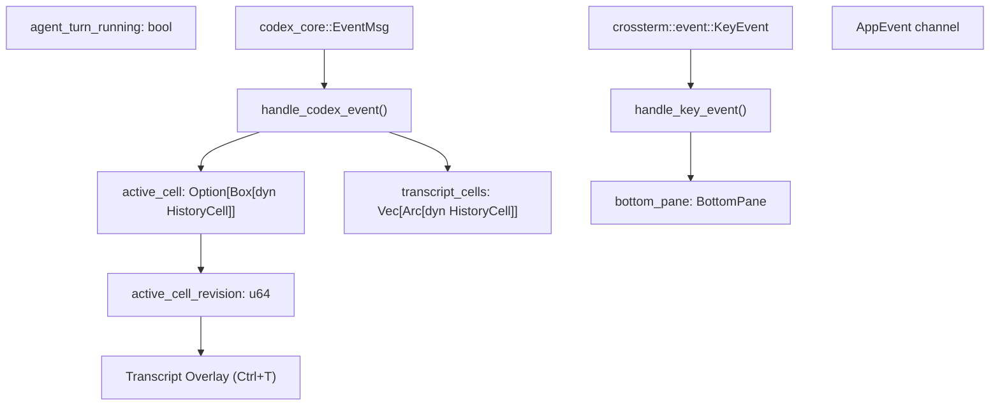

# ChatWidget 与会话展示

相关源文件

-   [codex-rs/core/src/codex.rs](https://github.com/openai/codex/blob/d807d44a/codex-rs/core/src/codex.rs)
-   [codex-rs/core/src/rollout/policy.rs](https://github.com/openai/codex/blob/d807d44a/codex-rs/core/src/rollout/policy.rs)
-   [codex-rs/exec/src/event\_processor.rs](https://github.com/openai/codex/blob/d807d44a/codex-rs/exec/src/event_processor.rs)
-   [codex-rs/exec/src/event\_processor\_with\_human\_output.rs](https://github.com/openai/codex/blob/d807d44a/codex-rs/exec/src/event_processor_with_human_output.rs)
-   [codex-rs/mcp-server/src/codex\_tool\_runner.rs](https://github.com/openai/codex/blob/d807d44a/codex-rs/mcp-server/src/codex_tool_runner.rs)
-   [codex-rs/protocol/src/protocol.rs](https://github.com/openai/codex/blob/d807d44a/codex-rs/protocol/src/protocol.rs)
-   [codex-rs/tui/src/app.rs](https://github.com/openai/codex/blob/d807d44a/codex-rs/tui/src/app.rs)
-   [codex-rs/tui/src/app\_backtrack.rs](https://github.com/openai/codex/blob/d807d44a/codex-rs/tui/src/app_backtrack.rs)
-   [codex-rs/tui/src/app\_event.rs](https://github.com/openai/codex/blob/d807d44a/codex-rs/tui/src/app_event.rs)
-   [codex-rs/tui/src/bottom\_pane/app\_link\_view.rs](https://github.com/openai/codex/blob/d807d44a/codex-rs/tui/src/bottom_pane/app_link_view.rs)
-   [codex-rs/tui/src/bottom\_pane/chat\_composer.rs](https://github.com/openai/codex/blob/d807d44a/codex-rs/tui/src/bottom_pane/chat_composer.rs)
-   [codex-rs/tui/src/bottom\_pane/mod.rs](https://github.com/openai/codex/blob/d807d44a/codex-rs/tui/src/bottom_pane/mod.rs)
-   [codex-rs/tui/src/chatwidget.rs](https://github.com/openai/codex/blob/d807d44a/codex-rs/tui/src/chatwidget.rs)
-   [codex-rs/tui/src/chatwidget/snapshots/codex\_tui\_\_chatwidget\_\_tests\_\_deltas\_then\_same\_final\_message\_are\_rendered\_snapshot.snap](https://github.com/openai/codex/blob/d807d44a/codex-rs/tui/src/chatwidget/snapshots/codex_tui__chatwidget__tests__deltas_then_same_final_message_are_rendered_snapshot.snap)
-   [codex-rs/tui/src/chatwidget/snapshots/codex\_tui\_\_chatwidget\_\_tests\_\_final\_reasoning\_then\_message\_without\_deltas\_are\_rendered.snap](https://github.com/openai/codex/blob/d807d44a/codex-rs/tui/src/chatwidget/snapshots/codex_tui__chatwidget__tests__final_reasoning_then_message_without_deltas_are_rendered.snap)
-   [codex-rs/tui/src/chatwidget/snapshots/codex\_tui\_\_chatwidget\_\_tests\_\_unified\_exec\_unknown\_end\_with\_active\_exploring\_cell.snap](https://github.com/openai/codex/blob/d807d44a/codex-rs/tui/src/chatwidget/snapshots/codex_tui__chatwidget__tests__unified_exec_unknown_end_with_active_exploring_cell.snap)
-   [codex-rs/tui/src/chatwidget/snapshots/codex\_tui\_\_chatwidget\_\_tests\_\_user\_shell\_ls\_output.snap](https://github.com/openai/codex/blob/d807d44a/codex-rs/tui/src/chatwidget/snapshots/codex_tui__chatwidget__tests__user_shell_ls_output.snap)
-   [codex-rs/tui/src/chatwidget/tests.rs](https://github.com/openai/codex/blob/d807d44a/codex-rs/tui/src/chatwidget/tests.rs)
-   [codex-rs/tui/src/exec\_cell/model.rs](https://github.com/openai/codex/blob/d807d44a/codex-rs/tui/src/exec_cell/model.rs)
-   [codex-rs/tui/src/exec\_cell/render.rs](https://github.com/openai/codex/blob/d807d44a/codex-rs/tui/src/exec_cell/render.rs)
-   [codex-rs/tui/src/history\_cell.rs](https://github.com/openai/codex/blob/d807d44a/codex-rs/tui/src/history_cell.rs)
-   [codex-rs/tui/src/insert\_history.rs](https://github.com/openai/codex/blob/d807d44a/codex-rs/tui/src/insert_history.rs)
-   [codex-rs/tui/src/markdown.rs](https://github.com/openai/codex/blob/d807d44a/codex-rs/tui/src/markdown.rs)
-   [codex-rs/tui/src/markdown\_render.rs](https://github.com/openai/codex/blob/d807d44a/codex-rs/tui/src/markdown_render.rs)
-   [codex-rs/tui/src/markdown\_render\_tests.rs](https://github.com/openai/codex/blob/d807d44a/codex-rs/tui/src/markdown_render_tests.rs)
-   [codex-rs/tui/src/markdown\_stream.rs](https://github.com/openai/codex/blob/d807d44a/codex-rs/tui/src/markdown_stream.rs)
-   [codex-rs/tui/src/pager\_overlay.rs](https://github.com/openai/codex/blob/d807d44a/codex-rs/tui/src/pager_overlay.rs)
-   [codex-rs/tui/src/render/mod.rs](https://github.com/openai/codex/blob/d807d44a/codex-rs/tui/src/render/mod.rs)
-   [codex-rs/tui/src/render/renderable.rs](https://github.com/openai/codex/blob/d807d44a/codex-rs/tui/src/render/renderable.rs)
-   [codex-rs/tui/src/slash\_command.rs](https://github.com/openai/codex/blob/d807d44a/codex-rs/tui/src/slash_command.rs)
-   [codex-rs/tui/src/snapshots/codex\_tui\_\_markdown\_render\_\_markdown\_render\_tests\_\_markdown\_render\_file\_link\_snapshot.snap](https://github.com/openai/codex/blob/d807d44a/codex-rs/tui/src/snapshots/codex_tui__markdown_render__markdown_render_tests__markdown_render_file_link_snapshot.snap)
-   [codex-rs/tui/src/snapshots/codex\_tui\_\_pager\_overlay\_\_tests\_\_transcript\_overlay\_renders\_live\_tail.snap](https://github.com/openai/codex/blob/d807d44a/codex-rs/tui/src/snapshots/codex_tui__pager_overlay__tests__transcript_overlay_renders_live_tail.snap)
-   [codex-rs/tui/src/snapshots/codex\_tui\_\_pager\_overlay\_\_tests\_\_transcript\_overlay\_snapshot\_basic.snap](https://github.com/openai/codex/blob/d807d44a/codex-rs/tui/src/snapshots/codex_tui__pager_overlay__tests__transcript_overlay_snapshot_basic.snap)
-   [codex-rs/tui/src/streaming/controller.rs](https://github.com/openai/codex/blob/d807d44a/codex-rs/tui/src/streaming/controller.rs)
-   [codex-rs/tui/src/streaming/mod.rs](https://github.com/openai/codex/blob/d807d44a/codex-rs/tui/src/streaming/mod.rs)
-   [codex-rs/tui/src/wrapping.rs](https://github.com/openai/codex/blob/d807d44a/codex-rs/tui/src/wrapping.rs)

## 目的与范围

本页记录 `ChatWidget` 组件。该组件拥有会话历史展示，并协调 TUI 中主聊天视口。它管理历史单元（已提交的 transcript 条目）、用于流式内容的进行中 active cell，以及来自 `codex-core` 的事件处理。关于输入处理与 composer，请参见 [BottomPane and Input System](/openai/codex/4.1.3-bottompane-and-input-system)。关于整体 TUI 事件循环，请参见 [App Event Loop and Initialization](/openai/codex/4.1.1-app-event-loop-and-initialization)。

---

## ChatWidget 架构

### 核心结构

`ChatWidget` 是会话展示的有状态容器。它消费协议事件，构建并更新历史单元，并驱动主视口与覆盖层 UI 的渲染 [codex-rs/tui/src/chatwidget.rs1-4](https://github.com/openai/codex/blob/d807d44a/codex-rs/tui/src/chatwidget.rs#L1-L4)

**关键职责：**

-   维护已提交历史单元（已定稿的 `HistoryCell`） [codex-rs/tui/src/chatwidget.rs6-7](https://github.com/openai/codex/blob/d807d44a/codex-rs/tui/src/chatwidget.rs#L6-L7)
-   在流式过程中跟踪进行中的 `active_cell`（通常表示聚合后的 exec/tool 分组） [codex-rs/tui/src/chatwidget.rs7-10](https://github.com/openai/codex/blob/d807d44a/codex-rs/tui/src/chatwidget.rs#L7-L10)
-   处理来自 `codex-core` 的 `Event` 消息，并将其转换为 UI 状态 [codex-rs/tui/src/chatwidget.rs1344-1350](https://github.com/openai/codex/blob/d807d44a/codex-rs/tui/src/chatwidget.rs#L1344-L1350)
-   基于代理轮次与 MCP 启动状态，同步底部面板中的“任务运行中”指示器 [codex-rs/tui/src/chatwidget.rs18-22](https://github.com/openai/codex/blob/d807d44a/codex-rs/tui/src/chatwidget.rs#L18-L22)


**来源：** [codex-rs/tui/src/chatwidget.rs1-22](https://github.com/openai/codex/blob/d807d44a/codex-rs/tui/src/chatwidget.rs#L1-L22) [codex-rs/tui/src/chatwidget.rs515-665](https://github.com/openai/codex/blob/d807d44a/codex-rs/tui/src/chatwidget.rs#L515-L665) [codex-rs/tui/src/app.rs518-584](https://github.com/openai/codex/blob/d807d44a/codex-rs/tui/src/app.rs#L518-L584)

### 状态管理

该小部件维护多类状态以管理会话生命周期：

| 类别 | 字段 | 用途 |
| --- | --- | --- |
| **流式** | `active_cell`, `active_cell_revision` | 进行中的单元，以及覆盖层的缓存失效键 [codex-rs/tui/src/chatwidget.rs520-530](https://github.com/openai/codex/blob/d807d44a/codex-rs/tui/src/chatwidget.rs#L520-L530) |
| **历史** | 由 `App.transcript_cells` 持有 | 已提交会话历史 [codex-rs/tui/src/app.rs525-530](https://github.com/openai/codex/blob/d807d44a/codex-rs/tui/src/app.rs#L525-L530) |
| **输入** | `bottom_pane` | 提示 composer 与瞬态视图栈 [codex-rs/tui/src/chatwidget.rs518-520](https://github.com/openai/codex/blob/d807d44a/codex-rs/tui/src/chatwidget.rs#L518-L520) |
| **轮次状态** | `agent_turn_running`, `mcp_startup_status` | 生命周期独立跟踪，并通过 `update_task_running_state` 同步 [codex-rs/tui/src/chatwidget.rs20-22](https://github.com/openai/codex/blob/d807d44a/codex-rs/tui/src/chatwidget.rs#L20-L22) |
| **状态** | `current_status_header`, `token_info` | 轮次进度与 token 使用的可视指示 [codex-rs/tui/src/chatwidget.rs540-560](https://github.com/openai/codex/blob/d807d44a/codex-rs/tui/src/chatwidget.rs#L540-L560) |

**来源：** [codex-rs/tui/src/chatwidget.rs1-27](https://github.com/openai/codex/blob/d807d44a/codex-rs/tui/src/chatwidget.rs#L1-L27) [codex-rs/tui/src/chatwidget.rs515-665](https://github.com/openai/codex/blob/d807d44a/codex-rs/tui/src/chatwidget.rs#L515-L665)

---

## 历史单元管理

### HistoryCell trait

所有会话条目都实现 `HistoryCell` trait，它定义了单个可渲染会话历史单元的行为 [codex-rs/tui/src/history\_cell.rs89-98](https://github.com/openai/codex/blob/d807d44a/codex-rs/tui/src/history_cell.rs#L89-L98)


**关键方法：**

-   `display_lines`：返回主聊天视口的逻辑行 [codex-rs/tui/src/history\_cell.rs100](https://github.com/openai/codex/blob/d807d44a/codex-rs/tui/src/history_cell.rs#L100-L100)
-   `desired_height`：在字符换行后测量视口行数 [codex-rs/tui/src/history\_cell.rs109-112](https://github.com/openai/codex/blob/d807d44a/codex-rs/tui/src/history_cell.rs#L109-L112)
-   `transcript_lines`：用于 `Ctrl+T` 覆盖层的行；默认值为 `display_lines` [codex-rs/tui/src/history\_cell.rs122-124](https://github.com/openai/codex/blob/d807d44a/codex-rs/tui/src/history_cell.rs#L122-L124)
-   `transcript_animation_tick`：当输出与时间相关时（例如 spinner）返回粗粒度 tick，通知覆盖层刷新其缓存尾部 [codex-rs/tui/src/history\_cell.rs165-167](https://github.com/openai/codex/blob/d807d44a/codex-rs/tui/src/history_cell.rs#L165-L167)

**来源：** [codex-rs/tui/src/history\_cell.rs89-168](https://github.com/openai/codex/blob/d807d44a/codex-rs/tui/src/history_cell.rs#L89-L168)

### 单元生命周期

单元会从“active”（流式）状态转为“committed”（历史）状态。

> **[Mermaid sequence]**
> *(图表结构无法解析)*

**来源：** [codex-rs/tui/src/chatwidget.rs6-16](https://github.com/openai/codex/blob/d807d44a/codex-rs/tui/src/chatwidget.rs#L6-L16) [codex-rs/tui/src/chatwidget.rs1500-1550](https://github.com/openai/codex/blob/d807d44a/codex-rs/tui/src/chatwidget.rs#L1500-L1550) [codex-rs/tui/src/app.rs1227-1260](https://github.com/openai/codex/blob/d807d44a/codex-rs/tui/src/app.rs#L1227-L1260)

---

## Active Cell 流式机制

### 流式模型

`active_cell` 支持对流式内容进行原地变更。这对 `ExecCell` 尤为重要，因为它会将多个工具调用聚合到单个 UI 区块 [codex-rs/tui/src/chatwidget.rs6-10](https://github.com/openai/codex/blob/d807d44a/codex-rs/tui/src/chatwidget.rs#L6-L10)

**设计：**

-   **原地变更**：`active_cell` 是 `Option<Box<dyn HistoryCell>>`，会在 delta 到达时更新 [codex-rs/tui/src/chatwidget.rs520](https://github.com/openai/codex/blob/d807d44a/codex-rs/tui/src/chatwidget.rs#L520-L520)
-   **修订跟踪**：`active_cell_revision` 在单元变更时递增，作为覆盖层缓存失效键 [codex-rs/tui/src/chatwidget.rs12-16](https://github.com/openai/codex/blob/d807d44a/codex-rs/tui/src/chatwidget.rs#L12-L16)
-   **Commentary 处理**：对于支持 preamble 的模型，在 commentary 流式期间隐藏状态行，以避免视觉噪声 [codex-rs/tui/src/chatwidget.rs24-27](https://github.com/openai/codex/blob/d807d44a/codex-rs/tui/src/chatwidget.rs#L24-L27)

**来源：** [codex-rs/tui/src/chatwidget.rs6-27](https://github.com/openai/codex/blob/d807d44a/codex-rs/tui/src/chatwidget.rs#L6-L27) [codex-rs/tui/src/chatwidget.rs520-530](https://github.com/openai/codex/blob/d807d44a/codex-rs/tui/src/chatwidget.rs#L520-L530)

### 流式与缓存失效

transcript 覆盖层（`Ctrl+T`）会渲染已提交单元，并附加一个从当前 active cell 派生的缓存“实时尾部” [codex-rs/tui/src/chatwidget.rs8-10](https://github.com/openai/codex/blob/d807d44a/codex-rs/tui/src/chatwidget.rs#L8-L10)

```
// From chatwidget.rspub(crate) struct ActiveCellTranscriptKey {    pub(crate) revision: u64,    pub(crate) is_stream_continuation: bool,    pub(crate) animation_tick: Option<u64>,}
```
缓存键的设计目标是在 active cell 变更，或其输出与时间相关（例如活动工具 spinner）时发生变化 [codex-rs/tui/src/chatwidget.rs14-16](https://github.com/openai/codex/blob/d807d44a/codex-rs/tui/src/chatwidget.rs#L14-L16)

**来源：** [codex-rs/tui/src/chatwidget.rs8-16](https://github.com/openai/codex/blob/d807d44a/codex-rs/tui/src/chatwidget.rs#L8-L16) [codex-rs/tui/src/chatwidget.rs667-690](https://github.com/openai/codex/blob/d807d44a/codex-rs/tui/src/chatwidget.rs#L667-L690)

---

## 事件处理

### handle\_codex\_event

该函数是协议事件的主入口。它将 `EventMsg` 变体分发到特定处理器，以更新小部件状态 [codex-rs/tui/src/chatwidget.rs1344-1350](https://github.com/openai/codex/blob/d807d44a/codex-rs/tui/src/chatwidget.rs#L1344-L1350)

| 事件变体 | 处理动作 |
| --- | --- |
| `AgentMessageDelta` | 向 `active_cell` 中的 `AgentMessageCell` 追加文本 [codex-rs/tui/src/chatwidget.rs1515-1530](https://github.com/openai/codex/blob/d807d44a/codex-rs/tui/src/chatwidget.rs#L1515-L1530) |
| `ExecCommandBegin` | 在 `active_cell` 中初始化或追加 `ExecCell` 调用 [codex-rs/tui/src/chatwidget.rs1640-1660](https://github.com/openai/codex/blob/d807d44a/codex-rs/tui/src/chatwidget.rs#L1640-L1660) |
| `McpToolCallBegin` | 在 `active_cell` 中创建 `McpToolCallCell` [codex-rs/tui/src/chatwidget.rs1720-1740](https://github.com/openai/codex/blob/d807d44a/codex-rs/tui/src/chatwidget.rs#L1720-L1740) |
| `TurnComplete` | 取出 `active_cell` 并发出 `AppEvent::InsertHistoryCell` 以提交该单元 [codex-rs/tui/src/chatwidget.rs1880-1900](https://github.com/openai/codex/blob/d807d44a/codex-rs/tui/src/chatwidget.rs#L1880-L1900) |
| `ErrorEvent` | 创建包含错误详情的 `PlainHistoryCell` 并立即提交 [codex-rs/tui/src/chatwidget.rs1450-1470](https://github.com/openai/codex/blob/d807d44a/codex-rs/tui/src/chatwidget.rs#L1450-L1470) |

**来源：** [codex-rs/tui/src/chatwidget.rs1344-1900](https://github.com/openai/codex/blob/d807d44a/codex-rs/tui/src/chatwidget.rs#L1344-L1900) [codex-rs/protocol/src/protocol.rs178-250](https://github.com/openai/codex/blob/d807d44a/codex-rs/protocol/src/protocol.rs#L178-L250)

---

## Transcript 覆盖层

transcript 覆盖层通过 `App::overlay_forward_event` 保持同步 [codex-rs/tui/src/chatwidget.rs12](https://github.com/openai/codex/blob/d807d44a/codex-rs/tui/src/chatwidget.rs#L12-L12)。其机制如下：

1.  **实时尾部同步**：绘制期间，使用 `active_cell_transcript_lines()` 从当前 active cell 派生实时尾部 [codex-rs/tui/src/chatwidget.rs13](https://github.com/openai/codex/blob/d807d44a/codex-rs/tui/src/chatwidget.rs#L13-L13)
2.  **缓存渲染**：为避免每次绘制都重建整个尾部，会检查 `ActiveCellTranscriptKey` [codex-rs/tui/src/chatwidget.rs14-16](https://github.com/openai/codex/blob/d807d44a/codex-rs/tui/src/chatwidget.rs#L14-L16)
3.  **动画支持**：若单元（如 `ExecCell`）具有时间相关组件，`transcript_animation_tick()` 会确保即使没有新协议数据到达，覆盖层也会刷新 [codex-rs/tui/src/history\_cell.rs165-168](https://github.com/openai/codex/blob/d807d44a/codex-rs/tui/src/history_cell.rs#L165-L168)

**来源：** [codex-rs/tui/src/chatwidget.rs8-17](https://github.com/openai/codex/blob/d807d44a/codex-rs/tui/src/chatwidget.rs#L8-L17) [codex-rs/tui/src/history\_cell.rs165-168](https://github.com/openai/codex/blob/d807d44a/codex-rs/tui/src/history_cell.rs#L165-L168)

---

## 按键事件处理

`ChatWidget` 负责协调输入路由。高层意图（中断、退出）在此处理，而编辑行为委托给 `BottomPane` [codex-rs/tui/src/bottom\_pane/mod.rs7-12](https://github.com/openai/codex/blob/d807d44a/codex-rs/tui/src/bottom_pane/mod.rs#L7-L12)

-   **中断**：通过检查 `agent_turn_running` 并发出 `Op::Interrupt` 处理 [codex-rs/tui/src/chatwidget.rs18-20](https://github.com/openai/codex/blob/d807d44a/codex-rs/tui/src/chatwidget.rs#L18-L20)
-   **退出**：管理“再次按键退出”提示的生命周期 [codex-rs/tui/src/bottom\_pane/mod.rs14-15](https://github.com/openai/codex/blob/d807d44a/codex-rs/tui/src/bottom_pane/mod.rs#L14-L15)
-   **视图栈**：`BottomPane` 管理 `BottomPaneView` 栈（弹窗/模态），用于临时替换 composer [codex-rs/tui/src/bottom\_pane/mod.rs3-5](https://github.com/openai/codex/blob/d807d44a/codex-rs/tui/src/bottom_pane/mod.rs#L3-L5)

**来源：** [codex-rs/tui/src/chatwidget.rs18-22](https://github.com/openai/codex/blob/d807d44a/codex-rs/tui/src/chatwidget.rs#L18-L22) [codex-rs/tui/src/bottom\_pane/mod.rs1-15](https://github.com/openai/codex/blob/d807d44a/codex-rs/tui/src/bottom_pane/mod.rs#L1-L15)
