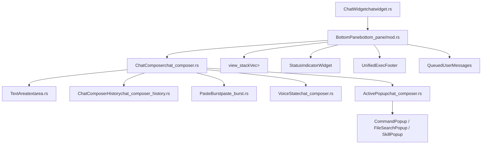
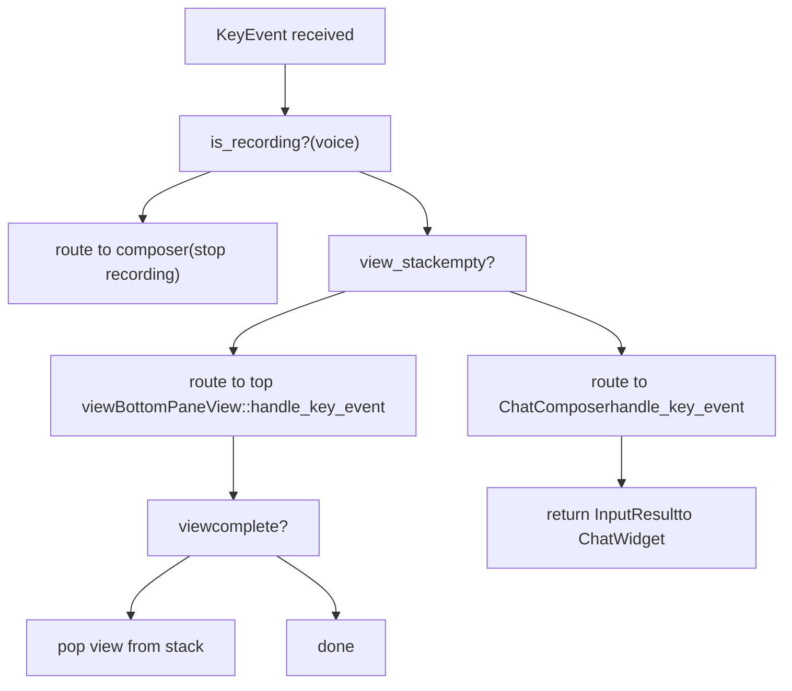
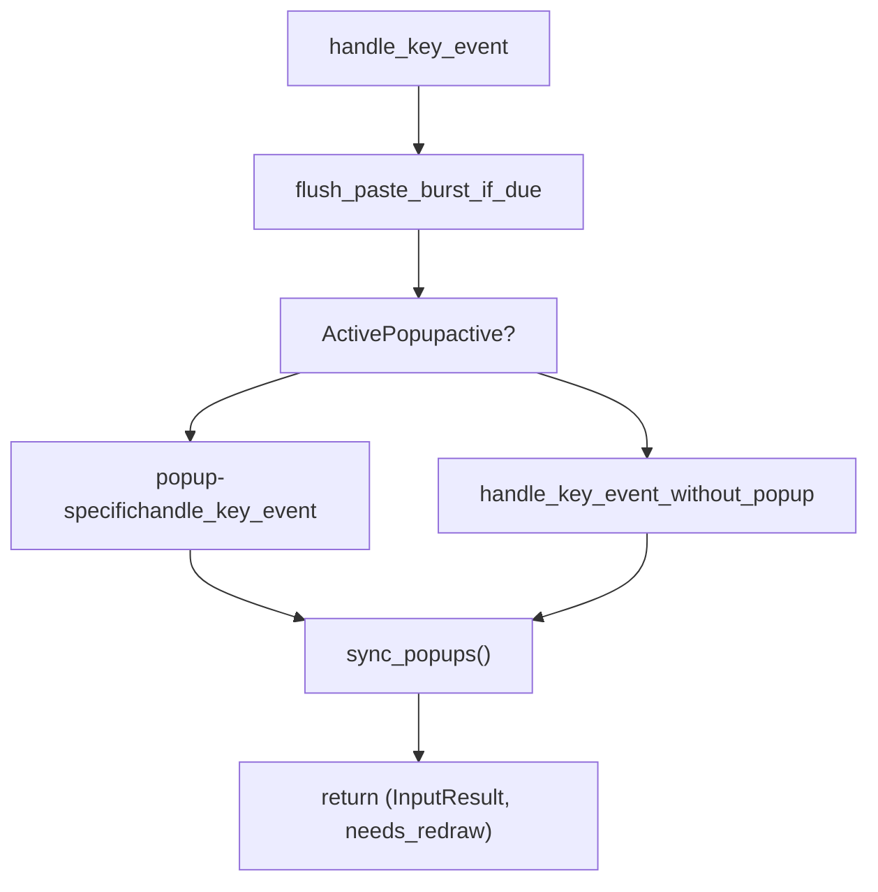
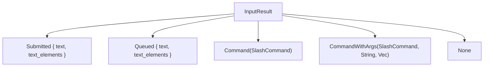
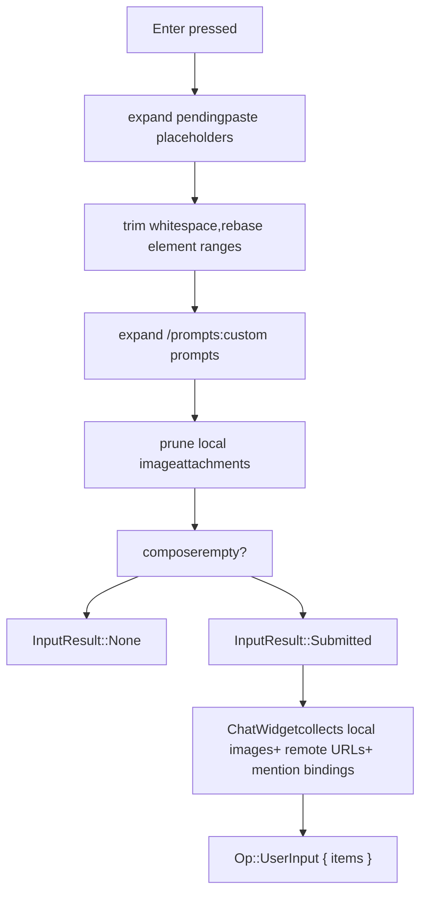

# BottomPane 与输入系统

相关源文件

-   [codex-rs/core/src/codex.rs](https://github.com/openai/codex/blob/d807d44a/codex-rs/core/src/codex.rs)
-   [codex-rs/core/src/rollout/policy.rs](https://github.com/openai/codex/blob/d807d44a/codex-rs/core/src/rollout/policy.rs)
-   [codex-rs/exec/src/event\_processor.rs](https://github.com/openai/codex/blob/d807d44a/codex-rs/exec/src/event_processor.rs)
-   [codex-rs/exec/src/event\_processor\_with\_human\_output.rs](https://github.com/openai/codex/blob/d807d44a/codex-rs/exec/src/event_processor_with_human_output.rs)
-   [codex-rs/mcp-server/src/codex\_tool\_runner.rs](https://github.com/openai/codex/blob/d807d44a/codex-rs/mcp-server/src/codex_tool_runner.rs)
-   [codex-rs/protocol/src/protocol.rs](https://github.com/openai/codex/blob/d807d44a/codex-rs/protocol/src/protocol.rs)
-   [codex-rs/tui/src/app.rs](https://github.com/openai/codex/blob/d807d44a/codex-rs/tui/src/app.rs)
-   [codex-rs/tui/src/app\_event.rs](https://github.com/openai/codex/blob/d807d44a/codex-rs/tui/src/app_event.rs)
-   [codex-rs/tui/src/bottom\_pane/chat\_composer.rs](https://github.com/openai/codex/blob/d807d44a/codex-rs/tui/src/bottom_pane/chat_composer.rs)
-   [codex-rs/tui/src/bottom\_pane/command\_popup.rs](https://github.com/openai/codex/blob/d807d44a/codex-rs/tui/src/bottom_pane/command_popup.rs)
-   [codex-rs/tui/src/bottom\_pane/file\_search\_popup.rs](https://github.com/openai/codex/blob/d807d44a/codex-rs/tui/src/bottom_pane/file_search_popup.rs)
-   [codex-rs/tui/src/bottom\_pane/footer.rs](https://github.com/openai/codex/blob/d807d44a/codex-rs/tui/src/bottom_pane/footer.rs)
-   [codex-rs/tui/src/bottom\_pane/list\_selection\_view.rs](https://github.com/openai/codex/blob/d807d44a/codex-rs/tui/src/bottom_pane/list_selection_view.rs)
-   [codex-rs/tui/src/bottom\_pane/mod.rs](https://github.com/openai/codex/blob/d807d44a/codex-rs/tui/src/bottom_pane/mod.rs)
-   [codex-rs/tui/src/bottom\_pane/selection\_popup\_common.rs](https://github.com/openai/codex/blob/d807d44a/codex-rs/tui/src/bottom_pane/selection_popup_common.rs)
-   [codex-rs/tui/src/bottom\_pane/skill\_popup.rs](https://github.com/openai/codex/blob/d807d44a/codex-rs/tui/src/bottom_pane/skill_popup.rs)
-   [codex-rs/tui/src/bottom\_pane/slash\_commands.rs](https://github.com/openai/codex/blob/d807d44a/codex-rs/tui/src/bottom_pane/slash_commands.rs)
-   [codex-rs/tui/src/bottom\_pane/snapshots/codex\_tui\_\_bottom\_pane\_\_chat\_composer\_\_tests\_\_footer\_mode\_shortcut\_overlay.snap](https://github.com/openai/codex/blob/d807d44a/codex-rs/tui/src/bottom_pane/snapshots/codex_tui__bottom_pane__chat_composer__tests__footer_mode_shortcut_overlay.snap)
-   [codex-rs/tui/src/bottom\_pane/snapshots/codex\_tui\_\_bottom\_pane\_\_chat\_composer\_\_tests\_\_mention\_popup\_type\_prefixes.snap](https://github.com/openai/codex/blob/d807d44a/codex-rs/tui/src/bottom_pane/snapshots/codex_tui__bottom_pane__chat_composer__tests__mention_popup_type_prefixes.snap)
-   [codex-rs/tui/src/bottom\_pane/snapshots/codex\_tui\_\_bottom\_pane\_\_chat\_composer\_\_tests\_\_plugin\_mention\_popup.snap](https://github.com/openai/codex/blob/d807d44a/codex-rs/tui/src/bottom_pane/snapshots/codex_tui__bottom_pane__chat_composer__tests__plugin_mention_popup.snap)
-   [codex-rs/tui/src/bottom\_pane/snapshots/codex\_tui\_\_bottom\_pane\_\_footer\_\_tests\_\_footer\_ctrl\_c\_quit\_idle.snap](https://github.com/openai/codex/blob/d807d44a/codex-rs/tui/src/bottom_pane/snapshots/codex_tui__bottom_pane__footer__tests__footer_ctrl_c_quit_idle.snap)
-   [codex-rs/tui/src/bottom\_pane/snapshots/codex\_tui\_\_bottom\_pane\_\_footer\_\_tests\_\_footer\_ctrl\_c\_quit\_running.snap](https://github.com/openai/codex/blob/d807d44a/codex-rs/tui/src/bottom_pane/snapshots/codex_tui__bottom_pane__footer__tests__footer_ctrl_c_quit_running.snap)
-   [codex-rs/tui/src/bottom\_pane/snapshots/codex\_tui\_\_bottom\_pane\_\_footer\_\_tests\_\_footer\_shortcuts\_default.snap](https://github.com/openai/codex/blob/d807d44a/codex-rs/tui/src/bottom_pane/snapshots/codex_tui__bottom_pane__footer__tests__footer_shortcuts_default.snap)
-   [codex-rs/tui/src/bottom\_pane/snapshots/codex\_tui\_\_bottom\_pane\_\_footer\_\_tests\_\_footer\_shortcuts\_shift\_and\_esc.snap](https://github.com/openai/codex/blob/d807d44a/codex-rs/tui/src/bottom_pane/snapshots/codex_tui__bottom_pane__footer__tests__footer_shortcuts_shift_and_esc.snap)
-   [codex-rs/tui/src/chatwidget.rs](https://github.com/openai/codex/blob/d807d44a/codex-rs/tui/src/chatwidget.rs)
-   [codex-rs/tui/src/chatwidget/tests.rs](https://github.com/openai/codex/blob/d807d44a/codex-rs/tui/src/chatwidget/tests.rs)
-   [codex-rs/tui/src/clipboard\_paste.rs](https://github.com/openai/codex/blob/d807d44a/codex-rs/tui/src/clipboard_paste.rs)
-   [codex-rs/tui/src/history\_cell.rs](https://github.com/openai/codex/blob/d807d44a/codex-rs/tui/src/history_cell.rs)
-   [codex-rs/tui/src/key\_hint.rs](https://github.com/openai/codex/blob/d807d44a/codex-rs/tui/src/key_hint.rs)
-   [codex-rs/tui/src/slash\_command.rs](https://github.com/openai/codex/blob/d807d44a/codex-rs/tui/src/slash_command.rs)
-   [codex-rs/tui/src/snapshots/codex\_tui\_\_status\_indicator\_widget\_\_tests\_\_renders\_with\_queued\_messages@macos.snap](https://github.com/openai/codex/blob/d807d44a/codex-rs/tui/src/snapshots/codex_tui__status_indicator_widget__tests__renders_with_queued_messages@macos.snap)
-   [codex-rs/tui\_app\_server/src/bottom\_pane/chat\_composer.rs](https://github.com/openai/codex/blob/d807d44a/codex-rs/tui_app_server/src/bottom_pane/chat_composer.rs)
-   [codex-rs/tui\_app\_server/src/bottom\_pane/command\_popup.rs](https://github.com/openai/codex/blob/d807d44a/codex-rs/tui_app_server/src/bottom_pane/command_popup.rs)
-   [codex-rs/tui\_app\_server/src/bottom\_pane/mod.rs](https://github.com/openai/codex/blob/d807d44a/codex-rs/tui_app_server/src/bottom_pane/mod.rs)
-   [codex-rs/tui\_app\_server/src/bottom\_pane/slash\_commands.rs](https://github.com/openai/codex/blob/d807d44a/codex-rs/tui_app_server/src/bottom_pane/slash_commands.rs)

本页覆盖 Codex TUI 底部交互输入层：`BottomPane` 容器、`ChatComposer` 文本输入状态机、`TextArea` 编辑缓冲区、slash 命令路由，以及 `BottomPaneView` 覆盖层栈。它不涵盖输入区上方的会话历史展示（见页面 [4.1.2](https://github.com/openai/codex/blob/d807d44a/4.1.2)）或状态行渲染（见页面 [4.1.4](https://github.com/openai/codex/blob/d807d44a/4.1.4)）。

---

## 组件层级

底部面板是一个可组合栈。`ChatWidget` 拥有一个 `BottomPane`，而 `BottomPane` 又拥有 `ChatComposer` 以及用于瞬态覆盖层的视图栈。

**组件所有权与关键类型图：**

来源： [codex-rs/tui/src/bottom\_pane/mod.rs161-185](https://github.com/openai/codex/blob/d807d44a/codex-rs/tui/src/bottom_pane/mod.rs#L161-L185) [codex-rs/tui/src/bottom\_pane/chat\_composer.rs349-409](https://github.com/openai/codex/blob/d807d44a/codex-rs/tui/src/bottom_pane/chat_composer.rs#L349-L409)

---

## BottomPane

`BottomPane` 声明于 [codex-rs/tui/src/bottom\_pane/mod.rs161-185](https://github.com/openai/codex/blob/d807d44a/codex-rs/tui/src/bottom_pane/mod.rs#L161-L185)

### 字段

| 字段 | 类型 | 用途 |
| --- | --- | --- |
| `composer` | `ChatComposer` | 即使有视图激活也会保留，以保留草稿状态 |
| `view_stack` | `Vec<Box<dyn BottomPaneView>>` | 瞬态覆盖层/模态栈 |
| `status` | `Option<StatusIndicatorWidget>` | 任务运行时显示的内联状态行 |
| `unified_exec_footer` | `UnifiedExecFooter` | 显示统一 exec 会话摘要 |
| `queued_user_messages` | `QueuedUserMessages` | 显示运行中轮次期间排队的消息 |
| `pending_thread_approvals` | `PendingThreadApprovals` | 具有待审批请求的非活动线程 |
| `is_task_running` | `bool` | 控制 spinner 与中断提示 |
| `context_window_percent` | `Option<i64>` | 转发到 composer 用于页脚显示 |

### 按键事件路由

`BottomPane::handle_key_event` [codex-rs/tui/src/bottom\_pane/mod.rs352-420](https://github.com/openai/codex/blob/d807d44a/codex-rs/tui/src/bottom_pane/mod.rs#L352-L420) 按以下优先级路由输入：

`CancellationEvent` 枚举（`Handled` | `NotHandled`）向父层信号 `Ctrl+C` 是否在本地被消费。若视图未处理，`ChatWidget` 会决定其语义是中断还是退出。

来源： [codex-rs/tui/src/bottom\_pane/mod.rs137-142](https://github.com/openai/codex/blob/d807d44a/codex-rs/tui/src/bottom_pane/mod.rs#L137-L142) [codex-rs/tui/src/bottom\_pane/mod.rs352-420](https://github.com/openai/codex/blob/d807d44a/codex-rs/tui/src/bottom_pane/mod.rs#L352-L420)

---

## ChatComposer

`ChatComposer` [codex-rs/tui/src/bottom\_pane/chat\_composer.rs349-409](https://github.com/openai/codex/blob/d807d44a/codex-rs/tui/src/bottom_pane/chat_composer.rs#L349-L409) 是主输入状态机。它负责：

-   使用占位元素（附件、提及）编辑 `TextArea` 缓冲区
-   将按键路由到活动弹窗（slash 命令、文件搜索、skills）
-   在命令名补全后，将已输入 slash 命令提升为原子元素
-   Enter（提交）vs. Tab（排队）vs. Shift+Enter（换行）
-   通过 `PasteBurst` 进行非 bracketed 粘贴突发检测
-   通过 `VoiceState` 实现按住说话

### ChatComposerConfig

`ChatComposerConfig` [codex-rs/tui/src/bottom\_pane/chat\_composer.rs288-319](https://github.com/openai/codex/blob/d807d44a/codex-rs/tui/src/bottom_pane/chat_composer.rs#L288-L319) 控制可选行为：

| 标志 | 默认值 | 当为 `false` 时效果 |
| --- | --- | --- |
| `popups_enabled` | `true` | `sync_popups()` 强制 `ActivePopup::None` |
| `slash_commands_enabled` | `true` | `/...` 输入不再解析为命令；跳过自定义 prompt 展开 |
| `image_paste_enabled` | `true` | 跳过文件路径粘贴图像附件 |

静态构造器 `ChatComposerConfig::plain_text()` 会禁用这三项，使 composer 成为适用于其他界面的简单文本字段。

### ActivePopup 状态机

任意时刻最多只有一个 popup 可激活：

> **[Mermaid stateDiagram]**
> *(图表结构无法解析)*

在每次按键处理后，`sync_popups()` [codex-rs/tui/src/bottom\_pane/chat\_composer.rs1260-1380](https://github.com/openai/codex/blob/d807d44a/codex-rs/tui/src/bottom_pane/chat_composer.rs#L1260-L1380) 会基于当前缓冲区文本与光标位置重新评估应显示的 popup。

### ChatComposer 内部按键路由

来源： [codex-rs/tui/src/bottom\_pane/chat\_composer.rs12-18](https://github.com/openai/codex/blob/d807d44a/codex-rs/tui/src/bottom_pane/chat_composer.rs#L12-L18) [codex-rs/tui/src/bottom\_pane/chat\_composer.rs650-750](https://github.com/openai/codex/blob/d807d44a/codex-rs/tui/src/bottom_pane/chat_composer.rs#L650-L750)

---

## TextArea

`TextArea` 声明于 [codex-rs/tui/src/bottom\_pane/textarea.rs62-70](https://github.com/openai/codex/blob/d807d44a/codex-rs/tui/src/bottom_pane/textarea.rs#L62-L70)

### 核心字段

| 字段 | 类型 | 用途 |
| --- | --- | --- |
| `text` | `String` | 原始 UTF-8 缓冲区 |
| `cursor_pos` | `usize` | 光标字节偏移 |
| `elements` | `Vec<TextElement>` | 标记占位 span 的范围，按原子方式编辑 |
| `kill_buffer` | `String` | `Ctrl+K`/`Ctrl+Y` 的单条目 kill ring |
| `wrap_cache` | `RefCell<Option<WrapCache>>` | 缓存换行状态，编辑时失效 |
| `preferred_col` | `Option<usize>` | 垂直光标移动时的粘性列 |

### 文本元素

`TextElement` [codex-rs/protocol/src/user\_input.rs25-30](https://github.com/openai/codex/blob/d807d44a/codex-rs/protocol/src/user_input.rs#L25-L30)（在 [codex-rs/tui/src/bottom\_pane/textarea.rs39-44](https://github.com/openai/codex/blob/d807d44a/codex-rs/tui/src/bottom_pane/textarea.rs#L39-L44) 中被别名化）是内部 span `(id, range, name)`，表示如 `[Image #1]` 或 slash 命令 token 的占位符。`TextArea` 强制的约束：

-   光标不能停在元素边界内部；会吸附到最近的有效边界。
-   `replace_range` 会扩展编辑范围以完整覆盖任何重叠元素。
-   `shift_elements` 会在任意插入或删除后调整全部元素范围。

### Kill Buffer

`Ctrl+K`（删除到行尾）会将删除 span 存入 `kill_buffer`。`Ctrl+Y`（yank）会将其重新插入。`kill_buffer` 有意在 `set_text_clearing_elements` 与 `set_text_with_elements` 的整缓冲替换中**保持存活**，以确保“提交 → 修改设置 → yank 回草稿”等流程可正常工作。

### 按键编辑绑定

| 绑定 | 动作 |
| --- | --- |
| `Ctrl+K` | 删除到行尾 → kill buffer |
| `Ctrl+Y` | 在光标处 yank kill buffer |
| `Ctrl+A` / `Home` | 行首 |
| `Ctrl+E` / `End` | 行尾 |
| `Ctrl+W` / `Alt+Backspace` | 向后删词 |
| `Alt+D` | 向前删词 |
| `Ctrl+Left` / `Alt+Left` | 向后移动一个词 |
| `Ctrl+Right` / `Alt+Right` | 向前移动一个词 |

来源： [codex-rs/tui/src/bottom\_pane/textarea.rs62-70](https://github.com/openai/codex/blob/d807d44a/codex-rs/tui/src/bottom_pane/textarea.rs#L62-L70) [codex-rs/tui/src/bottom\_pane/textarea.rs84-200](https://github.com/openai/codex/blob/d807d44a/codex-rs/tui/src/bottom_pane/textarea.rs#L84-L200)

---

## Slash 命令系统

### SlashCommand 枚举

`SlashCommand` [codex-rs/tui/src/slash\_command.rs12-67](https://github.com/openai/codex/blob/d807d44a/codex-rs/tui/src/slash_command.rs#L12-L67) 是由 `strum`\-派生的枚举。变体声明顺序即 popup 中展示顺序（常用优先）。

选取的变体及其路由：

| 变体 | 命令 | 描述 |
| --- | --- | --- |
| `Model` | `/model` | 选择模型和推理强度 |
| `Approvals` | `/approvals` | 选择允许 Codex 执行的操作 |
| `Review` | `/review` | 审查当前变更并发现问题 |
| `Plan` | `/plan` | 切换到 Plan 模式 |
| `Rename` | `/rename` | 重命名当前线程 |
| `Resume` | `/resume` | 恢复已保存聊天 |
| `Fork` | `/fork` | 分叉当前聊天 |
| `Compact` | `/compact` | 总结会话以避免触达上下文限制 |
| `Status` | `/status` | 显示当前会话配置与 token 使用 |
| `Diff` | `/diff` | 显示 git diff（包含未跟踪文件） |
| `Copy` | `/copy` | 复制最新 Codex 输出到剪贴板 |
| `Quit` / `Exit` | `/quit` | 退出 Codex |

`supports_inline_args()` [codex-rs/tui/src/slash\_command.rs128-137](https://github.com/openai/codex/blob/d807d44a/codex-rs/tui/src/slash_command.rs#L128-L137) 对 `/review`、`/rename` 等命令返回 `true`。`available_during_task()` [codex-rs/tui/src/slash\_command.rs140-185](https://github.com/openai/codex/blob/d807d44a/codex-rs/tui/src/slash_command.rs#L140-L185) 控制代理轮次进行中时该命令能否触发。

### InputResult

`InputResult` [codex-rs/tui/src/bottom\_pane/chat\_composer.rs247-259](https://github.com/openai/codex/blob/d807d44a/codex-rs/tui/src/bottom_pane/chat_composer.rs#L247-L259) 是 `ChatComposer::handle_key_event` 的返回类型，并向上传递给 `ChatWidget`：

-   `Submitted` → `ChatWidget` 构造 `Op::UserInput` 并转发给 core。
-   `Queued` → `ChatWidget` 暂存消息以便稍后提交（任务运行中按 Tab）。
-   `Command` / `CommandWithArgs` → `ChatWidget` 处理对应 slash 动作。

来源： [codex-rs/tui/src/slash\_command.rs12-185](https://github.com/openai/codex/blob/d807d44a/codex-rs/tui/src/slash_command.rs#L12-L185) [codex-rs/tui/src/bottom\_pane/chat\_composer.rs247-259](https://github.com/openai/codex/blob/d807d44a/codex-rs/tui/src/bottom_pane/chat_composer.rs#L247-L259)

---

## 提交流程

**任务运行中按 Tab** 走相同预处理路径，但返回 `InputResult::Queued` 而非 `Submitted`。若没有运行中的任务，Tab 行为与 Enter 相同（`!` shell 命令除外）。

来源： [codex-rs/tui/src/bottom\_pane/chat\_composer.rs32-55](https://github.com/openai/codex/blob/d807d44a/codex-rs/tui/src/bottom_pane/chat_composer.rs#L32-L55) [codex-rs/tui/src/bottom\_pane/chat\_composer.rs900-1050](https://github.com/openai/codex/blob/d807d44a/codex-rs/tui/src/bottom_pane/chat_composer.rs#L900-L1050)

---

## 历史导航（ChatComposerHistory）

`ChatComposerHistory` [codex-rs/tui/src/bottom\_pane/chat\_composer\_history.rs87-110](https://github.com/openai/codex/blob/d807d44a/codex-rs/tui/src/bottom_pane/chat_composer_history.rs#L87-L110) 管理 shell 风格的 Up/Down 回忆。

### 两类历史来源

| 来源 | 存储 | 保留内容 |
| --- | --- | --- |
| **持久化** | `~/.codex/history.jsonl` | 仅文本 |
| **本地** | 内存中的 `local_history` | 完整草稿：文本、`TextElement` 范围、本地图像路径、远程图像 URL |

回忆持久化条目只恢复文本。回忆本地条目（`HistoryEntry` [codex-rs/tui/src/bottom\_pane/chat\_composer\_history.rs13-26](https://github.com/openai/codex/blob/d807d44a/codex-rs/tui/src/bottom_pane/chat_composer_history.rs#L13-L26)）会复原所有附件状态。

来源： [codex-rs/tui/src/bottom\_pane/chat\_composer\_history.rs13-110](https://github.com/openai/codex/blob/d807d44a/codex-rs/tui/src/bottom_pane/chat_composer_history.rs#L13-L110)

---

## 粘贴突发检测（PasteBurst）

在不支持 bracketed paste 的终端（尤其是 Windows）上，多行粘贴会作为 `KeyCode::Char` 和 `KeyCode::Enter` 事件流到达。`PasteBurst` [codex-rs/tui/src/bottom\_pane/paste\_burst.rs](https://github.com/openai/codex/blob/d807d44a/codex-rs/tui/src/bottom_pane/paste_burst.rs) 用于检测并缓冲这些事件。

### 状态机

来源： [codex-rs/tui/src/bottom\_pane/paste\_burst.rs1-147](https://github.com/openai/codex/blob/d807d44a/codex-rs/tui/src/bottom_pane/paste_burst.rs#L1-L147) [codex-rs/tui/src/bottom\_pane/chat\_composer.rs75-96](https://github.com/openai/codex/blob/d807d44a/codex-rs/tui/src/bottom_pane/chat_composer.rs#L75-L96)

---

## BottomPaneView 覆盖层栈

`BottomPaneView` 是所有瞬态覆盖层实现的 trait。`BottomPane` 中的 `view_stack` 持有一个 `Vec<Box<dyn BottomPaneView>>`。

### 已知视图实现

| 类型 | 文件 | 用途 |
| --- | --- | --- |
| `ApprovalOverlay` | `approval_overlay.rs` | Exec/patch 审批提示 |
| `RequestUserInputOverlay` | `request_user_input.rs` | 代理请求的文本提示 |
| `AppLinkView` | `app_link_view.rs` | App connector 链接信息 |
| `ListSelectionView` | `list_selection_view.rs` | 通用选择列表 |
| `ExperimentalFeaturesView` | `experimental_features_view.rs` | 功能标志开关 |
| `SkillsToggleView` | `skills_toggle_view.rs` | 启用/禁用 skills |

来源： [codex-rs/tui/src/bottom\_pane/mod.rs29-61](https://github.com/openai/codex/blob/d807d44a/codex-rs/tui/src/bottom_pane/mod.rs#L29-L61) [codex-rs/tui/src/bottom\_pane/mod.rs161-185](https://github.com/openai/codex/blob/d807d44a/codex-rs/tui/src/bottom_pane/mod.rs#L161-L185)

---

## 退出 / 中断路由

退出快捷键行为由 `BottomPane` 与 `ChatWidget` 共享：

-   `QUIT_SHORTCUT_TIMEOUT` [codex-rs/tui/src/bottom\_pane/mod.rs125](https://github.com/openai/codex/blob/d807d44a/codex-rs/tui/src/bottom_pane/mod.rs#L125-L125) = 1 秒。“再次按下以退出”提示会在该时长后过期。
-   `DOUBLE_PRESS_QUIT_SHORTCUT_ENABLED` [codex-rs/tui/src/bottom\_pane/mod.rs130](https://github.com/openai/codex/blob/d807d44a/codex-rs/tui/src/bottom_pane/mod.rs#L130-L130) 当前为 `false`（单次按压即退出）。
-   `ChatWidget` 处理更高层逻辑：将 `Ctrl+C` 映射为中断（若任务运行中）或退出（若空闲）。

来源： [codex-rs/tui/src/bottom\_pane/mod.rs112-130](https://github.com/openai/codex/blob/d807d44a/codex-rs/tui/src/bottom_pane/mod.rs#L112-L130) [codex-rs/tui/src/app.rs168-178](https://github.com/openai/codex/blob/d807d44a/codex-rs/tui/src/app.rs#L168-L178)
