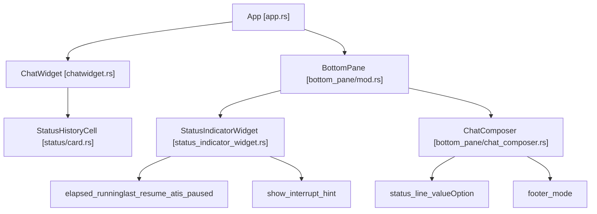
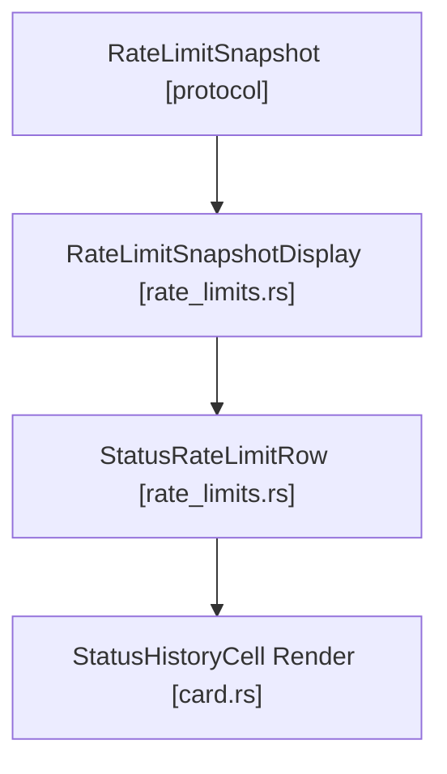

# 状态行与页脚渲染

相关源文件

-   [codex-rs/tui/src/bottom\_pane/bottom\_pane\_view.rs](https://github.com/openai/codex/blob/d807d44a/codex-rs/tui/src/bottom_pane/bottom_pane_view.rs)
-   [codex-rs/tui/src/bottom\_pane/multi\_select\_picker.rs](https://github.com/openai/codex/blob/d807d44a/codex-rs/tui/src/bottom_pane/multi_select_picker.rs)
-   [codex-rs/tui/src/bottom\_pane/snapshots/codex\_tui\_\_bottom\_pane\_\_tests\_\_status\_and\_composer\_fill\_height\_without\_bottom\_padding.snap](https://github.com/openai/codex/blob/d807d44a/codex-rs/tui/src/bottom_pane/snapshots/codex_tui__bottom_pane__tests__status_and_composer_fill_height_without_bottom_padding.snap)
-   [codex-rs/tui/src/bottom\_pane/snapshots/codex\_tui\_\_bottom\_pane\_\_tests\_\_status\_hidden\_when\_height\_too\_small\_height\_1.snap](https://github.com/openai/codex/blob/d807d44a/codex-rs/tui/src/bottom_pane/snapshots/codex_tui__bottom_pane__tests__status_hidden_when_height_too_small_height_1.snap)
-   [codex-rs/tui/src/chatwidget/snapshots/codex\_tui\_\_chatwidget\_\_tests\_\_chat\_small\_idle\_h3.snap](https://github.com/openai/codex/blob/d807d44a/codex-rs/tui/src/chatwidget/snapshots/codex_tui__chatwidget__tests__chat_small_idle_h3.snap)
-   [codex-rs/tui/src/chatwidget/snapshots/codex\_tui\_\_chatwidget\_\_tests\_\_chat\_small\_running\_h2.snap](https://github.com/openai/codex/blob/d807d44a/codex-rs/tui/src/chatwidget/snapshots/codex_tui__chatwidget__tests__chat_small_running_h2.snap)
-   [codex-rs/tui/src/chatwidget/snapshots/codex\_tui\_\_chatwidget\_\_tests\_\_chat\_small\_running\_h3.snap](https://github.com/openai/codex/blob/d807d44a/codex-rs/tui/src/chatwidget/snapshots/codex_tui__chatwidget__tests__chat_small_running_h3.snap)
-   [codex-rs/tui/src/chatwidget/snapshots/codex\_tui\_\_chatwidget\_\_tests\_\_unified\_exec\_begin\_restores\_working\_status.snap](https://github.com/openai/codex/blob/d807d44a/codex-rs/tui/src/chatwidget/snapshots/codex_tui__chatwidget__tests__unified_exec_begin_restores_working_status.snap)
-   [codex-rs/tui/src/line\_truncation.rs](https://github.com/openai/codex/blob/d807d44a/codex-rs/tui/src/line_truncation.rs)
-   [codex-rs/tui/src/snapshots/codex\_tui\_\_status\_indicator\_widget\_\_tests\_\_renders\_truncated.snap](https://github.com/openai/codex/blob/d807d44a/codex-rs/tui/src/snapshots/codex_tui__status_indicator_widget__tests__renders_truncated.snap)
-   [codex-rs/tui/src/snapshots/codex\_tui\_\_status\_indicator\_widget\_\_tests\_\_renders\_with\_queued\_messages.snap](https://github.com/openai/codex/blob/d807d44a/codex-rs/tui/src/snapshots/codex_tui__status_indicator_widget__tests__renders_with_queued_messages.snap)
-   [codex-rs/tui/src/snapshots/codex\_tui\_\_status\_indicator\_widget\_\_tests\_\_renders\_with\_working\_header.snap](https://github.com/openai/codex/blob/d807d44a/codex-rs/tui/src/snapshots/codex_tui__status_indicator_widget__tests__renders_with_working_header.snap)
-   [codex-rs/tui/src/status/card.rs](https://github.com/openai/codex/blob/d807d44a/codex-rs/tui/src/status/card.rs)
-   [codex-rs/tui/src/status/rate\_limits.rs](https://github.com/openai/codex/blob/d807d44a/codex-rs/tui/src/status/rate_limits.rs)
-   [codex-rs/tui/src/status/snapshots/codex\_tui\_\_status\_\_tests\_\_status\_snapshot\_includes\_monthly\_limit.snap](https://github.com/openai/codex/blob/d807d44a/codex-rs/tui/src/status/snapshots/codex_tui__status__tests__status_snapshot_includes_monthly_limit.snap)
-   [codex-rs/tui/src/status/snapshots/codex\_tui\_\_status\_\_tests\_\_status\_snapshot\_includes\_reasoning\_details.snap](https://github.com/openai/codex/blob/d807d44a/codex-rs/tui/src/status/snapshots/codex_tui__status__tests__status_snapshot_includes_reasoning_details.snap)
-   [codex-rs/tui/src/status/snapshots/codex\_tui\_\_status\_\_tests\_\_status\_snapshot\_shows\_empty\_limits\_message.snap](https://github.com/openai/codex/blob/d807d44a/codex-rs/tui/src/status/snapshots/codex_tui__status__tests__status_snapshot_shows_empty_limits_message.snap)
-   [codex-rs/tui/src/status/snapshots/codex\_tui\_\_status\_\_tests\_\_status\_snapshot\_shows\_missing\_limits\_message.snap](https://github.com/openai/codex/blob/d807d44a/codex-rs/tui/src/status/snapshots/codex_tui__status__tests__status_snapshot_shows_missing_limits_message.snap)
-   [codex-rs/tui/src/status/snapshots/codex\_tui\_\_status\_\_tests\_\_status\_snapshot\_shows\_stale\_limits\_message.snap](https://github.com/openai/codex/blob/d807d44a/codex-rs/tui/src/status/snapshots/codex_tui__status__tests__status_snapshot_shows_stale_limits_message.snap)
-   [codex-rs/tui/src/status/snapshots/codex\_tui\_\_status\_\_tests\_\_status\_snapshot\_truncates\_in\_narrow\_terminal.snap](https://github.com/openai/codex/blob/d807d44a/codex-rs/tui/src/status/snapshots/codex_tui__status__tests__status_snapshot_truncates_in_narrow_terminal.snap)
-   [codex-rs/tui/src/status/tests.rs](https://github.com/openai/codex/blob/d807d44a/codex-rs/tui/src/status/tests.rs)
-   [codex-rs/tui/src/status\_indicator\_widget.rs](https://github.com/openai/codex/blob/d807d44a/codex-rs/tui/src/status_indicator_widget.rs)

本页记录 TUI 在 Codex 终端界面中如何渲染状态行（可配置信息条）与页脚（上下文提示与快捷键）。重点包括用于任务进度的 `StatusIndicatorWidget`、`/status` 命令输出，以及底部面板布局。

## 组件架构

状态与页脚渲染涉及 TUI 多层之间的协同：

标题：状态与页脚组件层级


来源：

-   [codex-rs/tui/src/status\_indicator\_widget.rs44-60](https://github.com/openai/codex/blob/d807d44a/codex-rs/tui/src/status_indicator_widget.rs#L44-L60)
-   [codex-rs/tui/src/status/card.rs63-77](https://github.com/openai/codex/blob/d807d44a/codex-rs/tui/src/status/card.rs#L63-L77)
-   [codex-rs/tui/src/bottom\_pane/mod.rs158-189](https://github.com/openai/codex/blob/d807d44a/codex-rs/tui/src/bottom_pane/mod.rs#L158-L189)
-   [codex-rs/tui/src/bottom\_pane/chat\_composer.rs352-415](https://github.com/openai/codex/blob/d807d44a/codex-rs/tui/src/bottom_pane/chat_composer.rs#L352-L415)

## StatusIndicatorWidget

`StatusIndicatorWidget` 是一个实时任务状态行，在代理忙碌时渲染于 composer 上方。它提供进行中工作的可视反馈，并允许用户中断操作。

### 核心职责

| 职责 | 实现细节 |
| --- | --- |
| **Spinner 动画** | 基于时间的动画，使用 `last_resume_at` 时间点与 `crate::exec_cell::spinner` |
| **已用时长跟踪** | 在 `elapsed_running` 中累计时长，格式化为 "0s"、"1m 00s"、"1h 00m 00s" |
| **中断提示** | 当 `show_interrupt_hint == true` 时显示 "esc to interrupt" |
| **状态头部** | 存储并渲染动画化 `header` 字符串（例如 "Working"） |
| **可选详情** | 在主行下方换行显示 `details` 文本，并截断到 `details_max_lines` |
| **内联消息** | 在已用时长片段后追加 `inline_message`（例如后台进程计数） |

来源：

-   [codex-rs/tui/src/status\_indicator\_widget.rs44-60](https://github.com/openai/codex/blob/d807d44a/codex-rs/tui/src/status_indicator_widget.rs#L44-L60)
-   [codex-rs/tui/src/status\_indicator\_widget.rs78-98](https://github.com/openai/codex/blob/d807d44a/codex-rs/tui/src/status_indicator_widget.rs#L78-L98)
-   [codex-rs/tui/src/status\_indicator\_widget.rs63-76](https://github.com/openai/codex/blob/d807d44a/codex-rs/tui/src/status_indicator_widget.rs#L63-L76)

### 计时器状态机

该小部件通过支持暂停/恢复来跟踪已用时长，以准确反映真实模型/工具工作时间。

标题：状态计时器状态转换

> **[Mermaid stateDiagram]**
> *(图表结构无法解析)*

当 UI 正在等待用户输入时（例如审批覆盖层或直接用户输入请求），计时器会暂停，从而确保 “Working” 时长不包含人工空闲时间。

来源：

-   [codex-rs/tui/src/status\_indicator\_widget.rs158-189](https://github.com/openai/codex/blob/d807d44a/codex-rs/tui/src/status_indicator_widget.rs#L158-L189)

### 详情与大小写

更新详情（状态的第二行）时，调用方通过 `StatusDetailsCapitalization` 指定大小写行为。文本会加上 `└` 前缀（定义为 `DETAILS_PREFIX`）。

```
pub(crate) enum StatusDetailsCapitalization {    CapitalizeFirst,    Preserve,}
```
来源：

-   [codex-rs/tui/src/status\_indicator\_widget.rs34-41](https://github.com/openai/codex/blob/d807d44a/codex-rs/tui/src/status_indicator_widget.rs#L34-L41)
-   [codex-rs/tui/src/status\_indicator\_widget.rs110-126](https://github.com/openai/codex/blob/d807d44a/codex-rs/tui/src/status_indicator_widget.rs#L110-L126)

## `/status` 命令（StatusHistoryCell）

当用户运行 `/status` 时，TUI 会渲染一个 `StatusHistoryCell`。这是一个包含会话元数据、速率限制与 token 使用情况的详细“卡片”。

### 状态卡片数据结构

`StatusHistoryCell` 聚合来自 `Config`、`AuthManager` 与协议层 `TokenUsageInfo` 的数据。

| 字段 | 描述 | 来源 |
| --- | --- | --- |
| `model_name` | 当前模型字符串 | `config.model` |
| `directory` | 工作目录 | `config.cwd` |
| `permissions` | 沙箱与审批策略 | `config.permissions` |
| `token_usage` | 总计、输入和输出 token | `TokenUsage` 协议消息 |
| `rate_limits` | 5 小时、每周或每月限制 | `RateLimitSnapshot` |

来源：

-   [codex-rs/tui/src/status/card.rs63-77](https://github.com/openai/codex/blob/d807d44a/codex-rs/tui/src/status/card.rs#L63-L77)
-   [codex-rs/tui/src/status/card.rs152-166](https://github.com/openai/codex/blob/d807d44a/codex-rs/tui/src/status/card.rs#L152-L166)

### 速率限制展示逻辑

速率限制数据会被处理为 `StatusRateLimitData`。其状态可为 `Available`、`Stale` 或 `Missing`。当快照年龄超过 `RATE_LIMIT_STALE_THRESHOLD_MINUTES`（15 分钟）时，数据被视为 stale。

标题：速率限制处理流程


UI 使用 `█`（已填充）与 `░`（未填充）分段渲染进度条，通常为 20 段。

来源：

-   [codex-rs/tui/src/status/rate\_limits.rs20-22](https://github.com/openai/codex/blob/d807d44a/codex-rs/tui/src/status/rate_limits.rs#L20-L22)
-   [codex-rs/tui/src/status/rate\_limits.rs48-58](https://github.com/openai/codex/blob/d807d44a/codex-rs/tui/src/status/rate_limits.rs#L48-L58)
-   [codex-rs/tui/src/status/rate\_limits.rs117-122](https://github.com/openai/codex/blob/d807d44a/codex-rs/tui/src/status/rate_limits.rs#L117-L122)
-   [codex-rs/tui/src/status/rate\_limits.rs158-166](https://github.com/openai/codex/blob/d807d44a/codex-rs/tui/src/status/rate_limits.rs#L158-L166)

## 底部面板布局

`BottomPane` 管理状态行、composer 与各类覆盖层的垂直堆叠。

### 垂直堆叠顺序

面板按自上而下顺序渲染组件。若某组件无内容则会跳过，并回收高度。

1.  **待处理线程审批**：需要关注的线程通知。
2.  **状态指示器**：`StatusIndicatorWidget`（Working... spinner）。
3.  **统一 Exec 页脚**：后台进程摘要。
4.  **待输入预览**：排队消息或 steer。
5.  **活动视图 / Composer**：主输入区域或模态视图（如 `MultiSelectPicker`）。

来源：

-   [codex-rs/tui/src/bottom\_pane/mod.rs537-599](https://github.com/openai/codex/blob/d807d44a/codex-rs/tui/src/bottom_pane/mod.rs#L537-L599)
-   [codex-rs/tui/src/bottom\_pane/bottom\_pane\_view.rs10-40](https://github.com/openai/codex/blob/d807d44a/codex-rs/tui/src/bottom_pane/bottom_pane_view.rs#L10-L40)

### 高度计算

`BottomPane` 的 `desired_height` 等于所有可见组件高度之和。`StatusIndicatorWidget` 通常贡献 1 行头部，以及最多 `STATUS_DETAILS_DEFAULT_MAX_LINES`（3）行详情。

来源：

-   [codex-rs/tui/src/status\_indicator\_widget.rs34-35](https://github.com/openai/codex/blob/d807d44a/codex-rs/tui/src/status_indicator_widget.rs#L34-L35)
-   [codex-rs/tui/src/bottom\_pane/mod.rs537-550](https://github.com/openai/codex/blob/d807d44a/codex-rs/tui/src/bottom_pane/mod.rs#L537-L550)

## 页脚与键盘提示

页脚（由 `ChatComposer` 渲染）提供上下文相关键盘快捷键。

### 中断处理

当 `StatusIndicatorWidget` 处于活动状态时，它会监听 `Op::Interrupt`。UI 会显示 "esc to interrupt" 提示。若用户按下 Escape，小部件会通过 `AppEventSender` 发送 `AppEvent::CodexOp(Op::Interrupt)`。

来源：

-   [codex-rs/tui/src/status\_indicator\_widget.rs100-102](https://github.com/openai/codex/blob/d807d44a/codex-rs/tui/src/status_indicator_widget.rs#L100-L102)
-   [codex-rs/tui/src/status\_indicator\_widget.rs232-289](https://github.com/openai/codex/blob/d807d44a/codex-rs/tui/src/status_indicator_widget.rs#L232-L289)

### Unified Exec 集成

如果通过 `unified-exec` 运行后台进程，`StatusIndicatorWidget` 可显示 `inline_message`，例如 "1 background terminal running"。这可在主代理轮次空闲时，仍持续展示后台任务可见性。

来源：

-   [codex-rs/tui/src/status\_indicator\_widget.rs50-51](https://github.com/openai/codex/blob/d807d44a/codex-rs/tui/src/status_indicator_widget.rs#L50-L51)
-   [codex-rs/tui/src/chatwidget/snapshots/codex\_tui\_\_chatwidget\_\_tests\_\_unified\_exec\_begin\_restores\_working\_status.snap6](https://github.com/openai/codex/blob/d807d44a/codex-rs/tui/src/chatwidget/snapshots/codex_tui__chatwidget__tests__unified_exec_begin_restores_working_status.snap#L6-L6)
