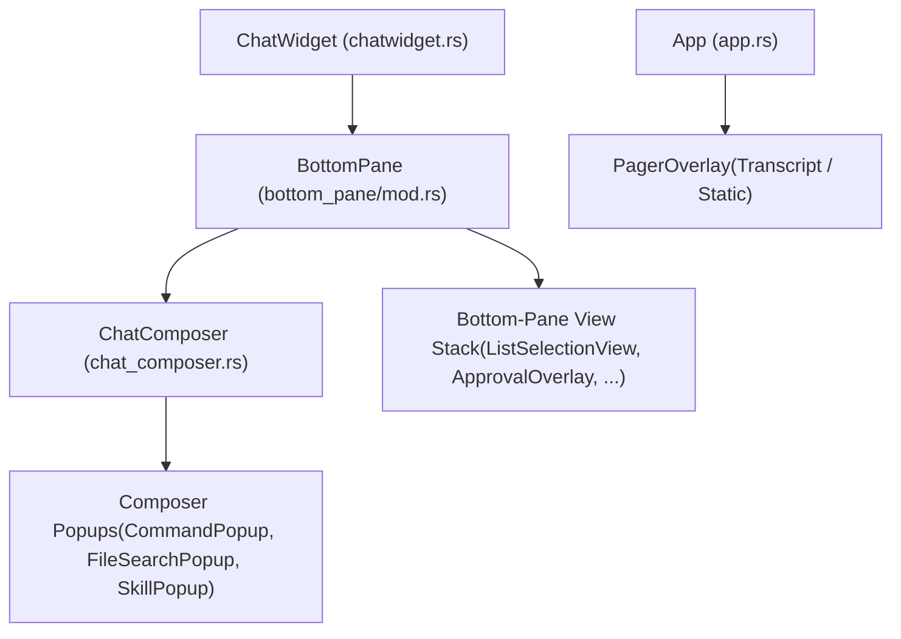
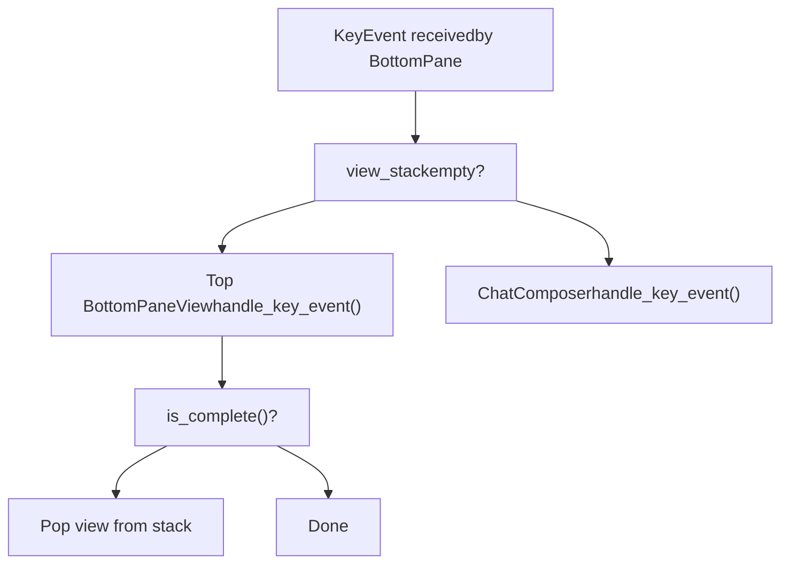
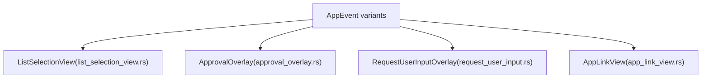

# 交互式覆盖层与弹窗

相关源文件

-   [codex-rs/tui/src/bottom\_pane/approval\_overlay.rs](https://github.com/openai/codex/blob/d807d44a/codex-rs/tui/src/bottom_pane/approval_overlay.rs)
-   [codex-rs/tui/src/bottom\_pane/command\_popup.rs](https://github.com/openai/codex/blob/d807d44a/codex-rs/tui/src/bottom_pane/command_popup.rs)
-   [codex-rs/tui/src/bottom\_pane/file\_search\_popup.rs](https://github.com/openai/codex/blob/d807d44a/codex-rs/tui/src/bottom_pane/file_search_popup.rs)
-   [codex-rs/tui/src/bottom\_pane/list\_selection\_view.rs](https://github.com/openai/codex/blob/d807d44a/codex-rs/tui/src/bottom_pane/list_selection_view.rs)
-   [codex-rs/tui/src/bottom\_pane/request\_user\_input/layout.rs](https://github.com/openai/codex/blob/d807d44a/codex-rs/tui/src/bottom_pane/request_user_input/layout.rs)
-   [codex-rs/tui/src/bottom\_pane/request\_user\_input/mod.rs](https://github.com/openai/codex/blob/d807d44a/codex-rs/tui/src/bottom_pane/request_user_input/mod.rs)
-   [codex-rs/tui/src/bottom\_pane/request\_user\_input/render.rs](https://github.com/openai/codex/blob/d807d44a/codex-rs/tui/src/bottom_pane/request_user_input/render.rs)
-   [codex-rs/tui/src/bottom\_pane/request\_user\_input/snapshots/codex\_tui\_\_bottom\_pane\_\_request\_user\_input\_\_tests\_\_request\_user\_input\_footer\_wrap.snap](https://github.com/openai/codex/blob/d807d44a/codex-rs/tui/src/bottom_pane/request_user_input/snapshots/codex_tui__bottom_pane__request_user_input__tests__request_user_input_footer_wrap.snap)
-   [codex-rs/tui/src/bottom\_pane/request\_user\_input/snapshots/codex\_tui\_\_bottom\_pane\_\_request\_user\_input\_\_tests\_\_request\_user\_input\_freeform.snap](https://github.com/openai/codex/blob/d807d44a/codex-rs/tui/src/bottom_pane/request_user_input/snapshots/codex_tui__bottom_pane__request_user_input__tests__request_user_input_freeform.snap)
-   [codex-rs/tui/src/bottom\_pane/request\_user\_input/snapshots/codex\_tui\_\_bottom\_pane\_\_request\_user\_input\_\_tests\_\_request\_user\_input\_multi\_question\_first.snap](https://github.com/openai/codex/blob/d807d44a/codex-rs/tui/src/bottom_pane/request_user_input/snapshots/codex_tui__bottom_pane__request_user_input__tests__request_user_input_multi_question_first.snap)
-   [codex-rs/tui/src/bottom\_pane/request\_user\_input/snapshots/codex\_tui\_\_bottom\_pane\_\_request\_user\_input\_\_tests\_\_request\_user\_input\_multi\_question\_last.snap](https://github.com/openai/codex/blob/d807d44a/codex-rs/tui/src/bottom_pane/request_user_input/snapshots/codex_tui__bottom_pane__request_user_input__tests__request_user_input_multi_question_last.snap)
-   [codex-rs/tui/src/bottom\_pane/request\_user\_input/snapshots/codex\_tui\_\_bottom\_pane\_\_request\_user\_input\_\_tests\_\_request\_user\_input\_options.snap](https://github.com/openai/codex/blob/d807d44a/codex-rs/tui/src/bottom_pane/request_user_input/snapshots/codex_tui__bottom_pane__request_user_input__tests__request_user_input_options.snap)
-   [codex-rs/tui/src/bottom\_pane/request\_user\_input/snapshots/codex\_tui\_\_bottom\_pane\_\_request\_user\_input\_\_tests\_\_request\_user\_input\_options\_notes\_visible.snap](https://github.com/openai/codex/blob/d807d44a/codex-rs/tui/src/bottom_pane/request_user_input/snapshots/codex_tui__bottom_pane__request_user_input__tests__request_user_input_options_notes_visible.snap)
-   [codex-rs/tui/src/bottom\_pane/request\_user\_input/snapshots/codex\_tui\_\_bottom\_pane\_\_request\_user\_input\_\_tests\_\_request\_user\_input\_scrolling\_options.snap](https://github.com/openai/codex/blob/d807d44a/codex-rs/tui/src/bottom_pane/request_user_input/snapshots/codex_tui__bottom_pane__request_user_input__tests__request_user_input_scrolling_options.snap)
-   [codex-rs/tui/src/bottom\_pane/request\_user\_input/snapshots/codex\_tui\_\_bottom\_pane\_\_request\_user\_input\_\_tests\_\_request\_user\_input\_tight\_height.snap](https://github.com/openai/codex/blob/d807d44a/codex-rs/tui/src/bottom_pane/request_user_input/snapshots/codex_tui__bottom_pane__request_user_input__tests__request_user_input_tight_height.snap)
-   [codex-rs/tui/src/bottom\_pane/request\_user\_input/snapshots/codex\_tui\_\_bottom\_pane\_\_request\_user\_input\_\_tests\_\_request\_user\_input\_wrapped\_options.snap](https://github.com/openai/codex/blob/d807d44a/codex-rs/tui/src/bottom_pane/request_user_input/snapshots/codex_tui__bottom_pane__request_user_input__tests__request_user_input_wrapped_options.snap)
-   [codex-rs/tui/src/bottom\_pane/selection\_popup\_common.rs](https://github.com/openai/codex/blob/d807d44a/codex-rs/tui/src/bottom_pane/selection_popup_common.rs)
-   [codex-rs/tui/src/bottom\_pane/skill\_popup.rs](https://github.com/openai/codex/blob/d807d44a/codex-rs/tui/src/bottom_pane/skill_popup.rs)
-   [codex-rs/tui/src/bottom\_pane/slash\_commands.rs](https://github.com/openai/codex/blob/d807d44a/codex-rs/tui/src/bottom_pane/slash_commands.rs)
-   [codex-rs/tui/src/bottom\_pane/snapshots/codex\_tui\_\_bottom\_pane\_\_chat\_composer\_\_tests\_\_mention\_popup\_type\_prefixes.snap](https://github.com/openai/codex/blob/d807d44a/codex-rs/tui/src/bottom_pane/snapshots/codex_tui__bottom_pane__chat_composer__tests__mention_popup_type_prefixes.snap)
-   [codex-rs/tui/src/bottom\_pane/snapshots/codex\_tui\_\_bottom\_pane\_\_chat\_composer\_\_tests\_\_plugin\_mention\_popup.snap](https://github.com/openai/codex/blob/d807d44a/codex-rs/tui/src/bottom_pane/snapshots/codex_tui__bottom_pane__chat_composer__tests__plugin_mention_popup.snap)
-   [codex-rs/tui/src/chatwidget/snapshots/codex\_tui\_\_chatwidget\_\_tests\_\_approval\_modal\_exec.snap](https://github.com/openai/codex/blob/d807d44a/codex-rs/tui/src/chatwidget/snapshots/codex_tui__chatwidget__tests__approval_modal_exec.snap)
-   [codex-rs/tui/src/chatwidget/snapshots/codex\_tui\_\_chatwidget\_\_tests\_\_approval\_modal\_exec\_no\_reason.snap](https://github.com/openai/codex/blob/d807d44a/codex-rs/tui/src/chatwidget/snapshots/codex_tui__chatwidget__tests__approval_modal_exec_no_reason.snap)
-   [codex-rs/tui/src/chatwidget/snapshots/codex\_tui\_\_chatwidget\_\_tests\_\_approval\_modal\_patch.snap](https://github.com/openai/codex/blob/d807d44a/codex-rs/tui/src/chatwidget/snapshots/codex_tui__chatwidget__tests__approval_modal_patch.snap)
-   [codex-rs/tui/src/chatwidget/snapshots/codex\_tui\_\_chatwidget\_\_tests\_\_exec\_approval\_modal\_exec.snap](https://github.com/openai/codex/blob/d807d44a/codex-rs/tui/src/chatwidget/snapshots/codex_tui__chatwidget__tests__exec_approval_modal_exec.snap)
-   [codex-rs/tui/src/chatwidget/snapshots/codex\_tui\_\_chatwidget\_\_tests\_\_status\_widget\_and\_approval\_modal.snap](https://github.com/openai/codex/blob/d807d44a/codex-rs/tui/src/chatwidget/snapshots/codex_tui__chatwidget__tests__status_widget_and_approval_modal.snap)
-   [codex-rs/tui\_app\_server/src/bottom\_pane/chat\_composer.rs](https://github.com/openai/codex/blob/d807d44a/codex-rs/tui_app_server/src/bottom_pane/chat_composer.rs)
-   [codex-rs/tui\_app\_server/src/bottom\_pane/command\_popup.rs](https://github.com/openai/codex/blob/d807d44a/codex-rs/tui_app_server/src/bottom_pane/command_popup.rs)
-   [codex-rs/tui\_app\_server/src/bottom\_pane/mod.rs](https://github.com/openai/codex/blob/d807d44a/codex-rs/tui_app_server/src/bottom_pane/mod.rs)
-   [codex-rs/tui\_app\_server/src/bottom\_pane/slash\_commands.rs](https://github.com/openai/codex/blob/d807d44a/codex-rs/tui_app_server/src/bottom_pane/slash_commands.rs)
-   [docs/tui-request-user-input.md](https://github.com/openai/codex/blob/d807d44a/docs/tui-request-user-input.md?plain=1)

本页记录 Codex TUI 的覆盖层与弹窗系统：各类覆盖层如何构造、键盘输入如何被拦截和路由，以及覆盖层如何通过 `AppEvent` 消息总线分发动作。

关于通用 TUI 布局与小部件层级，请参见 [4.1](https://github.com/openai/codex/blob/d807d44a/4.1)。关于承载这些覆盖层中许多功能的 `BottomPane` 与输入系统，请参见 [4.1.3](https://github.com/openai/codex/blob/d807d44a/4.1.3)。关于 `AppEvent` 总线本身，请参见 [4.1.1](https://github.com/openai/codex/blob/d807d44a/4.1.1)

---

## 覆盖层架构

TUI 有 **三种不同的覆盖层级**，分别位于小部件层级中的不同作用域：

**覆盖层级图**


| 层级 | 所有者 | 作用域 | 示例 |
| --- | --- | --- | --- |
| Composer 弹窗 | `ChatComposer.active_popup` | 文本输入上方 | `CommandPopup`, `FileSearchPopup`, `SkillPopup` |
| Bottom-pane 视图栈 | `BottomPane.view_stack` | 替换 composer | `ListSelectionView`, `ApprovalOverlay`, `RequestUserInputOverlay` |
| 全屏覆盖层 | `App.overlay` | 替换整个屏幕 | `TranscriptOverlay`, `StaticOverlay` |

来源： [codex-rs/tui\_app\_server/src/bottom\_pane/mod.rs162-163](https://github.com/openai/codex/blob/d807d44a/codex-rs/tui_app_server/src/bottom_pane/mod.rs#L162-L163) [codex-rs/tui\_app\_server/src/bottom\_pane/chat\_composer.rs12-18](https://github.com/openai/codex/blob/d807d44a/codex-rs/tui_app_server/src/bottom_pane/chat_composer.rs#L12-L18) [codex-rs/tui/src/bottom\_pane/mod.rs150-181](https://github.com/openai/codex/blob/d807d44a/codex-rs/tui/src/bottom_pane/mod.rs#L150-L181) [codex-rs/tui/src/bottom\_pane/chat\_composer.rs349-409](https://github.com/openai/codex/blob/d807d44a/codex-rs/tui/src/bottom_pane/chat_composer.rs#L349-L409)

---

## `BottomPaneView` Trait

所有 bottom-pane 视图都实现统一 trait（`bottom_pane_view::BottomPaneView`），使 `BottomPane` 可管理多态视图栈。

trait 上的关键方法（来自 `bottom_pane/bottom_pane_view.rs`）：

-   `handle_key_event(key_event)` — 处理输入
-   `on_ctrl_c() -> CancellationEvent` — 在 Ctrl+C 时返回 `Handled` 以关闭该视图
-   `is_complete() -> bool` — 指示该视图应从栈中弹出
-   `is_in_paste_burst() -> bool` — 用于安排延迟 paste-burst 计时器
-   `prefer_esc_to_handle_key_event() -> bool` — 将 Esc 路由到 `handle_key_event` 而非 `on_ctrl_c`

`BottomPane` 在 [codex-rs/tui/src/bottom\_pane/mod.rs352-430](https://github.com/openai/codex/blob/d807d44a/codex-rs/tui/src/bottom_pane/mod.rs#L352-L430) 中通过其视图栈路由每个按键事件：

1.  若视图栈非空，栈顶视图优先接收按键。
2.  Esc 会基于 `prefer_esc_to_handle_key_event()` 调用 `on_ctrl_c()` 或 `handle_key_event()`。
3.  当 `is_complete()` 返回 true 时，视图从栈中弹出。
4.  若栈为空，输入会透传到 `ChatComposer`。

**视图栈输入路由**


来源： [codex-rs/tui/src/bottom\_pane/mod.rs350-430](https://github.com/openai/codex/blob/d807d44a/codex-rs/tui/src/bottom_pane/mod.rs#L350-L430) [codex-rs/tui\_app\_server/src/bottom\_pane/mod.rs7-12](https://github.com/openai/codex/blob/d807d44a/codex-rs/tui_app_server/src/bottom_pane/mod.rs#L7-L12)

---

## Composer 级弹窗

这些弹窗由 `ChatComposer` 内部管理，并直接叠加渲染在文本输入区域上方。任意时刻最多只能有一个激活项，由 `ActivePopup` 枚举跟踪。

```
// codex-rs/tui/src/bottom_pane/chat_composer.rs (line ~424)enum ActivePopup {    None,    Command(CommandPopup),    File(FileSearchPopup),    Skill(SkillPopup),}
```
### `CommandPopup`

文件： [codex-rs/tui/src/bottom\_pane/command\_popup.rs](https://github.com/openai/codex/blob/d807d44a/codex-rs/tui/src/bottom_pane/command_popup.rs)

当用户在 composer 中输入 `/` 时显示。它列出内置 slash 命令与用户自定义 prompt。

**关键类型：**

| 类型 | 用途 |
| --- | --- |
| `CommandPopup` | 管理过滤列表状态与滚动 [codex-rs/tui/src/bottom\_pane/command\_popup.rs30-35](https://github.com/openai/codex/blob/d807d44a/codex-rs/tui/src/bottom_pane/command_popup.rs#L30-L35) |
| `CommandItem` | `Builtin(SlashCommand)` 或 `UserPrompt(usize)` [codex-rs/tui/src/bottom\_pane/command\_popup.rs24-28](https://github.com/openai/codex/blob/d807d44a/codex-rs/tui/src/bottom_pane/command_popup.rs#L24-L28) |
| `CommandPopupFlags` | 功能开关（协作、connectors、fast mode 等） [codex-rs/tui/src/bottom\_pane/command\_popup.rs38-47](https://github.com/openai/codex/blob/d807d44a/codex-rs/tui/src/bottom_pane/command_popup.rs#L38-L47) |

**过滤逻辑**（[codex-rs/tui/src/bottom\_pane/command\_popup.rs103-128](https://github.com/openai/codex/blob/d807d44a/codex-rs/tui/src/bottom_pane/command_popup.rs#L103-L128)）：

-   `on_composer_text_change(text)` 从 `/` 后首个 token 更新 `command_filter`。
-   `filtered()` 对内置命令与用户 prompt 执行前缀与精确匹配，返回 `(CommandItem, Option<Vec<usize>>)` 对，其中 `Vec<usize>` 包含应加粗的字符位置 [codex-rs/tui/src/bottom\_pane/command\_popup.rs142-168](https://github.com/openai/codex/blob/d807d44a/codex-rs/tui/src/bottom_pane/command_popup.rs#L142-L168)
-   别名命令（`Quit` 是 `Exit` 的别名，`Approvals` 是 `Permissions` 的别名）会在默认无过滤列表中隐藏 [codex-rs/tui/src/bottom\_pane/command\_popup.rs18-20](https://github.com/openai/codex/blob/d807d44a/codex-rs/tui/src/bottom_pane/command_popup.rs#L18-L20)

命令可用性由 `BuiltinCommandFlags`（来自 [codex-rs/tui/src/bottom\_pane/slash\_commands.rs](https://github.com/openai/codex/blob/d807d44a/codex-rs/tui/src/bottom_pane/slash_commands.rs)）以及当前任务状态下 `SlashCommand::available_during_task()` 的返回值共同控制。

### `FileSearchPopup`

文件： [codex-rs/tui/src/bottom\_pane/file\_search\_popup.rs](https://github.com/openai/codex/blob/d807d44a/codex-rs/tui/src/bottom_pane/file_search_popup.rs)

当用户在 composer 中输入 `@` 时显示。以异步方式展示文件搜索结果。

状态机：

-   `set_query(query)` 将弹窗置为 `waiting = true` [codex-rs/tui/src/bottom\_pane/file\_search\_popup.rs43-52](https://github.com/openai/codex/blob/d807d44a/codex-rs/tui/src/bottom_pane/file_search_popup.rs#L43-L52)
-   当结果到达时，`set_matches(query, matches)` 更新可见列表（仅当 `query == pending_query` 时，以丢弃过时结果） [codex-rs/tui/src/bottom\_pane/file\_search\_popup.rs67-78](https://github.com/openai/codex/blob/d807d44a/codex-rs/tui/src/bottom_pane/file_search_popup.rs#L67-L78)
-   `set_empty_prompt()` 用于空 `@` 查询，显示提示而非匹配项 [codex-rs/tui/src/bottom\_pane/file\_search\_popup.rs56-63](https://github.com/openai/codex/blob/d807d44a/codex-rs/tui/src/bottom_pane/file_search_popup.rs#L56-L63)

| 字段 | 含义 |
| --- | --- |
| `display_query` | 当前显示 `matches` 对应的查询 |
| `pending_query` | 用户最新输入查询（可能领先于结果） |
| `waiting` | 等待 `pending_query` 结果时为 true |
| `matches: Vec<FileMatch>` | 最近一次完成搜索的缓存匹配 |

来源： [codex-rs/tui/src/bottom\_pane/file\_search\_popup.rs17-29](https://github.com/openai/codex/blob/d807d44a/codex-rs/tui/src/bottom_pane/file_search_popup.rs#L17-L29)

### `SkillPopup`

文件： [codex-rs/tui/src/bottom\_pane/skill\_popup.rs](https://github.com/openai/codex/blob/d807d44a/codex-rs/tui/src/bottom_pane/skill_popup.rs)

当用户在 composer 中输入 `$` 时显示。以 `MentionItem` 形式列出可用 skills 与 app connectors。

`MentionItem` 字段 [codex-rs/tui/src/bottom\_pane/skill\_popup.rs21-29](https://github.com/openai/codex/blob/d807d44a/codex-rs/tui/src/bottom_pane/skill_popup.rs#L21-L29)：

| 字段 | 用途 |
| --- | --- |
| `display_name` | 弹窗行中显示文本 |
| `description` | 可选灰色副标题 |
| `insert_text` | 选中时插入到 composer 的文本 |
| `search_terms` | 额外模糊匹配字符串 |
| `path` | 规范路径（skill `.md` 文件或 `app://...` URI） |
| `category_tag` | 右侧标签（如 `skill`、`app`） |

模糊匹配由 `codex_utils_fuzzy_match::fuzzy_match` 执行 [codex-rs/tui/src/bottom\_pane/skill\_popup.rs142-168](https://github.com/openai/codex/blob/d807d44a/codex-rs/tui/src/bottom_pane/skill_popup.rs#L142-L168)。该弹窗使用 `selection_popup_common` 中的 `render_rows_single_line` 进行紧凑展示 [codex-rs/tui/src/bottom\_pane/skill\_popup.rs201-210](https://github.com/openai/codex/blob/d807d44a/codex-rs/tui/src/bottom_pane/skill_popup.rs#L201-L210)

---

## Bottom-Pane 视图栈

这些覆盖层会完全替换 `ChatComposer`，并由 `BottomPane.view_stack` 管理。

**关键类型及其触发事件**


### `ListSelectionView`

文件： [codex-rs/tui/src/bottom\_pane/list\_selection\_view.rs](https://github.com/openai/codex/blob/d807d44a/codex-rs/tui/src/bottom_pane/list_selection_view.rs)

用于模型选择器、审批预设、主题选择、skills 管理以及许多其他交互选择的通用选择弹窗。

**`SelectionViewParams`**（构建期配置） [codex-rs/tui/src/bottom\_pane/list\_selection\_view.rs138-176](https://github.com/openai/codex/blob/d807d44a/codex-rs/tui/src/bottom_pane/list_selection_view.rs#L138-L176)：

| 字段 | 用途 |
| --- | --- |
| `title` / `subtitle` | 头部文本 |
| `items: Vec<SelectionItem>` | 行数据 |
| `is_searchable` | 启用搜索/过滤文本输入 |
| `col_width_mode: ColumnWidthMode` | `AutoVisible`、`AutoAllRows` 或 `Fixed` 列宽 |
| `side_content: Box<dyn Renderable>` | 列表旁展示的富内容（例如语法预览） |
| `side_content_width: SideContentWidth` | `Fixed(n)` 或 `Half` |
| `on_selection_changed` | 导航时触发的回调 |
| `on_cancel` | Esc/Ctrl+C 时触发的回调 |

**`SelectionItem`**（每行模型） [codex-rs/tui/src/bottom\_pane/list\_selection\_view.rs113-126](https://github.com/openai/codex/blob/d807d44a/codex-rs/tui/src/bottom_pane/list_selection_view.rs#L113-L126)：

| 字段 | 用途 |
| --- | --- |
| `name` | 显示文本 |
| `display_shortcut` | 右侧显示的数字快捷键 |
| `description` / `selected_description` | 副标题文本 |
| `is_current` / `is_default` | 标记当前选中或默认项 |
| `is_disabled` / `disabled_reason` | 禁止选择并显示原因 |
| `actions: Vec<SelectionAction>` | 接受条目时在 `AppEventSender` 上调用的闭包 |
| `dismiss_on_select` | 接受该条目后是否关闭弹窗 |

**并排布局**：当终端宽度足够时，`side_by_side_layout_widths()` 将内容区拆分为列表面板与侧边内容面板 [codex-rs/tui/src/bottom\_pane/list\_selection\_view.rs76-91](https://github.com/openai/codex/blob/d807d44a/codex-rs/tui/src/bottom_pane/list_selection_view.rs#L76-L91)。阈值为 `MIN_LIST_WIDTH_FOR_SIDE = 40` 列 [codex-rs/tui/src/bottom\_pane/list\_selection\_view.rs39](https://github.com/openai/codex/blob/d807d44a/codex-rs/tui/src/bottom_pane/list_selection_view.rs#L39-L39)

### `ApprovalOverlay`

文件： [codex-rs/tui/src/bottom\_pane/approval\_overlay.rs](https://github.com/openai/codex/blob/d807d44a/codex-rs/tui/src/bottom_pane/approval_overlay.rs)

当代理请求执行命令、应用补丁或授予权限时显示。

**`ApprovalRequest` 变体** [codex-rs/tui/src/bottom\_pane/approval\_overlay.rs48-81](https://github.com/openai/codex/blob/d807d44a/codex-rs/tui/src/bottom_pane/approval_overlay.rs#L48-L81)：

-   `Exec`：用于 shell 命令和网络访问。
-   `Permissions`：用于授予特定平台能力（macOS Contacts 等）。
-   `ApplyPatch`：用于文件系统编辑。
-   `McpElicitation`：用于外部 MCP 服务器用户请求。

覆盖层会渲染命令详情及选项列表（例如 “Yes, proceed”、“Yes, and don't ask again”、“No”） [codex-rs/tui/src/bottom\_pane/approval\_overlay.rs149-183](https://github.com/openai/codex/blob/d807d44a/codex-rs/tui/src/bottom_pane/approval_overlay.rs#L149-L183)

### `RequestUserInputOverlay`

文件： [codex-rs/tui/src/bottom\_pane/request\_user\_input/mod.rs](https://github.com/openai/codex/blob/d807d44a/codex-rs/tui/src/bottom_pane/request_user_input/mod.rs)

用于复杂 elicitation 的多问题状态机。

-   **回答状态**：每个问题都可包含选中选项和/或自由文本备注 [codex-rs/tui/src/bottom\_pane/request\_user\_input/mod.rs88-97](https://github.com/openai/codex/blob/d807d44a/codex-rs/tui/src/bottom_pane/request_user_input/mod.rs#L88-L97)
-   **焦点切换**：用户可在 `Options` 与 `Notes` 之间切换焦点 [codex-rs/tui/src/bottom\_pane/request\_user\_input/mod.rs57-60](https://github.com/openai/codex/blob/d807d44a/codex-rs/tui/src/bottom_pane/request_user_input/mod.rs#L57-L60)
-   **Composer 集成**：使用配置为 plain text 的内部 `ChatComposer` 捕获自由输入 [codex-rs/tui/src/bottom\_pane/request\_user\_input/mod.rs148-155](https://github.com/openai/codex/blob/d807d44a/codex-rs/tui/src/bottom_pane/request_user_input/mod.rs#L148-L155)

---

## 全屏分页覆盖层

文件： [codex-rs/tui/src/pager\_overlay.rs](https://github.com/openai/codex/blob/d807d44a/codex-rs/tui/src/pager_overlay.rs)

全屏覆盖层位于 `App.overlay: Option<Overlay>`，并捕获全部键盘输入。

```
pub(crate) enum Overlay {    Transcript(TranscriptOverlay),    Static(StaticOverlay),}
```
### `TranscriptOverlay`

由 `Ctrl+T` 触发。显示已提交的 `HistoryCell`，并可附带来自当前进行中 `active_cell` 的**实时尾部**。

实时尾部会被缓存，以避免每帧重复渲染。`App` 在每次绘制期间调用 `TranscriptOverlay::sync_live_tail(key, lines_fn)`。

### `StaticOverlay`

由 `/diff` 或其他生成一次性可查看文档的命令触发。可通过 `new_static_with_lines(lines, title)` 或 `new_static_with_renderables(renderables, title)` 构造。

---

## 弹窗共享渲染原语

多数弹窗会委托给 `bottom_pane/selection_popup_common.rs` 中的辅助函数来渲染行。

| 辅助函数 | 用途 |
| --- | --- |
| `render_menu_surface(area, buf)` | 绘制共享背景；返回内缩内容矩形 [codex-rs/tui/src/bottom\_pane/selection\_popup\_common.rs84-92](https://github.com/openai/codex/blob/d807d44a/codex-rs/tui/src/bottom_pane/selection_popup_common.rs#L84-L92) |
| `render_rows(...)` | 渲染带选中与滚动的 `Vec<GenericDisplayRow>` [codex-rs/tui/src/bottom\_pane/selection\_popup\_common.rs31](https://github.com/openai/codex/blob/d807d44a/codex-rs/tui/src/bottom_pane/selection_popup_common.rs#L31-L31) |
| `measure_rows_height(...)` | 根据视口与滚动状态计算所需高度 [codex-rs/tui/src/bottom\_pane/selection\_popup\_common.rs28-30](https://github.com/openai/codex/blob/d807d44a/codex-rs/tui/src/bottom_pane/selection_popup_common.rs#L28-L30) |
| `wrap_styled_line(line, width)` | 对样式化 `Line` 进行换行并保留 span 样式 [codex-rs/tui/src/bottom\_pane/selection\_popup\_common.rs98-107](https://github.com/openai/codex/blob/d807d44a/codex-rs/tui/src/bottom_pane/selection_popup_common.rs#L98-L107) |

`GenericDisplayRow` 是单条弹窗行的可渲染模型 [codex-rs/tui/src/bottom\_pane/selection\_popup\_common.rs30-40](https://github.com/openai/codex/blob/d807d44a/codex-rs/tui/src/bottom_pane/selection_popup_common.rs#L30-L40)：

| 字段 | 用途 |
| --- | --- |
| `name` | 主文本 |
| `match_indices` | 需加粗的字符位置（搜索高亮） |
| `description` | 灰色次级文本 |
| `category_tag` | 右对齐标签 |
| `disabled_reason` | 禁用行显示原因 |
| `display_shortcut` | 右侧显示的按键绑定 |

来源： [codex-rs/tui/src/bottom\_pane/selection\_popup\_common.rs30-107](https://github.com/openai/codex/blob/d807d44a/codex-rs/tui/src/bottom_pane/selection_popup_common.rs#L30-L107)

---

## 数据流：Slash 命令选择

**Slash 命令选择流程图**

> **[Mermaid sequence]**
> *(图表结构无法解析)*

来源： [codex-rs/tui/src/bottom\_pane/chat\_composer.rs12-18](https://github.com/openai/codex/blob/d807d44a/codex-rs/tui/src/bottom_pane/chat_composer.rs#L12-L18) [codex-rs/tui/src/bottom\_pane/command\_popup.rs103-128](https://github.com/openai/codex/blob/d807d44a/codex-rs/tui/src/bottom_pane/command_popup.rs#L103-L128) [codex-rs/tui/src/bottom\_pane/mod.rs150-160](https://github.com/openai/codex/blob/d807d44a/codex-rs/tui/src/bottom_pane/mod.rs#L150-L160)

---

## 数据流：Exec 审批

> **[Mermaid sequence]**
> *(图表结构无法解析)*

来源： [codex-rs/tui/src/bottom\_pane/approval\_overlay.rs104-129](https://github.com/openai/codex/blob/d807d44a/codex-rs/tui/src/bottom_pane/approval_overlay.rs#L104-L129) [codex-rs/tui/src/bottom\_pane/mod.rs350-430](https://github.com/openai/codex/blob/d807d44a/codex-rs/tui/src/bottom_pane/mod.rs#L350-L430)
