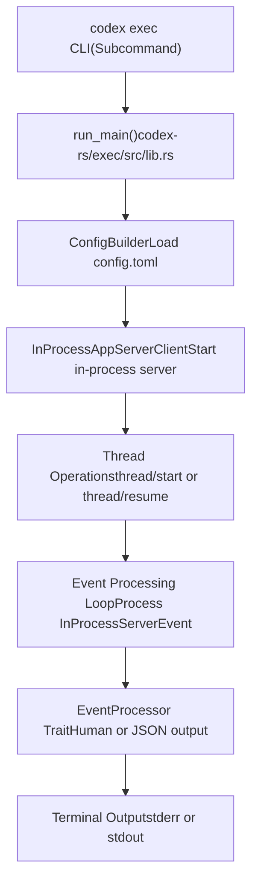
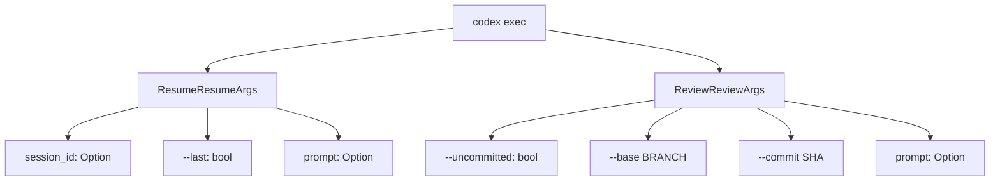
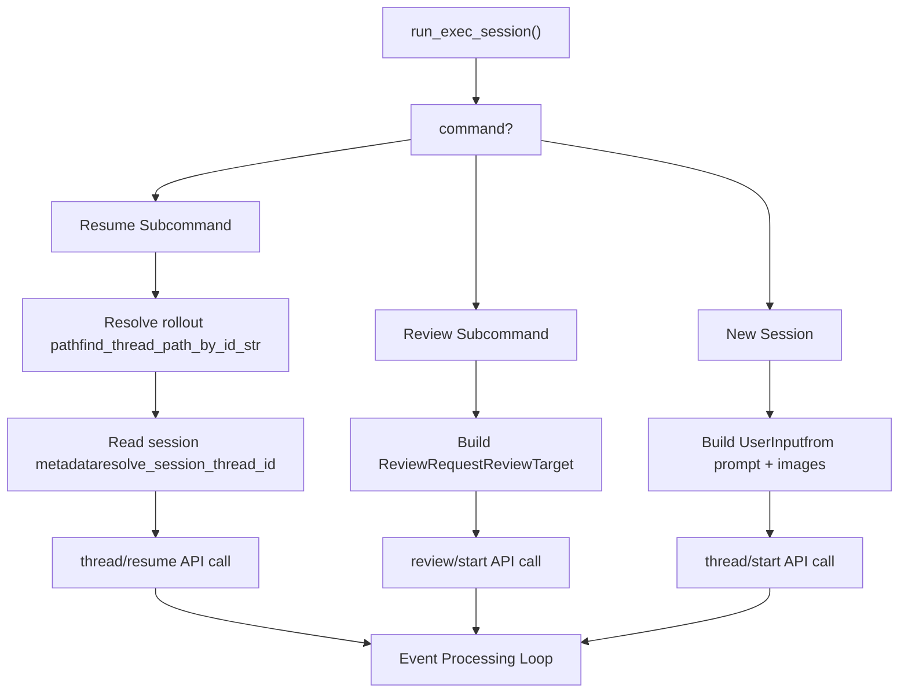
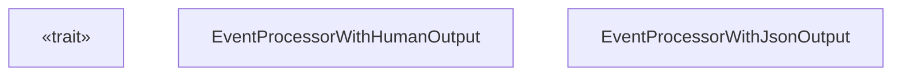

# 无头执行模式（codex exec）

相关源文件

-   [codex-rs/Cargo.lock](https://github.com/openai/codex/blob/d807d44a/codex-rs/Cargo.lock)
-   [codex-rs/Cargo.toml](https://github.com/openai/codex/blob/d807d44a/codex-rs/Cargo.toml)
-   [codex-rs/README.md](https://github.com/openai/codex/blob/d807d44a/codex-rs/README.md?plain=1)
-   [codex-rs/cli/Cargo.toml](https://github.com/openai/codex/blob/d807d44a/codex-rs/cli/Cargo.toml)
-   [codex-rs/cli/src/lib.rs](https://github.com/openai/codex/blob/d807d44a/codex-rs/cli/src/lib.rs)
-   [codex-rs/cli/src/main.rs](https://github.com/openai/codex/blob/d807d44a/codex-rs/cli/src/main.rs)
-   [codex-rs/config.md](https://github.com/openai/codex/blob/d807d44a/codex-rs/config.md?plain=1)
-   [codex-rs/core/Cargo.toml](https://github.com/openai/codex/blob/d807d44a/codex-rs/core/Cargo.toml)
-   [codex-rs/core/src/flags.rs](https://github.com/openai/codex/blob/d807d44a/codex-rs/core/src/flags.rs)
-   [codex-rs/core/src/lib.rs](https://github.com/openai/codex/blob/d807d44a/codex-rs/core/src/lib.rs)
-   [codex-rs/core/src/model\_provider\_info.rs](https://github.com/openai/codex/blob/d807d44a/codex-rs/core/src/model_provider_info.rs)
-   [codex-rs/exec/Cargo.toml](https://github.com/openai/codex/blob/d807d44a/codex-rs/exec/Cargo.toml)
-   [codex-rs/exec/src/cli.rs](https://github.com/openai/codex/blob/d807d44a/codex-rs/exec/src/cli.rs)
-   [codex-rs/exec/src/event\_processor\_with\_jsonl\_output.rs](https://github.com/openai/codex/blob/d807d44a/codex-rs/exec/src/event_processor_with_jsonl_output.rs)
-   [codex-rs/exec/src/exec\_events.rs](https://github.com/openai/codex/blob/d807d44a/codex-rs/exec/src/exec_events.rs)
-   [codex-rs/exec/src/lib.rs](https://github.com/openai/codex/blob/d807d44a/codex-rs/exec/src/lib.rs)
-   [codex-rs/exec/tests/event\_processor\_with\_json\_output.rs](https://github.com/openai/codex/blob/d807d44a/codex-rs/exec/tests/event_processor_with_json_output.rs)
-   [codex-rs/tui/Cargo.toml](https://github.com/openai/codex/blob/d807d44a/codex-rs/tui/Cargo.toml)
-   [codex-rs/tui/src/cli.rs](https://github.com/openai/codex/blob/d807d44a/codex-rs/tui/src/cli.rs)
-   [codex-rs/tui/src/lib.rs](https://github.com/openai/codex/blob/d807d44a/codex-rs/tui/src/lib.rs)

无头执行模式（`codex exec`）是用于以编程方式或在自动化工作流中运行 Codex 的非交互命令行界面。与交互式 TUI（见 [Terminal User Interface (TUI)](/openai/codex/4.1-terminal-user-interface-(tui))）不同，exec 模式会运行单个会话直至完成，无需用户交互；向 stdout/stderr 发出事件；并在代理判定任务完成时退出。它还支持恢复先前会话并以非交互方式运行代码评审。

关于交互式终端 UI，请参见 [Terminal User Interface (TUI)](/openai/codex/4.1-terminal-user-interface-(tui))。关于与 IDE 的 app server 集成，请参见 [App Server and IDE Integration](/openai/codex/4.5-app-server-and-ide-integration)。

---

## 架构概览

exec 模式使用与 TUI 和 app server 相同的核心引擎，但将其封装在非交互事件处理器中。`run_main` 函数初始化 `InProcessAppServerClient`（其内部管理 `ThreadManager`），并在循环中处理事件，直到会话完成。

### 执行模式架构

**来源**： [codex-rs/exec/src/lib.rs162-465](https://github.com/openai/codex/blob/d807d44a/codex-rs/exec/src/lib.rs#L162-L465) [codex-rs/cli/src/main.rs88-92](https://github.com/openai/codex/blob/d807d44a/codex-rs/cli/src/main.rs#L88-L92) [codex-rs/exec/src/cli.rs8-14](https://github.com/openai/codex/blob/d807d44a/codex-rs/exec/src/cli.rs#L8-L14)

---

## 命令行接口

### 基本用法

`codex-rs/exec/src/cli.rs` 中的 `Cli` 结构体定义了该非交互接口。

| 参数 | 类型 | 描述 |
| --- | --- | --- |
| `prompt` | `Option<String>` | 任务指令（位置参数或 `-` 表示 stdin） [codex-rs/exec/src/cli.rs111-114](https://github.com/openai/codex/blob/d807d44a/codex-rs/exec/src/cli.rs#L111-L114) |
| `--image, -i` | `Vec<PathBuf>` | 初始 prompt 的图像附件 [codex-rs/exec/src/cli.rs16-23](https://github.com/openai/codex/blob/d807d44a/codex-rs/exec/src/cli.rs#L16-L23) |
| `--model, -m` | `Option<String>` | 覆盖模型选择 [codex-rs/exec/src/cli.rs25-27](https://github.com/openai/codex/blob/d807d44a/codex-rs/exec/src/cli.rs#L25-L27) |
| `--sandbox, -s` | `SandboxModeCliArg` | 沙箱策略（read-only/workspace-write/danger-full-access） [codex-rs/exec/src/cli.rs38-41](https://github.com/openai/codex/blob/d807d44a/codex-rs/exec/src/cli.rs#L38-L41) |
| `--full-auto` | `bool` | 启用 workspace-write 沙箱 + on-request 审批 [codex-rs/exec/src/cli.rs47-49](https://github.com/openai/codex/blob/d807d44a/codex-rs/exec/src/cli.rs#L47-L49) |
| `--yolo` | `bool` | 绕过所有审批与沙箱（危险） [codex-rs/exec/src/cli.rs51-60](https://github.com/openai/codex/blob/d807d44a/codex-rs/exec/src/cli.rs#L51-L60) |
| `--json` | `bool` | 以 JSONL 格式输出事件到 stdout [codex-rs/exec/src/cli.rs93-100](https://github.com/openai/codex/blob/d807d44a/codex-rs/exec/src/cli.rs#L93-L100) |
| `--output-last-message, -o` | `Option<PathBuf>` | 将最终代理消息写入文件 [codex-rs/exec/src/cli.rs102-109](https://github.com/openai/codex/blob/d807d44a/codex-rs/exec/src/cli.rs#L102-L109) |
| `--ephemeral` | `bool` | 跳过持久化会话 rollout 文件 [codex-rs/exec/src/cli.rs74-76](https://github.com/openai/codex/blob/d807d44a/codex-rs/exec/src/cli.rs#L74-L76) |

**来源**： [codex-rs/exec/src/cli.rs8-115](https://github.com/openai/codex/blob/d807d44a/codex-rs/exec/src/cli.rs#L8-L115)

### 子命令

exec 模式支持 `Command` 枚举中定义的两个子命令：

**来源**： [codex-rs/exec/src/cli.rs117-124](https://github.com/openai/codex/blob/d807d44a/codex-rs/exec/src/cli.rs#L117-L124) [codex-rs/exec/src/cli.rs158-175](https://github.com/openai/codex/blob/d807d44a/codex-rs/exec/src/cli.rs#L158-L175)

---

## 执行流程

`run_main` 函数编排以下步骤：

1.  **解析 CLI 参数**：从命令行提取 `Cli` 结构体 [codex-rs/exec/src/lib.rs162-188](https://github.com/openai/codex/blob/d807d44a/codex-rs/exec/src/lib.rs#L162-L188)
2.  **加载配置**：合并 `config.toml`、环境变量与 CLI 覆盖 [codex-rs/exec/src/lib.rs238-367](https://github.com/openai/codex/blob/d807d44a/codex-rs/exec/src/lib.rs#L238-L367)
3.  **校验 exec 策略**：通过 `check_execpolicy_for_warnings` 检查策略告警 [codex-rs/exec/src/lib.rs370-379](https://github.com/openai/codex/blob/d807d44a/codex-rs/exec/src/lib.rs#L370-L379)
4.  **强制登录限制**：通过 `enforce_login_restrictions` 验证认证要求 [codex-rs/exec/src/lib.rs383-386](https://github.com/openai/codex/blob/d807d44a/codex-rs/exec/src/lib.rs#L383-L386)
5.  **初始化客户端**：创建 `InProcessAppServerClient` [codex-rs/exec/src/lib.rs431-446](https://github.com/openai/codex/blob/d807d44a/codex-rs/exec/src/lib.rs#L431-L446)
6.  **委托给 `run_exec_session`**：执行主事件循环 [codex-rs/exec/src/lib.rs447-465](https://github.com/openai/codex/blob/d807d44a/codex-rs/exec/src/lib.rs#L447-L465)

### 会话初始化

`run_exec_session` 函数会确定会话类型（New、Resume 或 Review），并向进程内服务器发起对应 API 调用。

**来源**： [codex-rs/exec/src/lib.rs543-640](https://github.com/openai/codex/blob/d807d44a/codex-rs/exec/src/lib.rs#L543-L640) [codex-rs/core/src/lib.rs145-146](https://github.com/openai/codex/blob/d807d44a/codex-rs/core/src/lib.rs#L145-L146)

---

## 事件处理

### Event Processor Trait

`EventProcessor` trait [codex-rs/exec/src/event\_processor.rs15-40](https://github.com/openai/codex/blob/d807d44a/codex-rs/exec/src/event_processor.rs#L15-L40) 定义了处理进程内 app server 发出事件的接口。

**来源**： [codex-rs/exec/src/event\_processor.rs15-40](https://github.com/openai/codex/blob/d807d44a/codex-rs/exec/src/event_processor.rs#L15-L40) [codex-rs/exec/src/event\_processor\_with\_human\_output.rs30-50](https://github.com/openai/codex/blob/d807d44a/codex-rs/exec/src/event_processor_with_human_output.rs#L30-L50) [codex-rs/exec/src/event\_processor\_with\_jsonl\_output.rs1-20](https://github.com/openai/codex/blob/d807d44a/codex-rs/exec/src/event_processor_with_jsonl_output.rs#L1-L20)

### 输出模式

1.  **`EventProcessorWithHumanOutput`**：为终端用户格式化输出。它将消息 delta 与工具结果写入 stderr [codex-rs/exec/src/event\_processor\_with\_human\_output.rs1-400](https://github.com/openai/codex/blob/d807d44a/codex-rs/exec/src/event_processor_with_human_output.rs#L1-L400)。在 `cursor_ansi` 启用时处理动画 spinner [codex-rs/exec/src/event\_processor\_with\_human\_output.rs200-250](https://github.com/openai/codex/blob/d807d44a/codex-rs/exec/src/event_processor_with_human_output.rs#L200-L250)
2.  **`EventProcessorWithJsonOutput`**：将 `ThreadEvent` 对象序列化为 JSONL 输出到 stdout [codex-rs/exec/src/event\_processor\_with\_jsonl\_output.rs1-150](https://github.com/openai/codex/blob/d807d44a/codex-rs/exec/src/event_processor_with_jsonl_output.rs#L1-L150)

关于格式化与终端行为细节，请参见 [Exec Mode Event Processing](/openai/codex/4.2.1-exec-mode-event-processing)。

### 审批处理

由于 exec 模式是非交互的，**除非策略设置为自动审批，否则审批请求会导致立即失败**。若收到 `ServerRequest::NeedApprovalRequest`，处理器通常会打印错误并退出 [codex-rs/exec/src/event\_processor\_with\_human\_output.rs300-320](https://github.com/openai/codex/blob/d807d44a/codex-rs/exec/src/event_processor_with_human_output.rs#L300-L320)

---

## 会话管理

### 恢复与评审

-   **恢复**：使用 `find_thread_path_by_id_str` 定位先前 rollout 文件 [codex-rs/exec/src/lib.rs545-620](https://github.com/openai/codex/blob/d807d44a/codex-rs/exec/src/lib.rs#L545-L620)
-   **评审**：构建 `ReviewRequest`，触发专用于代码分析的子代理 [codex-rs/exec/src/lib.rs641-720](https://github.com/openai/codex/blob/d807d44a/codex-rs/exec/src/lib.rs#L641-L720)

关于会话持久化与子代理委派的细节，请参见 [Resume and Review Commands](/openai/codex/4.2.2-resume-and-review-commands)。

### 最后一条消息文件

`--output-last-message` 标志用于捕获代理最终响应。`EventProcessor` 实现会缓冲 `agent_message` delta，并在完成时将完整内容写入指定文件 [codex-rs/exec/src/event\_processor\_with\_human\_output.rs350-370](https://github.com/openai/codex/blob/d807d44a/codex-rs/exec/src/event_processor_with_human_output.rs#L350-L370)

**来源**： [codex-rs/exec/src/cli.rs102-109](https://github.com/openai/codex/blob/d807d44a/codex-rs/exec/src/cli.rs#L102-L109) [codex-rs/exec/src/event\_processor\_with\_jsonl\_output.rs100-120](https://github.com/openai/codex/blob/d807d44a/codex-rs/exec/src/event_processor_with_jsonl_output.rs#L100-L120)

---

## 与核心的集成

exec 模式使用来自 `codex-app-server-client` 的 `InProcessAppServerClient` [codex-rs/exec/src/lib.rs17-19](https://github.com/openai/codex/blob/d807d44a/codex-rs/exec/src/lib.rs#L17-L19)。该客户端在内部管理 `ThreadManager`，并通过默认容量为 10,000 的 `mpsc` 通道通信 [codex-rs/exec/src/lib.rs16](https://github.com/openai/codex/blob/d807d44a/codex-rs/exec/src/lib.rs#L16-L16)

### 核心事件映射

| 核心事件（`EventMsg`） | Exec 事件（`ThreadEvent`） |
| --- | --- |
| `SessionConfigured` | `ThreadStarted` |
| `TurnStarted` | `TurnStarted` |
| `WebSearchEnd` | `ItemCompleted` |
| `AgentMessage` | （缓冲用于最终消息） |

**来源**： [codex-rs/exec/tests/event\_processor\_with\_json\_output.rs84-164](https://github.com/openai/codex/blob/d807d44a/codex-rs/exec/tests/event_processor_with_json_output.rs#L84-L164) [codex-rs/protocol/src/protocol.rs1-100](https://github.com/openai/codex/blob/d807d44a/codex-rs/protocol/src/protocol.rs#L1-L100)
