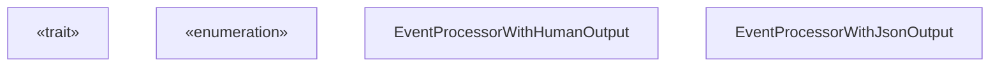
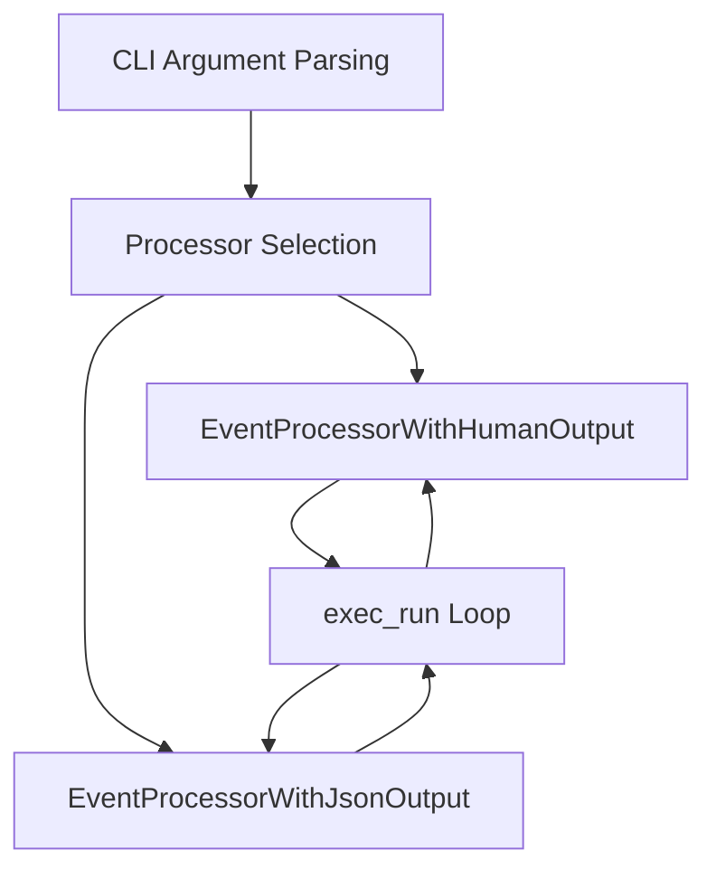
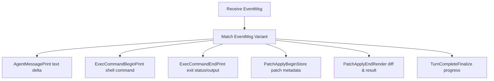

# Exec 模式事件处理

相关源文件

-   [codex-rs/core/src/codex.rs](https://github.com/openai/codex/blob/d807d44a/codex-rs/core/src/codex.rs)
-   [codex-rs/core/src/rollout/policy.rs](https://github.com/openai/codex/blob/d807d44a/codex-rs/core/src/rollout/policy.rs)
-   [codex-rs/exec/src/event\_processor.rs](https://github.com/openai/codex/blob/d807d44a/codex-rs/exec/src/event_processor.rs)
-   [codex-rs/exec/src/event\_processor\_with\_human\_output.rs](https://github.com/openai/codex/blob/d807d44a/codex-rs/exec/src/event_processor_with_human_output.rs)
-   [codex-rs/exec/src/event\_processor\_with\_jsonl\_output.rs](https://github.com/openai/codex/blob/d807d44a/codex-rs/exec/src/event_processor_with_jsonl_output.rs)
-   [codex-rs/exec/src/exec\_events.rs](https://github.com/openai/codex/blob/d807d44a/codex-rs/exec/src/exec_events.rs)
-   [codex-rs/exec/tests/event\_processor\_with\_json\_output.rs](https://github.com/openai/codex/blob/d807d44a/codex-rs/exec/tests/event_processor_with_json_output.rs)
-   [codex-rs/mcp-server/src/codex\_tool\_runner.rs](https://github.com/openai/codex/blob/d807d44a/codex-rs/mcp-server/src/codex_tool_runner.rs)
-   [codex-rs/protocol/src/protocol.rs](https://github.com/openai/codex/blob/d807d44a/codex-rs/protocol/src/protocol.rs)
-   [codex-rs/tui/src/app.rs](https://github.com/openai/codex/blob/d807d44a/codex-rs/tui/src/app.rs)
-   [codex-rs/tui/src/app\_event.rs](https://github.com/openai/codex/blob/d807d44a/codex-rs/tui/src/app_event.rs)
-   [codex-rs/tui/src/bottom\_pane/chat\_composer.rs](https://github.com/openai/codex/blob/d807d44a/codex-rs/tui/src/bottom_pane/chat_composer.rs)
-   [codex-rs/tui/src/bottom\_pane/mod.rs](https://github.com/openai/codex/blob/d807d44a/codex-rs/tui/src/bottom_pane/mod.rs)
-   [codex-rs/tui/src/chatwidget.rs](https://github.com/openai/codex/blob/d807d44a/codex-rs/tui/src/chatwidget.rs)
-   [codex-rs/tui/src/chatwidget/tests.rs](https://github.com/openai/codex/blob/d807d44a/codex-rs/tui/src/chatwidget/tests.rs)
-   [codex-rs/tui/src/history\_cell.rs](https://github.com/openai/codex/blob/d807d44a/codex-rs/tui/src/history_cell.rs)
-   [codex-rs/tui/src/slash\_command.rs](https://github.com/openai/codex/blob/d807d44a/codex-rs/tui/src/slash_command.rs)

## 目的与范围

本文档描述 `codex exec` 在非交互（无头）模式下如何处理并格式化来自代理核心的事件。事件处理层将内部协议事件转换为人类可读的终端输出或机器可解析的 JSONL，同步处理审批请求，并管理进度指示。

终端输出的主要实现是 `EventProcessorWithHumanOutput`，它管理 ANSI 样式、补丁 diff 渲染，以及基于 stdin 的同步审批提示。

## EventProcessor 架构

事件处理系统采用基于 trait 的设计，以支持多种输出格式。所有处理器都实现 `EventProcessor` trait，它定义了消费代理事件并生成格式化输出的契约。

### 核心 trait 定义

**来源：** [codex-rs/exec/src/event\_processor.rs7-26](https://github.com/openai/codex/blob/d807d44a/codex-rs/exec/src/event_processor.rs#L7-L26) [codex-rs/exec/src/event\_processor\_with\_human\_output.rs65-93](https://github.com/openai/codex/blob/d807d44a/codex-rs/exec/src/event_processor_with_human_output.rs#L65-L93)

### 处理器选择

exec 模式会根据 CLI 标志选择相应处理器。人类可读输出在支持时使用 ANSI 格式化，并将结构化文本写入 stderr；JSONL 模式则将每行一个 JSON 对象输出到 stdout。

**来源：** [codex-rs/exec/src/event\_processor\_with\_human\_output.rs95-151](https://github.com/openai/codex/blob/d807d44a/codex-rs/exec/src/event_processor_with_human_output.rs#L95-L151)

## 人类可读输出格式化

`EventProcessorWithHumanOutput` 使用 `owo-colors` crate 提供 ANSI 转义码来格式化终端显示。它维护内部状态，以处理多段消息和进度指示。

### ANSI 样式管理

处理器会根据是否启用 ANSI 初始化 `owo_colors::Style` 字段。若未启用，则将样式初始化为空，以确保不输出转义码 [codex-rs/exec/src/event\_processor\_with\_human\_output.rs104-150](https://github.com/openai/codex/blob/d807d44a/codex-rs/exec/src/event_processor_with_human_output.rs#L104-L150)

| 字段 | 样式 | 用途 |
| --- | --- | --- |
| `bold` | 粗体 | 标题与重要标签 |
| `italic` | 斜体 | 元数据与提示 |
| `dimmed` | 变暗 | 时间戳与次要信息 |
| `magenta` | 品红 | 代理推理标题 |
| `red` | 红色 | 错误与失败 |
| `green` | 绿色 | 成功状态与新增内容 |
| `cyan` | 青色 | 工具调用与系统消息 |
| `yellow` | 黄色 | 警告与待处理状态 |

**来源：** [codex-rs/exec/src/event\_processor\_with\_human\_output.rs71-80](https://github.com/openai/codex/blob/d807d44a/codex-rs/exec/src/event_processor_with_human_output.rs#L71-L80) [codex-rs/exec/src/event\_processor\_with\_human\_output.rs104-150](https://github.com/openai/codex/blob/d807d44a/codex-rs/exec/src/event_processor_with_human_output.rs#L104-L150)

### 配置摘要显示

会话开始时，`print_config_summary` 会输出会话配置摘要，包括模型信息与沙箱策略 [codex-rs/exec/src/event\_processor\_with\_human\_output.rs181-281](https://github.com/openai/codex/blob/d807d44a/codex-rs/exec/src/event_processor_with_human_output.rs#L181-L281)。它使用沙箱摘要工具中的 `create_config_summary_entries` 生成标准策略描述 [codex-rs/exec/src/event\_processor\_with\_human\_output.rs194-195](https://github.com/openai/codex/blob/d807d44a/codex-rs/exec/src/event_processor_with_human_output.rs#L194-L195)

## 事件类型处理

处理器实现了 `process_event`，对 `EventMsg` 变体进行匹配以驱动终端输出 [codex-rs/exec/src/event\_processor\_with\_human\_output.rs283-888](https://github.com/openai/codex/blob/d807d44a/codex-rs/exec/src/event_processor_with_human_output.rs#L283-L888)

### 核心事件处理流程

**来源：** [codex-rs/exec/src/event\_processor\_with\_human\_output.rs283-888](https://github.com/openai/codex/blob/d807d44a/codex-rs/exec/src/event_processor_with_human_output.rs#L283-L888)

### 工具调用与执行输出

-   **Shell 命令：** `ExecCommandBeginEvent` 会打印正在运行的命令 [codex-rs/exec/src/event\_processor\_with\_human\_output.rs364-386](https://github.com/openai/codex/blob/d807d44a/codex-rs/exec/src/event_processor_with_human_output.rs#L364-L386)。`ExecCommandEndEvent` 会打印退出状态和最多 `MAX_OUTPUT_LINES_FOR_EXEC_TOOL_CALL`（20 行）的输出 [codex-rs/exec/src/event\_processor\_with\_human\_output.rs387-489](https://github.com/openai/codex/blob/d807d44a/codex-rs/exec/src/event_processor_with_human_output.rs#L387-L489)
-   **补丁应用：** 处理器在 `call_id_to_patch` 中跟踪补丁开始时间 [codex-rs/exec/src/event\_processor\_with\_human\_output.rs510-517](https://github.com/openai/codex/blob/d807d44a/codex-rs/exec/src/event_processor_with_human_output.rs#L510-L517)。完成时渲染 diff 与成功/失败状态 [codex-rs/exec/src/event\_processor\_with\_human\_output.rs518-624](https://github.com/openai/codex/blob/d807d44a/codex-rs/exec/src/event_processor_with_human_output.rs#L518-L624)
-   **MCP 工具：** 显示服务器和工具名称、参数及结果内容 [codex-rs/exec/src/event\_processor\_with\_human\_output.rs490-509](https://github.com/openai/codex/blob/d807d44a/codex-rs/exec/src/event_processor_with_human_output.rs#L490-L509)

## 审批处理

与使用异步覆盖层的 TUI 不同，Exec 模式通过阻塞读取 `stdin` 以同步处理审批。

### Exec 审批流程

> **[Mermaid sequence]**
> *(图表结构无法解析)*

**来源：** [codex-rs/exec/src/event\_processor\_with\_human\_output.rs895-1074](https://github.com/openai/codex/blob/d807d44a/codex-rs/exec/src/event_processor_with_human_output.rs#L895-L1074)

审批逻辑支持：

-   **Yes/No：** 标准确认 [codex-rs/exec/src/event\_processor\_with\_human\_output.rs1011-1014](https://github.com/openai/codex/blob/d807d44a/codex-rs/exec/src/event_processor_with_human_output.rs#L1011-L1014)
-   **Edit：** 提示输入新的命令字符串，以替换提议命令执行 [codex-rs/exec/src/event\_processor\_with\_human\_output.rs1015-1033](https://github.com/openai/codex/blob/d807d44a/codex-rs/exec/src/event_processor_with_human_output.rs#L1015-L1033)
-   **Always：** 批准当前请求，并向 core 发出信号以自动批准未来类似请求 [codex-rs/exec/src/event\_processor\_with\_human\_output.rs1034-1037](https://github.com/openai/codex/blob/d807d44a/codex-rs/exec/src/event_processor_with_human_output.rs#L1034-L1037)

## 进度与 Token 使用

处理器会在轮次进行中管理“进度”行（spinner）。若启用 `use_ansi_cursor`，它会使用 ANSI 转义序列原地更新 spinner [codex-rs/exec/src/event\_processor\_with\_human\_output.rs1201-1280](https://github.com/openai/codex/blob/d807d44a/codex-rs/exec/src/event_processor_with_human_output.rs#L1201-L1280)

Token 使用通过 `last_total_token_usage` 跟踪，并在 `TurnComplete` 或会话结束时打印 [codex-rs/exec/src/event\_processor\_with\_human\_output.rs806-810](https://github.com/openai/codex/blob/d807d44a/codex-rs/exec/src/event_processor_with_human_output.rs#L806-L810)

**来源：** [codex-rs/exec/src/event\_processor\_with\_human\_output.rs85](https://github.com/openai/codex/blob/d807d44a/codex-rs/exec/src/event_processor_with_human_output.rs#L85-L85) [codex-rs/exec/src/event\_processor\_with\_human\_output.rs1201-1280](https://github.com/openai/codex/blob/d807d44a/codex-rs/exec/src/event_processor_with_human_output.rs#L1201-L1280)
