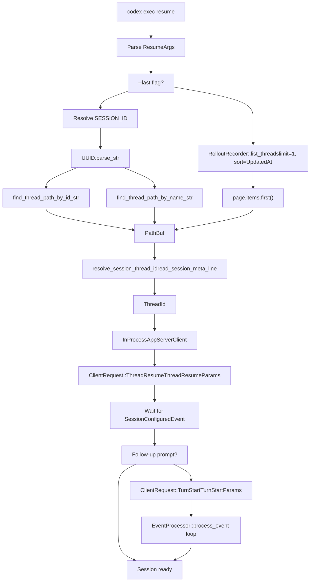
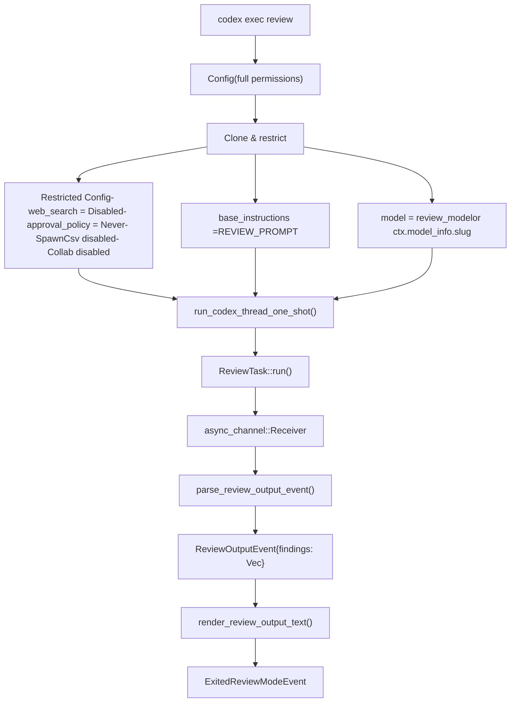
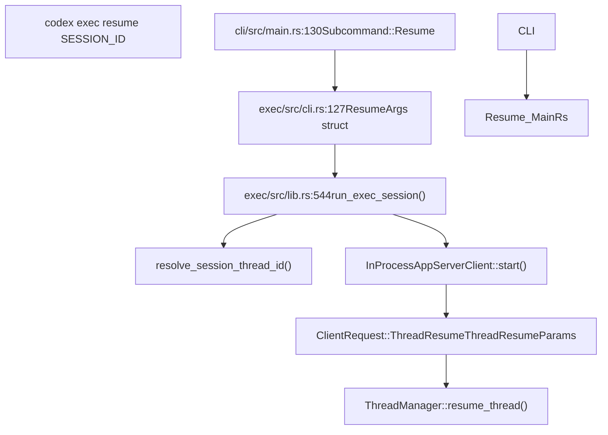
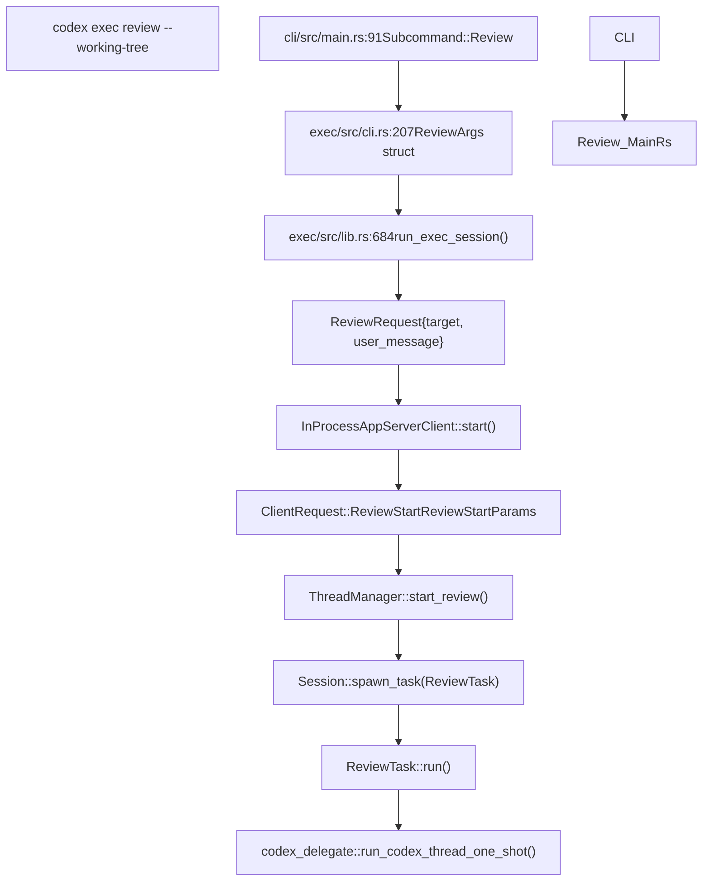

# Resume 与 Review 命令

相关源文件

-   [.bazelignore](https://github.com/openai/codex/blob/d807d44a/.bazelignore)
-   [codex-rs/apply-patch/tests/suite/scenarios.rs](https://github.com/openai/codex/blob/d807d44a/codex-rs/apply-patch/tests/suite/scenarios.rs)
-   [codex-rs/cli/tests/features.rs](https://github.com/openai/codex/blob/d807d44a/codex-rs/cli/tests/features.rs)
-   [codex-rs/core/src/exec\_policy.rs](https://github.com/openai/codex/blob/d807d44a/codex-rs/core/src/exec_policy.rs)
-   [codex-rs/core/src/exec\_policy\_tests.rs](https://github.com/openai/codex/blob/d807d44a/codex-rs/core/src/exec_policy_tests.rs)
-   [codex-rs/core/src/tasks/review.rs](https://github.com/openai/codex/blob/d807d44a/codex-rs/core/src/tasks/review.rs)
-   [codex-rs/core/tests/suite/approvals.rs](https://github.com/openai/codex/blob/d807d44a/codex-rs/core/tests/suite/approvals.rs)
-   [codex-rs/core/tests/suite/codex\_delegate.rs](https://github.com/openai/codex/blob/d807d44a/codex-rs/core/tests/suite/codex_delegate.rs)
-   [codex-rs/core/tests/suite/otel.rs](https://github.com/openai/codex/blob/d807d44a/codex-rs/core/tests/suite/otel.rs)
-   [codex-rs/core/tests/suite/review.rs](https://github.com/openai/codex/blob/d807d44a/codex-rs/core/tests/suite/review.rs)
-   [codex-rs/exec/tests/suite/auth\_env.rs](https://github.com/openai/codex/blob/d807d44a/codex-rs/exec/tests/suite/auth_env.rs)
-   [codex-rs/exec/tests/suite/resume.rs](https://github.com/openai/codex/blob/d807d44a/codex-rs/exec/tests/suite/resume.rs)
-   [codex-rs/utils/cargo-bin/Cargo.toml](https://github.com/openai/codex/blob/d807d44a/codex-rs/utils/cargo-bin/Cargo.toml)
-   [codex-rs/utils/cargo-bin/src/lib.rs](https://github.com/openai/codex/blob/d807d44a/codex-rs/utils/cargo-bin/src/lib.rs)

本页记录可通过 `codex exec` 使用的非交互 `resume` 与 `review` 命令。这些命令支持无头会话续接与代码评审工作流，而无需完整 TUI。

---

## 概览

`codex exec` 子命令支持两种专用工作流：

-   **Resume**：按 ID 或线程名继续之前保存的会话，并可在恢复后发送跟进 prompt。
-   **Review**：启动受限子代理，在不修改工作树的前提下分析代码改动或特定文件。

两个命令都利用 app server 协议来管理线程生命周期与事件流，无需终端 UI 组件。

**来源：** [codex-rs/exec/src/cli.rs117-124](https://github.com/openai/codex/blob/d807d44a/codex-rs/exec/src/cli.rs#L117-L124) [codex-rs/cli/src/main.rs86-91](https://github.com/openai/codex/blob/d807d44a/codex-rs/cli/src/main.rs#L86-L91)

---

## Resume 命令结构

### 命令行接口

resume 命令接受以下参数：

| 参数 | 描述 | 类型 |
| --- | --- | --- |
| `SESSION_ID` | 要恢复的 UUID 或线程名 | 可选位置参数 |
| `--last` | 不经选择器恢复最近会话 | 标志 |
| `--all` | 显示所有会话（禁用 cwd 过滤） | 标志 |
| `--image` / `-i` | 给跟进 prompt 附加图像 | 可重复路径 |
| `PROMPT` | 恢复后发送的可选 prompt | 位置参数 |

当指定 `--last` 且未提供显式 prompt 时，位置参数会被解释为 prompt，而非 session ID。

**来源：** [codex-rs/exec/src/cli.rs127-175](https://github.com/openai/codex/blob/d807d44a/codex-rs/exec/src/cli.rs#L127-L175)

### 会话解析流程

**图：Resume 会话解析与初始化流程**

解析 `SESSION_ID` 时，逻辑会优先按 UUID 处理，再按线程名处理。`--all` 标志会禁用基于 CWD 的过滤，从而允许恢复在不同目录启动的会话。恢复是否成功通过检查更新后的 rollout 文件中新标记来验证。

**来源：** [codex-rs/exec/src/lib.rs544-666](https://github.com/openai/codex/blob/d807d44a/codex-rs/exec/src/lib.rs#L544-L666) [codex-rs/exec/tests/suite/resume.rs116-167](https://github.com/openai/codex/blob/d807d44a/codex-rs/exec/tests/suite/resume.rs#L116-L167)

---

## Review 命令架构

### 命令行接口

review 命令接受：

| 参数 | 描述 | 类型 |
| --- | --- | --- |
| `--working-tree` / `-w` | 评审工作树中的未提交改动 | 标志 |
| `--target` / `-t` | 要评审的特定文件路径 | 可重复路径 |
| `PROMPT` | 评审关注点的可选说明 | 位置参数 |

`--working-tree` 与 `--target` 至少必须指定其一。

**来源：** [codex-rs/exec/src/cli.rs207-270](https://github.com/openai/codex/blob/d807d44a/codex-rs/exec/src/cli.rs#L207-L270)

### 子代理委派模型

**图：Review 子代理架构与配置继承**

Review 子代理继承主会话配置，但施加严格覆盖以防副作用：

-   `web_search_mode` 设为 `WebSearchMode::Disabled` [codex-rs/core/src/tasks/review.rs98-102](https://github.com/openai/codex/blob/d807d44a/codex-rs/core/src/tasks/review.rs#L98-L102)
-   `approval_policy` 设为 `AskForApproval::Never` [codex-rs/core/src/tasks/review.rs108](https://github.com/openai/codex/blob/d807d44a/codex-rs/core/src/tasks/review.rs#L108-L108)
-   显式禁用特性 `SpawnCsv` 与 `Collab` [codex-rs/core/src/tasks/review.rs103-104](https://github.com/openai/codex/blob/d807d44a/codex-rs/core/src/tasks/review.rs#L103-L104)
-   `base_instructions` 替换为 `REVIEW_PROMPT` 模板 [codex-rs/core/src/tasks/review.rs107](https://github.com/openai/codex/blob/d807d44a/codex-rs/core/src/tasks/review.rs#L107-L107)

**来源：** [codex-rs/core/src/tasks/review.rs87-130](https://github.com/openai/codex/blob/d807d44a/codex-rs/core/src/tasks/review.rs#L87-L130) [codex-rs/core/tests/suite/review.rs39-87](https://github.com/openai/codex/blob/d807d44a/codex-rs/core/tests/suite/review.rs#L39-L87)

### Review 输出处理

Review 子代理会返回结构化 `ReviewOutputEvent`，其中包含 `ReviewFinding` 对象数组。若模型返回纯文本而非 JSON，`parse_review_output_event` 会尝试提取首个 JSON 对象，失败则回退为将文本包裹在 `overall_explanation` 中。

> **[Mermaid sequence]**
> *(图表结构无法解析)*

**图：Review 事件处理与结构化输出提取**

**来源：** [codex-rs/core/src/tasks/review.rs132-186](https://github.com/openai/codex/blob/d807d44a/codex-rs/core/src/tasks/review.rs#L132-L186) [codex-rs/core/src/tasks/review.rs187-202](https://github.com/openai/codex/blob/d807d44a/codex-rs/core/src/tasks/review.rs#L187-L202)

---

## Exec 模式中的审批处理

在 `exec` 模式下，审批请求会对照 `ExecPolicyManager` 进行评估。若命令匹配禁止规则，或命令需要审批但 `AskForApproval` 策略设为 `Never`，该请求会被自动拒绝。

### 策略冲突解析

系统通过 `prompt_is_rejected_by_policy` 检查 prompt 是否被策略拒绝。该逻辑会遵循 `rules` 与 `sandbox_approval` 的细粒度设置。

| 条件 | 拒绝原因 |
| --- | --- |
| 策略为 `Never` | `PROMPT_CONFLICT_REASON` |
| `prompt_is_rule` 为 true 但 rules 审批被禁用 | `REJECT_RULES_APPROVAL_REASON` |
| 需要 sandbox 审批但其被禁用 | `REJECT_SANDBOX_APPROVAL_REASON` |

**来源：** [codex-rs/core/src/exec\_policy.rs130-153](https://github.com/openai/codex/blob/d807d44a/codex-rs/core/src/exec_policy.rs#L130-L153) [codex-rs/core/src/exec\_policy.rs41-46](https://github.com/openai/codex/blob/d807d44a/codex-rs/core/src/exec_policy.rs#L41-L46)

---

## 代码实体映射

### Resume 命令路径

**图：Resume 命令从 CLI 到会话恢复的代码路径**

**来源：** [codex-rs/cli/src/main.rs130](https://github.com/openai/codex/blob/d807d44a/codex-rs/cli/src/main.rs#L130-L130) [codex-rs/exec/src/cli.rs127-193](https://github.com/openai/codex/blob/d807d44a/codex-rs/exec/src/cli.rs#L127-L193) [codex-rs/exec/src/lib.rs544-666](https://github.com/openai/codex/blob/d807d44a/codex-rs/exec/src/lib.rs#L544-L666)

### Review 命令路径

**图：Review 命令从 CLI 到结构化输出的代码路径**

**来源：** [codex-rs/cli/src/main.rs91](https://github.com/openai/codex/blob/d807d44a/codex-rs/cli/src/main.rs#L91-L91) [codex-rs/exec/src/cli.rs207-270](https://github.com/openai/codex/blob/d807d44a/codex-rs/exec/src/cli.rs#L207-L270) [codex-rs/core/src/tasks/review.rs42-85](https://github.com/openai/codex/blob/d807d44a/codex-rs/core/src/tasks/review.rs#L42-L85)

---

## 实现细节

### 会话解析辅助函数

`resolve_session_thread_id()` 辅助函数会读取 rollout 文件中的元数据以提取线程 ID。它会解析 rollout 文件首行（JSONL 格式）以查找 `SessionMeta` 载荷。

**来源：** [codex-rs/exec/src/lib.rs1204-1240](https://github.com/openai/codex/blob/d807d44a/codex-rs/exec/src/lib.rs#L1204-L1240) [codex-rs/exec/tests/suite/resume.rs61-72](https://github.com/openai/codex/blob/d807d44a/codex-rs/exec/tests/suite/resume.rs#L61-L72)

### Review 子代理限制

`ReviewTask` 通过显式禁用特性并将模型设置为指定 `review_model` 或当前会话模型，确保子代理无法执行危险动作。

**来源：** [codex-rs/core/src/tasks/review.rs93-114](https://github.com/openai/codex/blob/d807d44a/codex-rs/core/src/tasks/review.rs#L93-L114) [codex-rs/core/tests/suite/review.rs100-114](https://github.com/openai/codex/blob/d807d44a/codex-rs/core/tests/suite/review.rs#L100-L114)
