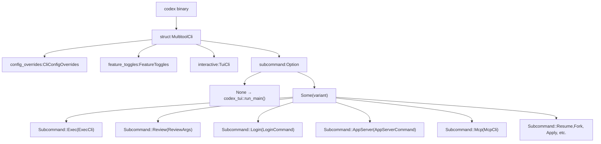
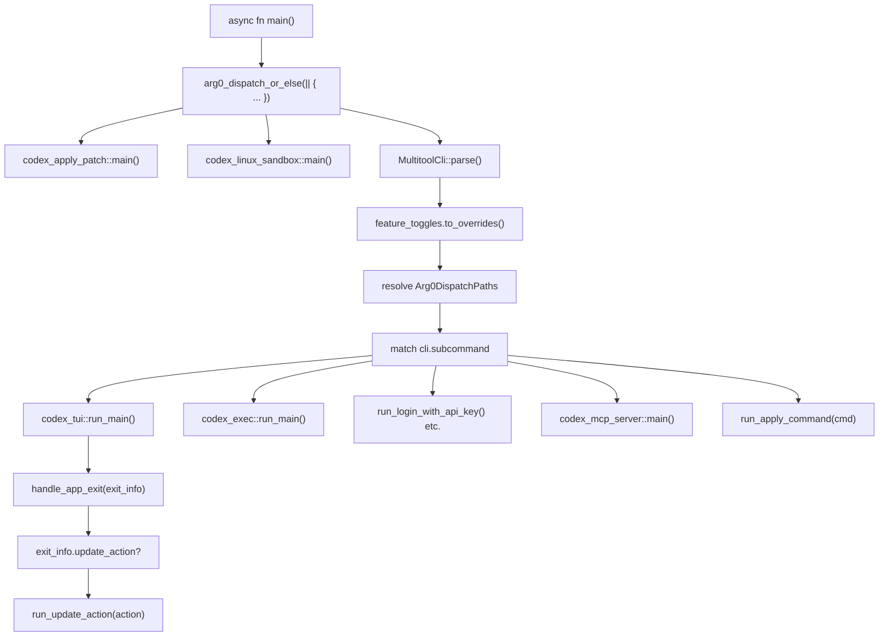
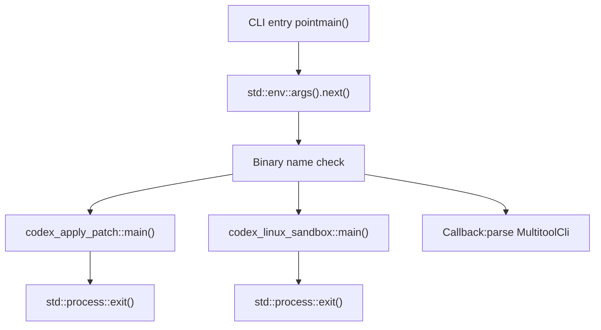

# CLI 入口点与多工具分发

相关源文件

-   [.github/dotslash-config.json](https://github.com/openai/codex/blob/d807d44a/.github/dotslash-config.json)
-   [codex-cli/.gitignore](https://github.com/openai/codex/blob/d807d44a/codex-cli/.gitignore)
-   [codex-cli/README.md](https://github.com/openai/codex/blob/d807d44a/codex-cli/README.md?plain=1)
-   [codex-cli/bin/codex.js](https://github.com/openai/codex/blob/d807d44a/codex-cli/bin/codex.js)
-   [codex-cli/bin/rg](https://github.com/openai/codex/blob/d807d44a/codex-cli/bin/rg)
-   [codex-cli/scripts/README.md](https://github.com/openai/codex/blob/d807d44a/codex-cli/scripts/README.md?plain=1)
-   [codex-cli/scripts/build\_npm\_package.py](https://github.com/openai/codex/blob/d807d44a/codex-cli/scripts/build_npm_package.py)
-   [codex-cli/scripts/install\_native\_deps.py](https://github.com/openai/codex/blob/d807d44a/codex-cli/scripts/install_native_deps.py)
-   [codex-rs/Cargo.lock](https://github.com/openai/codex/blob/d807d44a/codex-rs/Cargo.lock)
-   [codex-rs/Cargo.toml](https://github.com/openai/codex/blob/d807d44a/codex-rs/Cargo.toml)
-   [codex-rs/README.md](https://github.com/openai/codex/blob/d807d44a/codex-rs/README.md?plain=1)
-   [codex-rs/cli/Cargo.toml](https://github.com/openai/codex/blob/d807d44a/codex-rs/cli/Cargo.toml)
-   [codex-rs/cli/src/lib.rs](https://github.com/openai/codex/blob/d807d44a/codex-rs/cli/src/lib.rs)
-   [codex-rs/cli/src/main.rs](https://github.com/openai/codex/blob/d807d44a/codex-rs/cli/src/main.rs)
-   [codex-rs/config.md](https://github.com/openai/codex/blob/d807d44a/codex-rs/config.md?plain=1)
-   [codex-rs/core/Cargo.toml](https://github.com/openai/codex/blob/d807d44a/codex-rs/core/Cargo.toml)
-   [codex-rs/core/src/flags.rs](https://github.com/openai/codex/blob/d807d44a/codex-rs/core/src/flags.rs)
-   [codex-rs/core/src/lib.rs](https://github.com/openai/codex/blob/d807d44a/codex-rs/core/src/lib.rs)
-   [codex-rs/core/src/model\_provider\_info.rs](https://github.com/openai/codex/blob/d807d44a/codex-rs/core/src/model_provider_info.rs)
-   [codex-rs/exec/Cargo.toml](https://github.com/openai/codex/blob/d807d44a/codex-rs/exec/Cargo.toml)
-   [codex-rs/exec/src/cli.rs](https://github.com/openai/codex/blob/d807d44a/codex-rs/exec/src/cli.rs)
-   [codex-rs/exec/src/lib.rs](https://github.com/openai/codex/blob/d807d44a/codex-rs/exec/src/lib.rs)
-   [codex-rs/process-hardening/README.md](https://github.com/openai/codex/blob/d807d44a/codex-rs/process-hardening/README.md?plain=1)
-   [codex-rs/responses-api-proxy/npm/README.md](https://github.com/openai/codex/blob/d807d44a/codex-rs/responses-api-proxy/npm/README.md?plain=1)
-   [codex-rs/responses-api-proxy/npm/bin/codex-responses-api-proxy.js](https://github.com/openai/codex/blob/d807d44a/codex-rs/responses-api-proxy/npm/bin/codex-responses-api-proxy.js)
-   [codex-rs/tui/Cargo.toml](https://github.com/openai/codex/blob/d807d44a/codex-rs/tui/Cargo.toml)
-   [codex-rs/tui/src/cli.rs](https://github.com/openai/codex/blob/d807d44a/codex-rs/tui/src/cli.rs)
-   [codex-rs/tui/src/lib.rs](https://github.com/openai/codex/blob/d807d44a/codex-rs/tui/src/lib.rs)
-   [scripts/stage\_npm\_packages.py](https://github.com/openai/codex/blob/d807d44a/scripts/stage_npm_packages.py)

## 目的与范围

本页记录 Codex 二进制中的 **CLI 入口点架构**，重点说明 `codex` 可执行文件如何作为 **多工具分发器**，依据命令行参数与二进制名称将调用路由到不同执行模式（TUI、Exec、App Server 等）。该分发机制使用基于 `clap` 的解析器进行子命令路由，并使用 **arg0 分发** 系统支持特化二进制调用。

关于 **TUI 模式** 本身，请参见 [4.1](https://github.com/openai/codex/blob/d807d44a/4.1)。关于 **Exec 模式** 实现，请参见 [4.2](https://github.com/openai/codex/blob/d807d44a/4.2)。关于 **App Server** 协议处理，请参见 [4.5](https://github.com/openai/codex/blob/d807d44a/4.5)。本页仅聚焦于“选择调用哪种模式”的路由层。

---

## MultitoolCli 结构与子命令层级

`codex` 二进制使用单一 `MultitoolCli` 解析器定义顶层命令结构。未提供子命令时，CLI 默认进入**交互式 TUI 模式**。解析器结构定义见 [codex-rs/cli/src/main.rs71-86](https://github.com/openai/codex/blob/d807d44a/codex-rs/cli/src/main.rs#L71-L86)

**图：MultitoolCli 结构与字段组合**

**来源**： [codex-rs/cli/src/main.rs71-86](https://github.com/openai/codex/blob/d807d44a/codex-rs/cli/src/main.rs#L71-L86) [codex-rs/cli/src/main.rs88-153](https://github.com/openai/codex/blob/d807d44a/codex-rs/cli/src/main.rs#L88-L153)

`MultitoolCli` 上的 `#[clap(subcommand_negates_reqs = true)]` 属性 [codex-rs/cli/src/main.rs64](https://github.com/openai/codex/blob/d807d44a/codex-rs/cli/src/main.rs#L64-L64) 表示当存在子命令时，顶层交互参数不会被校验，从而允许不同调用模式具有不同参数要求。`interactive: TuiCli` 字段通过 `#[clap(flatten)]` [codex-rs/cli/src/main.rs81-82](https://github.com/openai/codex/blob/d807d44a/codex-rs/cli/src/main.rs#L81-L82) 展平，使得未指定子命令时 TUI 特定标志可在顶层使用。

---

## 子命令路由表

下表将每个子命令映射到其实现 crate 与主要用途：

| 子命令 | 枚举变体 | 结构体 | Crate | 用途 |
| --- | --- | --- | --- | --- |
| *(none)* | N/A | `TuiCli` | `codex-tui` | 交互式终端 UI（默认模式） |
| `exec` | `Subcommand::Exec` | `ExecCli` | `codex-exec` | 无头、非交互执行 |
| `review` | `Subcommand::Review` | `ReviewArgs` | `codex-exec` | 代码评审模式（委派给 exec） |
| `login` | `Subcommand::Login` | `LoginCommand` | `codex-cli` | 使用 ChatGPT 或 API key 认证 |
| `logout` | `Subcommand::Logout` | `LogoutCommand` | `codex-cli` | 移除已存储凭据 |
| `mcp` | `Subcommand::Mcp` | `McpCli` | `codex-cli` | 管理外部 MCP 服务器 |
| `mcp-server` | `Subcommand::McpServer` | *(unit variant)* | `codex-mcp-server` | 将 Codex 作为 MCP 服务器运行（stdio） |
| `app-server` | `Subcommand::AppServer` | `AppServerCommand` | `codex-cli` | 用于 IDE 集成的 JSON-RPC 2.0 服务器 |
| `app` | `Subcommand::App` | `AppCommand` | `codex-cli` | 启动 Codex 桌面应用（仅 macOS） |
| `apply` | `Subcommand::Apply` | `ApplyCommand` | `codex-chatgpt` | 将代理生成 diff 应用到工作树 |
| `resume` | `Subcommand::Resume` | `ResumeCommand` | `codex-cli` | 恢复先前会话（TUI 选择器） |
| `fork` | `Subcommand::Fork` | `ForkCommand` | `codex-cli` | 分叉先前会话 |
| `sandbox` | `Subcommand::Sandbox` | `SandboxArgs` | `codex-cli` | 直接测试沙箱执行 |
| `completion` | `Subcommand::Completion` | `CompletionCommand` | `codex-cli` | 生成 shell 补全脚本 |
| `features` | `Subcommand::Features` | `FeaturesCli` | `codex-cli` | 检查功能标志 |
| `cloud` | `Subcommand::Cloud` | `CloudTasksCli` | `codex-cloud-tasks` | 浏览并应用 Codex Cloud 任务 |
| `debug` | `Subcommand::Debug` | `DebugCommand` | `codex-cli` | 调试工具集 |

**来源**： [codex-rs/cli/src/main.rs88-153](https://github.com/openai/codex/blob/d807d44a/codex-rs/cli/src/main.rs#L88-L153)

---

## 分发流程与 main 函数

`main` 函数编排分发逻辑。入口点使用 `#[tokio::main]` 属性，为全部模式提供异步运行时支持。

**图：Main 函数分发流程**

**来源**： [codex-rs/cli/src/main.rs1-86](https://github.com/openai/codex/blob/d807d44a/codex-rs/cli/src/main.rs#L1-L86) [codex-rs/arg0/src/lib.rs28-73](https://github.com/openai/codex/blob/d807d44a/codex-rs/arg0/src/lib.rs#L28-L73)

### 关键分发点

1.  **Arg0 分发**：来自 `codex-arg0` 的 `arg0_dispatch_or_else()` 在解析 CLI 参数前先检查二进制名称（`std::env::args().next()`）。若匹配特化模式（例如以 `-apply-patch` 或 `-linux-sandbox` 结尾），会立刻运行处理器并退出 [codex-rs/arg0/src/lib.rs28-73](https://github.com/openai/codex/blob/d807d44a/codex-rs/arg0/src/lib.rs#L28-L73)

2.  **MultitoolCli 解析**：若未触发 arg0 分发，`MultitoolCli::parse()` 使用 `clap` 解析全部参数与标志 [codex-rs/cli/src/main.rs3](https://github.com/openai/codex/blob/d807d44a/codex-rs/cli/src/main.rs#L3-L3)

3.  **功能开关展开**：`FeatureToggles` 标志会被转换为核心系统配置覆盖项 [codex-rs/cli/src/main.rs75-76](https://github.com/openai/codex/blob/d807d44a/codex-rs/cli/src/main.rs#L75-L76)

4.  **子命令匹配**：对 `cli.subcommand` 的大型 `match` 语句将执行路由到对应处理函数或 crate 入口点 [codex-rs/cli/src/main.rs88-153](https://github.com/openai/codex/blob/d807d44a/codex-rs/cli/src/main.rs#L88-L153)

---

## 用于特化二进制的 Arg0 分发

**arg0 分发**机制允许同一二进制在不同名称下调用时触发特化行为。该机制由 `codex-arg0` crate 中的 `arg0_dispatch_or_else` 函数实现 [codex-rs/arg0/src/lib.rs28-73](https://github.com/openai/codex/blob/d807d44a/codex-rs/arg0/src/lib.rs#L28-L73)

### 特化二进制名称

| 二进制名称模式 | 处理函数 | Crate | 用途 |
| --- | --- | --- | --- |
| `*-apply-patch` | `codex_apply_patch::main()` | `codex-apply-patch` | 将来自 stdin 的补丁应用到文件系统 |
| `*-linux-sandbox` | `codex_linux_sandbox::main()` | `codex-linux-sandbox` | 在 Linux 上使用 Landlock+seccomp 运行命令 |

模式匹配是**基于后缀**的：任何以 `-apply-patch` 或 `-linux-sandbox` 结尾的二进制名都会触发对应处理器 [codex-rs/arg0/src/lib.rs40-42](https://github.com/openai/codex/blob/d807d44a/codex-rs/arg0/src/lib.rs#L40-L42)

### Arg0 分发流程

**来源**： [codex-rs/arg0/src/lib.rs28-73](https://github.com/openai/codex/blob/d807d44a/codex-rs/arg0/src/lib.rs#L28-L73)

---

## 默认模式选择：无子命令时进入 TUI

未提供子命令时，CLI 默认进入 **TUI 模式**。`TuiCli` 通过 `#[clap(flatten)]` [codex-rs/cli/src/main.rs81-82](https://github.com/openai/codex/blob/d807d44a/codex-rs/cli/src/main.rs#L81-L82) 展平到 `MultitoolCli`，因此 TUI 专用参数可在顶层使用。

当 `cli.subcommand` 为 `None` 时，代码路径会调用 `codex_tui::run_main()` [codex-rs/cli/src/main.rs85-86](https://github.com/openai/codex/blob/d807d44a/codex-rs/cli/src/main.rs#L85-L86)

### 作为 TUI 变体的 Resume 与 Fork

`resume` [codex-rs/cli/src/main.rs197-216](https://github.com/openai/codex/blob/d807d44a/codex-rs/cli/src/main.rs#L197-L216) 与 `fork` [codex-rs/cli/src/main.rs219-235](https://github.com/openai/codex/blob/d807d44a/codex-rs/cli/src/main.rs#L219-L235) 子命令是特化的 TUI 调用。main 函数会将这些子命令映射为带特定标志的 `TuiCli` 结构体，然后启动 TUI。

**来源**： [codex-rs/cli/src/main.rs197-235](https://github.com/openai/codex/blob/d807d44a/codex-rs/cli/src/main.rs#L197-L235)

---

## 通用 CLI 基础设施

### CliConfigOverrides

所有模式共享来自 `codex-utils-cli` 的 `CliConfigOverrides` 结构体，它提供 `-c key=value` 语法，用于运行时覆盖 `config.toml` 值 [codex-rs/cli/src/main.rs72-73](https://github.com/openai/codex/blob/d807d44a/codex-rs/cli/src/main.rs#L72-L73)

### FeatureToggles

`FeatureToggles` 结构体 [codex-rs/cli/src/main.rs75-76](https://github.com/openai/codex/blob/d807d44a/codex-rs/cli/src/main.rs#L75-L76) 提供 `--enable FEATURE` 与 `--disable FEATURE` 标志。它们会通过 `codex-features` 中的 `is_known_feature_key()` 进行已知特性校验 [codex-rs/cli/src/main.rs53](https://github.com/openai/codex/blob/d807d44a/codex-rs/cli/src/main.rs#L53-L53)

**来源**： [codex-rs/cli/src/main.rs51-53](https://github.com/openai/codex/blob/d807d44a/codex-rs/cli/src/main.rs#L51-L53) [codex-rs/cli/src/main.rs75-76](https://github.com/openai/codex/blob/d807d44a/codex-rs/cli/src/main.rs#L75-L76)

---

## 退出处理与更新动作

TUI 或 Exec 模式完成后，控制流返回 main 函数，并调用 `handle_app_exit()` 处理退出状态。该函数执行：

1.  **致命错误报告**：若会话崩溃则报告错误。
2.  **Token 使用摘要**：显示本轮消耗的 token 数量。
3.  **更新动作执行**：若存在 `UpdateAction`（例如用户在 TUI 中请求更新），则运行更新命令 [codex-rs/cli/src/main.rs30](https://github.com/openai/codex/blob/d807d44a/codex-rs/cli/src/main.rs#L30-L30)

**来源**： [codex-rs/cli/src/main.rs27-30](https://github.com/openai/codex/blob/d807d44a/codex-rs/cli/src/main.rs#L27-L30)

---

## 入口点职责总结

CLI 入口层提供：

1.  **统一二进制接口**：单一 `codex` 可执行文件，基于子命令选择模式 [codex-rs/cli/src/main.rs71-86](https://github.com/openai/codex/blob/d807d44a/codex-rs/cli/src/main.rs#L71-L86)
2.  **Arg0 分发**：在不同名称调用时触发特化行为 [codex-rs/arg0/src/lib.rs28-73](https://github.com/openai/codex/blob/d807d44a/codex-rs/arg0/src/lib.rs#L28-L73)
3.  **默认进入 TUI**：交互模式是默认体验 [codex-rs/cli/src/main.rs85-86](https://github.com/openai/codex/blob/d807d44a/codex-rs/cli/src/main.rs#L85-L86)
4.  **配置覆盖传播**：`-c` 与功能标志会转发到所有模式 [codex-rs/cli/src/main.rs72-76](https://github.com/openai/codex/blob/d807d44a/codex-rs/cli/src/main.rs#L72-L76)
5.  **平台特定路径**：解析 Linux sandbox 等辅助二进制路径 [codex-rs/arg0/src/lib.rs10-26](https://github.com/openai/codex/blob/d807d44a/codex-rs/arg0/src/lib.rs#L10-L26)

**来源**： [codex-rs/cli/src/main.rs71-153](https://github.com/openai/codex/blob/d807d44a/codex-rs/cli/src/main.rs#L71-L153) [codex-rs/arg0/src/lib.rs10-73](https://github.com/openai/codex/blob/d807d44a/codex-rs/arg0/src/lib.rs#L10-L73)
