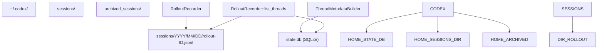
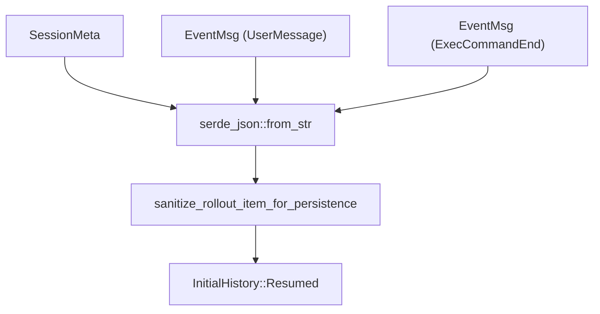

# 会话恢复与分叉

相关源文件

-   [codex-rs/app-server/tests/common/responses.rs](https://github.com/openai/codex/blob/d807d44a/codex-rs/app-server/tests/common/responses.rs)
-   [codex-rs/app-server/tests/common/rollout.rs](https://github.com/openai/codex/blob/d807d44a/codex-rs/app-server/tests/common/rollout.rs)
-   [codex-rs/app-server/tests/suite/v2/review.rs](https://github.com/openai/codex/blob/d807d44a/codex-rs/app-server/tests/suite/v2/review.rs)
-   [codex-rs/app-server/tests/suite/v2/thread\_archive.rs](https://github.com/openai/codex/blob/d807d44a/codex-rs/app-server/tests/suite/v2/thread_archive.rs)
-   [codex-rs/app-server/tests/suite/v2/thread\_fork.rs](https://github.com/openai/codex/blob/d807d44a/codex-rs/app-server/tests/suite/v2/thread_fork.rs)
-   [codex-rs/app-server/tests/suite/v2/thread\_list.rs](https://github.com/openai/codex/blob/d807d44a/codex-rs/app-server/tests/suite/v2/thread_list.rs)
-   [codex-rs/app-server/tests/suite/v2/thread\_resume.rs](https://github.com/openai/codex/blob/d807d44a/codex-rs/app-server/tests/suite/v2/thread_resume.rs)
-   [codex-rs/app-server/tests/suite/v2/thread\_start.rs](https://github.com/openai/codex/blob/d807d44a/codex-rs/app-server/tests/suite/v2/thread_start.rs)
-   [codex-rs/app-server/tests/suite/v2/thread\_unarchive.rs](https://github.com/openai/codex/blob/d807d44a/codex-rs/app-server/tests/suite/v2/thread_unarchive.rs)
-   [codex-rs/app-server/tests/suite/v2/turn\_interrupt.rs](https://github.com/openai/codex/blob/d807d44a/codex-rs/app-server/tests/suite/v2/turn_interrupt.rs)
-   [codex-rs/app-server/tests/suite/v2/turn\_start.rs](https://github.com/openai/codex/blob/d807d44a/codex-rs/app-server/tests/suite/v2/turn_start.rs)
-   [codex-rs/core/src/rollout/list.rs](https://github.com/openai/codex/blob/d807d44a/codex-rs/core/src/rollout/list.rs)
-   [codex-rs/core/src/rollout/recorder.rs](https://github.com/openai/codex/blob/d807d44a/codex-rs/core/src/rollout/recorder.rs)
-   [codex-rs/core/src/rollout/tests.rs](https://github.com/openai/codex/blob/d807d44a/codex-rs/core/src/rollout/tests.rs)
-   [codex-rs/core/tests/suite/cli\_stream.rs](https://github.com/openai/codex/blob/d807d44a/codex-rs/core/tests/suite/cli_stream.rs)
-   [codex-rs/core/tests/suite/resume.rs](https://github.com/openai/codex/blob/d807d44a/codex-rs/core/tests/suite/resume.rs)
-   [codex-rs/core/tests/suite/resume\_warning.rs](https://github.com/openai/codex/blob/d807d44a/codex-rs/core/tests/suite/resume_warning.rs)
-   [codex-rs/core/tests/suite/rollout\_list\_find.rs](https://github.com/openai/codex/blob/d807d44a/codex-rs/core/tests/suite/rollout_list_find.rs)
-   [codex-rs/debug-client/src/client.rs](https://github.com/openai/codex/blob/d807d44a/codex-rs/debug-client/src/client.rs)
-   [codex-rs/tui/src/resume\_picker.rs](https://github.com/openai/codex/blob/d807d44a/codex-rs/tui/src/resume_picker.rs)

## 目的与范围

本文档描述 Codex 如何通过恢复与分叉来管理会话连续性。**恢复（Resumption）** 允许用户从先前中断点继续会话线程；**分叉（Forking）** 则在父线程历史的特定位置创建分支新线程。这些机制依赖 **Rollout 系统**，其将会话事件持久化为 JSONL 文件。

关于会话最初如何创建，请参见 [3.1 Codex Interface and Session Lifecycle](https://github.com/openai/codex/blob/d807d44a/3.1 Codex Interface and Session Lifecycle)。关于活动会话期间会话历史如何持久化，请参见 [3.5.2 Rollout Persistence and Replay](https://github.com/openai/codex/blob/d807d44a/3.5.2 Rollout Persistence and Replay)

---

## 核心数据结构

### InitialHistory 枚举

`InitialHistory` 枚举决定会话如何初始化其会话历史：

| 变体 | 用途 | 历史来源 | 线程 ID |
| --- | --- | --- | --- |
| `New` | 全新会话 | 空 | 新 UUID v7 |
| `Resumed(ResumedHistory)` | 继续现有线程 | 位于 `~/.codex/sessions/.../{thread_id}.jsonl` 的 rollout 文件 | 保留原线程 ID |
| `Forked(ForkedHistory)` | 从父线程分支 | 父线程 rollout 文件 | 新 UUID v7 |

`ResumedHistory` 结构体包含 `conversation_id`、`history`（从磁盘重放的 `Vec<RolloutItem>`）以及 `rollout_path` [codex-rs/core/src/rollout/recorder.rs51-53](https://github.com/openai/codex/blob/d807d44a/codex-rs/core/src/rollout/recorder.rs#L51-L53)

**来源：** [codex-rs/core/src/rollout/recorder.rs50-58](https://github.com/openai/codex/blob/d807d44a/codex-rs/core/src/rollout/recorder.rs#L50-L58) [codex-rs/core/tests/suite/resume\_warning.rs22-73](https://github.com/openai/codex/blob/d807d44a/codex-rs/core/tests/suite/resume_warning.rs#L22-L73)

### 线程元数据与标识

`ThreadId`（UUID v7）唯一标识每个会话。这些线程的元数据由 `StateRuntime`（SQLite）管理并建立索引以便快速检索 [codex-rs/core/src/rollout/list.rs19-21](https://github.com/openai/codex/blob/d807d44a/codex-rs/core/src/rollout/list.rs#L19-L21)

| 组件 | 代码实体 | 用途 |
| --- | --- | --- |
| `ThreadId` | `codex_protocol::ThreadId` | 用于文件命名与 DB 键的唯一标识符。 |
| `ThreadItem` | `codex_core::ThreadItem` | 选择器使用的摘要信息（CWD、Git 分支、首条消息） [codex-rs/core/src/rollout/list.rs42-74](https://github.com/openai/codex/blob/d807d44a/codex-rs/core/src/rollout/list.rs#L42-L74) |
| `RolloutRecorder` | `codex_core::RolloutRecorder` | 负责将 `RolloutItem` 事件写入磁盘 [codex-rs/core/src/rollout/recorder.rs70-76](https://github.com/openai/codex/blob/d807d44a/codex-rs/core/src/rollout/recorder.rs#L70-L76) |
| `SessionSource` | `codex_protocol::protocol::SessionSource` | 跟踪来源：`Cli`、`Exec`、`Vscode` 等 [codex-rs/core/src/rollout/list.rs58-59](https://github.com/openai/codex/blob/d807d44a/codex-rs/core/src/rollout/list.rs#L58-L59) |

**来源：** [codex-rs/core/src/rollout/recorder.rs70-92](https://github.com/openai/codex/blob/d807d44a/codex-rs/core/src/rollout/recorder.rs#L70-L92) [codex-rs/core/src/rollout/list.rs42-74](https://github.com/openai/codex/blob/d807d44a/codex-rs/core/src/rollout/list.rs#L42-L74)

---

## 线程存储与持久化

**图：线程存储与元数据结构**

线程以两个协同层存储：

1.  **SQLite 状态 DB**：由 `StateRuntime` 管理，存储 `ThreadMetadata` 以实现高性能列表与搜索 [codex-rs/core/src/rollout/tests.rs60-88](https://github.com/openai/codex/blob/d807d44a/codex-rs/core/src/rollout/tests.rs#L60-L88)
2.  **Rollout 文件**：JSONL 文件，包含完整 `EventMsg` 与 `TurnContext` 项序列。文件按日期组织（例如 `sessions/2025/01/05/...`） [codex-rs/core/src/rollout/list.rs114-117](https://github.com/openai/codex/blob/d807d44a/codex-rs/core/src/rollout/list.rs#L114-L117)

**来源：** [codex-rs/core/src/rollout/recorder.rs73-75](https://github.com/openai/codex/blob/d807d44a/codex-rs/core/src/rollout/recorder.rs#L73-L75) [codex-rs/core/src/rollout/list.rs114-117](https://github.com/openai/codex/blob/d807d44a/codex-rs/core/src/rollout/list.rs#L114-L117) [codex-rs/core/src/rollout/tests.rs60-88](https://github.com/openai/codex/blob/d807d44a/codex-rs/core/src/rollout/tests.rs#L60-L88)

---

## 恢复流程

会话恢复允许用户接续现有线程。恢复期间的关键特性是 **模型不匹配警告（Model Mismatch Warning）**：若当前配置使用的模型与被恢复线程最后一个 `TurnContext` 记录的模型不同，则会发出 `WarningEvent` [codex-rs/core/tests/suite/resume\_warning.rs76-123](https://github.com/openai/codex/blob/d807d44a/codex-rs/core/tests/suite/resume_warning.rs#L76-L123)

**图：恢复与警告流程**

### 模型不匹配逻辑

调用 `resume_thread_with_history` 时，系统会比较历史中 `TurnContext` 的 `previous_model` 与当前 `config.model`。若两者不同，会通过 `WarningEvent` 告知用户 [codex-rs/core/tests/suite/resume\_warning.rs105-123](https://github.com/openai/codex/blob/d807d44a/codex-rs/core/tests/suite/resume_warning.rs#L105-L123)

**来源：** [codex-rs/core/tests/suite/resume\_warning.rs22-123](https://github.com/openai/codex/blob/d807d44a/codex-rs/core/tests/suite/resume_warning.rs#L22-L123) [codex-rs/tui/src/resume\_picker.rs122-128](https://github.com/openai/codex/blob/d807d44a/codex-rs/tui/src/resume_picker.rs#L122-L128)

---

## 分叉流程

分叉会创建一个新线程，其起点包含父线程历史。在 App Server 协议中，这通过带 `fork_from_thread_id` 参数的 `thread/start` 触发。

### App Server 中的分叉

通过 JSON-RPC 接口请求分叉时：

1.  服务器使用 `find_thread_path_by_id_str` 定位父 rollout 文件 [codex-rs/core/tests/suite/rollout\_list\_find.rs11-14](https://github.com/openai/codex/blob/d807d44a/codex-rs/core/tests/suite/rollout_list_find.rs#L11-L14)
2.  生成新的 `ThreadId`。
3.  使用 `forked_from_id` 设为父 ID 的方式初始化新的 `RolloutRecorder` [codex-rs/core/src/rollout/recorder.rs80-87](https://github.com/openai/codex/blob/d807d44a/codex-rs/core/src/rollout/recorder.rs#L80-L87)
4.  新会话元数据反映父子关系，且初始历史由父线程事件填充。

**来源：** [codex-rs/core/src/rollout/recorder.rs80-87](https://github.com/openai/codex/blob/d807d44a/codex-rs/core/src/rollout/recorder.rs#L80-L87) [codex-rs/core/tests/suite/rollout\_list\_find.rs11-14](https://github.com/openai/codex/blob/d807d44a/codex-rs/core/tests/suite/rollout_list_find.rs#L11-L14)

---

## Resume Picker UI

TUI crate 中的 `resume_picker.rs` 提供会话选择的交互式表格。

| 功能 | 代码实体 / 逻辑 |
| --- | --- |
| **分页** | 使用 `Cursor`（时间戳 + UUID）在文件系统扫描中实现稳定分页 [codex-rs/core/src/rollout/list.rs127-132](https://github.com/openai/codex/blob/d807d44a/codex-rs/core/src/rollout/list.rs#L127-L132) |
| **排序** | 在 `CreatedAt` 与 `UpdatedAt` 间切换 [codex-rs/core/src/rollout/list.rs107-111](https://github.com/openai/codex/blob/d807d44a/codex-rs/core/src/rollout/list.rs#L107-L111) |
| **过滤** | 按 `SessionSource` 过滤（例如仅显示 `Cli` 会话），并可选按当前工作目录（CWD）过滤 [codex-rs/tui/src/resume\_picker.rs149-153](https://github.com/openai/codex/blob/d807d44a/codex-rs/tui/src/resume_picker.rs#L149-L153) |
| **后台加载** | 使用 `tokio::spawn` 拉取页面，不阻塞 TUI 渲染循环 [codex-rs/tui/src/resume\_picker.rs160-178](https://github.com/openai/codex/blob/d807d44a/codex-rs/tui/src/resume_picker.rs#L160-L178) |

**来源：** [codex-rs/tui/src/resume\_picker.rs106-121](https://github.com/openai/codex/blob/d807d44a/codex-rs/tui/src/resume_picker.rs#L106-L121) [codex-rs/core/src/rollout/list.rs127-132](https://github.com/openai/codex/blob/d807d44a/codex-rs/core/src/rollout/list.rs#L127-L132) [codex-rs/tui/src/resume\_picker.rs160-178](https://github.com/openai/codex/blob/d807d44a/codex-rs/tui/src/resume_picker.rs#L160-L178)

---

## 事件重放与状态恢复

恢复会话时，`RolloutRecorder` 会读取 `.jsonl` 文件并将行转换为 `RolloutItem` 对象。

**图：从磁盘到会话状态的数据流**

### 清洗与持久化模式

`EventPersistenceMode` 决定 rollout 中保留多少细节。在 `Extended` 模式下，命令输出会被截断到 `PERSISTED_EXEC_AGGREGATED_OUTPUT_MAX_BYTES`（10,000 字节），以防 rollout 文件膨胀，同时仍保留可用于回放命令结果的有效信息 [codex-rs/core/src/rollout/recorder.rs135-160](https://github.com/openai/codex/blob/d807d44a/codex-rs/core/src/rollout/recorder.rs#L135-L160)

**来源：** [codex-rs/core/src/rollout/recorder.rs135-160](https://github.com/openai/codex/blob/d807d44a/codex-rs/core/src/rollout/recorder.rs#L135-L160) [codex-rs/core/src/rollout/recorder.rs50-54](https://github.com/openai/codex/blob/d807d44a/codex-rs/core/src/rollout/recorder.rs#L50-L54)

---

## 实现细节：列表与查找

### 线程列表（`list_threads`）

`RolloutRecorder::list_threads` 函数是会话发现的主要入口。为提高效率，它会优先通过 `StateRuntime` 使用 SQLite 数据库；若数据库不可用或过期，则回退到递归文件系统扫描 [codex-rs/core/src/rollout/tests.rs218-220](https://github.com/openai/codex/blob/d807d44a/codex-rs/core/src/rollout/tests.rs#L218-L220)

### 按 ID 或名称查找线程

-   `find_thread_path_by_id_str`：搜索匹配 UUID 的 rollout 文件。优先使用 SQLite 中存储的路径，必要时扫描 `sessions/` 目录 [codex-rs/core/tests/suite/rollout\_list\_find.rs105-122](https://github.com/openai/codex/blob/d807d44a/codex-rs/core/tests/suite/rollout_list_find.rs#L105-L122)
-   `find_thread_path_by_name_str`：使用 `session_index.jsonl` 或 DB，将人类可读名称（若已设置）映射到文件路径 [codex-rs/core/tests/suite/rollout\_list\_find.rs158-180](https://github.com/openai/codex/blob/d807d44a/codex-rs/core/tests/suite/rollout_list_find.rs#L158-L180)

**来源：** [codex-rs/core/src/rollout/recorder.rs165-187](https://github.com/openai/codex/blob/d807d44a/codex-rs/core/src/rollout/recorder.rs#L165-L187) [codex-rs/core/tests/suite/rollout\_list\_find.rs105-122](https://github.com/openai/codex/blob/d807d44a/codex-rs/core/tests/suite/rollout_list_find.rs#L105-L122) [codex-rs/core/tests/suite/rollout\_list\_find.rs158-205](https://github.com/openai/codex/blob/d807d44a/codex-rs/core/tests/suite/rollout_list_find.rs#L158-L205)
