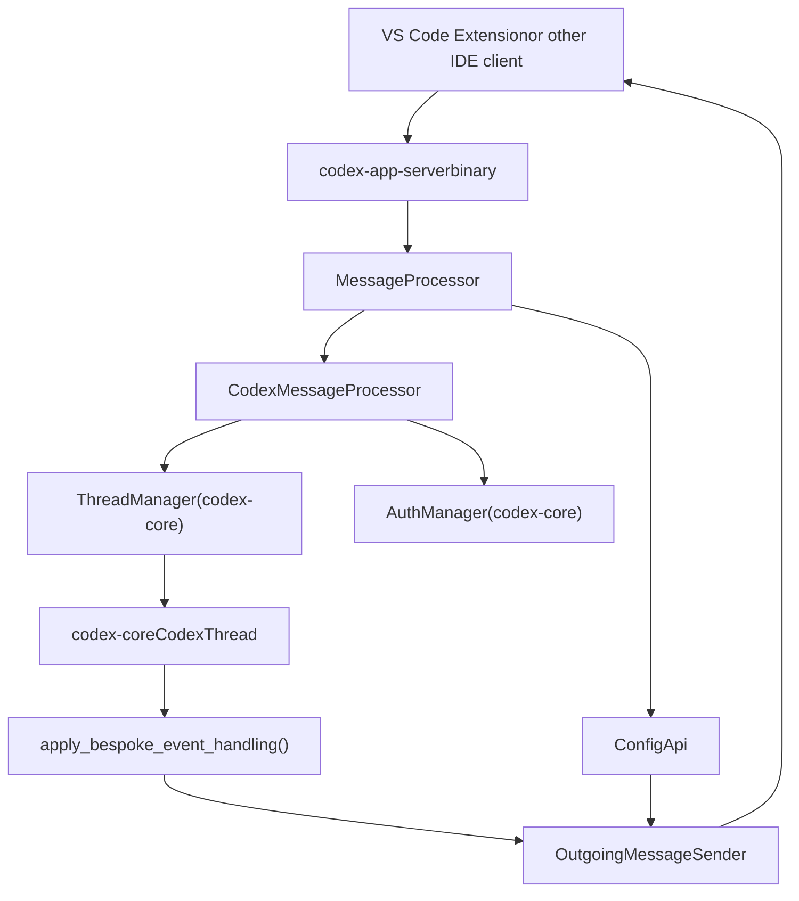
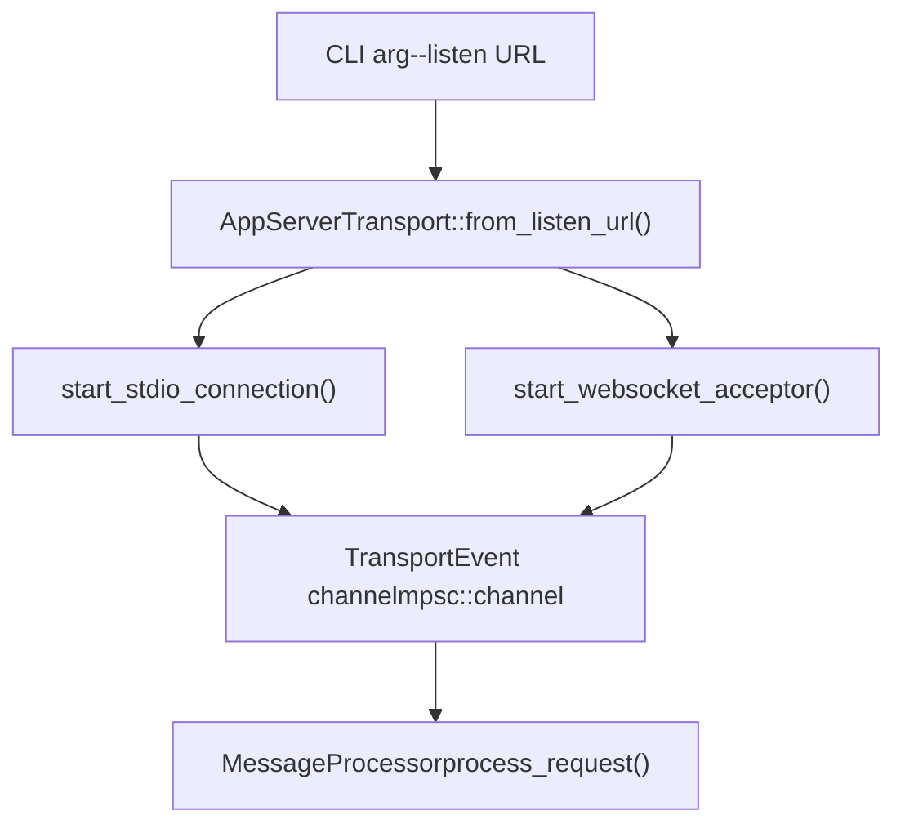
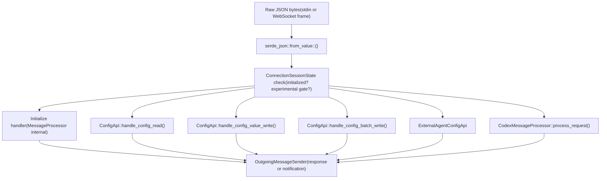

# 应用服务器与 IDE 集成

相关源文件

-   [codex-rs/app-server-protocol/schema/json/ClientRequest.json](https://github.com/openai/codex/blob/d807d44a/codex-rs/app-server-protocol/schema/json/ClientRequest.json)
-   [codex-rs/app-server-protocol/schema/json/ServerNotification.json](https://github.com/openai/codex/blob/d807d44a/codex-rs/app-server-protocol/schema/json/ServerNotification.json)
-   [codex-rs/app-server-protocol/schema/json/codex\_app\_server\_protocol.schemas.json](https://github.com/openai/codex/blob/d807d44a/codex-rs/app-server-protocol/schema/json/codex_app_server_protocol.schemas.json)
-   [codex-rs/app-server-protocol/schema/json/codex\_app\_server\_protocol.v2.schemas.json](https://github.com/openai/codex/blob/d807d44a/codex-rs/app-server-protocol/schema/json/codex_app_server_protocol.v2.schemas.json)
-   [codex-rs/app-server-protocol/schema/typescript/ServerNotification.ts](https://github.com/openai/codex/blob/d807d44a/codex-rs/app-server-protocol/schema/typescript/ServerNotification.ts)
-   [codex-rs/app-server-protocol/schema/typescript/v2/index.ts](https://github.com/openai/codex/blob/d807d44a/codex-rs/app-server-protocol/schema/typescript/v2/index.ts)
-   [codex-rs/app-server-protocol/src/protocol/common.rs](https://github.com/openai/codex/blob/d807d44a/codex-rs/app-server-protocol/src/protocol/common.rs)
-   [codex-rs/app-server-protocol/src/protocol/v2.rs](https://github.com/openai/codex/blob/d807d44a/codex-rs/app-server-protocol/src/protocol/v2.rs)
-   [codex-rs/app-server/Cargo.toml](https://github.com/openai/codex/blob/d807d44a/codex-rs/app-server/Cargo.toml)
-   [codex-rs/app-server/README.md](https://github.com/openai/codex/blob/d807d44a/codex-rs/app-server/README.md?plain=1)
-   [codex-rs/app-server/src/bespoke\_event\_handling.rs](https://github.com/openai/codex/blob/d807d44a/codex-rs/app-server/src/bespoke_event_handling.rs)
-   [codex-rs/app-server/src/codex\_message\_processor.rs](https://github.com/openai/codex/blob/d807d44a/codex-rs/app-server/src/codex_message_processor.rs)
-   [codex-rs/app-server/src/lib.rs](https://github.com/openai/codex/blob/d807d44a/codex-rs/app-server/src/lib.rs)
-   [codex-rs/app-server/src/message\_processor.rs](https://github.com/openai/codex/blob/d807d44a/codex-rs/app-server/src/message_processor.rs)
-   [codex-rs/app-server/src/transport.rs](https://github.com/openai/codex/blob/d807d44a/codex-rs/app-server/src/transport.rs)
-   [codex-rs/app-server/tests/common/mcp\_process.rs](https://github.com/openai/codex/blob/d807d44a/codex-rs/app-server/tests/common/mcp_process.rs)
-   [codex-rs/app-server/tests/suite/v2/connection\_handling\_websocket.rs](https://github.com/openai/codex/blob/d807d44a/codex-rs/app-server/tests/suite/v2/connection_handling_websocket.rs)
-   [codex-rs/app-server/tests/suite/v2/mod.rs](https://github.com/openai/codex/blob/d807d44a/codex-rs/app-server/tests/suite/v2/mod.rs)

`codex-app-server` crate（`codex-rs/app-server/`）是 Codex 向 VS Code 扩展等丰富外部客户端暴露的接口。它作为子进程运行，通过 JSON-RPC 2.0 通道通信，在不要求调用方直接嵌入 Rust 的前提下提供对 Codex 代理全部能力的访问。本文涵盖服务器二进制、其传输层、JSON-RPC 消息协议，以及将客户端请求转换为 `codex-core` 操作并回传事件流的运行时流水线。

关于应用服务器所委托的核心 Op/Event 系统，请参见第 2.1 页（Protocol Layer）。关于支撑这些 API 的 `ThreadManager` 与会话生命周期，请参见第 3.1 页（Codex Interface and Session Lifecycle）。下列子页面覆盖具体子系统：

-   [CodexMessageProcessor 和请求处理](/openai/codex/4.5.1-codexmessageprocessor-and-request-handling) — 说明请求路由、初始化握手，以及 OutgoingMessageSender 双向通信
-   [线程与回合管理 API](/openai/codex/4.5.2-thread-and-turn-management-api) — 说明 thread/* 与 turn/* 端点、线程状态跟踪和订阅管理
-   [事件转换与流式传输](/openai/codex/4.5.3-event-translation-and-streaming) — 说明 apply\_bespoke\_event\_handling、事件到通知的转换，以及服务器请求模式
-   [配置 API 与分层系统](/openai/codex/4.5.4-config-api-and-layer-system) — 说明 config/read 与 config/write 端点、配置档案作用域，以及 ConfigEditsBuilder
-   [认证模式与账户管理](/openai/codex/4.5.5-authentication-modes-and-account-management) — 说明认证模式（API key、ChatGPT、自定义）、登录/登出流程和账户信息获取

---

## 架构概览

**高层组件图**

来源： [codex-rs/app-server/src/lib.rs20-31](https://github.com/openai/codex/blob/d807d44a/codex-rs/app-server/src/lib.rs#L20-L31) [codex-rs/app-server/src/message\_processor.rs148-157](https://github.com/openai/codex/blob/d807d44a/codex-rs/app-server/src/message_processor.rs#L148-L157) [codex-rs/app-server/src/codex\_message\_processor.rs108-114](https://github.com/openai/codex/blob/d807d44a/codex-rs/app-server/src/codex_message_processor.rs#L108-L114) [codex-rs/app-server/src/bespoke\_event\_handling.rs1-15](https://github.com/openai/codex/blob/d807d44a/codex-rs/app-server/src/bespoke_event_handling.rs#L1-L15)

---

## 传输层

服务器支持两种传输方式，通过 `--listen <url>` 配置：

| 传输方式 | 监听 URL | 格式 | 状态 |
| --- | --- | --- | --- |
| stdio | `stdio://`（默认） | 按行分隔的 JSON（JSONL） | 稳定 |
| WebSocket | `ws://IP:PORT` | 每个文本帧一条 JSON-RPC 消息 | 实验性 |

[codex-rs/app-server/src/transport.rs81](https://github.com/openai/codex/blob/d807d44a/codex-rs/app-server/src/transport.rs#L81-L81) 中的 `AppServerTransport` 枚举刻画了这一点。`run_main` 逻辑默认使用 `AppServerTransport::Stdio` [codex-rs/app-server/src/lib.rs30-31](https://github.com/openai/codex/blob/d807d44a/codex-rs/app-server/src/lib.rs#L30-L31)

**传输分发图**

来源： [codex-rs/app-server/src/transport.rs25-31](https://github.com/openai/codex/blob/d807d44a/codex-rs/app-server/src/transport.rs#L25-L31) [codex-rs/app-server/src/lib.rs25-31](https://github.com/openai/codex/blob/d807d44a/codex-rs/app-server/src/lib.rs#L25-L31) [codex-rs/app-server/README.md20-35](https://github.com/openai/codex/blob/d807d44a/codex-rs/app-server/README.md?plain=1#L20-L35)

通过大小为 `CHANNEL_CAPACITY = 128` 的有界通道实施背压 [codex-rs/app-server/src/transport.rs25](https://github.com/openai/codex/blob/d807d44a/codex-rs/app-server/src/transport.rs#L25-L25)。当入站饱和时，新请求会收到 JSON-RPC 错误码 `-32001` [codex-rs/app-server/README.md42-46](https://github.com/openai/codex/blob/d807d44a/codex-rs/app-server/README.md?plain=1#L42-L46)

出站路径使用专用路由任务。消息会被放入 `OutgoingEnvelope` 通道，并通过 `OutgoingMessageSender` 按连接路由 [codex-rs/app-server/src/outgoing\_message.rs14-17](https://github.com/openai/codex/blob/d807d44a/codex-rs/app-server/src/outgoing_message.rs#L14-L17)

---

## 协议

该协议遵循 JSON-RPC 2.0，但在线路上传输时省略了 `"jsonrpc":"2.0"` 头 [codex-rs/app-server/README.md22-23](https://github.com/openai/codex/blob/d807d44a/codex-rs/app-server/README.md?plain=1#L22-L23)。共有四类消息：

| 方向 | 类型 | 说明 |
| --- | --- | --- |
| Client → Server | `ClientRequest` | 带有 `id`、`method`、`params` 的方法调用 |
| Client → Server | `ClientNotification` | 带 `method` 的客户端通知（例如 `initialized`） |
| Server → Client | `JSONRPCResponse` / `JSONRPCError` | 对 `ClientRequest` 的响应 |
| Server → Client | `ServerNotification` | 推送事件，不带 `id` |
| Server → Client | `ServerRequest` | 服务器发起且需要客户端响应的调用 |

`ClientRequest` 是按 `method` 打标签的可辨识联合类型，定义于 [codex-rs/app-server-protocol/src/protocol/common.rs98-111](https://github.com/openai/codex/blob/d807d44a/codex-rs/app-server-protocol/src/protocol/common.rs#L98-L111)。宏 `client_request_definitions!` 生成该枚举以及类型导出辅助。`ServerNotification` 在同一文件中也以类似方式定义。

**关键协议类型图**

```mermaid
flowchart TD
    ClientRequest["ClientRequest(tagged union on method)"]
    Initialize["Initialize"]
    ThreadStart["ThreadStart => 'thread/start'"]
    TurnStart["TurnStart => 'turn/start'"]
    ConfigRead["ConfigRead => 'config/read'"]
    ServerNotification["ServerNotification"]
    TurnStartedNotif["TurnStarted"]
    ItemStartedNotif["ItemStarted"]
    ItemCompletedNotif["ItemCompleted"]
    TurnCompletedNotif["TurnCompleted"]
    ServerRequest["ServerRequest"]
    CmdApproval["CommandExecutionRequestApproval"]
    FileChangeApproval["FileChangeRequestApproval"]

    ClientRequest --> Initialize
    ClientRequest --> ThreadStart
    ClientRequest --> TurnStart
    ClientRequest --> ConfigRead
    ServerNotification --> TurnStartedNotif
    ServerNotification --> ItemStartedNotif
    ServerNotification --> ItemCompletedNotif
    ServerNotification --> TurnCompletedNotif
    ServerRequest --> CmdApproval
    ServerRequest --> FileChangeApproval
```

来源： [codex-rs/app-server-protocol/src/protocol/common.rs205-209](https://github.com/openai/codex/blob/d807d44a/codex-rs/app-server-protocol/src/protocol/common.rs#L205-L209) [codex-rs/app-server-protocol/src/protocol/v2.rs102-128](https://github.com/openai/codex/blob/d807d44a/codex-rs/app-server-protocol/src/protocol/v2.rs#L102-L128) [codex-rs/app-server/src/codex\_message\_processor.rs34-105](https://github.com/openai/codex/blob/d807d44a/codex-rs/app-server/src/codex_message_processor.rs#L34-L105)

**Schema 生成**：客户端可使用 `codex app-server generate-ts --out DIR` 导出 TypeScript 类型，使用 `codex app-server generate-json-schema --out DIR` 导出 JSON Schema [codex-rs/app-server/README.md50-55](https://github.com/openai/codex/blob/d807d44a/codex-rs/app-server/README.md?plain=1#L50-L55)。预生成产物位于 [codex-rs/app-server-protocol/schema/typescript/v2/index.ts](https://github.com/openai/codex/blob/d807d44a/codex-rs/app-server-protocol/schema/typescript/v2/index.ts) 和 [codex-rs/app-server-protocol/schema/json/codex\_app\_server\_protocol.schemas.json](https://github.com/openai/codex/blob/d807d44a/codex-rs/app-server-protocol/schema/json/codex_app_server_protocol.schemas.json)

来源： [codex-rs/app-server-protocol/src/protocol/common.rs166-202](https://github.com/openai/codex/blob/d807d44a/codex-rs/app-server-protocol/src/protocol/common.rs#L166-L202) [codex-rs/app-server-protocol/schema/typescript/v2/index.ts1-110](https://github.com/openai/codex/blob/d807d44a/codex-rs/app-server-protocol/schema/typescript/v2/index.ts#L1-L110)

---

## 初始化握手

每个连接在发送其他请求前都必须完成握手 [codex-rs/app-server/README.md69-70](https://github.com/openai/codex/blob/d807d44a/codex-rs/app-server/README.md?plain=1#L69-L70)

> **[Mermaid sequence]**
> *(图表结构无法解析)*

来源： [codex-rs/app-server/src/message\_processor.rs159-166](https://github.com/openai/codex/blob/d807d44a/codex-rs/app-server/src/message_processor.rs#L159-L166) [codex-rs/app-server/README.md76-85](https://github.com/openai/codex/blob/d807d44a/codex-rs/app-server/README.md?plain=1#L76-L85)

`InitializeParams` 中的关键字段：

-   `clientInfo.name` — 用作 OpenAI 合规日志中的客户端标识符 [codex-rs/app-server/README.md84-87](https://github.com/openai/codex/blob/d807d44a/codex-rs/app-server/README.md?plain=1#L84-L87)
-   `capabilities.experimentalApi` — 解锁实验性方法 [codex-rs/app-server/README.md117](https://github.com/openai/codex/blob/d807d44a/codex-rs/app-server/README.md?plain=1#L117-L117)
-   `capabilities.optOutNotificationMethods` — 需要抑制的通知方法精确匹配列表 [codex-rs/app-server/README.md118](https://github.com/openai/codex/blob/d807d44a/codex-rs/app-server/README.md?plain=1#L118-L118)

在同一连接上发送两次 `initialize` 会返回 `"Already initialized"` 错误。`initialize` 之前发送任何其他请求会返回 `"Not initialized"` [codex-rs/app-server/README.md78](https://github.com/openai/codex/blob/d807d44a/codex-rs/app-server/README.md?plain=1#L78-L78)

`ConnectionSessionState` 结构体跟踪每个连接的会话状态：`initialized`、`experimental_api_enabled`、`opted_out_notification_methods`、`app_server_client_name` 和 `client_version` [codex-rs/app-server/src/message\_processor.rs159-166](https://github.com/openai/codex/blob/d807d44a/codex-rs/app-server/src/message_processor.rs#L159-L166)

---

## 消息处理流水线

**请求跨层路由**

来源： [codex-rs/app-server/src/message\_processor.rs148-157](https://github.com/openai/codex/blob/d807d44a/codex-rs/app-server/src/message_processor.rs#L148-L157) [codex-rs/app-server/src/codex\_message\_processor.rs1-15](https://github.com/openai/codex/blob/d807d44a/codex-rs/app-server/src/codex_message_processor.rs#L1-L15) [codex-rs/app-server/src/config\_api.rs10](https://github.com/openai/codex/blob/d807d44a/codex-rs/app-server/src/config_api.rs#L10-L10)

`MessageProcessor` 结构体持有 `CodexMessageProcessor`、`ConfigApi` 和 `ExternalAgentConfigApi` [codex-rs/app-server/src/message\_processor.rs148-157](https://github.com/openai/codex/blob/d807d44a/codex-rs/app-server/src/message_processor.rs#L148-L157)。它在内部处理 `Initialize`；其余请求按方法名分发。

`MessageProcessor` 会检查实验性 API 门控：若方法是实验性的且当前会话未启用，则会拒绝该请求 [codex-rs/app-server/src/message\_processor.rs162](https://github.com/openai/codex/blob/d807d44a/codex-rs/app-server/src/message_processor.rs#L162-L162)

---

## 核心原语

API 围绕三个一等实体组织 [codex-rs/app-server/README.md57-64](https://github.com/openai/codex/blob/d807d44a/codex-rs/app-server/README.md?plain=1#L57-L64)：

| 实体 | 说明 | 关键字段 |
| --- | --- | --- |
| `Thread` | 用户与代理之间的一次会话 | `id`, `status`, `path`, `ephemeral` |
| `Turn` | 线程内一次往返 | `id`, `status`, `items`, `error` |
| `ThreadItem` | 回合内原子单元 | `AgentMessage`, `ShellCommand`, `FileChange` 等 |

这些类型定义在 [codex-rs/app-server-protocol/src/protocol/v2.rs](https://github.com/openai/codex/blob/d807d44a/codex-rs/app-server-protocol/src/protocol/v2.rs)，并对应 `codex_app_server_protocol` 导出的 `Thread`、`Turn` 与 `ThreadItem` 类型。

---

## 线程与回合生命周期

**典型回合序列**

> **[Mermaid sequence]**
> *(图表结构无法解析)*

来源： [codex-rs/app-server/README.md67-75](https://github.com/openai/codex/blob/d807d44a/codex-rs/app-server/README.md?plain=1#L67-L75) [codex-rs/app-server/src/bespoke\_event\_handling.rs97-105](https://github.com/openai/codex/blob/d807d44a/codex-rs/app-server/src/bespoke_event_handling.rs#L97-L105)

### 线程操作摘要

| 方法 | 线路名称 | 功能 |
| --- | --- | --- |
| `ThreadStart` | `thread/start` | 创建新线程；自动订阅调用方 |
| `ThreadResume` | `thread/resume` | 重新打开持久化线程 |
| `ThreadFork` | `thread/fork` | 将历史复制到新线程 |
| `ThreadArchive` | `thread/archive` | 将 rollout 移入归档目录 |
| `ThreadList` | `thread/list` | 带过滤器的分页列表 |
| `ThreadCompactStart` | `thread/compact/start` | 触发历史压缩 |

### 回合操作摘要

| 方法 | 线路名称 | 功能 |
| --- | --- | --- |
| `TurnStart` | `turn/start` | 提交用户输入并开始生成 |
| `TurnInterrupt` | `turn/interrupt` | 取消进行中的回合 |
| `ReviewStart` | `review/start` | 运行自动化代码审查器 |

来源： [codex-rs/app-server/README.md126-150](https://github.com/openai/codex/blob/d807d44a/codex-rs/app-server/README.md?plain=1#L126-L150) [codex-rs/app-server/src/codex\_message\_processor.rs110-140](https://github.com/openai/codex/blob/d807d44a/codex-rs/app-server/src/codex_message_processor.rs#L110-L140)

---

## 事件转换与流式传输

[codex-rs/app-server/src/bespoke\_event\_handling.rs1](https://github.com/openai/codex/blob/d807d44a/codex-rs/app-server/src/bespoke_event_handling.rs#L1-L1) 中的 `apply_bespoke_event_handling` 函数是 `codex-core` 事件与发送到客户端的 JSON-RPC 通知之间的边界。

**EventMsg → ServerNotification 映射**

```mermaid
flowchart TD
    TurnStarted["EventMsg::TurnStarted"]
    TurnComplete["EventMsg::TurnComplete"]
    ExecApproval["EventMsg::ExecApprovalRequest"]
    PatchApproval["EventMsg::ApplyPatchApprovalRequest"]
    AgentMsg["EventMsg::AgentMessage*"]
    TurnStartedN["ServerNotification::TurnStarted(TurnStartedNotification)"]
    TurnCompletedN["ServerNotification::TurnCompleted(TurnCompletedNotification)"]
    CmdApprovalReq["ServerRequest::CommandExecutionRequestApproval(sent to client)"]
    FileChangeApprovalReq["ServerRequest::FileChangeRequestApproval(sent to client)"]
    AgentDelta["ServerNotification::AgentMessageDelta"]

    TurnStarted --> TurnStartedN
    TurnComplete --> TurnCompletedN
    ExecApproval --> CmdApprovalReq
    PatchApproval --> FileChangeApprovalReq
    AgentMsg --> AgentDelta
```

来源： [codex-rs/app-server/src/bespoke\_event\_handling.rs17-105](https://github.com/openai/codex/blob/d807d44a/codex-rs/app-server/src/bespoke_event_handling.rs#L17-L105) [codex-rs/app-server-protocol/src/protocol/common.rs3-9](https://github.com/openai/codex/blob/d807d44a/codex-rs/app-server-protocol/src/protocol/common.rs#L3-L9)

审批类事件较为特殊：服务器会向客户端发送 `ServerRequest`（服务器发起的 JSON-RPC 调用）请求决策，然后在将决策转发回核心之前等待客户端响应 [codex-rs/app-server/src/bespoke\_event\_handling.rs18-28](https://github.com/openai/codex/blob/d807d44a/codex-rs/app-server/src/bespoke_event_handling.rs#L18-L28)

---

## 配置 API

`ConfigApi` 处理：

| 方法 | 线路名称 | 参数类型 | 说明 |
| --- | --- | --- | --- |
| `ConfigRead` | `config/read` | `ConfigReadParams` | 获取生效的分层配置 |
| `ConfigValueWrite` | `config/value/write` | `ConfigValueWriteParams` | 向用户配置写入单个键值 |
| `ConfigBatchWrite` | `config/batchWrite` | `ConfigBatchWriteParams` | 以原子方式应用多个编辑 |

来源： [codex-rs/app-server/src/config\_api.rs10](https://github.com/openai/codex/blob/d807d44a/codex-rs/app-server/src/config_api.rs#L10-L10) [codex-rs/app-server-protocol/src/protocol/v2.rs61-72](https://github.com/openai/codex/blob/d807d44a/codex-rs/app-server-protocol/src/protocol/v2.rs#L61-L72)

---

## 认证

服务器支持多种认证模式，由来自 `codex-core` 的 `AuthManager` 协调。

| 方法 | 线路名称 | 流程 |
| --- | --- | --- |
| `LoginAccount` | `account/login/start` | 面向 ChatGPT 的设备码 OAuth |
| `LoginApiKey` | `account/login/apiKey` | 存储 API 密钥 |
| `GetAccount` | `account/read` | 获取账户信息与套餐类型 |

`AuthMode` 枚举有三个值：`apiKey`、`chatgpt` 和 `chatgptAuthTokens` [codex-rs/app-server-protocol/src/protocol/common.rs28-43](https://github.com/openai/codex/blob/d807d44a/codex-rs/app-server-protocol/src/protocol/common.rs#L28-L43)。`ExternalAuthRefreshBridge` 处理宿主管理令牌的刷新请求 [codex-rs/app-server/src/message\_processor.rs85-146](https://github.com/openai/codex/blob/d807d44a/codex-rs/app-server/src/message_processor.rs#L85-L146)

---

## 平滑重启

主事件循环实现了一个响应信号的 `ShutdownState` 状态机 [codex-rs/app-server/src/lib.rs121-131](https://github.com/openai/codex/blob/d807d44a/codex-rs/app-server/src/lib.rs#L121-L131)：

1.  第一次信号：进入排空模式——停止接受新连接并等待活动回合结束 [codex-rs/app-server/src/lib.rs166-171](https://github.com/openai/codex/blob/d807d44a/codex-rs/app-server/src/lib.rs#L166-L171)
2.  第二次信号：强制立即关闭 [codex-rs/app-server/src/lib.rs179-183](https://github.com/openai/codex/blob/d807d44a/codex-rs/app-server/src/lib.rs#L179-L183)

来源： [codex-rs/app-server/src/lib.rs151-201](https://github.com/openai/codex/blob/d807d44a/codex-rs/app-server/src/lib.rs#L151-L201)
