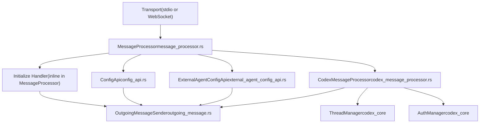
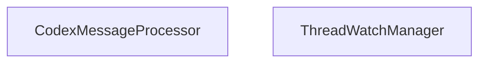

# CodexMessageProcessor 与请求处理

相关源文件

-   [codex-rs/app-server-protocol/schema/json/ClientRequest.json](https://github.com/openai/codex/blob/d807d44a/codex-rs/app-server-protocol/schema/json/ClientRequest.json)
-   [codex-rs/app-server-protocol/schema/json/ServerNotification.json](https://github.com/openai/codex/blob/d807d44a/codex-rs/app-server-protocol/schema/json/ServerNotification.json)
-   [codex-rs/app-server-protocol/schema/json/codex\_app\_server\_protocol.schemas.json](https://github.com/openai/codex/blob/d807d44a/codex-rs/app-server-protocol/schema/json/codex_app_server_protocol.schemas.json)
-   [codex-rs/app-server-protocol/schema/json/codex\_app\_server\_protocol.v2.schemas.json](https://github.com/openai/codex/blob/d807d44a/codex-rs/app-server-protocol/schema/json/codex_app_server_protocol.v2.schemas.json)
-   [codex-rs/app-server-protocol/schema/typescript/ServerNotification.ts](https://github.com/openai/codex/blob/d807d44a/codex-rs/app-server-protocol/schema/typescript/ServerNotification.ts)
-   [codex-rs/app-server-protocol/schema/typescript/v2/index.ts](https://github.com/openai/codex/blob/d807d44a/codex-rs/app-server-protocol/schema/typescript/v2/index.ts)
-   [codex-rs/app-server-protocol/src/jsonrpc\_lite.rs](https://github.com/openai/codex/blob/d807d44a/codex-rs/app-server-protocol/src/jsonrpc_lite.rs)
-   [codex-rs/app-server-protocol/src/protocol/common.rs](https://github.com/openai/codex/blob/d807d44a/codex-rs/app-server-protocol/src/protocol/common.rs)
-   [codex-rs/app-server-protocol/src/protocol/v2.rs](https://github.com/openai/codex/blob/d807d44a/codex-rs/app-server-protocol/src/protocol/v2.rs)
-   [codex-rs/app-server/README.md](https://github.com/openai/codex/blob/d807d44a/codex-rs/app-server/README.md?plain=1)
-   [codex-rs/app-server/src/app\_server\_tracing.rs](https://github.com/openai/codex/blob/d807d44a/codex-rs/app-server/src/app_server_tracing.rs)
-   [codex-rs/app-server/src/bespoke\_event\_handling.rs](https://github.com/openai/codex/blob/d807d44a/codex-rs/app-server/src/bespoke_event_handling.rs)
-   [codex-rs/app-server/src/codex\_message\_processor.rs](https://github.com/openai/codex/blob/d807d44a/codex-rs/app-server/src/codex_message_processor.rs)
-   [codex-rs/app-server/src/message\_processor/tracing\_tests.rs](https://github.com/openai/codex/blob/d807d44a/codex-rs/app-server/src/message_processor/tracing_tests.rs)
-   [codex-rs/app-server/src/outgoing\_message.rs](https://github.com/openai/codex/blob/d807d44a/codex-rs/app-server/src/outgoing_message.rs)
-   [codex-rs/app-server/tests/common/mcp\_process.rs](https://github.com/openai/codex/blob/d807d44a/codex-rs/app-server/tests/common/mcp_process.rs)
-   [codex-rs/app-server/tests/suite/v2/mod.rs](https://github.com/openai/codex/blob/d807d44a/codex-rs/app-server/tests/suite/v2/mod.rs)
-   [codex-rs/core/src/custom\_prompts.rs](https://github.com/openai/codex/blob/d807d44a/codex-rs/core/src/custom_prompts.rs)
-   [codex-rs/protocol/src/custom\_prompts.rs](https://github.com/openai/codex/blob/d807d44a/codex-rs/protocol/src/custom_prompts.rs)
-   [codex-rs/protocol/src/parse\_command.rs](https://github.com/openai/codex/blob/d807d44a/codex-rs/protocol/src/parse_command.rs)
-   [codex-rs/protocol/src/plan\_tool.rs](https://github.com/openai/codex/blob/d807d44a/codex-rs/protocol/src/plan_tool.rs)
-   [codex-rs/tui/src/bottom\_pane/prompt\_args.rs](https://github.com/openai/codex/blob/d807d44a/codex-rs/tui/src/bottom_pane/prompt_args.rs)
-   [docs/prompts.md](https://github.com/openai/codex/blob/d807d44a/docs/prompts.md?plain=1)

本页记录 `CodexMessageProcessor`（`codex-app-server` crate 中央请求分发器）以及从入站 JSON-RPC 字节到领域处理器调用的完整流水线。

覆盖范围包括：双层处理架构、`initialize` 握手、完整 `ClientRequest` 分发表、出站消息基础设施、实验性 API 门控，以及并发行为。

相关页面：

-   关于 thread/turn API 的形状与语义，参见 [4.5.2](https://github.com/openai/codex/blob/d807d44a/4.5.2)
-   关于核心 `EventMsg` 事件如何转换为 `ServerNotification` 消息，参见 [4.5.3](https://github.com/openai/codex/blob/d807d44a/4.5.3)
-   关于配置 RPC 端点（`config/read`、`config/value/write` 等），参见 [4.5.4](https://github.com/openai/codex/blob/d807d44a/4.5.4)
-   关于认证流程与 `AuthManager`，参见 [4.5.5](https://github.com/openai/codex/blob/d807d44a/4.5.5)
-   关于应用服务器传输层（stdio 与 WebSocket），参见 [4.5](https://github.com/openai/codex/blob/d807d44a/4.5)

---

## 双层处理架构

入站请求在抵达领域处理器之前会经过两层。

**图：请求流水线 — 源实体**

来源： `<FileRef file-url="https://github.com/openai/codex/blob/d807d44a/codex-rs/app-server/src/codex_message_processor.rs#L371-L481" min=371 max=481 file-path="codex-rs/app-server/src/codex_message_processor.rs">Hii</FileRef>`，`<FileRef file-url="https://github.com/openai/codex/blob/d807d44a/codex-rs/app-server/README.md?plain=1#L20-L47" min=20 max=47 file-path="codex-rs/app-server/README.md">Hii</FileRef>`

---

## `MessageProcessor`

`MessageProcessor` 是每个连接的入口点。其职责：

1.  将原始 `JSONRPCRequest` 反序列化为 `ClientRequest` 枚举值 `<FileRef file-url="https://github.com/openai/codex/blob/d807d44a/codex-rs/app-server-protocol/src/protocol/common.rs#L98-L111" min=98 max=111 file-path="codex-rs/app-server-protocol/src/protocol/common.rs">Hii</FileRef>`。
2.  直接处理 `ClientRequest::Initialize`（强制执行“必须先初始化”这一不变量）`<FileRef file-url="https://github.com/openai/codex/blob/d807d44a/codex-rs/app-server/README.md?plain=1#L69-L75" min=69 max=75 file-path="codex-rs/app-server/README.md">Hii</FileRef>`。
3.  对所有其他请求：验证连接已初始化，检查实验性 API 门控，然后路由到 `ConfigApi`、`ExternalAgentConfigApi` 或 `CodexMessageProcessor`。

**`MessageProcessor` 字段：**

| 字段 | 类型 | 角色 |
| --- | --- | --- |
| `outgoing` | `Arc<OutgoingMessageSender>` | 发送响应与通知 `<FileRef file-url="https://github.com/openai/codex/blob/d807d44a/codex-rs/app-server/src/codex_message_processor.rs#L14-L17" min=14 max=17 file-path="codex-rs/app-server/src/codex_message_processor.rs">Hii</FileRef>` |
| `codex_message_processor` | `CodexMessageProcessor` | 处理大多数 `ClientRequest` 变体 `<FileRef file-url="https://github.com/openai/codex/blob/d807d44a/codex-rs/app-server/src/codex_message_processor.rs#L371-L386" min=371 max=386 file-path="codex-rs/app-server/src/codex_message_processor.rs">Hii</FileRef>` |
| `config_api` | `ConfigApi` | 处理配置读写 RPC |
| `external_agent_config_api` | `ExternalAgentConfigApi` | 处理 external-agent 配置迁移 |
| `config` | `Arc<Config>` | 启动时加载的配置快照 |
| `config_warnings` | `Arc<Vec<ConfigWarningNotification>>` | 在 `initialize` 后排队发出的警告 |

来源： `<FileRef file-url="https://github.com/openai/codex/blob/d807d44a/codex-rs/app-server/src/codex_message_processor.rs#L371-L481" min=371 max=481 file-path="codex-rs/app-server/src/codex_message_processor.rs">Hii</FileRef>`，`<FileRef file-url="https://github.com/openai/codex/blob/d807d44a/codex-rs/app-server/README.md?plain=1#L76-L102" min=76 max=102 file-path="codex-rs/app-server/README.md">Hii</FileRef>`

---

## 初始化握手

每个传输连接在发送其他任何请求之前都必须先发送 `initialize` `<FileRef file-url="https://github.com/openai/codex/blob/d807d44a/codex-rs/app-server/README.md?plain=1#L69-L75" min=69 max=75 file-path="codex-rs/app-server/README.md">Hii</FileRef>`。同一连接上的第二次 `initialize` 会以 `"Already initialized"` 被拒绝。任何在 `initialize` 完成前发送的其他请求会以 `"Not initialized"` 被拒绝。

**序列：初始化握手**

来源： `<FileRef file-url="https://github.com/openai/codex/blob/d807d44a/codex-rs/app-server/README.md?plain=1#L76-L123" min=76 max=123 file-path="codex-rs/app-server/README.md">Hii</FileRef>`，`<FileRef file-url="https://github.com/openai/codex/blob/d807d44a/codex-rs/app-server-protocol/src/protocol/common.rs#L205-L209" min=205 max=209 file-path="codex-rs/app-server-protocol/src/protocol/common.rs">Hii</FileRef>`

关键行为：

-   `clientInfo.name` 用于在 OpenAI 合规日志平台中标识客户端 `<FileRef file-url="https://github.com/openai/codex/blob/d807d44a/codex-rs/app-server/README.md?plain=1#L84-L87" min=84 max=87 file-path="codex-rs/app-server/README.md">Hii</FileRef>`。
-   必须设置 `capabilities.experimentalApi: true` 才能调用任何实验性端点 `<FileRef file-url="https://github.com/openai/codex/blob/d807d44a/codex-rs/app-server/README.md?plain=1#L117-L117" min=117 file-path="codex-rs/app-server/README.md">Hii</FileRef>`。
-   `capabilities.optOutNotificationMethods` 列出要在此连接上抑制的通知方法精确字符串 `<FileRef file-url="https://github.com/openai/codex/blob/d807d44a/codex-rs/app-server/README.md?plain=1#L80-L82" min=80 max=82 file-path="codex-rs/app-server/README.md">Hii</FileRef>`。

---

## `CodexMessageProcessor`

`CodexMessageProcessor` 持有服务大部分 API 面所需的全部长生命周期状态。

**图：CodexMessageProcessor 内部依赖**

来源： `<FileRef file-url="https://github.com/openai/codex/blob/d807d44a/codex-rs/app-server/src/codex_message_processor.rs#L371-L481" min=371 max=481 file-path="codex-rs/app-server/src/codex_message_processor.rs">Hii</FileRef>`，`<FileRef file-url="https://github.com/openai/codex/blob/d807d44a/codex-rs/app-server/src/codex_message_processor.rs#L18-L19" min=18 max=19 file-path="codex-rs/app-server/src/codex_message_processor.rs">Hii</FileRef>`

`CodexMessageProcessor::new` 由 `MessageProcessor::new` 调用，后者构造并传入 `AuthManager`、`ThreadManager` 与共享的 `OutgoingMessageSender`。

---

## `process_request` 分发

`CodexMessageProcessor::process_request` 是对 `ClientRequest` 的 `match`，将每个变体路由到专用异步处理方法。

按领域组织的完整分发表：

### 线程生命周期（V2）

| `ClientRequest` 变体 | 线路方法 | 处理器 |
| --- | --- | --- |
| `ThreadStart` | `thread/start` | `thread_start()` `<FileRef file-url="https://github.com/openai/codex/blob/d807d44a/codex-rs/app-server-protocol/src/protocol/common.rs#L242-L246" min=242 max=246 file-path="codex-rs/app-server-protocol/src/protocol/common.rs">Hii</FileRef>` |
| `ThreadResume` | `thread/resume` | `thread_resume()` `<FileRef file-url="https://github.com/openai/codex/blob/d807d44a/codex-rs/app-server-protocol/src/protocol/common.rs#L232-L235" min=232 max=235 file-path="codex-rs/app-server-protocol/src/protocol/common.rs">Hii</FileRef>` |
| `ThreadFork` | `thread/fork` | `thread_fork()` `<FileRef file-url="https://github.com/openai/codex/blob/d807d44a/codex-rs/app-server-protocol/src/protocol/common.rs#L237-L240" min=237 max=240 file-path="codex-rs/app-server-protocol/src/protocol/common.rs">Hii</FileRef>` |
| `ThreadArchive` | `thread/archive` | `thread_archive()` `<FileRef file-url="https://github.com/openai/codex/blob/d807d44a/codex-rs/app-server-protocol/src/protocol/common.rs#L253-L256" min=253 max=256 file-path="codex-rs/app-server-protocol/src/protocol/common.rs">Hii</FileRef>` |
| `ThreadSetName` | `thread/name/set` | `thread_set_name()` `<FileRef file-url="https://github.com/openai/codex/blob/d807d44a/codex-rs/app-server-protocol/src/protocol/common.rs#L263-L266" min=263 max=266 file-path="codex-rs/app-server-protocol/src/protocol/common.rs">Hii</FileRef>` |
| `ThreadCompactStart` | `thread/compact/start` | `thread_compact_start()` `<FileRef file-url="https://github.com/openai/codex/blob/d807d44a/codex-rs/app-server-protocol/src/protocol/common.rs#L268-L271" min=268 max=271 file-path="codex-rs/app-server-protocol/src/protocol/common.rs">Hii</FileRef>` |
| `ThreadList` | `thread/list` | `thread_list()` `<FileRef file-url="https://github.com/openai/codex/blob/d807d44a/codex-rs/app-server-protocol/src/protocol/common.rs#L222-L225" min=222 max=225 file-path="codex-rs/app-server-protocol/src/protocol/common.rs">Hii</FileRef>` |
| `ThreadRead` | `thread/read` | `thread_read()` `<FileRef file-url="https://github.com/openai/codex/blob/d807d44a/codex-rs/app-server-protocol/src/protocol/common.rs#L227-L230" min=227 max=230 file-path="codex-rs/app-server-protocol/src/protocol/common.rs">Hii</FileRef>` |

### 回合（V2）

| `ClientRequest` 变体 | 线路方法 | 处理器 |
| --- | --- | --- |
| `TurnStart` | `turn/start` | `turn_start()` `<FileRef file-url="https://github.com/openai/codex/blob/d807d44a/codex-rs/app-server-protocol/src/protocol/common.rs#L288-L292" min=288 max=292 file-path="codex-rs/app-server-protocol/src/protocol/common.rs">Hii</FileRef>` |
| `TurnSteer` | `turn/steer` | `turn_steer()` `<FileRef file-url="https://github.com/openai/codex/blob/d807d44a/codex-rs/app-server-protocol/src/protocol/common.rs#L294-L297" min=294 max=297 file-path="codex-rs/app-server-protocol/src/protocol/common.rs">Hii</FileRef>` |
| `TurnInterrupt` | `turn/interrupt` | `turn_interrupt()` `<FileRef file-url="https://github.com/openai/codex/blob/d807d44a/codex-rs/app-server-protocol/src/protocol/common.rs#L299-L302" min=299 max=302 file-path="codex-rs/app-server-protocol/src/protocol/common.rs">Hii</FileRef>` |

### 实时（实验性）

| `ClientRequest` 变体 | 线路方法 | 处理器 |
| --- | --- | --- |
| `ThreadRealtimeStart` | `thread/realtime/start` | `thread_realtime_start()` `<FileRef file-url="https://github.com/openai/codex/blob/d807d44a/codex-rs/app-server-protocol/src/protocol/common.rs#L320-L324" min=320 max=324 file-path="codex-rs/app-server-protocol/src/protocol/common.rs">Hii</FileRef>` |
| `ThreadRealtimeStop` | `thread/realtime/stop` | `thread_realtime_stop()` `<FileRef file-url="https://github.com/openai/codex/blob/d807d44a/codex-rs/app-server-protocol/src/protocol/common.rs#L335-L338" min=335 max=338 file-path="codex-rs/app-server-protocol/src/protocol/common.rs">Hii</FileRef>` |

### 账户与认证（V2）

| `ClientRequest` 变体 | 线路方法 | 处理器 |
| --- | --- | --- |
| `LoginAccount` | `account/login/start` | `login_v2()` `<FileRef file-url="https://github.com/openai/codex/blob/d807d44a/codex-rs/app-server-protocol/src/protocol/common.rs#L468-L471" min=468 max=471 file-path="codex-rs/app-server-protocol/src/protocol/common.rs">Hii</FileRef>` |
| `LogoutAccount` | `account/logout` | `logout_v2()` `<FileRef file-url="https://github.com/openai/codex/blob/d807d44a/codex-rs/app-server-protocol/src/protocol/common.rs#L480-L483" min=480 max=483 file-path="codex-rs/app-server-protocol/src/protocol/common.rs">Hii</FileRef>` |
| `GetAccount` | `account/read` | `get_account()` `<FileRef file-url="https://github.com/openai/codex/blob/d807d44a/codex-rs/app-server-protocol/src/protocol/common.rs#L485-L488" min=485 max=488 file-path="codex-rs/app-server-protocol/src/protocol/common.rs">Hii</FileRef>` |

来源： `<FileRef file-url="https://github.com/openai/codex/blob/d807d44a/codex-rs/app-server-protocol/src/protocol/common.rs#L205-L519" min=205 max=519 file-path="codex-rs/app-server-protocol/src/protocol/common.rs">Hii</FileRef>`，`<FileRef file-url="https://github.com/openai/codex/blob/d807d44a/codex-rs/app-server/README.md?plain=1#L124-L150" min=124 max=150 file-path="codex-rs/app-server/README.md">Hii</FileRef>`

---

## `ApiVersion`

`CodexMessageProcessor` 维护一个 `ApiVersion` 枚举，在为给定监听器处理事件时使用：

| 变体 | 值 | 含义 |
| --- | --- | --- |
| `ApiVersion::V1` | （遗留） | 旧版会话 API |
| `ApiVersion::V2` | （默认） | 当前 `thread/*/turn/*` API `<FileRef file-url="https://github.com/openai/codex/blob/d807d44a/codex-rs/app-server/src/bespoke_event_handling.rs#L1-L4" min=1 max=4 file-path="codex-rs/app-server/src/bespoke_event_handling.rs">Hii</FileRef>` |

该值会传入 `apply_bespoke_event_handling` `<FileRef file-url="https://github.com/openai/codex/blob/d807d44a/codex-rs/app-server/src/bespoke_event_handling.rs#L1-L4" min=1 max=4 file-path="codex-rs/app-server/src/bespoke_event_handling.rs">Hii</FileRef>`，后者据此分支，发出 V1 风格服务器请求或 V2 风格 `ServerNotification` 消息。

---

## 出站消息基础设施

**图：出站消息类型与路由**

来源： `<FileRef file-url="https://github.com/openai/codex/blob/d807d44a/codex-rs/app-server/src/outgoing_message.rs#L12-L17" min=12 max=17 file-path="codex-rs/app-server/src/outgoing_message.rs">Hii</FileRef>`，`<FileRef file-url="https://github.com/openai/codex/blob/d807d44a/codex-rs/app-server/src/bespoke_event_handling.rs#L7-L8" min=7 max=8 file-path="codex-rs/app-server/src/bespoke_event_handling.rs">Hii</FileRef>`

`OutgoingMessageSender` 在所有连接与后台任务之间以 `Arc` 共享。它可将消息路由到特定 `ConnectionId`，或广播到全部连接。

`ThreadScopedOutgoingMessageSender` 是一个收窄视图，限定在某个 `ThreadId` 与其订阅 `ConnectionId` 列表。它会传递给每线程事件处理器，以便通知仅送达订阅该线程的连接。

---

## 实验性 API 门控

`client_request_definitions!` 宏会生成 `ClientRequest` 枚举，并为其实现 `ExperimentalApi` `<FileRef file-url="https://github.com/openai/codex/blob/d807d44a/codex-rs/app-server-protocol/src/protocol/common.rs#L85-L131" min=85 max=131 file-path="codex-rs/app-server-protocol/src/protocol/common.rs">Hii</FileRef>`。带 `#[experimental("...")]` 注解的变体会返回原因；稳定变体返回 `None`。

部分请求使用 `inspect_params: true`，而不是方法级注解 `<FileRef file-url="https://github.com/openai/codex/blob/d807d44a/codex-rs/app-server-protocol/src/protocol/common.rs#L50-L54" min=50 max=54 file-path="codex-rs/app-server-protocol/src/protocol/common.rs">Hii</FileRef>`。在这种情况下，实验性门控会在参数结构体内部按字段级别进行。

来源： `<FileRef file-url="https://github.com/openai/codex/blob/d807d44a/codex-rs/app-server-protocol/src/protocol/common.rs#L45-L165" min=45 max=165 file-path="codex-rs/app-server-protocol/src/protocol/common.rs">Hii</FileRef>`，`<FileRef file-url="https://github.com/openai/codex/blob/d807d44a/codex-rs/app-server/README.md?plain=1#L117-L123" min=117 max=123 file-path="codex-rs/app-server/README.md">Hii</FileRef>`

---

## 并发模型

`CodexMessageProcessor::process_request` 中的大多数处理器调用都会被直接 `await`，因此每个连接内的请求处理是串行化的。

每线程监听任务也会通过 `tokio::spawn` 启动，并通过 `OutgoingMessageSender` 回传到连接。多个线程可通过各自的订阅者集合并发流式传输事件。

服务器在传输入站、请求处理与出站写入之间使用有界队列 `<FileRef file-url="https://github.com/openai/codex/blob/d807d44a/codex-rs/app-server/README.md?plain=1#L42-L47" min=42 max=47 file-path="codex-rs/app-server/README.md">Hii</FileRef>`。当入站饱和时，请求会以代码 `-32001`（`Server overloaded`）被拒绝。

来源： `<FileRef file-url="https://github.com/openai/codex/blob/d807d44a/codex-rs/app-server/README.md?plain=1#L42-L47" min=42 max=47 file-path="codex-rs/app-server/README.md">Hii</FileRef>`，`<FileRef file-url="https://github.com/openai/codex/blob/d807d44a/codex-rs/app-server/src/codex_message_processor.rs#L371-L481" min=371 max=481 file-path="codex-rs/app-server/src/codex_message_processor.rs">Hii</FileRef>`
