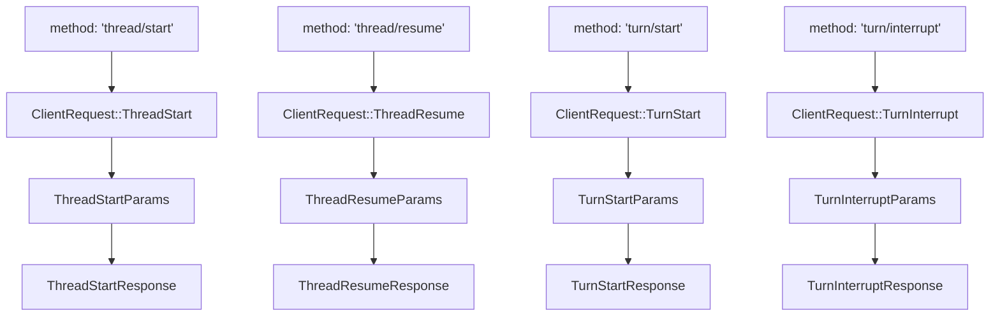
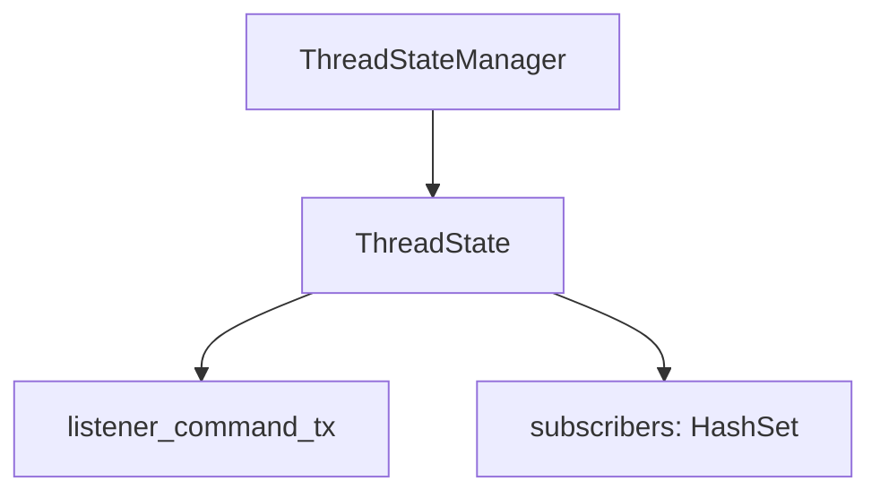

# 线程与回合管理 API

相关源文件

-   [codex-rs/app-server-client/src/lib.rs](https://github.com/openai/codex/blob/d807d44a/codex-rs/app-server-client/src/lib.rs)
-   [codex-rs/app-server-protocol/schema/json/ClientRequest.json](https://github.com/openai/codex/blob/d807d44a/codex-rs/app-server-protocol/schema/json/ClientRequest.json)
-   [codex-rs/app-server-protocol/schema/json/ServerNotification.json](https://github.com/openai/codex/blob/d807d44a/codex-rs/app-server-protocol/schema/json/ServerNotification.json)
-   [codex-rs/app-server-protocol/schema/json/codex\_app\_server\_protocol.schemas.json](https://github.com/openai/codex/blob/d807d44a/codex-rs/app-server-protocol/schema/json/codex_app_server_protocol.schemas.json)
-   [codex-rs/app-server-protocol/schema/json/codex\_app\_server\_protocol.v2.schemas.json](https://github.com/openai/codex/blob/d807d44a/codex-rs/app-server-protocol/schema/json/codex_app_server_protocol.v2.schemas.json)
-   [codex-rs/app-server-protocol/schema/json/v2/ThreadForkResponse.json](https://github.com/openai/codex/blob/d807d44a/codex-rs/app-server-protocol/schema/json/v2/ThreadForkResponse.json)
-   [codex-rs/app-server-protocol/schema/json/v2/ThreadListResponse.json](https://github.com/openai/codex/blob/d807d44a/codex-rs/app-server-protocol/schema/json/v2/ThreadListResponse.json)
-   [codex-rs/app-server-protocol/schema/json/v2/ThreadReadResponse.json](https://github.com/openai/codex/blob/d807d44a/codex-rs/app-server-protocol/schema/json/v2/ThreadReadResponse.json)
-   [codex-rs/app-server-protocol/schema/json/v2/ThreadResumeResponse.json](https://github.com/openai/codex/blob/d807d44a/codex-rs/app-server-protocol/schema/json/v2/ThreadResumeResponse.json)
-   [codex-rs/app-server-protocol/schema/json/v2/ThreadRollbackResponse.json](https://github.com/openai/codex/blob/d807d44a/codex-rs/app-server-protocol/schema/json/v2/ThreadRollbackResponse.json)
-   [codex-rs/app-server-protocol/schema/json/v2/ThreadStartResponse.json](https://github.com/openai/codex/blob/d807d44a/codex-rs/app-server-protocol/schema/json/v2/ThreadStartResponse.json)
-   [codex-rs/app-server-protocol/schema/json/v2/ThreadStartedNotification.json](https://github.com/openai/codex/blob/d807d44a/codex-rs/app-server-protocol/schema/json/v2/ThreadStartedNotification.json)
-   [codex-rs/app-server-protocol/schema/json/v2/ThreadUnarchiveResponse.json](https://github.com/openai/codex/blob/d807d44a/codex-rs/app-server-protocol/schema/json/v2/ThreadUnarchiveResponse.json)
-   [codex-rs/app-server-protocol/schema/typescript/ServerNotification.ts](https://github.com/openai/codex/blob/d807d44a/codex-rs/app-server-protocol/schema/typescript/ServerNotification.ts)
-   [codex-rs/app-server-protocol/schema/typescript/v2/index.ts](https://github.com/openai/codex/blob/d807d44a/codex-rs/app-server-protocol/schema/typescript/v2/index.ts)
-   [codex-rs/app-server-protocol/src/protocol/common.rs](https://github.com/openai/codex/blob/d807d44a/codex-rs/app-server-protocol/src/protocol/common.rs)
-   [codex-rs/app-server-protocol/src/protocol/v2.rs](https://github.com/openai/codex/blob/d807d44a/codex-rs/app-server-protocol/src/protocol/v2.rs)
-   [codex-rs/app-server/README.md](https://github.com/openai/codex/blob/d807d44a/codex-rs/app-server/README.md?plain=1)
-   [codex-rs/app-server/src/bespoke\_event\_handling.rs](https://github.com/openai/codex/blob/d807d44a/codex-rs/app-server/src/bespoke_event_handling.rs)
-   [codex-rs/app-server/src/codex\_message\_processor.rs](https://github.com/openai/codex/blob/d807d44a/codex-rs/app-server/src/codex_message_processor.rs)
-   [codex-rs/app-server/src/in\_process.rs](https://github.com/openai/codex/blob/d807d44a/codex-rs/app-server/src/in_process.rs)
-   [codex-rs/app-server/src/thread\_state.rs](https://github.com/openai/codex/blob/d807d44a/codex-rs/app-server/src/thread_state.rs)
-   [codex-rs/app-server/tests/common/mcp\_process.rs](https://github.com/openai/codex/blob/d807d44a/codex-rs/app-server/tests/common/mcp_process.rs)
-   [codex-rs/app-server/tests/suite/v2/mod.rs](https://github.com/openai/codex/blob/d807d44a/codex-rs/app-server/tests/suite/v2/mod.rs)

本页记录 `codex-app-server` JSON-RPC 2.0 接口暴露的线程与回合完整生命周期 API。内容涵盖 `thread/*` 与 `turn/*` 方法的请求/响应形状、它们发出的通知，以及 `CodexMessageProcessor` 如何分发并处理这些请求。

关于应用服务器整体架构与初始化握手，参见 [4.5.1](https://github.com/openai/codex/blob/d807d44a/4.5.1)。关于发出的核心 `EventMsg` 变体如何转换为客户端在回合期间接收的 `ServerNotification` 消息，参见 [4.5.3](https://github.com/openai/codex/blob/d807d44a/4.5.3)。关于配置读写端点，参见 [4.5.4](https://github.com/openai/codex/blob/d807d44a/4.5.4)

---

## 核心数据模型

应用服务器向客户端暴露三个原语对象：

| 对象 | 说明 |
| --- | --- |
| **Thread** | 用户与 Codex 代理之间的持久化会话。由磁盘上的 JSONL rollout 文件支撑。 |
| **Turn** | 线程中的一次往返：用户消息、模型生成与工具调用。 |
| **Item**（`ThreadItem`） | 回合的各个独立片段：用户消息、代理消息、shell 命令、文件变更、推理等。 |

**Thread 对象字段：**

| 字段 | 类型 | 说明 |
| --- | --- | --- |
| `id` | `string` | 稳定线程标识符（例如 `thr_…`） |
| `preview` | `string` | 第一条用户消息文本 |
| `model_provider` | `string` | 提供方标识（例如 `openai`） |
| `created_at` / `updated_at` | `number`（Unix 时间戳） |  |
| `status` | `ThreadStatus` | `notLoaded`、`idle`、`systemError` 或 `active` |
| `path` | `string | null` | rollout 文件绝对路径；临时线程为 `null` |
| `cwd` | `string` | 线程创建时的工作目录 |
| `turns` | `Turn[]` | 在请求时填充（例如通过 `includeTurns`） |
| `agent_nickname` / `agent_role` | `string | null` | 由 `AgentControl` 生成的子代理线程会设置 |

**Turn 对象字段：**

| 字段 | 类型 | 说明 |
| --- | --- | --- |
| `id` | `string` | 稳定回合标识符 |
| `status` | `TurnStatus` | `inProgress`、`completed` 或 `interrupted` |
| `items` | `ThreadItem[]` | 回合内容项 |
| `error` | `TurnError | null` | 回合失败时设置 |

来源： [codex-rs/app-server-protocol/src/protocol/v2.rs100-128](https://github.com/openai/codex/blob/d807d44a/codex-rs/app-server-protocol/src/protocol/v2.rs#L100-L128) [codex-rs/app-server/README.md51-68](https://github.com/openai/codex/blob/d807d44a/codex-rs/app-server/README.md?plain=1#L51-L68)

---

## 请求/响应架构

所有线程与回合方法都在 `common.rs` 中通过 `client_request_definitions!` 宏定义，该宏会生成 `ClientRequest` 枚举及关联类型导出。每个变体都会把一个 JSON-RPC 方法名映射到参数结构与响应结构。

**CodexMessageProcessor 分发流：**

```mermaid
flowchart TD
    Client["Client Connection"]
    MP["MessageProcessor::process_message"]
    CMP["CodexMessageProcessor::process_request"]
    TS["thread_start()(649-656)"]
    TR["thread_resume()(661-664)"]
    TF["thread_fork()(665-668)"]
    TU["thread_unsubscribe()(657-660)"]
    TA["thread_archive()(669-672)"]
    TUA["thread_unarchive()(689-692)"]
    TL["thread_list()(708-711)"]
    TLL["thread_loaded_list()(712-715)"]
    TRD["thread_read()(716-719)"]
    TSN["thread_set_name()(681-684)"]
    TMU["thread_metadata_update()(685-688)"]
    TCS["thread_compact_start()(693-696)"]
    TRB["thread_rollback()(704-707)"]
    TURN_S["turn_start()(756-763)"]
    TURN_ST["turn_steer()(764-767)"]
    TURN_I["turn_interrupt()(768-771)"]

    Client --> MP
    MP --> CMP
    CMP --> TS
    CMP --> TR
    CMP --> TF
    CMP --> TU
    CMP --> TA
    CMP --> TUA
    CMP --> TL
    CMP --> TLL
    CMP --> TRD
    CMP --> TSN
    CMP --> TMU
    CMP --> TCS
    CMP --> TRB
    CMP --> TURN_S
    CMP --> TURN_ST
    CMP --> TURN_I
```

来源： [codex-rs/app-server/src/codex\_message\_processor.rs632-771](https://github.com/openai/codex/blob/d807d44a/codex-rs/app-server/src/codex_message_processor.rs#L632-L771) [codex-rs/app-server-protocol/src/protocol/common.rs205-360](https://github.com/openai/codex/blob/d807d44a/codex-rs/app-server-protocol/src/protocol/common.rs#L205-L360)

**协议类型映射（自然语言 → 代码）：**

来源： [codex-rs/app-server-protocol/src/protocol/common.rs205-360](https://github.com/openai/codex/blob/d807d44a/codex-rs/app-server-protocol/src/protocol/common.rs#L205-L360) [codex-rs/app-server-protocol/src/protocol/v2.rs1-130](https://github.com/openai/codex/blob/d807d44a/codex-rs/app-server-protocol/src/protocol/v2.rs#L1-L130)

---

## 线程生命周期

### `thread/start`

创建一个新线程，并自动将调用连接订阅到该线程的事件流。

**参数（`ThreadStartParams`）：**

| 字段 | 必填 | 说明 |
| --- | --- | --- |
| `model` | 否 | 该线程的模型覆盖 |
| `cwd` | 否 | 工作目录 |
| `approval_policy` | 否 | `AskForApproval` 变体 |
| `sandbox` / `sandbox_policy` | 否 | `SandboxMode` 或详细策略 |
| `personality` | 否 | `"friendly"`、`"pragmatic"` 或 `"none"` |
| `dynamic_tools` | 否 | `DynamicToolSpec[]`（需要实验性 API） |
| `persist_extended_history` | 否 | 持久化更丰富的 `ThreadItem`，以支持无损恢复 |
| `ephemeral` | 否 | 为 `true` 时线程仅驻留内存；不生成 rollout 文件 |

**响应（`ThreadStartResponse`）：** 返回 `{ thread: Thread }`。

**副作用：**

-   向所有订阅者发出 `thread/started` 通知（`ThreadStartedNotification`）。
-   返回的 `thread.status` 反映线程当前状态（通常创建后立即为 `idle`）。

来源： [codex-rs/app-server/README.md126-127](https://github.com/openai/codex/blob/d807d44a/codex-rs/app-server/README.md?plain=1#L126-L127) [codex-rs/app-server/README.md168-226](https://github.com/openai/codex/blob/d807d44a/codex-rs/app-server/README.md?plain=1#L168-L226) [codex-rs/app-server-protocol/src/protocol/common.rs206-209](https://github.com/openai/codex/blob/d807d44a/codex-rs/app-server-protocol/src/protocol/common.rs#L206-L209)

---

### `thread/resume`

从持久化 rollout 加载现有线程，并使其可用于新回合。调用连接会自动订阅。

**参数（`ThreadResumeParams`）：**

| 字段 | 必填 | 说明 |
| --- | --- | --- |
| `thread_id` | 是 | 要恢复的线程 ID |
| `personality` | 否 | 后续回合的人格覆盖 |
| `persist_extended_history` | 否 | 与 `thread/start` 中语义相同 |

**响应（`ThreadResumeResponse`）：** 返回 `{ thread: Thread }`，其中 `thread.turns` 会由 rollout 填充。

来源： [codex-rs/app-server/README.md210-219](https://github.com/openai/codex/blob/d807d44a/codex-rs/app-server/README.md?plain=1#L210-L219) [codex-rs/app-server-protocol/src/protocol/common.rs210-213](https://github.com/openai/codex/blob/d807d44a/codex-rs/app-server-protocol/src/protocol/common.rs#L210-L213)

---

### `thread/fork`

通过复制现有线程的已存 rollout 历史来创建新线程。分叉线程会获得新的线程 ID 和新的 rollout 文件。

**参数（`ThreadForkParams`）：**

| 字段 | 必填 | 说明 |
| --- | --- | --- |
| `thread_id` | 是 | 源线程 ID |
| `persist_extended_history` | 否 | 与 `thread/start` 中语义相同 |

**响应（`ThreadForkResponse`）：** 返回 `{ thread: Thread }`，其中包含新线程 ID。

来源： [codex-rs/app-server/README.md220-228](https://github.com/openai/codex/blob/d807d44a/codex-rs/app-server/README.md?plain=1#L220-L228) [codex-rs/app-server-protocol/src/protocol/common.rs214-217](https://github.com/openai/codex/blob/d807d44a/codex-rs/app-server-protocol/src/protocol/common.rs#L214-L217)

---

### `thread/archive` 与 `thread/unarchive`

`thread/archive` 会将线程的 JSONL rollout 文件移动到磁盘上的归档会话目录。

**`ThreadArchiveParams`：** `{ thread_id: string }`

**`ThreadArchiveResponse`：** `{}`

**副作用：** 发出 `thread/archived`（`ThreadArchivedNotification`）。归档线程不会出现在 `thread/list` 中，除非传入 `archived: true`。

---

`thread/unarchive` 是反向操作，会把 rollout 移回活动会话目录。

**`ThreadUnarchiveParams`：** `{ thread_id: string }`

**`ThreadUnarchiveResponse`：** `{ thread: Thread }`

来源： [codex-rs/app-server/README.md327-347](https://github.com/openai/codex/blob/d807d44a/codex-rs/app-server/README.md?plain=1#L327-L347) [codex-rs/app-server-protocol/src/protocol/common.rs218-225](https://github.com/openai/codex/blob/d807d44a/codex-rs/app-server-protocol/src/protocol/common.rs#L218-L225)

---

### `thread/unsubscribe`

移除调用连接对某线程事件流的订阅。

**`ThreadUnsubscribeParams`：** `{ thread_id: string }`

**`ThreadUnsubscribeResponse`：** `{ status: ThreadUnsubscribeStatus }`

如果这是**最后一个**订阅者，服务器会卸载该线程并发出 `thread/closed`（`ThreadClosedNotification`）。

来源： [codex-rs/app-server/README.md289-307](https://github.com/openai/codex/blob/d807d44a/codex-rs/app-server/README.md?plain=1#L289-L307) [codex-rs/app-server-protocol/src/protocol/common.rs245-248](https://github.com/openai/codex/blob/d807d44a/codex-rs/app-server-protocol/src/protocol/common.rs#L245-L248)

---

## 线程状态跟踪

`ThreadStatus` 反映已加载线程的运行状态。每当已加载线程状态发生迁移时，都会发出 `thread/status/changed` 通知。

**ThreadStatus 状态机（代码实体）：**

**ThreadWatchManager 跟踪：**

-   维护已加载线程的 `HashMap<ThreadId, ThreadWatchState>` [codex-rs/app-server/src/thread\_status.rs18-19](https://github.com/openai/codex/blob/d807d44a/codex-rs/app-server/src/thread_status.rs#L18-L19)
-   通过 `resolve_thread_status` 发出通知 [codex-rs/app-server/src/thread\_status.rs19](https://github.com/openai/codex/blob/d807d44a/codex-rs/app-server/src/thread_status.rs#L19-L19)
-   `ThreadWatchActiveGuard` 会在 drop 时自动清除活跃状态。

来源： [codex-rs/app-server/src/thread\_status.rs1-100](https://github.com/openai/codex/blob/d807d44a/codex-rs/app-server/src/thread_status.rs#L1-L100) [codex-rs/app-server/src/bespoke\_event\_handling.rs13-14](https://github.com/openai/codex/blob/d807d44a/codex-rs/app-server/src/bespoke_event_handling.rs#L13-L14)

---

## 回合操作

### `turn/start`

向线程提交用户输入并开始 Codex 生成。回合会立即创建；当模型调用实际开始时会触发 `turn/started` 通知。

**关键 `TurnStartParams` 字段：**

| 字段 | 必填 | 说明 |
| --- | --- | --- |
| `thread_id` | 是 | 目标线程 |
| `input` | 是 | `UserInput[]` — 文本、图像、技能或 mention 项 |
| `cwd` | 否 | 本回合的工作目录覆盖 |
| `model` | 否 | 模型覆盖 |
| `output_schema` | 否 | 用于约束最终消息的 JSON Schema |

**`TurnStartResponse`：** 返回 `{ turn: Turn }`，其中 `turn.status = "inProgress"`。

来源： [codex-rs/app-server/README.md365-445](https://github.com/openai/codex/blob/d807d44a/codex-rs/app-server/README.md?plain=1#L365-L445) [codex-rs/app-server-protocol/src/protocol/common.rs253-256](https://github.com/openai/codex/blob/d807d44a/codex-rs/app-server-protocol/src/protocol/common.rs#L253-L256)

---

### `turn/steer`

在不启动新回合的情况下，将额外用户输入追加到一个已在进行中的回合。

**`TurnSteerParams`：** `{ thread_id, input, expected_turn_id }`

**`TurnSteerResponse`：** `{ turn_id: string }`

来源： [codex-rs/app-server/README.md473-487](https://github.com/openai/codex/blob/d807d44a/codex-rs/app-server/README.md?plain=1#L473-L487) [codex-rs/app-server-protocol/src/protocol/common.rs257-260](https://github.com/openai/codex/blob/d807d44a/codex-rs/app-server-protocol/src/protocol/common.rs#L257-L260)

---

### `turn/interrupt`

请求取消一个进行中的回合。实际以 `status: "interrupted"` 完成会在稍后通过通知到达。

**`TurnInterruptParams`：** `{ thread_id: string, turn_id: string }`

**`TurnInterruptResponse`：** `{}`

来源： [codex-rs/app-server/README.md447-459](https://github.com/openai/codex/blob/d807d44a/codex-rs/app-server/README.md?plain=1#L447-L459) [codex-rs/app-server-protocol/src/protocol/common.rs261-264](https://github.com/openai/codex/blob/d807d44a/codex-rs/app-server-protocol/src/protocol/common.rs#L261-L264)

---

## 订阅与状态管理

### ThreadState 与监听循环

内存中的每个线程都由一个 `ThreadState` 管理，用于跟踪订阅者与活跃回合状态。

**订阅流程：**

1.  `thread_start` 或 `thread_resume` 调用 `ensure_conversation_listener` [codex-rs/app-server/src/codex\_message\_processor.rs1094](https://github.com/openai/codex/blob/d807d44a/codex-rs/app-server/src/codex_message_processor.rs#L1094-L1094)
2.  调用 `ThreadState::add_subscriber(connection_id)` [codex-rs/app-server/src/thread\_state.rs11](https://github.com/openai/codex/blob/d807d44a/codex-rs/app-server/src/thread_state.rs#L11-L11)
3.  事件处理在 `apply_bespoke_event_handling` 中完成 [codex-rs/app-server/src/bespoke\_event\_handling.rs1](https://github.com/openai/codex/blob/d807d44a/codex-rs/app-server/src/bespoke_event_handling.rs#L1-L1)

来源： [codex-rs/app-server/src/thread\_state.rs1-100](https://github.com/openai/codex/blob/d807d44a/codex-rs/app-server/src/thread_state.rs#L1-L100) [codex-rs/app-server/src/codex\_message\_processor.rs1094-1100](https://github.com/openai/codex/blob/d807d44a/codex-rs/app-server/src/codex_message_processor.rs#L1094-L1100)

---

## 通知参考

| 通知方法 | 结构体 | 触发条件 |
| --- | --- | --- |
| `thread/started` | `ThreadStartedNotification` | 线程创建/分叉 [codex-rs/app-server/src/codex\_message\_processor.rs113-128](https://github.com/openai/codex/blob/d807d44a/codex-rs/app-server/src/codex_message_processor.rs#L113-L128) |
| `thread/closed` | `ThreadClosedNotification` | 最后一个订阅者被移除 [codex-rs/app-server/src/codex\_message\_processor.rs116](https://github.com/openai/codex/blob/d807d44a/codex-rs/app-server/src/codex_message_processor.rs#L116-L116) |
| `turn/started` | `TurnStartedNotification` | `EventMsg::TurnStarted` [codex-rs/app-server/src/bespoke\_event\_handling.rs104](https://github.com/openai/codex/blob/d807d44a/codex-rs/app-server/src/bespoke_event_handling.rs#L104-L104) |
| `turn/completed` | `TurnCompletedNotification` | `EventMsg::TurnComplete` [codex-rs/app-server/src/bespoke\_event\_handling.rs98](https://github.com/openai/codex/blob/d807d44a/codex-rs/app-server/src/bespoke_event_handling.rs#L98-L98) |
| `item/agentMessage/delta` | `AgentMessageDeltaNotification` | 模型流式输出 [codex-rs/app-server/src/bespoke\_event\_handling.rs17](https://github.com/openai/codex/blob/d807d44a/codex-rs/app-server/src/bespoke_event_handling.rs#L17-L17) |

来源： [codex-rs/app-server/src/bespoke\_event\_handling.rs1-110](https://github.com/openai/codex/blob/d807d44a/codex-rs/app-server/src/bespoke_event_handling.rs#L1-L110) [codex-rs/app-server/src/codex\_message\_processor.rs100-140](https://github.com/openai/codex/blob/d807d44a/codex-rs/app-server/src/codex_message_processor.rs#L100-L140)
