# 事件转换与流式传输

相关源文件

-   [codex-rs/app-server-protocol/schema/json/ClientRequest.json](https://github.com/openai/codex/blob/d807d44a/codex-rs/app-server-protocol/schema/json/ClientRequest.json)
-   [codex-rs/app-server-protocol/schema/json/ServerNotification.json](https://github.com/openai/codex/blob/d807d44a/codex-rs/app-server-protocol/schema/json/ServerNotification.json)
-   [codex-rs/app-server-protocol/schema/json/codex\_app\_server\_protocol.schemas.json](https://github.com/openai/codex/blob/d807d44a/codex-rs/app-server-protocol/schema/json/codex_app_server_protocol.schemas.json)
-   [codex-rs/app-server-protocol/schema/json/codex\_app\_server\_protocol.v2.schemas.json](https://github.com/openai/codex/blob/d807d44a/codex-rs/app-server-protocol/schema/json/codex_app_server_protocol.v2.schemas.json)
-   [codex-rs/app-server-protocol/schema/typescript/ServerNotification.ts](https://github.com/openai/codex/blob/d807d44a/codex-rs/app-server-protocol/schema/typescript/ServerNotification.ts)
-   [codex-rs/app-server-protocol/schema/typescript/v2/index.ts](https://github.com/openai/codex/blob/d807d44a/codex-rs/app-server-protocol/schema/typescript/v2/index.ts)
-   [codex-rs/app-server-protocol/src/export.rs](https://github.com/openai/codex/blob/d807d44a/codex-rs/app-server-protocol/src/export.rs)
-   [codex-rs/app-server-protocol/src/lib.rs](https://github.com/openai/codex/blob/d807d44a/codex-rs/app-server-protocol/src/lib.rs)
-   [codex-rs/app-server-protocol/src/protocol/common.rs](https://github.com/openai/codex/blob/d807d44a/codex-rs/app-server-protocol/src/protocol/common.rs)
-   [codex-rs/app-server-protocol/src/protocol/v1.rs](https://github.com/openai/codex/blob/d807d44a/codex-rs/app-server-protocol/src/protocol/v1.rs)
-   [codex-rs/app-server-protocol/src/protocol/v2.rs](https://github.com/openai/codex/blob/d807d44a/codex-rs/app-server-protocol/src/protocol/v2.rs)
-   [codex-rs/app-server/README.md](https://github.com/openai/codex/blob/d807d44a/codex-rs/app-server/README.md?plain=1)
-   [codex-rs/app-server/src/bespoke\_event\_handling.rs](https://github.com/openai/codex/blob/d807d44a/codex-rs/app-server/src/bespoke_event_handling.rs)
-   [codex-rs/app-server/src/codex\_message\_processor.rs](https://github.com/openai/codex/blob/d807d44a/codex-rs/app-server/src/codex_message_processor.rs)
-   [codex-rs/app-server/tests/common/mcp\_process.rs](https://github.com/openai/codex/blob/d807d44a/codex-rs/app-server/tests/common/mcp_process.rs)
-   [codex-rs/app-server/tests/suite/v2/initialize.rs](https://github.com/openai/codex/blob/d807d44a/codex-rs/app-server/tests/suite/v2/initialize.rs)
-   [codex-rs/app-server/tests/suite/v2/mod.rs](https://github.com/openai/codex/blob/d807d44a/codex-rs/app-server/tests/suite/v2/mod.rs)
-   [codex-rs/protocol/src/account.rs](https://github.com/openai/codex/blob/d807d44a/codex-rs/protocol/src/account.rs)

## 目的与范围

本页记录 **BespokeEventHandler** 系统：它将核心 codex 事件转换为发送给连接到 app server 的 IDE 客户端的 JSON-RPC 通知。当线程执行时（运行模型推理、执行工具、应用补丁），核心会发出 `EventMsg` 变体流。app server 必须将其转换为符合协议 schema 的面向客户端 `ServerNotification` 消息。

关于请求处理与线程/回合管理 API，请参见 [Thread and Turn Management API (4.5.2)](https://github.com/openai/codex/blob/d807d44a/Thread and Turn Management API (4.5.2))。关于 app server 的整体架构，请参见 [CodexMessageProcessor and Request Handling (4.5.1)](https://github.com/openai/codex/blob/d807d44a/CodexMessageProcessor and Request Handling (4.5.1))

---

## 事件转换流概览

事件转换系统弥合了核心内部事件模型与面向客户端协议之间的差距。事件从 `codex-core` 流经 app server 的转换层，再到 IDE 客户端。

**事件转换流水线**

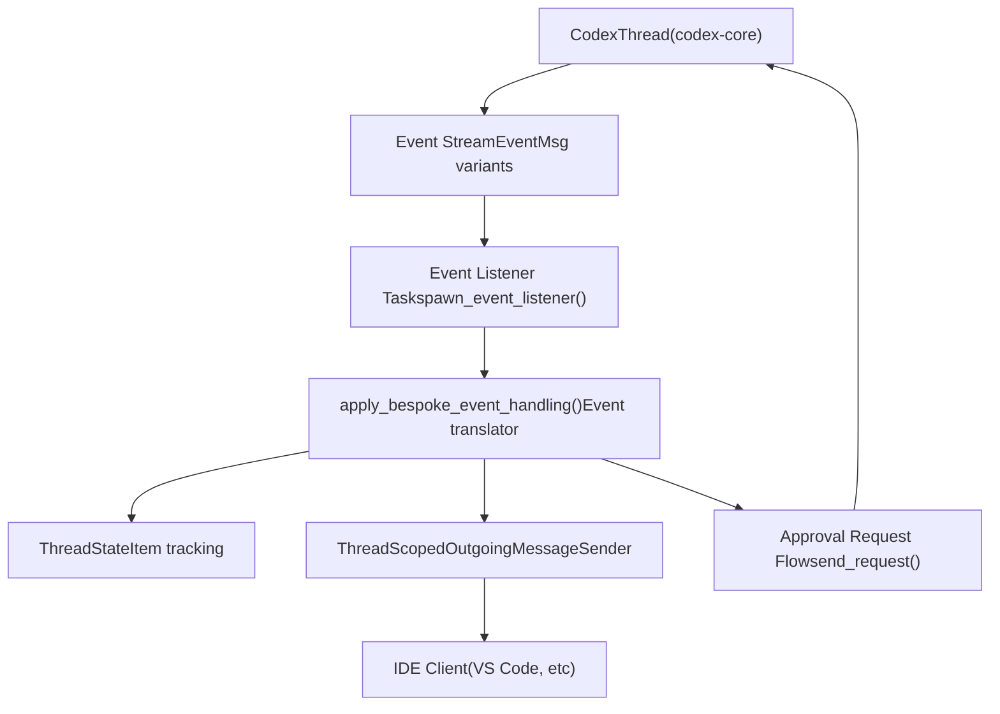
**来源：** [codex-rs/app-server/src/bespoke\_event\_handling.rs172-310](https://github.com/openai/codex/blob/d807d44a/codex-rs/app-server/src/bespoke_event_handling.rs#L172-L310) [codex-rs/app-server/src/codex\_message\_processor.rs396-409](https://github.com/openai/codex/blob/d807d44a/codex-rs/app-server/src/codex_message_processor.rs#L396-L409)

---

## 核心转换函数

[codex-rs/app-server/src/bespoke\_event\_handling.rs172-183](https://github.com/openai/codex/blob/d807d44a/codex-rs/app-server/src/bespoke_event_handling.rs#L172-L183) 中的 `apply_bespoke_event_handling` 函数是中央分发点。它接收一个 `Event`（包含 `id: TurnId` 与 `msg: EventMsg`），执行 `match msg { ... }`，并按需调用 `outgoing.send_server_notification(...)` 或 `outgoing.send_request(...)`。

**`apply_bespoke_event_handling` — 分发概览**

```mermaid
flowchart TD
    ev["Event {id, msg: EventMsg}"]
    fn["apply_bespoke_event_handling()"]
    ts["EventMsg::TurnStarted"]
    tc["EventMsg::TurnComplete"]
    mr["EventMsg::ModelReroute"]
    paa["EventMsg::ApplyPatchApprovalRequest"]
    ear["EventMsg::ExecApprovalRequest"]
    mtcb["EventMsg::McpToolCallBegin"]
    mtce["EventMsg::McpToolCallEnd"]
    dtcr["EventMsg::DynamicToolCallRequest"]
    rui["EventMsg::RequestUserInput"]
    rcs["EventMsg::RealtimeConversationStarted"]
    rcr["EventMsg::RealtimeConversationRealtime"]
    tsn["ServerNotification::TurnStarted"]
    tcn["ServerNotification::TurnCompleted"]
    mrn["ServerNotification::ModelRerouted"]
    istn["ServerNotification::ItemStarted"]
    ictn["ServerNotification::ItemCompleted"]
    sreq["ServerRequest (approval/input)"]

    ev --> fn
    fn --> ts
    ts --> tsn
    fn --> tc
    tc --> tcn
    fn --> mr
    mr --> mrn
    fn --> paa
    paa --> istn
    fn --> paa
    paa --> sreq
    fn --> ear
    ear --> istn
    fn --> ear
    ear --> sreq
    fn --> mtcb
    mtcb --> istn
    fn --> mtce
    mtce --> ictn
    fn --> dtcr
    dtcr --> sreq
    fn --> rui
    rui --> sreq
    fn --> rcs
    rcs --> tsn
    fn --> rcr
    rcr --> istn
```
**关键 `EventMsg` → `ServerNotification` 映射**

| `EventMsg` 变体 | 输出通知 | API | 说明 |
| --- | --- | --- | --- |
| `TurnStarted` | `TurnStarted` | V2 | 发出活跃回合快照 |
| `TurnComplete` | `TurnCompleted` | V1+V2 | 调用 `handle_turn_complete()` |
| `Warning` | *(丢弃)* | — | 不发客户端通知 |
| `ModelReroute` | `ModelRerouted` | V2 |  |
| `ApplyPatchApprovalRequest` | `ItemStarted` + `ServerRequest::FileChangeRequestApproval` | V1/V2 | 双向：等待客户端决策 |
| `ExecApprovalRequest` | `ItemStarted` + `ServerRequest::CommandExecutionRequestApproval` | V1/V2 | 双向：等待客户端决策 |
| `McpToolCallBegin` | `ItemStarted`（McpToolCall） | V2 | `construct_mcp_tool_call_notification()` |
| `McpToolCallEnd` | `ItemCompleted`（McpToolCall） | V2 | `construct_mcp_tool_call_end_notification()` |
| `DynamicToolCallRequest` | `ServerRequest::DynamicToolCall` | V2 | 客户端执行工具并返回结果 |
| `RequestUserInput` | `ServerRequest::ToolRequestUserInput` | V2 | 实验性 |
| `RealtimeConversationStarted` | `ThreadRealtimeStarted` | V2 | 实验性 |
| `RealtimeConversationRealtime` | `ThreadRealtimeOutputAudioDelta` / `ThreadRealtimeItemAdded` / `ThreadRealtimeError` | V2 | 按子事件类型 |
| `RealtimeConversationClosed` | `ThreadRealtimeClosed` | V2 |  |

**来源：** [codex-rs/app-server/src/bespoke\_event\_handling.rs172-480](https://github.com/openai/codex/blob/d807d44a/codex-rs/app-server/src/bespoke_event_handling.rs#L172-L480)

---

## API 版本处理

转换层同时支持 V1（遗留）与 V2 API。[codex-rs/app-server/src/codex\_message\_processor.rs388-393](https://github.com/openai/codex/blob/d807d44a/codex-rs/app-server/src/codex_message_processor.rs#L388-L393) 中定义的 `ApiVersion` 枚举控制使用哪套协议结构。默认值为 `V2`。

| `ApiVersion` | Item 生命周期 | 审批模式 | 示例类型 |
| --- | --- | --- | --- |
| `V1` | 隐式（遗留） | 直接向客户端发送审批参数 | `ApplyPatchApprovalParams`, `ExecCommandApprovalParams` |
| `V2` | 显式（`ItemStarted` / delta / `ItemCompleted`） | 以 `item_id` 为作用域的请求/响应 | `ItemStartedNotification`, `FileChangeRequestApprovalParams` |

**V1 与 V2 转换示例 - 文件变更**

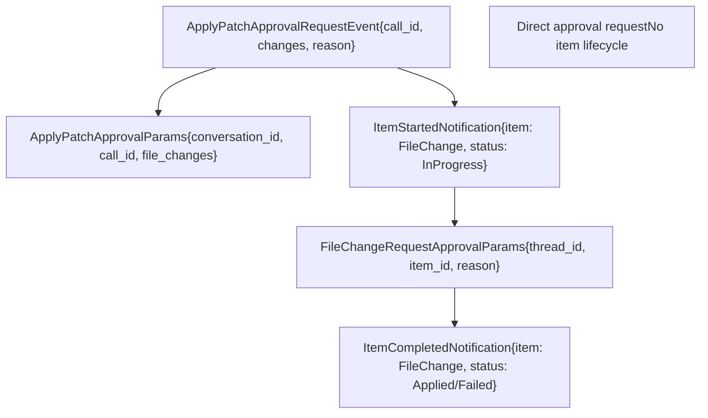
**来源：** [codex-rs/app-server/src/bespoke\_event\_handling.rs130-199](https://github.com/openai/codex/blob/d807d44a/codex-rs/app-server/src/bespoke_event_handling.rs#L130-L199) [codex-rs/app-server/src/codex\_message\_processor.rs284-321](https://github.com/openai/codex/blob/d807d44a/codex-rs/app-server/src/codex_message_processor.rs#L284-L321)

---

## Item 生命周期模式

V2 API 使用结构化 item 生命周期：每个概念操作（文件变更、命令执行、代理消息）都表示为一个 `ThreadItem`，并有明确生命周期事件。

**Item 生命周期状态**

> **[Mermaid stateDiagram]**
> *(图表结构无法解析)*

**具备生命周期的 ThreadItem 类型**

| Item 类型 | Started 事件 | Delta 事件 | Completed 事件 | 状态字段 |
| --- | --- | --- | --- | --- |
| `AgentMessage` | `item/started` | `item/agentMessage/delta` | `item/completed` | N/A（文本内容） |
| `CommandExecution` | `item/started` | `item/commandExecution/outputDelta` | `item/completed` | `CommandExecutionStatus` |
| `FileChange` | `item/started` | `item/fileChange/outputDelta` | `item/completed` | `PatchApplyStatus` |
| `McpToolCall` | `item/started` | N/A | `item/completed` | `McpToolCallStatus` |
| `CollabAgentToolCall` | `item/started` | N/A | `item/completed` | `CollabAgentToolCallStatus` |

**来源：** [codex-rs/app-server/src/bespoke\_event\_handling.rs160-174](https://github.com/openai/codex/blob/d807d44a/codex-rs/app-server/src/bespoke_event_handling.rs#L160-L174) [codex-rs/app-server-protocol/src/protocol/v2.rs823-1165](https://github.com/openai/codex/blob/d807d44a/codex-rs/app-server-protocol/src/protocol/v2.rs#L823-L1165)

---

## 命令执行事件转换

命令执行（shell 命令）遵循较复杂的转换模式，因为核心使用工具调用 ID，而协议使用 item ID。

**命令执行转换流**

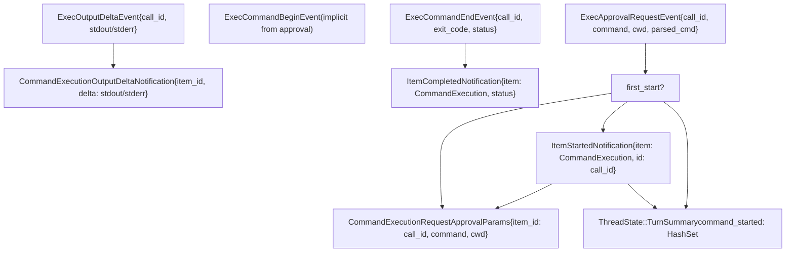
**来源：** [codex-rs/app-server/src/bespoke\_event\_handling.rs406-505](https://github.com/openai/codex/blob/d807d44a/codex-rs/app-server/src/bespoke_event_handling.rs#L406-L505) [codex-rs/app-server/src/thread\_state.rs1-100](https://github.com/openai/codex/blob/d807d44a/codex-rs/app-server/src/thread_state.rs#L1-L100)

---

## 审批请求处理

审批请求是双向的：服务器向客户端发送请求，客户端返回决策，再由服务器将其转发回核心作为 `Op`。

**审批请求/响应循环**

> **[Mermaid sequence]**
> *(图表结构无法解析)*

**`CommandExecutionApprovalDecision` → 核心 `ReviewDecision` 映射**

该转换定义于 [codex-rs/app-server-protocol/src/protocol/v2.rs768-787](https://github.com/openai/codex/blob/d807d44a/codex-rs/app-server-protocol/src/protocol/v2.rs#L768-L787)

| `CommandExecutionApprovalDecision` | 核心 `ReviewDecision` | 行为 |
| --- | --- | --- |
| `Accept` | `ReviewDecision::Approved` | 执行一次命令 |
| `AcceptForSession` | `ReviewDecision::ApprovedForSession` | 在本会话内信任 |
| `AcceptWithExecpolicyAmendment` | `ReviewDecision::ApprovedExecpolicyAmendment` | 更新 exec policy 文件 |
| `ApplyNetworkPolicyAmendment` | `ReviewDecision::NetworkPolicyAmendment` | 应用持久化网络规则 |
| `Decline` | `ReviewDecision::Denied` | 跳过命令并继续回合 |
| `Cancel` | `ReviewDecision::Abort` | 跳过命令并中断回合 |

**来源：** [codex-rs/app-server/src/bespoke\_event\_handling.rs406-453](https://github.com/openai/codex/blob/d807d44a/codex-rs/app-server/src/bespoke_event_handling.rs#L406-L453) [codex-rs/app-server-protocol/src/protocol/v2.rs768-787](https://github.com/openai/codex/blob/d807d44a/codex-rs/app-server-protocol/src/protocol/v2.rs#L768-L787)

---

## 文件变更事件转换

文件变更（`apply_patch` 操作）的转换与命令执行类似，但 item 类型与审批参数不同。

**文件变更转换细节**

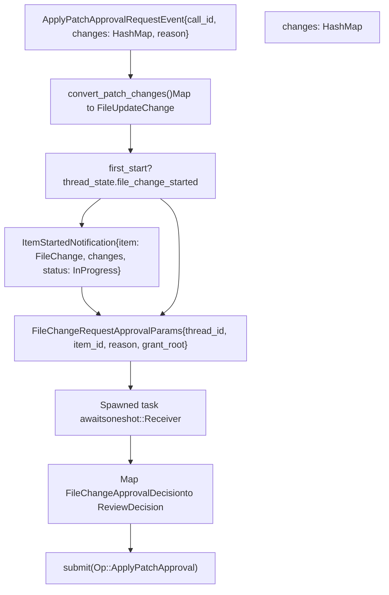
**FileUpdateChange 结构**

协议将文件变更暴露为带 kind、path 与行范围的结构化更新：

-   `kind`：`"create"`、`"update"`、`"delete"`
-   `path`：文件绝对路径
-   `fromLines`：更新/删除时可选的行范围
-   `content`：创建/更新时的新内容

**来源：** [codex-rs/app-server/src/bespoke\_event\_handling.rs125-199](https://github.com/openai/codex/blob/d807d44a/codex-rs/app-server/src/bespoke_event_handling.rs#L125-L199) [codex-rs/app-server/src/bespoke\_event\_handling.rs717-808](https://github.com/openai/codex/blob/d807d44a/codex-rs/app-server/src/bespoke_event_handling.rs#L717-L808)

---

## MCP 工具调用转换

MCP（Model Context Protocol）工具调用通过 begin/end 事件构造 item 通知进行处理。

**MCP 工具调用事件流**

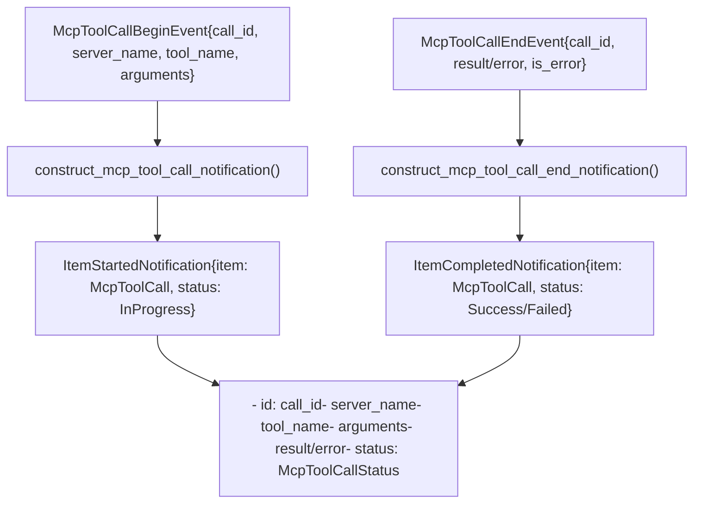
**McpToolCallStatus 取值**

-   `InProgress`：工具正在 MCP 服务器上执行
-   `Success`：工具已完成并返回结果
-   `Failed`：工具执行失败并返回错误

**来源：** [codex-rs/app-server/src/bespoke\_event\_handling.rs359-381](https://github.com/openai/codex/blob/d807d44a/codex-rs/app-server/src/bespoke_event_handling.rs#L359-L381) [codex-rs/app-server/src/bespoke\_event\_handling.rs809-891](https://github.com/openai/codex/blob/d807d44a/codex-rs/app-server/src/bespoke_event_handling.rs#L809-L891)

---

## 动态工具调用处理

动态工具（通过 `turn/start` 参数在运行时定义的自定义工具）使用与审批类似的请求/响应模式。

**动态工具请求/响应流**

> **[Mermaid sequence]**
> *(图表结构无法解析)*

**动态工具内容项**

客户端响应包含一组内容项：

-   `InputText`：纯文本结果
-   `InputImage`：Base64 编码图像数据
-   `InputAudio`：Base64 编码音频数据

**来源：** [codex-rs/app-server/src/bespoke\_event\_handling.rs324-358](https://github.com/openai/codex/blob/d807d44a/codex-rs/app-server/src/bespoke_event_handling.rs#L324-L358) [codex-rs/app-server/src/bespoke\_event\_handling.rs115-116](https://github.com/openai/codex/blob/d807d44a/codex-rs/app-server/src/bespoke_event_handling.rs#L115-L116)

---

## 请求用户输入转换

`RequestUserInput` 事件允许工具在执行中途向用户提问。这是一个仅 V2 支持的实验性特性。

**请求用户输入结构**

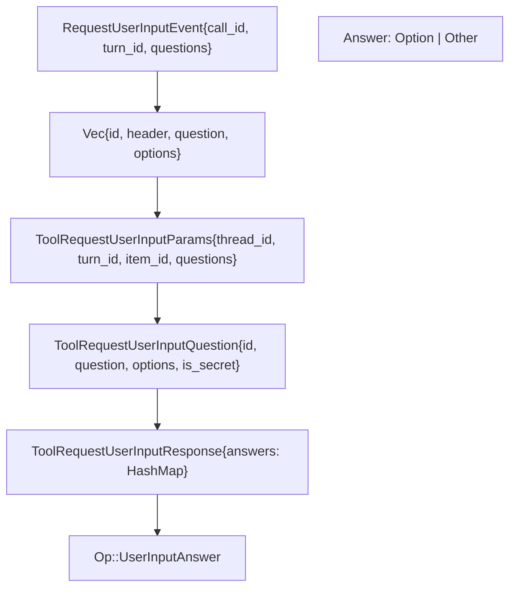
**问题类型**

-   **多选**：`options` 字段包含预定义选项
-   **秘密输入**：`is_secret: true` 用于密码类字段
-   **其他/自由输入**：`is_other: true` 允许自定义文本输入

**来源：** [codex-rs/app-server/src/bespoke\_event\_handling.rs271-323](https://github.com/openai/codex/blob/d807d44a/codex-rs/app-server/src/bespoke_event_handling.rs#L271-L323) [codex-rs/app-server/src/bespoke\_event\_handling.rs93-96](https://github.com/openai/codex/blob/d807d44a/codex-rs/app-server/src/bespoke_event_handling.rs#L93-L96)

---

## 回合完成处理

`TurnComplete` 事件标记回合结束，并触发清理与最终状态计算。

**回合完成流程**

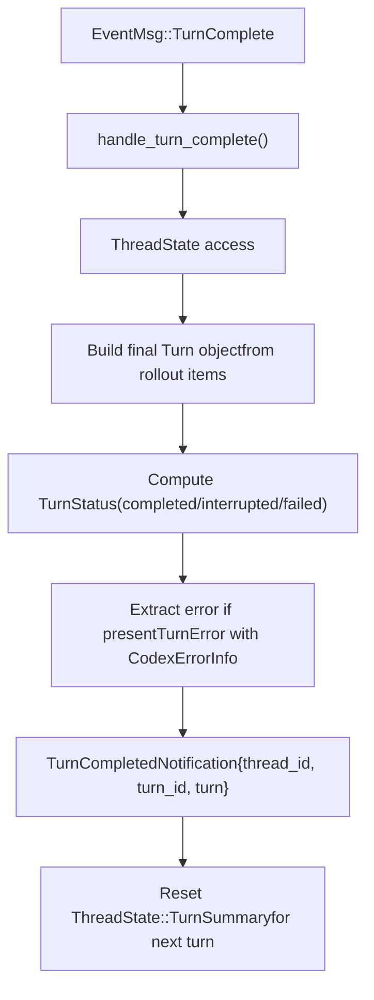
**TurnStatus 取值**

-   `completed`：回合成功完成
-   `interrupted`：回合被用户或系统中断
-   `failed`：回合因错误失败

**来源：** [codex-rs/app-server/src/bespoke\_event\_handling.rs121-124](https://github.com/openai/codex/blob/d807d44a/codex-rs/app-server/src/bespoke_event_handling.rs#L121-L124) [codex-rs/app-server/src/bespoke\_event\_handling.rs892-996](https://github.com/openai/codex/blob/d807d44a/codex-rs/app-server/src/bespoke_event_handling.rs#L892-L996)

---

## 线程状态管理

`ThreadState` 跟踪每回合的瞬态状态，以确保 item 只启动一次，并协调审批请求。

**ThreadState 结构**

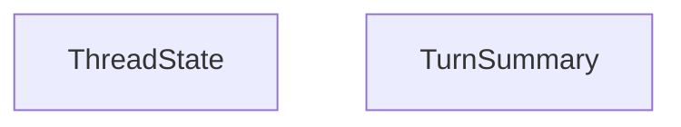
**状态重置模式**

每次 `TurnComplete` 事件后，状态都会重置，以便在 [codex-rs/app-server/src/bespoke\_event\_handling.rs995](https://github.com/openai/codex/blob/d807d44a/codex-rs/app-server/src/bespoke_event_handling.rs#L995-L995) 中为下一回合做准备。

**来源：** [codex-rs/app-server/src/thread\_state.rs1-100](https://github.com/openai/codex/blob/d807d44a/codex-rs/app-server/src/thread_state.rs#L1-L100) [codex-rs/app-server/src/bespoke\_event\_handling.rs153-159](https://github.com/openai/codex/blob/d807d44a/codex-rs/app-server/src/bespoke_event_handling.rs#L153-L159)

---

## 流式架构

事件通过多层架构从核心线程流向客户端。

**流式架构组件**

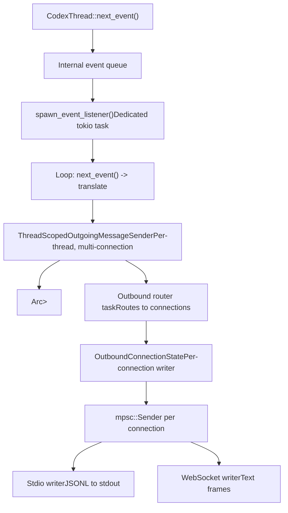
**背压处理**

所有通道都是有界的。若客户端消费通知较慢：

1.  出站队列会被填满
2.  通道上的 `send()` 会阻塞
3.  事件监听任务会暂停
4.  核心继续生成事件（内部缓冲）
5.  客户端追上后，事件恢复发送

**来源：** [codex-rs/app-server/src/outgoing\_message.rs50-75](https://github.com/openai/codex/blob/d807d44a/codex-rs/app-server/src/outgoing_message.rs#L50-L75) [codex-rs/app-server/src/codex\_message\_processor.rs396-410](https://github.com/openai/codex/blob/d807d44a/codex-rs/app-server/src/codex_message_processor.rs#L396-L410)

---

## 通知退订（Opt-Out）

客户端可在初始化期间退订特定通知，以减少带宽占用或仅处理某些事件。

**退订机制**

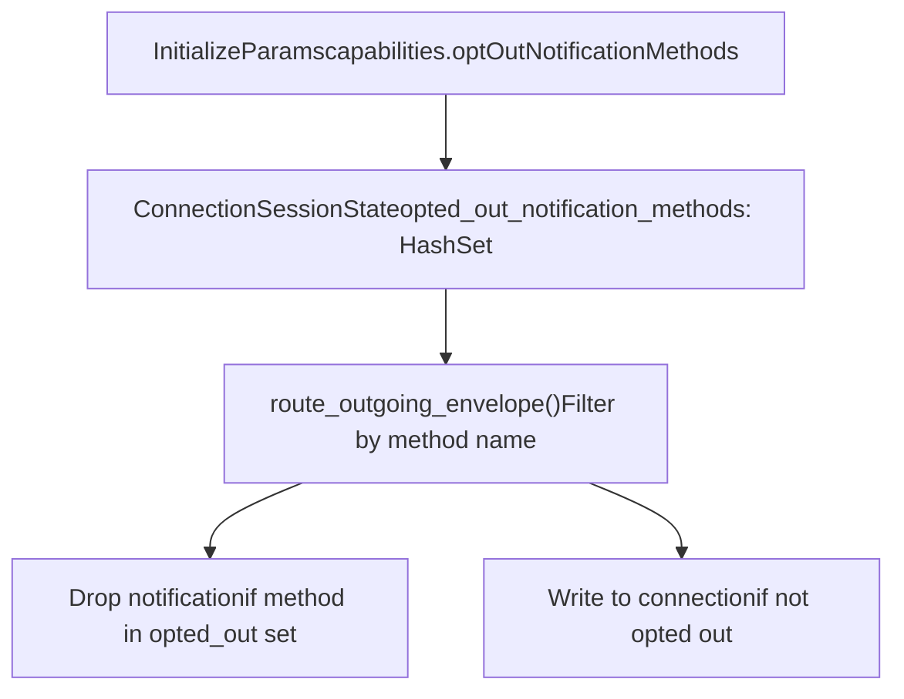
`opted_out_notification_methods` 在 `Initialize` 握手期间填充。匹配为精确匹配（不支持通配符或前缀匹配）。

**常见退订模式**

-   退订 `item/agentMessage/delta`，以减少流式文本带宽
-   若只需最终状态，退订 `item/commandExecution/outputDelta`
-   使用 V2 API 时退订遗留事件

**来源：** [codex-rs/app-server/src/codex\_message\_processor.rs140-148](https://github.com/openai/codex/blob/d807d44a/codex-rs/app-server/src/codex_message_processor.rs#L140-L148) [codex-rs/app-server-protocol/src/protocol/v1.rs100-110](https://github.com/openai/codex/blob/d807d44a/codex-rs/app-server-protocol/src/protocol/v1.rs#L100-L110)

---

## 错误处理与韧性

转换层包含错误处理机制，确保事件处理中的失败不会导致整个线程崩溃。

**错误恢复模式**

| 错误场景 | 恢复策略 | 影响 |
| --- | --- | --- |
| 客户端在审批中途断开 | `oneshot::Receiver` 丢弃，核心超时 | 回合继续或干净失败 |
| 序列化失败 | 记录错误并跳过通知 | 事件丢失，但线程继续 |
| 转换逻辑 panic | 通过 `tokio::spawn` 任务隔离 | 单个事件丢失，其余继续 |
| 审批响应超时 | 核心收不到响应，应用默认处理 | 回合按拒绝继续 |

**审批响应处理**

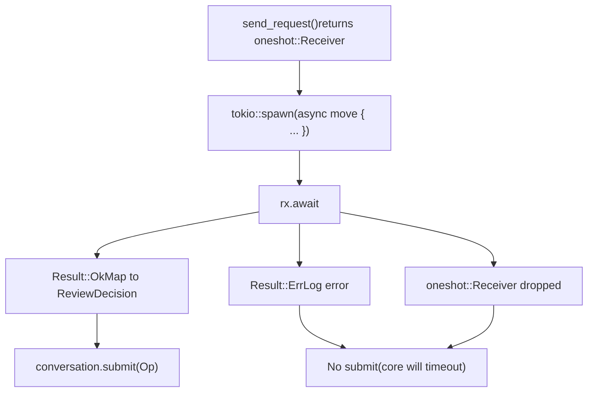
**来源：** [codex-rs/app-server/src/bespoke\_event\_handling.rs143-146](https://github.com/openai/codex/blob/d807d44a/codex-rs/app-server/src/bespoke_event_handling.rs#L143-L146) [codex-rs/app-server/src/bespoke\_event\_handling.rs597-649](https://github.com/openai/codex/blob/d807d44a/codex-rs/app-server/src/bespoke_event_handling.rs#L597-L649)
