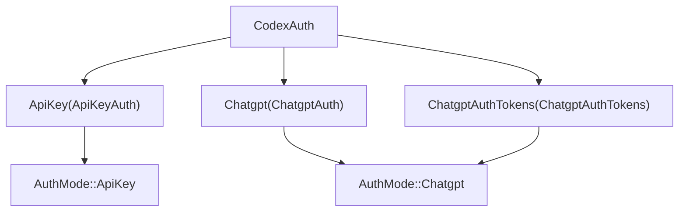
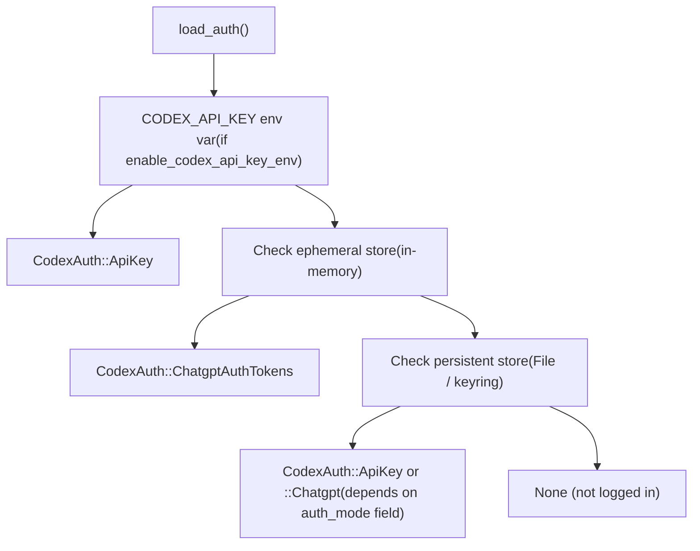
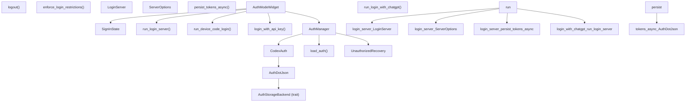

# 认证模式与账户管理

相关源文件

-   [codex-rs/cli/src/login.rs](https://github.com/openai/codex/blob/d807d44a/codex-rs/cli/src/login.rs)
-   [codex-rs/core/tests/suite/auth\_refresh.rs](https://github.com/openai/codex/blob/d807d44a/codex-rs/core/tests/suite/auth_refresh.rs)
-   [codex-rs/login/Cargo.toml](https://github.com/openai/codex/blob/d807d44a/codex-rs/login/Cargo.toml)
-   [codex-rs/login/src/lib.rs](https://github.com/openai/codex/blob/d807d44a/codex-rs/login/src/lib.rs)
-   [codex-rs/login/src/server.rs](https://github.com/openai/codex/blob/d807d44a/codex-rs/login/src/server.rs)
-   [codex-rs/login/src/token\_data.rs](https://github.com/openai/codex/blob/d807d44a/codex-rs/login/src/token_data.rs)
-   [codex-rs/login/tests/suite/login\_server\_e2e.rs](https://github.com/openai/codex/blob/d807d44a/codex-rs/login/tests/suite/login_server_e2e.rs)
-   [codex-rs/tui/src/ascii\_animation.rs](https://github.com/openai/codex/blob/d807d44a/codex-rs/tui/src/ascii_animation.rs)
-   [codex-rs/tui/src/chatwidget/snapshots/codex\_tui\_\_chatwidget\_\_tests\_\_rate\_limit\_switch\_prompt\_popup.snap](https://github.com/openai/codex/blob/d807d44a/codex-rs/tui/src/chatwidget/snapshots/codex_tui__chatwidget__tests__rate_limit_switch_prompt_popup.snap)
-   [codex-rs/tui/src/onboarding/auth.rs](https://github.com/openai/codex/blob/d807d44a/codex-rs/tui/src/onboarding/auth.rs)
-   [codex-rs/tui/src/onboarding/mod.rs](https://github.com/openai/codex/blob/d807d44a/codex-rs/tui/src/onboarding/mod.rs)
-   [codex-rs/tui/src/onboarding/onboarding\_screen.rs](https://github.com/openai/codex/blob/d807d44a/codex-rs/tui/src/onboarding/onboarding_screen.rs)
-   [codex-rs/tui/src/onboarding/trust\_directory.rs](https://github.com/openai/codex/blob/d807d44a/codex-rs/tui/src/onboarding/trust_directory.rs)
-   [codex-rs/tui/src/onboarding/welcome.rs](https://github.com/openai/codex/blob/d807d44a/codex-rs/tui/src/onboarding/welcome.rs)

本页记录 Codex 如何进行用户认证、存储凭据、刷新令牌以及在运行时管理登录状态。内容涵盖 `codex-core` 中的 `CodexAuth` / `AuthManager` 类型、`codex-login` 中的 OAuth/PKCE 浏览器登录服务器、设备码流程、API key 认证，以及在 TUI 引导屏中引导首次用户完成登录的流程。

关于认证配置如何下发到运行中的会话（例如来自云托管配置的 `forced_login_method`），参见 Config API and Layer System [4.5.4](https://github.com/openai/codex/blob/d807d44a/4.5.4)。关于 MCP 服务器专用的 OAuth 令牌处理，参见 OAuth Authentication for MCP [6.5](https://github.com/openai/codex/blob/d807d44a/6.5)

---

## 认证模式

Codex 支持两种顶层认证模式，由 `AuthMode` 枚举表示：

[codex-rs/login/src/auth.rs44-48](https://github.com/openai/codex/blob/d807d44a/codex-rs/login/src/auth.rs#L44-L48)（注：`AuthMode` 从 `codex-app-server-protocol` 重新导出）

| `AuthMode` 变体 | 说明 |
| --- | --- |
| `ApiKey` | 原始 OpenAI API key 作为 Bearer token 发送。使用按 token 计费。 |
| `Chatgpt` | 使用从 ChatGPT 账户获取的 OAuth access token。限额与计费遵循用户的 ChatGPT 套餐。 |

`CodexAuth` 枚举持有三种子模式之一的具体认证负载：

[codex-rs/login/src/auth.rs61-65](https://github.com/openai/codex/blob/d807d44a/codex-rs/login/src/auth.rs#L61-L65)

| `CodexAuth` 变体 | 内部结构体 | 说明 |
| --- | --- | --- |
| `ApiKey(ApiKeyAuth)` | `ApiKeyAuth` | 持有原始 API key 字符串。 |
| `Chatgpt(ChatgptAuth)` | `ChatgptAuth` | 持有 OAuth 令牌 + 持久化存储后端。用于 Codex 自身管理 OAuth 流程的场景。 |
| `ChatgptAuthTokens(ChatgptAuthTokens)` | `ChatgptAuthTokens` | 持有外部获得的 OAuth 令牌（例如 IDE 扩展通过 app server 提供）。仅存于内存（临时）。 |

**认证模式解析图**


来源： [codex-rs/login/src/auth.rs44-65](https://github.com/openai/codex/blob/d807d44a/codex-rs/login/src/auth.rs#L44-L65) [codex-rs/login/src/auth.rs200-213](https://github.com/openai/codex/blob/d807d44a/codex-rs/login/src/auth.rs#L200-L213)

---

## 令牌存储：`AuthDotJson` 与 `AuthCredentialsStoreMode`

凭据会序列化为 `AuthDotJson` 结构，并通过 `AuthStorageBackend` trait 持久化。默认位置是 `$CODEX_HOME/auth.json`。

[codex-rs/login/src/auth.rs22-26](https://github.com/openai/codex/blob/d807d44a/codex-rs/login/src/auth.rs#L22-L26)

### `AuthDotJson` 字段

| 字段 | 类型 | 用途 |
| --- | --- | --- |
| `auth_mode` | `Option<AuthMode>` | 显式记录认证模式。若缺失则回退到启发式判断。 |
| `openai_api_key` | `Option<String>` | 原始 API key（`ApiKey` 模式会填充，历史上 ChatGPT PKCE 交换后也可能填充）。 |
| `tokens` | `Option<TokenData>` | ChatGPT OAuth 令牌包（access、refresh、id）。 |
| `last_refresh` | `Option<DateTime<Utc>>` | 最近一次成功刷新时间戳，用于判断是否需要刷新。 |

### `AuthCredentialsStoreMode`

控制凭据写入位置：

| 模式 | 行为 |
| --- | --- |
| `File` | 在 `codex_home` 下读写磁盘 `auth.json`。 |
| `Ephemeral` | 仅在进程内存存储凭据；绝不触盘。用于外部提供的 ChatGPT 令牌。 |
| `Auto` / keyring variants | 平台相关的安全存储（keychain/keyring）。 |

`ChatgptAuthTokens` 变体无论配置模式为何都始终使用 `Ephemeral` 存储。

[codex-rs/login/src/auth.rs792-801](https://github.com/openai/codex/blob/d807d44a/codex-rs/login/src/auth.rs#L792-L801)

来源： [codex-rs/login/src/auth.rs1-36](https://github.com/openai/codex/blob/d807d44a/codex-rs/login/src/auth.rs#L1-L36) [codex-rs/login/src/auth.rs782-801](https://github.com/openai/codex/blob/d807d44a/codex-rs/login/src/auth.rs#L782-L801)

---

## `AuthManager`：中心认证状态

`AuthManager` 是 `CodexAuth` 的运行时持有者。它在构造时加载一次凭据，之后分发克隆快照。对 `auth.json` 的外部修改不会被观察到，直到显式调用 `reload()`——这是有意设计，以防单次运行内部视图不一致。

[codex-rs/login/src/auth.rs962-969](https://github.com/openai/codex/blob/d807d44a/codex-rs/login/src/auth.rs#L962-L969)

### 构造

```
AuthManager::new(codex_home, enable_codex_api_key_env, auth_credentials_store_mode)
```
构造函数会：

1.  可选检查 `CODEX_API_KEY` 环境变量（当 `enable_codex_api_key_env` 为 true）。
2.  检查外部提供令牌的临时存储。
3.  回退到配置的持久化存储（`File` / keyring）。

[codex-rs/login/src/auth.rs976-998](https://github.com/openai/codex/blob/d807d44a/codex-rs/login/src/auth.rs#L976-L998)

### 关键方法

| 方法 | 用途 |
| --- | --- |
| `auth_cached()` | 返回缓存的 `Option<CodexAuth>`，不进行网络调用。 |
| `auth()` | 返回缓存认证，并在需要时刷新过期 ChatGPT 令牌。 |
| `reload()` | 从磁盘重新读取到缓存。登录完成后调用。 |
| `refresh_token()` | 若当前内存令牌与磁盘状态不一致，则刷新 ChatGPT 令牌。 |
| `refresh_token_from_authority()` | 无论磁盘状态如何，都始终请求 `auth.openai.com` 获取新令牌。 |
| `refresh_external_auth(reason)` | 向 `ExternalAuthRefresher`（例如 IDE host）请求新令牌。 |
| `unauthorized_recovery()` | 返回 `UnauthorizedRecovery` 状态机，用于处理 HTTP 401 重试。 |

来源： [codex-rs/login/src/auth.rs954-1050](https://github.com/openai/codex/blob/d807d44a/codex-rs/login/src/auth.rs#L954-L1050)

---

## 认证加载优先级

加载凭据时，优先级如下：

**认证加载优先级图**


来源： [codex-rs/login/src/auth.rs547-591](https://github.com/openai/codex/blob/d807d44a/codex-rs/login/src/auth.rs#L547-L591)

---

## ChatGPT 浏览器登录流程（PKCE）

基于浏览器的 ChatGPT 登录位于 `codex-rs/login/src/server.rs`。它既用于 CLI（`codex login`），也用于 TUI onboarding 屏。

**序列：浏览器登录**

> **[Mermaid sequence]**
> *(图表结构无法解析)*

流程中的关键类型：

| 类型 / 函数 | 文件 | 角色 |
| --- | --- | --- |
| `ServerOptions` | `login/src/server.rs:54` | 配置集合：codex\_home、client\_id、issuer、port、workspace 限制。 |
| `LoginServer` | `login/src/server.rs:87` | 运行中本地 HTTP 服务器句柄。暴露 `auth_url`、`actual_port`、`block_until_done()`。 |
| `ShutdownHandle` | `login/src/server.rs:115` | Tokio notify 包装；调用 `shutdown()` 可取消服务器循环。 |
| `run_login_server(opts)` | `login/src/server.rs:127` | 启动服务器与异步循环；返回 `LoginServer`。 |
| `exchange_code_for_tokens()` | `login/src/server.rs:536` | 使用 PKCE verifier 向 `{issuer}/oauth/token` 发起 POST；返回 `ExchangedTokens`。 |
| `persist_tokens_async()` | `login/src/server.rs:583` | 通过 `save_auth()` 将 `AuthDotJson` 写入磁盘。 |
| `ensure_workspace_allowed()` | `login/src/server.rs:698` | 校验 `chatgpt_account_id` JWT 声明是否匹配 `forced_chatgpt_workspace_id`。 |

所用 OAuth 客户端 ID 为常量 `CLIENT_ID = "app_EMoamEEZ73f0CkXaXp7hrann"`。

[codex-rs/login/src/auth.rs22](https://github.com/openai/codex/blob/d807d44a/codex-rs/login/src/auth.rs#L22-L22)

来源： [codex-rs/login/src/server.rs1-220](https://github.com/openai/codex/blob/d807d44a/codex-rs/login/src/server.rs#L1-L220) [codex-rs/login/src/server.rs528-616](https://github.com/openai/codex/blob/d807d44a/codex-rs/login/src/server.rs#L528-L616)

---

## 设备码登录

在无头/远程环境中，Codex 通过 `codex-rs/login/src/device_code_auth.rs` 中的 `run_device_code_login()` 支持 OAuth 设备码流程。

在 CLI 中，`codex login --device-auth` 会调用 `run_device_code_login()`。

[codex-rs/cli/src/login.rs17-18](https://github.com/openai/codex/blob/d807d44a/codex-rs/cli/src/login.rs#L17-L18)

在 TUI onboarding 中，设备码路径从 `AuthModeWidget::start_device_code_login()` 开始，它管理 `ContinueWithDeviceCodeState`。

[codex-rs/tui/src/onboarding/auth.rs119-122](https://github.com/openai/codex/blob/d807d44a/codex-rs/tui/src/onboarding/auth.rs#L119-L122) [codex-rs/tui/src/onboarding/auth.rs773-786](https://github.com/openai/codex/blob/d807d44a/codex-rs/tui/src/onboarding/auth.rs#L773-L786)

来源： [codex-rs/cli/src/login.rs1-222](https://github.com/openai/codex/blob/d807d44a/codex-rs/cli/src/login.rs#L1-L222) [codex-rs/tui/src/onboarding/auth.rs773-786](https://github.com/openai/codex/blob/d807d44a/codex-rs/tui/src/onboarding/auth.rs#L773-L786)

---

## API Key 登录

API key 认证路径更简单：

-   **环境变量**：`OPENAI_API_KEY` 或 `CODEX_API_KEY`（通过 `read_openai_api_key_from_env()` 读取）。
-   **已存凭据**：`login_with_api_key(codex_home, api_key, store_mode)` 会写入 `AuthDotJson`，其中 `auth_mode = ApiKey`，并在 `openai_api_key` 中保存 key。
-   **TUI onboarding**：`AuthModeWidget` 允许用户粘贴或输入 API key，随后通过 `login_with_api_key` 持久化。

[codex-rs/login/src/auth.rs363-403](https://github.com/openai/codex/blob/d807d44a/codex-rs/login/src/auth.rs#L363-L403) [codex-rs/tui/src/onboarding/auth.rs671-705](https://github.com/openai/codex/blob/d807d44a/codex-rs/tui/src/onboarding/auth.rs#L671-L705)

来源： [codex-rs/login/src/auth.rs363-403](https://github.com/openai/codex/blob/d807d44a/codex-rs/login/src/auth.rs#L363-L403) [codex-rs/cli/src/login.rs161-188](https://github.com/openai/codex/blob/d807d44a/codex-rs/cli/src/login.rs#L161-L188)

---

## 令牌刷新

ChatGPT access token 有较短生命周期。`AuthManager` 会透明地刷新它们。

**刷新间隔**：`TOKEN_REFRESH_INTERVAL = 8` 小时。`auth()` 方法会检查 `last_refresh`，并在令牌过期时先刷新再返回给调用方。

[codex-rs/login/src/auth.rs96](https://github.com/openai/codex/blob/d807d44a/codex-rs/login/src/auth.rs#L96-L96)

### 刷新端点

令牌通过向 `https://auth.openai.com/oauth/token` 发起 POST 进行刷新（可由 `CODEX_REFRESH_TOKEN_URL_OVERRIDE` 覆盖）。

[codex-rs/login/src/auth.rs104-105](https://github.com/openai/codex/blob/d807d44a/codex-rs/login/src/auth.rs#L104-L105)

### `RefreshTokenError` 分类

当刷新端点返回 401 时，会解析错误体以分类失败原因：

| 响应中的错误码 | `RefreshTokenFailedReason` | 用户消息 |
| --- | --- | --- |
| `refresh_token_expired` | `Expired` | 令牌已过期——退出登录并重新登录。 |
| `refresh_token_reused` | `Exhausted` | 令牌已被使用——退出登录并重新登录。 |
| `refresh_token_invalidated` | `Revoked` | 令牌已撤销——退出登录并重新登录。 |
| 其他任意值 | `Other` | 通用未知错误。 |

[codex-rs/login/src/auth.rs665-692](https://github.com/openai/codex/blob/d807d44a/codex-rs/login/src/auth.rs#L665-L692)

### `UnauthorizedRecovery` 状态机

当 API 请求返回 HTTP 401 时，模型客户端会使用 `UnauthorizedRecovery` 在向用户暴露错误前尝试恢复。

**`UnauthorizedRecovery` 状态机图**

对于 `ApiKey` 模式，`has_next()` 会立即返回 `false`——不会尝试恢复。

[codex-rs/login/src/auth.rs862-951](https://github.com/openai/codex/blob/d807d44a/codex-rs/login/src/auth.rs#L862-L951)

来源： [codex-rs/login/src/auth.rs593-692](https://github.com/openai/codex/blob/d807d44a/codex-rs/login/src/auth.rs#L593-L692) [codex-rs/login/src/auth.rs827-951](https://github.com/openai/codex/blob/d807d44a/codex-rs/login/src/auth.rs#L827-L951)

---

## 登出

```
logout(codex_home, auth_credentials_store_mode) -> io::Result<bool>
```
委托给配置的 `AuthStorageBackend::delete()`。若删除了凭据则返回 `Ok(true)`；若无可删内容则返回 `Ok(false)`。

在 CLI 中：`run_logout()`，见 [codex-rs/cli/src/login.rs15](https://github.com/openai/codex/blob/d807d44a/codex-rs/cli/src/login.rs#L15-L15)

当 `enforce_login_restrictions` 触发强制登出（例如 workspace 错误或登录方式错误）时，`logout_all_stores()` 会同时清空临时存储与持久化存储。

[codex-rs/login/src/auth.rs535-545](https://github.com/openai/codex/blob/d807d44a/codex-rs/login/src/auth.rs#L535-L545)

来源： [codex-rs/login/src/auth.rs380-388](https://github.com/openai/codex/blob/d807d44a/codex-rs/login/src/auth.rs#L380-L388) [codex-rs/cli/src/login.rs15](https://github.com/openai/codex/blob/d807d44a/codex-rs/cli/src/login.rs#L15-L15)

---

## 登录限制

函数 `enforce_login_restrictions(config)` 会在启动时运行；如果存储凭据违反已配置约束，则会登出并报错：

[codex-rs/login/src/auth.rs447-518](https://github.com/openai/codex/blob/d807d44a/codex-rs/login/src/auth.rs#L447-L518)

| 约束字段 | 来源 | 违规效果 |
| --- | --- | --- |
| `forced_login_method: Some(ForcedLoginMethod::Api)` | Config | 若当前为 ChatGPT 认证 → 强制登出。 |
| `forced_login_method: Some(ForcedLoginMethod::Chatgpt)` | Config | 若当前为 API key 认证 → 强制登出。 |
| `forced_chatgpt_workspace_id` | Config | 若 ChatGPT 令牌中的 `chatgpt_account_id` 不匹配 → 强制登出。 |

TUI 的 `AuthModeWidget` 在渲染登录选项时也会在本地执行这些约束——例如当 `forced_login_method == Chatgpt` 时隐藏 API key 选项。

[codex-rs/tui/src/onboarding/auth.rs211-240](https://github.com/openai/codex/blob/d807d44a/codex-rs/tui/src/onboarding/auth.rs#L211-L240)

来源： [codex-rs/login/src/auth.rs447-518](https://github.com/openai/codex/blob/d807d44a/codex-rs/login/src/auth.rs#L447-L518) [codex-rs/tui/src/onboarding/auth.rs211-240](https://github.com/openai/codex/blob/d807d44a/codex-rs/tui/src/onboarding/auth.rs#L211-L240)

---

## TUI 引导屏

当用户在没有存储凭据的情况下启动 Codex，或配置要求显示登录屏时，TUI 会显示 `OnboardingScreen`（位于 `codex-rs/tui/src/onboarding/onboarding_screen.rs`）。引导屏由一组 `Step` 变体组成：

1.  `Step::Welcome(WelcomeWidget)` —— 仅在未登录时显示。
2.  `Step::Auth(AuthModeWidget)` —— 登录方式选择。
3.  `Step::TrustDirectory(TrustDirectoryWidget)` —— 目录信任提示。

[codex-rs/tui/src/onboarding/onboarding\_screen.rs34-38](https://github.com/openai/codex/blob/d807d44a/codex-rs/tui/src/onboarding/onboarding_screen.rs#L34-L38)

### `AuthModeWidget` 与 `SignInState`

`AuthModeWidget` 驱动登录 UI。其内部状态机是 `SignInState`：

[codex-rs/tui/src/onboarding/auth.rs86-94](https://github.com/openai/codex/blob/d807d44a/codex-rs/tui/src/onboarding/auth.rs#L86-L94)

当达到 `ChatGptSuccess` 或 `ApiKeyConfigured` 时，会设置 `StepState::Complete`，从而将 `OnboardingScreen` 推进到下一步。

[codex-rs/tui/src/onboarding/auth.rs789-800](https://github.com/openai/codex/blob/d807d44a/codex-rs/tui/src/onboarding/auth.rs#L789-L800)

### `AuthModeWidget` 字段

| 字段 | 类型 | 角色 |
| --- | --- | --- |
| `sign_in_state` | `Arc<RwLock<SignInState>>` | 当前 UI 状态；由异步 Tokio 任务写入。 |
| `auth_manager` | `Arc<AuthManager>` | 登录成功后通过 `auth_manager.reload()` 重新加载。 |
| `codex_home` | `PathBuf` | 凭据存储路径。 |
| `forced_login_method` | `Option<ForcedLoginMethod>` | 控制哪些选项可显示/可选择。 |
| `forced_chatgpt_workspace_id` | `Option<String>` | 传入 `ServerOptions`，将 OAuth 限制在特定 workspace。 |

[codex-rs/tui/src/onboarding/auth.rs196-208](https://github.com/openai/codex/blob/d807d44a/codex-rs/tui/src/onboarding/auth.rs#L196-L208)

来源： [codex-rs/tui/src/onboarding/auth.rs86-208](https://github.com/openai/codex/blob/d807d44a/codex-rs/tui/src/onboarding/auth.rs#L86-L208) [codex-rs/tui/src/onboarding/onboarding\_screen.rs33-139](https://github.com/openai/codex/blob/d807d44a/codex-rs/tui/src/onboarding/onboarding_screen.rs#L33-L139)

---

## CLI 登录命令

`codex-rs/cli/src/login.rs` 中的 CLI 入口点映射到以下操作：

| 函数 | 调用方式 | 说明 |
| --- | --- | --- |
| `run_login_with_chatgpt()` | `codex login` | 通过 `run_login_server()` 执行浏览器 PKCE 流程。 |
| `run_login_with_api_key()` | `codex login --with-api-key` | 从 stdin 读取 key，并通过 `login_with_api_key()` 写入。 |
| `run_logout()` | `codex logout` | 调用 `logout()` 并退出。 |

[codex-rs/cli/src/login.rs131-188](https://github.com/openai/codex/blob/d807d44a/codex-rs/cli/src/login.rs#L131-L188) [codex-rs/cli/src/login.rs255-272](https://github.com/openai/codex/blob/d807d44a/codex-rs/cli/src/login.rs#L255-L272)

所有 CLI 登录函数都会在启动任何流程前遵守配置中的 `forced_login_method`。

来源： [codex-rs/cli/src/login.rs1-300](https://github.com/openai/codex/blob/d807d44a/codex-rs/cli/src/login.rs#L1-L300)

---

## 组件关系

下图将主要认证抽象映射到其源码位置：


来源： [codex-rs/login/src/auth.rs1-1050](https://github.com/openai/codex/blob/d807d44a/codex-rs/login/src/auth.rs#L1-L1050) [codex-rs/login/src/server.rs1-220](https://github.com/openai/codex/blob/d807d44a/codex-rs/login/src/server.rs#L1-L220) [codex-rs/tui/src/onboarding/auth.rs1-831](https://github.com/openai/codex/blob/d807d44a/codex-rs/tui/src/onboarding/auth.rs#L1-L831) [codex-rs/cli/src/login.rs1-300](https://github.com/openai/codex/blob/d807d44a/codex-rs/cli/src/login.rs#L1-L300)
