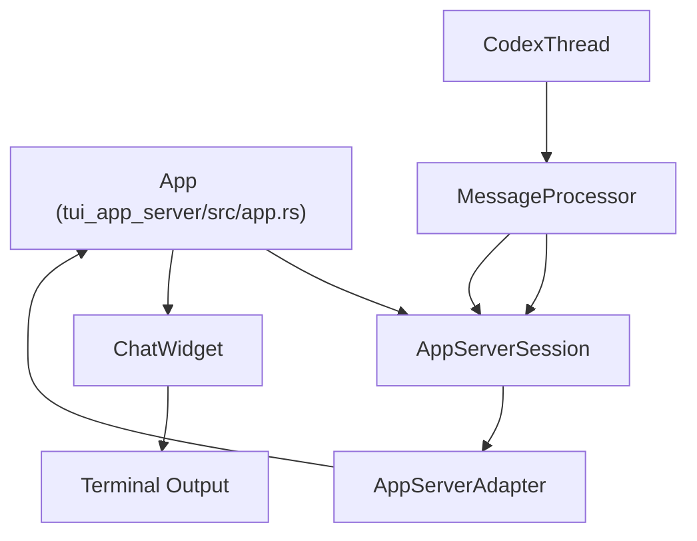
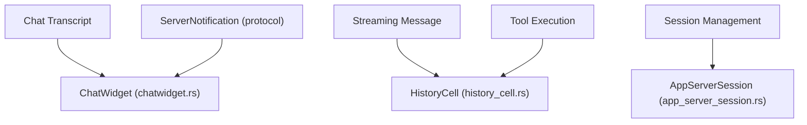

# TUI 应用服务器变体（tui\_app\_server）

相关源文件

-   [codex-rs/app-server-client/src/lib.rs](https://github.com/openai/codex/blob/d807d44a/codex-rs/app-server-client/src/lib.rs)
-   [codex-rs/app-server/src/in\_process.rs](https://github.com/openai/codex/blob/d807d44a/codex-rs/app-server/src/in_process.rs)
-   [codex-rs/app-server/src/thread\_state.rs](https://github.com/openai/codex/blob/d807d44a/codex-rs/app-server/src/thread_state.rs)
-   [codex-rs/core/src/message\_history.rs](https://github.com/openai/codex/blob/d807d44a/codex-rs/core/src/message_history.rs)
-   [codex-rs/tui/src/chatwidget/plugins.rs](https://github.com/openai/codex/blob/d807d44a/codex-rs/tui/src/chatwidget/plugins.rs)
-   [codex-rs/tui/src/chatwidget/snapshots/codex\_tui\_\_chatwidget\_\_tests\_\_image\_generation\_call\_history\_snapshot.snap](https://github.com/openai/codex/blob/d807d44a/codex-rs/tui/src/chatwidget/snapshots/codex_tui__chatwidget__tests__image_generation_call_history_snapshot.snap)
-   [codex-rs/tui\_app\_server/src/app.rs](https://github.com/openai/codex/blob/d807d44a/codex-rs/tui_app_server/src/app.rs)
-   [codex-rs/tui\_app\_server/src/app/app\_server\_adapter.rs](https://github.com/openai/codex/blob/d807d44a/codex-rs/tui_app_server/src/app/app_server_adapter.rs)
-   [codex-rs/tui\_app\_server/src/app\_event.rs](https://github.com/openai/codex/blob/d807d44a/codex-rs/tui_app_server/src/app_event.rs)
-   [codex-rs/tui\_app\_server/src/app\_server\_session.rs](https://github.com/openai/codex/blob/d807d44a/codex-rs/tui_app_server/src/app_server_session.rs)
-   [codex-rs/tui\_app\_server/src/bottom\_pane/chat\_composer\_history.rs](https://github.com/openai/codex/blob/d807d44a/codex-rs/tui_app_server/src/bottom_pane/chat_composer_history.rs)
-   [codex-rs/tui\_app\_server/src/chatwidget.rs](https://github.com/openai/codex/blob/d807d44a/codex-rs/tui_app_server/src/chatwidget.rs)
-   [codex-rs/tui\_app\_server/src/chatwidget/snapshots/codex\_tui\_\_chatwidget\_\_tests\_\_image\_generation\_call\_history\_snapshot.snap](https://github.com/openai/codex/blob/d807d44a/codex-rs/tui_app_server/src/chatwidget/snapshots/codex_tui__chatwidget__tests__image_generation_call_history_snapshot.snap)
-   [codex-rs/tui\_app\_server/src/chatwidget/snapshots/codex\_tui\_app\_server\_\_chatwidget\_\_tests\_\_image\_generation\_call\_history\_snapshot.snap](https://github.com/openai/codex/blob/d807d44a/codex-rs/tui_app_server/src/chatwidget/snapshots/codex_tui_app_server__chatwidget__tests__image_generation_call_history_snapshot.snap)
-   [codex-rs/tui\_app\_server/src/chatwidget/tests.rs](https://github.com/openai/codex/blob/d807d44a/codex-rs/tui_app_server/src/chatwidget/tests.rs)
-   [codex-rs/tui\_app\_server/src/history\_cell.rs](https://github.com/openai/codex/blob/d807d44a/codex-rs/tui_app_server/src/history_cell.rs)

`tui_app_server` crate 为 Codex 提供了一个作为 `app-server` 协议客户端运行的终端用户界面（TUI）。与直接集成 `codex-core` 组件的旧版 TUI 不同，该变体通过 JSON-RPC 消息与进程内或远程 `app-server` 实例通信 [codex-rs/tui\_app\_server/src/app/app\_server\_adapter.rs1-12](https://github.com/openai/codex/blob/d807d44a/codex-rs/tui_app_server/src/app/app_server_adapter.rs#L1-L12)。这种架构将 UI 渲染逻辑与代理执行解耦，使 TUI 可作为轻量前端运行。

## 架构与数据流

`tui_app_server` 变体使用适配器模式，将来自 `app-server` 的异步事件流桥接到 TUI 的响应式渲染循环。

### 系统交互图

该图展示了 TUI 如何通过 `AppServerAdapter` 与 `app-server` 交互。

来源： [codex-rs/tui\_app\_server/src/app.rs10-19](https://github.com/openai/codex/blob/d807d44a/codex-rs/tui_app_server/src/app.rs#L10-L19) [codex-rs/tui\_app\_server/src/app/app\_server\_adapter.rs108-138](https://github.com/openai/codex/blob/d807d44a/codex-rs/tui_app_server/src/app/app_server_adapter.rs#L108-L138) [codex-rs/app-server/src/in\_process.rs56-62](https://github.com/openai/codex/blob/d807d44a/codex-rs/app-server/src/in_process.rs#L56-L62)

### 组件映射：自然语言到代码实体

该图将 UI 概念映射到实现中的具体结构体与 trait。

来源： [codex-rs/tui\_app\_server/src/chatwidget.rs1-10](https://github.com/openai/codex/blob/d807d44a/codex-rs/tui_app_server/src/chatwidget.rs#L1-L10) [codex-rs/tui\_app\_server/src/history\_cell.rs1-12](https://github.com/openai/codex/blob/d807d44a/codex-rs/tui_app_server/src/history_cell.rs#L1-L12) [codex-rs/tui\_app\_server/src/app\_server\_session.rs99-102](https://github.com/openai/codex/blob/d807d44a/codex-rs/tui_app_server/src/app_server_session.rs#L99-L102)

## ChatWidget 与渲染

`ChatWidget` 是会话显示的主要界面。它消费协议事件并构建一组 `HistoryCell` 对象 [codex-rs/tui\_app\_server/src/chatwidget.rs1-4](https://github.com/openai/codex/blob/d807d44a/codex-rs/tui_app_server/src/chatwidget.rs#L1-L4)

### 活动单元管理

UI 会区分“已提交”的转录单元与“进行中”的活动单元：

-   **已提交单元**：已定稿的 `HistoryCell` 实例，表示完成的回合或消息 [codex-rs/tui\_app\_server/src/chatwidget.rs6-8](https://github.com/openai/codex/blob/d807d44a/codex-rs/tui_app_server/src/chatwidget.rs#L6-L8)
-   **活动单元**：可变单元（`ChatWidget.active_cell`），会在模型流式输出内容或执行工具时实时更新 [codex-rs/tui\_app\_server/src/chatwidget.rs7-10](https://github.com/openai/codex/blob/d807d44a/codex-rs/tui_app_server/src/chatwidget.rs#L7-L10)

### HistoryCell Trait

`HistoryCell` trait 定义了会话项如何渲染到终端。

-   `display_lines`：返回主聊天视口的逻辑行 [codex-rs/tui\_app\_server/src/history\_cell.rs106](https://github.com/openai/codex/blob/d807d44a/codex-rs/tui_app_server/src/history_cell.rs#L106-L106)
-   `desired_height`：使用 `Paragraph::line_count` 计算视口行数，以考虑换行 [codex-rs/tui\_app\_server/src/history\_cell.rs115-121](https://github.com/openai/codex/blob/d807d44a/codex-rs/tui_app_server/src/history_cell.rs#L115-L121)
-   `transcript_lines`：为 `Ctrl+T` 转录覆盖层提供专用表示 [codex-rs/tui\_app\_server/src/history\_cell.rs128-130](https://github.com/openai/codex/blob/d807d44a/codex-rs/tui_app_server/src/history_cell.rs#L128-L130)

来源： [codex-rs/tui\_app\_server/src/chatwidget.rs1-22](https://github.com/openai/codex/blob/d807d44a/codex-rs/tui_app_server/src/chatwidget.rs#L1-L22) [codex-rs/tui\_app\_server/src/history\_cell.rs104-160](https://github.com/openai/codex/blob/d807d44a/codex-rs/tui_app_server/src/history_cell.rs#L104-L160)

## 会话管理（AppServerSession）

`AppServerSession` 管理 TUI 与服务器之间的连接状态以及请求/响应生命周期。

### 关键职责

-   **引导启动**：通过获取账户详情、可用模型和速率限制来初始化会话 [codex-rs/tui\_app\_server/src/app\_server\_session.rs155-172](https://github.com/openai/codex/blob/d807d44a/codex-rs/tui_app_server/src/app_server_session.rs#L155-L172)
-   **线程生命周期**：封装 `app-server` 的 `thread/start`、`thread/resume` 和 `thread/fork` 端点 [codex-rs/tui\_app\_server/src/app\_server\_session.rs20-50](https://github.com/openai/codex/blob/d807d44a/codex-rs/tui_app_server/src/app_server_session.rs#L20-L50)
-   **请求 ID 跟踪**：维护内部计数器（`next_request_id`）以关联 JSON-RPC 请求与响应 [codex-rs/tui\_app\_server/src/app\_server\_session.rs101](https://github.com/openai/codex/blob/d807d44a/codex-rs/tui_app_server/src/app_server_session.rs#L101-L101)

### ThreadSessionState

该结构体跟踪 TUI 当前活动线程的元数据：

-   `thread_id`：会话的唯一标识 [codex-rs/tui\_app\_server/src/app\_server\_session.rs106](https://github.com/openai/codex/blob/d807d44a/codex-rs/tui_app_server/src/app_server_session.rs#L106-L106)
-   `model`：当前使用的具体模型（例如 GPT-4o）[codex-rs/tui\_app\_server/src/app\_server\_session.rs109](https://github.com/openai/codex/blob/d807d44a/codex-rs/tui_app_server/src/app_server_session.rs#L109-L109)
-   `approval_policy`：当前 `AskForApproval` 设置（例如工具执行审批）[codex-rs/tui\_app\_server/src/app\_server\_session.rs112](https://github.com/openai/codex/blob/d807d44a/codex-rs/tui_app_server/src/app_server_session.rs#L112-L112)

来源： [codex-rs/tui\_app\_server/src/app\_server\_session.rs99-142](https://github.com/openai/codex/blob/d807d44a/codex-rs/tui_app_server/src/app_server_session.rs#L99-L142) [codex-rs/tui\_app\_server/src/app\_server\_session.rs155-175](https://github.com/openai/codex/blob/d807d44a/codex-rs/tui_app_server/src/app_server_session.rs#L155-L175)

## 事件处理与协议集成

TUI 会对来自服务器的两类主要消息作出反应：`ServerNotification` 和 `ServerRequest`。

### 通知处理

通知在 `handle_server_notification_event` 中处理 [codex-rs/tui\_app\_server/src/app/app\_server\_adapter.rs140-144](https://github.com/openai/codex/blob/d807d44a/codex-rs/tui_app_server/src/app/app_server_adapter.rs#L140-L144)

-   **账户更新**：触发 UI 刷新速率限制与套餐状态 [codex-rs/tui\_app\_server/src/app/app\_server\_adapter.rs150-169](https://github.com/openai/codex/blob/d807d44a/codex-rs/tui_app_server/src/app/app_server_adapter.rs#L150-L169)
-   **线程定向**：带有 `thread_id` 的通知会路由到相应线程通道，以便在 `ChatWidget` 中渲染 [codex-rs/tui\_app\_server/src/app/app\_server\_adapter.rs173-188](https://github.com/openai/codex/blob/d807d44a/codex-rs/tui_app_server/src/app/app_server_adapter.rs#L173-L188)

### 服务器请求（交互流程）

当服务器需要用户输入（例如工具审批或 MCP 表单征询）时，会发送 `ServerRequest`。

-   TUI 在 `handle_server_request_event` 中捕获这些请求 [codex-rs/tui\_app\_server/src/app/app\_server\_adapter.rs128-131](https://github.com/openai/codex/blob/d807d44a/codex-rs/tui_app_server/src/app/app_server_adapter.rs#L128-L131)
-   请求由 TUI 侧完成处理（例如用户点击 `Approve`），结果再通过 `AppServerSession` 发回服务器 [codex-rs/tui\_app\_server/src/app/app\_server\_adapter.rs146-149](https://github.com/openai/codex/blob/d807d44a/codex-rs/tui_app_server/src/app/app_server_adapter.rs#L146-L149)

来源： [codex-rs/tui\_app\_server/src/app/app\_server\_adapter.rs108-195](https://github.com/openai/codex/blob/d807d44a/codex-rs/tui_app_server/src/app/app_server_adapter.rs#L108-L195) [codex-rs/tui\_app\_server/src/app\_event.rs76-113](https://github.com/openai/codex/blob/d807d44a/codex-rs/tui_app_server/src/app_event.rs#L76-L113)

## 关键函数摘要

| 函数 | 位置 | 用途 |
| --- | --- | --- |
| `handle_app_server_event` | `app_server_adapter.rs` | 处理来自 `app-server` 客户端事件的主入口 [codex-rs/tui\_app\_server/src/app/app\_server\_adapter.rs109-138](https://github.com/openai/codex/blob/d807d44a/codex-rs/tui_app_server/src/app/app_server_adapter.rs#L109-L138) |
| `bootstrap` | `app_server_session.rs` | 与服务器执行初始握手与状态同步 [codex-rs/tui\_app\_server/src/app\_server\_session.rs155-172](https://github.com/openai/codex/blob/d807d44a/codex-rs/tui_app_server/src/app_server_session.rs#L155-L172) |
| `display_lines` | `history_cell.rs` | 将协议项转换为可渲染的 TUI `Line` [codex-rs/tui\_app\_server/src/history\_cell.rs106](https://github.com/openai/codex/blob/d807d44a/codex-rs/tui_app_server/src/history_cell.rs#L106-L106) |
| `update_task_running_state` | `chatwidget.rs` | 基于 turn/MCP 状态同步 spinner 与状态指示 [codex-rs/tui\_app\_server/src/chatwidget.rs18-22](https://github.com/openai/codex/blob/d807d44a/codex-rs/tui_app_server/src/chatwidget.rs#L18-L22) |

来源： [codex-rs/tui\_app\_server/src/app/app\_server\_adapter.rs109-138](https://github.com/openai/codex/blob/d807d44a/codex-rs/tui_app_server/src/app/app_server_adapter.rs#L109-L138) [codex-rs/tui\_app\_server/src/app\_server\_session.rs155-172](https://github.com/openai/codex/blob/d807d44a/codex-rs/tui_app_server/src/app_server_session.rs#L155-L172) [codex-rs/tui\_app\_server/src/history\_cell.rs106](https://github.com/openai/codex/blob/d807d44a/codex-rs/tui_app_server/src/history_cell.rs#L106-L106) [codex-rs/tui\_app\_server/src/chatwidget.rs18-22](https://github.com/openai/codex/blob/d807d44a/codex-rs/tui_app_server/src/chatwidget.rs#L18-L22)
