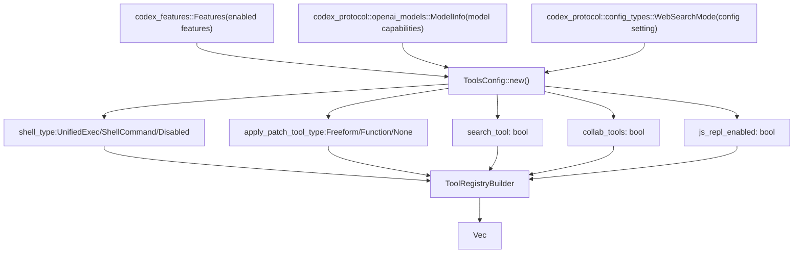
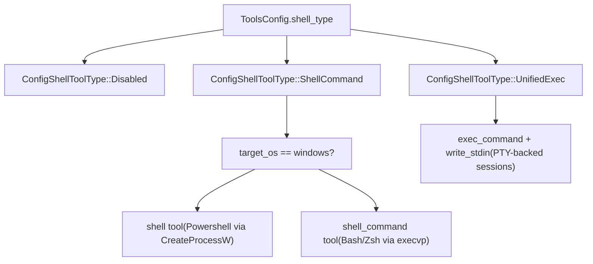

# 工具体系

相关源文件

-   [codex-rs/app-server/src/command\_exec.rs](https://github.com/openai/codex/blob/d807d44a/codex-rs/app-server/src/command_exec.rs)
-   [codex-rs/core/config.schema.json](https://github.com/openai/codex/blob/d807d44a/codex-rs/core/config.schema.json)
-   [codex-rs/core/src/config/agent\_roles.rs](https://github.com/openai/codex/blob/d807d44a/codex-rs/core/src/config/agent_roles.rs)
-   [codex-rs/core/src/config/config\_tests.rs](https://github.com/openai/codex/blob/d807d44a/codex-rs/core/src/config/config_tests.rs)
-   [codex-rs/core/src/config/edit.rs](https://github.com/openai/codex/blob/d807d44a/codex-rs/core/src/config/edit.rs)
-   [codex-rs/core/src/config/mod.rs](https://github.com/openai/codex/blob/d807d44a/codex-rs/core/src/config/mod.rs)
-   [codex-rs/core/src/config/profile.rs](https://github.com/openai/codex/blob/d807d44a/codex-rs/core/src/config/profile.rs)
-   [codex-rs/core/src/config/types.rs](https://github.com/openai/codex/blob/d807d44a/codex-rs/core/src/config/types.rs)
-   [codex-rs/core/src/exec.rs](https://github.com/openai/codex/blob/d807d44a/codex-rs/core/src/exec.rs)
-   [codex-rs/core/src/sandboxing/mod.rs](https://github.com/openai/codex/blob/d807d44a/codex-rs/core/src/sandboxing/mod.rs)
-   [codex-rs/core/src/tasks/user\_shell.rs](https://github.com/openai/codex/blob/d807d44a/codex-rs/core/src/tasks/user_shell.rs)
-   [codex-rs/core/src/tools/events.rs](https://github.com/openai/codex/blob/d807d44a/codex-rs/core/src/tools/events.rs)
-   [codex-rs/core/src/tools/handlers/mod.rs](https://github.com/openai/codex/blob/d807d44a/codex-rs/core/src/tools/handlers/mod.rs)
-   [codex-rs/core/src/tools/handlers/shell.rs](https://github.com/openai/codex/blob/d807d44a/codex-rs/core/src/tools/handlers/shell.rs)
-   [codex-rs/core/src/tools/handlers/unified\_exec.rs](https://github.com/openai/codex/blob/d807d44a/codex-rs/core/src/tools/handlers/unified_exec.rs)
-   [codex-rs/core/src/tools/orchestrator.rs](https://github.com/openai/codex/blob/d807d44a/codex-rs/core/src/tools/orchestrator.rs)
-   [codex-rs/core/src/tools/runtimes/apply\_patch.rs](https://github.com/openai/codex/blob/d807d44a/codex-rs/core/src/tools/runtimes/apply_patch.rs)
-   [codex-rs/core/src/tools/runtimes/mod.rs](https://github.com/openai/codex/blob/d807d44a/codex-rs/core/src/tools/runtimes/mod.rs)
-   [codex-rs/core/src/tools/runtimes/shell.rs](https://github.com/openai/codex/blob/d807d44a/codex-rs/core/src/tools/runtimes/shell.rs)
-   [codex-rs/core/src/tools/runtimes/unified\_exec.rs](https://github.com/openai/codex/blob/d807d44a/codex-rs/core/src/tools/runtimes/unified_exec.rs)
-   [codex-rs/core/src/tools/sandboxing.rs](https://github.com/openai/codex/blob/d807d44a/codex-rs/core/src/tools/sandboxing.rs)
-   [codex-rs/core/src/tools/spec.rs](https://github.com/openai/codex/blob/d807d44a/codex-rs/core/src/tools/spec.rs)
-   [codex-rs/core/src/tools/spec\_tests.rs](https://github.com/openai/codex/blob/d807d44a/codex-rs/core/src/tools/spec_tests.rs)
-   [codex-rs/core/src/unified\_exec/async\_watcher.rs](https://github.com/openai/codex/blob/d807d44a/codex-rs/core/src/unified_exec/async_watcher.rs)
-   [codex-rs/core/src/unified\_exec/errors.rs](https://github.com/openai/codex/blob/d807d44a/codex-rs/core/src/unified_exec/errors.rs)
-   [codex-rs/core/src/unified\_exec/mod.rs](https://github.com/openai/codex/blob/d807d44a/codex-rs/core/src/unified_exec/mod.rs)
-   [codex-rs/core/src/unified\_exec/process\_manager.rs](https://github.com/openai/codex/blob/d807d44a/codex-rs/core/src/unified_exec/process_manager.rs)
-   [codex-rs/core/tests/suite/exec.rs](https://github.com/openai/codex/blob/d807d44a/codex-rs/core/tests/suite/exec.rs)
-   [codex-rs/core/tests/suite/unified\_exec.rs](https://github.com/openai/codex/blob/d807d44a/codex-rs/core/tests/suite/unified_exec.rs)
-   [codex-rs/linux-sandbox/tests/suite/landlock.rs](https://github.com/openai/codex/blob/d807d44a/codex-rs/linux-sandbox/tests/suite/landlock.rs)
-   [docs/config.md](https://github.com/openai/codex/blob/d807d44a/docs/config.md?plain=1)
-   [docs/example-config.md](https://github.com/openai/codex/blob/d807d44a/docs/example-config.md?plain=1)
-   [docs/skills.md](https://github.com/openai/codex/blob/d807d44a/docs/skills.md?plain=1)
-   [docs/slash\_commands.md](https://github.com/openai/codex/blob/d807d44a/docs/slash_commands.md?plain=1)

## 目的与范围

工具系统负责管理模型在一次会话回合中可调用工具的注册、配置、编排与执行。它提供统一框架，用于：

-   基于功能开关和模型能力进行**工具注册与过滤**。
-   通过 JSON Schema 定义函数参数的**工具规格**。
-   包含审批工作流、沙箱选择和重试语义的**工具编排**。
-   通过多种后端执行工具（shell、unified exec、apply\_patch、MCP）的**工具执行**。
-   用于跟踪工具调用和输出流式传输的**事件发射**。

关于工具注册表细节，参见 [Tool Registry and Configuration](/openai/codex/5.1-tool-registry-and-configuration)。关于基于 PTY 的交互式进程系统细节，参见 [Unified Exec Process Management](/openai/codex/5.3-unified-exec-process-management)。

---

## 工具注册表与配置

`ToolRegistryBuilder` 与 `ToolRouter` 管理工具可用性的生命周期。`ToolsConfig` 结构体根据功能开关、模型能力与配置设置决定给定会话可用哪些工具。

**图：工具配置流**

来源： [codex-rs/core/src/tools/spec.rs36-122](https://github.com/openai/codex/blob/d807d44a/codex-rs/core/src/tools/spec.rs#L36-L122) [codex-rs/core/src/tools/spec.rs57-111](https://github.com/openai/codex/blob/d807d44a/codex-rs/core/src/tools/spec.rs#L57-L111)

### 功能开关控制

工具可用性由 `Feature` 枚举定义的功能开关严格控制。例如，`Feature::UnifiedExec` 启用 `exec_command` 和 `write_stdin` 工具，而 `Feature::ApplyPatchFreeform` 启用基于语法的 `apply_patch` 工具。

来源： [codex-rs/core/src/tools/spec.rs63-109](https://github.com/openai/codex/blob/d807d44a/codex-rs/core/src/tools/spec.rs#L63-L109) [codex-rs/core/src/config/mod.rs64-68](https://github.com/openai/codex/blob/d807d44a/codex-rs/core/src/config/mod.rs#L64-L68)

详情参见 [Tool Registry and Configuration](/openai/codex/5.1-tool-registry-and-configuration)。

---

## Shell 执行工具

Codex 支持多种 shell 执行后端。`ShellHandler` 与 `ShellCommandHandler` 管理非交互命令执行，通常使用用户默认 shell（例如 `zsh` 或 `bash`）。

**图：Shell 工具选择**

来源： [codex-rs/core/src/tools/spec.rs71-84](https://github.com/openai/codex/blob/d807d44a/codex-rs/core/src/tools/spec.rs#L71-L84) [codex-rs/core/src/tools/handlers/shell.rs41-49](https://github.com/openai/codex/blob/d807d44a/codex-rs/core/src/tools/handlers/shell.rs#L41-L49)

详情参见 [Shell Execution Tools](/openai/codex/5.2-shell-execution-tools)。

---

## Unified Exec 进程管理

`UnifiedExecProcessManager` 负责编排交互式 PTY（伪终端）会话。该系统允许模型通过 `exec_command` 启动进程，并随后通过 `write_stdin` 与其交互。

### 进程生命周期

-   **分配**：进程 ID 随机分配（1000-99999），或在测试中顺序分配。
-   **持久化**：进程保存在带 LRU 裁剪的 `ProcessStore` 中。
-   **流式输出**：后台 `streaming_output` 任务从 PTY 读取并发出 `ExecCommandOutputDeltaEvent` 消息。

来源： [codex-rs/core/src/unified\_exec/mod.rs118-161](https://github.com/openai/codex/blob/d807d44a/codex-rs/core/src/unified_exec/mod.rs#L118-L161) [codex-rs/core/src/unified\_exec/process\_manager.rs106-133](https://github.com/openai/codex/blob/d807d44a/codex-rs/core/src/unified_exec/process_manager.rs#L106-L133)

详情参见 [Unified Exec Process Management](/openai/codex/5.3-unified-exec-process-management)。

---

## Apply Patch 系统

`apply_patch` 系统是用于文件修改的专用工具。它同时支持结构化 JSON 格式与使用自定义语法的“freeform”格式。

-   **拦截**：系统可拦截嵌入 shell 脚本中的 `apply_patch` 调用，以提供更好的 UI 反馈和安全检查。
-   **校验**：补丁在应用前会被解析为 `HashMap<PathBuf, FileChange>`。

来源： [codex-rs/core/src/tools/handlers/apply\_patch.rs173-230](https://github.com/openai/codex/blob/d807d44a/codex-rs/core/src/tools/handlers/apply_patch.rs#L173-L230) [codex-rs/core/src/tools/handlers/apply\_patch.rs37-38](https://github.com/openai/codex/blob/d807d44a/codex-rs/core/src/tools/handlers/apply_patch.rs#L37-L38)

详情参见 [Apply Patch System](/openai/codex/5.4-apply-patch-system)。

---

## 工具编排与审批

`ToolOrchestrator` 集中处理工具安全逻辑。执行前，它会评估 `ExecApprovalRequirement`。

1.  **审批**：检查命令是否“已知安全”或匹配可信前缀规则。否则触发 `AskForApproval` 事件。
2.  **沙箱化**：选择合适沙箱（Landlock、Seatbelt 或 Windows Restricted Token）。
3.  **重试**：若命令因沙箱拒绝而失败，且策略允许，编排器可在无沙箱下重试。

来源： [codex-rs/core/src/tools/orchestrator.rs1-300](https://github.com/openai/codex/blob/d807d44a/codex-rs/core/src/tools/orchestrator.rs#L1-L300) [codex-rs/core/src/exec.rs101-114](https://github.com/openai/codex/blob/d807d44a/codex-rs/core/src/exec.rs#L101-L114)

详情参见 [Tool Orchestration and Approval](/openai/codex/5.5-tool-orchestration-and-approval)。

---

## 沙箱实现

Codex 实现了平台特定沙箱机制以保护宿主系统：

-   **Linux**：使用 `bubblewrap`（bwrap）或 `Landlock`。
-   **macOS**：使用 `Seatbelt` 配置。
-   **Windows**：使用 `Restricted Tokens` 和私有桌面（`Winsta0\Default`）。

来源： [codex-rs/core/src/exec.rs181-204](https://github.com/openai/codex/blob/d807d44a/codex-rs/core/src/exec.rs#L181-L204) [codex-rs/core/src/config/types.rs41-49](https://github.com/openai/codex/blob/d807d44a/codex-rs/core/src/config/types.rs#L41-L49)

详情参见 [Sandboxing Implementation](/openai/codex/5.6-sandboxing-implementation)。

---

## 工具事件发射与输出

工具执行遵循严格生命周期：`begin` -> `emit`（可选 deltas）-> `finish`。`ToolEmitter` 工厂模式保证不同工具类型的事件报告一致性。

| 阶段 | 事件类型 | 说明 |
| --- | --- | --- |
| **Begin** | `ExecCommandBegin` | 以解析后的参数发出命令启动信号。 |
| **Emit** | `ExecCommandOutputDelta` | 来自 PTY 的实时输出分片。 |
| **Finish** | `ExecCommandEnd` | 最终状态、退出码与聚合输出。 |

来源： [codex-rs/core/src/tools/events.rs52-62](https://github.com/openai/codex/blob/d807d44a/codex-rs/core/src/tools/events.rs#L52-L62) [codex-rs/core/src/tools/events.rs151-280](https://github.com/openai/codex/blob/d807d44a/codex-rs/core/src/tools/events.rs#L151-L280)

详情参见 [Tool Event Emission and Output](/openai/codex/5.7-tool-event-emission-and-output)。

---

## Skills 与 Plugins

工具系统可通过以下方式扩展：

-   **Skills**：在 `.codex/skills` 中发现，由 `SkillsManager` 管理。它们提供上下文注入与隐式工具建议。
-   **Plugins**：类似市场的系统，由 `PluginsManager` 安装外部工具并注入会话。

来源： [codex-rs/core/src/config/mod.rs19-23](https://github.com/openai/codex/blob/d807d44a/codex-rs/core/src/config/mod.rs#L19-L23) [codex-rs/core/src/config/types.rs166-182](https://github.com/openai/codex/blob/d807d44a/codex-rs/core/src/config/types.rs#L166-L182)

详情参见 [Skills System](/openai/codex/5.9-skills-system) 与 [Plugins System](/openai/codex/5.11-plugins-system)。
