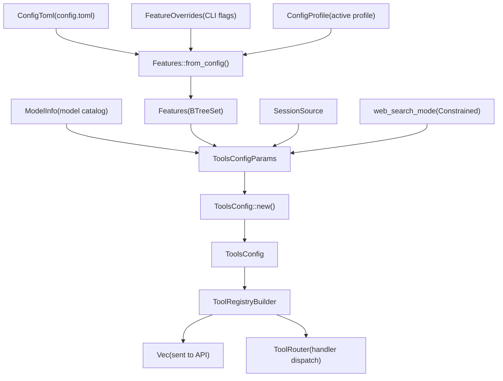
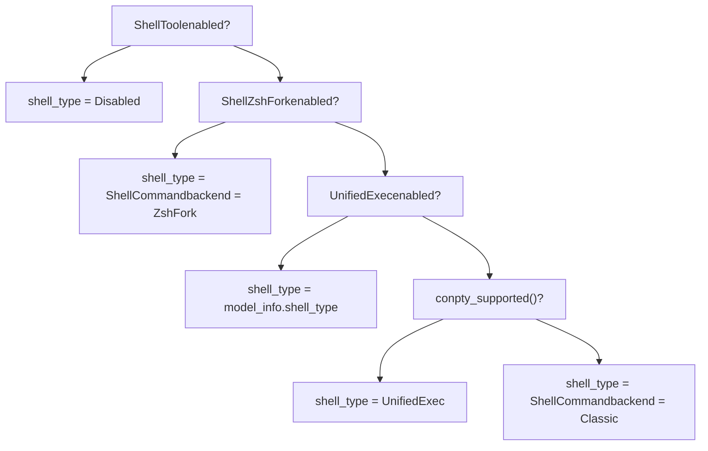
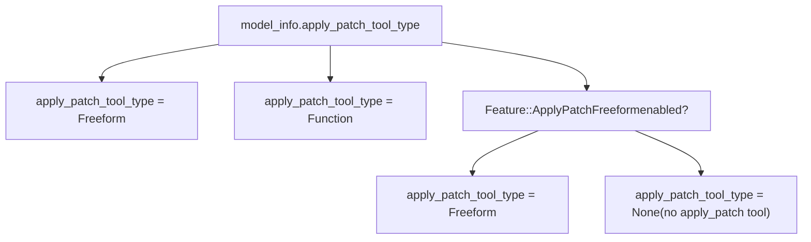
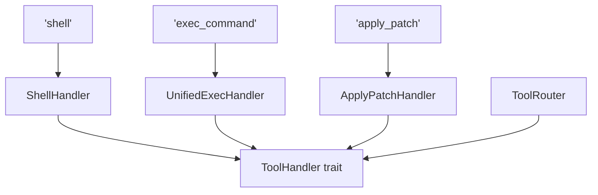

# 工具注册表与配置

相关源文件

-   [codex-rs/core/config.schema.json](https://github.com/openai/codex/blob/d807d44a/codex-rs/core/config.schema.json)
-   [codex-rs/core/src/apply\_patch.rs](https://github.com/openai/codex/blob/d807d44a/codex-rs/core/src/apply_patch.rs)
-   [codex-rs/core/src/config/agent\_roles.rs](https://github.com/openai/codex/blob/d807d44a/codex-rs/core/src/config/agent_roles.rs)
-   [codex-rs/core/src/config/config\_tests.rs](https://github.com/openai/codex/blob/d807d44a/codex-rs/core/src/config/config_tests.rs)
-   [codex-rs/core/src/config/edit.rs](https://github.com/openai/codex/blob/d807d44a/codex-rs/core/src/config/edit.rs)
-   [codex-rs/core/src/config/mod.rs](https://github.com/openai/codex/blob/d807d44a/codex-rs/core/src/config/mod.rs)
-   [codex-rs/core/src/config/profile.rs](https://github.com/openai/codex/blob/d807d44a/codex-rs/core/src/config/profile.rs)
-   [codex-rs/core/src/config/types.rs](https://github.com/openai/codex/blob/d807d44a/codex-rs/core/src/config/types.rs)
-   [codex-rs/core/src/safety.rs](https://github.com/openai/codex/blob/d807d44a/codex-rs/core/src/safety.rs)
-   [codex-rs/core/src/sandbox\_tags.rs](https://github.com/openai/codex/blob/d807d44a/codex-rs/core/src/sandbox_tags.rs)
-   [codex-rs/core/src/tools/context.rs](https://github.com/openai/codex/blob/d807d44a/codex-rs/core/src/tools/context.rs)
-   [codex-rs/core/src/tools/handlers/apply\_patch.rs](https://github.com/openai/codex/blob/d807d44a/codex-rs/core/src/tools/handlers/apply_patch.rs)
-   [codex-rs/core/src/tools/handlers/mcp.rs](https://github.com/openai/codex/blob/d807d44a/codex-rs/core/src/tools/handlers/mcp.rs)
-   [codex-rs/core/src/tools/handlers/mod.rs](https://github.com/openai/codex/blob/d807d44a/codex-rs/core/src/tools/handlers/mod.rs)
-   [codex-rs/core/src/tools/handlers/plan.rs](https://github.com/openai/codex/blob/d807d44a/codex-rs/core/src/tools/handlers/plan.rs)
-   [codex-rs/core/src/tools/parallel.rs](https://github.com/openai/codex/blob/d807d44a/codex-rs/core/src/tools/parallel.rs)
-   [codex-rs/core/src/tools/registry.rs](https://github.com/openai/codex/blob/d807d44a/codex-rs/core/src/tools/registry.rs)
-   [codex-rs/core/src/tools/router.rs](https://github.com/openai/codex/blob/d807d44a/codex-rs/core/src/tools/router.rs)
-   [codex-rs/core/src/tools/spec.rs](https://github.com/openai/codex/blob/d807d44a/codex-rs/core/src/tools/spec.rs)
-   [codex-rs/core/src/tools/spec\_tests.rs](https://github.com/openai/codex/blob/d807d44a/codex-rs/core/src/tools/spec_tests.rs)
-   [codex-rs/core/src/turn\_metadata.rs](https://github.com/openai/codex/blob/d807d44a/codex-rs/core/src/turn_metadata.rs)
-   [codex-rs/hooks/BUILD.bazel](https://github.com/openai/codex/blob/d807d44a/codex-rs/hooks/BUILD.bazel)
-   [codex-rs/hooks/Cargo.toml](https://github.com/openai/codex/blob/d807d44a/codex-rs/hooks/Cargo.toml)
-   [codex-rs/hooks/src/lib.rs](https://github.com/openai/codex/blob/d807d44a/codex-rs/hooks/src/lib.rs)
-   [codex-rs/hooks/src/registry.rs](https://github.com/openai/codex/blob/d807d44a/codex-rs/hooks/src/registry.rs)
-   [codex-rs/hooks/src/types.rs](https://github.com/openai/codex/blob/d807d44a/codex-rs/hooks/src/types.rs)
-   [codex-rs/hooks/src/user\_notification.rs](https://github.com/openai/codex/blob/d807d44a/codex-rs/hooks/src/user_notification.rs)
-   [docs/config.md](https://github.com/openai/codex/blob/d807d44a/docs/config.md?plain=1)
-   [docs/example-config.md](https://github.com/openai/codex/blob/d807d44a/docs/example-config.md?plain=1)
-   [docs/skills.md](https://github.com/openai/codex/blob/d807d44a/docs/skills.md?plain=1)
-   [docs/slash\_commands.md](https://github.com/openai/codex/blob/d807d44a/docs/slash_commands.md?plain=1)

本页说明 Codex 如何决定在给定会话中向模型提供哪些工具。内容涵盖 `ToolsConfig`、`ToolsConfigParams`、`Feature`/`Features` 系统、`ToolRegistryBuilder`、`ToolRouter` 以及 `ToolHandler` trait。

关于工具本身如何*执行*（shell、apply\_patch、unified exec 等），参见页面 [5.2](https://github.com/openai/codex/blob/d807d44a/5.2)–[5.8](https://github.com/openai/codex/blob/d807d44a/5.8) 关于 MCP 专用工具配置，参见 [6.1](https://github.com/openai/codex/blob/d807d44a/6.1) 和 [6.2](https://github.com/openai/codex/blob/d807d44a/6.2) 关于整体沙箱与审批系统，参见 [2.4](https://github.com/openai/codex/blob/d807d44a/2.4) 和 [5.5](https://github.com/openai/codex/blob/d807d44a/5.5) 关于在工具上下文之外使用的 `Features` 系统，参见 [2.3](https://github.com/openai/codex/blob/d807d44a/2.3)

---

## 概览

每个代理会话都会在第一次 API 请求之前计算一次工具集合。这个计算由三个输入驱动：

1.  **`ModelInfo`** — 由模型目录声明的能力（例如模型期望哪种 shell 工具类型、是否支持图像输入、是否内置 `apply_patch` 函数） \[codex-rs/core/src/tools/spec.rs:43-45\]。
2.  **`Features`** — 已启用特性标志的解析集合，来源于 `Config` + 活动 profile + CLI 覆盖项 \[codex-rs/core/src/config/mod.rs:64-68\]。
3.  **`SessionSource`** — 当前是顶层会话还是子代理（影响 agent-jobs worker 工具） \[codex-rs/core/src/tools/spec.rs:47-48\]。

这些输入会产出一个 `ToolsConfig` 值。`ToolsConfig` 被 `ToolRegistryBuilder` 消费，用于生成发送到模型 API 的 `ToolSpec` 值，以及一个 `ToolRouter`，后者会将传入的工具调用响应路由到处理器实现 \[codex-rs/core/src/tools/registry.rs:31-32\]。

**数据流——从配置到注册表**


来源: [codex-rs/core/src/tools/spec.rs48-162](https://github.com/openai/codex/blob/d807d44a/codex-rs/core/src/tools/spec.rs#L48-L162) [codex-rs/core/src/tools/registry.rs58-77](https://github.com/openai/codex/blob/d807d44a/codex-rs/core/src/tools/registry.rs#L58-L77)

---

## `ToolsConfig` 与 `ToolsConfigParams`

`ToolsConfig` 是单个会话的已解析工具配置。`ToolsConfigParams` 是传递给其构造函数的短生命周期输入包。

### `ToolsConfigParams`

\[codex-rs/core/src/tools/spec.rs:67-72\]

| 字段 | 类型 | 描述 |
| --- | --- | --- |
| `model_info` | `&ModelInfo` | 活动模型的模型目录条目 |
| `features` | `&Features` | 已解析的特性标志集合 |
| `web_search_mode` | `Option<WebSearchMode>` | 会话的生效 web 搜索模式 |
| `session_source` | `SessionSource` | 顶层与子代理上下文 |

### `ToolsConfig` 字段

\[codex-rs/core/src/tools/spec.rs:48-65\]

| 字段 | 类型 | 控制项 |
| --- | --- | --- |
| `shell_type` | `ConfigShellToolType` | 暴露哪种 shell 工具变体（`Disabled`, `ShellCommand`, `UnifiedExec`） |
| `shell_command_backend` | `ShellCommandBackendConfig` | shell 执行使用 `Classic` 或 `ZshFork` 后端 |
| `allow_login_shell` | `bool` | shell 工具 schema 中是否包含 `login` 参数 |
| `apply_patch_tool_type` | `Option<ApplyPatchToolType>` | `Freeform`、`Function` 或 `None`（无 apply\_patch 工具） |
| `web_search_mode` | `Option<WebSearchMode>` | 从参数透传 |
| `agent_roles` | `BTreeMap<String, AgentRoleConfig>` | 用于多代理子代理派生的角色 |
| `search_tool` | `bool` | BM25 搜索工具（`Feature::Apps` 开启时启用） |
| `request_permission_enabled` | `bool` | 模型是否可请求额外沙箱权限 |
| `js_repl_enabled` | `bool` | JavaScript REPL 工具 |
| `js_repl_tools_only` | `bool` | 强制所有工具调用经由 `js_repl` |
| `collab_tools` | `bool` | 多代理协作工具 |
| `presentation_artifact` | `bool` | 演示制品工具 |
| `default_mode_request_user_input` | `bool` | 在 Default 协作模式中允许 `request_user_input` |
| `experimental_supported_tools` | `Vec<String>` | 由模型目录声明的额外工具名称 |
| `agent_jobs_tools` | `bool` | 代理作业调度工具 |
| `agent_jobs_worker_tools` | `bool` | worker 侧作业工具（仅用于 `agent_job:` 子代理） |

来源: [codex-rs/core/src/tools/spec.rs48-162](https://github.com/openai/codex/blob/d807d44a/codex-rs/core/src/tools/spec.rs#L48-L162)

---

## 工具选择逻辑

### Shell 工具类型选择

`ToolsConfig::new()` 按优先级选择 `ConfigShellToolType` \[codex-rs/core/src/tools/spec.rs:93-113\]：

**Shell 类型决策逻辑**


来源: [codex-rs/core/src/tools/spec.rs93-113](https://github.com/openai/codex/blob/d807d44a/codex-rs/core/src/tools/spec.rs#L93-L113)

### `apply_patch` 工具选择

`ToolsConfig` 上的 `apply_patch_tool_type` 字段通过合并模型目录偏好与 `ApplyPatchFreeform` 特性标志来确定 \[codex-rs/core/src/tools/spec.rs:115-125\]：


来源: [codex-rs/core/src/tools/spec.rs115-125](https://github.com/openai/codex/blob/d807d44a/codex-rs/core/src/tools/spec.rs#L115-L125)

---

## `ToolRouter` 与 `ToolHandler`

### `ToolRouter`

`ToolRouter` 负责将工具调用分发到各自处理器 \[codex-rs/core/src/tools/router.rs:23\]。它管理并行执行锁，以确保不支持并发的工具串行执行 \[codex-rs/core/src/tools/parallel.rs:106-110\]。

### `ToolHandler` trait

处理器实现特定工具调用的执行逻辑。关键处理器包括：

| 处理器类 | 文件路径 | 工具名 |
| --- | --- | --- |
| `ShellHandler` | \[codex-rs/core/src/tools/handlers/mod.rs:54\] | `shell` |
| `ShellCommandHandler` | \[codex-rs/core/src/tools/handlers/mod.rs:53\] | `shell_command` |
| `UnifiedExecHandler` | \[codex-rs/core/src/tools/handlers/mod.rs:61\] | `exec_command`, `write_stdin` |
| `ApplyPatchHandler` | \[codex-rs/core/src/tools/handlers/mod.rs:36\] | `apply_patch` |
| `JsReplHandler` | \[codex-rs/core/src/tools/handlers/mod.rs:42\] | `js_repl` |
| `McpHandler` | \[codex-rs/core/src/tools/handlers/mod.rs:45\] | （来自 MCP 服务器的动态工具） |

**代码实体空间——处理器映射**


来源: [codex-rs/core/src/tools/handlers/mod.rs34-62](https://github.com/openai/codex/blob/d807d44a/codex-rs/core/src/tools/handlers/mod.rs#L34-L62) [codex-rs/core/src/tools/router.rs23](https://github.com/openai/codex/blob/d807d44a/codex-rs/core/src/tools/router.rs#L23-L23)

---

## `ToolSpec` —— 面向模型的工具定义

`ToolSpec` 是传递到 API 请求 `tools` 数组的类型。`spec.rs` 中的工厂函数会基于 `ToolsConfig` 生成这些定义 \[codex-rs/core/src/tools/spec.rs:31\]。

| 工厂函数 | 工具名 | 描述 |
| --- | --- | --- |
| `create_shell_tool` | `shell` | 标准 shell 执行工具 \[codex-rs/core/src/tools/spec.rs:10\]。 |
| `create_apply_patch_json_tool` | `apply_patch` | 基于 JSON 的补丁应用 \[codex-rs/core/src/tools/spec.rs:25\]。 |
| `create_apply_patch_freeform_tool` | `apply_patch` | 基于文本的补丁应用 \[codex-rs/core/src/tools/spec.rs:24\]。 |

当 `request_permission_enabled` 为 true 时，这些 schema 会包含诸如 `sandbox_permissions` 和 `justification` 等沙箱参数 \[codex-rs/core/src/tools/spec.rs:29\]。

来源: [codex-rs/core/src/tools/spec.rs1-50](https://github.com/openai/codex/blob/d807d44a/codex-rs/core/src/tools/spec.rs#L1-L50)

---

## 通过 `config.toml` 配置

工具行为在很大程度上受 `config.toml` 中的 `[mcp_servers]` 和 `[tools]` 表影响。

### MCP 服务器配置

用户可通过 `[mcp_servers]` 表定义外部工具提供方 \[codex-rs/core/src/config/types.rs:68\]。

```
[mcp_servers.my-server]command = "npx"args = ["-y", "@modelcontextprotocol/server-everything"]enabled = true
```
| 字段 | 类型 | 描述 |
| --- | --- | --- |
| `command` | `String` | 启动基于 stdio 的 MCP 服务器所用命令 \[codex-rs/core/src/config/types.rs:119\]。 |
| `args` | `Vec<String>` | 命令参数 \[codex-rs/core/src/config/types.rs:121\]。 |
| `enabled_tools` | `Vec<String>` | 允许注册的工具白名单 \[codex-rs/core/src/config/types.rs:98\]。 |
| `disabled_tools` | `Vec<String>` | 要忽略工具的拒绝名单 \[codex-rs/core/src/config/types.rs:102\]。 |

来源: [codex-rs/core/src/config/types.rs68-157](https://github.com/openai/codex/blob/d807d44a/codex-rs/core/src/config/types.rs#L68-L157) [codex-rs/core/src/config/edit.rs48](https://github.com/openai/codex/blob/d807d44a/codex-rs/core/src/config/edit.rs#L48-L48)
