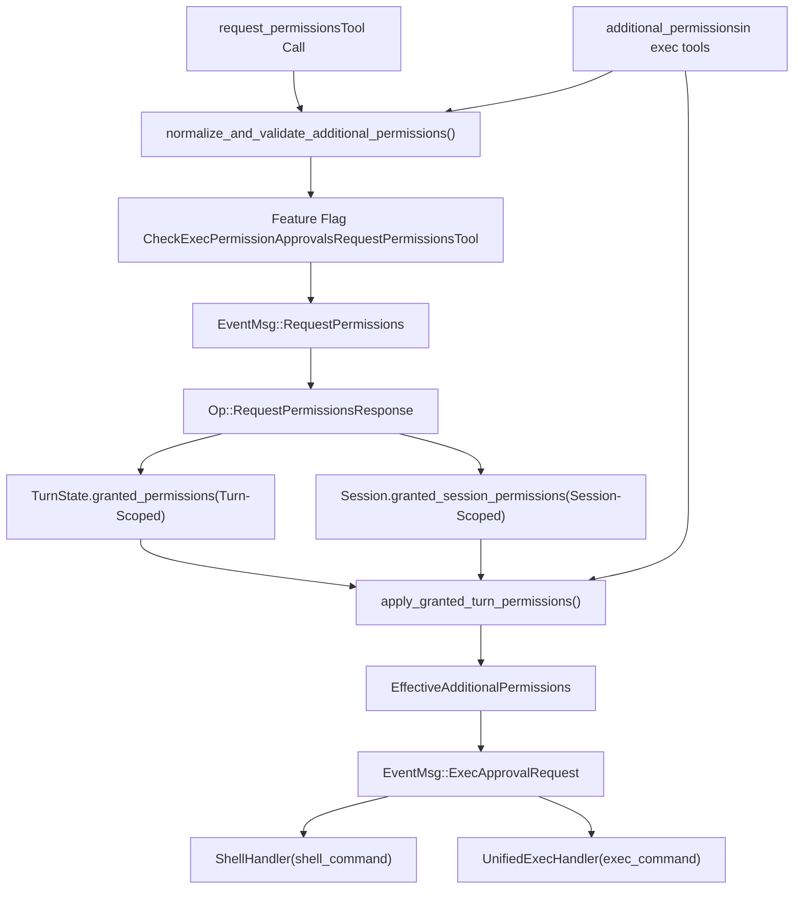
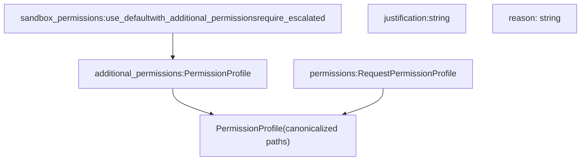
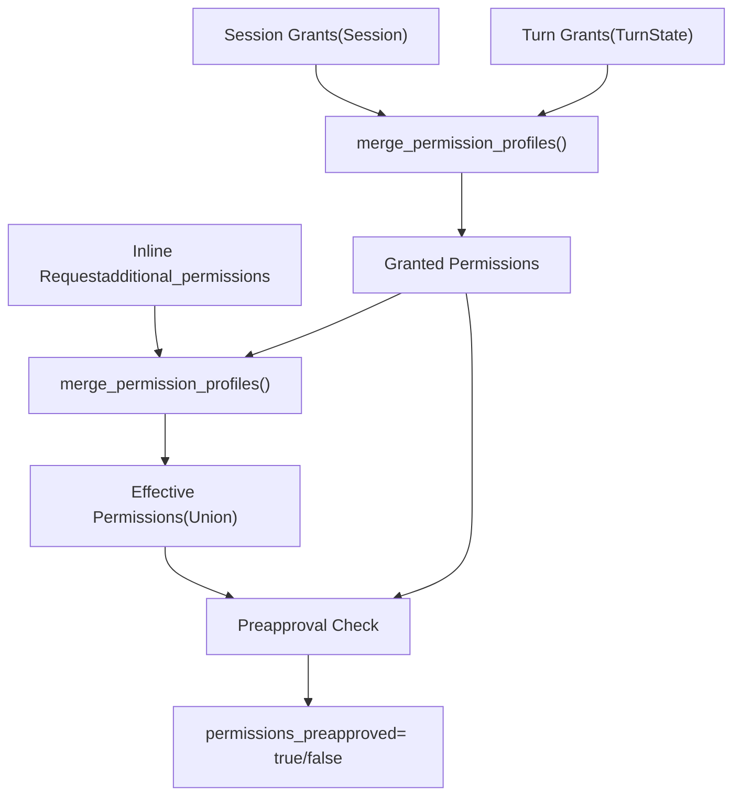

# 权限请求系统

相关源文件

-   [codex-rs/core/config.schema.json](https://github.com/openai/codex/blob/d807d44a/codex-rs/core/config.schema.json)
-   [codex-rs/core/src/config/agent\_roles.rs](https://github.com/openai/codex/blob/d807d44a/codex-rs/core/src/config/agent_roles.rs)
-   [codex-rs/core/src/config/config\_tests.rs](https://github.com/openai/codex/blob/d807d44a/codex-rs/core/src/config/config_tests.rs)
-   [codex-rs/core/src/config/edit.rs](https://github.com/openai/codex/blob/d807d44a/codex-rs/core/src/config/edit.rs)
-   [codex-rs/core/src/config/mod.rs](https://github.com/openai/codex/blob/d807d44a/codex-rs/core/src/config/mod.rs)
-   [codex-rs/core/src/config/profile.rs](https://github.com/openai/codex/blob/d807d44a/codex-rs/core/src/config/profile.rs)
-   [codex-rs/core/src/config/types.rs](https://github.com/openai/codex/blob/d807d44a/codex-rs/core/src/config/types.rs)
-   [codex-rs/core/src/exec\_policy.rs](https://github.com/openai/codex/blob/d807d44a/codex-rs/core/src/exec_policy.rs)
-   [codex-rs/core/src/exec\_policy\_tests.rs](https://github.com/openai/codex/blob/d807d44a/codex-rs/core/src/exec_policy_tests.rs)
-   [codex-rs/core/src/tasks/review.rs](https://github.com/openai/codex/blob/d807d44a/codex-rs/core/src/tasks/review.rs)
-   [codex-rs/core/src/tools/handlers/mod.rs](https://github.com/openai/codex/blob/d807d44a/codex-rs/core/src/tools/handlers/mod.rs)
-   [codex-rs/core/src/tools/spec.rs](https://github.com/openai/codex/blob/d807d44a/codex-rs/core/src/tools/spec.rs)
-   [codex-rs/core/src/tools/spec\_tests.rs](https://github.com/openai/codex/blob/d807d44a/codex-rs/core/src/tools/spec_tests.rs)
-   [codex-rs/core/tests/suite/approvals.rs](https://github.com/openai/codex/blob/d807d44a/codex-rs/core/tests/suite/approvals.rs)
-   [codex-rs/core/tests/suite/codex\_delegate.rs](https://github.com/openai/codex/blob/d807d44a/codex-rs/core/tests/suite/codex_delegate.rs)
-   [codex-rs/core/tests/suite/otel.rs](https://github.com/openai/codex/blob/d807d44a/codex-rs/core/tests/suite/otel.rs)
-   [codex-rs/core/tests/suite/review.rs](https://github.com/openai/codex/blob/d807d44a/codex-rs/core/tests/suite/review.rs)
-   [docs/config.md](https://github.com/openai/codex/blob/d807d44a/docs/config.md?plain=1)
-   [docs/example-config.md](https://github.com/openai/codex/blob/d807d44a/docs/example-config.md?plain=1)
-   [docs/skills.md](https://github.com/openai/codex/blob/d807d44a/docs/skills.md?plain=1)
-   [docs/slash\_commands.md](https://github.com/openai/codex/blob/d807d44a/docs/slash_commands.md?plain=1)

权限请求系统使 AI 代理能够在执行期间动态请求额外的沙箱权限（文件系统、网络、macOS 特定权限）。该系统通过显式用户批准，在基础 `SandboxPolicy` 之外实现受控权限提升，并且授予可在单轮或整个会话内持续生效。

关于基础沙箱策略与强制机制的信息，参见 [Sandbox and Approval Policies (2.4)](https://github.com/openai/codex/blob/d807d44a/Sandbox and Approval Policies (2.4))；关于工具执行编排与审批工作流，参见 [Tool Orchestration and Approval (5.5)](https://github.com/openai/codex/blob/d807d44a/Tool Orchestration and Approval (5.5))

---

## 概览

权限请求系统通过两种不同机制运行：

1.  **独立 `request_permissions` 工具**：在执行前显式请求权限。
2.  **内联 `additional_permissions` 字段**：在 exec 工具调用（`shell_command`、`exec_command`）时一并请求权限。

两种机制都会产生标准化的 `PermissionProfile` 结构，并可存储为轮次级或会话级授权。这些授权支持“粘性权限”模式，使后续工具调用可自动继承先前已批准权限，而无需反复提示用户。

**Sources:** [codex-rs/core/src/tools/spec.rs461-523](https://github.com/openai/codex/blob/d807d44a/codex-rs/core/src/tools/spec.rs#L461-L523) [codex-rs/core/src/tools/handlers/mod.rs102-229](https://github.com/openai/codex/blob/d807d44a/codex-rs/core/src/tools/handlers/mod.rs#L102-L229)

---

## 系统架构

### 权限数据流与组件

**Sources:** [codex-rs/core/src/tools/handlers/mod.rs102-229](https://github.com/openai/codex/blob/d807d44a/codex-rs/core/src/tools/handlers/mod.rs#L102-L229) [codex-rs/core/src/tools/spec.rs31-49](https://github.com/openai/codex/blob/d807d44a/codex-rs/core/src/tools/spec.rs#L31-L49) [codex-rs/core/src/config/mod.rs100-130](https://github.com/openai/codex/blob/d807d44a/codex-rs/core/src/config/mod.rs#L100-L130)

---

## 权限 Schema 定义

### 请求权限配置结构

模型用于指定所请求访问级别的结构定义在工具注册表中。

| Field | Type | Description |
| --- | --- | --- |
| `file_system` | `FileSystemPermissions` | 用于沙箱提升的读/写路径数组 |
| `network` | `NetworkPermissions` | 启用网络访问的布尔标志 |
| `macos` | `MacOSPermissions` | macOS Seatbelt 配置的特定授权 |

### 工具 Schema 集成

`create_approval_parameters()` 函数会根据 `exec_permission_approvals_enabled` 特性标志，有条件地包含 `additional_permissions` 字段 [codex-rs/core/src/tools/spec.rs525-576](https://github.com/openai/codex/blob/d807d44a/codex-rs/core/src/tools/spec.rs#L525-L576) `create_request_permissions_schema()` 函数定义独立工具 schema [codex-rs/core/src/tools/spec.rs511-523](https://github.com/openai/codex/blob/d807d44a/codex-rs/core/src/tools/spec.rs#L511-L523)

**Sources:** [codex-rs/core/src/tools/spec.rs461-659](https://github.com/openai/codex/blob/d807d44a/codex-rs/core/src/tools/spec.rs#L461-L659) [codex-rs/core/src/config/mod.rs84-86](https://github.com/openai/codex/blob/d807d44a/codex-rs/core/src/config/mod.rs#L84-L86)

---

## 权限请求方法

### 独立 `request_permissions` 工具

代理可以主动请求权限。这会发出 `EventMsg::RequestPermissions` 事件并等待 `Op::RequestPermissionsResponse`。用户可以为当前轮次或整个会话授予这些权限。

### 内联 `additional_permissions`

当 `sandbox_permissions` 设为 `"with_additional_permissions"` 时，exec 工具（`shell_command`、`exec_command`）可接收内联 `additional_permissions` 字段。这会以合并后的权限触发标准 `ExecApprovalRequest` 流程。

**Sources:** [codex-rs/core/src/tools/spec.rs461-576](https://github.com/openai/codex/blob/d807d44a/codex-rs/core/src/tools/spec.rs#L461-L576) [codex-rs/core/src/tools/handlers/mod.rs102-159](https://github.com/openai/codex/blob/d807d44a/codex-rs/core/src/tools/handlers/mod.rs#L102-L159)

---

## 校验与规范化

`normalize_and_validate_additional_permissions()` 函数执行若干关键检查：

1.  **特性校验**：确保已启用 `Feature::ExecPermissionApprovals` [codex-rs/core/src/tools/handlers/mod.rs102-110](https://github.com/openai/codex/blob/d807d44a/codex-rs/core/src/tools/handlers/mod.rs#L102-L110)
2.  **策略校验**：确认新请求配置了 `AskForApproval::OnRequest` [codex-rs/core/src/tools/handlers/mod.rs115-125](https://github.com/openai/codex/blob/d807d44a/codex-rs/core/src/tools/handlers/mod.rs#L115-L125)
3.  **路径规范化**：相对工具 `workdir` 解析相对路径并将其规范化 [codex-rs/core/src/tools/handlers/mod.rs130-145](https://github.com/openai/codex/blob/d807d44a/codex-rs/core/src/tools/handlers/mod.rs#L130-L145)
4.  **空请求检查**：拒绝不包含实际权限变化的请求 [codex-rs/core/src/tools/handlers/mod.rs150-159](https://github.com/openai/codex/blob/d807d44a/codex-rs/core/src/tools/handlers/mod.rs#L150-L159)

**Sources:** [codex-rs/core/src/tools/handlers/mod.rs102-159](https://github.com/openai/codex/blob/d807d44a/codex-rs/core/src/tools/handlers/mod.rs#L102-L159) [codex-rs/core/src/config/mod.rs100-101](https://github.com/openai/codex/blob/d807d44a/codex-rs/core/src/config/mod.rs#L100-L101)

---

## 授权作用域与持久化

| Scope | Storage Location | Access Method | Lifecycle |
| --- | --- | --- | --- |
| **Turn** | `TurnState.granted_permissions` | `Session::granted_turn_permissions()` | 在 `TurnComplete` 时清除 |
| **Session** | `Session.granted_session_permissions` | `Session::granted_session_permissions()` | 跨轮次持久化，直到会话结束 |

`apply_granted_turn_permissions()` 函数通过将内联请求与现有轮次/会话授权合并，实现“粘性权限”模式 [codex-rs/core/src/tools/handlers/mod.rs184-229](https://github.com/openai/codex/blob/d807d44a/codex-rs/core/src/tools/handlers/mod.rs#L184-L229)

### 粘性权限合并逻辑

若请求的 `EffectivePerms` 已被 `Granted` 权限并集覆盖，则 `permissions_preapproved` 被设为 `true`，且不会再次提示用户 [codex-rs/core/src/tools/handlers/mod.rs210-225](https://github.com/openai/codex/blob/d807d44a/codex-rs/core/src/tools/handlers/mod.rs#L210-L225)

**Sources:** [codex-rs/core/src/tools/handlers/mod.rs167-229](https://github.com/openai/codex/blob/d807d44a/codex-rs/core/src/tools/handlers/mod.rs#L167-L229) [codex-rs/core/src/config/mod.rs128-130](https://github.com/openai/codex/blob/d807d44a/codex-rs/core/src/config/mod.rs#L128-L130)

---

## 审批策略与 Guardian

系统与配置中定义的 `AskForApproval` 策略集成。

-   **细粒度策略**：包含 `request_permissions` 标志。若为 `false`，工具将自动拒绝且不提示用户 [codex-rs/core/src/exec\_policy.rs130-153](https://github.com/openai/codex/blob/d807d44a/codex-rs/core/src/exec_policy.rs#L130-L153)
-   **Guardian 集成**：可使用 `guardian_subagent`（通过 `ApprovalsReviewer` 配置）基于风险自动评估权限请求 [codex-rs/core/src/config/mod.rs131-133](https://github.com/openai/codex/blob/d807d44a/codex-rs/core/src/config/mod.rs#L131-L133)

**Sources:** [codex-rs/core/src/exec\_policy.rs130-153](https://github.com/openai/codex/blob/d807d44a/codex-rs/core/src/exec_policy.rs#L130-L153) [codex-rs/core/src/config/mod.rs131-133](https://github.com/openai/codex/blob/d807d44a/codex-rs/core/src/config/mod.rs#L131-L133) [codex-rs/core/src/tasks/review.rs107-109](https://github.com/openai/codex/blob/d807d44a/codex-rs/core/src/tasks/review.rs#L107-L109)
