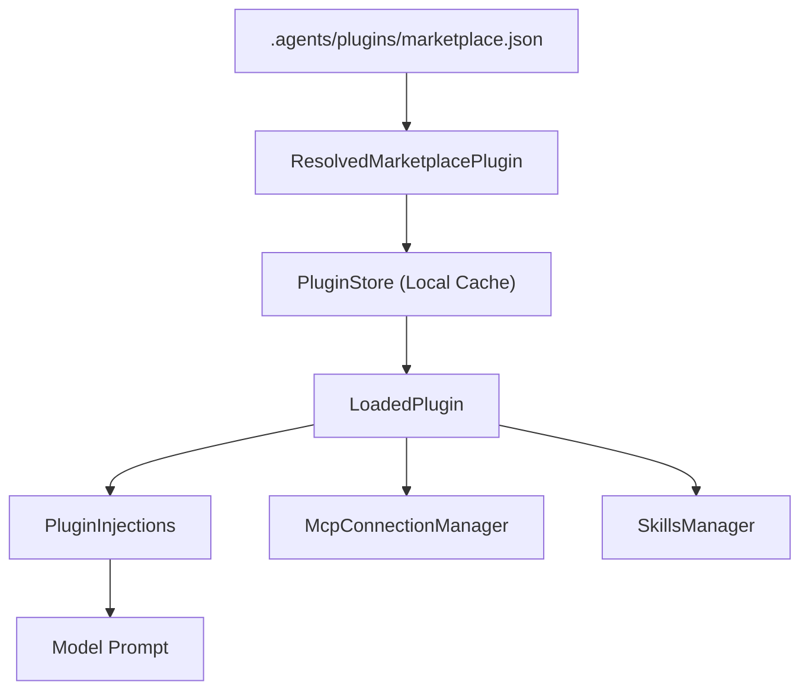

# 插件系统

相关源文件

-   [codex-rs/app-server-protocol/schema/json/v2/PluginInstallResponse.json](https://github.com/openai/codex/blob/d807d44a/codex-rs/app-server-protocol/schema/json/v2/PluginInstallResponse.json)
-   [codex-rs/app-server-protocol/schema/json/v2/PluginListResponse.json](https://github.com/openai/codex/blob/d807d44a/codex-rs/app-server-protocol/schema/json/v2/PluginListResponse.json)
-   [codex-rs/app-server-protocol/schema/json/v2/PluginReadResponse.json](https://github.com/openai/codex/blob/d807d44a/codex-rs/app-server-protocol/schema/json/v2/PluginReadResponse.json)
-   [codex-rs/app-server-protocol/schema/typescript/v2/AppSummary.ts](https://github.com/openai/codex/blob/d807d44a/codex-rs/app-server-protocol/schema/typescript/v2/AppSummary.ts)
-   [codex-rs/app-server-protocol/schema/typescript/v2/PluginInstallResponse.ts](https://github.com/openai/codex/blob/d807d44a/codex-rs/app-server-protocol/schema/typescript/v2/PluginInstallResponse.ts)
-   [codex-rs/app-server/src/codex\_message\_processor/plugin\_app\_helpers.rs](https://github.com/openai/codex/blob/d807d44a/codex-rs/app-server/src/codex_message_processor/plugin_app_helpers.rs)
-   [codex-rs/app-server/tests/suite/v2/app\_list.rs](https://github.com/openai/codex/blob/d807d44a/codex-rs/app-server/tests/suite/v2/app_list.rs)
-   [codex-rs/app-server/tests/suite/v2/plugin\_install.rs](https://github.com/openai/codex/blob/d807d44a/codex-rs/app-server/tests/suite/v2/plugin_install.rs)
-   [codex-rs/app-server/tests/suite/v2/plugin\_list.rs](https://github.com/openai/codex/blob/d807d44a/codex-rs/app-server/tests/suite/v2/plugin_list.rs)
-   [codex-rs/app-server/tests/suite/v2/plugin\_read.rs](https://github.com/openai/codex/blob/d807d44a/codex-rs/app-server/tests/suite/v2/plugin_read.rs)
-   [codex-rs/chatgpt/src/connectors.rs](https://github.com/openai/codex/blob/d807d44a/codex-rs/chatgpt/src/connectors.rs)
-   [codex-rs/core/src/apps/render.rs](https://github.com/openai/codex/blob/d807d44a/codex-rs/core/src/apps/render.rs)
-   [codex-rs/core/src/arc\_monitor.rs](https://github.com/openai/codex/blob/d807d44a/codex-rs/core/src/arc_monitor.rs)
-   [codex-rs/core/src/arc\_monitor\_tests.rs](https://github.com/openai/codex/blob/d807d44a/codex-rs/core/src/arc_monitor_tests.rs)
-   [codex-rs/core/src/connectors.rs](https://github.com/openai/codex/blob/d807d44a/codex-rs/core/src/connectors.rs)
-   [codex-rs/core/src/connectors\_tests.rs](https://github.com/openai/codex/blob/d807d44a/codex-rs/core/src/connectors_tests.rs)
-   [codex-rs/core/src/consequential\_tool\_message\_templates.json](https://github.com/openai/codex/blob/d807d44a/codex-rs/core/src/consequential_tool_message_templates.json)
-   [codex-rs/core/src/mcp/mod.rs](https://github.com/openai/codex/blob/d807d44a/codex-rs/core/src/mcp/mod.rs)
-   [codex-rs/core/src/mcp/mod\_tests.rs](https://github.com/openai/codex/blob/d807d44a/codex-rs/core/src/mcp/mod_tests.rs)
-   [codex-rs/core/src/mcp\_tool\_approval\_templates.rs](https://github.com/openai/codex/blob/d807d44a/codex-rs/core/src/mcp_tool_approval_templates.rs)
-   [codex-rs/core/src/mcp\_tool\_call.rs](https://github.com/openai/codex/blob/d807d44a/codex-rs/core/src/mcp_tool_call.rs)
-   [codex-rs/core/src/mcp\_tool\_call\_tests.rs](https://github.com/openai/codex/blob/d807d44a/codex-rs/core/src/mcp_tool_call_tests.rs)
-   [codex-rs/core/src/plugins/discoverable.rs](https://github.com/openai/codex/blob/d807d44a/codex-rs/core/src/plugins/discoverable.rs)
-   [codex-rs/core/src/plugins/discoverable\_tests.rs](https://github.com/openai/codex/blob/d807d44a/codex-rs/core/src/plugins/discoverable_tests.rs)
-   [codex-rs/core/src/plugins/manager.rs](https://github.com/openai/codex/blob/d807d44a/codex-rs/core/src/plugins/manager.rs)
-   [codex-rs/core/src/plugins/manager\_tests.rs](https://github.com/openai/codex/blob/d807d44a/codex-rs/core/src/plugins/manager_tests.rs)
-   [codex-rs/core/src/plugins/marketplace.rs](https://github.com/openai/codex/blob/d807d44a/codex-rs/core/src/plugins/marketplace.rs)
-   [codex-rs/core/src/plugins/marketplace\_tests.rs](https://github.com/openai/codex/blob/d807d44a/codex-rs/core/src/plugins/marketplace_tests.rs)
-   [codex-rs/core/src/plugins/mod.rs](https://github.com/openai/codex/blob/d807d44a/codex-rs/core/src/plugins/mod.rs)
-   [codex-rs/core/src/plugins/render.rs](https://github.com/openai/codex/blob/d807d44a/codex-rs/core/src/plugins/render.rs)
-   [codex-rs/core/src/plugins/render\_tests.rs](https://github.com/openai/codex/blob/d807d44a/codex-rs/core/src/plugins/render_tests.rs)
-   [codex-rs/core/src/tools/discoverable.rs](https://github.com/openai/codex/blob/d807d44a/codex-rs/core/src/tools/discoverable.rs)
-   [codex-rs/core/src/tools/handlers/tool\_suggest.rs](https://github.com/openai/codex/blob/d807d44a/codex-rs/core/src/tools/handlers/tool_suggest.rs)
-   [codex-rs/core/src/turn\_metadata\_tests.rs](https://github.com/openai/codex/blob/d807d44a/codex-rs/core/src/turn_metadata_tests.rs)
-   [codex-rs/core/templates/search\_tool/tool\_description.md](https://github.com/openai/codex/blob/d807d44a/codex-rs/core/templates/search_tool/tool_description.md?plain=1)
-   [codex-rs/core/tests/common/apps\_test\_server.rs](https://github.com/openai/codex/blob/d807d44a/codex-rs/core/tests/common/apps_test_server.rs)
-   [codex-rs/core/tests/suite/plugins.rs](https://github.com/openai/codex/blob/d807d44a/codex-rs/core/tests/suite/plugins.rs)
-   [codex-rs/core/tests/suite/search\_tool.rs](https://github.com/openai/codex/blob/d807d44a/codex-rs/core/tests/suite/search_tool.rs)
-   [codex-rs/tui/src/bottom\_pane/mcp\_server\_elicitation.rs](https://github.com/openai/codex/blob/d807d44a/codex-rs/tui/src/bottom_pane/mcp_server_elicitation.rs)
-   [codex-rs/tui/src/bottom\_pane/snapshots/codex\_tui\_\_bottom\_pane\_\_mcp\_server\_elicitation\_\_tests\_\_mcp\_server\_elicitation\_approval\_form\_with\_param\_summary.snap](https://github.com/openai/codex/blob/d807d44a/codex-rs/tui/src/bottom_pane/snapshots/codex_tui__bottom_pane__mcp_server_elicitation__tests__mcp_server_elicitation_approval_form_with_param_summary.snap)
-   [codex-rs/tui/src/bottom\_pane/snapshots/codex\_tui\_\_bottom\_pane\_\_mcp\_server\_elicitation\_\_tests\_\_mcp\_server\_elicitation\_approval\_form\_with\_session\_persist.snap](https://github.com/openai/codex/blob/d807d44a/codex-rs/tui/src/bottom_pane/snapshots/codex_tui__bottom_pane__mcp_server_elicitation__tests__mcp_server_elicitation_approval_form_with_session_persist.snap)
-   [codex-rs/tui/src/bottom\_pane/snapshots/codex\_tui\_\_bottom\_pane\_\_mcp\_server\_elicitation\_\_tests\_\_mcp\_server\_elicitation\_approval\_form\_without\_schema.snap](https://github.com/openai/codex/blob/d807d44a/codex-rs/tui/src/bottom_pane/snapshots/codex_tui__bottom_pane__mcp_server_elicitation__tests__mcp_server_elicitation_approval_form_without_schema.snap)

插件系统为 Codex 提供可扩展框架，允许发现、安装和执行第三方能力。插件可打包多个实体，包括 **Skills**（自然语言指令）、**MCP Servers**（外部工具提供方）和 **App Connectors**（与 Web 服务的集成）[codex-rs/core/src/plugins/manager.rs145-157](https://github.com/openai/codex/blob/d807d44a/codex-rs/core/src/plugins/manager.rs#L145-L157)

## 概览与 Marketplace

插件通过 **Marketplaces** 分发，其定义由 `marketplace.json` 清单文件给出 [codex-rs/core/src/plugins/marketplace.rs19-34](https://github.com/openai/codex/blob/d807d44a/codex-rs/core/src/plugins/marketplace.rs#L19-L34) Codex 内置了 “OpenAI Curated” marketplace，但也可以从仓库的 `.agents/plugins/` 目录加载本地 marketplaces [codex-rs/core/src/plugins/marketplace.rs19-34](https://github.com/openai/codex/blob/d807d44a/codex-rs/core/src/plugins/marketplace.rs#L19-L34) [codex-rs/core/src/plugins/manager.rs71](https://github.com/openai/codex/blob/d807d44a/codex-rs/core/src/plugins/manager.rs#L71-L71)

### 插件生命周期数据流

下图展示了插件如何从 marketplace 定义进入活动会话注入流程。

**插件激活流程**

Sources: [codex-rs/core/src/plugins/marketplace.rs146-150](https://github.com/openai/codex/blob/d807d44a/codex-rs/core/src/plugins/marketplace.rs#L146-L150) [codex-rs/core/src/plugins/manager.rs32-42](https://github.com/openai/codex/blob/d807d44a/codex-rs/core/src/plugins/manager.rs#L32-L42) [codex-rs/core/src/plugins/injection.rs15](https://github.com/openai/codex/blob/d807d44a/codex-rs/core/src/plugins/injection.rs#L15-L15) [codex-rs/core/src/plugins/mod.rs15-33](https://github.com/openai/codex/blob/d807d44a/codex-rs/core/src/plugins/mod.rs#L15-L33)

## PluginsManager

`PluginsManager` 是插件操作的中央协调器。它负责发现 marketplace、将插件安装到本地缓存，并将插件配置加载到系统状态 [codex-rs/core/src/plugins/manager.rs32-63](https://github.com/openai/codex/blob/d807d44a/codex-rs/core/src/plugins/manager.rs#L32-L63)

### 关键结构

| Struct | Description |
| --- | --- |
| `LoadedPlugin` | 表示一个已经通过校验并从磁盘加载的插件，包含其 skills、MCP servers 与 apps [codex-rs/core/src/plugins/manager.rs179-189](https://github.com/openai/codex/blob/d807d44a/codex-rs/core/src/plugins/manager.rs#L179-L189) |
| `PluginCapabilitySummary` | 插件提供能力的高层摘要，用于遥测和 UI 展示 [codex-rs/core/src/plugins/manager.rs198-205](https://github.com/openai/codex/blob/d807d44a/codex-rs/core/src/plugins/manager.rs#L198-L205) |
| `PluginInstallRequest` | 包含插件名称和 marketplace 清单的绝对路径 [codex-rs/core/src/plugins/manager.rs118-121](https://github.com/openai/codex/blob/d807d44a/codex-rs/core/src/plugins/manager.rs#L118-L121) |

Sources: [codex-rs/core/src/plugins/manager.rs118-205](https://github.com/openai/codex/blob/d807d44a/codex-rs/core/src/plugins/manager.rs#L118-L205)

## 插件安装与存储

插件会安装到本地缓存目录（通常为 `~/.codex/plugins/cache/`）[codex-rs/core/src/plugins/manager\_tests.rs89-90](https://github.com/openai/codex/blob/d807d44a/codex-rs/core/src/plugins/manager_tests.rs#L89-L90)

1.  **解析**：系统读取 `marketplace.json` 以找到 `MarketplacePluginSource`（当前支持 `Local` 路径）[codex-rs/core/src/plugins/marketplace.rs50-52](https://github.com/openai/codex/blob/d807d44a/codex-rs/core/src/plugins/marketplace.rs#L50-L52)
2.  **校验**：检查 `MarketplacePluginPolicy`，确保插件对当前 `Product` 可用（如 CHATGPT 与 ATLAS）[codex-rs/core/src/plugins/marketplace.rs55-61](https://github.com/openai/codex/blob/d807d44a/codex-rs/core/src/plugins/marketplace.rs#L55-L61)
3.  **持久化**：`PluginStore` 管理磁盘上的物理文件与版本 [codex-rs/core/src/plugins/manager.rs26](https://github.com/openai/codex/blob/d807d44a/codex-rs/core/src/plugins/manager.rs#L26-L26)
4.  **配置**：安装后，插件会在用户 `config.toml` 的 `[plugins]` 表下启用 [codex-rs/core/src/plugins/manager\_tests.rs54-56](https://github.com/openai/codex/blob/d807d44a/codex-rs/core/src/plugins/manager_tests.rs#L54-L56)

Sources: [codex-rs/core/src/plugins/marketplace.rs50-61](https://github.com/openai/codex/blob/d807d44a/codex-rs/core/src/plugins/marketplace.rs#L50-L61) [codex-rs/core/src/plugins/manager\_tests.rs54-90](https://github.com/openai/codex/blob/d807d44a/codex-rs/core/src/plugins/manager_tests.rs#L54-L90)

## 会话工具注入

当 `Session` 启动时，`PluginsManager` 会将 `LoadedPlugin` 集合提供给 `McpManager` 和 `SkillsManager`。

### 工具与技能聚合

插件通过三种方式向会话贡献能力：

1.  **Skills**：插件 `skills/` 目录中的 Markdown 文件会作为自然语言指令加载 [codex-rs/core/src/plugins/manager.rs68](https://github.com/openai/codex/blob/d807d44a/codex-rs/core/src/plugins/manager.rs#L68-L68) [codex-rs/core/src/plugins/manager\_tests.rs100-102](https://github.com/openai/codex/blob/d807d44a/codex-rs/core/src/plugins/manager_tests.rs#L100-L102)
2.  **MCP Servers**：定义在 `.mcp.json` 中，并注册到 `McpConnectionManager`。工具名会添加前缀以避免冲突（例如 `mcp__<server>__<tool>`）[codex-rs/core/src/mcp/mod.rs31-33](https://github.com/openai/codex/blob/d807d44a/codex-rs/core/src/mcp/mod.rs#L31-L33) [codex-rs/core/src/plugins/manager\_tests.rs103-116](https://github.com/openai/codex/blob/d807d44a/codex-rs/core/src/plugins/manager_tests.rs#L103-L116)
3.  **App Connectors**：定义在 `.app.json` 中，使代理可使用 “Codex Apps”（受管远程工具）[codex-rs/core/src/plugins/manager.rs70](https://github.com/openai/codex/blob/d807d44a/codex-rs/core/src/plugins/manager.rs#L70-L70) [codex-rs/core/src/plugins/manager\_tests.rs119-127](https://github.com/openai/codex/blob/d807d44a/codex-rs/core/src/plugins/manager_tests.rs#L119-L127)

### 工具调用处理

当模型调用插件工具时，`handle_mcp_tool_call` 负责执行管理。

**工具执行与审批逻辑**

> **[Mermaid sequence]**
> *(图表结构无法解析)*

Sources: [codex-rs/core/src/mcp\_tool\_call.rs56-121](https://github.com/openai/codex/blob/d807d44a/codex-rs/core/src/mcp_tool_call.rs#L56-L121) [codex-rs/core/src/mcp\_tool\_call.rs131-187](https://github.com/openai/codex/blob/d807d44a/codex-rs/core/src/mcp_tool_call.rs#L131-L187)

## 安全与沙箱

插件工具受系统 `SandboxPolicy` 约束。多数插件提供的 MCP 工具默认需要用户审批，除非 `AppToolPolicy` 指定为 `Auto` 审批 [codex-rs/core/src/mcp\_tool\_call.rs137](https://github.com/openai/codex/blob/d807d44a/codex-rs/core/src/mcp_tool_call.rs#L137-L137) [codex-rs/core/src/connectors.rs61-68](https://github.com/openai/codex/blob/d807d44a/codex-rs/core/src/connectors.rs#L61-L68)

-   **策略查找**：`connectors::app_tool_policy` 决定工具是否启用以及其审批要求 [codex-rs/core/src/mcp\_tool\_call.rs86-102](https://github.com/openai/codex/blob/d807d44a/codex-rs/core/src/mcp_tool_call.rs#L86-L102)
-   **Elicitation**：若 MCP 服务器在工具调用期间需要额外配置或认证（OAuth），系统会向 UI 触发 “Elicitation Request” [codex-rs/core/src/mcp\_tool\_call.rs5-8](https://github.com/openai/codex/blob/d807d44a/codex-rs/core/src/mcp_tool_call.rs#L5-L8) [codex-rs/core/src/mcp\_tool\_call.rs46-47](https://github.com/openai/codex/blob/d807d44a/codex-rs/core/src/mcp_tool_call.rs#L46-L47)

Sources: [codex-rs/core/src/mcp\_tool\_call.rs5-137](https://github.com/openai/codex/blob/d807d44a/codex-rs/core/src/mcp_tool_call.rs#L5-L137) [codex-rs/core/src/connectors.rs61-68](https://github.com/openai/codex/blob/d807d44a/codex-rs/core/src/connectors.rs#L61-L68)
