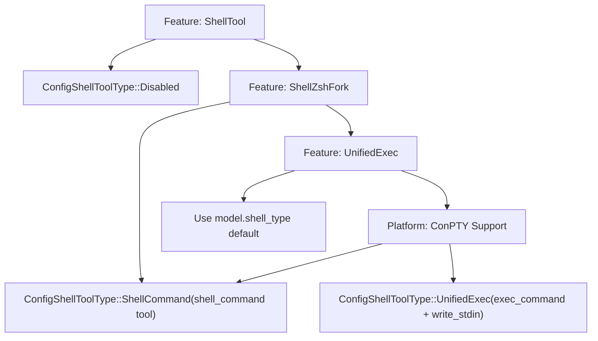
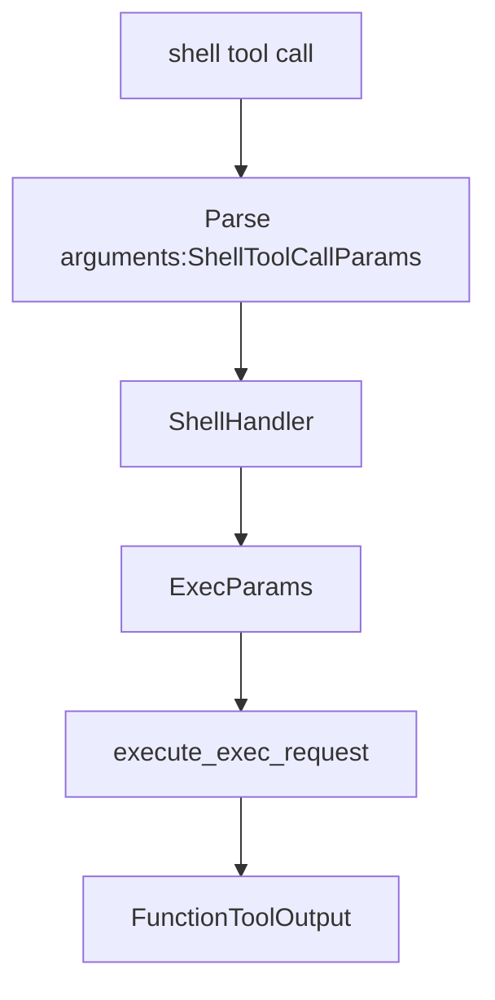
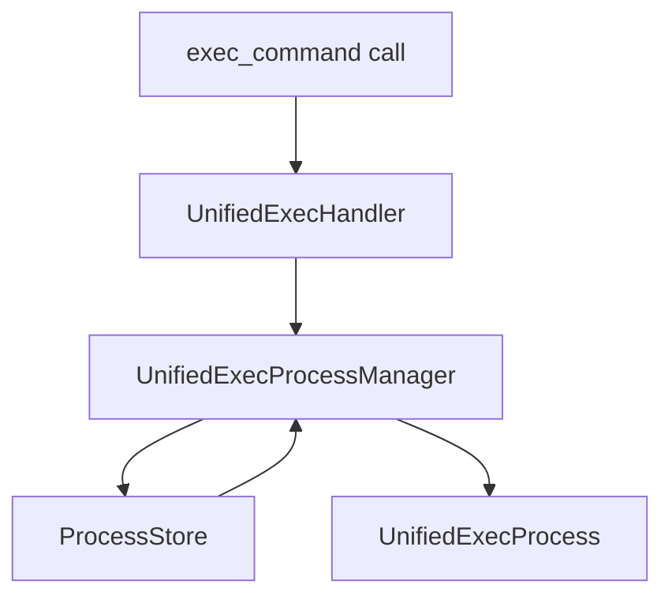

# Shell 执行工具

相关源文件

-   [codex-rs/app-server/src/command\_exec.rs](https://github.com/openai/codex/blob/d807d44a/codex-rs/app-server/src/command_exec.rs)
-   [codex-rs/core/src/environment\_context.rs](https://github.com/openai/codex/blob/d807d44a/codex-rs/core/src/environment_context.rs)
-   [codex-rs/core/src/exec.rs](https://github.com/openai/codex/blob/d807d44a/codex-rs/core/src/exec.rs)
-   [codex-rs/core/src/sandboxing/mod.rs](https://github.com/openai/codex/blob/d807d44a/codex-rs/core/src/sandboxing/mod.rs)
-   [codex-rs/core/src/shell.rs](https://github.com/openai/codex/blob/d807d44a/codex-rs/core/src/shell.rs)
-   [codex-rs/core/src/tasks/user\_shell.rs](https://github.com/openai/codex/blob/d807d44a/codex-rs/core/src/tasks/user_shell.rs)
-   [codex-rs/core/src/tools/events.rs](https://github.com/openai/codex/blob/d807d44a/codex-rs/core/src/tools/events.rs)
-   [codex-rs/core/src/tools/handlers/shell.rs](https://github.com/openai/codex/blob/d807d44a/codex-rs/core/src/tools/handlers/shell.rs)
-   [codex-rs/core/src/tools/handlers/unified\_exec.rs](https://github.com/openai/codex/blob/d807d44a/codex-rs/core/src/tools/handlers/unified_exec.rs)
-   [codex-rs/core/src/tools/orchestrator.rs](https://github.com/openai/codex/blob/d807d44a/codex-rs/core/src/tools/orchestrator.rs)
-   [codex-rs/core/src/tools/runtimes/apply\_patch.rs](https://github.com/openai/codex/blob/d807d44a/codex-rs/core/src/tools/runtimes/apply_patch.rs)
-   [codex-rs/core/src/tools/runtimes/mod.rs](https://github.com/openai/codex/blob/d807d44a/codex-rs/core/src/tools/runtimes/mod.rs)
-   [codex-rs/core/src/tools/runtimes/shell.rs](https://github.com/openai/codex/blob/d807d44a/codex-rs/core/src/tools/runtimes/shell.rs)
-   [codex-rs/core/src/tools/runtimes/unified\_exec.rs](https://github.com/openai/codex/blob/d807d44a/codex-rs/core/src/tools/runtimes/unified_exec.rs)
-   [codex-rs/core/src/tools/sandboxing.rs](https://github.com/openai/codex/blob/d807d44a/codex-rs/core/src/tools/sandboxing.rs)
-   [codex-rs/core/src/unified\_exec/async\_watcher.rs](https://github.com/openai/codex/blob/d807d44a/codex-rs/core/src/unified_exec/async_watcher.rs)
-   [codex-rs/core/src/unified\_exec/errors.rs](https://github.com/openai/codex/blob/d807d44a/codex-rs/core/src/unified_exec/errors.rs)
-   [codex-rs/core/src/unified\_exec/mod.rs](https://github.com/openai/codex/blob/d807d44a/codex-rs/core/src/unified_exec/mod.rs)
-   [codex-rs/core/src/unified\_exec/process\_manager.rs](https://github.com/openai/codex/blob/d807d44a/codex-rs/core/src/unified_exec/process_manager.rs)
-   [codex-rs/core/tests/suite/exec.rs](https://github.com/openai/codex/blob/d807d44a/codex-rs/core/tests/suite/exec.rs)
-   [codex-rs/core/tests/suite/shell\_command.rs](https://github.com/openai/codex/blob/d807d44a/codex-rs/core/tests/suite/shell_command.rs)
-   [codex-rs/core/tests/suite/unified\_exec.rs](https://github.com/openai/codex/blob/d807d44a/codex-rs/core/tests/suite/unified_exec.rs)
-   [codex-rs/features/src/lib.rs](https://github.com/openai/codex/blob/d807d44a/codex-rs/features/src/lib.rs)
-   [codex-rs/linux-sandbox/tests/suite/landlock.rs](https://github.com/openai/codex/blob/d807d44a/codex-rs/linux-sandbox/tests/suite/landlock.rs)
-   [codex-rs/tui/src/exec\_command.rs](https://github.com/openai/codex/blob/d807d44a/codex-rs/tui/src/exec_command.rs)
-   [codex-rs/tui/src/snapshots/codex\_tui\_\_status\_indicator\_widget\_\_tests\_\_renders\_wrapped\_details\_panama\_two\_lines.snap](https://github.com/openai/codex/blob/d807d44a/codex-rs/tui/src/snapshots/codex_tui__status_indicator_widget__tests__renders_wrapped_details_panama_two_lines.snap)
-   [codex-rs/tui/src/text\_formatting.rs](https://github.com/openai/codex/blob/d807d44a/codex-rs/tui/src/text_formatting.rs)

本页记录了让 Codex 能够在用户系统上运行命令的 shell 执行工具。这些工具是执行 shell 命令、管理交互式进程以及处理多轮命令交互的主要接口。

关于沙箱强制与审批工作流的信息，参见 **5.5 工具编排与审批**。关于 UnifiedExec 进程管理系统的细节，参见 **5.3 Unified Exec 进程管理**。关于 shell 后端选择与配置，参见 **5.1 工具注册表与配置**。

## 概览

Codex 提供三个主要的 shell 执行工具，每个工具服务于不同使用场景：

| 工具名 | 用途 | 会话类型 | 后端选项 |
| --- | --- | --- | --- |
| `shell` | 执行数组风格命令 | 非交互式 | Classic, ZshFork |
| `shell_command` | 执行脚本风格命令 | 非交互式 | Classic, ZshFork |
| `exec_command` | 交互式 PTY 会话 | 交互式 | Direct, ZshFork |
| `write_stdin` | 向运行中的 exec 会话写入 | 交互式 | 与 exec\_command 相同 |

工具选择由 `ConfigShellToolType` 枚举控制，它根据配置与平台能力决定向模型暴露哪些工具。

**来源：** [codex-rs/core/src/tools/spec.rs199-262](https://github.com/openai/codex/blob/d807d44a/codex-rs/core/src/tools/spec.rs#L199-L262) [codex-rs/core/src/tools/handlers/shell.rs41-49](https://github.com/openai/codex/blob/d807d44a/codex-rs/core/src/tools/handlers/shell.rs#L41-L49)

## 工具类型选择

该选择逻辑在启用时优先使用 ZshFork 后端，其次在可用时回退到 UnifiedExec，否则使用模型默认的 `shell_type`。在 Windows 上，启用 UnifiedExec 前会检查 ConPTY 支持。

**图：Shell 工具类型选择流程**

**来源：** [codex-rs/core/src/tools/spec.rs312-328](https://github.com/openai/codex/blob/d807d44a/codex-rs/core/src/tools/spec.rs#L312-L328) [codex-rs/core/src/tools/spec.rs211-239](https://github.com/openai/codex/blob/d807d44a/codex-rs/core/src/tools/spec.rs#L211-L239)

## 后端配置

### ShellCommandBackendConfig

控制 `shell` 和 `shell_command` 工具的执行后端。它在处理器中映射到 `ShellCommandBackend` [codex-rs/core/src/tools/handlers/shell.rs41-49](https://github.com/openai/codex/blob/d807d44a/codex-rs/core/src/tools/handlers/shell.rs#L41-L49)

-   **Classic**: 通过平台 shell 进行标准进程派生。
-   **ZshFork**: 经过自定义补丁的 Zsh 二进制，用于增强控制与 shell 升级。

**来源：** [codex-rs/core/src/tools/spec.rs199-203](https://github.com/openai/codex/blob/d807d44a/codex-rs/core/src/tools/spec.rs#L199-L203) [codex-rs/core/src/tools/handlers/shell.rs89-95](https://github.com/openai/codex/blob/d807d44a/codex-rs/core/src/tools/handlers/shell.rs#L89-L95)

### UnifiedExecBackendConfig

控制 `exec_command` 和 `write_stdin` 工具的执行后端。

-   **Direct**: 通过平台 API 原生分配 PTY（例如 `codex_utils_pty`）。
-   **ZshFork**: 对 PTY 会话使用自定义 Zsh 二进制。

**来源：** [codex-rs/core/src/tools/spec.rs205-209](https://github.com/openai/codex/blob/d807d44a/codex-rs/core/src/tools/spec.rs#L205-L209) [codex-rs/core/src/unified\_exec/mod.rs1-22](https://github.com/openai/codex/blob/d807d44a/codex-rs/core/src/unified_exec/mod.rs#L1-L22)

## 工具规格

### shell 工具

`shell` 工具将命令作为参数数组执行，并直接传给系统的进程派生器。

**图：shell 工具执行流**

**实现细节：**

-   **参数**: `command`（字符串数组）、`workdir`、`timeout_ms`、`sandbox_permissions`。
-   **Unix**: 命令会以 shell 包装方式传入 `execvp()`（例如 `bash -lc`）。 [codex-rs/core/src/shell.rs45-52](https://github.com/openai/codex/blob/d807d44a/codex-rs/core/src/shell.rs#L45-L52)
-   **Windows**: 通过 `powershell.exe -Command` 或 `cmd /c` 执行。 [codex-rs/core/src/shell.rs53-69](https://github.com/openai/codex/blob/d807d44a/codex-rs/core/src/shell.rs#L53-L69)

**来源：** [codex-rs/core/src/tools/spec.rs760-815](https://github.com/openai/codex/blob/d807d44a/codex-rs/core/src/tools/spec.rs#L760-L815) [codex-rs/core/src/tools/handlers/shell.rs155-212](https://github.com/openai/codex/blob/d807d44a/codex-rs/core/src/tools/handlers/shell.rs#L155-L212) [codex-rs/core/src/exec.rs77-89](https://github.com/openai/codex/blob/d807d44a/codex-rs/core/src/exec.rs#L77-L89)

### shell\_command 工具

`shell_command` 工具会在用户默认 shell 中执行脚本字符串。

**参数：**

-   `command`: Shell 脚本字符串（例如 `"ls -la | grep txt"`）。
-   `login`: 是否以登录 shell 运行（默认为 true）。 [codex-rs/core/src/tools/handlers/shell.rs97-108](https://github.com/openai/codex/blob/d807d44a/codex-rs/core/src/tools/handlers/shell.rs#L97-L108)

`ShellCommandHandler` 使用 `Shell::derive_exec_args` 将该字符串转换为进程可执行的参数列表。 [codex-rs/core/src/shell.rs43-70](https://github.com/openai/codex/blob/d807d44a/codex-rs/core/src/shell.rs#L43-L70)

**来源：** [codex-rs/core/src/tools/spec.rs817-886](https://github.com/openai/codex/blob/d807d44a/codex-rs/core/src/tools/spec.rs#L817-L886) [codex-rs/core/src/tools/handlers/shell.rs47-49](https://github.com/openai/codex/blob/d807d44a/codex-rs/core/src/tools/handlers/shell.rs#L47-L49) [codex-rs/core/src/shell.rs18-28](https://github.com/openai/codex/blob/d807d44a/codex-rs/core/src/shell.rs#L18-L28)

### exec\_command 工具

使用 `UnifiedExecProcessManager` 创建交互式 PTY 会话。

**图：exec\_command 交互式会话流程**

**产出等待逻辑：** 工具会在 `yield_time_ms` 指定时长内等待输出（被限制在 250ms 到 30s 之间）。 [codex-rs/core/src/unified\_exec/mod.rs57-60](https://github.com/openai/codex/blob/d807d44a/codex-rs/core/src/unified_exec/mod.rs#L57-L60) 如果在该时间后进程仍在运行，则返回 `session_id`，以允许后续 `write_stdin` 调用。

**来源：** [codex-rs/core/src/tools/handlers/unified\_exec.rs143-205](https://github.com/openai/codex/blob/d807d44a/codex-rs/core/src/tools/handlers/unified_exec.rs#L143-L205) [codex-rs/core/src/unified\_exec/process\_manager.rs155-200](https://github.com/openai/codex/blob/d807d44a/codex-rs/core/src/unified_exec/process_manager.rs#L155-L200) [codex-rs/core/src/unified\_exec/mod.rs123-126](https://github.com/openai/codex/blob/d807d44a/codex-rs/core/src/unified_exec/mod.rs#L123-L126)

### write\_stdin 工具

将输入写入由 `session_id` 标识的进行中会话。

**使用模式：**

1.  模型调用 `exec_command`，接收 `session_id: 1024`。
2.  模型调用 `write_stdin`，携带 `session_id: 1024` 和 `chars: "y\n"`。 [codex-rs/core/src/tools/handlers/unified\_exec.rs60-70](https://github.com/openai/codex/blob/d807d44a/codex-rs/core/src/tools/handlers/unified_exec.rs#L60-L70)
3.  `UnifiedExecProcessManager` 从 `ProcessStore` 取回进程并写入 PTY。 [codex-rs/core/src/unified\_exec/process\_manager.rs215-240](https://github.com/openai/codex/blob/d807d44a/codex-rs/core/src/unified_exec/process_manager.rs#L215-L240)

**来源：** [codex-rs/core/src/tools/spec.rs661-708](https://github.com/openai/codex/blob/d807d44a/codex-rs/core/src/tools/spec.rs#L661-L708) [codex-rs/core/src/unified\_exec/mod.rs102-108](https://github.com/openai/codex/blob/d807d44a/codex-rs/core/src/unified_exec/mod.rs#L102-L108)

## UnifiedExec 会话管理

`UnifiedExecProcessManager` 维护会话范围内的运行进程缓存。

-   **ProcessStore**: 受 mutex 保护的 `i32` 进程 ID 到 `ProcessEntry` 的映射。 [codex-rs/core/src/unified\_exec/mod.rs111-121](https://github.com/openai/codex/blob/d807d44a/codex-rs/core/src/unified_exec/mod.rs#L111-L121)
-   **LRU Pruning**: 存储将活动进程数量限制为 64。 [codex-rs/core/src/unified\_exec/mod.rs65](https://github.com/openai/codex/blob/d807d44a/codex-rs/core/src/unified_exec/mod.rs#L65-L65)
-   **ProcessEntry**: 包含 `Arc<UnifiedExecProcess>`、`tty` 状态与 `network_approval_id`。 [codex-rs/core/src/unified\_exec/mod.rs144-153](https://github.com/openai/codex/blob/d807d44a/codex-rs/core/src/unified_exec/mod.rs#L144-L153)

**来源：** [codex-rs/core/src/unified\_exec/mod.rs123-136](https://github.com/openai/codex/blob/d807d44a/codex-rs/core/src/unified_exec/mod.rs#L123-L136) [codex-rs/core/src/unified\_exec/process\_manager.rs106-131](https://github.com/openai/codex/blob/d807d44a/codex-rs/core/src/unified_exec/process_manager.rs#L106-L131)

## 工具处理器实现

所有 shell 处理器都遵循 `handle()` 内部的通用执行流水线：

1.  **参数解析**: 使用 `parse_arguments_with_base_path` 处理相对工作目录。 [codex-rs/core/src/tools/handlers/unified\_exec.rs145-147](https://github.com/openai/codex/blob/d807d44a/codex-rs/core/src/tools/handlers/unified_exec.rs#L145-L147)
2.  **技能调用**: 通过 `maybe_emit_implicit_skill_invocation` 检查隐式技能触发。 [codex-rs/core/src/tools/handlers/unified\_exec.rs148-154](https://github.com/openai/codex/blob/d807d44a/codex-rs/core/src/tools/handlers/unified_exec.rs#L148-L154)
3.  **权限解析**: 使用 `apply_granted_turn_permissions` 合并 turn 级授权与 session 级授权。 [codex-rs/core/src/tools/handlers/unified\_exec.rs180-185](https://github.com/openai/codex/blob/d807d44a/codex-rs/core/src/tools/handlers/unified_exec.rs#L180-L185)
4.  **审批请求**: 路由到 `ToolOrchestrator` 进行用户确认或 Guardian 审核。 [codex-rs/core/src/tools/runtimes/unified\_exec.rs108-161](https://github.com/openai/codex/blob/d807d44a/codex-rs/core/src/tools/runtimes/unified_exec.rs#L108-L161)
5.  **执行**: 通过 `execute_exec_request` 或 `UnifiedExecProcessManager` 派生进程。 [codex-rs/core/src/exec.rs233-248](https://github.com/openai/codex/blob/d807d44a/codex-rs/core/src/exec.rs#L233-L248)

**来源：** [codex-rs/core/src/tools/handlers/shell.rs181-212](https://github.com/openai/codex/blob/d807d44a/codex-rs/core/src/tools/handlers/shell.rs#L181-L212) [codex-rs/core/src/tools/handlers/unified\_exec.rs120-205](https://github.com/openai/codex/blob/d807d44a/codex-rs/core/src/tools/handlers/unified_exec.rs#L120-L205)

## 权限集成

### 附加权限校验

系统对内联权限请求实施严格校验。如果 `exec_permission_approvals_enabled` 为 false，则内联请求会被拒绝，除非它们此前已通过 `request_permissions` 工具预批准。 [codex-rs/core/src/tools/handlers/unified\_exec.rs177-189](https://github.com/openai/codex/blob/d807d44a/codex-rs/core/src/tools/handlers/unified_exec.rs#L177-L189)

### 生效权限

`EffectiveSandboxPermissions` 将基础 `SandboxPolicy` 与 `PermissionProfile` 扩展（网络、文件系统以及 macOS seatbelt 配置）合并。 [codex-rs/core/src/sandboxing/mod.rs122-151](https://github.com/openai/codex/blob/d807d44a/codex-rs/core/src/sandboxing/mod.rs#L122-L151)

**来源：** [codex-rs/core/src/sandboxing/mod.rs153-178](https://github.com/openai/codex/blob/d807d44a/codex-rs/core/src/sandboxing/mod.rs#L153-L178) [codex-rs/core/src/tools/handlers/mod.rs183-229](https://github.com/openai/codex/blob/d807d44a/codex-rs/core/src/tools/handlers/mod.rs#L183-L229)

## 平台特定行为

### Windows

-   **ConPTY**: `UnifiedExec` 所必需。 [codex-rs/core/src/tools/spec.rs320-325](https://github.com/openai/codex/blob/d807d44a/codex-rs/core/src/tools/spec.rs#L320-L325)
-   **Restricted Token**: 平台特定沙箱类型。 [codex-rs/core/src/exec.rs192](https://github.com/openai/codex/blob/d807d44a/codex-rs/core/src/exec.rs#L192-L192)

### Unix (Linux/macOS)

-   **ZshFork Backend**: 通过 `ShellZshFork` 特性标志启用。 [codex-rs/core/src/tools/spec.rs294-305](https://github.com/openai/codex/blob/d807d44a/codex-rs/core/src/tools/spec.rs#L294-L305)
-   **Sandboxing**: 使用 `LinuxSeccomp`（Landlock）或 `MacosSeatbelt`。 [codex-rs/core/src/exec.rs185-190](https://github.com/openai/codex/blob/d807d44a/codex-rs/core/src/exec.rs#L185-L190)
-   **Signal Handling**: 实现 `kill_child_process_group` 以在超时时清理孙进程。 [codex-rs/core/src/exec.rs42](https://github.com/openai/codex/blob/d807d44a/codex-rs/core/src/exec.rs#L42-L42)

**来源：** [codex-rs/core/src/exec.rs1-8](https://github.com/openai/codex/blob/d807d44a/codex-rs/core/src/exec.rs#L1-L8) [codex-rs/core/src/shell.rs91-150](https://github.com/openai/codex/blob/d807d44a/codex-rs/core/src/shell.rs#L91-L150) [codex-rs/linux-sandbox/tests/suite/landlock.rs1-25](https://github.com/openai/codex/blob/d807d44a/codex-rs/linux-sandbox/tests/suite/landlock.rs#L1-L25)
