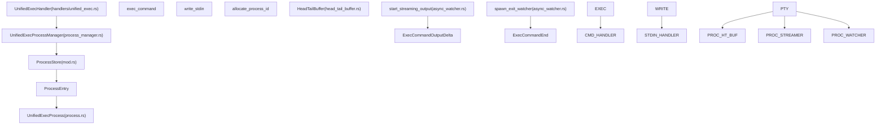

# Unified Exec 进程管理

相关源文件

-   [codex-rs/app-server/src/command\_exec.rs](https://github.com/openai/codex/blob/d807d44a/codex-rs/app-server/src/command_exec.rs)
-   [codex-rs/core/src/exec.rs](https://github.com/openai/codex/blob/d807d44a/codex-rs/core/src/exec.rs)
-   [codex-rs/core/src/memories/usage.rs](https://github.com/openai/codex/blob/d807d44a/codex-rs/core/src/memories/usage.rs)
-   [codex-rs/core/src/sandboxing/mod.rs](https://github.com/openai/codex/blob/d807d44a/codex-rs/core/src/sandboxing/mod.rs)
-   [codex-rs/core/src/spawn.rs](https://github.com/openai/codex/blob/d807d44a/codex-rs/core/src/spawn.rs)
-   [codex-rs/core/src/tasks/user\_shell.rs](https://github.com/openai/codex/blob/d807d44a/codex-rs/core/src/tasks/user_shell.rs)
-   [codex-rs/core/src/tools/events.rs](https://github.com/openai/codex/blob/d807d44a/codex-rs/core/src/tools/events.rs)
-   [codex-rs/core/src/tools/handlers/shell.rs](https://github.com/openai/codex/blob/d807d44a/codex-rs/core/src/tools/handlers/shell.rs)
-   [codex-rs/core/src/tools/handlers/unified\_exec.rs](https://github.com/openai/codex/blob/d807d44a/codex-rs/core/src/tools/handlers/unified_exec.rs)
-   [codex-rs/core/src/tools/handlers/unified\_exec\_tests.rs](https://github.com/openai/codex/blob/d807d44a/codex-rs/core/src/tools/handlers/unified_exec_tests.rs)
-   [codex-rs/core/src/tools/orchestrator.rs](https://github.com/openai/codex/blob/d807d44a/codex-rs/core/src/tools/orchestrator.rs)
-   [codex-rs/core/src/tools/runtimes/apply\_patch.rs](https://github.com/openai/codex/blob/d807d44a/codex-rs/core/src/tools/runtimes/apply_patch.rs)
-   [codex-rs/core/src/tools/runtimes/mod.rs](https://github.com/openai/codex/blob/d807d44a/codex-rs/core/src/tools/runtimes/mod.rs)
-   [codex-rs/core/src/tools/runtimes/shell.rs](https://github.com/openai/codex/blob/d807d44a/codex-rs/core/src/tools/runtimes/shell.rs)
-   [codex-rs/core/src/tools/runtimes/shell/zsh\_fork\_backend.rs](https://github.com/openai/codex/blob/d807d44a/codex-rs/core/src/tools/runtimes/shell/zsh_fork_backend.rs)
-   [codex-rs/core/src/tools/runtimes/unified\_exec.rs](https://github.com/openai/codex/blob/d807d44a/codex-rs/core/src/tools/runtimes/unified_exec.rs)
-   [codex-rs/core/src/tools/sandboxing.rs](https://github.com/openai/codex/blob/d807d44a/codex-rs/core/src/tools/sandboxing.rs)
-   [codex-rs/core/src/unified\_exec/async\_watcher.rs](https://github.com/openai/codex/blob/d807d44a/codex-rs/core/src/unified_exec/async_watcher.rs)
-   [codex-rs/core/src/unified\_exec/errors.rs](https://github.com/openai/codex/blob/d807d44a/codex-rs/core/src/unified_exec/errors.rs)
-   [codex-rs/core/src/unified\_exec/mod.rs](https://github.com/openai/codex/blob/d807d44a/codex-rs/core/src/unified_exec/mod.rs)
-   [codex-rs/core/src/unified\_exec/process.rs](https://github.com/openai/codex/blob/d807d44a/codex-rs/core/src/unified_exec/process.rs)
-   [codex-rs/core/src/unified\_exec/process\_manager.rs](https://github.com/openai/codex/blob/d807d44a/codex-rs/core/src/unified_exec/process_manager.rs)
-   [codex-rs/core/tests/suite/exec.rs](https://github.com/openai/codex/blob/d807d44a/codex-rs/core/tests/suite/exec.rs)
-   [codex-rs/core/tests/suite/unified\_exec.rs](https://github.com/openai/codex/blob/d807d44a/codex-rs/core/tests/suite/unified_exec.rs)
-   [codex-rs/linux-sandbox/tests/suite/landlock.rs](https://github.com/openai/codex/blob/d807d44a/codex-rs/linux-sandbox/tests/suite/landlock.rs)
-   [codex-rs/rmcp-client/tests/process\_group\_cleanup.rs](https://github.com/openai/codex/blob/d807d44a/codex-rs/rmcp-client/tests/process_group_cleanup.rs)
-   [codex-rs/utils/pty/README.md](https://github.com/openai/codex/blob/d807d44a/codex-rs/utils/pty/README.md?plain=1)
-   [codex-rs/utils/pty/src/pipe.rs](https://github.com/openai/codex/blob/d807d44a/codex-rs/utils/pty/src/pipe.rs)
-   [codex-rs/utils/pty/src/process.rs](https://github.com/openai/codex/blob/d807d44a/codex-rs/utils/pty/src/process.rs)
-   [codex-rs/utils/pty/src/process\_group.rs](https://github.com/openai/codex/blob/d807d44a/codex-rs/utils/pty/src/process_group.rs)
-   [codex-rs/utils/pty/src/pty.rs](https://github.com/openai/codex/blob/d807d44a/codex-rs/utils/pty/src/pty.rs)
-   [codex-rs/utils/pty/src/tests.rs](https://github.com/openai/codex/blob/d807d44a/codex-rs/utils/pty/src/tests.rs)

## 目的与范围

Unified Exec 系统提供**基于交互式 PTY 的进程执行**，并与审批和沙箱机制协同编排。与标准 shell 执行工具不同，Unified Exec 管理可跨多次工具调用复用的持久化伪终端（PTY）进程，从而支持有状态工作流，使环境变量、工作目录和 shell 状态得以持续保留。

本页记录进程管理层，包括进程生命周期、ID 分配、输出流式传输和 LRU 裁剪。

**来源**: [codex-rs/core/src/unified\_exec/mod.rs1-23](https://github.com/openai/codex/blob/d807d44a/codex-rs/core/src/unified_exec/mod.rs#L1-L23) [codex-rs/core/src/tools/handlers/unified\_exec.rs120-141](https://github.com/openai/codex/blob/d807d44a/codex-rs/core/src/tools/handlers/unified_exec.rs#L120-L141)

---

## 架构概览

Unified Exec 架构在高层工具编排与底层 PTY 管理之间建立桥梁。


**图：Unified Exec 组件架构**

**关键组件**：

-   **UnifiedExecProcessManager**: 用于分配 ID 和管理进程生命周期的中央协调器 [codex-rs/core/src/unified\_exec/mod.rs123-126](https://github.com/openai/codex/blob/d807d44a/codex-rs/core/src/unified_exec/mod.rs#L123-L126)
-   **ProcessStore**: 线程安全容器（`Mutex<ProcessStore>`），用于持有活跃 `ProcessEntry` 对象 [codex-rs/core/src/unified\_exec/mod.rs111-121](https://github.com/openai/codex/blob/d807d44a/codex-rs/core/src/unified_exec/mod.rs#L111-L121)
-   **UnifiedExecProcess**: PTY 的底层句柄，负责管理 stdin/stdout 管道和底层子进程 [codex-rs/core/src/unified\_exec/mod.rs55](https://github.com/openai/codex/blob/d807d44a/codex-rs/core/src/unified_exec/mod.rs#L55-L55)
-   **HeadTailBuffer**: 专用缓冲区，在 1MB 上限内保留大输出流的开头与结尾，并丢弃中间部分 [codex-rs/core/src/unified\_exec/mod.rs63](https://github.com/openai/codex/blob/d807d44a/codex-rs/core/src/unified_exec/mod.rs#L63-L63)

**来源**: [codex-rs/core/src/unified\_exec/mod.rs1-154](https://github.com/openai/codex/blob/d807d44a/codex-rs/core/src/unified_exec/mod.rs#L1-L154) [codex-rs/core/src/unified\_exec/process\_manager.rs105-131](https://github.com/openai/codex/blob/d807d44a/codex-rs/core/src/unified_exec/process_manager.rs#L105-L131)

---

## 进程 ID 管理

Unified Exec 使用基于整数的进程 ID，让模型能够跟踪长生命周期会话。

### 分配策略

`allocate_process_id` 函数确保 `ProcessStore` 内 ID 唯一。

| 模式 | 范围 | 实现 |
| --- | --- | --- |
| **Production** | `1,000` 到 `99,999` | `rand::rng().random_range(1_000..100_000)` [codex-rs/core/src/unified\_exec/process\_manager.rs121](https://github.com/openai/codex/blob/d807d44a/codex-rs/core/src/unified_exec/process_manager.rs#L121-L121) |
| **Test/Deterministic** | `1000`\+（顺序） | 从当前最大已有 ID 开始递增 [codex-rs/core/src/unified\_exec/process\_manager.rs112-118](https://github.com/openai/codex/blob/d807d44a/codex-rs/core/src/unified_exec/process_manager.rs#L112-L118) |

### 进程跟踪

活跃进程以 `ProcessEntry` 结构体存储，用于跟踪元数据，以及进程最近访问时间（用于 LRU 裁剪）。

```
struct ProcessEntry {    process: Arc<UnifiedExecProcess>,    call_id: String,    process_id: i32,    command: Vec<String>,    tty: bool,    network_approval_id: Option<String>,    session: Weak<Session>,    last_used: tokio::time::Instant,}
```
**来源**: [codex-rs/core/src/unified\_exec/mod.rs144-153](https://github.com/openai/codex/blob/d807d44a/codex-rs/core/src/unified_exec/mod.rs#L144-L153) [codex-rs/core/src/unified\_exec/process\_manager.rs106-131](https://github.com/openai/codex/blob/d807d44a/codex-rs/core/src/unified_exec/process_manager.rs#L106-L131)

---

## 执行流：exec\_command

`exec_command` 工具会打开一个新进程或会话。

> **[Mermaid sequence]**
> *(图表结构无法解析)*

**图：exec\_command 执行时序**

**实现细节**：

1.  **编排**: 使用 `ToolOrchestrator` 处理安全策略，包括审批提示和沙箱选择 [codex-rs/core/src/unified\_exec/process\_manager.rs159-166](https://github.com/openai/codex/blob/d807d44a/codex-rs/core/src/unified_exec/process_manager.rs#L159-L166)
2.  **输出等待**: 系统会等待特定 `yield_time_ms`（限制在 250ms 到 30s 之间）以收集模型初始输出 [codex-rs/core/src/unified\_exec/mod.rs155-157](https://github.com/openai/codex/blob/d807d44a/codex-rs/core/src/unified_exec/mod.rs#L155-L157)
3.  **持久化**: 如果进程在等待后仍存活，则存入 `ProcessStore`。如果已结束，则立即释放 ID [codex-rs/core/src/unified\_exec/process\_manager.rs168-176](https://github.com/openai/codex/blob/d807d44a/codex-rs/core/src/unified_exec/process_manager.rs#L168-L176)

**来源**: [codex-rs/core/src/unified\_exec/process\_manager.rs155-295](https://github.com/openai/codex/blob/d807d44a/codex-rs/core/src/unified_exec/process_manager.rs#L155-L295) [codex-rs/core/src/unified\_exec/mod.rs57-60](https://github.com/openai/codex/blob/d807d44a/codex-rs/core/src/unified_exec/mod.rs#L57-L60)

---

## 交互流：write\_stdin

`write_stdin` 工具会向由其 ID 标识的已有进程发送输入。

1.  **查找**: 管理器从 `ProcessStore` 取回 `ProcessEntry` [codex-rs/core/src/unified\_exec/process\_manager.rs424-436](https://github.com/openai/codex/blob/d807d44a/codex-rs/core/src/unified_exec/process_manager.rs#L424-L436)
2.  **输入传输**: 输入经由 `writer_tx` mpsc 通道发送到 PTY 的 stdin [codex-rs/core/src/unified\_exec/process\_manager.rs316-324](https://github.com/openai/codex/blob/d807d44a/codex-rs/core/src/unified_exec/process_manager.rs#L316-L324)
3.  **等待**: 若输入为空，使用更长的 `MIN_EMPTY_YIELD_TIME_MS`（5s）等待后台活动；否则使用请求的 `yield_time_ms` [codex-rs/core/src/unified\_exec/process\_manager.rs329-336](https://github.com/openai/codex/blob/d807d44a/codex-rs/core/src/unified_exec/process_manager.rs#L329-L336)
4.  **清理**: 若进程在本次交互中退出，则从存储中移除并注销网络审批 [codex-rs/core/src/unified\_exec/process\_manager.rs392-411](https://github.com/openai/codex/blob/d807d44a/codex-rs/core/src/unified_exec/process_manager.rs#L392-L411)

**来源**: [codex-rs/core/src/unified\_exec/process\_manager.rs297-390](https://github.com/openai/codex/blob/d807d44a/codex-rs/core/src/unified_exec/process_manager.rs#L297-L390) [codex-rs/core/src/unified\_exec/mod.rs59](https://github.com/openai/codex/blob/d807d44a/codex-rs/core/src/unified_exec/mod.rs#L59-L59)

---

## 输出流式传输与事件发射

Unified Exec 通过后台任务为用户界面提供实时输出流。

### 输出流任务

`start_streaming_output` 任务从 PTY 的广播通道读取，并发射 `ExecCommandOutputDelta` 事件 [codex-rs/core/src/unified\_exec/async\_watcher.rs39-45](https://github.com/openai/codex/blob/d807d44a/codex-rs/core/src/unified_exec/async_watcher.rs#L39-L45)

-   **UTF-8 安全**: 使用 `bytes_to_string_smart` 处理多字节 UTF-8 字符跨读取块拆分的情况 [codex-rs/core/src/unified\_exec/async\_watcher.rs163-167](https://github.com/openai/codex/blob/d807d44a/codex-rs/core/src/unified_exec/async_watcher.rs#L163-L167)
-   **速率限制**: 将每次调用的 delta 事件数上限设为 10,000，以防 UI 被淹没 [codex-rs/core/src/exec.rs65](https://github.com/openai/codex/blob/d807d44a/codex-rs/core/src/exec.rs#L65-L65)

### 退出监视任务

`spawn_exit_watcher` 任务等待进程终止 [codex-rs/core/src/unified\_exec/async\_watcher.rs106-114](https://github.com/openai/codex/blob/d807d44a/codex-rs/core/src/unified_exec/async_watcher.rs#L106-L114)

-   **宽限期**: 会等待 `TRAILING_OUTPUT_GRACE`（100ms），确保在发射最终 `ExecCommandEnd` 事件前所有缓冲 stdout 都已处理 [codex-rs/core/src/unified\_exec/async\_watcher.rs26-27](https://github.com/openai/codex/blob/d807d44a/codex-rs/core/src/unified_exec/async_watcher.rs#L26-L27)
-   **清理**: 完成后触发 `emit_exec_end_for_unified_exec` 函数以通知会话 [codex-rs/core/src/unified\_exec/async\_watcher.rs136-139](https://github.com/openai/codex/blob/d807d44a/codex-rs/core/src/unified_exec/async_watcher.rs#L136-L139)

**来源**: [codex-rs/core/src/unified\_exec/async\_watcher.rs39-140](https://github.com/openai/codex/blob/d807d44a/codex-rs/core/src/unified_exec/async_watcher.rs#L39-L140) [codex-rs/core/src/exec.rs63-65](https://github.com/openai/codex/blob/d807d44a/codex-rs/core/src/exec.rs#L63-L65)

---

## 资源管理与 LRU 裁剪

为防止资源耗尽，`UnifiedExecProcessManager` 实现了 LRU（最近最少使用）裁剪策略。

| 限制项 | 值 | 描述 |
| --- | --- | --- |
| `MAX_UNIFIED_EXEC_PROCESSES` | 64 | 存储中允许的最大并发进程数 [codex-rs/core/src/unified\_exec/mod.rs65](https://github.com/openai/codex/blob/d807d44a/codex-rs/core/src/unified_exec/mod.rs#L65-L65) |
| `WARNING_UNIFIED_EXEC_PROCESSES` | 60 | 向模型发送告警消息的阈值 [codex-rs/core/src/unified\_exec/mod.rs68](https://github.com/openai/codex/blob/d807d44a/codex-rs/core/src/unified_exec/mod.rs#L68-L68) |

### 裁剪逻辑

当存储已满且添加新进程时：

1.  管理器按 `last_used` 时间戳对所有 `ProcessEntry` 项排序 [codex-rs/core/src/unified\_exec/process\_manager.rs693-695](https://github.com/openai/codex/blob/d807d44a/codex-rs/core/src/unified_exec/process_manager.rs#L693-L695)
2.  从存储中移除最旧进程 [codex-rs/core/src/unified\_exec/process\_manager.rs696-699](https://github.com/openai/codex/blob/d807d44a/codex-rs/core/src/unified_exec/process_manager.rs#L696-L699)
3.  终止底层 PTY，并注销关联的网络审批 [codex-rs/core/src/unified\_exec/process\_manager.rs143-153](https://github.com/openai/codex/blob/d807d44a/codex-rs/core/src/unified_exec/process_manager.rs#L143-L153)

**来源**: [codex-rs/core/src/unified\_exec/process\_manager.rs680-705](https://github.com/openai/codex/blob/d807d44a/codex-rs/core/src/unified_exec/process_manager.rs#L680-L705) [codex-rs/core/src/unified\_exec/mod.rs61-69](https://github.com/openai/codex/blob/d807d44a/codex-rs/core/src/unified_exec/mod.rs#L61-L69)
