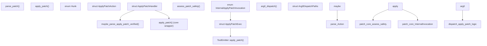

# Apply Patch 系统

相关源文件

-   [codex-rs/apply-patch/Cargo.toml](https://github.com/openai/codex/blob/d807d44a/codex-rs/apply-patch/Cargo.toml)
-   [codex-rs/apply-patch/src/invocation.rs](https://github.com/openai/codex/blob/d807d44a/codex-rs/apply-patch/src/invocation.rs)
-   [codex-rs/apply-patch/src/lib.rs](https://github.com/openai/codex/blob/d807d44a/codex-rs/apply-patch/src/lib.rs)
-   [codex-rs/apply-patch/src/parser.rs](https://github.com/openai/codex/blob/d807d44a/codex-rs/apply-patch/src/parser.rs)
-   [codex-rs/apply-patch/src/seek\_sequence.rs](https://github.com/openai/codex/blob/d807d44a/codex-rs/apply-patch/src/seek_sequence.rs)
-   [codex-rs/apply-patch/tests/fixtures/scenarios/020\_whitespace\_padded\_patch\_marker\_lines/expected/file.txt](https://github.com/openai/codex/blob/d807d44a/codex-rs/apply-patch/tests/fixtures/scenarios/020_whitespace_padded_patch_marker_lines/expected/file.txt)
-   [codex-rs/apply-patch/tests/fixtures/scenarios/020\_whitespace\_padded\_patch\_marker\_lines/input/file.txt](https://github.com/openai/codex/blob/d807d44a/codex-rs/apply-patch/tests/fixtures/scenarios/020_whitespace_padded_patch_marker_lines/input/file.txt)
-   [codex-rs/apply-patch/tests/fixtures/scenarios/020\_whitespace\_padded\_patch\_marker\_lines/patch.txt](https://github.com/openai/codex/blob/d807d44a/codex-rs/apply-patch/tests/fixtures/scenarios/020_whitespace_padded_patch_marker_lines/patch.txt)
-   [codex-rs/arg0/Cargo.toml](https://github.com/openai/codex/blob/d807d44a/codex-rs/arg0/Cargo.toml)
-   [codex-rs/arg0/src/lib.rs](https://github.com/openai/codex/blob/d807d44a/codex-rs/arg0/src/lib.rs)
-   [codex-rs/core/src/apply\_patch.rs](https://github.com/openai/codex/blob/d807d44a/codex-rs/core/src/apply_patch.rs)
-   [codex-rs/core/src/safety.rs](https://github.com/openai/codex/blob/d807d44a/codex-rs/core/src/safety.rs)
-   [codex-rs/core/src/tools/context.rs](https://github.com/openai/codex/blob/d807d44a/codex-rs/core/src/tools/context.rs)
-   [codex-rs/core/src/tools/handlers/apply\_patch.rs](https://github.com/openai/codex/blob/d807d44a/codex-rs/core/src/tools/handlers/apply_patch.rs)
-   [codex-rs/core/src/tools/handlers/mcp.rs](https://github.com/openai/codex/blob/d807d44a/codex-rs/core/src/tools/handlers/mcp.rs)
-   [codex-rs/core/src/tools/handlers/plan.rs](https://github.com/openai/codex/blob/d807d44a/codex-rs/core/src/tools/handlers/plan.rs)
-   [codex-rs/core/src/tools/parallel.rs](https://github.com/openai/codex/blob/d807d44a/codex-rs/core/src/tools/parallel.rs)
-   [codex-rs/core/src/tools/router.rs](https://github.com/openai/codex/blob/d807d44a/codex-rs/core/src/tools/router.rs)

## 目的与范围

本页记录 `apply_patch` 工具系统：补丁格式、解析流水线、拦截机制、安全评估与文件系统执行。该系统支持两条主要调用路径：通过 `ApplyPatchHandler` 的直接函数工具调用，以及 shell 级拦截（在生成子进程前检测 shell 命令中 heredoc 包裹的 `apply_patch` 调用）。

系统拆分为 `codex-apply-patch` crate（解析与独立执行逻辑）和 `codex-core`（与代理工具编排、安全检查和事件发射的集成）。

来源: [codex-rs/apply-patch/src/lib.rs1-51](https://github.com/openai/codex/blob/d807d44a/codex-rs/apply-patch/src/lib.rs#L1-L51) [codex-rs/core/src/tools/handlers/apply\_patch.rs42-155](https://github.com/openai/codex/blob/d807d44a/codex-rs/core/src/tools/handlers/apply_patch.rs#L42-L155)

---

## 补丁格式

系统使用自定义类 diff 格式，由 `*** Begin Patch` 与 `*** End Patch` 分隔符包围。它支持三种基础操作类型，由 `codex-apply-patch` 中的 `Hunk` 枚举表示。

| Hunk 类型 | 标记 | 描述 |
| --- | --- | --- |
| `AddFile` | `*** Add File: <path>` | 使用提供的行创建新文件。 |
| `DeleteFile` | `*** Delete File: <path>` | 删除指定文件。 |
| `UpdateFile` | `*** Update File: <path>` | 使用基于上下文的匹配修改现有文件。 |
| `MoveTo` | `*** Move to: <path>` | （在 Update 内）在更新过程中重命名文件。 |

### 基于上下文的匹配

对于 `UpdateFile` hunk，系统使用 `UpdateFileChunk` 对象，其中包含：

-   `change_context`: 可选锚定行（例如 `@@ class MyClass`），用于缩小搜索范围 [codex-rs/apply-patch/src/parser.rs91-94](https://github.com/openai/codex/blob/d807d44a/codex-rs/apply-patch/src/parser.rs#L91-L94)
-   `old_lines`: 需要被替换的精确行序列 [codex-rs/apply-patch/src/parser.rs98](https://github.com/openai/codex/blob/d807d44a/codex-rs/apply-patch/src/parser.rs#L98-L98)
-   `new_lines`: 替换内容 [codex-rs/apply-patch/src/parser.rs99](https://github.com/openai/codex/blob/d807d44a/codex-rs/apply-patch/src/parser.rs#L99-L99)

来源: [codex-rs/apply-patch/src/parser.rs31-40](https://github.com/openai/codex/blob/d807d44a/codex-rs/apply-patch/src/parser.rs#L31-L40) [codex-rs/apply-patch/src/parser.rs60-76](https://github.com/openai/codex/blob/d807d44a/codex-rs/apply-patch/src/parser.rs#L60-L76) [codex-rs/apply-patch/src/lib.rs95-108](https://github.com/openai/codex/blob/d807d44a/codex-rs/apply-patch/src/lib.rs#L95-L108)

---

## 架构概览

下图映射了自然语言意图（应用补丁）与跨 crate 代码实体之间的关系。

**代码实体图：Apply Patch 组件映射**

来源: [codex-rs/apply-patch/src/lib.rs20-21](https://github.com/openai/codex/blob/d807d44a/codex-rs/apply-patch/src/lib.rs#L20-L21) [codex-rs/core/src/tools/handlers/apply\_patch.rs42-128](https://github.com/openai/codex/blob/d807d44a/codex-rs/core/src/tools/handlers/apply_patch.rs#L42-L128) [codex-rs/core/src/apply\_patch.rs13-40](https://github.com/openai/codex/blob/d807d44a/codex-rs/core/src/apply_patch.rs#L13-L40) [codex-rs/arg0/src/lib.rs89-107](https://github.com/openai/codex/blob/d807d44a/codex-rs/arg0/src/lib.rs#L89-L107)

---

## 安全与审批工作流

在补丁被应用前，它会在 `codex-core` 中接受安全评估。这会决定该操作能否在沙箱中自动批准，或是否需要明确的人类干预。

### 评估逻辑

函数 `assess_patch_safety` 会根据当前 `SandboxPolicy` 和 `FileSystemSandboxPolicy` 评估 `ApplyPatchAction` [codex-rs/core/src/safety.rs28-35](https://github.com/openai/codex/blob/d807d44a/codex-rs/core/src/safety.rs#L28-L35)

1.  **路径约束检查**: `is_write_patch_constrained_to_writable_paths` 验证所有新增、删除或更新的文件都位于允许写入的根路径内 [codex-rs/core/src/safety.rs125-158](https://github.com/openai/codex/blob/d807d44a/codex-rs/core/src/safety.rs#L125-L158)
2.  **沙箱强制**: 若路径受约束，系统会尝试查找平台特定沙箱（例如 `MacosSeatbelt`、`LinuxSeccomp` 或 `WindowsRestrictedToken`） [codex-rs/core/src/safety.rs81-97](https://github.com/openai/codex/blob/d807d44a/codex-rs/core/src/safety.rs#L81-L97)
3.  **结果**:
    -   `SafetyCheck::AutoApprove`: 补丁可在受限环境中安全运行 [codex-rs/core/src/safety.rs18-21](https://github.com/openai/codex/blob/d807d44a/codex-rs/core/src/safety.rs#L18-L21)
    -   `SafetyCheck::AskUser`: 补丁触及项目外路径，或没有可用沙箱 [codex-rs/core/src/safety.rs22](https://github.com/openai/codex/blob/d807d44a/codex-rs/core/src/safety.rs#L22-L22)
    -   `SafetyCheck::Reject`: 补丁为空或违反 “Never” 审批设置 [codex-rs/core/src/safety.rs23-26](https://github.com/openai/codex/blob/d807d44a/codex-rs/core/src/safety.rs#L23-L26)

来源: [codex-rs/core/src/safety.rs28-107](https://github.com/openai/codex/blob/d807d44a/codex-rs/core/src/safety.rs#L28-L107) [codex-rs/core/src/apply\_patch.rs41-77](https://github.com/openai/codex/blob/d807d44a/codex-rs/core/src/apply_patch.rs#L41-L77)

---

## 执行与自调用

Codex 使用“自调用”模式，在独立且受沙箱约束的进程中执行补丁应用。

### 调用流程

1.  **处理器层**: `ApplyPatchHandler` 解析模型参数，并调用 `codex_core::apply_patch::apply_patch` [codex-rs/core/src/tools/handlers/apply\_patch.rs174-180](https://github.com/openai/codex/blob/d807d44a/codex-rs/core/src/tools/handlers/apply_patch.rs#L174-L180)
2.  **委派**: 若获批，core 返回 `InternalApplyPatchInvocation::DelegateToExec`。其中包含带有 `exec_approval_requirement` 的 `ApplyPatchExec` 结构 [codex-rs/core/src/apply\_patch.rs52-72](https://github.com/openai/codex/blob/d807d44a/codex-rs/core/src/apply_patch.rs#L52-L72)
3.  **子进程**: `ApplyPatchRuntime`（由 `ToolOrchestrator` 调用）使用特殊标志 `CODEX_CORE_APPLY_PATCH_ARG1`（`--codex-run-as-apply-patch`）启动新的 Codex 二进制实例 [codex-rs/apply-patch/src/lib.rs35](https://github.com/openai/codex/blob/d807d44a/codex-rs/apply-patch/src/lib.rs#L35-L35)
4.  **Arg0 分派**: `codex-arg0` crate 中的 `arg0_dispatch` 函数检测该标志，从后续参数提取补丁文本，并执行内部 `codex_apply_patch::apply_patch` 逻辑 [codex-rs/arg0/src/lib.rs89-107](https://github.com/openai/codex/blob/d807d44a/codex-rs/arg0/src/lib.rs#L89-L107)

**时序图：补丁应用流程**

> **[Mermaid sequence]**
> *(图表结构无法解析)*

来源: [codex-rs/core/src/apply\_patch.rs13-77](https://github.com/openai/codex/blob/d807d44a/codex-rs/core/src/apply_patch.rs#L13-L77) [codex-rs/core/src/tools/handlers/apply\_patch.rs178-195](https://github.com/openai/codex/blob/d807d44a/codex-rs/core/src/tools/handlers/apply_patch.rs#L178-L195) [codex-rs/arg0/src/lib.rs89-107](https://github.com/openai/codex/blob/d807d44a/codex-rs/arg0/src/lib.rs#L89-L107) [codex-rs/apply-patch/src/lib.rs183-213](https://github.com/openai/codex/blob/d807d44a/codex-rs/apply-patch/src/lib.rs#L183-L213)

---

## 工具变体与解析

系统处理多种输入格式，以适配不同模型行为。

### Freeform 与 JSON

-   **JSON（标准）**: 模型使用包含 `input` 字段的 JSON 对象调用 `apply_patch` [codex-rs/core/src/tools/handlers/apply\_patch.rs158-161](https://github.com/openai/codex/blob/d807d44a/codex-rs/core/src/tools/handlers/apply_patch.rs#L158-L161)
-   **Custom/Freeform**: 模型将原始补丁正文直接作为字符串提供 [codex-rs/core/src/tools/handlers/apply\_patch.rs162](https://github.com/openai/codex/blob/d807d44a/codex-rs/core/src/tools/handlers/apply_patch.rs#L162-L162)

### 宽松解析

模型（特别是 GPT-4.1）有时会在直接调用工具时，仍将补丁包裹在 shell heredoc 语法中（例如 `<<'EOF' ... EOF`）。`codex-apply-patch` 中的 `ParseMode::Lenient` 设置允许解析器去除这些标记并提取底层补丁内容 [codex-rs/apply-patch/src/parser.rs115-152](https://github.com/openai/codex/blob/d807d44a/codex-rs/apply-patch/src/parser.rs#L115-L152)

来源: [codex-rs/core/src/tools/handlers/apply\_patch.rs157-168](https://github.com/openai/codex/blob/d807d44a/codex-rs/core/src/tools/handlers/apply_patch.rs#L157-L168) [codex-rs/apply-patch/src/parser.rs106-113](https://github.com/openai/codex/blob/d807d44a/codex-rs/apply-patch/src/parser.rs#L106-L113) [codex-rs/apply-patch/src/parser.rs154-164](https://github.com/openai/codex/blob/d807d44a/codex-rs/apply-patch/src/parser.rs#L154-L164)
