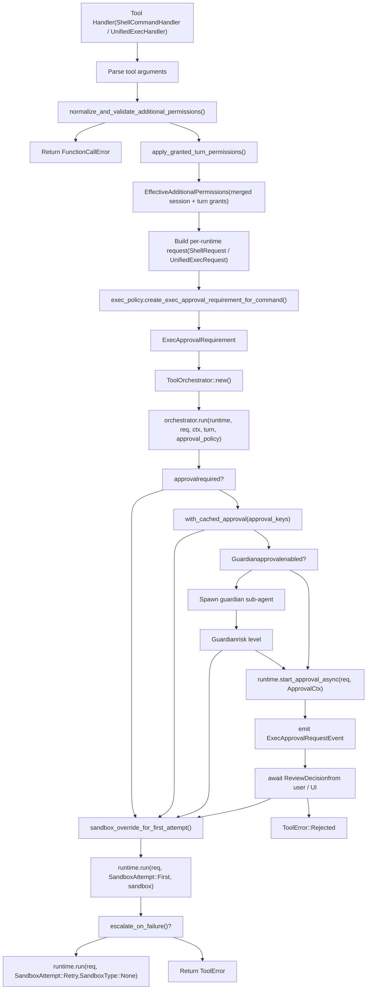

# 工具编排与审批

相关源文件

-   [codex-rs/app-server/src/command\_exec.rs](https://github.com/openai/codex/blob/d807d44a/codex-rs/app-server/src/command_exec.rs)
-   [codex-rs/core/src/exec.rs](https://github.com/openai/codex/blob/d807d44a/codex-rs/core/src/exec.rs)
-   [codex-rs/core/src/exec\_policy.rs](https://github.com/openai/codex/blob/d807d44a/codex-rs/core/src/exec_policy.rs)
-   [codex-rs/core/src/exec\_policy\_tests.rs](https://github.com/openai/codex/blob/d807d44a/codex-rs/core/src/exec_policy_tests.rs)
-   [codex-rs/core/src/sandboxing/mod.rs](https://github.com/openai/codex/blob/d807d44a/codex-rs/core/src/sandboxing/mod.rs)
-   [codex-rs/core/src/tasks/review.rs](https://github.com/openai/codex/blob/d807d44a/codex-rs/core/src/tasks/review.rs)
-   [codex-rs/core/src/tasks/user\_shell.rs](https://github.com/openai/codex/blob/d807d44a/codex-rs/core/src/tasks/user_shell.rs)
-   [codex-rs/core/src/tools/events.rs](https://github.com/openai/codex/blob/d807d44a/codex-rs/core/src/tools/events.rs)
-   [codex-rs/core/src/tools/handlers/shell.rs](https://github.com/openai/codex/blob/d807d44a/codex-rs/core/src/tools/handlers/shell.rs)
-   [codex-rs/core/src/tools/handlers/unified\_exec.rs](https://github.com/openai/codex/blob/d807d44a/codex-rs/core/src/tools/handlers/unified_exec.rs)
-   [codex-rs/core/src/tools/orchestrator.rs](https://github.com/openai/codex/blob/d807d44a/codex-rs/core/src/tools/orchestrator.rs)
-   [codex-rs/core/src/tools/runtimes/apply\_patch.rs](https://github.com/openai/codex/blob/d807d44a/codex-rs/core/src/tools/runtimes/apply_patch.rs)
-   [codex-rs/core/src/tools/runtimes/mod.rs](https://github.com/openai/codex/blob/d807d44a/codex-rs/core/src/tools/runtimes/mod.rs)
-   [codex-rs/core/src/tools/runtimes/shell.rs](https://github.com/openai/codex/blob/d807d44a/codex-rs/core/src/tools/runtimes/shell.rs)
-   [codex-rs/core/src/tools/runtimes/unified\_exec.rs](https://github.com/openai/codex/blob/d807d44a/codex-rs/core/src/tools/runtimes/unified_exec.rs)
-   [codex-rs/core/src/tools/sandboxing.rs](https://github.com/openai/codex/blob/d807d44a/codex-rs/core/src/tools/sandboxing.rs)
-   [codex-rs/core/src/unified\_exec/async\_watcher.rs](https://github.com/openai/codex/blob/d807d44a/codex-rs/core/src/unified_exec/async_watcher.rs)
-   [codex-rs/core/src/unified\_exec/errors.rs](https://github.com/openai/codex/blob/d807d44a/codex-rs/core/src/unified_exec/errors.rs)
-   [codex-rs/core/src/unified\_exec/mod.rs](https://github.com/openai/codex/blob/d807d44a/codex-rs/core/src/unified_exec/mod.rs)
-   [codex-rs/core/src/unified\_exec/process\_manager.rs](https://github.com/openai/codex/blob/d807d44a/codex-rs/core/src/unified_exec/process_manager.rs)
-   [codex-rs/core/tests/suite/approvals.rs](https://github.com/openai/codex/blob/d807d44a/codex-rs/core/tests/suite/approvals.rs)
-   [codex-rs/core/tests/suite/codex\_delegate.rs](https://github.com/openai/codex/blob/d807d44a/codex-rs/core/tests/suite/codex_delegate.rs)
-   [codex-rs/core/tests/suite/exec.rs](https://github.com/openai/codex/blob/d807d44a/codex-rs/core/tests/suite/exec.rs)
-   [codex-rs/core/tests/suite/otel.rs](https://github.com/openai/codex/blob/d807d44a/codex-rs/core/tests/suite/otel.rs)
-   [codex-rs/core/tests/suite/review.rs](https://github.com/openai/codex/blob/d807d44a/codex-rs/core/tests/suite/review.rs)
-   [codex-rs/core/tests/suite/unified\_exec.rs](https://github.com/openai/codex/blob/d807d44a/codex-rs/core/tests/suite/unified_exec.rs)
-   [codex-rs/linux-sandbox/tests/suite/landlock.rs](https://github.com/openai/codex/blob/d807d44a/codex-rs/linux-sandbox/tests/suite/landlock.rs)

## 目的与范围

本页记录 `ToolOrchestrator` 及其周边基础设施，这些组件为所有可执行工具 runtime 集中处理**审批提示**、**附加权限处理**、**沙箱类型选择**以及**拒绝后重试**语义。内容涵盖共享 trait（`Approvable`、`Sandboxable`、`ToolRuntime`）、`ExecApprovalRequirement` 计算、通过 `normalize_and_validate_additional_permissions` 进行权限校验、guardian 子代理审批，以及这些部分如何在三个具体 runtime（`ShellRuntime`、`UnifiedExecRuntime`、`ApplyPatchRuntime`）间协同。

涵盖的关键审批流：

-   **沙箱升级审批**: 需要 `require_escalated` 沙箱权限的命令 [codex-rs/core/src/tools/spec.rs525-540](https://github.com/openai/codex/blob/d807d44a/codex-rs/core/src/tools/spec.rs#L525-L540)
-   **附加权限审批**: 通过 `with_additional_permissions` 请求细粒度文件系统/网络权限的命令 [codex-rs/core/src/tools/spec.rs541-576](https://github.com/openai/codex/blob/d807d44a/codex-rs/core/src/tools/spec.rs#L541-L576)
-   **Guardian 自动审批**: 由 AI 驱动的低风险命令预审批 [codex-rs/core/src/codex\_tests\_guardian.rs42-179](https://github.com/openai/codex/blob/d807d44a/codex-rs/core/src/codex_tests_guardian.rs#L42-L179)
-   **粘性权限授予**: 通过 `request_permissions` 工具进行 turn 级与 session 级权限缓存 [codex-rs/core/tests/suite/request\_permissions.rs999-1118](https://github.com/openai/codex/blob/d807d44a/codex-rs/core/tests/suite/request_permissions.rs#L999-L1118)

关于沙箱*实现*细节（Landlock、Seatbelt、restricted tokens），参见 [Sandboxing Implementation](/openai/codex/5.6-sandboxing-implementation)。关于 shell 专用工具构建，参见 [Shell Execution Tools](/openai/codex/5.2-shell-execution-tools)。关于 unified exec 进程管理，参见 [Unified Exec Process Management](/openai/codex/5.3-unified-exec-process-management)。关于 `request_permissions` 工具，参见 [Permission Request System](/openai/codex/5.10-permission-request-system)。

---

## 架构概览

每个可执行工具都会经过集中式编排流水线。这样可确保策略逻辑（例如对照 `ExecPolicyManager` 检查 [codex-rs/core/src/exec\_policy.rs191-194](https://github.com/openai/codex/blob/d807d44a/codex-rs/core/src/exec_policy.rs#L191-L194)）与用户交互在不同执行后端之间保持一致。

**编排流水线图：**


来源: [codex-rs/core/src/tools/handlers/mod.rs100-159](https://github.com/openai/codex/blob/d807d44a/codex-rs/core/src/tools/handlers/mod.rs#L100-L159) [codex-rs/core/src/tools/orchestrator.rs1-50](https://github.com/openai/codex/blob/d807d44a/codex-rs/core/src/tools/orchestrator.rs#L1-L50) [codex-rs/core/src/exec\_policy.rs196-204](https://github.com/openai/codex/blob/d807d44a/codex-rs/core/src/exec_policy.rs#L196-L204) [codex-rs/core/src/unified\_exec/process\_manager.rs155-166](https://github.com/openai/codex/blob/d807d44a/codex-rs/core/src/unified_exec/process_manager.rs#L155-L166)

---

## 关键类型

**类型关系图：**


来源: [codex-rs/core/src/tools/sandboxing.rs1-50](https://github.com/openai/codex/blob/d807d44a/codex-rs/core/src/tools/sandboxing.rs#L1-L50) [codex-rs/core/src/tools/orchestrator.rs1-20](https://github.com/openai/codex/blob/d807d44a/codex-rs/core/src/tools/orchestrator.rs#L1-L20) [codex-rs/core/src/tools/runtimes/shell.rs31-33](https://github.com/openai/codex/blob/d807d44a/codex-rs/core/src/tools/runtimes/shell.rs#L31-L33) [codex-rs/core/src/tools/runtimes/unified\_exec.rs27-28](https://github.com/openai/codex/blob/d807d44a/codex-rs/core/src/tools/runtimes/unified_exec.rs#L27-L28)

| 类型 | 文件 | 角色 |
| --- | --- | --- |
| `ToolOrchestrator` | `tools/orchestrator.rs` | 驱动 approval → sandbox → run → retry 生命周期。 |
| `ApprovalStore` | `tools/sandboxing.rs` | 每次调用的审批决策缓存 [codex-rs/core/src/tools/sandboxing.rs31-45](https://github.com/openai/codex/blob/d807d44a/codex-rs/core/src/tools/sandboxing.rs#L31-L45) |
| `ExecApprovalRequirement` | `tools/sandboxing.rs` | 基于策略预计算的要求 [codex-rs/core/src/tools/sandboxing.rs37](https://github.com/openai/codex/blob/d807d44a/codex-rs/core/src/tools/sandboxing.rs#L37-L37) |
| `ToolRuntime<R>` | `tools/sandboxing.rs` | 所有 runtime 的组合执行 trait。 |
| `ShellRuntime` | `tools/runtimes/shell.rs` | shell/shell\_command 执行实现。 |
| `UnifiedExecRuntime` | `tools/runtimes/unified_exec.rs` | unified exec PTY 执行实现。 |
| `ExecPolicyManager` | `core/src/exec_policy.rs` | 管理并评估 `.rules` 文件规则 [codex-rs/core/src/exec\_policy.rs191-194](https://github.com/openai/codex/blob/d807d44a/codex-rs/core/src/exec_policy.rs#L191-L194) |

---

## ExecApprovalRequirement 计算

执行前，每个处理器都会通过 `ExecPolicyManager` 计算 `ExecApprovalRequirement` [codex-rs/core/src/exec\_policy.rs213-230](https://github.com/openai/codex/blob/d807d44a/codex-rs/core/src/exec_policy.rs#L213-L230) 该检查用于确定命令是否“已知安全”，或是否命中配置中的前缀规则 [codex-rs/core/src/exec\_policy.rs10-11](https://github.com/openai/codex/blob/d807d44a/codex-rs/core/src/exec_policy.rs#L10-L11)

```
// From ShellHandler::handle (tools/handlers/shell.rs)let exec_approval_requirement = session    .services    .exec_policy    .create_exec_approval_requirement_for_command(ExecApprovalRequest {        command: &exec_params.command,        approval_policy: turn.approval_policy.value(),        sandbox_policy: turn.sandbox_policy.get(),        sandbox_permissions: exec_params.sandbox_permissions,        prefix_rule,    })    .await;
```
来源: [codex-rs/core/src/tools/handlers/shell.rs384-408](https://github.com/openai/codex/blob/d807d44a/codex-rs/core/src/tools/handlers/shell.rs#L384-L408) [codex-rs/core/src/exec\_policy.rs196-204](https://github.com/openai/codex/blob/d807d44a/codex-rs/core/src/exec_policy.rs#L196-L204)

---

## AskForApproval 与细粒度策略

`AskForApproval`（定义于 `codex-protocol`）控制 `ExecApprovalRequestEvent` 的发射 [codex-rs/core/src/exec\_policy.rs130-153](https://github.com/openai/codex/blob/d807d44a/codex-rs/core/src/exec_policy.rs#L130-L153)

| 变体 | 行为 |
| --- | --- |
| `Never` | 始终跳过审批；命令直接执行。 |
| `OnFailure` | 仅在沙箱失败后请求审批。 |
| `OnRequest` | 仅当模型请求升级权限时需要审批。 |
| `Granular` | 对 `sandbox_approval`、`rules` 和 `skill_approval` 进行细粒度控制 [codex-rs/core/src/exec\_policy.rs139-152](https://github.com/openai/codex/blob/d807d44a/codex-rs/core/src/exec_policy.rs#L139-L152) |

如果需要提示但策略设为 `Never`，系统会以 `PROMPT_CONFLICT_REASON` 拒绝请求 [codex-rs/core/src/exec\_policy.rs41-42](https://github.com/openai/codex/blob/d807d44a/codex-rs/core/src/exec_policy.rs#L41-L42)

---

## SandboxPermissions 与附加权限

模型可通过 `SandboxPermissions` 请求特定沙箱行为 [codex-rs/core/src/sandboxing/mod.rs34](https://github.com/openai/codex/blob/d807d44a/codex-rs/core/src/sandboxing/mod.rs#L34-L34)

-   `RequireEscalated`: 请求无沙箱运行；需要提供 `justification` [codex-rs/core/src/sandboxing/mod.rs62](https://github.com/openai/codex/blob/d807d44a/codex-rs/core/src/sandboxing/mod.rs#L62-L62)
-   `WithAdditionalPermissions`: 请求细粒度文件系统/网络访问 [codex-rs/core/src/sandboxing/mod.rs61](https://github.com/openai/codex/blob/d807d44a/codex-rs/core/src/sandboxing/mod.rs#L61-L61)

编排前通过 `normalize_and_validate_additional_permissions()` 做校验，会规范化路径并确保请求非空 [codex-rs/core/src/sandboxing/mod.rs153-178](https://github.com/openai/codex/blob/d807d44a/codex-rs/core/src/sandboxing/mod.rs#L153-L178)

### 粘性授权

`apply_granted_turn_permissions()` 将 session 级与 turn 级粘性授权与当前请求合并 [codex-rs/core/src/tools/handlers/mod.rs184-229](https://github.com/openai/codex/blob/d807d44a/codex-rs/core/src/tools/handlers/mod.rs#L184-L229) 这使后续工具调用可以复用此前批准的权限而无需重复提示 [codex-rs/core/tests/suite/request\_permissions.rs1239-1346](https://github.com/openai/codex/blob/d807d44a/codex-rs/core/tests/suite/request_permissions.rs#L1239-L1346)

---

## 审批缓存与存储

`ToolOrchestrator` 使用 `ApprovalStore` 防止单次编排流中的冗余提示（例如首次尝试与沙箱重试之间） [codex-rs/core/src/tools/sandboxing.rs31-45](https://github.com/openai/codex/blob/d807d44a/codex-rs/core/src/tools/sandboxing.rs#L31-L45)

每个 runtime 都定义了 `approval_keys`。对于 `UnifiedExecRuntime`，其中包括命令、工作目录和请求权限 [codex-rs/core/src/tools/runtimes/unified\_exec.rs55-62](https://github.com/openai/codex/blob/d807d44a/codex-rs/core/src/tools/runtimes/unified_exec.rs#L55-L62)

---

## 用户审批提示

发生缓存未命中时，runtime 会发射 `ExecApprovalRequestEvent` [codex-rs/core/src/tools/orchestrator.rs1-50](https://github.com/openai/codex/blob/d807d44a/codex-rs/core/src/tools/orchestrator.rs#L1-L50)

**审批时序图：**

> **[Mermaid sequence]**
> *(图表结构无法解析)*

来源: [codex-rs/core/src/tools/orchestrator.rs1-50](https://github.com/openai/codex/blob/d807d44a/codex-rs/core/src/tools/orchestrator.rs#L1-L50) [codex-rs/core/src/tools/handlers/unified\_exec.rs120-140](https://github.com/openai/codex/blob/d807d44a/codex-rs/core/src/tools/handlers/unified_exec.rs#L120-L140) [codex-rs/core/src/tools/runtimes/unified\_exec.rs64-82](https://github.com/openai/codex/blob/d807d44a/codex-rs/core/src/tools/runtimes/unified_exec.rs#L64-L82)

---

## 沙箱拒绝后的重试

`ToolOrchestrator` 实现了重试循环。如果 `run` 因 `is_likely_sandbox_denied` 错误而失败，且 runtime 的 `escalate_on_failure()` 返回 `true`，则会在无沙箱模式下重试 [codex-rs/core/src/tools/orchestrator.rs1-20](https://github.com/openai/codex/blob/d807d44a/codex-rs/core/src/tools/orchestrator.rs#L1-L20)

-   `UnifiedExecRuntime`: `escalate_on_failure` 返回 `true` [codex-rs/core/src/tools/runtimes/unified\_exec.rs81](https://github.com/openai/codex/blob/d807d44a/codex-rs/core/src/tools/runtimes/unified_exec.rs#L81-L81)
-   `ShellRuntime`: 行为取决于后端配置 [codex-rs/core/src/tools/runtimes/shell.rs90-100](https://github.com/openai/codex/blob/d807d44a/codex-rs/core/src/tools/runtimes/shell.rs#L90-L100)

来源: [codex-rs/core/src/tools/orchestrator.rs1-20](https://github.com/openai/codex/blob/d807d44a/codex-rs/core/src/tools/orchestrator.rs#L1-L20) [codex-rs/core/src/tools/runtimes/unified\_exec.rs74-82](https://github.com/openai/codex/blob/d807d44a/codex-rs/core/src/tools/runtimes/unified_exec.rs#L74-L82)

---

## Guardian 审批子代理

Guardian 系统是由 AI 驱动的自动审批机制 [codex-rs/core/src/codex\_tests\_guardian.rs42-179](https://github.com/openai/codex/blob/d807d44a/codex-rs/core/src/codex_tests_guardian.rs#L42-L179) 在提示人工之前，编排器可先启动 guardian 子代理来分析命令风险。

-   **Low Risk**: Guardian 自动批准；命令无需人工干预即可运行 [codex-rs/core/src/codex\_tests\_guardian.rs310-410](https://github.com/openai/codex/blob/d807d44a/codex-rs/core/src/codex_tests_guardian.rs#L310-L410)
-   **High Risk**: Guardian 交由用户决策。

guardian 子代理以受限能力运行（例如 `approval_policy = Never`），以确保其在评估主代理请求时自身不能执行不安全动作 [codex-rs/core/src/tasks/review.rs108-109](https://github.com/openai/codex/blob/d807d44a/codex-rs/core/src/tasks/review.rs#L108-L109)

来源: [codex-rs/core/src/codex\_tests\_guardian.rs42-179](https://github.com/openai/codex/blob/d807d44a/codex-rs/core/src/codex_tests_guardian.rs#L42-L179) [codex-rs/core/src/tasks/review.rs87-130](https://github.com/openai/codex/blob/d807d44a/codex-rs/core/src/tasks/review.rs#L87-L130)
