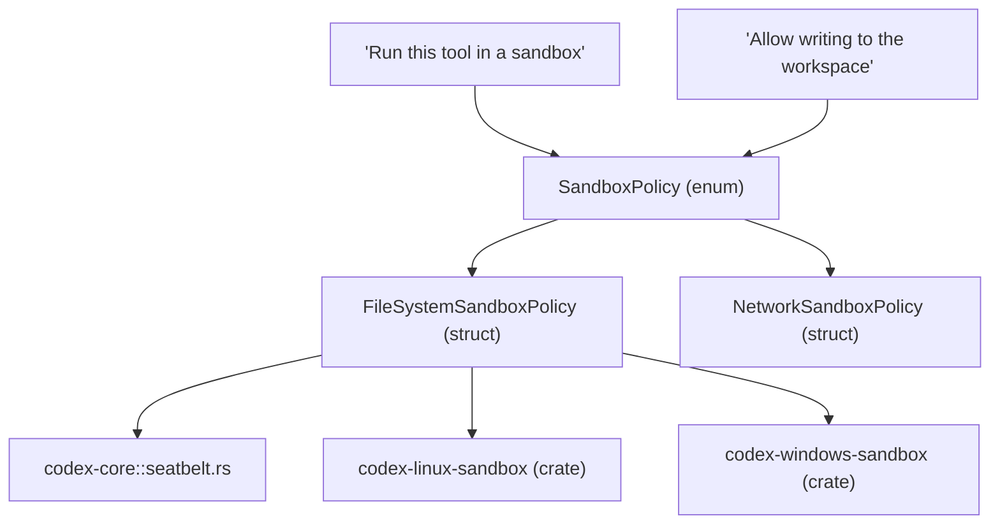
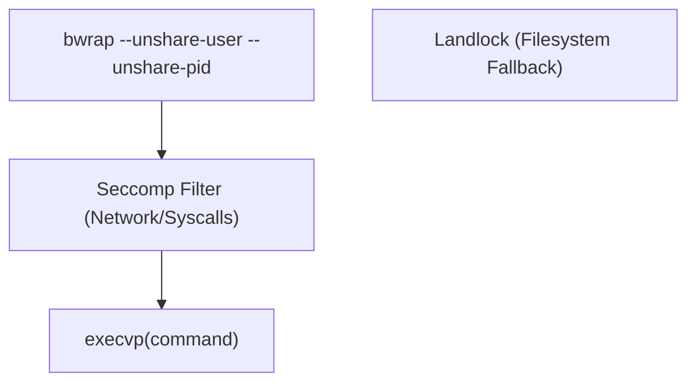

# 沙箱实现

相关源文件

-   [codex-rs/cli/src/debug\_sandbox.rs](https://github.com/openai/codex/blob/d807d44a/codex-rs/cli/src/debug_sandbox.rs)
-   [codex-rs/core/README.md](https://github.com/openai/codex/blob/d807d44a/codex-rs/core/README.md?plain=1)
-   [codex-rs/core/src/landlock.rs](https://github.com/openai/codex/blob/d807d44a/codex-rs/core/src/landlock.rs)
-   [codex-rs/core/src/landlock\_tests.rs](https://github.com/openai/codex/blob/d807d44a/codex-rs/core/src/landlock_tests.rs)
-   [codex-rs/core/src/seatbelt.rs](https://github.com/openai/codex/blob/d807d44a/codex-rs/core/src/seatbelt.rs)
-   [codex-rs/core/src/seatbelt\_base\_policy.sbpl](https://github.com/openai/codex/blob/d807d44a/codex-rs/core/src/seatbelt_base_policy.sbpl)
-   [codex-rs/core/src/seatbelt\_permissions.rs](https://github.com/openai/codex/blob/d807d44a/codex-rs/core/src/seatbelt_permissions.rs)
-   [codex-rs/core/tests/suite/seatbelt.rs](https://github.com/openai/codex/blob/d807d44a/codex-rs/core/tests/suite/seatbelt.rs)
-   [codex-rs/exec/tests/suite/sandbox.rs](https://github.com/openai/codex/blob/d807d44a/codex-rs/exec/tests/suite/sandbox.rs)
-   [codex-rs/linux-sandbox/Cargo.toml](https://github.com/openai/codex/blob/d807d44a/codex-rs/linux-sandbox/Cargo.toml)
-   [codex-rs/linux-sandbox/README.md](https://github.com/openai/codex/blob/d807d44a/codex-rs/linux-sandbox/README.md?plain=1)
-   [codex-rs/linux-sandbox/src/bwrap.rs](https://github.com/openai/codex/blob/d807d44a/codex-rs/linux-sandbox/src/bwrap.rs)
-   [codex-rs/linux-sandbox/src/landlock.rs](https://github.com/openai/codex/blob/d807d44a/codex-rs/linux-sandbox/src/landlock.rs)
-   [codex-rs/linux-sandbox/src/launcher.rs](https://github.com/openai/codex/blob/d807d44a/codex-rs/linux-sandbox/src/launcher.rs)
-   [codex-rs/linux-sandbox/src/lib.rs](https://github.com/openai/codex/blob/d807d44a/codex-rs/linux-sandbox/src/lib.rs)
-   [codex-rs/linux-sandbox/src/linux\_run\_main.rs](https://github.com/openai/codex/blob/d807d44a/codex-rs/linux-sandbox/src/linux_run_main.rs)
-   [codex-rs/linux-sandbox/src/linux\_run\_main\_tests.rs](https://github.com/openai/codex/blob/d807d44a/codex-rs/linux-sandbox/src/linux_run_main_tests.rs)
-   [codex-rs/linux-sandbox/src/vendored\_bwrap.rs](https://github.com/openai/codex/blob/d807d44a/codex-rs/linux-sandbox/src/vendored_bwrap.rs)
-   [codex-rs/utils/pty/Cargo.toml](https://github.com/openai/codex/blob/d807d44a/codex-rs/utils/pty/Cargo.toml)
-   [codex-rs/utils/pty/src/lib.rs](https://github.com/openai/codex/blob/d807d44a/codex-rs/utils/pty/src/lib.rs)
-   [codex-rs/utils/pty/src/win/conpty.rs](https://github.com/openai/codex/blob/d807d44a/codex-rs/utils/pty/src/win/conpty.rs)
-   [codex-rs/utils/pty/src/win/mod.rs](https://github.com/openai/codex/blob/d807d44a/codex-rs/utils/pty/src/win/mod.rs)
-   [codex-rs/utils/pty/src/win/procthreadattr.rs](https://github.com/openai/codex/blob/d807d44a/codex-rs/utils/pty/src/win/procthreadattr.rs)
-   [codex-rs/utils/pty/src/win/psuedocon.rs](https://github.com/openai/codex/blob/d807d44a/codex-rs/utils/pty/src/win/psuedocon.rs)
-   [codex-rs/windows-sandbox-rs/Cargo.toml](https://github.com/openai/codex/blob/d807d44a/codex-rs/windows-sandbox-rs/Cargo.toml)
-   [codex-rs/windows-sandbox-rs/src/acl.rs](https://github.com/openai/codex/blob/d807d44a/codex-rs/windows-sandbox-rs/src/acl.rs)
-   [codex-rs/windows-sandbox-rs/src/audit.rs](https://github.com/openai/codex/blob/d807d44a/codex-rs/windows-sandbox-rs/src/audit.rs)
-   [codex-rs/windows-sandbox-rs/src/bin/command\_runner.rs](https://github.com/openai/codex/blob/d807d44a/codex-rs/windows-sandbox-rs/src/bin/command_runner.rs)
-   [codex-rs/windows-sandbox-rs/src/conpty/mod.rs](https://github.com/openai/codex/blob/d807d44a/codex-rs/windows-sandbox-rs/src/conpty/mod.rs)
-   [codex-rs/windows-sandbox-rs/src/conpty/proc\_thread\_attr.rs](https://github.com/openai/codex/blob/d807d44a/codex-rs/windows-sandbox-rs/src/conpty/proc_thread_attr.rs)
-   [codex-rs/windows-sandbox-rs/src/elevated/command\_runner\_win.rs](https://github.com/openai/codex/blob/d807d44a/codex-rs/windows-sandbox-rs/src/elevated/command_runner_win.rs)
-   [codex-rs/windows-sandbox-rs/src/elevated/cwd\_junction.rs](https://github.com/openai/codex/blob/d807d44a/codex-rs/windows-sandbox-rs/src/elevated/cwd_junction.rs)
-   [codex-rs/windows-sandbox-rs/src/elevated/ipc\_framed.rs](https://github.com/openai/codex/blob/d807d44a/codex-rs/windows-sandbox-rs/src/elevated/ipc_framed.rs)
-   [codex-rs/windows-sandbox-rs/src/elevated\_impl.rs](https://github.com/openai/codex/blob/d807d44a/codex-rs/windows-sandbox-rs/src/elevated_impl.rs)
-   [codex-rs/windows-sandbox-rs/src/env.rs](https://github.com/openai/codex/blob/d807d44a/codex-rs/windows-sandbox-rs/src/env.rs)
-   [codex-rs/windows-sandbox-rs/src/firewall.rs](https://github.com/openai/codex/blob/d807d44a/codex-rs/windows-sandbox-rs/src/firewall.rs)
-   [codex-rs/windows-sandbox-rs/src/lib.rs](https://github.com/openai/codex/blob/d807d44a/codex-rs/windows-sandbox-rs/src/lib.rs)
-   [codex-rs/windows-sandbox-rs/src/logging.rs](https://github.com/openai/codex/blob/d807d44a/codex-rs/windows-sandbox-rs/src/logging.rs)
-   [codex-rs/windows-sandbox-rs/src/process.rs](https://github.com/openai/codex/blob/d807d44a/codex-rs/windows-sandbox-rs/src/process.rs)
-   [codex-rs/windows-sandbox-rs/src/sandbox\_users.rs](https://github.com/openai/codex/blob/d807d44a/codex-rs/windows-sandbox-rs/src/sandbox_users.rs)
-   [codex-rs/windows-sandbox-rs/src/setup\_main\_win.rs](https://github.com/openai/codex/blob/d807d44a/codex-rs/windows-sandbox-rs/src/setup_main_win.rs)
-   [codex-rs/windows-sandbox-rs/src/setup\_orchestrator.rs](https://github.com/openai/codex/blob/d807d44a/codex-rs/windows-sandbox-rs/src/setup_orchestrator.rs)
-   [codex-rs/windows-sandbox-rs/src/token.rs](https://github.com/openai/codex/blob/d807d44a/codex-rs/windows-sandbox-rs/src/token.rs)
-   [codex-rs/windows-sandbox-rs/src/winutil.rs](https://github.com/openai/codex/blob/d807d44a/codex-rs/windows-sandbox-rs/src/winutil.rs)
-   [third\_party/wezterm/LICENSE](https://github.com/openai/codex/blob/d807d44a/third_party/wezterm/LICENSE)

本页记录 Codex 沙箱系统的实现。该系统为工具执行提供平台特定的进程隔离，并将高层 `SandboxPolicy` 需求转换为操作系统原生机制：macOS 上的 **Seatbelt**、Linux 上的 **Bubblewrap/Landlock**、Windows 上的 **Restricted Tokens**。

---

## 概览

沙箱架构分为策略定义、平台特定驱动，以及设置编排层（主要用于 Windows）。

来源: [codex-rs/core/src/seatbelt.rs18-26](https://github.com/openai/codex/blob/d807d44a/codex-rs/core/src/seatbelt.rs#L18-L26) [codex-rs/linux-sandbox/src/linux\_run\_main.rs17-20](https://github.com/openai/codex/blob/d807d44a/codex-rs/linux-sandbox/src/linux_run_main.rs#L17-L20) [codex-rs/windows-sandbox-rs/src/lib.rs91-94](https://github.com/openai/codex/blob/d807d44a/codex-rs/windows-sandbox-rs/src/lib.rs#L91-L94)

---

## macOS：Seatbelt（sandbox-exec）

在 macOS 上，Codex 使用系统 `sandbox-exec` 工具。实现会根据请求权限动态生成 Sandbox Profile Language（SBPL）脚本。

### 实现细节

核心逻辑位于 `spawn_command_under_seatbelt`，其流程为：

1.  使用 `create_seatbelt_command_args` 构造 SBPL 参数。 [codex-rs/core/src/seatbelt.rs39-54](https://github.com/openai/codex/blob/d807d44a/codex-rs/core/src/seatbelt.rs#L39-L54)
2.  将 `CODEX_SANDBOX` 环境变量设置为 `seatbelt`。 [codex-rs/core/src/seatbelt.rs56](https://github.com/openai/codex/blob/d807d44a/codex-rs/core/src/seatbelt.rs#L56-L56)
3.  执行 `/usr/bin/sandbox-exec`。 [codex-rs/core/src/seatbelt.rs57-66](https://github.com/openai/codex/blob/d807d44a/codex-rs/core/src/seatbelt.rs#L57-L66)

### 网络代理支持

若提供 `NetworkProxy`，沙箱会被配置为允许到特定代理端口的 loopback 流量，这些端口从 `HTTPS_PROXY` 等环境变量解析得到。 [codex-rs/core/src/seatbelt.rs82-115](https://github.com/openai/codex/blob/d807d44a/codex-rs/core/src/seatbelt.rs#L82-L115)

### 策略文件

Codex 内嵌基础 SBPL 策略：

-   `seatbelt_base_policy.sbpl`: 定义核心拒绝项与标准系统放行项（例如 `/dev/null`、`sysctl-read`）。 [codex-rs/core/src/seatbelt\_base\_policy.sbpl1-109](https://github.com/openai/codex/blob/d807d44a/codex-rs/core/src/seatbelt_base_policy.sbpl#L1-L109)
-   `seatbelt_network_policy.sbpl`: 处理网络特定限制。 [codex-rs/core/src/seatbelt.rs29](https://github.com/openai/codex/blob/d807d44a/codex-rs/core/src/seatbelt.rs#L29-L29)

来源: [codex-rs/core/src/seatbelt.rs28-31](https://github.com/openai/codex/blob/d807d44a/codex-rs/core/src/seatbelt.rs#L28-L31) [codex-rs/core/src/seatbelt.rs39-68](https://github.com/openai/codex/blob/d807d44a/codex-rs/core/src/seatbelt.rs#L39-L68)

---

## Linux：Bubblewrap 与 Landlock

Linux 实现由 `codex-linux-sandbox` crate 管理。它主要使用 **Bubblewrap**（`bwrap`）进行文件系统命名空间隔离，并使用 **Seccomp** 进行系统调用过滤。

### 执行流程

`codex-linux-sandbox` 二进制充当包装器。`run_main` 中的时序为：

1.  **外层阶段**: 使用 `bwrap` 构建文件系统视图。 [codex-rs/linux-sandbox/src/linux\_run\_main.rs175-185](https://github.com/openai/codex/blob/d807d44a/codex-rs/linux-sandbox/src/linux_run_main.rs#L175-L185)
2.  **内层阶段**: 在命名空间内重新进入该二进制，通过 `apply_sandbox_policy_to_current_thread` 应用 `PR_SET_NO_NEW_PRIVS` 与 Seccomp 过滤。 [codex-rs/linux-sandbox/src/linux\_run\_main.rs138-159](https://github.com/openai/codex/blob/d807d44a/codex-rs/linux-sandbox/src/linux_run_main.rs#L138-L159)
3.  **最终执行**: 使用 `execvp` 进入目标命令。

### Bubblewrap 配置

`create_bwrap_command_args` 决定是否需要完整沙箱。若策略授予完整磁盘访问，且无需网络隔离，则它可能原样返回命令。 [codex-rs/linux-sandbox/src/bwrap.rs94-110](https://github.com/openai/codex/blob/d807d44a/codex-rs/linux-sandbox/src/bwrap.rs#L94-L110)

**平台默认值**: 标准系统路径（例如 `/usr`、`/bin`、`/lib`）默认以只读挂载，以确保二进制可执行。 [codex-rs/linux-sandbox/src/bwrap.rs28-37](https://github.com/openai/codex/blob/d807d44a/codex-rs/linux-sandbox/src/bwrap.rs#L28-L37)

来源: [codex-rs/linux-sandbox/src/linux\_run\_main.rs99-159](https://github.com/openai/codex/blob/d807d44a/codex-rs/linux-sandbox/src/linux_run_main.rs#L99-L159) [codex-rs/linux-sandbox/src/bwrap.rs1-11](https://github.com/openai/codex/blob/d807d44a/codex-rs/linux-sandbox/src/bwrap.rs#L1-L11)

---

## Windows：Restricted Tokens 与设置

Windows 沙箱是最复杂的一类，涉及多阶段设置，以管理访问控制列表（ACL）和专用的 “Sandbox Users”。

### 设置编排器

由于 Windows 缺少类似 Seatbelt 的原生“临时”沙箱，Codex 会创建两个本地用户：`CodexSandboxOffline` 与 `CodexSandboxOnline`。 [codex-rs/windows-sandbox-rs/src/setup\_orchestrator.rs37-38](https://github.com/openai/codex/blob/d807d44a/codex-rs/windows-sandbox-rs/src/setup_orchestrator.rs#L37-L38)

`run_setup_refresh` 函数会确保：

1.  **ACL 管理**: 为沙箱用户授予特定工作区根路径的读写权限。 [codex-rs/windows-sandbox-rs/src/setup\_main\_win.rs136-207](https://github.com/openai/codex/blob/d807d44a/codex-rs/windows-sandbox-rs/src/setup_main_win.rs#L136-L207)
2.  **用户配置**: 若本地账号不存在则创建。 [codex-rs/windows-sandbox-rs/src/setup\_main\_win.rs73](https://github.com/openai/codex/blob/d807d44a/codex-rs/windows-sandbox-rs/src/setup_main_win.rs#L73-L73)
3.  **防火墙规则**: 为这些特定 SID 配置 Windows 防火墙的阻断或放行。 [codex-rs/windows-sandbox-rs/src/firewall.rs1-10](https://github.com/openai/codex/blob/d807d44a/codex-rs/windows-sandbox-rs/src/firewall.rs#L1-L10)

### 通过 Restricted Token 执行

命令通过 `CreateProcessAsUser` 启动，并使用去除敏感权限（例如 `SeDebugPrivilege`）的受限 token。 [codex-rs/windows-sandbox-rs/src/lib.rs95](https://github.com/openai/codex/blob/d807d44a/codex-rs/windows-sandbox-rs/src/lib.rs#L95-L95)

### 审计与拒绝检测

Windows 包含“预检审计”（`audit_everyone_writable`），会扫描环境中存在不安全 “Everyone:Write” 权限的目录，因为这些目录可能被用于逃逸沙箱。 [codex-rs/windows-sandbox-rs/src/audit.rs87-110](https://github.com/openai/codex/blob/d807d44a/codex-rs/windows-sandbox-rs/src/audit.rs#L87-L110)

来源: [codex-rs/windows-sandbox-rs/src/setup\_orchestrator.rs1-40](https://github.com/openai/codex/blob/d807d44a/codex-rs/windows-sandbox-rs/src/setup_orchestrator.rs#L1-L40) [codex-rs/windows-sandbox-rs/src/setup\_main\_win.rs78-111](https://github.com/openai/codex/blob/d807d44a/codex-rs/windows-sandbox-rs/src/setup_main_win.rs#L78-L111) [codex-rs/windows-sandbox-rs/src/audit.rs24-33](https://github.com/openai/codex/blob/d807d44a/codex-rs/windows-sandbox-rs/src/audit.rs#L24-L33)

---

## 沙箱拒绝检测与重试逻辑

Codex 实现了检测逻辑，以识别工具失败是否由沙箱限制导致，从而支持自动重试或提示用户后重试。

### 检测模式

系统会匹配特定退出码与 stderr 模式：

-   **macOS**: `sandbox-exec: Operation not permitted`。 [codex-rs/cli/src/debug\_sandbox.rs33](https://github.com/openai/codex/blob/d807d44a/codex-rs/cli/src/debug_sandbox.rs#L33-L33)
-   **Linux**: `bwrap: Permission denied`。 [codex-rs/linux-sandbox/src/bwrap.rs1-11](https://github.com/openai/codex/blob/d807d44a/codex-rs/linux-sandbox/src/bwrap.rs#L1-L11)
-   **Windows**: `Access is denied`（Win32 Error 5）。 [codex-rs/windows-sandbox-rs/src/setup\_error.rs121](https://github.com/openai/codex/blob/d807d44a/codex-rs/windows-sandbox-rs/src/setup_error.rs#L121-L121)

### 调试工具

CLI 提供 `debug-sandbox` 命令，以隔离方式测试这些实现：

-   `run_command_under_seatbelt`: [codex-rs/cli/src/debug\_sandbox.rs36-55](https://github.com/openai/codex/blob/d807d44a/codex-rs/cli/src/debug_sandbox.rs#L36-L55)
-   `run_command_under_landlock`: [codex-rs/cli/src/debug\_sandbox.rs65-83](https://github.com/openai/codex/blob/d807d44a/codex-rs/cli/src/debug_sandbox.rs#L65-L83)
-   `run_command_under_windows`: [codex-rs/cli/src/debug\_sandbox.rs85-103](https://github.com/openai/codex/blob/d807d44a/codex-rs/cli/src/debug_sandbox.rs#L85-L103)

### 重试工作流

检测到拒绝时，`ToolOrchestrator`（见 5.5）可向用户请求提升权限。若获批，沙箱策略会被放宽（例如从 `ReadOnly` 到 `WorkspaceWrite`），然后重试该命令。

来源: [codex-rs/cli/src/debug\_sandbox.rs105-127](https://github.com/openai/codex/blob/d807d44a/codex-rs/cli/src/debug_sandbox.rs#L105-L127) [codex-rs/windows-sandbox-rs/src/setup\_error.rs129-135](https://github.com/openai/codex/blob/d807d44a/codex-rs/windows-sandbox-rs/src/setup_error.rs#L129-L135)
