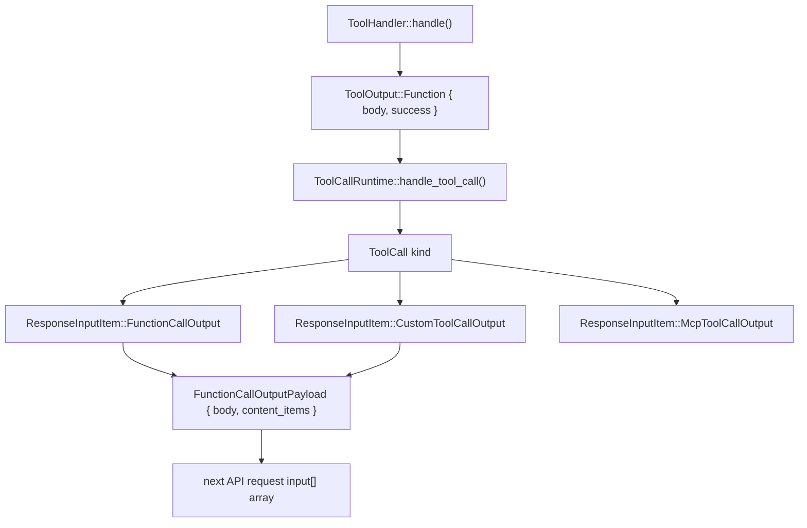

# 工具事件发射与输出

相关源文件

-   [codex-rs/app-server/src/command\_exec.rs](https://github.com/openai/codex/blob/d807d44a/codex-rs/app-server/src/command_exec.rs)
-   [codex-rs/core/src/context\_manager/history.rs](https://github.com/openai/codex/blob/d807d44a/codex-rs/core/src/context_manager/history.rs)
-   [codex-rs/core/src/context\_manager/history\_tests.rs](https://github.com/openai/codex/blob/d807d44a/codex-rs/core/src/context_manager/history_tests.rs)
-   [codex-rs/core/src/context\_manager/mod.rs](https://github.com/openai/codex/blob/d807d44a/codex-rs/core/src/context_manager/mod.rs)
-   [codex-rs/core/src/context\_manager/normalize.rs](https://github.com/openai/codex/blob/d807d44a/codex-rs/core/src/context_manager/normalize.rs)
-   [codex-rs/core/src/event\_mapping.rs](https://github.com/openai/codex/blob/d807d44a/codex-rs/core/src/event_mapping.rs)
-   [codex-rs/core/src/exec.rs](https://github.com/openai/codex/blob/d807d44a/codex-rs/core/src/exec.rs)
-   [codex-rs/core/src/sandboxing/mod.rs](https://github.com/openai/codex/blob/d807d44a/codex-rs/core/src/sandboxing/mod.rs)
-   [codex-rs/core/src/stream\_events\_utils.rs](https://github.com/openai/codex/blob/d807d44a/codex-rs/core/src/stream_events_utils.rs)
-   [codex-rs/core/src/stream\_events\_utils\_tests.rs](https://github.com/openai/codex/blob/d807d44a/codex-rs/core/src/stream_events_utils_tests.rs)
-   [codex-rs/core/src/tasks/user\_shell.rs](https://github.com/openai/codex/blob/d807d44a/codex-rs/core/src/tasks/user_shell.rs)
-   [codex-rs/core/src/tools/events.rs](https://github.com/openai/codex/blob/d807d44a/codex-rs/core/src/tools/events.rs)
-   [codex-rs/core/src/tools/handlers/shell.rs](https://github.com/openai/codex/blob/d807d44a/codex-rs/core/src/tools/handlers/shell.rs)
-   [codex-rs/core/src/tools/handlers/unified\_exec.rs](https://github.com/openai/codex/blob/d807d44a/codex-rs/core/src/tools/handlers/unified_exec.rs)
-   [codex-rs/core/src/tools/mod.rs](https://github.com/openai/codex/blob/d807d44a/codex-rs/core/src/tools/mod.rs)
-   [codex-rs/core/src/tools/orchestrator.rs](https://github.com/openai/codex/blob/d807d44a/codex-rs/core/src/tools/orchestrator.rs)
-   [codex-rs/core/src/tools/runtimes/apply\_patch.rs](https://github.com/openai/codex/blob/d807d44a/codex-rs/core/src/tools/runtimes/apply_patch.rs)
-   [codex-rs/core/src/tools/runtimes/mod.rs](https://github.com/openai/codex/blob/d807d44a/codex-rs/core/src/tools/runtimes/mod.rs)
-   [codex-rs/core/src/tools/runtimes/shell.rs](https://github.com/openai/codex/blob/d807d44a/codex-rs/core/src/tools/runtimes/shell.rs)
-   [codex-rs/core/src/tools/runtimes/unified\_exec.rs](https://github.com/openai/codex/blob/d807d44a/codex-rs/core/src/tools/runtimes/unified_exec.rs)
-   [codex-rs/core/src/tools/sandboxing.rs](https://github.com/openai/codex/blob/d807d44a/codex-rs/core/src/tools/sandboxing.rs)
-   [codex-rs/core/src/truncate.rs](https://github.com/openai/codex/blob/d807d44a/codex-rs/core/src/truncate.rs)
-   [codex-rs/core/src/unified\_exec/async\_watcher.rs](https://github.com/openai/codex/blob/d807d44a/codex-rs/core/src/unified_exec/async_watcher.rs)
-   [codex-rs/core/src/unified\_exec/errors.rs](https://github.com/openai/codex/blob/d807d44a/codex-rs/core/src/unified_exec/errors.rs)
-   [codex-rs/core/src/unified\_exec/mod.rs](https://github.com/openai/codex/blob/d807d44a/codex-rs/core/src/unified_exec/mod.rs)
-   [codex-rs/core/src/unified\_exec/process\_manager.rs](https://github.com/openai/codex/blob/d807d44a/codex-rs/core/src/unified_exec/process_manager.rs)
-   [codex-rs/core/tests/suite/exec.rs](https://github.com/openai/codex/blob/d807d44a/codex-rs/core/tests/suite/exec.rs)
-   [codex-rs/core/tests/suite/items.rs](https://github.com/openai/codex/blob/d807d44a/codex-rs/core/tests/suite/items.rs)
-   [codex-rs/core/tests/suite/shell\_serialization.rs](https://github.com/openai/codex/blob/d807d44a/codex-rs/core/tests/suite/shell_serialization.rs)
-   [codex-rs/core/tests/suite/tool\_harness.rs](https://github.com/openai/codex/blob/d807d44a/codex-rs/core/tests/suite/tool_harness.rs)
-   [codex-rs/core/tests/suite/tools.rs](https://github.com/openai/codex/blob/d807d44a/codex-rs/core/tests/suite/tools.rs)
-   [codex-rs/core/tests/suite/unified\_exec.rs](https://github.com/openai/codex/blob/d807d44a/codex-rs/core/tests/suite/unified_exec.rs)
-   [codex-rs/linux-sandbox/tests/suite/landlock.rs](https://github.com/openai/codex/blob/d807d44a/codex-rs/linux-sandbox/tests/suite/landlock.rs)
-   [codex-rs/protocol/src/items.rs](https://github.com/openai/codex/blob/d807d44a/codex-rs/protocol/src/items.rs)

## 目的与范围

本页介绍工具处理器的执行结果如何打包并返回给模型，以及生命周期事件如何广播到 UI。具体包括：

-   `ToolOutput`、`FunctionCallOutputBody` 与 `ResponseInputItem` —— 承载工具结果的类型。
-   `ToolEmitter` 与 `ToolEventCtx` —— 向 TUI 或 exec 模式发射开始/结束事件的工厂模式。
-   `UnifiedExecProcessManager` 及其用于流式输出的后台 `async_watcher` 任务。
-   每个工具族写入函数调用输出的精确文本格式。

关于工具处理器实现细节，参见 [Shell Execution Tools](/openai/codex/5.2-shell-execution-tools)、[Apply Patch System](/openai/codex/5.4-apply-patch-system) 与 [JavaScript REPL Tool](/openai/codex/5.8-code-mode-and-javascript-repl)。关于编排和沙箱选择，参见 [Tool Orchestration and Approval](/openai/codex/5.5-tool-orchestration-and-approval)。

---

## 核心输出类型

### `ToolOutput`

每个 `ToolHandler::handle()` 实现都会返回该输出枚举的一个变体。当前所有处理器使用的主要变体是：

```
ToolOutput::Function {    body: FunctionCallOutputBody,    success: Option<bool>,}
```
### `FunctionCallOutputBody`

该枚举选择模型响应的线格式：

| 变体 | 线格式表示 |
| --- | --- |
| `FunctionCallOutputBody::Text(String)` | `output` 字段是包含文本的 JSON 字符串。 |
| `FunctionCallOutputBody::ContentItems(Vec<FunctionCallOutputContentItem>)` | `output` 字段是结构化条目（例如图像）的 JSON 数组。 |

### `ResponseInputItem`

该线类型会追加到下一次 API 请求的 `input` 数组中，用于将工具结果映射回模型对话历史。

| 变体 | 用途 |
| --- | --- |
| `ResponseInputItem::FunctionCallOutput { call_id, output }` | 常规工具（`shell`、`shell_command`、`apply_patch`）。 |
| `ResponseInputItem::CustomToolCallOutput { call_id, output }` | `js_repl` 等专用工具。 |
| `ResponseInputItem::McpToolCallOutput { call_id, result }` | 通过 Model Context Protocol 提供的工具。 |

来源: [codex-rs/core/src/tools/handlers/shell.rs181-190](https://github.com/openai/codex/blob/d807d44a/codex-rs/core/src/tools/handlers/shell.rs#L181-L190) [codex-rs/core/src/tools/handlers/unified\_exec.rs120-130](https://github.com/openai/codex/blob/d807d44a/codex-rs/core/src/tools/handlers/unified_exec.rs#L120-L130) [codex-rs/protocol/src/models.rs13-18](https://github.com/openai/codex/blob/d807d44a/codex-rs/protocol/src/models.rs#L13-L18)

---

## 数据流：从 Handler 结果到 API 请求

该流水线会将原始工具结果转换为适用于模型下一轮提示的格式化条目。

**图：ToolOutput 到 ResponseInputItem 流水线**


来源: [codex-rs/core/src/tools/handlers/shell.rs425-440](https://github.com/openai/codex/blob/d807d44a/codex-rs/core/src/tools/handlers/shell.rs#L425-L440) [codex-rs/core/src/tools/handlers/unified\_exec.rs276-282](https://github.com/openai/codex/blob/d807d44a/codex-rs/core/src/tools/handlers/unified_exec.rs#L276-L282) [codex-rs/core/src/context\_manager/history.rs112-117](https://github.com/openai/codex/blob/d807d44a/codex-rs/core/src/context_manager/history.rs#L112-L117)

---

## 事件发射：`ToolEmitter`

每次工具执行都会通过 `Session::send_event` 向 UI 发射生命周期事件。`ToolEmitter` 枚举将这部分逻辑集中管理，确保不同工具实现中的事件字段保持一致。

### `ToolEmitter` 变体

| 变体 | 字段 | 发射事件 |
| --- | --- | --- |
| `ToolEmitter::Shell` | `command`, `cwd`, `source`, `parsed_cmd`, `freeform` | `ExecCommandBegin` / `ExecCommandEnd` |
| `ToolEmitter::ApplyPatch` | `changes`, `auto_approved` | `PatchApplyBegin` / `PatchApplyEnd` |
| `ToolEmitter::UnifiedExec` | `command`, `cwd`, `source`, `process_id` | `ExecCommandBegin` / `ExecCommandEnd` + 流式 delta |

### `ToolEventCtx`

用于事件发射的短生命周期上下文，保存所需引用：

```
pub(crate) struct ToolEventCtx<'a> {    pub session: &'a Session,    pub turn: &'a TurnContext,    pub call_id: &'a str,    pub turn_diff_tracker: Option<&'a SharedTurnDiffTracker>,}
```
来源: [codex-rs/core/src/tools/events.rs29-50](https://github.com/openai/codex/blob/d807d44a/codex-rs/core/src/tools/events.rs#L29-L50) [codex-rs/core/src/tools/events.rs90-109](https://github.com/openai/codex/blob/d807d44a/codex-rs/core/src/tools/events.rs#L90-L109)

---

## 生命周期事件时序

**图：按单次工具调用的事件时序**

> **[Mermaid sequence]**
> *(图表结构无法解析)*

来源: [codex-rs/core/src/tools/events.rs64-109](https://github.com/openai/codex/blob/d807d44a/codex-rs/core/src/tools/events.rs#L64-L109) [codex-rs/core/src/unified\_exec/process\_manager.rs191-193](https://github.com/openai/codex/blob/d807d44a/codex-rs/core/src/unified_exec/process_manager.rs#L191-L193) [codex-rs/core/src/unified\_exec/async\_watcher.rs45-55](https://github.com/openai/codex/blob/d807d44a/codex-rs/core/src/unified_exec/async_watcher.rs#L45-L55)

---

## Unified Exec：后台异步监视任务

Unified Exec 引入后台任务以处理可能跨多轮的长时运行进程。

### `start_streaming_output`

此函数会启动任务来监控 `UnifiedExecProcess` 输出缓冲区。随着 PTY 中数据到达，它会向 UI 实时发射 `ExecCommandOutputDelta` 事件。

### `spawn_exit_watcher`

此任务会等待进程终止。退出后它会：

1.  捕获最终退出码。
2.  发射 `ExecCommandEnd` 事件。
3.  在 `UnifiedExecProcessManager` 中清理进程资源。

来源: [codex-rs/core/src/unified\_exec/process\_manager.rs193-195](https://github.com/openai/codex/blob/d807d44a/codex-rs/core/src/unified_exec/process_manager.rs#L193-L195) [codex-rs/core/src/unified\_exec/async\_watcher.rs45-100](https://github.com/openai/codex/blob/d807d44a/codex-rs/core/src/unified_exec/async_watcher.rs#L45-L100) [codex-rs/core/src/unified\_exec/async\_watcher.rs130-150](https://github.com/openai/codex/blob/d807d44a/codex-rs/core/src/unified_exec/async_watcher.rs#L130-L150)

---

## 输出格式

### Shell 工具输出（两种模式）

`ToolEmitter::Shell` 上的 `freeform` 标志决定线格式。当会话配置设置 `include_apply_patch_tool` 时，该标志会启用。

**JSON 格式（`freeform = false`）：**

```
{"metadata":{"exit_code":0,"duration_seconds":0.123},"output":"hello\n"}
```
**纯文本格式（`freeform = true`）：**

```
Exit code: 0
Wall time: 0.1234 seconds
Output:
hello
```
来源: [codex-rs/core/tests/suite/shell\_serialization.rs174-213](https://github.com/openai/codex/blob/d807d44a/codex-rs/core/tests/suite/shell_serialization.rs#L174-L213) [codex-rs/core/tests/suite/shell\_serialization.rs283-334](https://github.com/openai/codex/blob/d807d44a/codex-rs/core/tests/suite/shell_serialization.rs#L283-L334)

### Unified Exec 输出：`format_response()`

`UnifiedExecProcessManager` 会根据进程是否结束来格式化 yield 响应。

**若进程在 yield 窗口后仍存活：**

```
Chunk ID: a3f0c1
Wall time: 0.2500 seconds
Process running with session ID 1000
Output:
partial output so far
```
**若进程已退出：**

```
Chunk ID: a3f0c1
Wall time: 1.2345 seconds
Process exited with code 0
Output:
hello from the process
```
来源: [codex-rs/core/src/tools/handlers/unified\_exec.rs310-337](https://github.com/openai/codex/blob/d807d44a/codex-rs/core/src/tools/handlers/unified_exec.rs#L310-L337) [codex-rs/core/tests/suite/unified\_exec.rs59-112](https://github.com/openai/codex/blob/d807d44a/codex-rs/core/tests/suite/unified_exec.rs#L59-L112)

---

## 输出大小上限与截断

为防止上下文窗口溢出，输出在返回给模型前会被限制。

| 常量 | 值 | 描述 |
| --- | --- | --- |
| `UNIFIED_EXEC_OUTPUT_MAX_BYTES` | 1 MiB | 内存中保留总字节数的硬上限。 |
| `DEFAULT_MAX_OUTPUT_TOKENS` | 10,000 | 单次工具响应的默认限制。 |
| `IO_DRAIN_TIMEOUT_MS` | 2,000 | 进程退出后排空管道的超时。 |

发生截断时，`HeadTailBuffer` 会确保输出开头和结尾都被保留，这对查看大日志末尾的错误消息至关重要。

来源: [codex-rs/core/src/unified\_exec/mod.rs54-66](https://github.com/openai/codex/blob/d807d44a/codex-rs/core/src/unified_exec/mod.rs#L54-L66) [codex-rs/core/src/exec.rs61-74](https://github.com/openai/codex/blob/d807d44a/codex-rs/core/src/exec.rs#L61-L74) [codex-rs/core/src/unified\_exec/process\_manager.rs48-52](https://github.com/openai/codex/blob/d807d44a/codex-rs/core/src/unified_exec/process_manager.rs#L48-L52)
