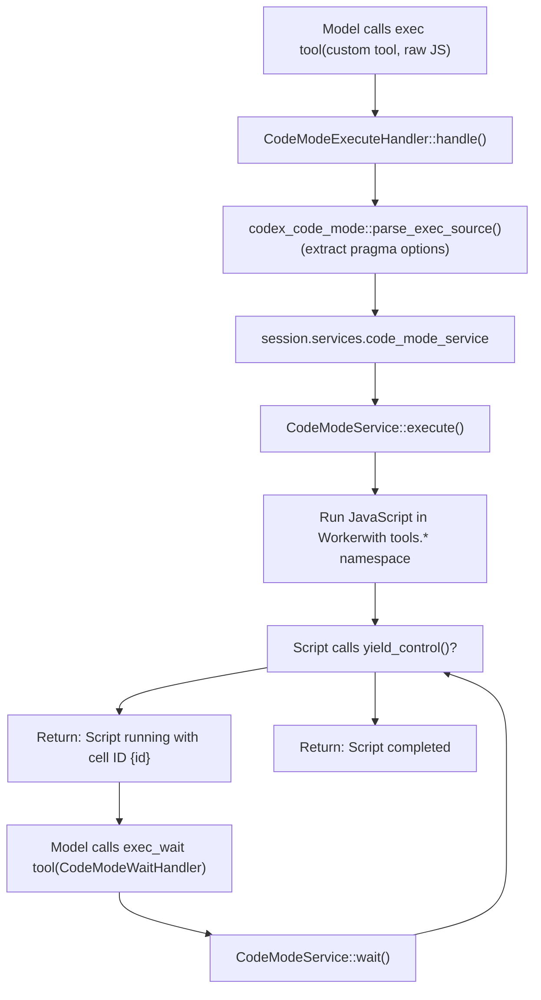
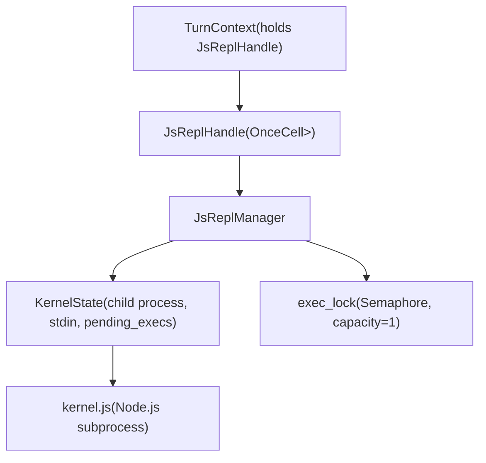

# 代码模式与 JavaScript REPL

相关源文件

-   [codex-rs/app-server-protocol/schema/typescript/v2/DynamicToolSpec.ts](https://github.com/openai/codex/blob/d807d44a/codex-rs/app-server-protocol/schema/typescript/v2/DynamicToolSpec.ts)
-   [codex-rs/app-server/tests/suite/v2/dynamic\_tools.rs](https://github.com/openai/codex/blob/d807d44a/codex-rs/app-server/tests/suite/v2/dynamic_tools.rs)
-   [codex-rs/core/src/project\_doc.rs](https://github.com/openai/codex/blob/d807d44a/codex-rs/core/src/project_doc.rs)
-   [codex-rs/core/src/project\_doc\_tests.rs](https://github.com/openai/codex/blob/d807d44a/codex-rs/core/src/project_doc_tests.rs)
-   [codex-rs/core/src/skills/render.rs](https://github.com/openai/codex/blob/d807d44a/codex-rs/core/src/skills/render.rs)
-   [codex-rs/core/src/tools/code\_mode/execute\_handler.rs](https://github.com/openai/codex/blob/d807d44a/codex-rs/core/src/tools/code_mode/execute_handler.rs)
-   [codex-rs/core/src/tools/code\_mode/mod.rs](https://github.com/openai/codex/blob/d807d44a/codex-rs/core/src/tools/code_mode/mod.rs)
-   [codex-rs/core/src/tools/code\_mode/wait\_handler.rs](https://github.com/openai/codex/blob/d807d44a/codex-rs/core/src/tools/code_mode/wait_handler.rs)
-   [codex-rs/core/src/tools/code\_mode\_description.rs](https://github.com/openai/codex/blob/d807d44a/codex-rs/core/src/tools/code_mode_description.rs)
-   [codex-rs/core/src/tools/code\_mode\_description\_tests.rs](https://github.com/openai/codex/blob/d807d44a/codex-rs/core/src/tools/code_mode_description_tests.rs)
-   [codex-rs/core/src/tools/js\_repl/kernel.js](https://github.com/openai/codex/blob/d807d44a/codex-rs/core/src/tools/js_repl/kernel.js)
-   [codex-rs/core/src/tools/js\_repl/mod.rs](https://github.com/openai/codex/blob/d807d44a/codex-rs/core/src/tools/js_repl/mod.rs)
-   [codex-rs/core/src/tools/js\_repl/mod\_tests.rs](https://github.com/openai/codex/blob/d807d44a/codex-rs/core/src/tools/js_repl/mod_tests.rs)
-   [codex-rs/core/tests/suite/code\_mode.rs](https://github.com/openai/codex/blob/d807d44a/codex-rs/core/tests/suite/code_mode.rs)
-   [codex-rs/core/tests/suite/js\_repl.rs](https://github.com/openai/codex/blob/d807d44a/codex-rs/core/tests/suite/js_repl.rs)
-   [codex-rs/protocol/src/dynamic\_tools.rs](https://github.com/openai/codex/blob/d807d44a/codex-rs/protocol/src/dynamic_tools.rs)
-   [docs/js\_repl.md](https://github.com/openai/codex/blob/d807d44a/docs/js_repl.md?plain=1)

本页记录了 Codex 中两个 JavaScript 执行系统：

1.  **代码模式**（`exec` / `exec_wait` 工具）——一种支持 yield/resume 语义与多会话并发的让渡式 JavaScript 执行环境。
2.  **JavaScript REPL**（`js_repl` / `js_repl_reset` 工具）——用于交互式 JavaScript 求值的持久化 Node.js 内核，具备有状态变量绑定。

两个系统都可通过嵌套工具调用运行可访问 Codex 工具的 JavaScript，但它们在执行模型、状态管理和使用场景上有所不同。

---

## 概览与特性门控

两个系统都由特性标志控制：

| Feature flag | Effect |
| --- | --- |
| `Feature::CodeMode` | 启用 `exec` 与 `exec_wait` 工具，用于让渡式 JavaScript 执行。 |
| `Feature::JsRepl` | 启用 `js_repl` 与 `js_repl_reset` 工具，并提供持久化 Node.js 内核。 |
| `Feature::JsReplToolsOnly` | 阻止除 `js_repl` / `js_repl_reset` 以外的所有直接模型工具调用；强制其他工具都通过 `codex.tool(...)`。 |

Sources: [codex-rs/core/src/tools/code\_mode/mod.rs34](https://github.com/openai/codex/blob/d807d44a/codex-rs/core/src/tools/code_mode/mod.rs#L34-L34) [codex-rs/core/src/project\_doc.rs44-46](https://github.com/openai/codex/blob/d807d44a/codex-rs/core/src/project_doc.rs#L44-L46) [codex-rs/core/src/project\_doc.rs66-70](https://github.com/openai/codex/blob/d807d44a/codex-rs/core/src/project_doc.rs#L66-L70)

---

## 代码模式系统

### 目的与架构

代码模式为 JavaScript 提供了**让渡式执行模型**，允许脚本长时间运行、将控制权让回模型，并通过 `cell_id` 管理在多轮之间保持执行状态。

**代码模式执行流程图**


Sources: [codex-rs/core/src/tools/code\_mode/execute\_handler.rs15-87](https://github.com/openai/codex/blob/d807d44a/codex-rs/core/src/tools/code_mode/execute_handler.rs#L15-L87) [codex-rs/core/src/tools/code\_mode/mod.rs50-106](https://github.com/openai/codex/blob/d807d44a/codex-rs/core/src/tools/code_mode/mod.rs#L50-L106) [codex-rs/core/src/tools/code\_mode/execute\_handler.rs25-26](https://github.com/openai/codex/blob/d807d44a/codex-rs/core/src/tools/code_mode/execute_handler.rs#L25-L26)

### 工具名称与注册

代码模式使用了两个以常量定义的工具名：

| Constant | Value | Tool Type | Purpose |
| --- | --- | --- | --- |
| `PUBLIC_TOOL_NAME` | `"exec"` | Custom/Freeform | 执行 JavaScript，可选 yield。 |
| `WAIT_TOOL_NAME` | `"exec_wait"` | Function | 恢复、轮询或终止一个已 yield 的 cell。 |

Sources: [codex-rs/core/src/tools/code\_mode/mod.rs40-42](https://github.com/openai/codex/blob/d807d44a/codex-rs/core/src/tools/code_mode/mod.rs#L40-L42)

### 基于 Pragma 的配置

代码模式支持通过第一行中的 pragma 注释进行内联配置，由 `codex_code_mode::parse_exec_source` 解析：

```
// @exec: {"max_output_tokens": 500, "yield_time_ms": 1000}text("Starting task...");yield_control();
```
Sources: [codex-rs/core/src/tools/code\_mode/execute\_handler.rs25-26](https://github.com/openai/codex/blob/d807d44a/codex-rs/core/src/tools/code_mode/execute_handler.rs#L25-L26) [codex-rs/core/src/tools/code\_mode/execute\_handler.rs40-47](https://github.com/openai/codex/blob/d807d44a/codex-rs/core/src/tools/code_mode/execute_handler.rs#L40-L47)

### 多会话与 Cell 管理

`CodeModeService` 管理并发执行的 cell。每个 cell 由返回给模型的 `cell_id` 标识。该服务使用在执行轮次间持久化并被替换的 `stored_values` 来维护状态。

Sources: [codex-rs/core/src/tools/code\_mode/mod.rs61-77](https://github.com/openai/codex/blob/d807d44a/codex-rs/core/src/tools/code_mode/mod.rs#L61-L77) [codex-rs/core/src/tools/code\_mode/execute\_handler.rs29-34](https://github.com/openai/codex/blob/d807d44a/codex-rs/core/src/tools/code_mode/execute_handler.rs#L29-L34)

---

## JavaScript REPL 工具

### 目的与范围

JavaScript REPL（`js_repl`）提供了一个**持久化 Node.js 内核**，可在会话内的多次工具调用之间维持变量绑定。

**js\_repl 内核架构图**


Sources: [codex-rs/core/src/tools/js\_repl/mod.rs65-101](https://github.com/openai/codex/blob/d807d44a/codex-rs/core/src/tools/js_repl/mod.rs#L65-L101) [codex-rs/core/src/tools/js\_repl/mod.rs117-125](https://github.com/openai/codex/blob/d807d44a/codex-rs/core/src/tools/js_repl/mod.rs#L117-L125)

### 主机-内核通信

Rust 主机与 Node.js 内核通过 `stdin`/`stdout` 上的**换行分隔 JSON**进行通信。内核使用 VM 上下文与自定义 ESM “cell” 模型来持久化绑定。

**js\_repl 协议消息流图**

> **[Mermaid sequence]**
> *(图表结构无法解析)*

Sources: [codex-rs/core/src/tools/js\_repl/mod.rs117-125](https://github.com/openai/codex/blob/d807d44a/codex-rs/core/src/tools/js_repl/mod.rs#L117-L125) [codex-rs/core/src/tools/js\_repl/kernel.js1-50](https://github.com/openai/codex/blob/d807d44a/codex-rs/core/src/tools/js_repl/kernel.js#L1-L50)

### 绑定持久化与 Meriyah

内核使用内置的 **Meriyah** 解析器分析每个片段的 AST，并提取顶层声明（`const`、`let`、`var`、`function`、`class`）。这些名称会从当前“cell”导出并被下一个 cell 导入，从而保持 REPL 状态。

Sources: [codex-rs/core/src/tools/js\_repl/kernel.js18-21](https://github.com/openai/codex/blob/d807d44a/codex-rs/core/src/tools/js_repl/kernel.js#L18-L21) [codex-rs/core/src/tools/js\_repl/kernel.js79-94](https://github.com/openai/codex/blob/d807d44a/codex-rs/core/src/tools/js_repl/kernel.js#L79-L94) [codex-rs/core/src/tools/js\_repl/mod.rs53](https://github.com/openai/codex/blob/d807d44a/codex-rs/core/src/tools/js_repl/mod.rs#L53-L53)

### 辅助 API 与模块解析

`js_repl` 环境暴露了一个 `codex` 全局对象，包含若干辅助能力：

-   `codex.tool(name, args?)`：执行一次 Codex 工具调用。
-   `codex.emitImage(imageLike)`：向输出发送图像。
-   `codex.cwd`, `codex.homeDir`, `codex.tmpDir`：路径信息。

**模块解析顺序：**

1.  `CODEX_JS_REPL_NODE_MODULE_DIRS` 环境变量。
2.  配置中的 `js_repl_node_module_dirs`。
3.  线程工作目录（cwd）。

Sources: [codex-rs/core/src/project\_doc.rs54-57](https://github.com/openai/codex/blob/d807d44a/codex-rs/core/src/project_doc.rs#L54-L57) [docs/js\_repl.md42-51](https://github.com/openai/codex/blob/d807d44a/docs/js_repl.md?plain=1#L42-L51) [codex-rs/core/src/tools/js\_repl/kernel.js135-160](https://github.com/openai/codex/blob/d807d44a/codex-rs/core/src/tools/js_repl/kernel.js#L135-L160)

### 诊断与安全性

系统会捕获 `stderr` 的滚动尾部用于诊断（限制为 20 行 / 4KB）。若内核失败，会向模型返回 JSON 编码的诊断块。

| Constant | Value |
| --- | --- |
| `JS_REPL_STDERR_TAIL_LINE_LIMIT` | 20 |
| `JS_REPL_STDERR_TAIL_MAX_BYTES` | 4,096 |

Sources: [codex-rs/core/src/tools/js\_repl/mod.rs55-57](https://github.com/openai/codex/blob/d807d44a/codex-rs/core/src/tools/js_repl/mod.rs#L55-L57) [codex-rs/core/src/tools/js\_repl/mod\_tests.rs80-127](https://github.com/openai/codex/blob/d807d44a/codex-rs/core/src/tools/js_repl/mod_tests.rs#L80-L127)

---

## 日志记录

`js_repl` 内部的嵌套工具调用会发出结构化日志事件：

-   `info`：有界摘要（响应类型、条目计数）。
-   `trace`：完整原始响应 JSON。

Sources: [codex-rs/core/src/tools/js\_repl/mod.rs456-489](https://github.com/openai/codex/blob/d807d44a/codex-rs/core/src/tools/js_repl/mod.rs#L456-L489) [docs/js\_repl.md95-103](https://github.com/openai/codex/blob/d807d44a/docs/js_repl.md?plain=1#L95-L103)
