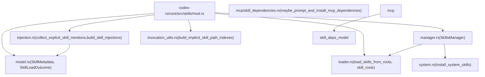
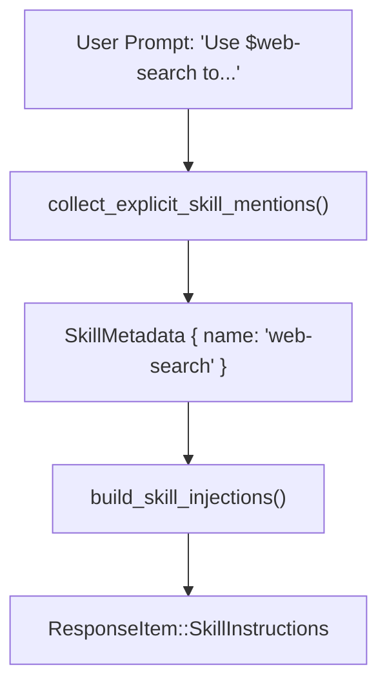
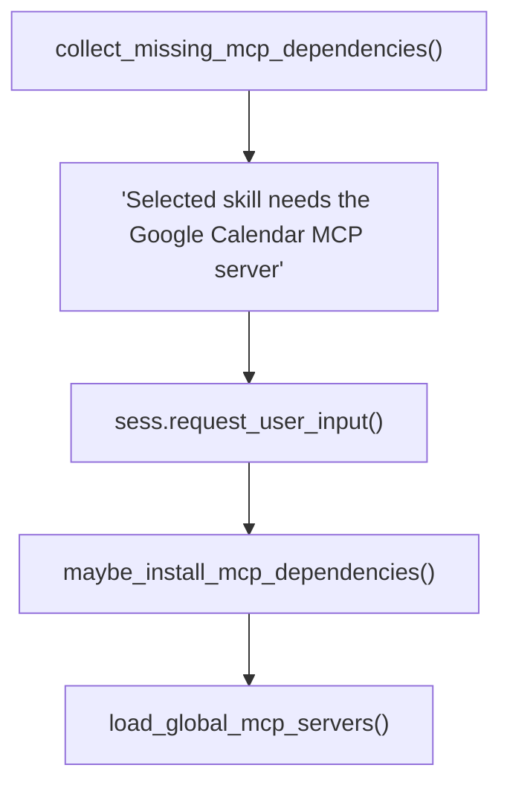

# 技能系统

相关源文件

-   [codex-rs/core/src/apps/render.rs](https://github.com/openai/codex/blob/d807d44a/codex-rs/core/src/apps/render.rs)
-   [codex-rs/core/src/arc\_monitor.rs](https://github.com/openai/codex/blob/d807d44a/codex-rs/core/src/arc_monitor.rs)
-   [codex-rs/core/src/arc\_monitor\_tests.rs](https://github.com/openai/codex/blob/d807d44a/codex-rs/core/src/arc_monitor_tests.rs)
-   [codex-rs/core/src/consequential\_tool\_message\_templates.json](https://github.com/openai/codex/blob/d807d44a/codex-rs/core/src/consequential_tool_message_templates.json)
-   [codex-rs/core/src/mcp/mod\_tests.rs](https://github.com/openai/codex/blob/d807d44a/codex-rs/core/src/mcp/mod_tests.rs)
-   [codex-rs/core/src/mcp/skill\_dependencies.rs](https://github.com/openai/codex/blob/d807d44a/codex-rs/core/src/mcp/skill_dependencies.rs)
-   [codex-rs/core/src/mcp\_tool\_approval\_templates.rs](https://github.com/openai/codex/blob/d807d44a/codex-rs/core/src/mcp_tool_approval_templates.rs)
-   [codex-rs/core/src/mcp\_tool\_call.rs](https://github.com/openai/codex/blob/d807d44a/codex-rs/core/src/mcp_tool_call.rs)
-   [codex-rs/core/src/mcp\_tool\_call\_tests.rs](https://github.com/openai/codex/blob/d807d44a/codex-rs/core/src/mcp_tool_call_tests.rs)
-   [codex-rs/core/src/mention\_syntax.rs](https://github.com/openai/codex/blob/d807d44a/codex-rs/core/src/mention_syntax.rs)
-   [codex-rs/core/src/mentions.rs](https://github.com/openai/codex/blob/d807d44a/codex-rs/core/src/mentions.rs)
-   [codex-rs/core/src/plugins/injection.rs](https://github.com/openai/codex/blob/d807d44a/codex-rs/core/src/plugins/injection.rs)
-   [codex-rs/core/src/plugins/render.rs](https://github.com/openai/codex/blob/d807d44a/codex-rs/core/src/plugins/render.rs)
-   [codex-rs/core/src/plugins/render\_tests.rs](https://github.com/openai/codex/blob/d807d44a/codex-rs/core/src/plugins/render_tests.rs)
-   [codex-rs/core/src/skills/injection.rs](https://github.com/openai/codex/blob/d807d44a/codex-rs/core/src/skills/injection.rs)
-   [codex-rs/core/src/skills/invocation\_utils.rs](https://github.com/openai/codex/blob/d807d44a/codex-rs/core/src/skills/invocation_utils.rs)
-   [codex-rs/core/src/skills/loader.rs](https://github.com/openai/codex/blob/d807d44a/codex-rs/core/src/skills/loader.rs)
-   [codex-rs/core/src/skills/manager.rs](https://github.com/openai/codex/blob/d807d44a/codex-rs/core/src/skills/manager.rs)
-   [codex-rs/core/src/skills/manager\_tests.rs](https://github.com/openai/codex/blob/d807d44a/codex-rs/core/src/skills/manager_tests.rs)
-   [codex-rs/core/src/skills/mod.rs](https://github.com/openai/codex/blob/d807d44a/codex-rs/core/src/skills/mod.rs)
-   [codex-rs/core/src/skills/model.rs](https://github.com/openai/codex/blob/d807d44a/codex-rs/core/src/skills/model.rs)
-   [codex-rs/core/src/tools/discoverable.rs](https://github.com/openai/codex/blob/d807d44a/codex-rs/core/src/tools/discoverable.rs)
-   [codex-rs/core/src/tools/handlers/tool\_suggest.rs](https://github.com/openai/codex/blob/d807d44a/codex-rs/core/src/tools/handlers/tool_suggest.rs)
-   [codex-rs/core/src/turn\_metadata\_tests.rs](https://github.com/openai/codex/blob/d807d44a/codex-rs/core/src/turn_metadata_tests.rs)
-   [codex-rs/core/templates/search\_tool/tool\_description.md](https://github.com/openai/codex/blob/d807d44a/codex-rs/core/templates/search_tool/tool_description.md?plain=1)
-   [codex-rs/core/tests/common/apps\_test\_server.rs](https://github.com/openai/codex/blob/d807d44a/codex-rs/core/tests/common/apps_test_server.rs)
-   [codex-rs/core/tests/suite/plugins.rs](https://github.com/openai/codex/blob/d807d44a/codex-rs/core/tests/suite/plugins.rs)
-   [codex-rs/core/tests/suite/search\_tool.rs](https://github.com/openai/codex/blob/d807d44a/codex-rs/core/tests/suite/search_tool.rs)
-   [codex-rs/tui/src/bottom\_pane/mcp\_server\_elicitation.rs](https://github.com/openai/codex/blob/d807d44a/codex-rs/tui/src/bottom_pane/mcp_server_elicitation.rs)
-   [codex-rs/tui/src/bottom\_pane/snapshots/codex\_tui\_\_bottom\_pane\_\_mcp\_server\_elicitation\_\_tests\_\_mcp\_server\_elicitation\_approval\_form\_with\_param\_summary.snap](https://github.com/openai/codex/blob/d807d44a/codex-rs/tui/src/bottom_pane/snapshots/codex_tui__bottom_pane__mcp_server_elicitation__tests__mcp_server_elicitation_approval_form_with_param_summary.snap)
-   [codex-rs/tui/src/bottom\_pane/snapshots/codex\_tui\_\_bottom\_pane\_\_mcp\_server\_elicitation\_\_tests\_\_mcp\_server\_elicitation\_approval\_form\_with\_session\_persist.snap](https://github.com/openai/codex/blob/d807d44a/codex-rs/tui/src/bottom_pane/snapshots/codex_tui__bottom_pane__mcp_server_elicitation__tests__mcp_server_elicitation_approval_form_with_session_persist.snap)
-   [codex-rs/tui/src/bottom\_pane/snapshots/codex\_tui\_\_bottom\_pane\_\_mcp\_server\_elicitation\_\_tests\_\_mcp\_server\_elicitation\_approval\_form\_without\_schema.snap](https://github.com/openai/codex/blob/d807d44a/codex-rs/tui/src/bottom_pane/snapshots/codex_tui__bottom_pane__mcp_server_elicitation__tests__mcp_server_elicitation_approval_form_without_schema.snap)
-   [codex-rs/tui/src/chatwidget/skills.rs](https://github.com/openai/codex/blob/d807d44a/codex-rs/tui/src/chatwidget/skills.rs)
-   [codex-rs/tui/src/mention\_codec.rs](https://github.com/openai/codex/blob/d807d44a/codex-rs/tui/src/mention_codec.rs)

本页记录了 `codex-core` 中的技能系统：技能如何在磁盘上定义、在运行时发现、注入到模型提示中，以及其沙箱权限如何被编译与强制执行。它还涵盖了当技能需要外部 MCP 服务器时触发的 MCP 依赖安装流水线。

关于 MCP 服务器本身的细节，参见 [6.2 MCP Connection Manager](https://github.com/openai/codex/blob/d807d44a/6.2 MCP Connection Manager)；关于 TUI 如何展示技能选择器覆盖层，参见 [4.1.5 Interactive Overlays and Popups](https://github.com/openai/codex/blob/d807d44a/4.1.5 Interactive Overlays and Popups)；关于沙箱强制机制，参见 [5.6 Sandboxing Implementation](https://github.com/openai/codex/blob/d807d44a/5.6 Sandboxing Implementation)

---

## 概览

技能是可复用的指令文档，用户可在提示中引用（例如 `$my-skill`），以将精编指令注入模型上下文。每个技能存储为一个目录，其中包含带 YAML frontmatter 头的 `SKILL.md` 文件，并可选包含 `agents/openai.yaml` 元数据文件。系统负责：

-   **发现** —— 按作用域（Repo、User、System、Admin）扫描文件系统根目录。
-   **解析** —— 提取 frontmatter、元数据和权限配置。
-   **注入** —— 将技能内容作为 `ResponseItem` 插入模型提示。
-   **权限编译** —— 将技能的 `PermissionProfile` 转换为 `SandboxPolicy`。
-   **MCP 依赖管理** —— 安装技能声明但缺失的 MCP 服务器。

---

## 关键数据结构

所有核心类型定义于 [codex-rs/core/src/skills/model.rs](https://github.com/openai/codex/blob/d807d44a/codex-rs/core/src/skills/model.rs)

| 类型 | 角色 |
| --- | --- |
| `SkillMetadata` | 单个技能的完整解析表示（名称、描述、路径、作用域、权限等）。 |
| `SkillLoadOutcome` | 一次扫描的结果：`SkillMetadata` 列表、错误、禁用路径与隐式调用索引。 |
| `SkillInterface` | 可选 UI 显示字段（显示名、图标路径、品牌色、默认提示）。 |
| `SkillDependencies` | `SkillToolDependency` 条目列表，声明所需 MCP 或其他工具后端。 |
| `SkillToolDependency` | 单个依赖条目：类型、值、传输方式、命令、URL。 |
| `SkillPolicy` | 策略标志：当前为 `allow_implicit_invocation` 与产品限制。 |
| `SkillError` | 带路径和消息的解析失败。 |

`SkillScope`（来自 `codex-protocol`）控制去重时的优先级：

| Scope | 含义 |
| --- | --- |
| `Repo` | 项目级（`.codex/skills/` 或 `.agents/skills/`）。 |
| `User` | 用户级（`$CODEX_HOME/skills/` 或 `$HOME/.agents/skills/`）。 |
| `System` | 缓存在 `$CODEX_HOME/skills/.system` 中的内置系统技能。 |
| `Admin` | 系统范围（`/etc/codex/skills/`）。 |

Sources: [codex-rs/core/src/skills/model.rs24-132](https://github.com/openai/codex/blob/d807d44a/codex-rs/core/src/skills/model.rs#L24-L132) [codex-rs/core/src/skills/loader.rs198-206](https://github.com/openai/codex/blob/d807d44a/codex-rs/core/src/skills/loader.rs#L198-L206)

---

## 模块结构

**技能系统模块图：**


Sources: [codex-rs/core/src/skills/mod.rs1-25](https://github.com/openai/codex/blob/d807d44a/codex-rs/core/src/skills/mod.rs#L1-L25)

---

## 技能文件格式

每个技能都是一个目录，必须包含 `SKILL.md`，可选包含 `agents/openai.yaml`。

**`SKILL.md` 结构：** 加载器会提取由 `---` 分隔的 YAML frontmatter [codex-rs/core/src/skills/loader.rs165-168](https://github.com/openai/codex/blob/d807d44a/codex-rs/core/src/skills/loader.rs#L165-L168)

```
---name: my-skilldescription: A short description of what this skill does.metadata:  short-description: Even shorter blurb--- # Full Skill Instructions...full markdown instructions for the model...
```
**`agents/openai.yaml` 结构**（可选元数据）：该文件为工具和权限提供结构化配置 [codex-rs/core/src/skills/loader.rs58-67](https://github.com/openai/codex/blob/d807d44a/codex-rs/core/src/skills/loader.rs#L58-L67)

```
interface:  display_name: My Skill  brand_color: "#3A86FF"  default_prompt: "Use $my-skill to..." dependencies:  tools:    - type: mcp      value: my-mcp-server      transport: stdio      command: "npx my-mcp-server" policy:  allow_implicit_invocation: true permissions:  file_system:    read: ["./data"]    write: ["./output"]  network:    enabled: true    allowed_domains: ["example.com"]
```
解析时强制执行的字段长度限制：

-   `MAX_NAME_LEN`: 64 [codex-rs/core/src/skills/loader.rs138](https://github.com/openai/codex/blob/d807d44a/codex-rs/core/src/skills/loader.rs#L138-L138)
-   `MAX_DESCRIPTION_LEN`: 1024 [codex-rs/core/src/skills/loader.rs139](https://github.com/openai/codex/blob/d807d44a/codex-rs/core/src/skills/loader.rs#L139-L139)

---

## 发现与加载

### 技能根目录

[codex-rs/core/src/skills/loader.rs218-223](https://github.com/openai/codex/blob/d807d44a/codex-rs/core/src/skills/loader.rs#L218-L223) 中的 `skill_roots()` 决定要扫描哪些文件系统目录。它包括来自 `ConfigLayerStack` 的路径、当前工作目录，以及由 `PluginsManager` 提供的任意根目录 [codex-rs/core/src/skills/manager.rs101-112](https://github.com/openai/codex/blob/d807d44a/codex-rs/core/src/skills/manager.rs#L101-L112)

### 发现流程

`load_skills_from_roots()` 会遍历所有给定根目录并执行广度优先搜索（BFS） [codex-rs/core/src/skills/loader.rs184-216](https://github.com/openai/codex/blob/d807d44a/codex-rs/core/src/skills/loader.rs#L184-L216)

-   **深度限制**：遍历在 `MAX_SCAN_DEPTH = 6` 处停止 [codex-rs/core/src/skills/loader.rs149](https://github.com/openai/codex/blob/d807d44a/codex-rs/core/src/skills/loader.rs#L149-L149)
-   **去重**：技能按其 `SKILL.md` 路径去重，优先级更高的作用域（Repo > User > System > Admin）胜出 [codex-rs/core/src/skills/loader.rs193-213](https://github.com/openai/codex/blob/d807d44a/codex-rs/core/src/skills/loader.rs#L193-L213)

### 解析流水线

`parse_skill_file()` [codex-rs/core/src/skills/loader.rs497](https://github.com/openai/codex/blob/d807d44a/codex-rs/core/src/skills/loader.rs#L497-L497) 会执行以下步骤：

1.  从 `SKILL.md` 提取 YAML frontmatter。
2.  使用 `load_skill_metadata()` 从 `agents/openai.yaml` 加载可选元数据。
3.  确定技能名（使用 frontmatter 中的 `name`，若缺失则使用目录名）。
4.  通过 `plugin_namespace_for_skill_path()` 处理插件命名空间 [codex-rs/core/src/skills/loader.rs6](https://github.com/openai/codex/blob/d807d44a/codex-rs/core/src/skills/loader.rs#L6-L6)

---

## SkillsManager

`SkillsManager` [codex-rs/core/src/skills/manager.rs31](https://github.com/openai/codex/blob/d807d44a/codex-rs/core/src/skills/manager.rs#L31-L31) 是技能生命周期的中央协调器。它维护按当前工作目录（`cache_by_cwd`）和特定配置状态（`cache_by_config`）双键索引的缓存，以确保会话级覆盖不会串扰 [codex-rs/core/src/skills/manager.rs35-36](https://github.com/openai/codex/blob/d807d44a/codex-rs/core/src/skills/manager.rs#L35-L36)


Sources: [codex-rs/core/src/skills/manager.rs31-112](https://github.com/openai/codex/blob/d807d44a/codex-rs/core/src/skills/manager.rs#L31-L112)

---

## 注入到提示中的技能

### Mention 解析

`collect_explicit_skill_mentions()` [codex-rs/core/src/skills/injection.rs100](https://github.com/openai/codex/blob/d807d44a/codex-rs/core/src/skills/injection.rs#L100-L100) 用于识别用户希望激活哪些技能：

1.  **结构化 Mention**：`UserInput::Skill` 中显式选择的技能 [codex-rs/core/src/skills/injection.rs120](https://github.com/openai/codex/blob/d807d44a/codex-rs/core/src/skills/injection.rs#L120-L120)
2.  **文本 Mention**：扫描 `UserInput::Text` 中的 `$name` 或 `skill://` 模式 [codex-rs/core/src/skills/injection.rs139-140](https://github.com/openai/codex/blob/d807d44a/codex-rs/core/src/skills/injection.rs#L139-L140)

### 内容注入

`build_skill_injections()` [codex-rs/core/src/skills/injection.rs24](https://github.com/openai/codex/blob/d807d44a/codex-rs/core/src/skills/injection.rs#L24-L24) 会异步读取被提及技能的 markdown 内容，并将其转换为 `ResponseItem::SkillInstructions` [codex-rs/core/src/skills/injection.rs50-54](https://github.com/openai/codex/blob/d807d44a/codex-rs/core/src/skills/injection.rs#L50-L54) 这使 LLM 能将这些指令“看作”对话历史的一部分。


Sources: [codex-rs/core/src/skills/injection.rs24-153](https://github.com/openai/codex/blob/d807d44a/codex-rs/core/src/skills/injection.rs#L24-L153)

---

## 隐式调用与工具

当代理使用与技能自有资源交互的工具时，技能可以被隐式调用。

### 隐式检测

`build_implicit_skill_path_indexes()` [codex-rs/core/src/skills/invocation\_utils.rs16](https://github.com/openai/codex/blob/d807d44a/codex-rs/core/src/skills/invocation_utils.rs#L16-L16) 会将脚本目录和文档路径映射到技能。这样系统就能检测到某个工具调用（如 `python .agents/skills/my-skill/scripts/run.py`）实际上是在使用某个技能。

### MCP 依赖管理

如果某技能需要尚未安装的 MCP 服务器，`maybe_prompt_and_install_mcp_dependencies()` [codex-rs/core/src/mcp/skill\_dependencies.rs136](https://github.com/openai/codex/blob/d807d44a/codex-rs/core/src/mcp/skill_dependencies.rs#L136-L136) 会触发：

1.  通过 `collect_missing_mcp_dependencies()` 识别缺失依赖 [codex-rs/core/src/mcp/skill\_dependencies.rs157](https://github.com/openai/codex/blob/d807d44a/codex-rs/core/src/mcp/skill_dependencies.rs#L157-L157)
2.  使用 `RequestUserInput` 向用户请求安装 [codex-rs/core/src/mcp/skill\_dependencies.rs103](https://github.com/openai/codex/blob/d807d44a/codex-rs/core/src/mcp/skill_dependencies.rs#L103-L103)
3.  若获批准，则更新全局配置并在需要时执行 OAuth 登录 [codex-rs/core/src/mcp/skill\_dependencies.rs218-245](https://github.com/openai/codex/blob/d807d44a/codex-rs/core/src/mcp/skill_dependencies.rs#L218-L245)


Sources: [codex-rs/core/src/mcp/skill\_dependencies.rs136-245](https://github.com/openai/codex/blob/d807d44a/codex-rs/core/src/mcp/skill_dependencies.rs#L136-L245)

---

## TUI 集成

TUI 通过 `ChatWidget` 提供技能的交互式管理：

-   **发现**：使用 `set_skills_from_response()` 根据 core 事件更新本地状态 [codex-rs/tui/src/chatwidget/skills.rs140](https://github.com/openai/codex/blob/d807d44a/codex-rs/tui/src/chatwidget/skills.rs#L140-L140)
-   **管理**：`open_manage_skills_popup()` 显示 `SkillsToggleView`，允许用户启用/禁用技能 [codex-rs/tui/src/chatwidget/skills.rs62-95](https://github.com/openai/codex/blob/d807d44a/codex-rs/tui/src/chatwidget/skills.rs#L62-L95)
-   **可视化**：使用 `skill_display_name` 与 `skill_description` 辅助函数渲染菜单 [codex-rs/tui/src/chatwidget/skills.rs79-80](https://github.com/openai/codex/blob/d807d44a/codex-rs/tui/src/chatwidget/skills.rs#L79-L80)

Sources: [codex-rs/tui/src/chatwidget/skills.rs1-145](https://github.com/openai/codex/blob/d807d44a/codex-rs/tui/src/chatwidget/skills.rs#L1-L145)
