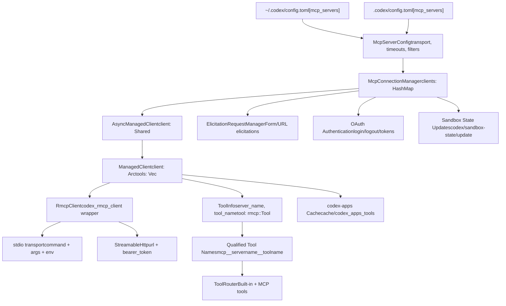

# 模型上下文协议（MCP）

相关源文件

-   [codex-rs/app-server/tests/suite/v2/mcp\_server\_elicitation.rs](https://github.com/openai/codex/blob/d807d44a/codex-rs/app-server/tests/suite/v2/mcp_server_elicitation.rs)
-   [codex-rs/cli/src/mcp\_cmd.rs](https://github.com/openai/codex/blob/d807d44a/codex-rs/cli/src/mcp_cmd.rs)
-   [codex-rs/cli/tests/mcp\_add\_remove.rs](https://github.com/openai/codex/blob/d807d44a/codex-rs/cli/tests/mcp_add_remove.rs)
-   [codex-rs/cli/tests/mcp\_list.rs](https://github.com/openai/codex/blob/d807d44a/codex-rs/cli/tests/mcp_list.rs)
-   [codex-rs/core/src/mcp\_connection\_manager.rs](https://github.com/openai/codex/blob/d807d44a/codex-rs/core/src/mcp_connection_manager.rs)
-   [codex-rs/core/src/mcp\_connection\_manager\_tests.rs](https://github.com/openai/codex/blob/d807d44a/codex-rs/core/src/mcp_connection_manager_tests.rs)
-   [codex-rs/core/src/state/session.rs](https://github.com/openai/codex/blob/d807d44a/codex-rs/core/src/state/session.rs)
-   [codex-rs/core/src/state/turn.rs](https://github.com/openai/codex/blob/d807d44a/codex-rs/core/src/state/turn.rs)
-   [codex-rs/core/src/tasks/mod.rs](https://github.com/openai/codex/blob/d807d44a/codex-rs/core/src/tasks/mod.rs)
-   [codex-rs/core/src/tools/handlers/tool\_search\_tests.rs](https://github.com/openai/codex/blob/d807d44a/codex-rs/core/src/tools/handlers/tool_search_tests.rs)
-   [codex-rs/core/tests/suite/rmcp\_client.rs](https://github.com/openai/codex/blob/d807d44a/codex-rs/core/tests/suite/rmcp_client.rs)
-   [codex-rs/core/tests/suite/truncation.rs](https://github.com/openai/codex/blob/d807d44a/codex-rs/core/tests/suite/truncation.rs)
-   [codex-rs/core/tests/suite/user\_shell\_cmd.rs](https://github.com/openai/codex/blob/d807d44a/codex-rs/core/tests/suite/user_shell_cmd.rs)
-   [codex-rs/exec/src/main.rs](https://github.com/openai/codex/blob/d807d44a/codex-rs/exec/src/main.rs)
-   [codex-rs/mcp-server/Cargo.toml](https://github.com/openai/codex/blob/d807d44a/codex-rs/mcp-server/Cargo.toml)
-   [codex-rs/mcp-server/src/codex\_tool\_config.rs](https://github.com/openai/codex/blob/d807d44a/codex-rs/mcp-server/src/codex_tool_config.rs)
-   [codex-rs/mcp-server/src/lib.rs](https://github.com/openai/codex/blob/d807d44a/codex-rs/mcp-server/src/lib.rs)
-   [codex-rs/mcp-server/src/main.rs](https://github.com/openai/codex/blob/d807d44a/codex-rs/mcp-server/src/main.rs)
-   [codex-rs/mcp-server/src/message\_processor.rs](https://github.com/openai/codex/blob/d807d44a/codex-rs/mcp-server/src/message_processor.rs)
-   [codex-rs/mcp-server/src/outgoing\_message.rs](https://github.com/openai/codex/blob/d807d44a/codex-rs/mcp-server/src/outgoing_message.rs)
-   [codex-rs/mcp-server/tests/common/Cargo.toml](https://github.com/openai/codex/blob/d807d44a/codex-rs/mcp-server/tests/common/Cargo.toml)
-   [codex-rs/mcp-server/tests/common/lib.rs](https://github.com/openai/codex/blob/d807d44a/codex-rs/mcp-server/tests/common/lib.rs)
-   [codex-rs/mcp-server/tests/common/mcp\_process.rs](https://github.com/openai/codex/blob/d807d44a/codex-rs/mcp-server/tests/common/mcp_process.rs)
-   [codex-rs/mcp-server/tests/suite/mod.rs](https://github.com/openai/codex/blob/d807d44a/codex-rs/mcp-server/tests/suite/mod.rs)
-   [codex-rs/rmcp-client/src/rmcp\_client.rs](https://github.com/openai/codex/blob/d807d44a/codex-rs/rmcp-client/src/rmcp_client.rs)
-   [codex-rs/rmcp-client/tests/streamable\_http\_recovery.rs](https://github.com/openai/codex/blob/d807d44a/codex-rs/rmcp-client/tests/streamable_http_recovery.rs)
-   [codex-rs/tui/src/main.rs](https://github.com/openai/codex/blob/d807d44a/codex-rs/tui/src/main.rs)

模型上下文协议（MCP）系统使 Codex 能够与外部工具服务器集成，将其能力扩展到内置工具之外。MCP 服务器会暴露工具、资源与提示，代理可在对话轮次中调用。本文档覆盖 MCP 服务器配置、连接管理、工具发现、认证与 CLI 命令。

关于内置工具执行的信息，参见 [Tool System](/openai/codex/5-tool-system)。关于通用配置管理，参见 [Configuration System](/openai/codex/2.2-configuration-system)。

---

## 概览

MCP 集成由三个主要子系统构成：

1.  **连接管理** - 管理每个已配置服务器对应的 `RmcpClient` 实例生命周期。
2.  **工具聚合** - 发现、限定并将工具调用路由到合适服务器。
3.  **认证** - 处理需要授权的服务器 OAuth 流程。

MCP 服务器可在 `~/.codex/config.toml` 中全局配置，也可在 `.codex/config.toml` 中按项目配置，均位于 `[mcp_servers]` 表下。每个服务器独立运行，拥有自己的传输方式（stdio 或 HTTP）、超时设置和工具过滤器。

---

## 系统架构

### MCP 集成概览

下图展示 `McpConnectionManager` 如何通过 `rmcp` 协议，将 Codex 会话逻辑桥接到外部 MCP 服务器。

**Sources:** [codex-rs/core/src/mcp\_connection\_manager.rs1-100](https://github.com/openai/codex/blob/d807d44a/codex-rs/core/src/mcp_connection_manager.rs#L1-L100) [codex-rs/core/src/config/types.rs](https://github.com/openai/codex/blob/d807d44a/codex-rs/core/src/config/types.rs) [codex-rs/rmcp-client/src/rmcp\_client.rs44-55](https://github.com/openai/codex/blob/d807d44a/codex-rs/rmcp-client/src/rmcp_client.rs#L44-L55)

`McpConnectionManager` 为每个已配置服务器持有一个 `RmcpClient` [codex-rs/core/src/mcp\_connection\_manager.rs3-7](https://github.com/openai/codex/blob/d807d44a/codex-rs/core/src/mcp_connection_manager.rs#L3-L7) 每个客户端都封装在 `AsyncManagedClient` 中，用于处理异步启动，并在初始化完成前从缓存提供启动快照 [codex-rs/core/src/mcp\_connection\_manager.rs634-650](https://github.com/openai/codex/blob/d807d44a/codex-rs/core/src/mcp_connection_manager.rs#L634-L650)

---

## MCP 服务器配置

### 配置结构

MCP 服务器使用 `McpServerConfig` 结构定义，包含传输细节与执行策略。

**Sources:** [codex-rs/core/src/config/types.rs](https://github.com/openai/codex/blob/d807d44a/codex-rs/core/src/config/types.rs)

### 传输类型

#### stdio 传输

通过命令行启动子进程。

-   **字段：** `command`、`args`、`env`、`env_vars`、`cwd`。

**Sources:** [codex-rs/core/src/config/types.rs](https://github.com/openai/codex/blob/d807d44a/codex-rs/core/src/config/types.rs) [codex-rs/core/tests/suite/rmcp\_client.rs91-101](https://github.com/openai/codex/blob/d807d44a/codex-rs/core/tests/suite/rmcp_client.rs#L91-L101)

#### StreamableHttp 传输

使用模型上下文协议的基于 SSE 传输连接远程 HTTP 服务器。

-   **字段：** `url`、`bearer_token_env_var`、`http_headers`。

**Sources:** [codex-rs/core/src/config/types.rs](https://github.com/openai/codex/blob/d807d44a/codex-rs/core/src/config/types.rs) [codex-rs/cli/src/mcp\_cmd.rs121-134](https://github.com/openai/codex/blob/d807d44a/codex-rs/cli/src/mcp_cmd.rs#L121-L134)

关于全部配置字段的细节，参见 [MCP Server Configuration](/openai/codex/6.1-mcp-server-configuration)。

---

## 服务器生命周期与启动

### 启动流程

启动过程使用 `AsyncManagedClient` 异步初始化服务器。对于特殊的 `codex-apps` 服务器，磁盘缓存可在服务器后台初始化时提供即时工具可用性 [codex-rs/core/src/mcp\_connection\_manager.rs434-450](https://github.com/openai/codex/blob/d807d44a/codex-rs/core/src/mcp_connection_manager.rs#L434-L450)

> **[Mermaid sequence]**
> *(图表结构无法解析)*

**Sources:** [codex-rs/core/src/mcp\_connection\_manager.rs634-756](https://github.com/openai/codex/blob/d807d44a/codex-rs/core/src/mcp_connection_manager.rs#L634-L756) [codex-rs/core/src/mcp\_connection\_manager.rs101-106](https://github.com/openai/codex/blob/d807d44a/codex-rs/core/src/mcp_connection_manager.rs#L101-L106)

关于客户端生命周期和状态管理的细节，参见 [MCP Connection Manager](/openai/codex/6.2-mcp-connection-manager)。

---

## 工具发现与限定

### 工具限定流程

MCP 工具必须转换为符合 Responses API 约束 `^[a-zA-Z0-9_-]+$` 且最大长度为 64 字符的限定名称 [codex-rs/core/src/mcp\_connection\_manager.rs110-125](https://github.com/openai/codex/blob/d807d44a/codex-rs/core/src/mcp_connection_manager.rs#L110-L125)

1.  **格式：** 若非 `codex-apps`，格式为 `mcp__{server_name}__{tool_name}` [codex-rs/core/src/mcp\_connection\_manager.rs163-170](https://github.com/openai/codex/blob/d807d44a/codex-rs/core/src/mcp_connection_manager.rs#L163-L170)
2.  **清洗：** 不允许字符会被替换为 `_` [codex-rs/core/src/mcp\_connection\_manager.rs110-125](https://github.com/openai/codex/blob/d807d44a/codex-rs/core/src/mcp_connection_manager.rs#L110-L125)
3.  **去重：** 若长度超过 64 字符导致冲突，会追加原始名称的 SHA1 哈希 [codex-rs/core/src/mcp\_connection\_manager.rs183-187](https://github.com/openai/codex/blob/d807d44a/codex-rs/core/src/mcp_connection_manager.rs#L183-L187)

**Sources:** [codex-rs/core/src/mcp\_connection\_manager.rs155-199](https://github.com/openai/codex/blob/d807d44a/codex-rs/core/src/mcp_connection_manager.rs#L155-L199)

---

## OAuth 认证

使用 `StreamableHttp` 传输的 MCP 服务器可能要求 OAuth 认证。该流程同时支持发现到的 scope 与显式配置。

-   **登录：** `codex mcp login <name>` 启动 OAuth 流程，并打开浏览器让用户授权 [codex-rs/cli/src/mcp\_cmd.rs382-430](https://github.com/openai/codex/blob/d807d44a/codex-rs/cli/src/mcp_cmd.rs#L382-L430)
-   **凭据存储：** token 会基于 `mcp_oauth_credentials_store_mode` 存储在文件或操作系统钥匙串中 [codex-rs/rmcp-client/src/rmcp\_client.rs72-74](https://github.com/openai/codex/blob/d807d44a/codex-rs/rmcp-client/src/rmcp_client.rs#L72-L74)

详情参见 [OAuth Authentication for MCP](/openai/codex/6.5-oauth-authentication-for-mcp)。

---

## 将 Codex 作为 MCP 服务器

Codex 本身可以充当 MCP 服务器（`codex-mcp-server`），将其代理能力作为工具暴露给其他兼容 MCP 的客户端。

-   **入口点：** `codex-mcp-server` 二进制 [codex-rs/mcp-server/src/main.rs1-10](https://github.com/openai/codex/blob/d807d44a/codex-rs/mcp-server/src/main.rs#L1-L10)
-   **工具暴露：** 暴露一个接受提示与配置的 `codex` 工具 [codex-rs/mcp-server/src/codex\_tool\_config.rs110-135](https://github.com/openai/codex/blob/d807d44a/codex-rs/mcp-server/src/codex_tool_config.rs#L110-L135)
-   **消息处理：** 通过 `MessageProcessor` 处理 JSON-RPC 请求 [codex-rs/mcp-server/src/message\_processor.rs40-78](https://github.com/openai/codex/blob/d807d44a/codex-rs/mcp-server/src/message_processor.rs#L40-L78)

详情参见 [MCP Server Implementation (codex-mcp-server)](/openai/codex/6.4-mcp-server-implementation-(codex-mcp-server)).

---

## 沙箱状态同步

支持 `codex/sandbox-state` 能力的 MCP 服务器会在沙箱策略变化时接收通知 [codex-rs/core/src/mcp\_connection\_manager.rs581-595](https://github.com/openai/codex/blob/d807d44a/codex-rs/core/src/mcp_connection_manager.rs#L581-L595)

-   **通知：** `codex/sandbox-state/update`。
-   **内容：** 传播 `SandboxPolicy`、`sandbox_cwd` 与沙箱可执行文件路径 [codex-rs/core/src/mcp\_connection\_manager.rs407-420](https://github.com/openai/codex/blob/d807d44a/codex-rs/core/src/mcp_connection_manager.rs#L407-L420)

详情参见 [Sandbox State Synchronization](/openai/codex/6.6-sandbox-state-synchronization).

---

## CLI 命令

`codex mcp` 子命令允许用户管理其外部服务器集成。

| Command | Description |
| --- | --- |
| `list` | 列出所有已配置 MCP 服务器及其当前状态 [codex-rs/cli/src/mcp\_cmd.rs48-61](https://github.com/openai/codex/blob/d807d44a/codex-rs/cli/src/mcp_cmd.rs#L48-L61) |
| `add` | 向配置中添加新的 stdio 或 HTTP 服务器 [codex-rs/cli/src/mcp\_cmd.rs74-98](https://github.com/openai/codex/blob/d807d44a/codex-rs/cli/src/mcp_cmd.rs#L74-L98) |
| `remove` | 移除服务器条目 [codex-rs/cli/src/mcp\_cmd.rs137-140](https://github.com/openai/codex/blob/d807d44a/codex-rs/cli/src/mcp_cmd.rs#L137-L140) |
| `login` | 为服务器执行 OAuth 认证 [codex-rs/cli/src/mcp\_cmd.rs143-150](https://github.com/openai/codex/blob/d807d44a/codex-rs/cli/src/mcp_cmd.rs#L143-L150) |
| `logout` | 取消认证并删除已存储 token [codex-rs/cli/src/mcp\_cmd.rs153-156](https://github.com/openai/codex/blob/d807d44a/codex-rs/cli/src/mcp_cmd.rs#L153-L156) |

详情参见 [MCP CLI Commands](/openai/codex/6.3-mcp-cli-commands).

**Sources:** [codex-rs/cli/src/mcp\_cmd.rs30-188](https://github.com/openai/codex/blob/d807d44a/codex-rs/cli/src/mcp_cmd.rs#L30-L188)
