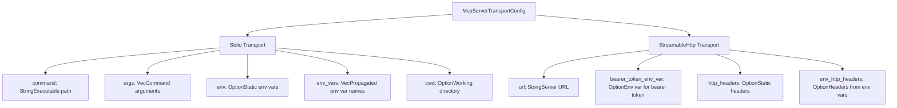
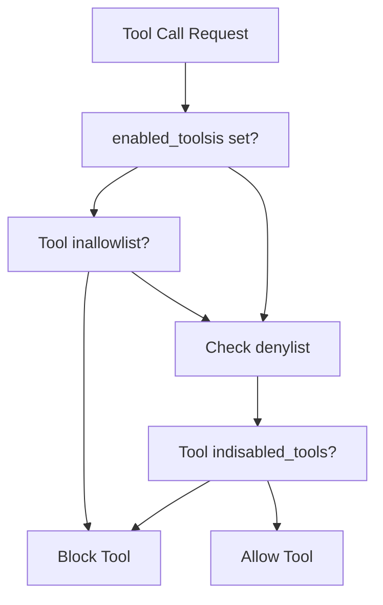
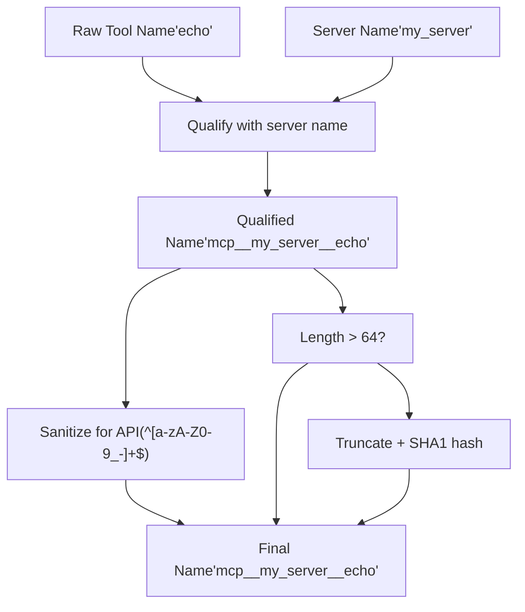

# MCP 服务器配置

相关源文件

-   [codex-rs/app-server/tests/suite/v2/mcp\_server\_elicitation.rs](https://github.com/openai/codex/blob/d807d44a/codex-rs/app-server/tests/suite/v2/mcp_server_elicitation.rs)
-   [codex-rs/cli/src/mcp\_cmd.rs](https://github.com/openai/codex/blob/d807d44a/codex-rs/cli/src/mcp_cmd.rs)
-   [codex-rs/cli/tests/mcp\_add\_remove.rs](https://github.com/openai/codex/blob/d807d44a/codex-rs/cli/tests/mcp_add_remove.rs)
-   [codex-rs/cli/tests/mcp\_list.rs](https://github.com/openai/codex/blob/d807d44a/codex-rs/cli/tests/mcp_list.rs)
-   [codex-rs/core/config.schema.json](https://github.com/openai/codex/blob/d807d44a/codex-rs/core/config.schema.json)
-   [codex-rs/core/src/config/agent\_roles.rs](https://github.com/openai/codex/blob/d807d44a/codex-rs/core/src/config/agent_roles.rs)
-   [codex-rs/core/src/config/config\_tests.rs](https://github.com/openai/codex/blob/d807d44a/codex-rs/core/src/config/config_tests.rs)
-   [codex-rs/core/src/config/edit.rs](https://github.com/openai/codex/blob/d807d44a/codex-rs/core/src/config/edit.rs)
-   [codex-rs/core/src/config/mod.rs](https://github.com/openai/codex/blob/d807d44a/codex-rs/core/src/config/mod.rs)
-   [codex-rs/core/src/config/profile.rs](https://github.com/openai/codex/blob/d807d44a/codex-rs/core/src/config/profile.rs)
-   [codex-rs/core/src/config/types.rs](https://github.com/openai/codex/blob/d807d44a/codex-rs/core/src/config/types.rs)
-   [codex-rs/core/src/mcp\_connection\_manager.rs](https://github.com/openai/codex/blob/d807d44a/codex-rs/core/src/mcp_connection_manager.rs)
-   [codex-rs/core/src/mcp\_connection\_manager\_tests.rs](https://github.com/openai/codex/blob/d807d44a/codex-rs/core/src/mcp_connection_manager_tests.rs)
-   [codex-rs/core/src/state/session.rs](https://github.com/openai/codex/blob/d807d44a/codex-rs/core/src/state/session.rs)
-   [codex-rs/core/src/state/turn.rs](https://github.com/openai/codex/blob/d807d44a/codex-rs/core/src/state/turn.rs)
-   [codex-rs/core/src/tasks/mod.rs](https://github.com/openai/codex/blob/d807d44a/codex-rs/core/src/tasks/mod.rs)
-   [codex-rs/core/src/tools/handlers/mod.rs](https://github.com/openai/codex/blob/d807d44a/codex-rs/core/src/tools/handlers/mod.rs)
-   [codex-rs/core/src/tools/handlers/tool\_search\_tests.rs](https://github.com/openai/codex/blob/d807d44a/codex-rs/core/src/tools/handlers/tool_search_tests.rs)
-   [codex-rs/core/src/tools/spec.rs](https://github.com/openai/codex/blob/d807d44a/codex-rs/core/src/tools/spec.rs)
-   [codex-rs/core/src/tools/spec\_tests.rs](https://github.com/openai/codex/blob/d807d44a/codex-rs/core/src/tools/spec_tests.rs)
-   [codex-rs/core/tests/suite/rmcp\_client.rs](https://github.com/openai/codex/blob/d807d44a/codex-rs/core/tests/suite/rmcp_client.rs)
-   [codex-rs/core/tests/suite/truncation.rs](https://github.com/openai/codex/blob/d807d44a/codex-rs/core/tests/suite/truncation.rs)
-   [codex-rs/core/tests/suite/user\_shell\_cmd.rs](https://github.com/openai/codex/blob/d807d44a/codex-rs/core/tests/suite/user_shell_cmd.rs)
-   [codex-rs/rmcp-client/src/rmcp\_client.rs](https://github.com/openai/codex/blob/d807d44a/codex-rs/rmcp-client/src/rmcp_client.rs)
-   [codex-rs/rmcp-client/tests/streamable\_http\_recovery.rs](https://github.com/openai/codex/blob/d807d44a/codex-rs/rmcp-client/tests/streamable_http_recovery.rs)
-   [docs/config.md](https://github.com/openai/codex/blob/d807d44a/docs/config.md?plain=1)
-   [docs/example-config.md](https://github.com/openai/codex/blob/d807d44a/docs/example-config.md?plain=1)
-   [docs/skills.md](https://github.com/openai/codex/blob/d807d44a/docs/skills.md?plain=1)
-   [docs/slash\_commands.md](https://github.com/openai/codex/blob/d807d44a/docs/slash_commands.md?plain=1)

本文档说明如何在 Codex 中配置 MCP（模型上下文协议）服务器。MCP 服务器通过提供外部工具、资源和数据源来扩展 Codex 能力，AI 可在对话期间访问这些能力。

关于 MCP 服务器在运行时如何初始化和管理，参见 [MCP Connection Manager](/openai/codex/6.2-mcp-connection-manager)。关于管理 MCP 服务器的 CLI 命令，参见 [MCP CLI Commands](/openai/codex/6.3-mcp-cli-commands)。关于 OAuth 认证流程，参见 [OAuth Authentication for MCP](/openai/codex/6.5-oauth-authentication-for-mcp)。

---

## 配置结构

MCP 服务器在 `config.toml`（系统、用户或项目级）中的 `[mcp_servers]` 表下配置。每个服务器由唯一名称标识，并映射到 `McpServerConfig` 结构。

### McpServerConfig 字段

| Field | Type | Description |
| --- | --- | --- |
| `transport` | `McpServerTransportConfig` | 传输配置（Stdio 或 StreamableHttp）。 |
| `enabled` | `bool` | 服务器是否启用（默认：`true`）。 |
| `required` | `bool` | 若为 true，当服务器无法初始化时，`codex exec` 会失败。 |
| `disabled_reason` | `Option<McpServerDisabledReason>` | 禁用原因（例如 requirements 校验失败）。 |
| `startup_timeout_sec` | `Option<Duration>` | 服务器初始化与工具列表获取的超时。 |
| `tool_timeout_sec` | `Option<Duration>` | 单次工具调用超时。 |
| `enabled_tools` | `Option<Vec<String>>` | 显式工具允许列表。 |
| `disabled_tools` | `Option<Vec<String>>` | 显式工具拒绝列表。 |
| `scopes` | `Option<Vec<String>>` | 登录时请求的 OAuth scopes。 |
| `oauth_resource` | `Option<String>` | OAuth 的 RFC 8707 resource 参数。 |

**Sources:** [codex-rs/core/src/config/types.rs68-111](https://github.com/openai/codex/blob/d807d44a/codex-rs/core/src/config/types.rs#L68-L111) [codex-rs/core/src/mcp\_connection\_manager.rs95-100](https://github.com/openai/codex/blob/d807d44a/codex-rs/core/src/mcp_connection_manager.rs#L95-L100)

---

## 传输类型

MCP 服务器通过两种主要传输机制通信：**Stdio**（本地子进程）或 **StreamableHttp**（远程/本地 HTTP 端点）。

### 传输配置图

**Sources:** [codex-rs/core/src/config/types.rs232-262](https://github.com/openai/codex/blob/d807d44a/codex-rs/core/src/config/types.rs#L232-L262) [codex-rs/cli/src/mcp\_cmd.rs92-134](https://github.com/openai/codex/blob/d807d44a/codex-rs/cli/src/mcp_cmd.rs#L92-L134)

### Stdio 传输

Stdio 传输会将 MCP 服务器作为子进程启动，并通过 stdin/stdout 通信。该方式常用于本地工具（如文件系统访问、数据库浏览器）。

**配置字段：**

-   **`command`**：要运行的可执行文件。
-   **`args`**：传递给命令的参数列表。
-   **`env`**：仅用于该子进程的环境变量映射。
-   **`env_vars`**：从父进程继承的现有环境变量名称列表。
-   **`cwd`**：服务器进程的指定工作目录。

**Sources:** [codex-rs/core/src/config/types.rs232-246](https://github.com/openai/codex/blob/d807d44a/codex-rs/core/src/config/types.rs#L232-L246) [codex-rs/core/tests/suite/rmcp\_client.rs92-101](https://github.com/openai/codex/blob/d807d44a/codex-rs/core/tests/suite/rmcp_client.rs#L92-L101)

### StreamableHttp 传输

StreamableHttp 传输通过 HTTP/HTTPS 连接服务器。该传输支持 OAuth 2.0 流程与 bearer token 认证。

**配置字段：**

-   **`url`**：MCP 服务器的 HTTP(S) 端点。
-   **`bearer_token_env_var`**：包含认证 token 的环境变量名。
-   **`http_headers`**：静态请求头（例如 `X-API-Key`）。
-   **`env_http_headers`**：值从环境变量读取的请求头。

**Sources:** [codex-rs/core/src/config/types.rs247-261](https://github.com/openai/codex/blob/d807d44a/codex-rs/core/src/config/types.rs#L247-L261) [codex-rs/cli/src/mcp\_cmd.rs121-134](https://github.com/openai/codex/blob/d807d44a/codex-rs/cli/src/mcp_cmd.rs#L121-L134)

---

## 工具过滤

工具过滤允许用户限制某个服务器中哪些工具会暴露给 AI 模型。这对安全和降低上下文窗口噪声至关重要。

### 工具过滤逻辑

**过滤实现：** `McpConnectionManager` 在工具发现阶段应用这些过滤规则。若存在 `enabled_tools`，仅注册这些指定工具。若存在 `disabled_tools`，则无论允许列表如何，这些工具都会从最终列表中移除。

**Sources:** [codex-rs/core/src/config/types.rs96-102](https://github.com/openai/codex/blob/d807d44a/codex-rs/core/src/config/types.rs#L96-L102) [codex-rs/core/src/mcp\_connection\_manager.rs155-161](https://github.com/openai/codex/blob/d807d44a/codex-rs/core/src/mcp_connection_manager.rs#L155-L161)

---

## 基于 Requirements 的过滤

Codex 支持强制执行 “Requirements”（通常来自组织的 `requirements.toml` 或 MDM 策略），可强制禁用不匹配已批准身份的 MCP 服务器。

### 身份匹配

-   **Stdio 服务器**：按 `command` 字符串匹配。
-   **HTTP 服务器**：按 `url` 字符串匹配。

若服务器匹配 requirements 失败，则会标记为 `McpServerDisabledReason::Requirements`。

**Sources:** [codex-rs/core/src/config/types.rs51-65](https://github.com/openai/codex/blob/d807d44a/codex-rs/core/src/config/types.rs#L51-L65) [codex-rs/core/src/config/mod.rs37-38](https://github.com/openai/codex/blob/d807d44a/codex-rs/core/src/config/mod.rs#L37-L38)

---

## 服务器名限定与清洗

为防止多个 MCP 服务器之间冲突，并满足 LLM API 约束（通常要求工具名匹配 `^[a-zA-Z0-9_-]+$`），Codex 会执行名称限定与清洗。

### 工具名转换

**限定逻辑：**

1.  添加前缀 `mcp`。
2.  追加 `server_name`。
3.  追加原始 `tool_name`。
4.  使用 `MCP_TOOL_NAME_DELIMITER`（`__`）连接各段。
5.  通过 `sanitize_responses_api_tool_name` 将任意非字母数字/下划线字符替换为 `_`。

**Sources:** [codex-rs/core/src/mcp\_connection\_manager.rs92-125](https://github.com/openai/codex/blob/d807d44a/codex-rs/core/src/mcp_connection_manager.rs#L92-L125) [codex-rs/core/src/mcp\_connection\_manager.rs163-188](https://github.com/openai/codex/blob/d807d44a/codex-rs/core/src/mcp_connection_manager.rs#L163-L188)

---

## 超时配置

超时可按服务器配置，以应对慢初始化或长时间运行的工具执行。

| Parameter | Code Symbol | Default |
| --- | --- | --- |
| Startup Timeout | `DEFAULT_STARTUP_TIMEOUT` | 10 秒 |
| Tool Timeout | `DEFAULT_TOOL_TIMEOUT` | 120 秒 |

**Sources:** [codex-rs/core/src/mcp\_connection\_manager.rs96-99](https://github.com/openai/codex/blob/d807d44a/codex-rs/core/src/mcp_connection_manager.rs#L96-L99) [codex-rs/core/src/config/types.rs84-94](https://github.com/openai/codex/blob/d807d44a/codex-rs/core/src/config/types.rs#L84-L94)

---

## 特殊服务器：`codex-apps`

`codex-apps` 服务器是内置虚拟 MCP 服务器，会将内部 Codex 能力（如 ChatGPT 连接器）作为 MCP 工具暴露。

-   **命名空间**：与其他服务器不同，`codex-apps` 工具若为内部工具则不使用 `mcp__` 前缀。
-   **缓存**：`codex-apps` 的工具列表会被缓存以提升性能，因为其在会话内通常变化很小。

**Sources:** [codex-rs/core/src/mcp\_connection\_manager.rs22](https://github.com/openai/codex/blob/d807d44a/codex-rs/core/src/mcp_connection_manager.rs#L22-L22) [codex-rs/core/src/mcp\_connection\_manager.rs163-170](https://github.com/openai/codex/blob/d807d44a/codex-rs/core/src/mcp_connection_manager.rs#L163-L170) [codex-rs/core/src/mcp\_connection\_manager.rs101-105](https://github.com/openai/codex/blob/d807d44a/codex-rs/core/src/mcp_connection_manager.rs#L101-L105)

---

## 配置持久化与编辑

当用户运行 `codex mcp add` 或 `codex mcp remove` 时，CLI 使用 `ConfigEditsBuilder` 以编程方式更新 `config.toml`。

**关键函数：**

-   `run_add`：在追加到配置文件前，校验服务器名称与传输配置。
-   `run_remove`：从 `mcp_servers` 表中移除条目。
-   `validate_server_name`：确保名称仅包含字母数字、连字符或下划线。

**Sources:** [codex-rs/cli/src/mcp\_cmd.rs238-280](https://github.com/openai/codex/blob/d807d44a/codex-rs/cli/src/mcp_cmd.rs#L238-L280) [codex-rs/cli/src/mcp\_cmd.rs819-830](https://github.com/openai/codex/blob/d807d44a/codex-rs/cli/src/mcp_cmd.rs#L819-L830) [codex-rs/core/src/config/edit.rs43](https://github.com/openai/codex/blob/d807d44a/codex-rs/core/src/config/edit.rs#L43-L43)
