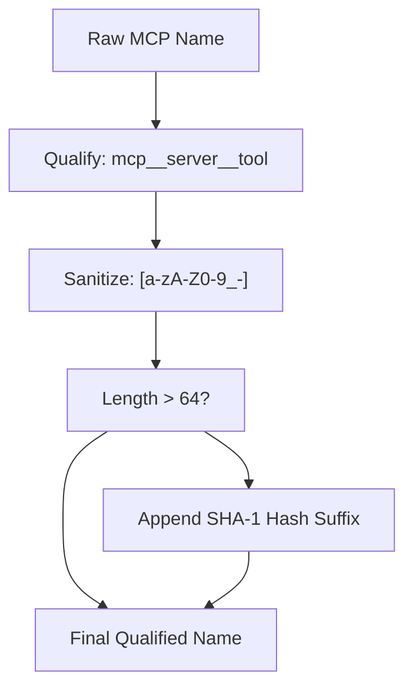

# MCP 连接管理器

相关源文件

-   [codex-rs/app-server/tests/suite/v2/mcp\_server\_elicitation.rs](https://github.com/openai/codex/blob/d807d44a/codex-rs/app-server/tests/suite/v2/mcp_server_elicitation.rs)
-   [codex-rs/cli/src/mcp\_cmd.rs](https://github.com/openai/codex/blob/d807d44a/codex-rs/cli/src/mcp_cmd.rs)
-   [codex-rs/cli/tests/mcp\_add\_remove.rs](https://github.com/openai/codex/blob/d807d44a/codex-rs/cli/tests/mcp_add_remove.rs)
-   [codex-rs/cli/tests/mcp\_list.rs](https://github.com/openai/codex/blob/d807d44a/codex-rs/cli/tests/mcp_list.rs)
-   [codex-rs/core/src/mcp/auth.rs](https://github.com/openai/codex/blob/d807d44a/codex-rs/core/src/mcp/auth.rs)
-   [codex-rs/core/src/mcp\_connection\_manager.rs](https://github.com/openai/codex/blob/d807d44a/codex-rs/core/src/mcp_connection_manager.rs)
-   [codex-rs/core/src/mcp\_connection\_manager\_tests.rs](https://github.com/openai/codex/blob/d807d44a/codex-rs/core/src/mcp_connection_manager_tests.rs)
-   [codex-rs/core/src/state/session.rs](https://github.com/openai/codex/blob/d807d44a/codex-rs/core/src/state/session.rs)
-   [codex-rs/core/src/state/turn.rs](https://github.com/openai/codex/blob/d807d44a/codex-rs/core/src/state/turn.rs)
-   [codex-rs/core/src/tasks/mod.rs](https://github.com/openai/codex/blob/d807d44a/codex-rs/core/src/tasks/mod.rs)
-   [codex-rs/core/src/tools/handlers/mcp\_resource.rs](https://github.com/openai/codex/blob/d807d44a/codex-rs/core/src/tools/handlers/mcp_resource.rs)
-   [codex-rs/core/src/tools/handlers/tool\_search\_tests.rs](https://github.com/openai/codex/blob/d807d44a/codex-rs/core/src/tools/handlers/tool_search_tests.rs)
-   [codex-rs/core/tests/suite/rmcp\_client.rs](https://github.com/openai/codex/blob/d807d44a/codex-rs/core/tests/suite/rmcp_client.rs)
-   [codex-rs/core/tests/suite/truncation.rs](https://github.com/openai/codex/blob/d807d44a/codex-rs/core/tests/suite/truncation.rs)
-   [codex-rs/core/tests/suite/user\_shell\_cmd.rs](https://github.com/openai/codex/blob/d807d44a/codex-rs/core/tests/suite/user_shell_cmd.rs)
-   [codex-rs/rmcp-client/Cargo.toml](https://github.com/openai/codex/blob/d807d44a/codex-rs/rmcp-client/Cargo.toml)
-   [codex-rs/rmcp-client/src/auth\_status.rs](https://github.com/openai/codex/blob/d807d44a/codex-rs/rmcp-client/src/auth_status.rs)
-   [codex-rs/rmcp-client/src/bin/rmcp\_test\_server.rs](https://github.com/openai/codex/blob/d807d44a/codex-rs/rmcp-client/src/bin/rmcp_test_server.rs)
-   [codex-rs/rmcp-client/src/bin/test\_stdio\_server.rs](https://github.com/openai/codex/blob/d807d44a/codex-rs/rmcp-client/src/bin/test_stdio_server.rs)
-   [codex-rs/rmcp-client/src/bin/test\_streamable\_http\_server.rs](https://github.com/openai/codex/blob/d807d44a/codex-rs/rmcp-client/src/bin/test_streamable_http_server.rs)
-   [codex-rs/rmcp-client/src/lib.rs](https://github.com/openai/codex/blob/d807d44a/codex-rs/rmcp-client/src/lib.rs)
-   [codex-rs/rmcp-client/src/logging\_client\_handler.rs](https://github.com/openai/codex/blob/d807d44a/codex-rs/rmcp-client/src/logging_client_handler.rs)
-   [codex-rs/rmcp-client/src/oauth.rs](https://github.com/openai/codex/blob/d807d44a/codex-rs/rmcp-client/src/oauth.rs)
-   [codex-rs/rmcp-client/src/perform\_oauth\_login.rs](https://github.com/openai/codex/blob/d807d44a/codex-rs/rmcp-client/src/perform_oauth_login.rs)
-   [codex-rs/rmcp-client/src/rmcp\_client.rs](https://github.com/openai/codex/blob/d807d44a/codex-rs/rmcp-client/src/rmcp_client.rs)
-   [codex-rs/rmcp-client/tests/resources.rs](https://github.com/openai/codex/blob/d807d44a/codex-rs/rmcp-client/tests/resources.rs)
-   [codex-rs/rmcp-client/tests/streamable\_http\_recovery.rs](https://github.com/openai/codex/blob/d807d44a/codex-rs/rmcp-client/tests/streamable_http_recovery.rs)
-   [codex-rs/utils/home-dir/BUILD.bazel](https://github.com/openai/codex/blob/d807d44a/codex-rs/utils/home-dir/BUILD.bazel)
-   [codex-rs/utils/home-dir/Cargo.toml](https://github.com/openai/codex/blob/d807d44a/codex-rs/utils/home-dir/Cargo.toml)
-   [codex-rs/utils/home-dir/src/lib.rs](https://github.com/openai/codex/blob/d807d44a/codex-rs/utils/home-dir/src/lib.rs)

MCP 连接管理器是 `codex-core` 中的运行时组件，负责建立并维护到一个或多个外部 MCP（模型上下文协议）服务器的连接。它为每个已配置服务器持有一个 `codex_rmcp_client::RmcpClient`，并将所有已连接服务器的工具、资源和资源模板列表聚合为统一映射，将工具调用路由到正确服务器，并把 elicitation 请求转发到用户界面。[codex-rs/core/src/mcp\_connection\_manager.rs1-7](https://github.com/openai/codex/blob/d807d44a/codex-rs/core/src/mcp_connection_manager.rs#L1-L7)

本页介绍 `McpConnectionManager` 的内部机制及其支撑类型。关于 MCP 服务器配置（`McpServerConfig`、传输变体、`config.toml` 布局）参见 [6.1](https://github.com/openai/codex/blob/d807d44a/6.1)；关于 `mcp` CLI 子命令（`add`、`remove`、`login`）参见 [6.3](https://github.com/openai/codex/blob/d807d44a/6.3)；关于 OAuth 凭据存储参见 [6.5](https://github.com/openai/codex/blob/d807d44a/6.5)

---

## 结构概览

连接管理器的全部代码位于 [codex-rs/core/src/mcp\_connection\_manager.rs](https://github.com/openai/codex/blob/d807d44a/codex-rs/core/src/mcp_connection_manager.rs) 底层 MCP SDK 封装位于 `codex-rmcp-client` crate [codex-rs/rmcp-client/src/rmcp\_client.rs28-29](https://github.com/openai/codex/blob/d807d44a/codex-rs/rmcp-client/src/rmcp_client.rs#L28-L29)

### 类关系图

Sources: [codex-rs/core/src/mcp\_connection\_manager.rs337-513](https://github.com/openai/codex/blob/d807d44a/codex-rs/core/src/mcp_connection_manager.rs#L337-L513) [codex-rs/rmcp-client/src/rmcp\_client.rs28-29](https://github.com/openai/codex/blob/d807d44a/codex-rs/rmcp-client/src/rmcp_client.rs#L28-L29)

---

## 初始化与启动序列

`McpConnectionManager::new()` 是主构造函数 [codex-rs/core/src/mcp\_connection\_manager.rs546-547](https://github.com/openai/codex/blob/d807d44a/codex-rs/core/src/mcp_connection_manager.rs#L546-L547) 它接收 `McpServerConfig` 条目映射，并为每个已启用服务器并发启动一个 `AsyncManagedClient` [codex-rs/core/src/mcp\_connection\_manager.rs596-600](https://github.com/openai/codex/blob/d807d44a/codex-rs/core/src/mcp_connection_manager.rs#L596-L600)

### 启动流程图

> **[Mermaid sequence]**
> *(图表结构无法解析)*

Sources: [codex-rs/core/src/mcp\_connection\_manager.rs546-664](https://github.com/openai/codex/blob/d807d44a/codex-rs/core/src/mcp_connection_manager.rs#L546-L664) [codex-rs/core/src/mcp\_connection\_manager.rs411-455](https://github.com/openai/codex/blob/d807d44a/codex-rs/core/src/mcp_connection_manager.rs#L411-L455)

`new_uninitialized()` 会创建不含服务器的空管理器，主要用于测试 [codex-rs/core/src/mcp\_connection\_manager.rs516-522](https://github.com/openai/codex/blob/d807d44a/codex-rs/core/src/mcp_connection_manager.rs#L516-L522)

---

## 工具名限定

Responses API 要求工具名匹配 `^[a-zA-Z0-9_-]+$`。MCP 工具名在暴露给模型前会先限定并清洗 [codex-rs/core/src/mcp\_connection\_manager.rs107-118](https://github.com/openai/codex/blob/d807d44a/codex-rs/core/src/mcp_connection_manager.rs#L107-L118)

### 限定逻辑

1.  **原始格式**：`mcp__{server_name}__{tool_name}`，使用 `__` 作为 `MCP_TOOL_NAME_DELIMITER` [codex-rs/core/src/mcp\_connection\_manager.rs92](https://github.com/openai/codex/blob/d807d44a/codex-rs/core/src/mcp_connection_manager.rs#L92-L92)
2.  **清洗**：`sanitize_responses_api_tool_name` 将非字母数字/下划线字符替换为 `_` [codex-rs/core/src/mcp\_connection\_manager.rs110-125](https://github.com/openai/codex/blob/d807d44a/codex-rs/core/src/mcp_connection_manager.rs#L110-L125)
3.  **长度约束**：若名称超过 `MAX_TOOL_NAME_LENGTH`（64），则用原始名称的 SHA-1 哈希替换后缀，以保证稳定性和唯一性 [codex-rs/core/src/mcp\_connection\_manager.rs93](https://github.com/openai/codex/blob/d807d44a/codex-rs/core/src/mcp_connection_manager.rs#L93-L93) [codex-rs/core/src/mcp\_connection\_manager.rs183-187](https://github.com/openai/codex/blob/d807d44a/codex-rs/core/src/mcp_connection_manager.rs#L183-L187)

### 工具名流程

Sources: [codex-rs/core/src/mcp\_connection\_manager.rs155-191](https://github.com/openai/codex/blob/d807d44a/codex-rs/core/src/mcp_connection_manager.rs#L155-L191)

---

## 工具执行与过滤

### 工具调用

`McpConnectionManager::call_tool` 将请求路由到指定服务器 [codex-rs/core/src/mcp\_connection\_manager.rs916-921](https://github.com/openai/codex/blob/d807d44a/codex-rs/core/src/mcp_connection_manager.rs#L916-L921) 除非在配置中覆盖，否则会强制 `DEFAULT_TOOL_TIMEOUT` 为 120 秒 [codex-rs/core/src/mcp\_connection\_manager.rs99](https://github.com/openai/codex/blob/d807d44a/codex-rs/core/src/mcp_connection_manager.rs#L99-L99)

### 工具过滤

`ToolFilter` [codex-rs/core/src/mcp\_connection\_manager.rs1025-1028](https://github.com/openai/codex/blob/d807d44a/codex-rs/core/src/mcp_connection_manager.rs#L1025-L1028) 会依据 `McpServerConfig` 中的 `enabled_tools` 或 `disabled_tools` 列表，限制暴露的工具 [codex-rs/core/src/mcp\_connection\_manager.rs1030-1049](https://github.com/openai/codex/blob/d807d44a/codex-rs/core/src/mcp_connection_manager.rs#L1030-L1049)

---

## Elicitation 处理

MCP 服务器可以在轮次中途通过 “elicitation” 请求用户输入 [codex-rs/core/src/mcp\_connection\_manager.rs250-252](https://github.com/openai/codex/blob/d807d44a/codex-rs/core/src/mcp_connection_manager.rs#L250-L252)

1.  **请求**：服务器发送 `CreateElicitationRequest` [codex-rs/rmcp-client/src/rmcp\_client.rs27-28](https://github.com/openai/codex/blob/d807d44a/codex-rs/rmcp-client/src/rmcp_client.rs#L27-L28)
2.  **管理**：`ElicitationRequestManager` 检查 `AskForApproval` 策略 [codex-rs/core/src/mcp\_connection\_manager.rs260-264](https://github.com/openai/codex/blob/d807d44a/codex-rs/core/src/mcp_connection_manager.rs#L260-L264)
3.  **事件**：若允许，会向 UI 发出 `ElicitationRequestEvent` [codex-rs/core/src/mcp\_connection\_manager.rs284-290](https://github.com/openai/codex/blob/d807d44a/codex-rs/core/src/mcp_connection_manager.rs#L284-L290)
4.  **解析**：UI 调用 `resolve_elicitation`，完成内部 `oneshot` 通道 [codex-rs/core/src/mcp\_connection\_manager.rs675-684](https://github.com/openai/codex/blob/d807d44a/codex-rs/core/src/mcp_connection_manager.rs#L675-L684)

### Elicitation 状态映射

| Code Entity | System Role |
| --- | --- |
| `ElicitationRequestManager` | 待处理用户提示的状态存储 |
| `oneshot::Sender<ElicitationResponse>` | 异步请求与 UI 响应之间的内部桥接 |
| `EventMsg::ElicitationRequest` | 发送到前端的协议消息 |
| `McpConnectionManager::resolve_elicitation` | UI 提供用户答案的入口 |

Sources: [codex-rs/core/src/mcp\_connection\_manager.rs250-334](https://github.com/openai/codex/blob/d807d44a/codex-rs/core/src/mcp_connection_manager.rs#L250-L334) [codex-rs/core/src/state/turn.rs81](https://github.com/openai/codex/blob/d807d44a/codex-rs/core/src/state/turn.rs#L81-L81)

---

## 沙箱状态同步

Codex 会将其沙箱环境状态同步给支持 `codex/sandbox-state` 能力的 MCP 服务器 [codex-rs/core/src/mcp\_connection\_manager.rs373-375](https://github.com/openai/codex/blob/d807d44a/codex-rs/core/src/mcp_connection_manager.rs#L373-L375)

当 `SandboxPolicy` 变化或服务器初始化时，管理器会发送包含以下内容的自定义通知 [codex-rs/core/src/mcp\_connection\_manager.rs499-506](https://github.com/openai/codex/blob/d807d44a/codex-rs/core/src/mcp_connection_manager.rs#L499-L506)：

-   `sandbox_policy`：当前安全配置（如 `ReadOnly`、`WorkspaceWrite`）。
-   `sandbox_cwd`：沙箱操作根目录。
-   `codex_linux_sandbox_exe`：沙箱包装器二进制路径。

Sources: [codex-rs/core/src/mcp\_connection\_manager.rs1008-1017](https://github.com/openai/codex/blob/d807d44a/codex-rs/core/src/mcp_connection_manager.rs#L1008-L1017) [codex-rs/core/src/mcp\_connection\_manager.rs373-387](https://github.com/openai/codex/blob/d807d44a/codex-rs/core/src/mcp_connection_manager.rs#L373-L387)

---

## RmcpClient 与传输

`RmcpClient` 负责底层协议细节 [codex-rs/rmcp-client/src/rmcp\_client.rs28-29](https://github.com/openai/codex/blob/d807d44a/codex-rs/rmcp-client/src/rmcp_client.rs#L28-L29)

### 传输类型

-   **Stdio**：启动子进程并通过 stdin/stdout 通信 [codex-rs/rmcp-client/src/rmcp\_client.rs51](https://github.com/openai/codex/blob/d807d44a/codex-rs/rmcp-client/src/rmcp_client.rs#L51-L51)
-   **Streamable HTTP**：服务器到客户端通知通过 SSE（Server-Sent Events），请求通过 POST [codex-rs/rmcp-client/src/rmcp\_client.rs53-56](https://github.com/openai/codex/blob/d807d44a/codex-rs/rmcp-client/src/rmcp_client.rs#L53-L56)

### Stdio 进程管理

对 stdio 传输，`RmcpClient` 使用 `TokioChildProcess` [codex-rs/rmcp-client/src/rmcp\_client.rs51](https://github.com/openai/codex/blob/d807d44a/codex-rs/rmcp-client/src/rmcp_client.rs#L51-L51) 在 Unix 上，它会创建新的进程组，以确保退出时所有子进程都被清理 [codex-rs/rmcp-client/src/rmcp\_client.rs113-118](https://github.com/openai/codex/blob/d807d44a/codex-rs/rmcp-client/src/rmcp_client.rs#L113-L118)

Sources: [codex-rs/rmcp-client/src/rmcp\_client.rs44-56](https://github.com/openai/codex/blob/d807d44a/codex-rs/rmcp-client/src/rmcp_client.rs#L44-L56) [codex-rs/rmcp-client/src/rmcp\_client.rs86-101](https://github.com/openai/codex/blob/d807d44a/codex-rs/rmcp-client/src/rmcp_client.rs#L86-L101)
