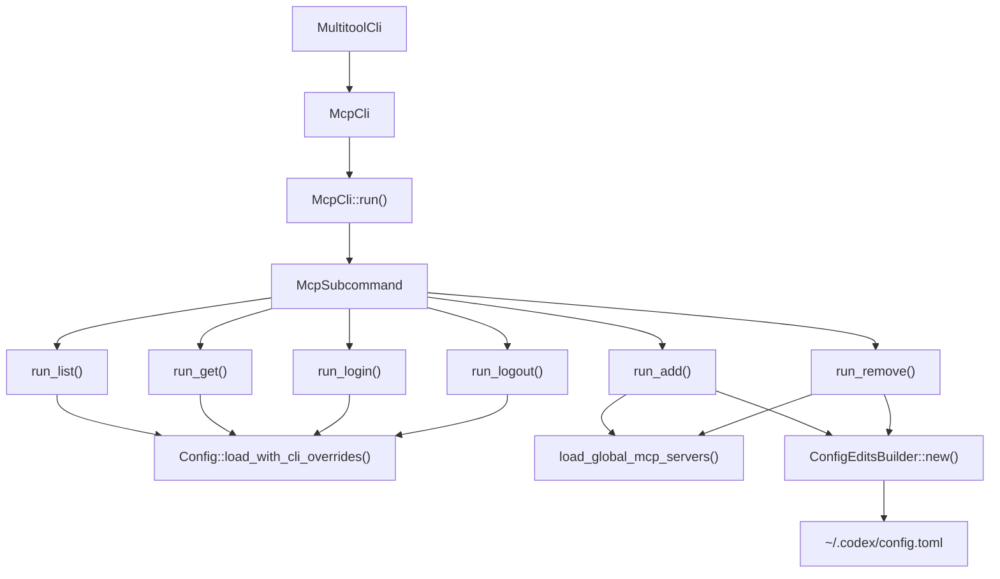
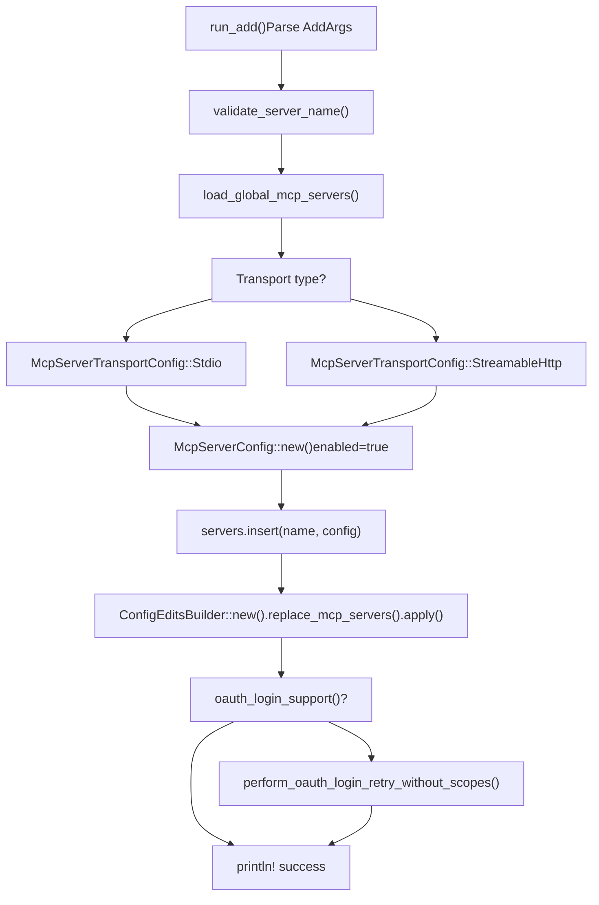

# MCP CLI 命令

相关源文件

-   [codex-rs/app-server/tests/suite/v2/mcp\_server\_elicitation.rs](https://github.com/openai/codex/blob/d807d44a/codex-rs/app-server/tests/suite/v2/mcp_server_elicitation.rs)
-   [codex-rs/cli/src/mcp\_cmd.rs](https://github.com/openai/codex/blob/d807d44a/codex-rs/cli/src/mcp_cmd.rs)
-   [codex-rs/cli/tests/mcp\_add\_remove.rs](https://github.com/openai/codex/blob/d807d44a/codex-rs/cli/tests/mcp_add_remove.rs)
-   [codex-rs/cli/tests/mcp\_list.rs](https://github.com/openai/codex/blob/d807d44a/codex-rs/cli/tests/mcp_list.rs)
-   [codex-rs/core/src/mcp\_connection\_manager.rs](https://github.com/openai/codex/blob/d807d44a/codex-rs/core/src/mcp_connection_manager.rs)
-   [codex-rs/core/src/mcp\_connection\_manager\_tests.rs](https://github.com/openai/codex/blob/d807d44a/codex-rs/core/src/mcp_connection_manager_tests.rs)
-   [codex-rs/core/src/state/session.rs](https://github.com/openai/codex/blob/d807d44a/codex-rs/core/src/state/session.rs)
-   [codex-rs/core/src/state/turn.rs](https://github.com/openai/codex/blob/d807d44a/codex-rs/core/src/state/turn.rs)
-   [codex-rs/core/src/tasks/mod.rs](https://github.com/openai/codex/blob/d807d44a/codex-rs/core/src/tasks/mod.rs)
-   [codex-rs/core/src/tools/handlers/tool\_search\_tests.rs](https://github.com/openai/codex/blob/d807d44a/codex-rs/core/src/tools/handlers/tool_search_tests.rs)
-   [codex-rs/core/tests/suite/rmcp\_client.rs](https://github.com/openai/codex/blob/d807d44a/codex-rs/core/tests/suite/rmcp_client.rs)
-   [codex-rs/core/tests/suite/truncation.rs](https://github.com/openai/codex/blob/d807d44a/codex-rs/core/tests/suite/truncation.rs)
-   [codex-rs/core/tests/suite/user\_shell\_cmd.rs](https://github.com/openai/codex/blob/d807d44a/codex-rs/core/tests/suite/user_shell_cmd.rs)
-   [codex-rs/rmcp-client/src/rmcp\_client.rs](https://github.com/openai/codex/blob/d807d44a/codex-rs/rmcp-client/src/rmcp_client.rs)
-   [codex-rs/rmcp-client/tests/streamable\_http\_recovery.rs](https://github.com/openai/codex/blob/d807d44a/codex-rs/rmcp-client/tests/streamable_http_recovery.rs)

本页记录了 `codex mcp` 子命令，这些命令允许用户在命令行中管理模型上下文协议（MCP）服务器配置。它们为新增、删除、列出和认证 MCP 服务器提供了便捷接口，无需手动编辑配置文件。

关于 MCP 服务器配置结构与连接生命周期，参见 [6.1 MCP Server Configuration](https://github.com/openai/codex/blob/d807d44a/6.1 MCP Server Configuration) 和 [6.2 MCP Connection Manager](https://github.com/openai/codex/blob/d807d44a/6.2 MCP Connection Manager)；关于 OAuth 实现细节，参见 [6.5 OAuth Authentication for MCP](https://github.com/openai/codex/blob/d807d44a/6.5 OAuth Authentication for MCP)

---

## 命令概览

MCP CLI 命令以 `codex mcp` 的子命令形式实现。所有命令都操作存储在 `~/.codex/config.toml`（或 `$CODEX_HOME/config.toml`）中的全局 MCP 服务器配置。

**可用命令**：

-   `list` — 显示所有已配置 MCP 服务器及其状态。[codex-rs/cli/src/mcp\_cmd.rs48](https://github.com/openai/codex/blob/d807d44a/codex-rs/cli/src/mcp_cmd.rs#L48-L48)
-   `get <name>` — 显示指定服务器的详细配置。[codex-rs/cli/src/mcp\_cmd.rs49](https://github.com/openai/codex/blob/d807d44a/codex-rs/cli/src/mcp_cmd.rs#L49-L49)
-   `add <name>` — 添加新的 MCP 服务器配置。[codex-rs/cli/src/mcp\_cmd.rs50](https://github.com/openai/codex/blob/d807d44a/codex-rs/cli/src/mcp_cmd.rs#L50-L50)
-   `remove <name>` — 删除 MCP 服务器配置。[codex-rs/cli/src/mcp\_cmd.rs51](https://github.com/openai/codex/blob/d807d44a/codex-rs/cli/src/mcp_cmd.rs#L51-L51)
-   `login <name>` — 通过 OAuth 认证 MCP 服务器。[codex-rs/cli/src/mcp\_cmd.rs52](https://github.com/openai/codex/blob/d807d44a/codex-rs/cli/src/mcp_cmd.rs#L52-L52)
-   `logout <name>` — 删除已存储 OAuth 凭据。[codex-rs/cli/src/mcp\_cmd.rs53](https://github.com/openai/codex/blob/d807d44a/codex-rs/cli/src/mcp_cmd.rs#L53-L53)

Sources: [codex-rs/cli/src/mcp\_cmd.rs30-54](https://github.com/openai/codex/blob/d807d44a/codex-rs/cli/src/mcp_cmd.rs#L30-L54)

---

## 命令分发架构

下图展示 CLI 入口点如何分发到具体逻辑处理器，并与配置系统交互。

**图：MCP 命令分发流程**


`McpCli` 结构体作为入口点 [codex-rs/cli/src/mcp\_cmd.rs38](https://github.com/openai/codex/blob/d807d44a/codex-rs/cli/src/mcp_cmd.rs#L38-L38)，其 `run()` 方法会按 `McpSubcommand` 变体分发到专用处理函数 [codex-rs/cli/src/mcp\_cmd.rs159-187](https://github.com/openai/codex/blob/d807d44a/codex-rs/cli/src/mcp_cmd.rs#L159-L187) 读操作（`list`、`get`）会加载完整 `Config` 以访问所有层合并后的配置，而写操作（`add`、`remove`）则通过 `ConfigEditsBuilder` 直接操作全局 MCP 服务器映射 [codex-rs/cli/src/mcp\_cmd.rs313-318](https://github.com/openai/codex/blob/d807d44a/codex-rs/cli/src/mcp_cmd.rs#L313-L318)

Sources: [codex-rs/cli/src/mcp\_cmd.rs38-54](https://github.com/openai/codex/blob/d807d44a/codex-rs/cli/src/mcp_cmd.rs#L38-L54) [codex-rs/cli/src/mcp\_cmd.rs159-187](https://github.com/openai/codex/blob/d807d44a/codex-rs/cli/src/mcp_cmd.rs#L159-L187)

---

## List 命令

`list` 命令显示所有已配置 MCP 服务器。它同时支持人类可读表格输出和 `--json` 标志的 JSON 格式输出。

### 用法

```
codex mcp list [--json]
```
### 人类可读输出

该命令按传输类型（stdio 与 streamable-http）分组，并在独立表格中显示。出于安全考虑，环境变量会掩码显示其值（如 `TOKEN=*****`）[codex-rs/cli/src/mcp\_cmd.rs605-707](https://github.com/openai/codex/blob/d807d44a/codex-rs/cli/src/mcp_cmd.rs#L605-L707)

### JSON 输出

使用 `--json` 时，命令会输出服务器配置数组，其中包含 `auth_status` [codex-rs/cli/src/mcp\_cmd.rs478-534](https://github.com/openai/codex/blob/d807d44a/codex-rs/cli/src/mcp_cmd.rs#L478-L534)

### 认证状态计算

`list` 命令会调用 `compute_auth_statuses()` [codex-rs/cli/src/mcp\_cmd.rs475](https://github.com/openai/codex/blob/d807d44a/codex-rs/cli/src/mcp_cmd.rs#L475-L475) 来确定每台服务器的 OAuth 状态。该函数会检查传输是否支持 OAuth，并尝试加载已存储凭据 [codex-rs/core/src/mcp/auth.rs](https://github.com/openai/codex/blob/d807d44a/codex-rs/core/src/mcp/auth.rs)

Sources: [codex-rs/cli/src/mcp\_cmd.rs478-534](https://github.com/openai/codex/blob/d807d44a/codex-rs/cli/src/mcp_cmd.rs#L478-L534) [codex-rs/cli/src/mcp\_cmd.rs542-707](https://github.com/openai/codex/blob/d807d44a/codex-rs/cli/src/mcp_cmd.rs#L542-L707) [codex-rs/cli/tests/mcp\_list.rs33-119](https://github.com/openai/codex/blob/d807d44a/codex-rs/cli/tests/mcp_list.rs#L33-L119)

---

## Add 命令

`add` 命令用于创建新的 MCP 服务器配置。它支持两种传输类型：stdio（本地可执行程序）和 streamable-http（远程 HTTP 服务器）。

### 用法

**Stdio 传输**：

```
codex mcp add <name> [--env KEY=VALUE]... -- <command> [args...]
```
**Streamable HTTP 传输**：

```
codex mcp add <name> --url <url> [--bearer-token-env-var <var>]
```
### Add 流程

**图：Add 命令逻辑**


### OAuth 自动检测

添加 streamable-http 服务器后，`add` 命令会通过调用 `oauth_login_support()` 自动检查 OAuth 支持情况 [codex-rs/cli/src/mcp\_cmd.rs321](https://github.com/openai/codex/blob/d807d44a/codex-rs/cli/src/mcp_cmd.rs#L321-L321) 若支持，则会启动 `perform_oauth_login_retry_without_scopes()` [codex-rs/cli/src/mcp\_cmd.rs331](https://github.com/openai/codex/blob/d807d44a/codex-rs/cli/src/mcp_cmd.rs#L331-L331)

Sources: [codex-rs/cli/src/mcp\_cmd.rs73-134](https://github.com/openai/codex/blob/d807d44a/codex-rs/cli/src/mcp_cmd.rs#L73-L134) [codex-rs/cli/src/mcp\_cmd.rs238-347](https://github.com/openai/codex/blob/d807d44a/codex-rs/cli/src/mcp_cmd.rs#L238-L347) [codex-rs/core/src/connectors.rs59-79](https://github.com/openai/codex/blob/d807d44a/codex-rs/core/src/connectors.rs#L59-L79)

---

## Login 与 Logout 命令

### Login 流程

`login` 命令会启动 OAuth 2.0 流程。它使用 `codex-rmcp-client` crate 中的 `perform_oauth_login()`，该函数会启动临时 HTTP 回调服务器 [codex-rs/rmcp-client/src/perform\_oauth\_login.rs108-358](https://github.com/openai/codex/blob/d807d44a/codex-rs/rmcp-client/src/perform_oauth_login.rs#L108-L358)

**图：OAuth 交互**

> **[Mermaid sequence]**
> *(图表结构无法解析)*

### Logout 行为

`logout` 命令通过调用 `delete_oauth_tokens()` 删除 MCP 服务器的已存储 OAuth 凭据 [codex-rs/cli/src/mcp\_cmd.rs454](https://github.com/openai/codex/blob/d807d44a/codex-rs/cli/src/mcp_cmd.rs#L454-L454) 这会影响 `mcp_oauth_credentials_store_mode` 定义的存储位置 [codex-rs/rmcp-client/src/oauth.rs79-97](https://github.com/openai/codex/blob/d807d44a/codex-rs/rmcp-client/src/oauth.rs#L79-L97)

Sources: [codex-rs/cli/src/mcp\_cmd.rs382-431](https://github.com/openai/codex/blob/d807d44a/codex-rs/cli/src/mcp_cmd.rs#L382-L431) [codex-rs/cli/src/mcp\_cmd.rs433-461](https://github.com/openai/codex/blob/d807d44a/codex-rs/cli/src/mcp_cmd.rs#L433-L461) [codex-rs/rmcp-client/src/rmcp\_client.rs1-85](https://github.com/openai/codex/blob/d807d44a/codex-rs/rmcp-client/src/rmcp_client.rs#L1-L85)

---

## 配置持久化

所有写操作都使用 `ConfigEditsBuilder` API 来安全修改全局配置文件。

### 编辑流水线

1.  **加载**：`load_global_mcp_servers()` 读取 `~/.codex/config.toml` [codex-rs/cli/src/mcp\_cmd.rs313](https://github.com/openai/codex/blob/d807d44a/codex-rs/cli/src/mcp_cmd.rs#L313-L313)
2.  **修改**：在内存中更新 `HashMap<String, McpServerConfig>` [codex-rs/cli/src/mcp\_cmd.rs315](https://github.com/openai/codex/blob/d807d44a/codex-rs/cli/src/mcp_cmd.rs#L315-L315)
3.  **应用**：`ConfigEditsBuilder::replace_mcp_servers()` 原子写盘 [codex-rs/cli/src/mcp\_cmd.rs318](https://github.com/openai/codex/blob/d807d44a/codex-rs/cli/src/mcp_cmd.rs#L318-L318)

### 服务器配置结构

每个服务器条目都是一个 `McpServerConfig` [codex-rs/core/src/config/types.rs464](https://github.com/openai/codex/blob/d807d44a/codex-rs/core/src/config/types.rs#L464-L464)，其中包含 `transport`、`enabled`、`required` 和工具过滤器（`enabled_tools`、`disabled_tools`）等字段。

Sources: [codex-rs/cli/src/mcp\_cmd.rs313-318](https://github.com/openai/codex/blob/d807d44a/codex-rs/cli/src/mcp_cmd.rs#L313-L318) [codex-rs/core/src/config/types.rs464-476](https://github.com/openai/codex/blob/d807d44a/codex-rs/core/src/config/types.rs#L464-L476)

---

## OAuth 凭据存储模式

`mcp_oauth_credentials_store_mode` 配置项控制持久化方式。

-   **Auto**：若可用则使用平台 keyring，否则回退到 `File` [codex-rs/rmcp-client/src/oauth.rs83](https://github.com/openai/codex/blob/d807d44a/codex-rs/rmcp-client/src/oauth.rs#L83-L83)
-   **File**：将 token 存储到 `$CODEX_HOME/.credentials/{server_key}.json` [codex-rs/rmcp-client/src/oauth.rs85](https://github.com/openai/codex/blob/d807d44a/codex-rs/rmcp-client/src/oauth.rs#L85-L85)
-   **Keyring**：使用平台特定安全存储（macOS Keychain、Windows Credential Manager）[codex-rs/rmcp-client/src/oauth.rs87](https://github.com/openai/codex/blob/d807d44a/codex-rs/rmcp-client/src/oauth.rs#L87-L87)

Sources: [codex-rs/rmcp-client/src/oauth.rs79-97](https://github.com/openai/codex/blob/d807d44a/codex-rs/rmcp-client/src/oauth.rs#L79-L97) [codex-rs/rmcp-client/src/oauth.rs285-347](https://github.com/openai/codex/blob/d807d44a/codex-rs/rmcp-client/src/oauth.rs#L285-L347)
