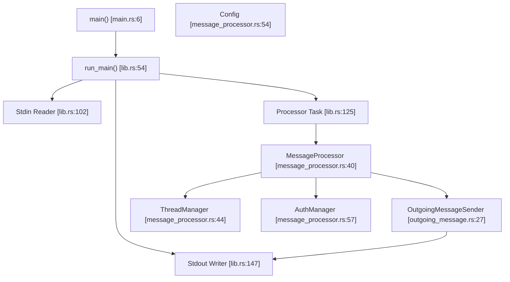

# MCP 服务器实现（codex-mcp-server）

相关源文件

-   [codex-rs/exec/src/main.rs](https://github.com/openai/codex/blob/d807d44a/codex-rs/exec/src/main.rs)
-   [codex-rs/mcp-server/Cargo.toml](https://github.com/openai/codex/blob/d807d44a/codex-rs/mcp-server/Cargo.toml)
-   [codex-rs/mcp-server/src/codex\_tool\_config.rs](https://github.com/openai/codex/blob/d807d44a/codex-rs/mcp-server/src/codex_tool_config.rs)
-   [codex-rs/mcp-server/src/exec\_approval.rs](https://github.com/openai/codex/blob/d807d44a/codex-rs/mcp-server/src/exec_approval.rs)
-   [codex-rs/mcp-server/src/lib.rs](https://github.com/openai/codex/blob/d807d44a/codex-rs/mcp-server/src/lib.rs)
-   [codex-rs/mcp-server/src/main.rs](https://github.com/openai/codex/blob/d807d44a/codex-rs/mcp-server/src/main.rs)
-   [codex-rs/mcp-server/src/message\_processor.rs](https://github.com/openai/codex/blob/d807d44a/codex-rs/mcp-server/src/message_processor.rs)
-   [codex-rs/mcp-server/src/outgoing\_message.rs](https://github.com/openai/codex/blob/d807d44a/codex-rs/mcp-server/src/outgoing_message.rs)
-   [codex-rs/mcp-server/src/patch\_approval.rs](https://github.com/openai/codex/blob/d807d44a/codex-rs/mcp-server/src/patch_approval.rs)
-   [codex-rs/mcp-server/tests/common/Cargo.toml](https://github.com/openai/codex/blob/d807d44a/codex-rs/mcp-server/tests/common/Cargo.toml)
-   [codex-rs/mcp-server/tests/common/lib.rs](https://github.com/openai/codex/blob/d807d44a/codex-rs/mcp-server/tests/common/lib.rs)
-   [codex-rs/mcp-server/tests/common/mcp\_process.rs](https://github.com/openai/codex/blob/d807d44a/codex-rs/mcp-server/tests/common/mcp_process.rs)
-   [codex-rs/mcp-server/tests/suite/codex\_tool.rs](https://github.com/openai/codex/blob/d807d44a/codex-rs/mcp-server/tests/suite/codex_tool.rs)
-   [codex-rs/mcp-server/tests/suite/mod.rs](https://github.com/openai/codex/blob/d807d44a/codex-rs/mcp-server/tests/suite/mod.rs)
-   [codex-rs/tui/src/main.rs](https://github.com/openai/codex/blob/d807d44a/codex-rs/tui/src/main.rs)

## 目的与范围

本文档描述 `codex-mcp-server` 的实现，它将 Codex 作为 MCP（模型上下文协议）服务器暴露出来。这使外部 MCP 客户端（如 Claude Desktop、Zed Editor 或自定义应用）能够通过 stdio JSON-RPC 将 Codex 当作工具调用。该服务器提供 `codex` 工具以启动和继续对话，并通过 `ThreadManager` 管理底层代理会话。[codex-rs/mcp-server/src/lib.rs1-13](https://github.com/openai/codex/blob/d807d44a/codex-rs/mcp-server/src/lib.rs#L1-L13)

**CLI 入口点**：该服务器通常通过 `codex mcp-server` 子命令启动。二进制使用 `arg0_dispatch_or_else` 处理执行逻辑。[codex-rs/mcp-server/src/main.rs6-11](https://github.com/openai/codex/blob/d807d44a/codex-rs/mcp-server/src/main.rs#L6-L11)

关于 Codex 作为 MCP *客户端* 消费外部 MCP 工具的信息，参见第 6.1 页（MCP Server Configuration）与第 6.2 页（MCP Connection Manager）。

## 概览

`codex-mcp-server` crate 实现了通过 stdio 通信的 JSON-RPC 服务器，并遵循 [Model Context Protocol specification](https://modelcontextprotocol.io)。当 MCP 客户端调用 `codex` 工具时，服务器会使用 `codex-core` 中的 `ThreadManager` 启动 Codex 会话，以通知的形式将事件流回传给客户端，并在轮次完成时返回最终响应。[codex-rs/mcp-server/src/message\_processor.rs113-118](https://github.com/openai/codex/blob/d807d44a/codex-rs/mcp-server/src/message_processor.rs#L113-L118) [codex-rs/mcp-server/src/message\_processor.rs62-71](https://github.com/openai/codex/blob/d807d44a/codex-rs/mcp-server/src/message_processor.rs#L62-L71)

**关键特性：**

-   **传输**：stdio JSON-RPC（按行分隔的 JSON 消息）。[codex-rs/mcp-server/src/lib.rs102-122](https://github.com/openai/codex/blob/d807d44a/codex-rs/mcp-server/src/lib.rs#L102-L122)
-   **暴露工具**：`codex`（通过 `CodexToolCallParam` 管理）。[codex-rs/mcp-server/src/codex\_tool\_config.rs110-135](https://github.com/openai/codex/blob/d807d44a/codex-rs/mcp-server/src/codex_tool_config.rs#L110-L135)
-   **事件流**：将 Codex `Event` 类型转换为 `codex/event` 通知。[codex-rs/mcp-server/src/outgoing\_message.rs102-125](https://github.com/openai/codex/blob/d807d44a/codex-rs/mcp-server/src/outgoing_message.rs#L102-L125)
-   **会话复用**：多个线程可通过通知 `_meta` 字段中的 `threadId` 共享单个 MCP 连接。[codex-rs/mcp-server/src/outgoing\_message.rs195-201](https://github.com/openai/codex/blob/d807d44a/codex-rs/mcp-server/src/outgoing_message.rs#L195-L201)
-   **审批流**：针对命令执行的交互式审批请求（elicitation 协议）。[codex-rs/mcp-server/src/exec\_approval.rs51-110](https://github.com/openai/codex/blob/d807d44a/codex-rs/mcp-server/src/exec_approval.rs#L51-L110)

Sources: [codex-rs/mcp-server/src/lib.rs1-175](https://github.com/openai/codex/blob/d807d44a/codex-rs/mcp-server/src/lib.rs#L1-L175) [codex-rs/mcp-server/src/message\_processor.rs40-79](https://github.com/openai/codex/blob/d807d44a/codex-rs/mcp-server/src/message_processor.rs#L40-L79)

## 系统架构

### 组件图（代码实体空间）

该图展示 MCP 服务器组件如何与核心 Codex 系统交互。

Sources: [codex-rs/mcp-server/src/main.rs6-11](https://github.com/openai/codex/blob/d807d44a/codex-rs/mcp-server/src/main.rs#L6-L11) [codex-rs/mcp-server/src/lib.rs54-175](https://github.com/openai/codex/blob/d807d44a/codex-rs/mcp-server/src/lib.rs#L54-L175) [codex-rs/mcp-server/src/message\_processor.rs40-79](https://github.com/openai/codex/blob/d807d44a/codex-rs/mcp-server/src/message_processor.rs#L40-L79)

### 消息流（自然语言到代码空间）

该图说明工具调用如何从客户端流入 Codex 执行引擎。

> **[Mermaid sequence]**
> *(图表结构无法解析)*

Sources: [codex-rs/mcp-server/src/message\_processor.rs81-155](https://github.com/openai/codex/blob/d807d44a/codex-rs/mcp-server/src/message_processor.rs#L81-L155) [codex-rs/mcp-server/src/outgoing\_message.rs42-136](https://github.com/openai/codex/blob/d807d44a/codex-rs/mcp-server/src/outgoing_message.rs#L42-L136) [codex-rs/mcp-server/src/lib.rs97-172](https://github.com/openai/codex/blob/d807d44a/codex-rs/mcp-server/src/lib.rs#L97-L172)

## 工具定义

服务器暴露 `codex` 工具，其 schema 来自 `CodexToolCallParam`。[codex-rs/mcp-server/src/codex\_tool\_config.rs110-135](https://github.com/openai/codex/blob/d807d44a/codex-rs/mcp-server/src/codex_tool_config.rs#L110-L135)

### 工具：`codex`

**输入 Schema 字段（`CodexToolCallParam`）：**

| Field | Type | Required | Description |
| --- | --- | --- | --- |
| `prompt` | string | Yes | 启动对话的初始用户提示。[codex-rs/mcp-server/src/codex\_tool\_config.rs25](https://github.com/openai/codex/blob/d807d44a/codex-rs/mcp-server/src/codex_tool_config.rs#L25-L25) |
| `model` | string | No | 模型名覆盖（例如 `gpt-4o`）。[codex-rs/mcp-server/src/codex\_tool\_config.rs29](https://github.com/openai/codex/blob/d807d44a/codex-rs/mcp-server/src/codex_tool_config.rs#L29-L29) |
| `profile` | string | No | 来自 `config.toml` 的配置 profile。[codex-rs/mcp-server/src/codex\_tool\_config.rs33](https://github.com/openai/codex/blob/d807d44a/codex-rs/mcp-server/src/codex_tool_config.rs#L33-L33) |
| `cwd` | string | No | 会话工作目录。[codex-rs/mcp-server/src/codex\_tool\_config.rs38](https://github.com/openai/codex/blob/d807d44a/codex-rs/mcp-server/src/codex_tool_config.rs#L38-L38) |
| `approval-policy` | enum | No | `untrusted`、`on-failure`、`on-request`、`never`。[codex-rs/mcp-server/src/codex\_tool\_config.rs43](https://github.com/openai/codex/blob/d807d44a/codex-rs/mcp-server/src/codex_tool_config.rs#L43-L43) |
| `sandbox` | enum | No | `read-only`、`workspace-write`、`danger-full-access`。[codex-rs/mcp-server/src/codex\_tool\_config.rs47](https://github.com/openai/codex/blob/d807d44a/codex-rs/mcp-server/src/codex_tool_config.rs#L47-L47) |
| `config` | object | No | 覆盖 `config.toml` 的单项配置设置。[codex-rs/mcp-server/src/codex\_tool\_config.rs52](https://github.com/openai/codex/blob/d807d44a/codex-rs/mcp-server/src/codex_tool_config.rs#L52-L52) |

**输出 Schema：** 工具返回 `threadId` 和响应 `content`。[codex-rs/mcp-server/src/codex\_tool\_config.rs137-150](https://github.com/openai/codex/blob/d807d44a/codex-rs/mcp-server/src/codex_tool_config.rs#L137-L150)

Sources: [codex-rs/mcp-server/src/codex\_tool\_config.rs21-65](https://github.com/openai/codex/blob/d807d44a/codex-rs/mcp-server/src/codex_tool_config.rs#L21-L65) [codex-rs/mcp-server/src/codex\_tool\_config.rs110-150](https://github.com/openai/codex/blob/d807d44a/codex-rs/mcp-server/src/codex_tool_config.rs#L110-L150)

## 消息处理

### MessageProcessor 实现

`MessageProcessor` 是服务器的中央分发器。它使用为 `SessionSource::Mcp` 配置的 `ThreadManager` 初始化。[codex-rs/mcp-server/src/message\_processor.rs40-79](https://github.com/openai/codex/blob/d807d44a/codex-rs/mcp-server/src/message_processor.rs#L40-L79)

**请求处理：** `process_request` 方法将传入 JSON-RPC 请求路由到特定处理器：[codex-rs/mcp-server/src/message\_processor.rs81-155](https://github.com/openai/codex/blob/d807d44a/codex-rs/mcp-server/src/message_processor.rs#L81-L155)

-   `InitializeRequest`：设置连接与服务器能力。[codex-rs/mcp-server/src/message\_processor.rs86-88](https://github.com/openai/codex/blob/d807d44a/codex-rs/mcp-server/src/message_processor.rs#L86-L88)
-   `ListToolsRequest`：返回可用工具（如 `codex`）。[codex-rs/mcp-server/src/message\_processor.rs113-115](https://github.com/openai/codex/blob/d807d44a/codex-rs/mcp-server/src/message_processor.rs#L113-L115)
-   `CallToolRequest`：触发一次 Codex 轮次执行。[codex-rs/mcp-server/src/message\_processor.rs116-118](https://github.com/openai/codex/blob/d807d44a/codex-rs/mcp-server/src/message_processor.rs#L116-L118)

### Outgoing Message 管理

`OutgoingMessageSender` 负责将响应、通知和请求（用于 elicitation）回传给客户端。[codex-rs/mcp-server/src/outgoing\_message.rs27-40](https://github.com/openai/codex/blob/d807d44a/codex-rs/mcp-server/src/outgoing_message.rs#L27-L40)

它维护 `request_id_to_callback` 映射，以关联客户端响应与服务器发出的 elicitation 请求。[codex-rs/mcp-server/src/outgoing\_message.rs30](https://github.com/openai/codex/blob/d807d44a/codex-rs/mcp-server/src/outgoing_message.rs#L30-L30) [codex-rs/mcp-server/src/outgoing\_message.rs64-80](https://github.com/openai/codex/blob/d807d44a/codex-rs/mcp-server/src/outgoing_message.rs#L64-L80)

Sources: [codex-rs/mcp-server/src/message\_processor.rs40-155](https://github.com/openai/codex/blob/d807d44a/codex-rs/mcp-server/src/message_processor.rs#L40-L155) [codex-rs/mcp-server/src/outgoing\_message.rs27-136](https://github.com/openai/codex/blob/d807d44a/codex-rs/mcp-server/src/outgoing_message.rs#L27-L136)

## 审批流程（Elicitation）

当 Codex 需要用户批准执行命令（基于 `approval_policy`）时，MCP 服务器会使用 `elicitation/create` 方法。[codex-rs/mcp-server/src/exec\_approval.rs51-110](https://github.com/openai/codex/blob/d807d44a/codex-rs/mcp-server/src/exec_approval.rs#L51-L110)

**执行审批流程：**

1.  使用命令细节调用 `handle_exec_approval_request`。[codex-rs/mcp-server/src/exec\_approval.rs51-63](https://github.com/openai/codex/blob/d807d44a/codex-rs/mcp-server/src/exec_approval.rs#L51-L63)
2.  构造 `ExecApprovalElicitRequestParams`，并通过 `elicitation/create` 发送给客户端。[codex-rs/mcp-server/src/exec\_approval.rs71-99](https://github.com/openai/codex/blob/d807d44a/codex-rs/mcp-server/src/exec_approval.rs#L71-L99)
3.  服务器启动任务等待客户端响应。[codex-rs/mcp-server/src/exec\_approval.rs102-109](https://github.com/openai/codex/blob/d807d44a/codex-rs/mcp-server/src/exec_approval.rs#L102-L109)
4.  收到响应后，通过 `Op::ExecApproval` 将决策回传到 `CodexThread`。[codex-rs/mcp-server/src/exec\_approval.rs112-147](https://github.com/openai/codex/blob/d807d44a/codex-rs/mcp-server/src/exec_approval.rs#L112-L147)

Sources: [codex-rs/mcp-server/src/exec\_approval.rs19-147](https://github.com/openai/codex/blob/d807d44a/codex-rs/mcp-server/src/exec_approval.rs#L19-L147)

## 任务编排

`run_main` 函数会设置三个主要异步任务来管理 stdio 生命周期：[codex-rs/mcp-server/src/lib.rs54-175](https://github.com/openai/codex/blob/d807d44a/codex-rs/mcp-server/src/lib.rs#L54-L175)

1.  **Stdin Reader Task**：从 `io::stdin` 读取按行分隔 JSON，反序列化为 `IncomingMessage`，并发送到处理器通道。[codex-rs/mcp-server/src/lib.rs102-122](https://github.com/openai/codex/blob/d807d44a/codex-rs/mcp-server/src/lib.rs#L102-L122)
2.  **Processor Task**：从通道接收消息并调用 `MessageProcessor` 方法。[codex-rs/mcp-server/src/lib.rs125-144](https://github.com/openai/codex/blob/d807d44a/codex-rs/mcp-server/src/lib.rs#L125-L144)
3.  **Stdout Writer Task**：从发送通道接收 `OutgoingMessage`，序列化为 JSON，并写入 `io::stdout`。[codex-rs/mcp-server/src/lib.rs147-167](https://github.com/openai/codex/blob/d807d44a/codex-rs/mcp-server/src/lib.rs#L147-L167)

Sources: [codex-rs/mcp-server/src/lib.rs97-175](https://github.com/openai/codex/blob/d807d44a/codex-rs/mcp-server/src/lib.rs#L97-L175)

## 测试

该实现包含 `McpProcess` 测试框架，用于启动服务器二进制并执行初始化握手。[codex-rs/mcp-server/tests/common/mcp\_process.rs35-111](https://github.com/openai/codex/blob/d807d44a/codex-rs/mcp-server/tests/common/mcp_process.rs#L35-L111)

**示例测试工作流：**

-   `initialize()`：校验协议握手与服务器信息。[codex-rs/mcp-server/tests/common/mcp\_process.rs114-198](https://github.com/openai/codex/blob/d807d44a/codex-rs/mcp-server/tests/common/mcp_process.rs#L114-L198)
-   `test_shell_command_approval_triggers_elicitation`：验证不受信任命令会触发 elicitation 请求，并正确处理审批响应。[codex-rs/mcp-server/tests/suite/codex\_tool.rs39-179](https://github.com/openai/codex/blob/d807d44a/codex-rs/mcp-server/tests/suite/codex_tool.rs#L39-L179)

Sources: [codex-rs/mcp-server/tests/common/mcp\_process.rs35-202](https://github.com/openai/codex/blob/d807d44a/codex-rs/mcp-server/tests/common/mcp_process.rs#L35-L202) [codex-rs/mcp-server/tests/suite/codex\_tool.rs39-179](https://github.com/openai/codex/blob/d807d44a/codex-rs/mcp-server/tests/suite/codex_tool.rs#L39-L179)
