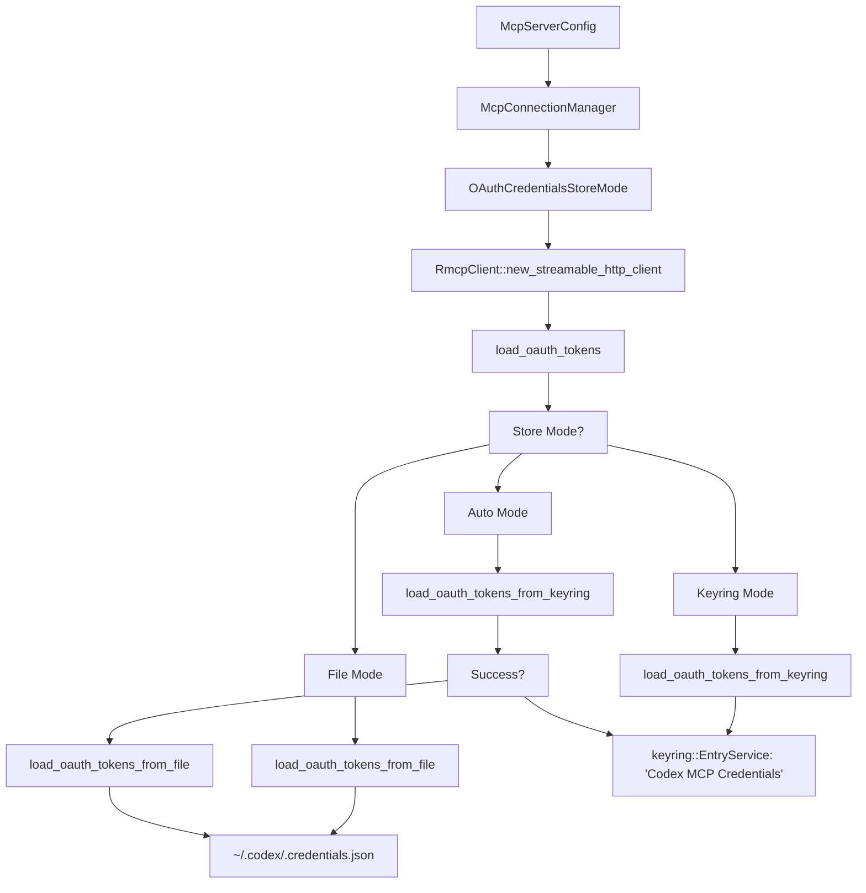

# MCP 的 OAuth 认证

相关源文件

-   [codex-rs/app-server/tests/suite/v2/mcp\_server\_elicitation.rs](https://github.com/openai/codex/blob/d807d44a/codex-rs/app-server/tests/suite/v2/mcp_server_elicitation.rs)
-   [codex-rs/cli/src/mcp\_cmd.rs](https://github.com/openai/codex/blob/d807d44a/codex-rs/cli/src/mcp_cmd.rs)
-   [codex-rs/cli/tests/mcp\_add\_remove.rs](https://github.com/openai/codex/blob/d807d44a/codex-rs/cli/tests/mcp_add_remove.rs)
-   [codex-rs/cli/tests/mcp\_list.rs](https://github.com/openai/codex/blob/d807d44a/codex-rs/cli/tests/mcp_list.rs)
-   [codex-rs/core/src/mcp/auth.rs](https://github.com/openai/codex/blob/d807d44a/codex-rs/core/src/mcp/auth.rs)
-   [codex-rs/core/src/mcp\_connection\_manager.rs](https://github.com/openai/codex/blob/d807d44a/codex-rs/core/src/mcp_connection_manager.rs)
-   [codex-rs/core/src/mcp\_connection\_manager\_tests.rs](https://github.com/openai/codex/blob/d807d44a/codex-rs/core/src/mcp_connection_manager_tests.rs)
-   [codex-rs/core/src/state/session.rs](https://github.com/openai/codex/blob/d807d44a/codex-rs/core/src/state/session.rs)
-   [codex-rs/core/src/state/turn.rs](https://github.com/openai/codex/blob/d807d44a/codex-rs/core/src/state/turn.rs)
-   [codex-rs/core/src/tasks/mod.rs](https://github.com/openai/codex/blob/d807d44a/codex-rs/core/src/tasks/mod.rs)
-   [codex-rs/core/src/tools/handlers/mcp\_resource.rs](https://github.com/openai/codex/blob/d807d44a/codex-rs/core/src/tools/handlers/mcp_resource.rs)
-   [codex-rs/core/src/tools/handlers/tool\_search\_tests.rs](https://github.com/openai/codex/blob/d807d44a/codex-rs/core/src/tools/handlers/tool_search_tests.rs)
-   [codex-rs/core/tests/suite/rmcp\_client.rs](https://github.com/openai/codex/blob/d807d44a/codex-rs/core/tests/suite/rmcp_client.rs)
-   [codex-rs/core/tests/suite/truncation.rs](https://github.com/openai/codex/blob/d807d44a/codex-rs/core/tests/suite/truncation.rs)
-   [codex-rs/core/tests/suite/user\_shell\_cmd.rs](https://github.com/openai/codex/blob/d807d44a/codex-rs/core/tests/suite/user_shell_cmd.rs)
-   [codex-rs/rmcp-client/Cargo.toml](https://github.com/openai/codex/blob/d807d44a/codex-rs/rmcp-client/Cargo.toml)
-   [codex-rs/rmcp-client/src/auth\_status.rs](https://github.com/openai/codex/blob/d807d44a/codex-rs/rmcp-client/src/auth_status.rs)
-   [codex-rs/rmcp-client/src/bin/rmcp\_test\_server.rs](https://github.com/openai/codex/blob/d807d44a/codex-rs/rmcp-client/src/bin/rmcp_test_server.rs)
-   [codex-rs/rmcp-client/src/bin/test\_stdio\_server.rs](https://github.com/openai/codex/blob/d807d44a/codex-rs/rmcp-client/src/bin/test_stdio_server.rs)
-   [codex-rs/rmcp-client/src/bin/test\_streamable\_http\_server.rs](https://github.com/openai/codex/blob/d807d44a/codex-rs/rmcp-client/src/bin/test_streamable_http_server.rs)
-   [codex-rs/rmcp-client/src/lib.rs](https://github.com/openai/codex/blob/d807d44a/codex-rs/rmcp-client/src/lib.rs)
-   [codex-rs/rmcp-client/src/logging\_client\_handler.rs](https://github.com/openai/codex/blob/d807d44a/codex-rs/rmcp-client/src/logging_client_handler.rs)
-   [codex-rs/rmcp-client/src/oauth.rs](https://github.com/openai/codex/blob/d807d44a/codex-rs/rmcp-client/src/oauth.rs)
-   [codex-rs/rmcp-client/src/perform\_oauth\_login.rs](https://github.com/openai/codex/blob/d807d44a/codex-rs/rmcp-client/src/perform_oauth_login.rs)
-   [codex-rs/rmcp-client/src/rmcp\_client.rs](https://github.com/openai/codex/blob/d807d44a/codex-rs/rmcp-client/src/rmcp_client.rs)
-   [codex-rs/rmcp-client/tests/resources.rs](https://github.com/openai/codex/blob/d807d44a/codex-rs/rmcp-client/tests/resources.rs)
-   [codex-rs/rmcp-client/tests/streamable\_http\_recovery.rs](https://github.com/openai/codex/blob/d807d44a/codex-rs/rmcp-client/tests/streamable_http_recovery.rs)
-   [codex-rs/utils/home-dir/BUILD.bazel](https://github.com/openai/codex/blob/d807d44a/codex-rs/utils/home-dir/BUILD.bazel)
-   [codex-rs/utils/home-dir/Cargo.toml](https://github.com/openai/codex/blob/d807d44a/codex-rs/utils/home-dir/Cargo.toml)
-   [codex-rs/utils/home-dir/src/lib.rs](https://github.com/openai/codex/blob/d807d44a/codex-rs/utils/home-dir/src/lib.rs)

## 概览

OAuth 2.0 认证仅支持使用 **StreamableHttp** 传输的 MCP 服务器。Stdio 传输服务器不支持 Codex 内置 OAuth 机制。配置后，Codex 会执行带 PKCE（Proof Key for Code Exchange）的 OAuth 2.0 授权码流程：打开浏览器供用户授权，然后将得到的凭据安全存储到系统 keyring，或回退到文件存储。[codex-rs/rmcp-client/src/perform\_oauth\_login.rs73-103](https://github.com/openai/codex/blob/d807d44a/codex-rs/rmcp-client/src/perform_oauth_login.rs#L73-L103)

OAuth 系统由四个主要组件构成：

1.  **OAuth Flow** - 通过 `perform_oauth_login` 执行基于浏览器授权与本地回调服务器的流程 [codex-rs/rmcp-client/src/perform\_oauth\_login.rs73-103](https://github.com/openai/codex/blob/d807d44a/codex-rs/rmcp-client/src/perform_oauth_login.rs#L73-L103)
2.  **Credential Storage** - 通过 `keyring` crate 实现平台特定安全存储并提供回退 [codex-rs/rmcp-client/src/oauth.rs66-110](https://github.com/openai/codex/blob/d807d44a/codex-rs/rmcp-client/src/oauth.rs#L66-L110)
3.  **OAuthPersistor** - 管理 token 生命周期、刷新与持久化 [codex-rs/rmcp-client/src/oauth.rs295-336](https://github.com/openai/codex/blob/d807d44a/codex-rs/rmcp-client/src/oauth.rs#L295-L336)
4.  **Auth Status Tracking** - 运行时检测认证状态 [codex-rs/core/src/mcp/auth.rs1-100](https://github.com/openai/codex/blob/d807d44a/codex-rs/core/src/mcp/auth.rs#L1-L100)

OAuth 凭据由 `codex_rmcp_client` crate 管理。`OAuthPersistor` 封装了来自 `rmcp` SDK 的 `AuthorizationManager`，并处理 token 自动刷新与持久化 [codex-rs/rmcp-client/src/oauth.rs338-431](https://github.com/openai/codex/blob/d807d44a/codex-rs/rmcp-client/src/oauth.rs#L338-L431) `McpConnectionManager` 在建立 StreamableHttp 连接时集成这些组件 [codex-rs/core/src/mcp\_connection\_manager.rs974-1016](https://github.com/openai/codex/blob/d807d44a/codex-rs/core/src/mcp_connection_manager.rs#L974-L1016)

Sources: [codex-rs/rmcp-client/src/oauth.rs1-17](https://github.com/openai/codex/blob/d807d44a/codex-rs/rmcp-client/src/oauth.rs#L1-L17) [codex-rs/rmcp-client/src/perform\_oauth\_login.rs1-71](https://github.com/openai/codex/blob/d807d44a/codex-rs/rmcp-client/src/perform_oauth_login.rs#L1-L71) [codex-rs/rmcp-client/src/rmcp\_client.rs1-64](https://github.com/openai/codex/blob/d807d44a/codex-rs/rmcp-client/src/rmcp_client.rs#L1-L64)

---

## StreamableHttp 服务器的 OAuth 流程

### 流程架构

当用户运行 `codex mcp login <server-name>` 时，Codex 会启动带 PKCE 的 OAuth 2.0 授权码流程。该流程包括：启动本地 HTTP 服务器接收授权回调、打开用户浏览器访问授权 URL、将授权码交换为 access token 和 refresh token [codex-rs/cli/src/mcp\_cmd.rs322-363](https://github.com/openai/codex/blob/d807d44a/codex-rs/cli/src/mcp_cmd.rs#L322-L363)

**OAuth 授权流程**

> **[Mermaid sequence]**
> *(图表结构无法解析)*

Sources: [codex-rs/cli/src/mcp\_cmd.rs322-363](https://github.com/openai/codex/blob/d807d44a/codex-rs/cli/src/mcp_cmd.rs#L322-L363) [codex-rs/rmcp-client/src/perform\_oauth\_login.rs142-185](https://github.com/openai/codex/blob/d807d44a/codex-rs/rmcp-client/src/perform_oauth_login.rs#L142-L185)

### OAuth 配置字段

当配置 StreamableHttp MCP 服务器时会触发 OAuth 流程。`McpServerConfig` 支持以下字段 [codex-rs/core/src/config/types.rs44-80](https://github.com/openai/codex/blob/d807d44a/codex-rs/core/src/config/types.rs#L44-L80)：

| Field | Type | Required | Description |
| --- | --- | --- | --- |
| `url` | `String` | Yes | MCP 服务器端点 URL |
| `scopes` | `Option<Vec<String>>` | No | 授权期间请求的 OAuth scopes |
| `bearer_token_env_var` | `Option<String>` | No | 替代方案：从环境变量读取 bearer token |
| `oauth_resource` | `Option<String>` | No | OAuth 请求的可选 resource 参数 |

**OAuth 与环境变量认证对比：**

-   若设置 `bearer_token_env_var`，Codex 会使用该 token 并完全跳过 OAuth [codex-rs/rmcp-client/src/rmcp\_client.rs248-259](https://github.com/openai/codex/blob/d807d44a/codex-rs/rmcp-client/src/rmcp_client.rs#L248-L259)
-   若未设置 `bearer_token_env_var` 且不存在 OAuth 凭据，Codex 会通过 `supports_oauth_login` 检查服务器是否支持 OAuth [codex-rs/rmcp-client/src/auth\_status.rs1-50](https://github.com/openai/codex/blob/d807d44a/codex-rs/rmcp-client/src/auth_status.rs#L1-L50)
-   若支持 OAuth，会提示用户运行 `codex mcp login` [codex-rs/cli/src/mcp\_cmd.rs265-285](https://github.com/openai/codex/blob/d807d44a/codex-rs/cli/src/mcp_cmd.rs#L265-L285)

Sources: [codex-rs/core/src/config/types.rs44-80](https://github.com/openai/codex/blob/d807d44a/codex-rs/core/src/config/types.rs#L44-L80) [codex-rs/cli/src/mcp\_cmd.rs265-285](https://github.com/openai/codex/blob/d807d44a/codex-rs/cli/src/mcp_cmd.rs#L265-L285) [codex-rs/rmcp-client/src/rmcp\_client.rs248-259](https://github.com/openai/codex/blob/d807d44a/codex-rs/rmcp-client/src/rmcp_client.rs#L248-L259)

### OAuth 回调服务器

`OauthLoginFlow` 会在 `localhost` 上启动临时 `tiny_http::Server` 接收 OAuth 回调 [codex-rs/rmcp-client/src/perform\_oauth\_login.rs142-185](https://github.com/openai/codex/blob/d807d44a/codex-rs/rmcp-client/src/perform_oauth_login.rs#L142-L185) 服务器生命周期由 `CallbackServerGuard` 管理，以确保清理 [codex-rs/rmcp-client/src/perform\_oauth\_login.rs32-40](https://github.com/openai/codex/blob/d807d44a/codex-rs/rmcp-client/src/perform_oauth_login.rs#L32-L40)

**回调流程：**

1.  `spawn_callback_server` 启动阻塞任务等待 HTTP 请求 [codex-rs/rmcp-client/src/perform\_oauth\_login.rs142-147](https://github.com/openai/codex/blob/d807d44a/codex-rs/rmcp-client/src/perform_oauth_login.rs#L142-L147)
2.  `parse_oauth_callback` 校验回调路径并提取查询参数 `code` 与 `state` [codex-rs/rmcp-client/src/perform\_oauth\_login.rs206-236](https://github.com/openai/codex/blob/d807d44a/codex-rs/rmcp-client/src/perform_oauth_login.rs#L206-L236)
3.  服务器响应 “Authentication complete” 或错误消息 [codex-rs/rmcp-client/src/perform\_oauth\_login.rs152-166](https://github.com/openai/codex/blob/d807d44a/codex-rs/rmcp-client/src/perform_oauth_login.rs#L152-L166)
4.  `CallbackServerGuard::drop` 调用 `server.unblock()` 关闭服务器 [codex-rs/rmcp-client/src/perform\_oauth\_login.rs36-40](https://github.com/openai/codex/blob/d807d44a/codex-rs/rmcp-client/src/perform_oauth_login.rs#L36-L40)

Sources: [codex-rs/rmcp-client/src/perform\_oauth\_login.rs108-146](https://github.com/openai/codex/blob/d807d44a/codex-rs/rmcp-client/src/perform_oauth_login.rs#L108-L146) [codex-rs/rmcp-client/src/perform\_oauth\_login.rs206-236](https://github.com/openai/codex/blob/d807d44a/codex-rs/rmcp-client/src/perform_oauth_login.rs#L206-L236) [codex-rs/rmcp-client/src/perform\_oauth\_login.rs32-40](https://github.com/openai/codex/blob/d807d44a/codex-rs/rmcp-client/src/perform_oauth_login.rs#L32-L40)

---

## 凭据存储

### 存储模式

Codex 通过 `OAuthCredentialsStoreMode` 枚举支持三种凭据存储模式 [codex-rs/rmcp-client/src/oauth.rs66-79](https://github.com/openai/codex/blob/d807d44a/codex-rs/rmcp-client/src/oauth.rs#L66-L79)：

| Mode | Description | Behavior |
| --- | --- | --- |
| `Auto` (default) | 尝试 keyring，失败回退到文件 | 尝试 `keyring` crate 存储；失败则回退到 `~/.codex/.credentials.json` |
| `File` | 始终使用文件存储 | 直接写入 `~/.codex/.credentials.json` |
| `Keyring` | 强制使用 keyring 存储 | 若 keyring 不可用则失败 |

**平台相关 Keyring 后端：**

`keyring` crate 使用平台特定安全存储 [codex-rs/rmcp-client/Cargo.toml66-73](https://github.com/openai/codex/blob/d807d44a/codex-rs/rmcp-client/Cargo.toml#L66-L73)：

-   **macOS**：macOS Keychain（`apple-native`）
-   **Windows**：Windows Credential Manager（`windows-native`）
-   **Linux**：内核 `keyutils` 或 DBus Secret Service（`linux-native-async-persistent`）

**凭据存储架构**


Sources: [codex-rs/rmcp-client/src/oauth.rs66-79](https://github.com/openai/codex/blob/d807d44a/codex-rs/rmcp-client/src/oauth.rs#L66-L79) [codex-rs/rmcp-client/src/oauth.rs94-110](https://github.com/openai/codex/blob/d807d44a/codex-rs/rmcp-client/src/oauth.rs#L94-L110) [codex-rs/rmcp-client/Cargo.toml66-73](https://github.com/openai/codex/blob/d807d44a/codex-rs/rmcp-client/Cargo.toml#L66-L73)

### 凭据键结构与数据模型

OAuth 凭据通过由 `(server_name, server_url)` 派生的复合键存储，并使用 SHA-256 哈希 [codex-rs/rmcp-client/src/oauth.rs56-64](https://github.com/openai/codex/blob/d807d44a/codex-rs/rmcp-client/src/oauth.rs#L56-L64)

**StoredOAuthTokens 结构：** [codex-rs/rmcp-client/src/oauth.rs248-260](https://github.com/openai/codex/blob/d807d44a/codex-rs/rmcp-client/src/oauth.rs#L248-L260)

```
pub struct StoredOAuthTokens {    pub server_name: String,    pub url: String,    pub client_id: String,    pub token_response: WrappedOAuthTokenResponse,    pub expires_at: Option<u64>,}
```
Sources: [codex-rs/rmcp-client/src/oauth.rs56-64](https://github.com/openai/codex/blob/d807d44a/codex-rs/rmcp-client/src/oauth.rs#L56-L64) [codex-rs/rmcp-client/src/oauth.rs248-260](https://github.com/openai/codex/blob/d807d44a/codex-rs/rmcp-client/src/oauth.rs#L248-L260)

---

## OAuthPersistor 与 Token 刷新

### OAuthPersistor 结构

`OAuthPersistor` 管理 OAuth token 生命周期，并封装 `AuthorizationManager` [codex-rs/rmcp-client/src/oauth.rs295-336](https://github.com/openai/codex/blob/d807d44a/codex-rs/rmcp-client/src/oauth.rs#L295-L336)

```
pub struct OAuthPersistor {    server_name: String,    url: String,    auth_manager: Arc<Mutex<AuthorizationManager>>,    credentials_store: OAuthCredentialsStoreMode,    // ...}
```
### 自动 Token 刷新

token 刷新由 `AuthClient` 包装器自动触发。`OAuthPersistor` 会确保刷新后的 token 持久化回安全存储 [codex-rs/rmcp-client/src/oauth.rs338-431](https://github.com/openai/codex/blob/d807d44a/codex-rs/rmcp-client/src/oauth.rs#L338-L431)

**Token 刷新流程**

> **[Mermaid sequence]**
> *(图表结构无法解析)*

Sources: [codex-rs/rmcp-client/src/oauth.rs338-431](https://github.com/openai/codex/blob/d807d44a/codex-rs/rmcp-client/src/oauth.rs#L338-L431) [codex-rs/rmcp-client/src/rmcp\_client.rs569-583](https://github.com/openai/codex/blob/d807d44a/codex-rs/rmcp-client/src/rmcp_client.rs#L569-L583)

---

## 认证状态跟踪

Codex 会跟踪每个已配置 MCP 服务器的认证状态。`McpAuthStatus` 枚举定义了这些状态 [codex-rs/cli/src/mcp\_cmd.rs395-409](https://github.com/openai/codex/blob/d807d44a/codex-rs/cli/src/mcp_cmd.rs#L395-L409)：

| Status | Description |
| --- | --- |
| `Authenticated` | 已存储有效 OAuth 凭据 [codex-rs/cli/src/mcp\_cmd.rs519-535](https://github.com/openai/codex/blob/d807d44a/codex-rs/cli/src/mcp_cmd.rs#L519-L535) |
| `Unauthenticated` | 支持 OAuth，但用户尚未登录 [codex-rs/cli/src/mcp\_cmd.rs519-535](https://github.com/openai/codex/blob/d807d44a/codex-rs/cli/src/mcp_cmd.rs#L519-L535) |
| `Unsupported` | 服务器使用 `bearer_token_env_var` 或 Stdio 传输 [codex-rs/cli/src/mcp\_cmd.rs519-535](https://github.com/openai/codex/blob/d807d44a/codex-rs/cli/src/mcp_cmd.rs#L519-L535) |

`codex_core::mcp::auth` 中的 `compute_auth_statuses` 函数会通过检查各服务器的凭据存储执行状态检测 [codex-rs/cli/src/mcp\_cmd.rs16-18](https://github.com/openai/codex/blob/d807d44a/codex-rs/cli/src/mcp_cmd.rs#L16-L18)

Sources: [codex-rs/cli/src/mcp\_cmd.rs395-409](https://github.com/openai/codex/blob/d807d44a/codex-rs/cli/src/mcp_cmd.rs#L395-L409) [codex-rs/cli/src/mcp\_cmd.rs519-535](https://github.com/openai/codex/blob/d807d44a/codex-rs/cli/src/mcp_cmd.rs#L519-L535) [codex-rs/core/src/mcp/auth.rs1-100](https://github.com/openai/codex/blob/d807d44a/codex-rs/core/src/mcp/auth.rs#L1-L100)

---

## CLI 命令

### `codex mcp login`

为 StreamableHttp MCP 服务器启动 OAuth 流程 [codex-rs/cli/src/mcp\_cmd.rs322-363](https://github.com/openai/codex/blob/d807d44a/codex-rs/cli/src/mcp_cmd.rs#L322-L363)

**用法：**

```
codex mcp login <server-name> --scopes scope1,scope2
```
### `codex mcp logout`

移除 MCP 服务器的已存储 OAuth 凭据 [codex-rs/cli/src/mcp\_cmd.rs365-393](https://github.com/openai/codex/blob/d807d44a/codex-rs/cli/src/mcp_cmd.rs#L365-L393)

**用法：**

```
codex mcp logout <server-name>
```
Sources: [codex-rs/cli/src/mcp\_cmd.rs322-363](https://github.com/openai/codex/blob/d807d44a/codex-rs/cli/src/mcp_cmd.rs#L322-L363) [codex-rs/cli/src/mcp\_cmd.rs365-393](https://github.com/openai/codex/blob/d807d44a/codex-rs/cli/src/mcp_cmd.rs#L365-L393)

---

## 安全注意事项

### 存储安全

-   **Keyring**：通过 OS 级安全机制加密（Keychain、Credential Manager）[codex-rs/rmcp-client/Cargo.toml66-73](https://github.com/openai/codex/blob/d807d44a/codex-rs/rmcp-client/Cargo.toml#L66-L73)
-   **文件回退**：存储在 `~/.codex/.credentials.json`。Codex 会尝试设置严格权限（0600），但静态存储仍为未加密 [codex-rs/rmcp-client/src/oauth.rs1-17](https://github.com/openai/codex/blob/d807d44a/codex-rs/rmcp-client/src/oauth.rs#L1-L17)

### Bearer Token 替代方式

若配置了 `bearer_token_env_var`，Codex 会从环境读取 token 并跳过 OAuth。这对 CI 或使用静态 API key 的服务器很有用 [codex-rs/rmcp-client/src/rmcp\_client.rs248-259](https://github.com/openai/codex/blob/d807d44a/codex-rs/rmcp-client/src/rmcp_client.rs#L248-L259)

Sources: [codex-rs/rmcp-client/src/oauth.rs1-17](https://github.com/openai/codex/blob/d807d44a/codex-rs/rmcp-client/src/oauth.rs#L1-L17) [codex-rs/rmcp-client/src/rmcp\_client.rs248-259](https://github.com/openai/codex/blob/d807d44a/codex-rs/rmcp-client/src/rmcp_client.rs#L248-L259)
