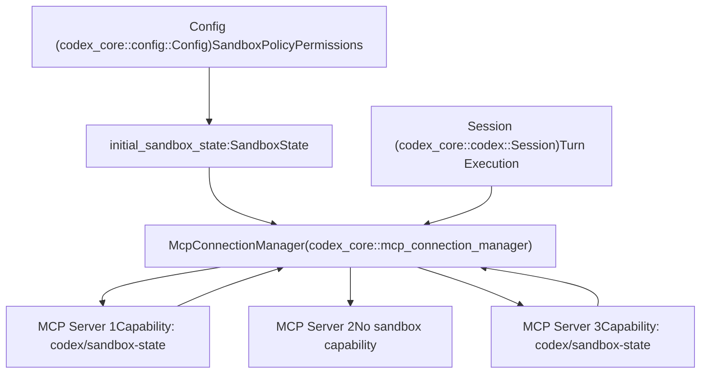
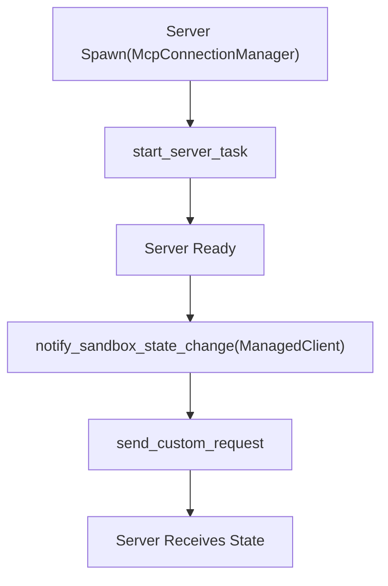

# 沙箱状态同步

相关源文件

-   [codex-rs/ansi-escape/Cargo.toml](https://github.com/openai/codex/blob/d807d44a/codex-rs/ansi-escape/Cargo.toml)
-   [codex-rs/app-server/tests/suite/v2/mcp\_server\_elicitation.rs](https://github.com/openai/codex/blob/d807d44a/codex-rs/app-server/tests/suite/v2/mcp_server_elicitation.rs)
-   [codex-rs/cli/src/mcp\_cmd.rs](https://github.com/openai/codex/blob/d807d44a/codex-rs/cli/src/mcp_cmd.rs)
-   [codex-rs/cli/tests/mcp\_add\_remove.rs](https://github.com/openai/codex/blob/d807d44a/codex-rs/cli/tests/mcp_add_remove.rs)
-   [codex-rs/cli/tests/mcp\_list.rs](https://github.com/openai/codex/blob/d807d44a/codex-rs/cli/tests/mcp_list.rs)
-   [codex-rs/core/src/mcp\_connection\_manager.rs](https://github.com/openai/codex/blob/d807d44a/codex-rs/core/src/mcp_connection_manager.rs)
-   [codex-rs/core/src/mcp\_connection\_manager\_tests.rs](https://github.com/openai/codex/blob/d807d44a/codex-rs/core/src/mcp_connection_manager_tests.rs)
-   [codex-rs/core/src/state/session.rs](https://github.com/openai/codex/blob/d807d44a/codex-rs/core/src/state/session.rs)
-   [codex-rs/core/src/state/turn.rs](https://github.com/openai/codex/blob/d807d44a/codex-rs/core/src/state/turn.rs)
-   [codex-rs/core/src/tasks/mod.rs](https://github.com/openai/codex/blob/d807d44a/codex-rs/core/src/tasks/mod.rs)
-   [codex-rs/core/src/tools/handlers/tool\_search\_tests.rs](https://github.com/openai/codex/blob/d807d44a/codex-rs/core/src/tools/handlers/tool_search_tests.rs)
-   [codex-rs/core/tests/suite/rmcp\_client.rs](https://github.com/openai/codex/blob/d807d44a/codex-rs/core/tests/suite/rmcp_client.rs)
-   [codex-rs/core/tests/suite/truncation.rs](https://github.com/openai/codex/blob/d807d44a/codex-rs/core/tests/suite/truncation.rs)
-   [codex-rs/core/tests/suite/user\_shell\_cmd.rs](https://github.com/openai/codex/blob/d807d44a/codex-rs/core/tests/suite/user_shell_cmd.rs)
-   [codex-rs/rmcp-client/src/rmcp\_client.rs](https://github.com/openai/codex/blob/d807d44a/codex-rs/rmcp-client/src/rmcp_client.rs)
-   [codex-rs/rmcp-client/tests/streamable\_http\_recovery.rs](https://github.com/openai/codex/blob/d807d44a/codex-rs/rmcp-client/tests/streamable_http_recovery.rs)

## 目的与范围

本文档描述 Codex 如何通过自定义协议扩展将沙箱执行状态与 MCP 服务器同步。当 Codex 强制执行沙箱限制（只读访问、工作区边界、特定沙箱机制）时，MCP 服务器需要感知这些约束，以便相应调整其工具行为。

关于通用 MCP 服务器配置与生命周期管理，参见 [6.2 MCP Connection Manager](https://github.com/openai/codex/blob/d807d44a/6.2 MCP Connection Manager)；关于 Codex 自身的沙箱策略配置，参见 [2.4 Sandbox and Approval Policies](https://github.com/openai/codex/blob/d807d44a/2.4 Sandbox and Approval Policies)

---

## 概览

沙箱状态同步是模型上下文协议上的 Codex 特定扩展，使 MCP 服务器能够接收当前沙箱执行环境的通知。这让外部工具服务器可以：

-   了解当前激活的沙箱策略（`ReadOnly`、`WorkspaceWrite`、`DangerFullAccess`）。
-   知道沙箱操作的工作目录。
-   接收平台特定沙箱执行器路径（例如 Linux 的 Landlock）。
-   使工具执行与 Codex 的安全约束保持一致。

同步通过自定义 MCP 能力（`codex/sandbox-state`）和通知方法（`codex/sandbox-state/update`）将状态变化从 Codex 传播到已连接服务器。

Sources: [codex-rs/core/src/mcp\_connection\_manager.rs581-595](https://github.com/openai/codex/blob/d807d44a/codex-rs/core/src/mcp_connection_manager.rs#L581-L595)

---

## 系统架构

下图展示沙箱状态如何从核心配置流经 `McpConnectionManager`，再传递到外部服务器。

### 沙箱状态传播流程


Sources: [codex-rs/core/src/mcp\_connection\_manager.rs635-756](https://github.com/openai/codex/blob/d807d44a/codex-rs/core/src/mcp_connection_manager.rs#L635-L756) [codex-rs/core/src/mcp\_connection\_manager.rs1058-1069](https://github.com/openai/codex/blob/d807d44a/codex-rs/core/src/mcp_connection_manager.rs#L1058-L1069)

---

## SandboxState 结构

`SandboxState` 结构包含 MCP 服务器理解 Codex 执行环境所需的全部信息。

| Field | Type | Description |
| --- | --- | --- |
| `sandbox_policy` | `SandboxPolicy` | 当前激活策略：`ReadOnly`、`WorkspaceWrite` 或 `DangerFullAccess`。 |
| `codex_linux_sandbox_exe` | `Option<PathBuf>` | Linux 沙箱包装器可执行文件路径（landlock 实现）。 |
| `sandbox_cwd` | `PathBuf` | 沙箱操作的当前工作目录。 |
| `use_legacy_landlock` | `bool` | 是否使用 legacy landlock 实现（默认：false）。 |

该结构在通过 MCP 传输发送时会序列化为 JSON，字段名为 camelCase。

Sources: [codex-rs/core/src/mcp\_connection\_manager.rs587-595](https://github.com/openai/codex/blob/d807d44a/codex-rs/core/src/mcp_connection_manager.rs#L587-L595)

---

## 能力协商

### 服务器能力声明

MCP 服务器可在初始化响应中包含 `codex/sandbox-state` 能力，以声明支持沙箱状态通知：

```
{  "capabilities": {    "experimental": {      "codex/sandbox-state": {}    }  }}
```
### 客户端能力检查

在服务器初始化期间，Codex 会检查能力支持并将结果存储在 `ManagedClient` 结构中。

### 协商时序

> **[Mermaid sequence]**
> *(图表结构无法解析)*

在发送任何通知前，会在 `ManagedClient::notify_sandbox_state_change` 中检查该能力标志。

Sources: [codex-rs/core/src/mcp\_connection\_manager.rs370-421](https://github.com/openai/codex/blob/d807d44a/codex-rs/core/src/mcp_connection_manager.rs#L370-L421) [codex-rs/core/src/mcp\_connection\_manager.rs407-420](https://github.com/openai/codex/blob/d807d44a/codex-rs/core/src/mcp_connection_manager.rs#L407-L420)

---

## 通知时机

### 启动时的初始通知

当 MCP 服务器在 `start_server_task` 中转换到 `Ready` 状态时，Codex 会立即发送当前沙箱状态。

### 初始通知流程


初始状态会在构造 `McpConnectionManager` 时基于当前 `Config` 与会话环境捕获。

Sources: [codex-rs/core/src/mcp\_connection\_manager.rs687-703](https://github.com/openai/codex/blob/d807d44a/codex-rs/core/src/mcp_connection_manager.rs#L687-L703)

### 运行时通知

公共 API 方法 `notify_all_sandbox_state_change` 允许 Codex 在执行期间沙箱配置变化时推送更新（例如会话策略更新）。

### 运行时通知时序

> **[Mermaid sequence]**
> *(图表结构无法解析)*

Sources: [codex-rs/core/src/mcp\_connection\_manager.rs1058-1069](https://github.com/openai/codex/blob/d807d44a/codex-rs/core/src/mcp_connection_manager.rs#L1058-L1069)

---

## 协议细节

### 自定义请求方法

通知使用 MCP 自定义请求机制，并采用以下 Codex 特定标识符：

| Constant | Value | Usage |
| --- | --- | --- |
| `MCP_SANDBOX_STATE_CAPABILITY` | `"codex/sandbox-state"` | 服务器元数据中的能力标识符。 |
| `MCP_SANDBOX_STATE_METHOD` | `"codex/sandbox-state/update"` | 自定义请求方法名。 |

该请求会作为 MCP 自定义请求发送，并将 `SandboxState` 结构序列化为 `params`。服务器应以空响应或错误状态对该请求进行确认。

Sources: [codex-rs/core/src/mcp\_connection\_manager.rs581-585](https://github.com/openai/codex/blob/d807d44a/codex-rs/core/src/mcp_connection_manager.rs#L581-L585) [codex-rs/core/src/mcp\_connection\_manager.rs412-418](https://github.com/openai/codex/blob/d807d44a/codex-rs/core/src/mcp_connection_manager.rs#L412-L418)

---

## 实现参考

### 关键类型

| Type | Location | Purpose |
| --- | --- | --- |
| `SandboxState` | [codex-rs/core/src/mcp\_connection\_manager.rs587-595](https://github.com/openai/codex/blob/d807d44a/codex-rs/core/src/mcp_connection_manager.rs#L587-L595) | 包含沙箱策略与环境的数据结构。 |
| `ManagedClient` | [codex-rs/core/src/mcp\_connection\_manager.rs370-421](https://github.com/openai/codex/blob/d807d44a/codex-rs/core/src/mcp_connection_manager.rs#L370-L421) | 跟踪能力的 MCP 客户端内部包装。 |
| `AsyncManagedClient` | [codex-rs/core/src/mcp\_connection\_manager.rs423-579](https://github.com/openai/codex/blob/d807d44a/codex-rs/core/src/mcp_connection_manager.rs#L423-L579) | 处理异步生命周期与通知分发。 |
| `McpConnectionManager` | [codex-rs/core/src/mcp\_connection\_manager.rs598-1095](https://github.com/openai/codex/blob/d807d44a/codex-rs/core/src/mcp_connection_manager.rs#L598-L1095) | 协调全部 MCP 连接并广播状态更新。 |

### 关键方法

-   `ManagedClient::notify_sandbox_state_change`：检查能力并发送 `codex/sandbox-state/update` 请求。[codex-rs/core/src/mcp\_connection\_manager.rs407-420](https://github.com/openai/codex/blob/d807d44a/codex-rs/core/src/mcp_connection_manager.rs#L407-L420)
-   `McpConnectionManager::notify_all_sandbox_state_change`：用于运行时更新的公共广播方法。[codex-rs/core/src/mcp\_connection\_manager.rs1058-1069](https://github.com/openai/codex/blob/d807d44a/codex-rs/core/src/mcp_connection_manager.rs#L1058-L1069)

Sources: [codex-rs/core/src/mcp\_connection\_manager.rs407-420](https://github.com/openai/codex/blob/d807d44a/codex-rs/core/src/mcp_connection_manager.rs#L407-L420) [codex-rs/core/src/mcp\_connection\_manager.rs1058-1069](https://github.com/openai/codex/blob/d807d44a/codex-rs/core/src/mcp_connection_manager.rs#L1058-L1069)

---

## 错误处理

同步机制设计为非阻塞且具备韧性：

-   **能力检查**：不具备该能力的服务器会被静默跳过，不报错。
-   **单点失败**：单个服务器错误（如超时或拒绝）会通过 `tracing::warn!` 记录，但不会中止对其他服务器的通知循环。[codex-rs/core/src/mcp\_connection\_manager.rs1064-1068](https://github.com/openai/codex/blob/d807d44a/codex-rs/core/src/mcp_connection_manager.rs#L1064-L1068)
-   **传输韧性**：传输层错误会经 `RmcpClient` 传播，但在管理器层捕获。

Sources: [codex-rs/core/src/mcp\_connection\_manager.rs1058-1069](https://github.com/openai/codex/blob/d807d44a/codex-rs/core/src/mcp_connection_manager.rs#L1058-L1069) [codex-rs/core/src/mcp\_connection\_manager.rs695-703](https://github.com/openai/codex/blob/d807d44a/codex-rs/core/src/mcp_connection_manager.rs#L695-L703)

---

## 平台注意事项

### Linux 沙箱可执行文件

`codex_linux_sandbox_exe` 字段提供使用 Landlock LSM 的 Linux 特定沙箱包装器路径。这使 Linux 上的 MCP 服务器能够与 Codex 保持一致的安全边界。

### 跨平台行为

| Platform | Sandbox Mechanism | `codex_linux_sandbox_exe` Value |
| --- | --- | --- |
| Linux | Landlock LSM | 指向 `codex-linux-sandbox` 二进制的路径。 |
| macOS | Seatbelt profiles | `None`。 |
| Windows | Restricted tokens | `None`。 |

Sources: [codex-rs/core/src/mcp\_connection\_manager.rs587-595](https://github.com/openai/codex/blob/d807d44a/codex-rs/core/src/mcp_connection_manager.rs#L587-L595)
