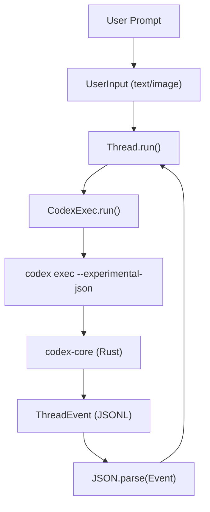
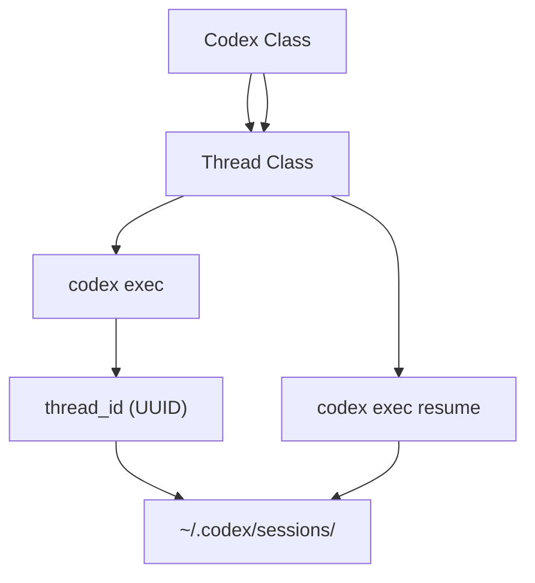

# SDK 与外部集成

相关源文件

-   [.github/workflows/shell-tool-mcp-ci.yml](https://github.com/openai/codex/blob/d807d44a/.github/workflows/shell-tool-mcp-ci.yml)
-   [CHANGELOG.md](https://github.com/openai/codex/blob/d807d44a/CHANGELOG.md?plain=1)
-   [cliff.toml](https://github.com/openai/codex/blob/d807d44a/cliff.toml)
-   [codex-cli/package.json](https://github.com/openai/codex/blob/d807d44a/codex-cli/package.json)
-   [codex-rs/exec/tests/suite/add\_dir.rs](https://github.com/openai/codex/blob/d807d44a/codex-rs/exec/tests/suite/add_dir.rs)
-   [codex-rs/responses-api-proxy/npm/package.json](https://github.com/openai/codex/blob/d807d44a/codex-rs/responses-api-proxy/npm/package.json)
-   [package.json](https://github.com/openai/codex/blob/d807d44a/package.json)
-   [pnpm-lock.yaml](https://github.com/openai/codex/blob/d807d44a/pnpm-lock.yaml)
-   [pnpm-workspace.yaml](https://github.com/openai/codex/blob/d807d44a/pnpm-workspace.yaml)
-   [sdk/typescript/.prettierignore](https://github.com/openai/codex/blob/d807d44a/sdk/typescript/.prettierignore)
-   [sdk/typescript/README.md](https://github.com/openai/codex/blob/d807d44a/sdk/typescript/README.md?plain=1)
-   [sdk/typescript/eslint.config.js](https://github.com/openai/codex/blob/d807d44a/sdk/typescript/eslint.config.js)
-   [sdk/typescript/jest.config.cjs](https://github.com/openai/codex/blob/d807d44a/sdk/typescript/jest.config.cjs)
-   [sdk/typescript/package.json](https://github.com/openai/codex/blob/d807d44a/sdk/typescript/package.json)
-   [sdk/typescript/samples/basic\_streaming.ts](https://github.com/openai/codex/blob/d807d44a/sdk/typescript/samples/basic_streaming.ts)
-   [sdk/typescript/src/codex.ts](https://github.com/openai/codex/blob/d807d44a/sdk/typescript/src/codex.ts)
-   [sdk/typescript/src/codexOptions.ts](https://github.com/openai/codex/blob/d807d44a/sdk/typescript/src/codexOptions.ts)
-   [sdk/typescript/src/events.ts](https://github.com/openai/codex/blob/d807d44a/sdk/typescript/src/events.ts)
-   [sdk/typescript/src/exec.ts](https://github.com/openai/codex/blob/d807d44a/sdk/typescript/src/exec.ts)
-   [sdk/typescript/src/index.ts](https://github.com/openai/codex/blob/d807d44a/sdk/typescript/src/index.ts)
-   [sdk/typescript/src/items.ts](https://github.com/openai/codex/blob/d807d44a/sdk/typescript/src/items.ts)
-   [sdk/typescript/src/thread.ts](https://github.com/openai/codex/blob/d807d44a/sdk/typescript/src/thread.ts)
-   [sdk/typescript/src/threadOptions.ts](https://github.com/openai/codex/blob/d807d44a/sdk/typescript/src/threadOptions.ts)
-   [sdk/typescript/src/turnOptions.ts](https://github.com/openai/codex/blob/d807d44a/sdk/typescript/src/turnOptions.ts)
-   [sdk/typescript/tests/abort.test.ts](https://github.com/openai/codex/blob/d807d44a/sdk/typescript/tests/abort.test.ts)
-   [sdk/typescript/tests/codexExecSpy.ts](https://github.com/openai/codex/blob/d807d44a/sdk/typescript/tests/codexExecSpy.ts)
-   [sdk/typescript/tests/exec.test.ts](https://github.com/openai/codex/blob/d807d44a/sdk/typescript/tests/exec.test.ts)
-   [sdk/typescript/tests/responsesProxy.ts](https://github.com/openai/codex/blob/d807d44a/sdk/typescript/tests/responsesProxy.ts)
-   [sdk/typescript/tests/run.test.ts](https://github.com/openai/codex/blob/d807d44a/sdk/typescript/tests/run.test.ts)
-   [sdk/typescript/tests/runStreamed.test.ts](https://github.com/openai/codex/blob/d807d44a/sdk/typescript/tests/runStreamed.test.ts)
-   [sdk/typescript/tsconfig.json](https://github.com/openai/codex/blob/d807d44a/sdk/typescript/tsconfig.json)
-   [shell-tool-mcp/package.json](https://github.com/openai/codex/blob/d807d44a/shell-tool-mcp/package.json)
-   [shell-tool-mcp/src/index.ts](https://github.com/openai/codex/blob/d807d44a/shell-tool-mcp/src/index.ts)

本页提供官方 SDK 与集成包的高层概览，这些 SDK 与集成包可用于将 Codex 嵌入外部应用与工作流。这些工具使开发者能够以编程方式与 Codex 代理交互、管理对话生命周期，并通过模型上下文协议（MCP）扩展 Shell 能力。

## TypeScript 软件开发工具包（`@openai/codex-sdk`）

TypeScript SDK 提供了一个高级的、基于 Promise 的接口，用于在 Node.js 环境（v18+）中与 Codex 交互。其工作方式是封装 `@openai/codex` CLI，并通过标准 I/O 交换结构化 JSONL 事件 [sdk/typescript/README.md5-13](https://github.com/openai/codex/blob/d807d44a/sdk/typescript/README.md?plain=1#L5-L13)

### 核心组件

-   **`Codex` 类**：SDK 的入口点。负责全局配置，例如 API 密钥、基础 URL 和环境变量覆盖 [sdk/typescript/src/codex.ts14-22](https://github.com/openai/codex/blob/d807d44a/sdk/typescript/src/codex.ts#L14-L22)
-   **`Thread` 类**：管理特定会话。它跟踪 `thread_id` 并提供执行轮次的方法 [sdk/typescript/src/thread.ts41-63](https://github.com/openai/codex/blob/d807d44a/sdk/typescript/src/thread.ts#L41-L63)
-   **`CodexExec`**：内部工具，处理底层 Rust 二进制程序的 `spawn` 逻辑，并将配置序列化为 `--config` 与 `--experimental-json` 等 CLI 标志 [sdk/typescript/src/exec.ts57-79](https://github.com/openai/codex/blob/d807d44a/sdk/typescript/src/exec.ts#L57-L79)

### 执行模式

SDK 同时支持原子执行与流式执行：

-   **`thread.run()`**：缓冲全部事件，并返回一个已完成的 `Turn` 对象，其中包含最终响应与用量统计 [sdk/typescript/src/thread.ts115-138](https://github.com/openai/codex/blob/d807d44a/sdk/typescript/src/thread.ts#L115-L138)
-   **`thread.runStreamed()`**：返回 `ThreadEvent` 对象的 `AsyncGenerator`，可用于对工具调用、推理与文件变更进行实时 UI 更新 [sdk/typescript/src/thread.ts66-112](https://github.com/openai/codex/blob/d807d44a/sdk/typescript/src/thread.ts#L66-L112)

详情参见 [TypeScript SDK](/openai/codex/7.1-typescript-sdk)。

---

## Python 软件开发工具包（`codex-app-server-sdk`）

Python SDK 为 Codex App Server 提供原生客户端。不同于封装 CLI 的 TypeScript SDK，Python SDK 通常通过 JSON-RPC 或类 REST 端点与正在运行的 Codex 服务器实例通信。

它使用 Pydantic 模型进行类型安全的线缆通信，并同时支持同步与异步客户端实现，以管理线程生命周期与轮次执行。

详情参见 [Python SDK](/openai/codex/7.2-python-sdk)。

---

## Shell Tool MCP 软件包（`@openai/codex-shell-tool-mcp`）

`@openai/codex-shell-tool-mcp` 包是一个通过 NPM 分发的工具，使模型上下文协议（MCP）能够与本地 Shell 环境交互 [shell-tool-mcp/package.json2-10](https://github.com/openai/codex/blob/d807d44a/shell-tool-mcp/package.json#L2-L10)

### 关键特性

-   **补丁化 Shell**：包含 Bash 与 Zsh 的专用版本，这些版本在编译时启用了 `EXEC_WRAPPER`，以便代理拦截并安全执行命令。
-   **沙箱状态**：实现 `codex/sandbox-state/update` 能力，用于将代理当前权限级别（例如 `ReadOnly` 与 `WorkspaceWrite`）同步到 Shell 环境。
-   **规则强制执行**：自动遵循工作目录中发现的 `.rules` 文件，以在 Shell 会话期间约束代理行为。

详情参见 [Shell Tool MCP Package](/openai/codex/7.3-shell-tool-mcp-package)。

---

## 集成架构

下图展示了 TypeScript SDK 如何在自然语言（用户输入）与代码实体空间（CLI 执行与事件处理）之间建立桥接。

### SDK 到 CLI 的桥接

**来源：** [sdk/typescript/src/thread.ts70-112](https://github.com/openai/codex/blob/d807d44a/sdk/typescript/src/thread.ts#L70-L112) [sdk/typescript/src/exec.ts164-208](https://github.com/openai/codex/blob/d807d44a/sdk/typescript/src/exec.ts#L164-L208) [sdk/typescript/README.md5-10](https://github.com/openai/codex/blob/d807d44a/sdk/typescript/README.md?plain=1#L5-L10)

### 线程生命周期与持久化

该图展示了代码中的系统标识符如何管理会话状态。

**来源：** [sdk/typescript/src/thread.ts104-106](https://github.com/openai/codex/blob/d807d44a/sdk/typescript/src/thread.ts#L104-L106) [sdk/typescript/src/exec.ts137-139](https://github.com/openai/codex/blob/d807d44a/sdk/typescript/src/exec.ts#L137-L139) [sdk/typescript/README.md98-106](https://github.com/openai/codex/blob/d807d44a/sdk/typescript/README.md?plain=1#L98-L106)

---

## 汇总表

| 特性 | TypeScript SDK | Python SDK | Shell Tool MCP |
| --- | --- | --- | --- |
| **主要目标** | Web/Node.js 应用 | 数据科学/后端 | 终端/IDE |
| **通信方式** | CLI 标准输出（JSONL） | App Server（JSON-RPC） | MCP 协议 |
| **包名** | `@openai/codex-sdk` | `codex-app-server-sdk` | `@openai/codex-shell-tool-mcp` |
| **源代码路径** | `sdk/typescript/` | `sdk/python/` | `shell-tool-mcp/` |
| **主类** | `Codex` [sdk/typescript/src/codex.ts14](https://github.com/openai/codex/blob/d807d44a/sdk/typescript/src/codex.ts#L14-L14) | `CodexClient` | N/A (Server) |

**来源：** [pnpm-workspace.yaml1-5](https://github.com/openai/codex/blob/d807d44a/pnpm-workspace.yaml#L1-L5) [sdk/typescript/package.json2-3](https://github.com/openai/codex/blob/d807d44a/sdk/typescript/package.json#L2-L3) [shell-tool-mcp/package.json2](https://github.com/openai/codex/blob/d807d44a/shell-tool-mcp/package.json#L2-L2)
