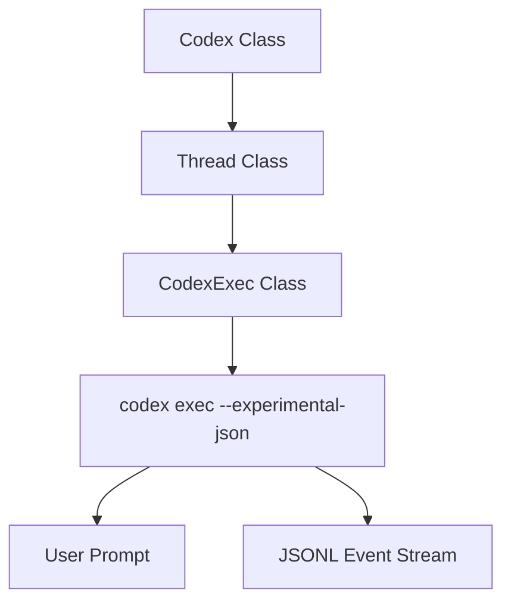

# TypeScript 软件开发工具包（SDK）

相关源文件

-   [.github/workflows/shell-tool-mcp-ci.yml](https://github.com/openai/codex/blob/d807d44a/.github/workflows/shell-tool-mcp-ci.yml)
-   [CHANGELOG.md](https://github.com/openai/codex/blob/d807d44a/CHANGELOG.md?plain=1)
-   [cliff.toml](https://github.com/openai/codex/blob/d807d44a/cliff.toml)
-   [codex-cli/package.json](https://github.com/openai/codex/blob/d807d44a/codex-cli/package.json)
-   [codex-rs/exec/tests/suite/add\_dir.rs](https://github.com/openai/codex/blob/d807d44a/codex-rs/exec/tests/suite/add_dir.rs)
-   [codex-rs/responses-api-proxy/npm/package.json](https://github.com/openai/codex/blob/d807d44a/codex-rs/responses-api-proxy/npm/package.json)
-   [package.json](https://github.com/openai/codex/blob/d807d44a/package.json)
-   [pnpm-lock.yaml](https://github.com/openai/codex/blob/d807d44a/pnpm-lock.yaml)
-   [pnpm-workspace.yaml](https://github.com/openai/codex/blob/d807d44a/pnpm-workspace.yaml)
-   [sdk/typescript/.prettierignore](https://github.com/openai/codex/blob/d807d44a/sdk/typescript/.prettierignore)
-   [sdk/typescript/README.md](https://github.com/openai/codex/blob/d807d44a/sdk/typescript/README.md?plain=1)
-   [sdk/typescript/eslint.config.js](https://github.com/openai/codex/blob/d807d44a/sdk/typescript/eslint.config.js)
-   [sdk/typescript/jest.config.cjs](https://github.com/openai/codex/blob/d807d44a/sdk/typescript/jest.config.cjs)
-   [sdk/typescript/package.json](https://github.com/openai/codex/blob/d807d44a/sdk/typescript/package.json)
-   [sdk/typescript/samples/basic\_streaming.ts](https://github.com/openai/codex/blob/d807d44a/sdk/typescript/samples/basic_streaming.ts)
-   [sdk/typescript/src/codex.ts](https://github.com/openai/codex/blob/d807d44a/sdk/typescript/src/codex.ts)
-   [sdk/typescript/src/codexOptions.ts](https://github.com/openai/codex/blob/d807d44a/sdk/typescript/src/codexOptions.ts)
-   [sdk/typescript/src/events.ts](https://github.com/openai/codex/blob/d807d44a/sdk/typescript/src/events.ts)
-   [sdk/typescript/src/exec.ts](https://github.com/openai/codex/blob/d807d44a/sdk/typescript/src/exec.ts)
-   [sdk/typescript/src/index.ts](https://github.com/openai/codex/blob/d807d44a/sdk/typescript/src/index.ts)
-   [sdk/typescript/src/items.ts](https://github.com/openai/codex/blob/d807d44a/sdk/typescript/src/items.ts)
-   [sdk/typescript/src/thread.ts](https://github.com/openai/codex/blob/d807d44a/sdk/typescript/src/thread.ts)
-   [sdk/typescript/src/threadOptions.ts](https://github.com/openai/codex/blob/d807d44a/sdk/typescript/src/threadOptions.ts)
-   [sdk/typescript/src/turnOptions.ts](https://github.com/openai/codex/blob/d807d44a/sdk/typescript/src/turnOptions.ts)
-   [sdk/typescript/tests/abort.test.ts](https://github.com/openai/codex/blob/d807d44a/sdk/typescript/tests/abort.test.ts)
-   [sdk/typescript/tests/codexExecSpy.ts](https://github.com/openai/codex/blob/d807d44a/sdk/typescript/tests/codexExecSpy.ts)
-   [sdk/typescript/tests/exec.test.ts](https://github.com/openai/codex/blob/d807d44a/sdk/typescript/tests/exec.test.ts)
-   [sdk/typescript/tests/responsesProxy.ts](https://github.com/openai/codex/blob/d807d44a/sdk/typescript/tests/responsesProxy.ts)
-   [sdk/typescript/tests/run.test.ts](https://github.com/openai/codex/blob/d807d44a/sdk/typescript/tests/run.test.ts)
-   [sdk/typescript/tests/runStreamed.test.ts](https://github.com/openai/codex/blob/d807d44a/sdk/typescript/tests/runStreamed.test.ts)
-   [sdk/typescript/tsconfig.json](https://github.com/openai/codex/blob/d807d44a/sdk/typescript/tsconfig.json)
-   [shell-tool-mcp/package.json](https://github.com/openai/codex/blob/d807d44a/shell-tool-mcp/package.json)
-   [shell-tool-mcp/src/index.ts](https://github.com/openai/codex/blob/d807d44a/shell-tool-mcp/src/index.ts)

`@openai/codex-sdk` 包提供了一个高级 TypeScript 接口，用于将 Codex 代理嵌入外部工作流与应用。它充当 `codex` CLI 的封装层，负责管理二进制程序执行，并通过标准 I/O 上的 JSONL 事件编排通信 [sdk/typescript/README.md1-5](https://github.com/openai/codex/blob/d807d44a/sdk/typescript/README.md?plain=1#L1-L5)

## 概览

该 SDK 旨在管理对话（Threads）与单次交互（Turns）的生命周期。它处理二进制发现、环境配置，以及将结构化事件解析为带类型的 TypeScript 对象 [sdk/typescript/src/thread.ts9-25](https://github.com/openai/codex/blob/d807d44a/sdk/typescript/src/thread.ts#L9-L25)

### 关键组件

| 组件 | 角色 |
| --- | --- |
| `Codex` | 用于初始化 SDK 与管理会话的入口类 [sdk/typescript/src/codex.ts1-30](https://github.com/openai/codex/blob/d807d44a/sdk/typescript/src/codex.ts#L1-L30) |
| `Thread` | 表示持久化对话状态。负责轮次执行与 ID 跟踪 [sdk/typescript/src/thread.ts41-50](https://github.com/openai/codex/blob/d807d44a/sdk/typescript/src/thread.ts#L41-L50) |
| `CodexExec` | 底层执行引擎，负责拉起 `codex` 进程并处理 JSONL 流 [sdk/typescript/src/exec.ts57-72](https://github.com/openai/codex/blob/d807d44a/sdk/typescript/src/exec.ts#L57-L72) |

## Codex/Thread/Turn 接口

SDK 采用分层结构：`Codex` 实例创建或恢复 `Thread` 实例，而后者再执行 `run` 或 `runStreamed` 操作 [sdk/typescript/src/thread.ts66-115](https://github.com/openai/codex/blob/d807d44a/sdk/typescript/src/thread.ts#L66-L115)

### 系统与代码实体映射

下图展示了 SDK 的高级类如何映射到底层执行实体。

**SDK 到 CLI 映射**

来源: [sdk/typescript/src/codex.ts18-25](https://github.com/openai/codex/blob/d807d44a/sdk/typescript/src/codex.ts#L18-L25) [sdk/typescript/src/thread.ts77-80](https://github.com/openai/codex/blob/d807d44a/sdk/typescript/src/thread.ts#L77-L80) [sdk/typescript/src/exec.ts72-74](https://github.com/openai/codex/blob/d807d44a/sdk/typescript/src/exec.ts#L72-L74) [sdk/typescript/src/exec.ts164-177](https://github.com/openai/codex/blob/d807d44a/sdk/typescript/src/exec.ts#L164-L177)

### 线程生命周期

线程通过 `thread_id` 标识，该值在线程首轮启动后由 CLI 返回 [sdk/typescript/src/thread.ts48-50](https://github.com/openai/codex/blob/d807d44a/sdk/typescript/src/thread.ts#L48-L50)

-   **初始化**: `codex.startThread(options)` 创建新的线程上下文 [sdk/typescript/src/codex.ts18-20](https://github.com/openai/codex/blob/d807d44a/sdk/typescript/src/codex.ts#L18-L20)
-   **恢复**: `codex.resumeThread(threadId)` 允许继续 `~/.codex/sessions` 中存储的会话 [sdk/typescript/src/codex.ts22-25](https://github.com/openai/codex/blob/d807d44a/sdk/typescript/src/codex.ts#L22-L25)
-   **执行**: `thread.run(input)` 用于原子化请求-响应模式 [sdk/typescript/src/thread.ts115-138](https://github.com/openai/codex/blob/d807d44a/sdk/typescript/src/thread.ts#L115-L138)

## 流式事件

`runStreamed` 方法返回 `AsyncGenerator<ThreadEvent>`，允许实时观察代理动作 [sdk/typescript/src/thread.ts66-68](https://github.com/openai/codex/blob/d807d44a/sdk/typescript/src/thread.ts#L66-L68)

### 事件类型

SDK 将 JSONL 流解析为 `events.ts` 中定义的多种带类型事件：

-   `thread.started`: 包含 `thread_id` [sdk/typescript/src/thread.ts104-106](https://github.com/openai/codex/blob/d807d44a/sdk/typescript/src/thread.ts#L104-L106)
-   `item.started` / `item.completed`: 标记 `ThreadItem` 的生命周期（例如工具调用或消息） [sdk/typescript/src/items.ts1-127](https://github.com/openai/codex/blob/d807d44a/sdk/typescript/src/items.ts#L1-L127)
-   `turn.completed`: 表示当前交互结束，并包含 `Usage` 统计信息 [sdk/typescript/src/thread.ts127-128](https://github.com/openai/codex/blob/d807d44a/sdk/typescript/src/thread.ts#L127-L128)

**事件数据流**

> **[Mermaid sequence]**
> *(图表结构无法解析)*

来源: [sdk/typescript/src/thread.ts70-112](https://github.com/openai/codex/blob/d807d44a/sdk/typescript/src/thread.ts#L70-L112) [sdk/typescript/src/exec.ts204-208](https://github.com/openai/codex/blob/d807d44a/sdk/typescript/src/exec.ts#L204-L208) [sdk/typescript/src/exec.ts164-167](https://github.com/openai/codex/blob/d807d44a/sdk/typescript/src/exec.ts#L164-L167)

## 结构化输出

Codex 支持生成符合特定模式的 JSON。SDK 通过将提供的 `outputSchema` 写入临时文件并通过 `--output-schema` 标志传递其路径来实现该能力 [sdk/typescript/src/thread.ts74-87](https://github.com/openai/codex/blob/d807d44a/sdk/typescript/src/thread.ts#L74-L87)

### 实现

1.  **Schema 输入**: 用户在 `TurnOptions` 中提供 JSON schema [sdk/typescript/src/turnOptions.ts1-10](https://github.com/openai/codex/blob/d807d44a/sdk/typescript/src/turnOptions.ts#L1-L10)
2.  **文件创建**: `createOutputSchemaFile` 生成临时 `.json` 文件 [sdk/typescript/src/thread.ts74](https://github.com/openai/codex/blob/d807d44a/sdk/typescript/src/thread.ts#L74-L74)
3.  **CLI 调用**: `CodexExec` 在命令参数中添加 `--output-schema <path>` [sdk/typescript/src/exec.ts110-112](https://github.com/openai/codex/blob/d807d44a/sdk/typescript/src/exec.ts#L110-L112)
4.  **解析**: 最终 `agent_message` 条目的 `text` 字段包含 JSON 字符串 [sdk/typescript/src/items.ts73-79](https://github.com/openai/codex/blob/d807d44a/sdk/typescript/src/items.ts#L73-L79)

## 会话恢复

会话持久化由底层 CLI 处理。SDK 通过 `resumeThread` 方法以及 `CodexExecArgs` 中的 `threadId` 参数暴露该能力 [sdk/typescript/src/exec.ts14-15](https://github.com/openai/codex/blob/d807d44a/sdk/typescript/src/exec.ts#L14-L15)

### 实现细节

当在已恢复线程上调用 `thread.run()` 时，SDK 会在 CLI 命令中包含 `threadId`: `codex exec --experimental-json resume <threadId>` [sdk/typescript/src/exec.ts137-139](https://github.com/openai/codex/blob/d807d44a/sdk/typescript/src/exec.ts#L137-L139)

这会使代理在处理新输入之前加载该特定会话的历史上下文。

## 配置与环境

SDK 允许对执行环境进行细粒度控制：

-   **基础 URL 与 API Key**: 分别通过 `--config openai_base_url` 和 `CODEX_API_KEY` 环境变量传递 [sdk/typescript/src/exec.ts81-86](https://github.com/openai/codex/blob/d807d44a/sdk/typescript/src/exec.ts#L81-L86) [sdk/typescript/src/exec.ts160-162](https://github.com/openai/codex/blob/d807d44a/sdk/typescript/src/exec.ts#L160-L162)
-   **沙箱模式**: 通过 `--sandbox` 标志支持 `read-only`、`workspace-write` 与 `danger-full-access` [sdk/typescript/src/exec.ts92-94](https://github.com/openai/codex/blob/d807d44a/sdk/typescript/src/exec.ts#L92-L94)
-   **配置覆盖**: 任意配置对象会被拍平成点路径（例如 `{ a: { b: true } }` 会变成 `a.b=true`），并通过重复的 `--config` 标志传入 [sdk/typescript/src/exec.ts229-233](https://github.com/openai/codex/blob/d807d44a/sdk/typescript/src/exec.ts#L229-L233)

来源:

-   [sdk/typescript/src/exec.ts9-40](https://github.com/openai/codex/blob/d807d44a/sdk/typescript/src/exec.ts#L9-L40) (CodexExecArgs definition)
-   [sdk/typescript/src/thread.ts41-139](https://github.com/openai/codex/blob/d807d44a/sdk/typescript/src/thread.ts#L41-L139) (Thread implementation)
-   [sdk/typescript/src/codex.ts1-30](https://github.com/openai/codex/blob/d807d44a/sdk/typescript/src/codex.ts#L1-L30) (Codex entry point)
-   [sdk/typescript/src/items.ts1-127](https://github.com/openai/codex/blob/d807d44a/sdk/typescript/src/items.ts#L1-L127) (Thread item types)
-   [sdk/typescript/README.md1-150](https://github.com/openai/codex/blob/d807d44a/sdk/typescript/README.md?plain=1#L1-L150) (Usage and patterns)
