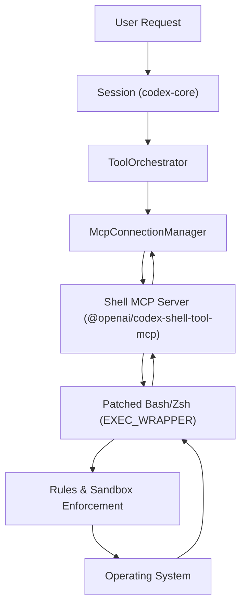

# Shell Tool MCP 包

相关源文件

-   [.github/actions/windows-code-sign/action.yml](https://github.com/openai/codex/blob/d807d44a/.github/actions/windows-code-sign/action.yml)
-   [.github/scripts/install-musl-build-tools.sh](https://github.com/openai/codex/blob/d807d44a/.github/scripts/install-musl-build-tools.sh)
-   [.github/workflows/ci.yml](https://github.com/openai/codex/blob/d807d44a/.github/workflows/ci.yml)
-   [.github/workflows/rust-ci.yml](https://github.com/openai/codex/blob/d807d44a/.github/workflows/rust-ci.yml)
-   [.github/workflows/rust-release-windows.yml](https://github.com/openai/codex/blob/d807d44a/.github/workflows/rust-release-windows.yml)
-   [.github/workflows/rust-release.yml](https://github.com/openai/codex/blob/d807d44a/.github/workflows/rust-release.yml)
-   [.github/workflows/sdk.yml](https://github.com/openai/codex/blob/d807d44a/.github/workflows/sdk.yml)
-   [.github/workflows/shell-tool-mcp.yml](https://github.com/openai/codex/blob/d807d44a/.github/workflows/shell-tool-mcp.yml)
-   [.github/workflows/zstd](https://github.com/openai/codex/blob/d807d44a/.github/workflows/zstd)
-   [codex-rs/.cargo/config.toml](https://github.com/openai/codex/blob/d807d44a/codex-rs/.cargo/config.toml)
-   [codex-rs/app-server/tests/suite/v2/mcp\_server\_elicitation.rs](https://github.com/openai/codex/blob/d807d44a/codex-rs/app-server/tests/suite/v2/mcp_server_elicitation.rs)
-   [codex-rs/cli/src/mcp\_cmd.rs](https://github.com/openai/codex/blob/d807d44a/codex-rs/cli/src/mcp_cmd.rs)
-   [codex-rs/cli/tests/mcp\_add\_remove.rs](https://github.com/openai/codex/blob/d807d44a/codex-rs/cli/tests/mcp_add_remove.rs)
-   [codex-rs/cli/tests/mcp\_list.rs](https://github.com/openai/codex/blob/d807d44a/codex-rs/cli/tests/mcp_list.rs)
-   [codex-rs/core/src/mcp\_connection\_manager.rs](https://github.com/openai/codex/blob/d807d44a/codex-rs/core/src/mcp_connection_manager.rs)
-   [codex-rs/core/src/mcp\_connection\_manager\_tests.rs](https://github.com/openai/codex/blob/d807d44a/codex-rs/core/src/mcp_connection_manager_tests.rs)
-   [codex-rs/core/src/state/session.rs](https://github.com/openai/codex/blob/d807d44a/codex-rs/core/src/state/session.rs)
-   [codex-rs/core/src/state/turn.rs](https://github.com/openai/codex/blob/d807d44a/codex-rs/core/src/state/turn.rs)
-   [codex-rs/core/src/tasks/mod.rs](https://github.com/openai/codex/blob/d807d44a/codex-rs/core/src/tasks/mod.rs)
-   [codex-rs/core/src/tools/handlers/tool\_search\_tests.rs](https://github.com/openai/codex/blob/d807d44a/codex-rs/core/src/tools/handlers/tool_search_tests.rs)
-   [codex-rs/core/tests/suite/rmcp\_client.rs](https://github.com/openai/codex/blob/d807d44a/codex-rs/core/tests/suite/rmcp_client.rs)
-   [codex-rs/core/tests/suite/truncation.rs](https://github.com/openai/codex/blob/d807d44a/codex-rs/core/tests/suite/truncation.rs)
-   [codex-rs/core/tests/suite/user\_shell\_cmd.rs](https://github.com/openai/codex/blob/d807d44a/codex-rs/core/tests/suite/user_shell_cmd.rs)
-   [codex-rs/rmcp-client/src/rmcp\_client.rs](https://github.com/openai/codex/blob/d807d44a/codex-rs/rmcp-client/src/rmcp_client.rs)
-   [codex-rs/rmcp-client/tests/streamable\_http\_recovery.rs](https://github.com/openai/codex/blob/d807d44a/codex-rs/rmcp-client/tests/streamable_http_recovery.rs)
-   [codex-rs/rust-toolchain.toml](https://github.com/openai/codex/blob/d807d44a/codex-rs/rust-toolchain.toml)
-   [codex-rs/scripts/setup-windows.ps1](https://github.com/openai/codex/blob/d807d44a/codex-rs/scripts/setup-windows.ps1)
-   [codex-rs/shell-escalation/README.md](https://github.com/openai/codex/blob/d807d44a/codex-rs/shell-escalation/README.md?plain=1)

`@openai/codex-shell-tool-mcp` 包是一个专用的模型上下文协议（MCP）服务器，旨在为 Codex 提供高保真终端访问。与标准 shell 执行工具不同，该包使用常见 shell（Bash 和 Zsh）的补丁版本，以便与 Codex 沙箱及安全策略引擎深度集成。

## 概览与目标

Shell Tool MCP 包的主要目标是在保持严格安全边界与状态感知的前提下，使 AI 代理能够与本地或远程终端交互。它实现了若干高级特性：

-   **补丁化二进制文件**: 自定义编译的 Bash 与 Zsh 二进制，支持用于命令拦截的 `EXEC_WRAPPER` [\`.github/workflows/shell-tool-mcp.yml152-155](https://github.com/openai/codex/blob/d807d44a/`.github/workflows/shell-tool-mcp.yml#L152-L155)
-   **沙箱同步**: 具备通过 MCP 协议接收并执行沙箱状态更新的能力 [\`codex-rs/core/src/mcp\_connection\_manager.rs43-44](https://github.com/openai/codex/blob/d807d44a/`codex-rs/core/src/mcp_connection_manager.rs#L43-L44)
-   **规则强制执行**: 应用 `.rules` 文件，基于工作区上下文约束 shell 行为。

## 补丁化 Shell 实现

该包为 11 种不同的操作系统/架构变体分发二进制文件，包括多种 Linux 发行版（Ubuntu、Debian、CentOS）和 macOS 版本 [\`.github/workflows/shell-tool-mcp.yml83-127](https://github.com/openai/codex/blob/d807d44a/`.github/workflows/shell-tool-mcp.yml#L83-L127)

### EXEC\_WRAPPER 补丁

Shell 集成的核心是应用到 Shell 源码上的补丁（例如 `bash-exec-wrapper.patch`）。该补丁修改 shell 的执行逻辑，将所有命令执行路由到一个包装器。这样 MCP 服务器可以：

1.  **拦截命令**: 基于当前 `SandboxPolicy` 校验命令 [\`codex-rs/core/src/mcp\_connection\_manager.rs43](https://github.com/openai/codex/blob/d807d44a/`codex-rs/core/src/mcp_connection_manager.rs#L43-L43)
2.  **注入上下文**: 自动预置 Codex 会话所需的环境变量或别名。
3.  **监控状态**: 实时跟踪工作目录或环境变量的变化。

### 构建与分发

构建系统会在环境矩阵上自动编译这些补丁化 shell，以确保与用户主机系统兼容 [\`.github/workflows/shell-tool-mcp.yml73-81](https://github.com/openai/codex/blob/d807d44a/`.github/workflows/shell-tool-mcp.yml#L73-L81)

| 组件 | 来源 | 版本/提交 |
| --- | --- | --- |
| **Bash** | `savannah.gnu.org/git/bash` | `a8a1c2fac029...` [\`.github/workflows/shell-tool-mcp.yml154](https://github.com/openai/codex/blob/d807d44a/`.github/workflows/shell-tool-mcp.yml#L154-L154) |
| **Patch** | `shell-tool-mcp/patches/` | `bash-exec-wrapper.patch` [\`.github/workflows/shell-tool-mcp.yml155](https://github.com/openai/codex/blob/d807d44a/`.github/workflows/shell-tool-mcp.yml#L155-L155) |

**来源：** [\`.github/workflows/shell-tool-mcp.yml73-205](https://github.com/openai/codex/blob/d807d44a/`.github/workflows/shell-tool-mcp.yml#L73-L205)

## MCP 集成与数据流

该包作为 MCP 服务器运行，并通过 `McpConnectionManager` 与 `codex-core` 通信。

### 连接生命周期

1.  **初始化**: `McpConnectionManager` 使用配置的传输方式（通常为 `stdio`）拉起 MCP 服务器 [\`codex-rs/core/src/mcp\_connection\_manager.rs3-7](https://github.com/openai/codex/blob/d807d44a/`codex-rs/core/src/mcp_connection_manager.rs#L3-L7)
2.  **工具发现**: 服务器向代理暴露诸如 `run_terminal_command` 的工具 [\`codex-rs/core/src/mcp\_connection\_manager.rs155-160](https://github.com/openai/codex/blob/d807d44a/`codex-rs/core/src/mcp_connection_manager.rs#L155-L160)
3.  **沙箱同步**: 核心向 MCP 服务器发送 `codex/sandbox-state/update` 通知，以传播当前 `SandboxPolicy` [\`codex-rs/core/src/mcp\_connection\_manager.rs43](https://github.com/openai/codex/blob/d807d44a/`codex-rs/core/src/mcp_connection_manager.rs#L43-L43)

### 数据流图：Shell 执行

该图展示了一个 shell 命令的自然语言请求如何在系统中流转并进入补丁化二进制文件。


**来源：** [\`codex-rs/core/src/mcp\_connection\_manager.rs1-46](https://github.com/openai/codex/blob/d807d44a/`codex-rs/core/src/mcp_connection_manager.rs#L1-L46) [\`codex-rs/core/src/tasks/mod.rs148-158](https://github.com/openai/codex/blob/d807d44a/`codex-rs/core/src/tasks/mod.rs#L148-L158)

## 沙箱状态与权限

Shell Tool MCP 包具备“沙箱感知”能力。它消费来自核心的 `SandboxPolicy` 定义，以判定允许执行的操作。

### 策略强制级别

该包遵循协议中定义的三种主要沙箱模式：

1.  **ReadOnly**: shell 被限制为不可修改文件系统 [\`codex-rs/core/tests/suite/rmcp\_client.rs132](https://github.com/openai/codex/blob/d807d44a/`codex-rs/core/tests/suite/rmcp_client.rs#L132-L132)
2.  **WorkspaceWrite**: shell 只能修改检测到的工作区内文件。
3.  **DangerFullAccess**: shell 具有标准用户权限 [\`codex-rs/core/tests/suite/truncation.rs77](https://github.com/openai/codex/blob/d807d44a/`codex-rs/core/tests/suite/truncation.rs#L77-L77)

### 权限同步

当用户授予权限（例如通过 `request_permissions` 工具）时，`SessionState` 会更新 `granted_permissions` [\`codex-rs/core/src/state/session.rs35-36](https://github.com/openai/codex/blob/d807d44a/`codex-rs/core/src/state/session.rs#L35-L36) 随后这些权限会同步到 MCP 服务器，从而在无需重启会话的情况下动态放宽 shell 限制。

**来源：** [\`codex-rs/core/src/state/session.rs35-53](https://github.com/openai/codex/blob/d807d44a/`codex-rs/core/src/state/session.rs#L35-L53) [\`codex-rs/core/src/mcp\_connection\_manager.rs43-44](https://github.com/openai/codex/blob/d807d44a/`codex-rs/core/src/mcp_connection_manager.rs#L43-L44)

## 工具输出与截断

Shell 命令通常会产生大量文本。该 MCP 包与核心的截断逻辑配合，确保不会压垮模型上下文。

### 截断逻辑

当 shell 输出超过配置的 `tool_output_token_limit` 时，系统会截断文本并追加摘要（例如“X chars truncated”） [\`codex-rs/core/tests/suite/truncation.rs168-170](https://github.com/openai/codex/blob/d807d44a/`codex-rs/core/tests/suite/truncation.rs#L168-L170) `McpConnectionManager` 在结果记录到 `ContextManager` 前负责这些结果的聚合 [\`codex-rs/core/src/mcp\_connection\_manager.rs5-7](https://github.com/openai/codex/blob/d807d44a/`codex-rs/core/src/mcp_connection_manager.rs#L5-L7)

| 特性 | 行为 |
| --- | --- |
| **最大输出** | 可通过 `tool_output_token_limit` 配置 [\`codex-rs/core/tests/suite/truncation.rs41](https://github.com/openai/codex/blob/d807d44a/`codex-rs/core/tests/suite/truncation.rs#L41-L41) |
| **退出码** | 在 `CallToolResult` 中捕获并返回 [\`codex-rs/core/tests/suite/truncation.rs168](https://github.com/openai/codex/blob/d807d44a/`codex-rs/core/tests/suite/truncation.rs#L168-L168) |
| **墙钟时间** | 跟踪并报告执行时长 [\`codex-rs/core/tests/suite/truncation.rs168](https://github.com/openai/codex/blob/d807d44a/`codex-rs/core/tests/suite/truncation.rs#L168-L168) |

**来源：** [\`codex-rs/core/tests/suite/truncation.rs34-179](https://github.com/openai/codex/blob/d807d44a/`codex-rs/core/tests/suite/truncation.rs#L34-L179) [\`codex-rs/core/src/mcp\_connection\_manager.rs98-100](https://github.com/openai/codex/blob/d807d44a/`codex-rs/core/src/mcp_connection_manager.rs#L98-L100)

## 配置

MCP 服务器在 `config.toml` 文件中配置。Shell Tool MCP 可通过 CLI 或手动编辑添加。

### 配置示例

```
[mcp_servers.shell]enabled = truecommand = "npx"args = ["-y", "@openai/codex-shell-tool-mcp"]env = { "DEBUG" = "codex:*" }
```
`McpCli` 提供了用于管理这些条目的命令，例如 `codex mcp add` [\`codex-rs/cli/src/mcp\_cmd.rs74-81](https://github.com/openai/codex/blob/d807d44a/`codex-rs/cli/src/mcp_cmd.rs#L74-L81)

**来源：** [\`codex-rs/cli/src/mcp\_cmd.rs37-54](https://github.com/openai/codex/blob/d807d44a/`codex-rs/cli/src/mcp_cmd.rs#L37-L54) [\`codex-rs/core/src/mcp\_connection\_manager.rs81-83](https://github.com/openai/codex/blob/d807d44a/`codex-rs/core/src/mcp_connection_manager.rs#L81-L83)
