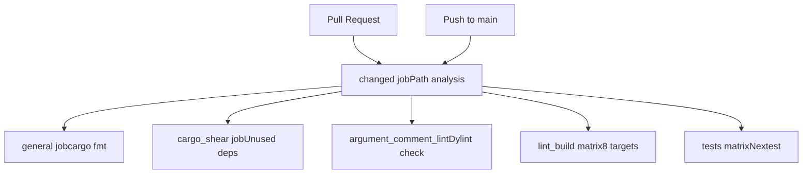
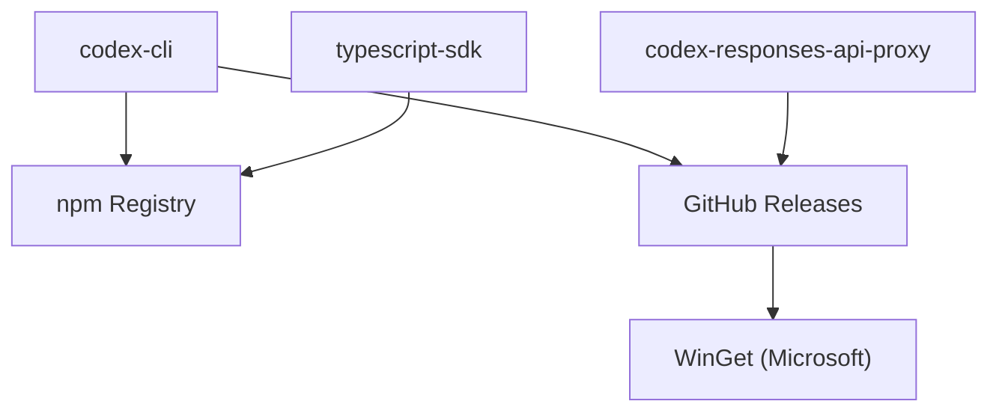

# 构建与分发

相关源文件

-   [.github/actions/windows-code-sign/action.yml](https://github.com/openai/codex/blob/d807d44a/.github/actions/windows-code-sign/action.yml)
-   [.github/scripts/install-musl-build-tools.sh](https://github.com/openai/codex/blob/d807d44a/.github/scripts/install-musl-build-tools.sh)
-   [.github/workflows/ci.yml](https://github.com/openai/codex/blob/d807d44a/.github/workflows/ci.yml)
-   [.github/workflows/rust-ci.yml](https://github.com/openai/codex/blob/d807d44a/.github/workflows/rust-ci.yml)
-   [.github/workflows/rust-release-windows.yml](https://github.com/openai/codex/blob/d807d44a/.github/workflows/rust-release-windows.yml)
-   [.github/workflows/rust-release.yml](https://github.com/openai/codex/blob/d807d44a/.github/workflows/rust-release.yml)
-   [.github/workflows/sdk.yml](https://github.com/openai/codex/blob/d807d44a/.github/workflows/sdk.yml)
-   [.github/workflows/shell-tool-mcp.yml](https://github.com/openai/codex/blob/d807d44a/.github/workflows/shell-tool-mcp.yml)
-   [.github/workflows/zstd](https://github.com/openai/codex/blob/d807d44a/.github/workflows/zstd)
-   [codex-rs/.cargo/config.toml](https://github.com/openai/codex/blob/d807d44a/codex-rs/.cargo/config.toml)
-   [codex-rs/Cargo.lock](https://github.com/openai/codex/blob/d807d44a/codex-rs/Cargo.lock)
-   [codex-rs/Cargo.toml](https://github.com/openai/codex/blob/d807d44a/codex-rs/Cargo.toml)
-   [codex-rs/README.md](https://github.com/openai/codex/blob/d807d44a/codex-rs/README.md?plain=1)
-   [codex-rs/cli/Cargo.toml](https://github.com/openai/codex/blob/d807d44a/codex-rs/cli/Cargo.toml)
-   [codex-rs/cli/src/lib.rs](https://github.com/openai/codex/blob/d807d44a/codex-rs/cli/src/lib.rs)
-   [codex-rs/cli/src/main.rs](https://github.com/openai/codex/blob/d807d44a/codex-rs/cli/src/main.rs)
-   [codex-rs/config.md](https://github.com/openai/codex/blob/d807d44a/codex-rs/config.md?plain=1)
-   [codex-rs/core/Cargo.toml](https://github.com/openai/codex/blob/d807d44a/codex-rs/core/Cargo.toml)
-   [codex-rs/core/src/flags.rs](https://github.com/openai/codex/blob/d807d44a/codex-rs/core/src/flags.rs)
-   [codex-rs/core/src/lib.rs](https://github.com/openai/codex/blob/d807d44a/codex-rs/core/src/lib.rs)
-   [codex-rs/core/src/model\_provider\_info.rs](https://github.com/openai/codex/blob/d807d44a/codex-rs/core/src/model_provider_info.rs)
-   [codex-rs/exec/Cargo.toml](https://github.com/openai/codex/blob/d807d44a/codex-rs/exec/Cargo.toml)
-   [codex-rs/exec/src/cli.rs](https://github.com/openai/codex/blob/d807d44a/codex-rs/exec/src/cli.rs)
-   [codex-rs/exec/src/lib.rs](https://github.com/openai/codex/blob/d807d44a/codex-rs/exec/src/lib.rs)
-   [codex-rs/rust-toolchain.toml](https://github.com/openai/codex/blob/d807d44a/codex-rs/rust-toolchain.toml)
-   [codex-rs/scripts/setup-windows.ps1](https://github.com/openai/codex/blob/d807d44a/codex-rs/scripts/setup-windows.ps1)
-   [codex-rs/shell-escalation/README.md](https://github.com/openai/codex/blob/d807d44a/codex-rs/shell-escalation/README.md?plain=1)
-   [codex-rs/tui/Cargo.toml](https://github.com/openai/codex/blob/d807d44a/codex-rs/tui/Cargo.toml)
-   [codex-rs/tui/src/cli.rs](https://github.com/openai/codex/blob/d807d44a/codex-rs/tui/src/cli.rs)
-   [codex-rs/tui/src/lib.rs](https://github.com/openai/codex/blob/d807d44a/codex-rs/tui/src/lib.rs)

本文档描述 Codex 的构建系统、CI/CD 流水线与分发基础设施，覆盖 Cargo 工作区结构、平台构建矩阵、代码签名流程、制品打包以及分发渠道（npm、Homebrew、WinGet、GitHub Releases）。

有关开发环境设置与本地工具链的信息，请参见 [Development Setup](/openai/codex/9.1-development-setup)。有关工作区组织与 crate 关系，请参见 [Repository Structure](/openai/codex/1.2-repository-structure)。

---

## 概览

Codex 的构建与分发系统通过分层流水线支持多种执行模式与平台：

1.  **CI 流水线** (`rust-ci.yml`): 在每次 pull request 与推送到 `main` 时运行，在所有受支持平台上执行 lint/test 检查。
2.  **发布流水线** (`rust-release.yml`): 由匹配 `rust-v*.*.*` 的 git tag 触发，构建带平台特定代码签名的发布二进制文件。
3.  **Shell Tool MCP 流水线** (`shell-tool-mcp.yml`): 在 11 种 OS/发行版变体上构建打补丁的 Bash 与 Zsh shell。
4.  **分发渠道**: 发布到 npm（default 与 alpha 标签）、Homebrew cask（macOS）、WinGet（Windows）和 GitHub Releases（全平台）。

**构建目标**: 发布流水线会针对 8 个平台 triple 进行构建：

-   macOS: `aarch64-apple-darwin`, `x86_64-apple-darwin`
-   Linux GNU: `x86_64-unknown-linux-gnu`, `aarch64-unknown-linux-gnu`
-   Linux MUSL: `x86_64-unknown-linux-musl`, `aarch64-unknown-linux-musl`
-   Windows: `x86_64-pc-windows-msvc`, `aarch64-pc-windows-msvc`

**版本格式**: 发布采用语义化版本（稳定版为 `x.y.z`，预发布为 `x.y.z-alpha.N`）。版本格式决定分发行为：稳定版会以 `default` npm 标签发布到所有渠道，alpha 版本会以 `alpha` npm 标签发布并跳过 WinGet。

**来源**: [.github/workflows/rust-release.yml1-80](https://github.com/openai/codex/blob/d807d44a/.github/workflows/rust-release.yml#L1-L80) [.github/workflows/rust-ci.yml1-10](https://github.com/openai/codex/blob/d807d44a/.github/workflows/rust-ci.yml#L1-L10)

---

## Cargo 工作区结构

Codex 项目使用包含多个 crate 的 Cargo 工作区，并在单一仓库中统一管理。详情参见 [Cargo Workspace Structure](/openai/codex/8.1-cargo-workspace-structure)。

| Crate | 用途 | 二进制输出 |
| --- | --- | --- |
| `codex-cli` | 主 CLI 入口点与多工具分发 | `codex` |
| `codex-tui` | 终端用户界面实现 | \- |
| `codex-core` | 核心代理引擎与会话逻辑 | `codex-write-config-schema` |
| `codex-exec` | 无头执行模式逻辑 | \- |
| `codex-app-server` | 用于 IDE 集成的 JSON-RPC 服务器 | \- |
| `codex-responses-api-proxy` | 用于响应流式传输的内部 API 代理 | `codex-responses-api-proxy` |

**工具链管理**: 工作区在 `rust-toolchain.toml` 中固定 Rust 工具链版本，以确保开发机与 CI 构建一致：

```
[toolchain]channel = "1.93.0"components = ["clippy", "rustfmt", "rust-src"]
```
**平台特定配置**: `.cargo/config.toml` 文件定义平台特定的链接器标志与栈大小，特别是 Windows 目标，用于处理模型生成代码中的深度递归。

**来源**: [codex-rs/Cargo.toml1-77](https://github.com/openai/codex/blob/d807d44a/codex-rs/Cargo.toml#L1-L77) [codex-rs/rust-toolchain.toml1-4](https://github.com/openai/codex/blob/d807d44a/codex-rs/rust-toolchain.toml#L1-L4) [codex-rs/core/Cargo.toml12-14](https://github.com/openai/codex/blob/d807d44a/codex-rs/core/Cargo.toml#L12-L14)

---

## CI 流水线

CI 流水线会在每次变更时验证代码质量与正确性。详情参见 [CI Pipeline](/openai/codex/8.2-ci-pipeline)。

### 工作流触发与变更检测

`rust-ci.yml` 工作流使用 `changed` 作业分析路径变更，使其在仅修改文档或无关工具时可以跳过高成本构建步骤。它会检测 `codex-rs/*`、`.github/*` 以及特定 lint 工具中的变更。

### 构建与测试矩阵

CI 在 Linux（GNU/MUSL）、macOS 与 Windows 上运行完整矩阵。它使用 `cargo nextest` 进行并行测试执行，并使用 `cargo clippy` 进行 lint。

**来源**: [.github/workflows/rust-ci.yml13-58](https://github.com/openai/codex/blob/d807d44a/.github/workflows/rust-ci.yml#L13-L58) [.github/workflows/rust-ci.yml161-182](https://github.com/openai/codex/blob/d807d44a/.github/workflows/rust-ci.yml#L161-L182)

### CI 工作流图


**来源**: [.github/workflows/rust-ci.yml1-182](https://github.com/openai/codex/blob/d807d44a/.github/workflows/rust-ci.yml#L1-L182)

---

## 发布流水线

发布流水线自动化创建可用于生产环境的制品。详情参见 [Release Pipeline](/openai/codex/8.3-release-pipeline)。

### 基于标签的工作流

发布通过推送标签触发（例如 `rust-v0.1.0`）。`tag-check` 作业会校验该标签是否与 `codex-rs/Cargo.toml` 中定义的版本一致。

### 代码签名与公证

-   **macOS**: 使用 Apple Developer ID 证书与 `notarytool` 对二进制和 DMG 文件进行签名。
-   **Windows**: 通过 OIDC 使用 Azure Trusted Signing 对 `codex.exe` 及 `codex-windows-sandbox-setup.exe` 等辅助二进制文件签名。
-   **Linux**: 使用 Sigstore/Cosign 生成分离签名包。

**来源**: [.github/workflows/rust-release.yml19-47](https://github.com/openai/codex/blob/d807d44a/.github/workflows/rust-release.yml#L19-L47) [.github/actions/windows-code-sign/action.yml1-58](https://github.com/openai/codex/blob/d807d44a/.github/actions/windows-code-sign/action.yml#L1-L58)

---

## 分发渠道

Codex 通过多个渠道分发，以支持不同用户工作流。详情参见 [Distribution Channels](/openai/codex/8.4-distribution-channels)。

-   **npm Registry**: 分发 `@openai/codex` 与 TypeScript SDK。通过 `optionalDependencies` 拉取平台特定二进制。
-   **GitHub Releases**: 二进制、签名与 `config-schema.json` 的主来源。
-   **WinGet**: 对稳定版 Windows 发布通过 `winget-releaser` 自动更新。
-   **Homebrew**: 通过 cask 向 macOS 用户分发。

### 分发映射


**来源**: [.github/workflows/rust-release.yml539-668](https://github.com/openai/codex/blob/d807d44a/.github/workflows/rust-release.yml#L539-L668)

---

## Shell Tool MCP 构建系统

Codex 包含一个用于 Bash 与 Zsh 补丁版本的专用构建系统，这些补丁版本支持执行包装。详情参见 [Shell Tool MCP Build System](/openai/codex/8.5-shell-tool-mcp-build-system)。

### 补丁化 Shell 编译

`shell-tool-mcp.yml` 工作流会在 11 种 OS 变体（Ubuntu、Debian、CentOS、macOS）上编译 shell，以确保与目标环境的二进制兼容性。它会应用 `bash-exec-wrapper.patch` 与 `zsh-exec-wrapper.patch`，以拦截 `execve` 调用用于沙箱化与提权。

**来源**: [.github/workflows/shell-tool-mcp.yml73-127](https://github.com/openai/codex/blob/d807d44a/.github/workflows/shell-tool-mcp.yml#L73-L127) [.github/workflows/shell-tool-mcp.yml148-163](https://github.com/openai/codex/blob/d807d44a/.github/workflows/shell-tool-mcp.yml#L148-L163)
