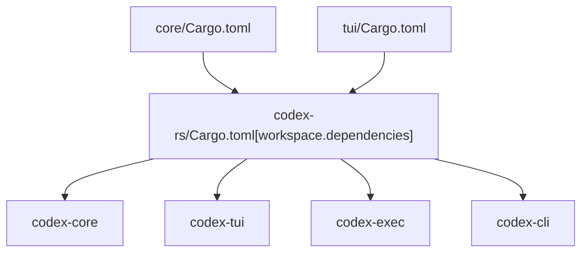
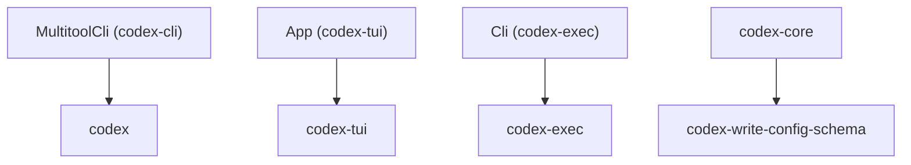

# Cargo 工作区结构

相关源文件

-   [.bazelrc](https://github.com/openai/codex/blob/d807d44a/.bazelrc)
-   [.github/workflows/Dockerfile.bazel](https://github.com/openai/codex/blob/d807d44a/.github/workflows/Dockerfile.bazel)
-   [.github/workflows/ci.bazelrc](https://github.com/openai/codex/blob/d807d44a/.github/workflows/ci.bazelrc)
-   [BUILD.bazel](https://github.com/openai/codex/blob/d807d44a/BUILD.bazel)
-   [MODULE.bazel](https://github.com/openai/codex/blob/d807d44a/MODULE.bazel)
-   [MODULE.bazel.lock](https://github.com/openai/codex/blob/d807d44a/MODULE.bazel.lock)
-   [codex-rs/Cargo.lock](https://github.com/openai/codex/blob/d807d44a/codex-rs/Cargo.lock)
-   [codex-rs/Cargo.toml](https://github.com/openai/codex/blob/d807d44a/codex-rs/Cargo.toml)
-   [codex-rs/README.md](https://github.com/openai/codex/blob/d807d44a/codex-rs/README.md?plain=1)
-   [codex-rs/ansi-escape/BUILD.bazel](https://github.com/openai/codex/blob/d807d44a/codex-rs/ansi-escape/BUILD.bazel)
-   [codex-rs/app-server-protocol/BUILD.bazel](https://github.com/openai/codex/blob/d807d44a/codex-rs/app-server-protocol/BUILD.bazel)
-   [codex-rs/app-server/BUILD.bazel](https://github.com/openai/codex/blob/d807d44a/codex-rs/app-server/BUILD.bazel)
-   [codex-rs/cli/Cargo.toml](https://github.com/openai/codex/blob/d807d44a/codex-rs/cli/Cargo.toml)
-   [codex-rs/cli/src/lib.rs](https://github.com/openai/codex/blob/d807d44a/codex-rs/cli/src/lib.rs)
-   [codex-rs/cli/src/main.rs](https://github.com/openai/codex/blob/d807d44a/codex-rs/cli/src/main.rs)
-   [codex-rs/config.md](https://github.com/openai/codex/blob/d807d44a/codex-rs/config.md?plain=1)
-   [codex-rs/core/BUILD.bazel](https://github.com/openai/codex/blob/d807d44a/codex-rs/core/BUILD.bazel)
-   [codex-rs/core/Cargo.toml](https://github.com/openai/codex/blob/d807d44a/codex-rs/core/Cargo.toml)
-   [codex-rs/core/src/flags.rs](https://github.com/openai/codex/blob/d807d44a/codex-rs/core/src/flags.rs)
-   [codex-rs/core/src/lib.rs](https://github.com/openai/codex/blob/d807d44a/codex-rs/core/src/lib.rs)
-   [codex-rs/core/src/model\_provider\_info.rs](https://github.com/openai/codex/blob/d807d44a/codex-rs/core/src/model_provider_info.rs)
-   [codex-rs/deny.toml](https://github.com/openai/codex/blob/d807d44a/codex-rs/deny.toml)
-   [codex-rs/exec/Cargo.toml](https://github.com/openai/codex/blob/d807d44a/codex-rs/exec/Cargo.toml)
-   [codex-rs/exec/src/cli.rs](https://github.com/openai/codex/blob/d807d44a/codex-rs/exec/src/cli.rs)
-   [codex-rs/exec/src/lib.rs](https://github.com/openai/codex/blob/d807d44a/codex-rs/exec/src/lib.rs)
-   [codex-rs/mcp-server/BUILD.bazel](https://github.com/openai/codex/blob/d807d44a/codex-rs/mcp-server/BUILD.bazel)
-   [codex-rs/tui/Cargo.toml](https://github.com/openai/codex/blob/d807d44a/codex-rs/tui/Cargo.toml)
-   [codex-rs/tui/src/cli.rs](https://github.com/openai/codex/blob/d807d44a/codex-rs/tui/src/cli.rs)
-   [codex-rs/tui/src/lib.rs](https://github.com/openai/codex/blob/d807d44a/codex-rs/tui/src/lib.rs)
-   [codex-rs/utils/cargo-bin/BUILD.bazel](https://github.com/openai/codex/blob/d807d44a/codex-rs/utils/cargo-bin/BUILD.bazel)
-   [defs.bzl](https://github.com/openai/codex/blob/d807d44a/defs.bzl)
-   [patches/BUILD.bazel](https://github.com/openai/codex/blob/d807d44a/patches/BUILD.bazel)
-   [patches/v8\_bazel\_rules.patch](https://github.com/openai/codex/blob/d807d44a/patches/v8_bazel_rules.patch)
-   [rbe.bzl](https://github.com/openai/codex/blob/d807d44a/rbe.bzl)
-   [third\_party/v8/BUILD.bazel](https://github.com/openai/codex/blob/d807d44a/third_party/v8/BUILD.bazel)
-   [third\_party/v8/README.md](https://github.com/openai/codex/blob/d807d44a/third_party/v8/README.md?plain=1)

本页覆盖位于 `codex-rs/` 的 Rust Cargo 工作区布局，包括 crate 成员、共享依赖声明方式、构建 profile 以及工作区级 lint 配置。有关构建并测试该工作区的 CI 流水线，请参见 [CI Pipeline](/openai/codex/8.2-ci-pipeline)。有关生成二进制制品的发布流水线，请参见 [Release Pipeline](/openai/codex/8.3-release-pipeline)。有关各 crate 在系统层面的关系概览，请参见 [Architecture Overview](/openai/codex/1.3-architecture-overview)。

---

## 工作区根

工作区定义在 [codex-rs/Cargo.toml1-164](https://github.com/openai/codex/blob/d807d44a/codex-rs/Cargo.toml#L1-L164)。它使用 Cargo 的 `resolver = "2"` [codex-rs/Cargo.toml78](https://github.com/openai/codex/blob/d807d44a/codex-rs/Cargo.toml#L78-L78) 进行特性解析，并设置了单一共享的 `[workspace.package]` 块 [codex-rs/Cargo.toml80-88](https://github.com/openai/codex/blob/d807d44a/codex-rs/Cargo.toml#L80-L88)，所有成员 crate 在各自清单中通过 `.workspace = true` 继承该配置。

| 字段 | 值 |
| --- | --- |
| `resolver` | `"2"` |
| `version` | `"0.0.0"`（所有 crate 共享同一个开发中版本） |
| `edition` | `"2024"` |
| `license` | `"Apache-2.0"` |

来源: [codex-rs/Cargo.toml78-88](https://github.com/openai/codex/blob/d807d44a/codex-rs/Cargo.toml#L78-L88)

---

## Crate 成员关系

工作区包含 76 个成员 crate，声明于 [codex-rs/Cargo.toml2-77](https://github.com/openai/codex/blob/d807d44a/codex-rs/Cargo.toml#L2-L77)。它们被组织为若干功能组。

### Crate 分组

**核心逻辑与协议**

| 工作区内路径 | Crate 名称 | 角色 |
| --- | --- | --- |
| `core` | `codex-core` | 中央业务逻辑库 [codex-rs/core/src/lib.rs1-189](https://github.com/openai/codex/blob/d807d44a/codex-rs/core/src/lib.rs#L1-L189) |
| `config` | `codex-config` | 配置加载与合并 |
| `protocol` | `codex-protocol` | Op/Event 协议类型 |
| `state` | `codex-state` | 基于 SQLite 的会话/线程状态 |

**用户界面**

| 工作区内路径 | Crate 名称 | 角色 |
| --- | --- | --- |
| `tui` | `codex-tui` | 基于 Ratatui 的交互式 TUI [codex-rs/tui/src/lib.rs1-134](https://github.com/openai/codex/blob/d807d44a/codex-rs/tui/src/lib.rs#L1-L134) |
| `exec` | `codex-exec` | 无头/非交互执行 [codex-rs/exec/src/lib.rs1-15](https://github.com/openai/codex/blob/d807d44a/codex-rs/exec/src/lib.rs#L1-L15) |
| `cli` | `codex-cli` | 多工具 CLI 入口（`codex` 二进制） [codex-rs/cli/src/main.rs56-86](https://github.com/openai/codex/blob/d807d44a/codex-rs/cli/src/main.rs#L56-L86) |
| `app-server` | `codex-app-server` | 用于 IDE 集成的 app server |
| `app-server-protocol` | `codex-app-server-protocol` | app server 的 JSON-RPC 协议类型 |
| `tui_app_server` | `codex-tui-app-server` | 由 app-server 协议驱动的 TUI 变体 |

**工具执行与沙箱化**

| 工作区内路径 | Crate 名称 | 角色 |
| --- | --- | --- |
| `apply-patch` | `codex-apply-patch` | 补丁应用逻辑 |
| `execpolicy` | `codex-execpolicy` | Exec 审批策略评估 |
| `linux-sandbox` | `codex-linux-sandbox` | Linux 上的 Landlock/seccomp 沙箱化 |
| `shell-command` | `codex-shell-command` | Shell 命令构造 |
| `shell-escalation` | `codex-shell-escalation` | Shell 提权辅助逻辑 |

**工具集（位于 `utils/`）**

| 工作区内路径 | Crate 名称 |
| --- | --- |
| `utils/absolute-path` | `codex-utils-absolute-path` |
| `utils/approval-presets` | `codex-utils-approval-presets` |
| `utils/cache` | `codex-utils-cache` |
| `utils/git` | `codex-git` |
| `utils/home-dir` | `codex-utils-home-dir` |
| `utils/pty` | `codex-utils-pty` |
| `utils/oss` | `codex-utils-oss` |

来源: [codex-rs/Cargo.toml2-77](https://github.com/openai/codex/blob/d807d44a/codex-rs/Cargo.toml#L2-L77) [codex-rs/core/src/lib.rs1-189](https://github.com/openai/codex/blob/d807d44a/codex-rs/core/src/lib.rs#L1-L189) [codex-rs/tui/src/lib.rs1-134](https://github.com/openai/codex/blob/d807d44a/codex-rs/tui/src/lib.rs#L1-L134) [codex-rs/cli/src/main.rs88-153](https://github.com/openai/codex/blob/d807d44a/codex-rs/cli/src/main.rs#L88-L153)

---

## 依赖图（关键 Crate）

下图展示主要面向用户的 crate 如何依赖核心库与协议层。

**主要 crate 依赖图**

```mermaid
flowchart TD
    MultitoolCli["MultitoolCli (codex-cli)"]
    codex_tui["codex-tui"]
    codex_exec["codex-exec"]
    codex_app_server["codex-app-server"]
    codex_mcp_server["codex-mcp-server"]
    codex_core["codex-core"]
    codex_config["codex-config"]
    codex_protocol["codex-protocol"]
    codex_state["codex-state"]
    codex_api["codex-api"]
    codex_apply_patch["codex-apply-patch"]
    codex_execpolicy["codex-execpolicy"]
    codex_app_server_client["codex-app-server-client"]

    MultitoolCli --> codex_tui
    MultitoolCli --> codex_exec
    MultitoolCli --> codex_app_server
    MultitoolCli --> codex_mcp_server
    codex --> tui_codex_core
    codex --> exec_codex_core
    codex --> core_codex_config
    codex --> core_codex_protocol
    codex --> core_codex_state
    codex --> core_codex_api
    codex --> core_codex_apply_patch
    codex --> core_codex_execpolicy
    codex --> exec_codex_app_server_client
```

来源: [codex-rs/core/Cargo.toml19-62](https://github.com/openai/codex/blob/d807d44a/codex-rs/core/Cargo.toml#L19-L62) [codex-rs/tui/Cargo.toml27-49](https://github.com/openai/codex/blob/d807d44a/codex-rs/tui/Cargo.toml#L27-L49) [codex-rs/exec/Cargo.toml18-49](https://github.com/openai/codex/blob/d807d44a/codex-rs/exec/Cargo.toml#L18-L49) [codex-rs/cli/src/main.rs88-153](https://github.com/openai/codex/blob/d807d44a/codex-rs/cli/src/main.rs#L88-L153)

---

## 工作区路径映射

`[workspace.dependencies]` 表声明了规范化路径引用，使各 crate 可使用 `{ workspace = true }` 而不必重复路径。这是所有内部 crate 路径的单一事实来源。

**工作区依赖声明模式**

在成员 crate 的 `Cargo.toml` 中，依赖声明形式为：`codex-core = { workspace = true }` [codex-rs/core/Cargo.toml111](https://github.com/openai/codex/blob/d807d44a/codex-rs/core/Cargo.toml#L111-L111)

实际路径由工作区根条目解析：`codex-core = { path = "core" }` [codex-rs/Cargo.toml111](https://github.com/openai/codex/blob/d807d44a/codex-rs/Cargo.toml#L111-L111)

来源: [codex-rs/Cargo.toml89-164](https://github.com/openai/codex/blob/d807d44a/codex-rs/Cargo.toml#L89-L164) [codex-rs/core/Cargo.toml19-62](https://github.com/openai/codex/blob/d807d44a/codex-rs/core/Cargo.toml#L19-L62)

---

## 共享工具与配置

### sccache

项目通过构建环境集成 `sccache`，用于分布式编译缓存。这对于在 76 个工作区成员之间保持 CI 构建速度至关重要。

### rust-toolchain.toml

工作区在 `rust-toolchain.toml` 文件中指定 Rust 版本与组件（如 `clippy`、`rustfmt`）（由工作区级 edition 2024 隐含）。这可确保所有开发者与 CI runner 使用完全相同的编译器版本。

### 模型提供方注册表

`codex-core` 维护模型提供方注册表，其中包括 `OpenAI`、`LMStudio` 与 `Ollama` 的内置默认项。

| Provider ID | 名称 | 默认端口 |
| --- | --- | --- |
| `openai` | OpenAI | N/A |
| `lmstudio` | LM Studio | 1234 |
| `ollama` | Ollama | 11434 |

来源: [codex-rs/core/src/model\_provider\_info.rs31-91](https://github.com/openai/codex/blob/d807d44a/codex-rs/core/src/model_provider_info.rs#L31-L91) [codex-rs/core/src/lib.rs83-88](https://github.com/openai/codex/blob/d807d44a/codex-rs/core/src/lib.rs#L83-L88)

---

## Crate 到二进制映射

`codex` 多工具程序是主要入口点，但工作区还定义了若干专用二进制文件。

**Crate/二进制映射**

`MultitoolCli` [codex-rs/cli/src/main.rs71-86](https://github.com/openai/codex/blob/d807d44a/codex-rs/cli/src/main.rs#L71-L86) 会分发到多种模式：

-   `Subcommand::Exec` [codex-rs/cli/src/main.rs92](https://github.com/openai/codex/blob/d807d44a/codex-rs/cli/src/main.rs#L92-L92) 调用 `codex-exec`。
-   `Subcommand::McpServer` [codex-rs/cli/src/main.rs107](https://github.com/openai/codex/blob/d807d44a/codex-rs/cli/src/main.rs#L107-L107) 启动 MCP 服务器。
-   `Subcommand::Resume` [codex-rs/cli/src/main.rs134](https://github.com/openai/codex/blob/d807d44a/codex-rs/cli/src/main.rs#L134-L134) 与 `Fork` [codex-rs/cli/src/main.rs137](https://github.com/openai/codex/blob/d807d44a/codex-rs/cli/src/main.rs#L137-L137) 处理会话状态。

来源: [codex-rs/cli/src/main.rs71-153](https://github.com/openai/codex/blob/d807d44a/codex-rs/cli/src/main.rs#L71-L153) [codex-rs/core/Cargo.toml12-14](https://github.com/openai/codex/blob/d807d44a/codex-rs/core/Cargo.toml#L12-L14) [codex-rs/exec/src/cli.rs8-10](https://github.com/openai/codex/blob/d807d44a/codex-rs/exec/src/cli.rs#L8-L10)
