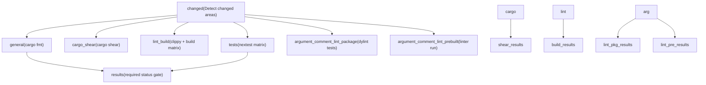
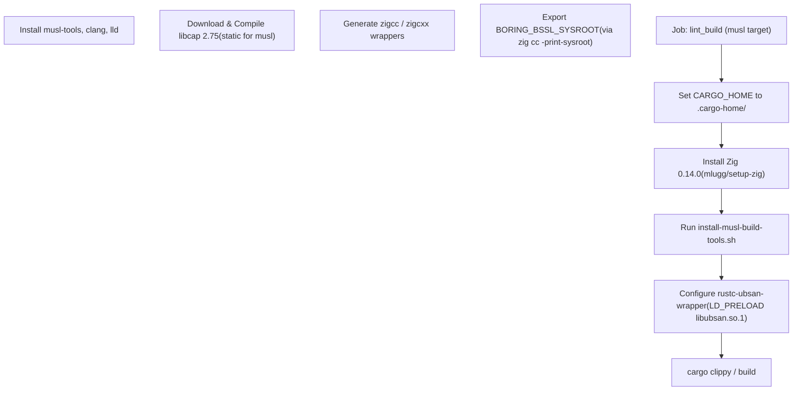

# CI 流水线

相关源文件

-   [.github/actions/linux-code-sign/action.yml](https://github.com/openai/codex/blob/d807d44a/.github/actions/linux-code-sign/action.yml)
-   [.github/actions/macos-code-sign/action.yml](https://github.com/openai/codex/blob/d807d44a/.github/actions/macos-code-sign/action.yml)
-   [.github/actions/macos-code-sign/codex.entitlements.plist](https://github.com/openai/codex/blob/d807d44a/.github/actions/macos-code-sign/codex.entitlements.plist)
-   [.github/actions/macos-code-sign/notary\_helpers.sh](https://github.com/openai/codex/blob/d807d44a/.github/actions/macos-code-sign/notary_helpers.sh)
-   [.github/actions/windows-code-sign/action.yml](https://github.com/openai/codex/blob/d807d44a/.github/actions/windows-code-sign/action.yml)
-   [.github/blob-size-allowlist.txt](https://github.com/openai/codex/blob/d807d44a/.github/blob-size-allowlist.txt)
-   [.github/scripts/install-musl-build-tools.sh](https://github.com/openai/codex/blob/d807d44a/.github/scripts/install-musl-build-tools.sh)
-   [.github/workflows/blob-size-policy.yml](https://github.com/openai/codex/blob/d807d44a/.github/workflows/blob-size-policy.yml)
-   [.github/workflows/ci.yml](https://github.com/openai/codex/blob/d807d44a/.github/workflows/ci.yml)
-   [.github/workflows/close-stale-contributor-prs.yml](https://github.com/openai/codex/blob/d807d44a/.github/workflows/close-stale-contributor-prs.yml)
-   [.github/workflows/issue-deduplicator.yml](https://github.com/openai/codex/blob/d807d44a/.github/workflows/issue-deduplicator.yml)
-   [.github/workflows/issue-labeler.yml](https://github.com/openai/codex/blob/d807d44a/.github/workflows/issue-labeler.yml)
-   [.github/workflows/rust-ci.yml](https://github.com/openai/codex/blob/d807d44a/.github/workflows/rust-ci.yml)
-   [.github/workflows/rust-release-prepare.yml](https://github.com/openai/codex/blob/d807d44a/.github/workflows/rust-release-prepare.yml)
-   [.github/workflows/rust-release-windows.yml](https://github.com/openai/codex/blob/d807d44a/.github/workflows/rust-release-windows.yml)
-   [.github/workflows/rust-release.yml](https://github.com/openai/codex/blob/d807d44a/.github/workflows/rust-release.yml)
-   [.github/workflows/sdk.yml](https://github.com/openai/codex/blob/d807d44a/.github/workflows/sdk.yml)
-   [.github/workflows/shell-tool-mcp.yml](https://github.com/openai/codex/blob/d807d44a/.github/workflows/shell-tool-mcp.yml)
-   [.github/workflows/zstd](https://github.com/openai/codex/blob/d807d44a/.github/workflows/zstd)
-   [codex-rs/.cargo/config.toml](https://github.com/openai/codex/blob/d807d44a/codex-rs/.cargo/config.toml)
-   [codex-rs/rust-toolchain.toml](https://github.com/openai/codex/blob/d807d44a/codex-rs/rust-toolchain.toml)
-   [codex-rs/scripts/setup-windows.ps1](https://github.com/openai/codex/blob/d807d44a/codex-rs/scripts/setup-windows.ps1)
-   [codex-rs/shell-escalation/README.md](https://github.com/openai/codex/blob/d807d44a/codex-rs/shell-escalation/README.md?plain=1)
-   [scripts/check\_blob\_size.py](https://github.com/openai/codex/blob/d807d44a/scripts/check_blob_size.py)

本页记录对 `openai/codex` 仓库 `main` 分支上的 pull request 与 push 进行门禁的持续集成（CI）工作流。内容覆盖 Rust 专用 `rust-ci` 工作流、Node.js/TypeScript 的 `ci` 工作流、专门的 `shell-tool-mcp` 构建系统，以及 AI 驱动的问题管理工作流。

---

## 触发条件

| 工作流 | 文件 | 触发器 |
| --- | --- | --- |
| `rust-ci` | [\`.github/workflows/rust-ci.yml1-8](https://github.com/openai/codex/blob/d807d44a/`.github/workflows/rust-ci.yml#L1-L8) | `pull_request`, `push` 到 `main`, `workflow_dispatch` |
| `ci` | [\`.github/workflows/ci.yml1-6](https://github.com/openai/codex/blob/d807d44a/`.github/workflows/ci.yml#L1-L6) | `pull_request`, `push` 到 `main` |
| `shell-tool-mcp` | [\`.github/workflows/shell-tool-mcp.yml1-18](https://github.com/openai/codex/blob/d807d44a/`.github/workflows/shell-tool-mcp.yml#L1-L18) | `workflow_call`（由发布或手动运行触发） |
| `issue-labeler` | [\`.github/workflows/issue-labeler.yml1-8](https://github.com/openai/codex/blob/d807d44a/`.github/workflows/issue-labeler.yml#L1-L8) | `issues`（opened 或 labeled） |

来源: [\`.github/workflows/rust-ci.yml1-8](https://github.com/openai/codex/blob/d807d44a/`.github/workflows/rust-ci.yml#L1-L8) [\`.github/workflows/ci.yml1-6](https://github.com/openai/codex/blob/d807d44a/`.github/workflows/ci.yml#L1-L6) [\`.github/workflows/shell-tool-mcp.yml1-18](https://github.com/openai/codex/blob/d807d44a/`.github/workflows/shell-tool-mcp.yml#L1-L18) [\`.github/workflows/issue-labeler.yml1-8](https://github.com/openai/codex/blob/d807d44a/`.github/workflows/issue-labeler.yml#L1-L8)

---

## rust-ci 工作流概览

`rust-ci` 工作流被组织为具有显式依赖关系的作业。一个终端 `results` 作业汇总所有结果，并作为必需状态检查。

### rust-ci 作业依赖图

来源: [\`.github/workflows/rust-ci.yml12-689](https://github.com/openai/codex/blob/d807d44a/`.github/workflows/rust-ci.yml#L12-L689)

---

## 变更检测（`changed` 作业）

`changed` 作业检查 PR base 与 head 的差异以优化 CI 资源。它输出布尔值，用于门控下游作业。

| 输出 | 逻辑 / 路径 |
| --- | --- |
| `codex` | `codex-rs/*` [\`.github/workflows/rust-ci.yml48](https://github.com/openai/codex/blob/d807d44a/`.github/workflows/rust-ci.yml#L48-L48) |
| `argument_comment_lint` | `codex-rs/*` OR `tools/argument-comment-lint/*` OR `justfile` [\`.github/workflows/rust-ci.yml49](https://github.com/openai/codex/blob/d807d44a/`.github/workflows/rust-ci.yml#L49-L49) |
| `workflows` | `.github/*` [\`.github/workflows/rust-ci.yml51](https://github.com/openai/codex/blob/d807d44a/`.github/workflows/rust-ci.yml#L51-L51) |

在推送到 `main` 的 `push` 事件上，会绕过检测并将所有标志强制为 `true`，以确保完整验证 [\`.github/workflows/rust-ci.yml39-41](https://github.com/openai/codex/blob/d807d44a/`.github/workflows/rust-ci.yml#L39-L41)

来源: [\`.github/workflows/rust-ci.yml13-58](https://github.com/openai/codex/blob/d807d44a/`.github/workflows/rust-ci.yml#L13-L58)

---

## Lint 与构建矩阵（`lint_build`）

`lint_build` 作业在覆盖全面的 runner 与 target 矩阵上运行 `cargo clippy`。

| OS | Target | Profile |
| --- | --- | --- |
| macOS 15 | `aarch64-apple-darwin`, `x86_64-apple-darwin` | `dev`, `release` |
| Ubuntu 24.04 | `x86_64-unknown-linux-musl`, `x86_64-unknown-linux-gnu` | `dev`, `release` |
| Ubuntu 24.04 ARM | `aarch64-unknown-linux-musl`, `aarch64-unknown-linux-gnu` | `dev`, `release` |
| Windows (x64/ARM64) | `x86_64-pc-windows-msvc`, `aarch64-pc-windows-msvc` | `dev`, `release` |

### 专用 Lint：Argument Comment Lint

流水线包含一个用于校验 Rust 代码参数注释的自定义 linter。

-   **包测试**: `argument_comment_lint_package` 作业使用 `cargo-dylint` 测试 linter 本身 [\`.github/workflows/rust-ci.yml94-124](https://github.com/openai/codex/blob/d807d44a/`.github/workflows/rust-ci.yml#L94-L124)
-   **预构建执行**: `argument_comment_lint_prebuilt` 作业通过 `dotslash` 在 Linux、macOS 与 Windows 上运行预编译的 linter 版本 [\`.github/workflows/rust-ci.yml125-159](https://github.com/openai/codex/blob/d807d44a/`.github/workflows/rust-ci.yml#L125-L159)

来源: [\`.github/workflows/rust-ci.yml161-451](https://github.com/openai/codex/blob/d807d44a/`.github/workflows/rust-ci.yml#L161-L451) [\`.github/workflows/rust-ci.yml94-159](https://github.com/openai/codex/blob/d807d44a/`.github/workflows/rust-ci.yml#L94-L159)

---

## MUSL 交叉编译设置

针对 MUSL 目标（用于生成静态二进制）的编译需要复杂的密封环境，由 [\`.github/scripts/install-musl-build-tools.sh\`](https://github.com/openai/codex/blob/d807d44a/`.github/scripts/install-musl-build-tools.sh`) 协同完成。

### MUSL 工具链初始化

脚本中的关键实现：

-   **Zig Wrapper**: 脚本创建 `zigcc` 与 `zigcxx` 脚本，封装 `zig cc -target <arch>-linux-musl`，同时剥离 Rust 生成的不兼容标志（如 `--target`） [\`.github/scripts/install-musl-build-tools.sh98-212](https://github.com/openai/codex/blob/d807d44a/`.github/scripts/install-musl-build-tools.sh#L98-L212)
-   **BoringSSL 集成**: 脚本检测 Zig sysroot 以设置 `BORING_BSSL_SYSROOT`，确保 `aws-lc-sys`（被 `ring` 使用）能够在 MUSL 上正确编译 [\`.github/scripts/install-musl-build-tools.sh227-232](https://github.com/openai/codex/blob/d807d44a/`.github/scripts/install-musl-build-tools.sh#L227-L232)
-   **静态 libcap**: 由于 `libcap` 是沙箱系统依赖，脚本使用 `musl-gcc` 链接器对其进行静态编译 [\`.github/scripts/install-musl-build-tools.sh60-90](https://github.com/openai/codex/blob/d807d44a/`.github/scripts/install-musl-build-tools.sh#L60-L90)

来源: [\`.github/scripts/install-musl-build-tools.sh1-280](https://github.com/openai/codex/blob/d807d44a/`.github/scripts/install-musl-build-tools.sh#L1-L280) [\`.github/workflows/rust-ci.yml320-373](https://github.com/openai/codex/blob/d807d44a/`.github/workflows/rust-ci.yml#L320-L373)

---

## Shell Tool MCP 构建系统

`shell-tool-mcp` 包需要针对 11 种不同 OS 变体编译打补丁的 Bash 与 Zsh 版本。

### 构建编排

工作流 [\`.github/workflows/shell-tool-mcp.yml\`](https://github.com/openai/codex/blob/d807d44a/`.github/workflows/shell-tool-mcp.yml`) 负责以 `EXEC_WRAPPER` 补丁编译这些 shell。

-   **Bash 补丁应用**: 构建流程克隆上游 Bash，应用 `shell-tool-mcp/patches/bash-exec-wrapper.patch`，并使用 `--without-bash-malloc` 编译 [\`.github/workflows/shell-tool-mcp.yml152-158](https://github.com/openai/codex/blob/d807d44a/`.github/workflows/shell-tool-mcp.yml#L152-L158)
-   **目标矩阵**: 包含 Ubuntu（20.04、22.04、24.04）、Debian（11、12）、CentOS 9、macOS（14、15）的 `x86_64` 与 `aarch64` 变体 [\`.github/workflows/shell-tool-mcp.yml82-127](https://github.com/openai/codex/blob/d807d44a/`.github/workflows/shell-tool-mcp.yml#L82-L127)

来源: [\`.github/workflows/shell-tool-mcp.yml73-200](https://github.com/openai/codex/blob/d807d44a/`.github/workflows/shell-tool-mcp.yml#L73-L200)

---

## AI 驱动的工作流自动化

该仓库使用 AI（通过 `openai/codex-action`）自动化维护任务。

### Issue 去重与打标

-   **Issue Labeler**: 基于 issue 标题与正文自动建议并应用标签（例如 `bug`、`CLI`、`windows-os`、`mcp`） [\`.github/workflows/issue-labeler.yml27-87](https://github.com/openai/codex/blob/d807d44a/`.github/workflows/issue-labeler.yml#L27-L87)
-   **Issue Deduplicator**: 将新 issue 与现有 issue（最多最近 1000 条）比较以识别潜在重复，并输出结论推理字符串 [\`.github/workflows/issue-deduplicator.yml68-99](https://github.com/openai/codex/blob/d807d44a/`.github/workflows/issue-deduplicator.yml#L68-L99)

### 模型元数据同步

`rust-release-prepare` 工作流每 4 小时运行一次，从 ChatGPT 后端获取最新模型元数据，并通过 Pull Request 更新 `codex-rs/core/models.json` [\`.github/workflows/rust-release-prepare.yml26-54](https://github.com/openai/codex/blob/d807d44a/`.github/workflows/rust-release-prepare.yml#L26-L54)

来源: [\`.github/workflows/issue-labeler.yml1-134](https://github.com/openai/codex/blob/d807d44a/`.github/workflows/issue-labeler.yml#L1-L134) [\`.github/workflows/issue-deduplicator.yml1-156](https://github.com/openai/codex/blob/d807d44a/`.github/workflows/issue-deduplicator.yml#L1-L156) [\`.github/workflows/rust-release-prepare.yml1-54](https://github.com/openai/codex/blob/d807d44a/`.github/workflows/rust-release-prepare.yml#L1-L54)

---

## 缓存与性能

### sccache 集成

流水线使用 `sccache`（v0.7.5）加速编译。

-   **GHA 后端**: 通过 `SCCACHE_GHA_ENABLED=true` 集成 GitHub Actions 缓存后端 [\`.github/workflows/rust-ci.yml262-267](https://github.com/openai/codex/blob/d807d44a/`.github/workflows/rust-ci.yml#L262-L267)
-   **Windows 排除**: 在 Windows 以及 macOS ARM 交叉编译 x86\_64 场景下禁用 `sccache`，以避免架构不匹配导致归档损坏 [\`.github/workflows/rust-ci.yml175](https://github.com/openai/codex/blob/d807d44a/`.github/workflows/rust-ci.yml#L175-L175)

### Cargo Chef

对于 `release` profile 构建，使用 `cargo-chef` 在独立层预编译依赖，以在高开销发布优化阶段最大化缓存命中 [\`.github/workflows/rust-ci.yml389-408](https://github.com/openai/codex/blob/d807d44a/`.github/workflows/rust-ci.yml#L389-L408)

来源: [\`.github/workflows/rust-ci.yml172-178](https://github.com/openai/codex/blob/d807d44a/`.github/workflows/rust-ci.yml#L172-L178) [\`.github/workflows/rust-ci.yml389-408](https://github.com/openai/codex/blob/d807d44a/`.github/workflows/rust-ci.yml#L389-L408)
