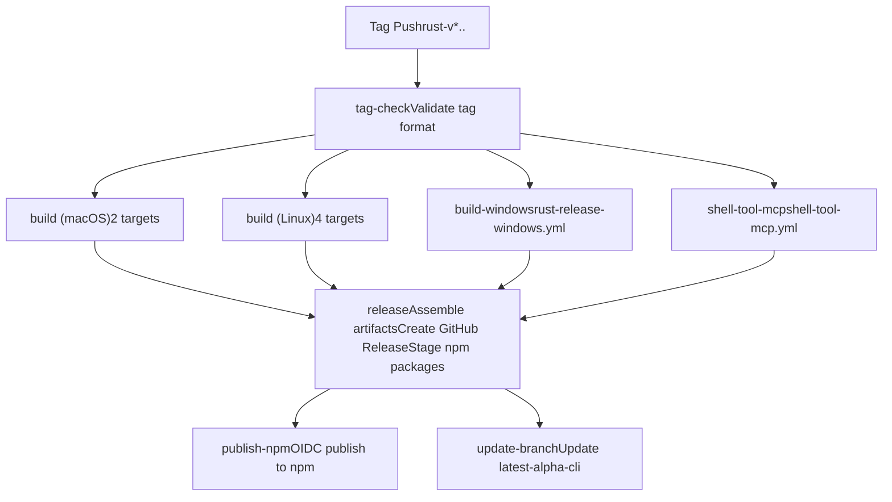
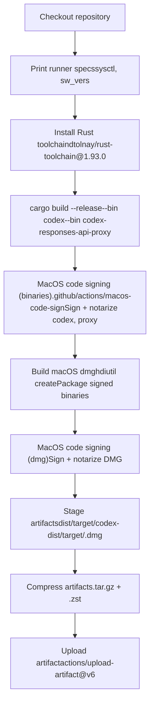
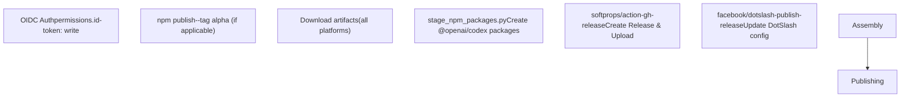

# 发布流水线

相关源文件

-   [.github/actions/windows-code-sign/action.yml](https://github.com/openai/codex/blob/d807d44a/.github/actions/windows-code-sign/action.yml)
-   [.github/scripts/install-musl-build-tools.sh](https://github.com/openai/codex/blob/d807d44a/.github/scripts/install-musl-build-tools.sh)
-   [.github/workflows/ci.yml](https://github.com/openai/codex/blob/d807d44a/.github/workflows/ci.yml)
-   [.github/workflows/rust-ci.yml](https://github.com/openai/codex/blob/d807d44a/.github/workflows/rust-ci.yml)
-   [.github/workflows/rust-release-windows.yml](https://github.com/openai/codex/blob/d807d44a/.github/workflows/rust-release-windows.yml)
-   [.github/workflows/rust-release.yml](https://github.com/openai/codex/blob/d807d44a/.github/workflows/rust-release.yml)
-   [.github/workflows/sdk.yml](https://github.com/openai/codex/blob/d807d44a/.github/workflows/sdk.yml)
-   [.github/workflows/shell-tool-mcp.yml](https://github.com/openai/codex/blob/d807d44a/.github/workflows/shell-tool-mcp.yml)
-   [.github/workflows/zstd](https://github.com/openai/codex/blob/d807d44a/.github/workflows/zstd)
-   [codex-rs/.cargo/config.toml](https://github.com/openai/codex/blob/d807d44a/codex-rs/.cargo/config.toml)
-   [codex-rs/rust-toolchain.toml](https://github.com/openai/codex/blob/d807d44a/codex-rs/rust-toolchain.toml)
-   [codex-rs/scripts/setup-windows.ps1](https://github.com/openai/codex/blob/d807d44a/codex-rs/scripts/setup-windows.ps1)
-   [codex-rs/shell-escalation/README.md](https://github.com/openai/codex/blob/d807d44a/codex-rs/shell-escalation/README.md?plain=1)

## 目的与范围

本文档描述定义于 [.github/workflows/rust-release.yml](https://github.com/openai/codex/blob/d807d44a/.github/workflows/rust-release.yml) 的发布流水线：该流水线为所有受支持平台构建、签名并发布 Codex 二进制。流水线由推送版本标签触发，编排多平台构建、平台特定代码签名（Apple、Cosign、Azure）、制品压缩、GitHub Release 创建以及 npm 包发布。

有关持续集成测试的信息，请参见 [CI Pipeline](https://github.com/openai/codex/blob/d807d44a/CI Pipeline)。有关分发渠道（GitHub Releases、npm、Homebrew）的详细信息，请参见 [Distribution Channels](https://github.com/openai/codex/blob/d807d44a/Distribution Channels)。有关独立的 shell-tool-mcp 构建流程，请参见 [Shell Tool MCP Build System](https://github.com/openai/codex/blob/d807d44a/Shell Tool MCP Build System)

---

## 发布触发与标签校验

发布流水线由推送匹配 `rust-v*.*.*` 模式的 Git 标签触发 [.github/workflows/rust-release.yml9-12](https://github.com/openai/codex/blob/d807d44a/.github/workflows/rust-release.yml#L9-L12)：

```
git tag -a rust-v0.1.0 -m "Release 0.1.0"git push origin rust-v0.1.0
```
`tag-check` 作业会校验标签格式正确并与 [codex-rs/Cargo.toml](https://github.com/openai/codex/blob/d807d44a/codex-rs/Cargo.toml) 中声明的版本一致。可接受的标签格式包括稳定版（例如 `rust-v1.2.3`）与 alpha/beta 预发布（例如 `rust-v1.2.3-alpha.1`） [.github/workflows/rust-release.yml33-34](https://github.com/openai/codex/blob/d807d44a/.github/workflows/rust-release.yml#L33-L34)

该校验逻辑 [.github/workflows/rust-release.yml37-43](https://github.com/openai/codex/blob/d807d44a/.github/workflows/rust-release.yml#L37-L43) 会从标签提取版本，使用 `grep` 与 `sed` 从 `Cargo.toml` 读取版本，并在二者不匹配时使工作流失败。这可防止因版本不一致导致的误发布。

**来源：** [.github/workflows/rust-release.yml9-46](https://github.com/openai/codex/blob/d807d44a/.github/workflows/rust-release.yml#L9-L46)

---

## 工作流作业依赖

该流水线为所有平台并发构建，然后在所有构建成功后再放行最终发布装配。

**图示：发布流水线作业图**


**来源：** [.github/workflows/rust-release.yml48-635](https://github.com/openai/codex/blob/d807d44a/.github/workflows/rust-release.yml#L48-L635)

---

## 构建矩阵策略

### 平台覆盖

`build` 作业使用矩阵策略并行为 6 种平台/libc 组合构建二进制 [.github/workflows/rust-release.yml64-80](https://github.com/openai/codex/blob/d807d44a/.github/workflows/rust-release.yml#L64-L80)：

| Runner | Target | libc |
| --- | --- | --- |
| `macos-15-xlarge` | `aarch64-apple-darwin` | system |
| `macos-15-xlarge` | `x86_64-apple-darwin` | system |
| `ubuntu-24.04` | `x86_64-unknown-linux-musl` | musl |
| `ubuntu-24.04` | `x86_64-unknown-linux-gnu` | glibc |
| `ubuntu-24.04-arm` | `aarch64-unknown-linux-musl` | musl |
| `ubuntu-24.04-arm` | `aarch64-unknown-linux-gnu` | glibc |

Windows 构建由独立可复用工作流 [.github/workflows/rust-release-windows.yml](https://github.com/openai/codex/blob/d807d44a/.github/workflows/rust-release-windows.yml) 处理，该工作流构建 2 个目标（`x86_64-pc-windows-msvc`, `aarch64-pc-windows-msvc`）。

### LTO 配置

流水线会根据发布类型设置 `CARGO_PROFILE_RELEASE_LTO` [.github/workflows/rust-release.yml60-62](https://github.com/openai/codex/blob/d807d44a/.github/workflows/rust-release.yml#L60-L62)。alpha 发布使用 `thin` LTO 以提升构建速度，稳定发布通常使用 `fat` LTO 以获得最大优化（但当前配置为 `thin`，以避免 Ubuntu ARM 超时）。

**来源：** [.github/workflows/rust-release.yml60-80](https://github.com/openai/codex/blob/d807d44a/.github/workflows/rust-release.yml#L60-L80) [.github/workflows/rust-release-windows.yml38-68](https://github.com/openai/codex/blob/d807d44a/.github/workflows/rust-release-windows.yml#L38-L68)

---

## macOS 构建与代码签名

**图示：macOS 发布构建流程**


macOS 构建流程采用两阶段签名与公证：

1.  **二进制签名** [.github/workflows/rust-release.yml224-235](https://github.com/openai/codex/blob/d807d44a/.github/workflows/rust-release.yml#L224-L235)：使用 `macos-code-sign` action 对 `codex` 与 `codex-responses-api-proxy` 二进制分别签名并公证。
2.  **DMG 创建** [.github/workflows/rust-release.yml237-281](https://github.com/openai/codex/blob/d807d44a/.github/workflows/rust-release.yml#L237-L281)：通过 `hdiutil create` 将已签名二进制打包为 DMG 卷。
3.  **DMG 签名** [.github/workflows/rust-release.yml283-294](https://github.com/openai/codex/blob/d807d44a/.github/workflows/rust-release.yml#L283-L294)：生成的 DMG 本身也会被签名并公证。

**来源：** [.github/workflows/rust-release.yml224-294](https://github.com/openai/codex/blob/d807d44a/.github/workflows/rust-release.yml#L224-L294)

---

## Linux 构建与 musl 交叉编译

### musl 工具链设置

Linux 构建同时产出 musl 与 glibc 变体。musl 构建需要通过 [.github/scripts/install-musl-build-tools.sh](https://github.com/openai/codex/blob/d807d44a/.github/scripts/install-musl-build-tools.sh) 配置专用环境：

-   **Zig 集成**: 使用 Zig 0.14.0 作为 C/C++ 编译器进行 musl 交叉编译 [.github/workflows/rust-release.yml144-147](https://github.com/openai/codex/blob/d807d44a/.github/workflows/rust-release.yml#L144-L147)
-   **密封 Cargo Home**: 创建隔离的 `$GITHUB_WORKSPACE/.cargo-home`，避免宿主工具链污染 [.github/workflows/rust-release.yml133-141](https://github.com/openai/codex/blob/d807d44a/.github/workflows/rust-release.yml#L133-L141)
-   **libcap**: 针对目标架构使用 `musl-gcc` 或 Zig 从源码构建 `libcap` [.github/scripts/install-musl-build-tools.sh35-90](https://github.com/openai/codex/blob/d807d44a/.github/scripts/install-musl-build-tools.sh#L35-L90)
-   **UBSan Wrapper**: 配置 `rustc-ubsan-wrapper` 脚本，在 musl 主机上预加载 `libubsan.so.1` [.github/workflows/rust-release.yml156-175](https://github.com/openai/codex/blob/d807d44a/.github/workflows/rust-release.yml#L156-L175)

### Linux 代码签名

Linux 二进制使用 `linux-code-sign` action 进行基于 Cosign 的无密钥签名 [.github/workflows/rust-release.yml217-222](https://github.com/openai/codex/blob/d807d44a/.github/workflows/rust-release.yml#L217-L222)。这会在每个二进制旁产出 `.sigstore` bundle 以供校验。

**来源：** [.github/workflows/rust-release.yml112-222](https://github.com/openai/codex/blob/d807d44a/.github/workflows/rust-release.yml#L112-L222) [.github/scripts/install-musl-build-tools.sh](https://github.com/openai/codex/blob/d807d44a/.github/scripts/install-musl-build-tools.sh)

---

## Windows 构建与 Azure Trusted Signing

Windows 构建委托给 [.github/workflows/rust-release-windows.yml](https://github.com/openai/codex/blob/d807d44a/.github/workflows/rust-release-windows.yml)

1.  **Bundle 拆分**: 将二进制分为两组构建：`primary`（`codex.exe`, `codex-responses-api-proxy.exe`）与 `helpers`（`codex-windows-sandbox-setup.exe`, `codex-command-runner.exe`） [.github/workflows/rust-release-windows.yml38-68](https://github.com/openai/codex/blob/d807d44a/.github/workflows/rust-release-windows.yml#L38-L68)
2.  **Azure Trusted Signing**: 使用 `windows-code-sign` 复合 action [.github/actions/windows-code-sign/action.yml](https://github.com/openai/codex/blob/d807d44a/.github/actions/windows-code-sign/action.yml) 对四个二进制全部签名。
3.  **OIDC 认证**: 通过 `azure/login@v2` 使用 OIDC 向 Azure 认证 [.github/actions/windows-code-sign/action.yml29-34](https://github.com/openai/codex/blob/d807d44a/.github/actions/windows-code-sign/action.yml#L29-L34)
4.  **校验**: 签名后，工作流在制品暂存前校验四个可执行文件全部存在 [.github/workflows/rust-release-windows.yml164-171](https://github.com/openai/codex/blob/d807d44a/.github/workflows/rust-release-windows.yml#L164-L171)

**来源：** [.github/workflows/rust-release-windows.yml](https://github.com/openai/codex/blob/d807d44a/.github/workflows/rust-release-windows.yml) [.github/actions/windows-code-sign/action.yml](https://github.com/openai/codex/blob/d807d44a/.github/actions/windows-code-sign/action.yml)

---

## 制品打包与压缩

签名完成后，二进制会被暂存并压缩为多种格式 [.github/workflows/rust-release.yml296-356](https://github.com/openai/codex/blob/d807d44a/.github/workflows/rust-release.yml#L296-L356)：

-   **命名约定**: 二进制重命名为包含目标 triple（例如 `codex-x86_64-unknown-linux-musl`）。
-   **压缩格式**:
    -   `.tar.gz`: 标准 Unix 压缩 [.github/workflows/rust-release.yml327](https://github.com/openai/codex/blob/d807d44a/.github/workflows/rust-release.yml#L327-L327)
    -   `.zst`: 高性能 Zstandard 压缩（level 19） [.github/workflows/rust-release.yml328](https://github.com/openai/codex/blob/d807d44a/.github/workflows/rust-release.yml#L328-L328)
    -   `.zip`: 标准 Windows 压缩（使用 `7z`） [.github/workflows/rust-release-windows.yml241](https://github.com/openai/codex/blob/d807d44a/.github/workflows/rust-release-windows.yml#L241-L241)
-   **DMG**: 对于 macOS，包含签名后的 `.dmg` [.github/workflows/rust-release.yml315-318](https://github.com/openai/codex/blob/d807d44a/.github/workflows/rust-release.yml#L315-L318)

**来源：** [.github/workflows/rust-release.yml296-356](https://github.com/openai/codex/blob/d807d44a/.github/workflows/rust-release.yml#L296-L356) [.github/workflows/rust-release-windows.yml236-250](https://github.com/openai/codex/blob/d807d44a/.github/workflows/rust-release-windows.yml#L236-L250)

---

## 发布装配与 npm 发布

`release` 作业会装配最终 GitHub Release 并暂存 npm 包。

**图示：发布装配与发布**


### 通过 OIDC 发布 npm

Codex 使用 OpenID Connect（OIDC）向 npm 发布，无需长期令牌 [.github/workflows/rust-release.yml522-615](https://github.com/openai/codex/blob/d807d44a/.github/workflows/rust-release.yml#L522-L615)

-   **版本逻辑**: 稳定版本发布到默认 tag；带 `-alpha` 或 `-beta` 后缀的版本使用 `alpha` tag [.github/workflows/rust-release.yml447-464](https://github.com/openai/codex/blob/d807d44a/.github/workflows/rust-release.yml#L447-L464)
-   **包范围**: 发布聚合包 `@openai/codex`、平台特定二进制、`@openai/codex-sdk` 以及 `@openai/codex-responses-api-proxy` [.github/workflows/rust-release.yml571-615](https://github.com/openai/codex/blob/d807d44a/.github/workflows/rust-release.yml#L571-L615)

**来源：** [.github/workflows/rust-release.yml374-615](https://github.com/openai/codex/blob/d807d44a/.github/workflows/rust-release.yml#L374-L615)
