# 分发渠道

相关源文件

-   [.github/actions/windows-code-sign/action.yml](https://github.com/openai/codex/blob/d807d44a/.github/actions/windows-code-sign/action.yml)
-   [.github/dotslash-config.json](https://github.com/openai/codex/blob/d807d44a/.github/dotslash-config.json)
-   [.github/scripts/install-musl-build-tools.sh](https://github.com/openai/codex/blob/d807d44a/.github/scripts/install-musl-build-tools.sh)
-   [.github/workflows/ci.yml](https://github.com/openai/codex/blob/d807d44a/.github/workflows/ci.yml)
-   [.github/workflows/rust-ci.yml](https://github.com/openai/codex/blob/d807d44a/.github/workflows/rust-ci.yml)
-   [.github/workflows/rust-release-windows.yml](https://github.com/openai/codex/blob/d807d44a/.github/workflows/rust-release-windows.yml)
-   [.github/workflows/rust-release.yml](https://github.com/openai/codex/blob/d807d44a/.github/workflows/rust-release.yml)
-   [.github/workflows/sdk.yml](https://github.com/openai/codex/blob/d807d44a/.github/workflows/sdk.yml)
-   [.github/workflows/shell-tool-mcp-ci.yml](https://github.com/openai/codex/blob/d807d44a/.github/workflows/shell-tool-mcp-ci.yml)
-   [.github/workflows/shell-tool-mcp.yml](https://github.com/openai/codex/blob/d807d44a/.github/workflows/shell-tool-mcp.yml)
-   [.github/workflows/zstd](https://github.com/openai/codex/blob/d807d44a/.github/workflows/zstd)
-   [CHANGELOG.md](https://github.com/openai/codex/blob/d807d44a/CHANGELOG.md?plain=1)
-   [cliff.toml](https://github.com/openai/codex/blob/d807d44a/cliff.toml)
-   [codex-cli/.gitignore](https://github.com/openai/codex/blob/d807d44a/codex-cli/.gitignore)
-   [codex-cli/README.md](https://github.com/openai/codex/blob/d807d44a/codex-cli/README.md?plain=1)
-   [codex-cli/bin/codex.js](https://github.com/openai/codex/blob/d807d44a/codex-cli/bin/codex.js)
-   [codex-cli/bin/rg](https://github.com/openai/codex/blob/d807d44a/codex-cli/bin/rg)
-   [codex-cli/package.json](https://github.com/openai/codex/blob/d807d44a/codex-cli/package.json)
-   [codex-cli/scripts/README.md](https://github.com/openai/codex/blob/d807d44a/codex-cli/scripts/README.md?plain=1)
-   [codex-cli/scripts/build\_npm\_package.py](https://github.com/openai/codex/blob/d807d44a/codex-cli/scripts/build_npm_package.py)
-   [codex-cli/scripts/install\_native\_deps.py](https://github.com/openai/codex/blob/d807d44a/codex-cli/scripts/install_native_deps.py)
-   [codex-rs/.cargo/config.toml](https://github.com/openai/codex/blob/d807d44a/codex-rs/.cargo/config.toml)
-   [codex-rs/process-hardening/README.md](https://github.com/openai/codex/blob/d807d44a/codex-rs/process-hardening/README.md?plain=1)
-   [codex-rs/responses-api-proxy/npm/README.md](https://github.com/openai/codex/blob/d807d44a/codex-rs/responses-api-proxy/npm/README.md?plain=1)
-   [codex-rs/responses-api-proxy/npm/bin/codex-responses-api-proxy.js](https://github.com/openai/codex/blob/d807d44a/codex-rs/responses-api-proxy/npm/bin/codex-responses-api-proxy.js)
-   [codex-rs/responses-api-proxy/npm/package.json](https://github.com/openai/codex/blob/d807d44a/codex-rs/responses-api-proxy/npm/package.json)
-   [codex-rs/rust-toolchain.toml](https://github.com/openai/codex/blob/d807d44a/codex-rs/rust-toolchain.toml)
-   [codex-rs/scripts/setup-windows.ps1](https://github.com/openai/codex/blob/d807d44a/codex-rs/scripts/setup-windows.ps1)
-   [codex-rs/shell-escalation/README.md](https://github.com/openai/codex/blob/d807d44a/codex-rs/shell-escalation/README.md?plain=1)
-   [package.json](https://github.com/openai/codex/blob/d807d44a/package.json)
-   [pnpm-workspace.yaml](https://github.com/openai/codex/blob/d807d44a/pnpm-workspace.yaml)
-   [scripts/stage\_npm\_packages.py](https://github.com/openai/codex/blob/d807d44a/scripts/stage_npm_packages.py)
-   [sdk/typescript/.prettierignore](https://github.com/openai/codex/blob/d807d44a/sdk/typescript/.prettierignore)
-   [shell-tool-mcp/package.json](https://github.com/openai/codex/blob/d807d44a/shell-tool-mcp/package.json)
-   [shell-tool-mcp/src/index.ts](https://github.com/openai/codex/blob/d807d44a/shell-tool-mcp/src/index.ts)

## 目的与范围

本文档描述 Codex 二进制与软件包在发布流水线构建完成后如何分发给最终用户。内容涵盖主要分发渠道（GitHub Releases、npm Registry、Homebrew Cask、WinGet 与 DotSlash）、制品如何暂存与发布，以及用户可用的安装方式。

该分发系统旨在处理多平台原生二进制（基于 Rust）及其对应封装层（Node.js/TypeScript），覆盖 Linux（musl/gnu）、macOS（Darwin）与 Windows（MSVC）。

---

## 分发架构

Codex 发布系统通过多个渠道分发制品，以适配不同用户偏好与平台惯例。所有渠道均从同一个由版本标签触发的 GitHub Actions 发布工作流获取制品。

### 发布数据流

```mermaid
flowchart TD
    TAG["Git Tagrust-v*.."]
    CHECK["tag-check jobValidate version"]
    BUILD_LINUX["Build Linux(musl/gnu)"]
    BUILD_MACOS["Build macOS(aarch64/x86_64)"]
    BUILD_WIN["Build Windows(MSVC)"]
    SIGN_WIN["Windows Code SignAzure Trusted Signing"]
    STAGE_NPM["stage_npm_packages.pyCreate .tgz bundles"]
    DMG["DMG Creationhdiutil + notarization"]
    DOTSLASH["DotSlash Generationdotslash-config.json"]
    GITHUB_RELEASE["GitHub Releasessoftprops/action-gh-release"]
    NPM_REGISTRY["npm Registry@openai/codex"]
    SHELL_MCP["npm Registry@openai/codex-shell-tool-mcp"]
    WINGET["WinGet Releaser(Windows)"]

    TAG --> CHECK
    CHECK --> BUILD_LINUX
    CHECK --> BUILD_MACOS
    CHECK --> BUILD_WIN
    BUILD --> WIN_SIGN_WIN
    BUILD --> LINUX_STAGE_NPM
    BUILD --> MACOS_STAGE_NPM
    SIGN --> WIN_STAGE_NPM
    BUILD --> MACOS_DMG
    BUILD --> LINUX_DOTSLASH
    BUILD --> MACOS_DOTSLASH
    SIGN --> WIN_DOTSLASH
    STAGE --> NPM_NPM_REGISTRY
    DMG --> GITHUB_RELEASE
    DOTSLASH --> GITHUB_RELEASE
    SIGN --> WIN_WINGET
```

**来源：** [.github/workflows/rust-release.yml8-12](https://github.com/openai/codex/blob/d807d44a/.github/workflows/rust-release.yml#L8-L12) [.github/workflows/rust-release.yml374-521](https://github.com/openai/codex/blob/d807d44a/.github/workflows/rust-release.yml#L374-L521) [.github/workflows/rust-release-windows.yml1-22](https://github.com/openai/codex/blob/d807d44a/.github/workflows/rust-release-windows.yml#L1-L22)

---

## GitHub Releases

GitHub Releases 是直接下载二进制的主分发渠道，也是其他包管理器的事实来源。

### 发布创建与校验

`tag-check` 作业会在构建开始前确保推送标签（例如 `rust-v0.1.0`）与 `codex-rs/Cargo.toml` 中定义的版本完全一致。

**来源：** [.github/workflows/rust-release.yml19-47](https://github.com/openai/codex/blob/d807d44a/.github/workflows/rust-release.yml#L19-L47)

### 制品组织

制品按目标 triple 组织，并压缩为多种格式以最大化兼容性：

| Target Triple | 平台 | 格式 |
| --- | --- | --- |
| `x86_64-unknown-linux-musl` | Linux x64 | `.zst`, `.tar.gz` |
| `aarch64-unknown-linux-musl` | Linux ARM64 | `.zst`, `.tar.gz` |
| `aarch64-apple-darwin` | macOS Silicon | `.zst`, `.tar.gz`, `.dmg` |
| `x86_64-pc-windows-msvc` | Windows x64 | `.zst`, `.zip`, `.exe` |

**来源：** [.github/workflows/rust-release.yml67-80](https://github.com/openai/codex/blob/d807d44a/.github/workflows/rust-release.yml#L67-L80) [.github/workflows/rust-release-windows.yml39-68](https://github.com/openai/codex/blob/d807d44a/.github/workflows/rust-release-windows.yml#L39-L68) [.github/dotslash-config.json1-84](https://github.com/openai/codex/blob/d807d44a/.github/dotslash-config.json#L1-L84)

---

## npm Registry

npm 分发包含一个主封装包，以及若干携带原生二进制的平台特定可选依赖。

### npm 包结构

`@openai/codex` 包充当选择器。安装后，它通过 shim 执行与用户当前架构匹配的原生二进制。

**来源：** [codex-cli/package.json1-22](https://github.com/openai/codex/blob/d807d44a/codex-cli/package.json#L1-L22) [codex-cli/bin/codex.js15-22](https://github.com/openai/codex/blob/d807d44a/codex-cli/bin/codex.js#L15-L22) [codex-cli/scripts/build\_npm\_package.py21-64](https://github.com/openai/codex/blob/d807d44a/codex-cli/scripts/build_npm_package.py#L21-L64)

### 执行 Shim（`bin/codex.js`）

`codex.js` 入口点会在运行时检测平台与架构，以在 `node_modules` 树中定位原生二进制。

1.  **平台检测：** 使用 `process.platform` 与 `process.arch` 映射到目标 triple（例如 `linux` + `x64` → `x86_64-unknown-linux-musl`）。
2.  **路径解析：** 在本地 `vendor` 目录或已安装的平台特定包中查找二进制（例如 `@openai/codex-linux-x64/vendor/...`）。
3.  **信号转发：** 使用 `child_process.spawn` 运行二进制，并将 `SIGINT`、`SIGTERM` 与 `SIGHUP` 转发给子进程，以确保 Rust 引擎平滑关闭。

**来源：** [codex-cli/bin/codex.js24-67](https://github.com/openai/codex/blob/d807d44a/codex-cli/bin/codex.js#L24-L67) [codex-cli/bin/codex.js117-124](https://github.com/openai/codex/blob/d807d44a/codex-cli/bin/codex.js#L117-L124) [codex-cli/bin/codex.js193-206](https://github.com/openai/codex/blob/d807d44a/codex-cli/bin/codex.js#L193-L206)

### 发布流程

发布到 npm 使用 **OIDC（OpenID Connect）**，从 GitHub Actions 进行安全的无令牌认证。

-   **稳定版本：** 发布到 `latest` tag。
-   **Alpha 版本：** 当版本匹配 `*.*.*-alpha.*` 时发布到 `alpha` tag。
-   **重复防护：** 脚本会检查版本是否已发布，以避免工作流失败。

**来源：** [.github/workflows/rust-release.yml531-545](https://github.com/openai/codex/blob/d807d44a/.github/workflows/rust-release.yml#L531-L545) [.github/workflows/rust-release.yml589-606](https://github.com/openai/codex/blob/d807d44a/.github/workflows/rust-release.yml#L589-L606) [.github/workflows/rust-release.yml614-629](https://github.com/openai/codex/blob/d807d44a/.github/workflows/rust-release.yml#L614-L629)

---

## Windows 分发（WinGet）

Codex 通过已签名二进制与 WinGet 提供对 Windows 的一等支持。

### 代码签名

所有 Windows 二进制（`codex.exe`、`codex-responses-api-proxy.exe` 等）均通过 **Azure Trusted Signing** 签名。该流程是 WinGet 分发的必需条件，也用于避免 Windows SmartScreen 警告。

**来源：** [.github/workflows/rust-release-windows.yml173-183](https://github.com/openai/codex/blob/d807d44a/.github/workflows/rust-release-windows.yml#L173-L183) [.github/actions/windows-code-sign/action.yml1-58](https://github.com/openai/codex/blob/d807d44a/.github/actions/windows-code-sign/action.yml#L1-L58)

### WinGet Releaser

流水线包含 `winget-releaser` 作业，会在稳定版发布打标签后自动向 Microsoft Community Training 仓库提交新版本。

**来源：** [.github/workflows/rust-release.yml435-437](https://github.com/openai/codex/blob/d807d44a/.github/workflows/rust-release.yml#L435-L437)

---

## Shell Tool MCP 分发

`@openai/codex-shell-tool-mcp` 包是专用分发物，内含针对 11 种不同 OS 变体打补丁的 Bash 与 Zsh。

### 构建矩阵

`shell-tool-mcp.yml` 工作流会为以下目标编译补丁化 shell：

-   **Linux:** Ubuntu（20.04、22.04、24.04）、Debian（11、12）、CentOS Stream 9。
-   **macOS:** macOS 14、macOS 15。
-   **架构：** x86\_64 与 aarch64。

### 补丁应用

该工作流会克隆上游 Bash，并在编译前应用 `bash-exec-wrapper.patch`。该补丁启用用于沙箱化与能力约束的 `EXEC_WRAPPER` 功能。

**来源：** [.github/workflows/shell-tool-mcp.yml73-127](https://github.com/openai/codex/blob/d807d44a/.github/workflows/shell-tool-mcp.yml#L73-L127) [.github/workflows/shell-tool-mcp.yml148-163](https://github.com/openai/codex/blob/d807d44a/.github/workflows/shell-tool-mcp.yml#L148-L163) [.github/workflows/shell-tool-mcp.yml171-205](https://github.com/openai/codex/blob/d807d44a/.github/workflows/shell-tool-mcp.yml#L171-L205)

---

## 渠道汇总

| 渠道 | 工具 | 命令 / URL |
| --- | --- | --- |
| **npm** | `npm` / `pnpm` | `npm install -g @openai/codex` |
| **Homebrew** | `brew` | `brew install --cask codex` |
| **WinGet** | `winget` | `winget install OpenAI.Codex` |
| **GitHub** | Browser/curl | `https://github.com/openai/codex/releases` |
| **DotSlash** | `dotslash` | Reference `.github/dotslash-config.json` |

**来源：** [README.md1-61](https://github.com/openai/codex/blob/d807d44a/README.md?plain=1#L1-L61) [.github/dotslash-config.json1-30](https://github.com/openai/codex/blob/d807d44a/.github/dotslash-config.json#L1-L30)
