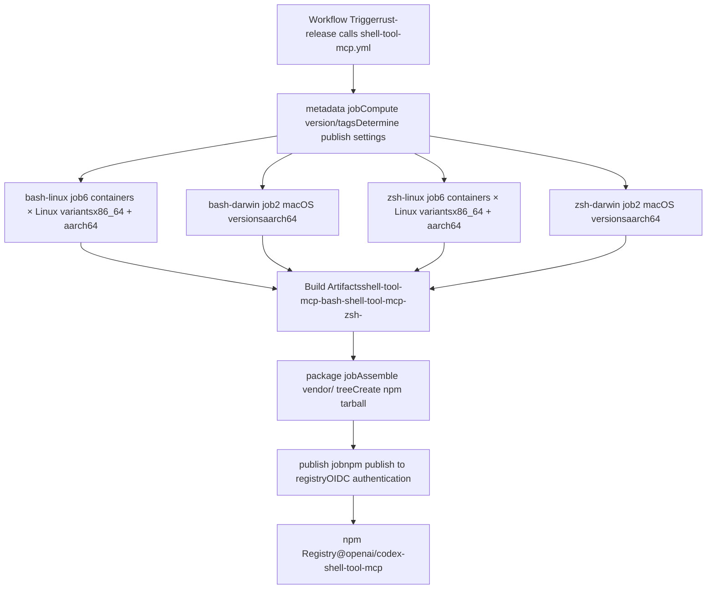
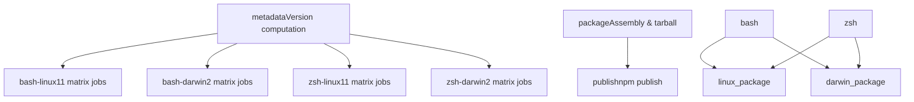
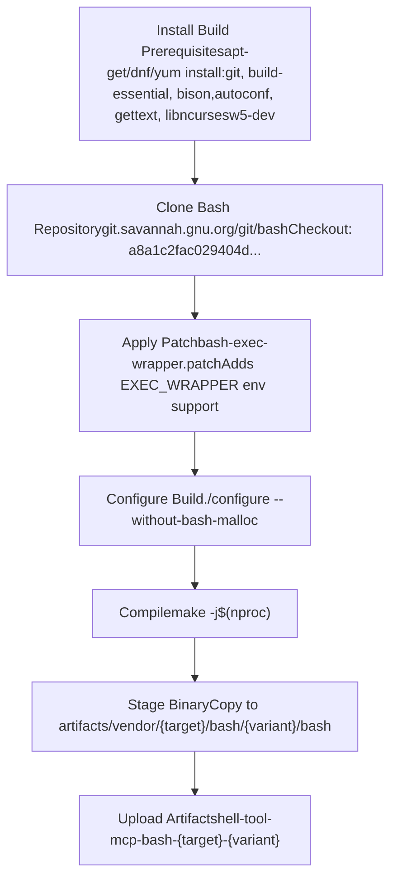
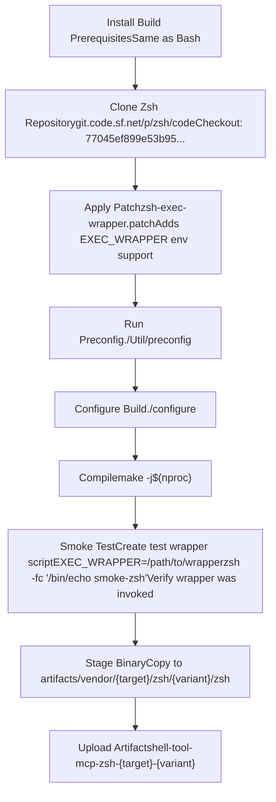
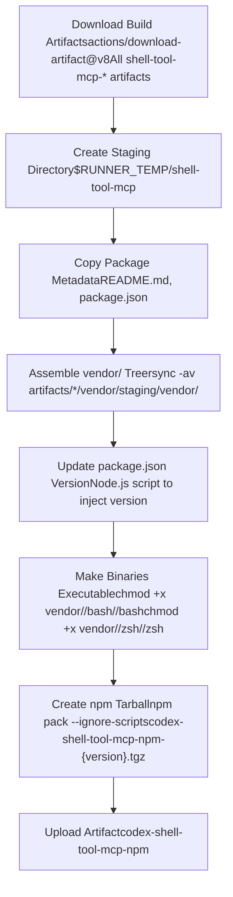
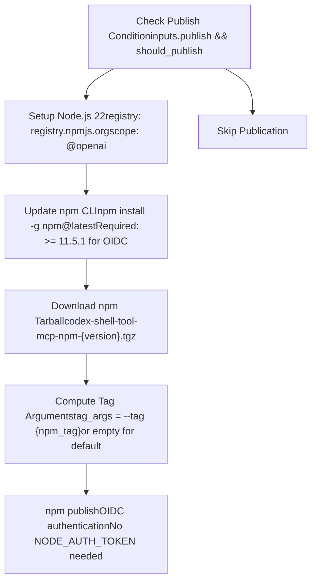
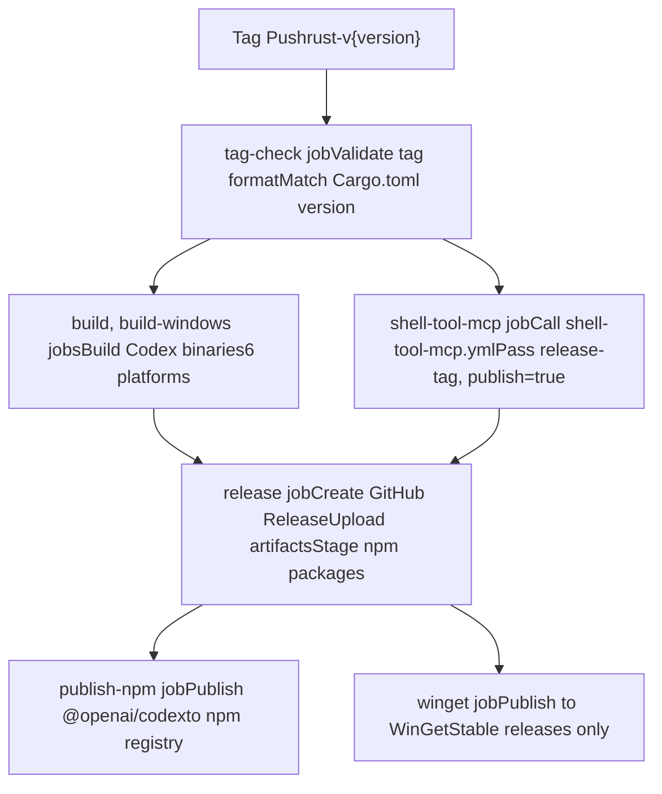

# Shell Tool MCP 构建系统

相关源文件

-   [.github/actions/windows-code-sign/action.yml](https://github.com/openai/codex/blob/d807d44a/.github/actions/windows-code-sign/action.yml)
-   [.github/scripts/install-musl-build-tools.sh](https://github.com/openai/codex/blob/d807d44a/.github/scripts/install-musl-build-tools.sh)
-   [.github/workflows/ci.yml](https://github.com/openai/codex/blob/d807d44a/.github/workflows/ci.yml)
-   [.github/workflows/rust-ci.yml](https://github.com/openai/codex/blob/d807d44a/.github/workflows/rust-ci.yml)
-   [.github/workflows/rust-release-windows.yml](https://github.com/openai/codex/blob/d807d44a/.github/workflows/rust-release-windows.yml)
-   [.github/workflows/rust-release.yml](https://github.com/openai/codex/blob/d807d44a/.github/workflows/rust-release.yml)
-   [.github/workflows/sdk.yml](https://github.com/openai/codex/blob/d807d44a/.github/workflows/sdk.yml)
-   [.github/workflows/shell-tool-mcp.yml](https://github.com/openai/codex/blob/d807d44a/.github/workflows/shell-tool-mcp.yml)
-   [.github/workflows/zstd](https://github.com/openai/codex/blob/d807d44a/.github/workflows/zstd)
-   [codex-rs/.cargo/config.toml](https://github.com/openai/codex/blob/d807d44a/codex-rs/.cargo/config.toml)
-   [codex-rs/rust-toolchain.toml](https://github.com/openai/codex/blob/d807d44a/codex-rs/rust-toolchain.toml)
-   [codex-rs/scripts/setup-windows.ps1](https://github.com/openai/codex/blob/d807d44a/codex-rs/scripts/setup-windows.ps1)
-   [codex-rs/shell-escalation/README.md](https://github.com/openai/codex/blob/d807d44a/codex-rs/shell-escalation/README.md?plain=1)

## 目的与范围

Shell Tool MCP 构建系统负责构建并分发打补丁的 Bash 与 Zsh 版本，这些版本支持对 Codex shell 工具执行过程的拦截。该系统会在 11 种 OS/发行版变体上为 `x86_64` 与 `aarch64` 架构编译定制 shell 二进制，将其打包到 npm 分发物中，并发布到 npm registry。打补丁的 shell 启用了 `EXEC_WRAPPER` 机制，供 Codex 的 shell 提权协议在沙箱化 shell 会话中拦截并控制命令执行。

有关 Codex 在运行时如何使用这些补丁 shell，请参见 [5.2](https://github.com/openai/codex/blob/d807d44a/5.2)。有关 shell 提权协议本身的细节，请参见 `codex-rs/shell-escalation/` 中的 shell-escalation 实现。

**来源：** [.github/workflows/shell-tool-mcp.yml1-549](https://github.com/openai/codex/blob/d807d44a/.github/workflows/shell-tool-mcp.yml#L1-L549) [codex-rs/shell-escalation/README.md1-32](https://github.com/openai/codex/blob/d807d44a/codex-rs/shell-escalation/README.md?plain=1#L1-L32)

---

## 系统概览

`shell-tool-mcp` 系统作为独立工作流运行，独立于主 Codex 发布流水线构建补丁 shell 二进制，随后与发布工作流集成以协调版本与发布。该系统产出 `@openai/codex-shell-tool-mcp` npm 包，内含按目标 triple 与 OS 变体组织的平台特定二进制。

### 构建与分发流程


**来源：** [.github/workflows/shell-tool-mcp.yml1-549](https://github.com/openai/codex/blob/d807d44a/.github/workflows/shell-tool-mcp.yml#L1-L549) [.github/workflows/rust-release.yml374-381](https://github.com/openai/codex/blob/d807d44a/.github/workflows/rust-release.yml#L374-L381)

---

## 工作流架构

`shell-tool-mcp.yml` 工作流被设计为可复用工作流，可接收版本与发布控制输入。它由主 `rust-release.yml` 工作流调用。

### 工作流输入与作业依赖

| Input | 类型 | 描述 | 默认值 |
| --- | --- | --- | --- |
| `release-version` | string | 要发布的版本（x.y.z 或 x.y.z-alpha.N） | 从 `GITHUB_REF_NAME` 推导 |
| `release-tag` | string | 下载发布制品使用的标签名 | `rust-v{version}` |
| `publish` | boolean | 是否发布到 npm | `true` |

### 作业依赖链


`metadata` 作业会计算版本字符串，并根据版本格式决定是否发布。稳定版（`x.y.z`）与 alpha 版本（`x.y.z-alpha.N`）可发布；其他格式会跳过发布。

**来源：** [.github/workflows/shell-tool-mcp.yml4-68](https://github.com/openai/codex/blob/d807d44a/.github/workflows/shell-tool-mcp.yml#L4-L68)

---

## 构建矩阵与平台

该工作流会在 11 种 OS/发行版变体上构建二进制，覆盖主流 Linux 发行版与 macOS 版本。每个 Linux 变体都会为 `x86_64` 与 `aarch64` 架构构建，而 macOS 构建仅为 `aarch64`。

### Linux 构建矩阵

| Variant | Container Image | Runner | Target Triple | Job Count |
| --- | --- | --- | --- | --- |
| ubuntu-24.04 | `ubuntu:24.04` | `ubuntu-24.04` | `x86_64-unknown-linux-musl` | 1 |
| ubuntu-24.04 | `arm64v8/ubuntu:24.04` | `ubuntu-24.04-arm` | `aarch64-unknown-linux-musl` | 1 |
| ubuntu-22.04 | `ubuntu:22.04` | `ubuntu-24.04` | `x86_64-unknown-linux-musl` | 1 |
| ubuntu-22.04 | `arm64v8/ubuntu:22.04` | `ubuntu-24.04-arm` | `aarch64-unknown-linux-musl` | 1 |
| ubuntu-20.04 | `arm64v8/ubuntu:20.04` | `ubuntu-24.04-arm` | `aarch64-unknown-linux-musl` | 1 |
| debian-12 | `debian:12` | `ubuntu-24.04` | `x86_64-unknown-linux-musl` | 1 |
| debian-12 | `arm64v8/debian:12` | `ubuntu-24.04-arm` | `aarch64-unknown-linux-musl` | 1 |
| debian-11 | `debian:11` | `ubuntu-24.04` | `x86_64-unknown-linux-musl` | 1 |
| debian-11 | `arm64v8/debian:11` | `ubuntu-24.04-arm` | `aarch64-unknown-linux-musl` | 1 |
| centos-9 | `quay.io/centos/centos:stream9` | `ubuntu-24.04` | `x86_64-unknown-linux-musl` | 1 |
| centos-9 | `quay.io/centos/centos:stream9` | `ubuntu-24.04-arm` | `aarch64-unknown-linux-musl` | 1 |

### macOS 构建矩阵

| Variant | Runner | Target Triple |
| --- | --- | --- |
| macos-15 | `macos-15-xlarge` | `aarch64-apple-darwin` |
| macos-14 | `macos-14` | `aarch64-apple-darwin` |

**来源：** [.github/workflows/shell-tool-mcp.yml70-125](https://github.com/openai/codex/blob/d807d44a/.github/workflows/shell-tool-mcp.yml#L70-L125) [.github/workflows/shell-tool-mcp.yml168-182](https://github.com/openai/codex/blob/d807d44a/.github/workflows/shell-tool-mcp.yml#L168-L182) [.github/workflows/shell-tool-mcp.yml209-263](https://github.com/openai/codex/blob/d807d44a/.github/workflows/shell-tool-mcp.yml#L209-L263) [.github/workflows/shell-tool-mcp.yml334-349](https://github.com/openai/codex/blob/d807d44a/.github/workflows/shell-tool-mcp.yml#L334-L349)

---

## Bash 构建流程

Bash 构建流程会从 GNU Savannah 仓库克隆上游 Bash，应用用于添加 `EXEC_WRAPPER` 支持的自定义补丁，完成构建配置，并编译二进制。

### Bash 构建步骤


### 补丁细节

Bash 补丁修改 `execute_cmd.c` 以支持 `EXEC_WRAPPER` 环境变量。设置后，Bash 会在执行任何外部命令前调用包装程序（通常是 `codex-execve-wrapper`），从而实现 shell 提权协议集成。

具体补丁文件位于 `shell-tool-mcp/patches/bash-exec-wrapper.patch`，可干净应用于 Bash 提交 `a8a1c2fac029404d3f42cd39f5a20f24b6e4fe4b`。

**来源：** [.github/workflows/shell-tool-mcp.yml126-165](https://github.com/openai/codex/blob/d807d44a/.github/workflows/shell-tool-mcp.yml#L126-L165) [.github/workflows/shell-tool-mcp.yml183-206](https://github.com/openai/codex/blob/d807d44a/.github/workflows/shell-tool-mcp.yml#L183-L206) [codex-rs/shell-escalation/README.md18-28](https://github.com/openai/codex/blob/d807d44a/codex-rs/shell-escalation/README.md?plain=1#L18-L28)

---

## Zsh 构建流程

Zsh 构建流程与 Bash 类似，但多了一个额外的冒烟测试，用于验证编译后 `EXEC_WRAPPER` 功能可正确工作。

### Zsh 构建与测试流程


### 冒烟测试实现

冒烟测试会创建临时包装脚本，将所有调用记录到 `CODEX_WRAPPER_LOG`，然后通过打补丁的 `zsh` 执行一个简单命令。测试通过检查日志文件，验证命令输出正确且包装器确实被调用。

**来源：** [.github/workflows/shell-tool-mcp.yml263-332](https://github.com/openai/codex/blob/d807d44a/.github/workflows/shell-tool-mcp.yml#L263-L332) [.github/workflows/shell-tool-mcp.yml378-410](https://github.com/openai/codex/blob/d807d44a/.github/workflows/shell-tool-mcp.yml#L378-L410)

---

## 包装配与结构

`package` 作业会下载所有构建制品，将其组装为统一目录结构，更新 `package.json` 版本，并创建 npm tarball。

### Vendor 目录结构

```
vendor/
├── x86_64-unknown-linux-musl/
│   ├── bash/
│   │   ├── ubuntu-24.04/bash
│   │   ├── ubuntu-22.04/bash
│   │   ├── debian-12/bash
│   │   ├── debian-11/bash
│   │   └── centos-9/bash
│   └── zsh/
│       ├── ubuntu-24.04/zsh
│       ├── ubuntu-22.04/zsh
│       ├── debian-12/zsh
│       ├── debian-11/zsh
│       └── centos-9/zsh
├── aarch64-unknown-linux-musl/
│   ├── bash/
│   │   ├── ubuntu-24.04/bash
│   │   ├── ubuntu-22.04/bash
│   │   ├── ubuntu-20.04/bash
│   │   ├── debian-12/bash
│   │   ├── debian-11/bash
│   │   └── centos-9/bash
│   └── zsh/
│       └── [same variants]
└── aarch64-apple-darwin/
    ├── bash/
    │   ├── macos-15/bash
    │   └── macos-14/bash
    └── zsh/
        ├── macos-15/zsh
        └── macos-14/zsh
```
### 包装配流程


Node.js 版本更新脚本会读取现有 `package.json`，仅修改 `version` 字段，并以一致格式写回（2 空格缩进、末尾换行）。

**来源：** [.github/workflows/shell-tool-mcp.yml412-508](https://github.com/openai/codex/blob/d807d44a/.github/workflows/shell-tool-mcp.yml#L412-L508)

---

## 版本管理与发布

该工作流支持两个发布通道：稳定版与 alpha 预发布。版本格式同时决定 npm tag 以及是否执行发布。

### 版本格式与分发

| Version Format | Example | `should_publish` | `npm_tag` | 分发 |
| --- | --- | --- | --- | --- |
| Stable | `1.2.3` | `true` | (default) | npm（默认 tag） |
| Alpha | `1.2.3-alpha.4` | `true` | `alpha` | npm（alpha tag） |
| Other | `1.2.3-beta.1` | `false` | \- | 跳过 |

### 发布流程


该工作流使用 npm 的 OIDC 可信发布能力，无需长期认证令牌。发布时 GitHub Actions 的 OIDC 令牌会自动换取 npm registry 凭据。

**来源：** [.github/workflows/shell-tool-mcp.yml509-549](https://github.com/openai/codex/blob/d807d44a/.github/workflows/shell-tool-mcp.yml#L509-L549) [.github/workflows/shell-tool-mcp.yml24-68](https://github.com/openai/codex/blob/d807d44a/.github/workflows/shell-tool-mcp.yml#L24-L68)

---

## 与主发布流水线集成

`shell-tool-mcp` 工作流作为可复用工作流由主 `rust-release.yml` 流水线调用。该集成确保 shell 二进制会作为每次 Codex 发布的一部分被构建与发布。

### 发布流水线集成


`shell-tool-mcp` 作业与主 Codex 二进制构建并行运行。两者都必须成功完成后，release 作业才会装配最终分发物。`shell-tool-mcp` 制品会独立上传到 npm，不会包含在 GitHub Release 资产中。

**来源：** [.github/workflows/rust-release.yml374-381](https://github.com/openai/codex/blob/d807d44a/.github/workflows/rust-release.yml#L374-L381) [.github/workflows/rust-release.yml383-515](https://github.com/openai/codex/blob/d807d44a/.github/workflows/rust-release.yml#L383-L515)

---

## 平台特定注意事项

### Linux 容器构建

Linux 构建在特定发行版容器内执行，以确保与各目标环境兼容。该工作流处理三类主要包管理器生态：

-   **apt-based**（Ubuntu、Debian）: `apt-get install git build-essential bison autoconf gettext libncursesw5-dev`
-   **dnf-based**（CentOS Stream 9）: `dnf install git gcc gcc-c++ make bison autoconf gettext ncurses-devel`
-   **yum-based**（较旧 CentOS）: `yum install git gcc gcc-c++ make bison autoconf gettext ncurses-devel`

容器方案将构建环境与 runner 宿主系统隔离，确保编译出的二进制链接到预期 libc 版本（为可移植性使用 `musl`）。

### macOS 原生构建

macOS 构建直接在宿主 runner 上运行，不使用容器。工作流会在缺失时通过 Homebrew 检查并安装 `autoconf`。macOS 构建使用系统默认编译器工具链。

### 构建并行度

所有构建均使用基于核心数检测的 `make -j`：

-   Linux: `nproc` 或 `getconf _NPROCESSORS_ONLN`
-   macOS: `getconf _NPROCESSORS_ONLN`

**来源：** [.github/workflows/shell-tool-mcp.yml126-141](https://github.com/openai/codex/blob/d807d44a/.github/workflows/shell-tool-mcp.yml#L126-L141) [.github/workflows/shell-tool-mcp.yml264-278](https://github.com/openai/codex/blob/d807d44a/.github/workflows/shell-tool-mcp.yml#L264-L278) [.github/workflows/shell-tool-mcp.yml350-356](https://github.com/openai/codex/blob/d807d44a/.github/workflows/shell-tool-mcp.yml#L350-L356)

---

## 制品管理

构建制品遵循一致的命名方案，以支持并行构建和可靠下载。每个作业独立上传其制品，而 package 作业在单个步骤中下载全部制品。

### 制品命名约定

| Job Type | Artifact Name Pattern | 内容 |
| --- | --- | --- |
| Bash Linux | `shell-tool-mcp-bash-{target}-{variant}` | `artifacts/vendor/{target}/bash/{variant}/bash` |
| Bash macOS | `shell-tool-mcp-bash-{target}-{variant}` | `artifacts/vendor/{target}/bash/{variant}/bash` |
| Zsh Linux | `shell-tool-mcp-zsh-{target}-{variant}` | `artifacts/vendor/{target}/zsh/{variant}/zsh` |
| Zsh macOS | `shell-tool-mcp-zsh-{target}-{variant}` | `artifacts/vendor/{target}/zsh/{variant}/zsh` |
| Final Package | `codex-shell-tool-mcp-npm` | `dist/npm/codex-shell-tool-mcp-npm-{version}.tgz` |

所有制品均使用 GitHub Actions artifact 存储，并设置 `if-no-files-found: error`，以确保上传失败会被立即检测。

**来源：** [.github/workflows/shell-tool-mcp.yml161-165](https://github.com/openai/codex/blob/d807d44a/.github/workflows/shell-tool-mcp.yml#L161-L165) [.github/workflows/shell-tool-mcp.yml503-508](https://github.com/openai/codex/blob/d807d44a/.github/workflows/shell-tool-mcp.yml#L503-L508)
