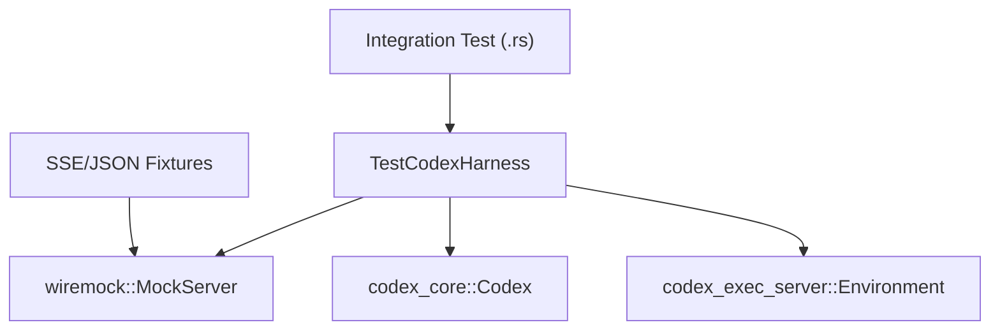
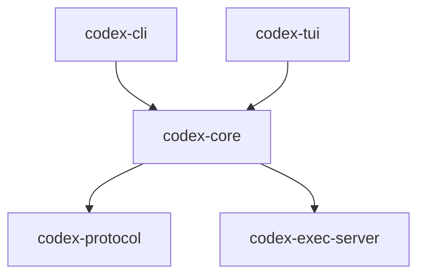

# 开发与测试

相关源文件

-   [AGENTS.md](https://github.com/openai/codex/blob/d807d44a/AGENTS.md?plain=1)
-   [codex-rs/core/tests/common/Cargo.toml](https://github.com/openai/codex/blob/d807d44a/codex-rs/core/tests/common/Cargo.toml)
-   [codex-rs/core/tests/common/lib.rs](https://github.com/openai/codex/blob/d807d44a/codex-rs/core/tests/common/lib.rs)
-   [codex-rs/core/tests/common/test\_codex.rs](https://github.com/openai/codex/blob/d807d44a/codex-rs/core/tests/common/test_codex.rs)
-   [codex-rs/core/tests/suite/apply\_patch\_cli.rs](https://github.com/openai/codex/blob/d807d44a/codex-rs/core/tests/suite/apply_patch_cli.rs)
-   [codex-rs/core/tests/suite/fork\_thread.rs](https://github.com/openai/codex/blob/d807d44a/codex-rs/core/tests/suite/fork_thread.rs)
-   [codex-rs/core/tests/suite/mod.rs](https://github.com/openai/codex/blob/d807d44a/codex-rs/core/tests/suite/mod.rs)
-   [codex-rs/core/tests/suite/remote\_env.rs](https://github.com/openai/codex/blob/d807d44a/codex-rs/core/tests/suite/remote_env.rs)
-   [codex-rs/core/tests/suite/stream\_error\_allows\_next\_turn.rs](https://github.com/openai/codex/blob/d807d44a/codex-rs/core/tests/suite/stream_error_allows_next_turn.rs)
-   [codex-rs/core/tests/suite/stream\_no\_completed.rs](https://github.com/openai/codex/blob/d807d44a/codex-rs/core/tests/suite/stream_no_completed.rs)
-   [docs/authentication.md](https://github.com/openai/codex/blob/d807d44a/docs/authentication.md?plain=1)
-   [docs/contributing.md](https://github.com/openai/codex/blob/d807d44a/docs/contributing.md?plain=1)
-   [docs/exec.md](https://github.com/openai/codex/blob/d807d44a/docs/exec.md?plain=1)
-   [docs/getting-started.md](https://github.com/openai/codex/blob/d807d44a/docs/getting-started.md?plain=1)
-   [docs/install.md](https://github.com/openai/codex/blob/d807d44a/docs/install.md?plain=1)
-   [docs/license.md](https://github.com/openai/codex/blob/d807d44a/docs/license.md?plain=1)
-   [docs/open-source-fund.md](https://github.com/openai/codex/blob/d807d44a/docs/open-source-fund.md?plain=1)
-   [docs/sandbox.md](https://github.com/openai/codex/blob/d807d44a/docs/sandbox.md?plain=1)
-   [justfile](https://github.com/openai/codex/blob/d807d44a/justfile)
-   [scripts/test-remote-env.sh](https://github.com/openai/codex/blob/d807d44a/scripts/test-remote-env.sh)

本页为向 Codex 代码库贡献的开发者提供高层指南。内容涵盖维护系统可靠性与性能所需的核心环境设置、测试理念与编码标准。

有关详细环境设置说明，请参见 [开发环境设置](/openai/codex/9.1-development-setup)。有关测试工具的深入介绍，请参见 [测试基础设施](/openai/codex/9.2-testing-infrastructure)。

## 核心开发原则

Codex 代码库遵循严格的 Rust 习惯用法与组织模式，以确保可维护性。关键约束包括：

-   **模块大小**：目标是将模块控制在 500 行代码（LoC）以下。如果文件超过 800 行 LoC，应将功能提取到新模块中 [AGENTS.md32-40](https://github.com/openai/codex/blob/d807d44a/AGENTS.md?plain=1#L32-L40)
-   **API 设计**：避免含义不明确的 `bool` 或 `Option` 参数。优先使用枚举或新类型，以实现自说明的调用点 [AGENTS.md14-18](https://github.com/openai/codex/blob/d807d44a/AGENTS.md?plain=1#L14-L18)
-   **工具链**：项目依赖 `just` 作为命令运行器，依赖 `cargo-nextest` 进行快速测试执行，并依赖 `cargo-insta` 进行快照测试 [AGENTS.md7-47](https://github.com/openai/codex/blob/d807d44a/AGENTS.md?plain=1#L7-L47) [justfile40-47](https://github.com/openai/codex/blob/d807d44a/justfile#L40-L47)

## 开发环境设置与工作流

开发者使用位于 `codex-rs` 目录中的 `justfile` 来管理常见任务。这可确保不同开发环境之间的一致性。

| Command | Purpose |
| --- | --- |
| `just fmt` | 使用特定导入粒度格式化代码 [justfile27-28](https://github.com/openai/codex/blob/d807d44a/justfile#L27-L28) |
| `just fix -p <crate>` | 对特定项目运行 Clippy 修复 [justfile30-31](https://github.com/openai/codex/blob/d807d44a/justfile#L30-L31) |
| `just write-config-schema` | 更新 `config.toml` 的 JSON schema [justfile78-79](https://github.com/openai/codex/blob/d807d44a/justfile#L78-L79) |
| `just argument-comment-lint` | 对字面量参数强制精确的参数名注释 [justfile90-92](https://github.com/openai/codex/blob/d807d44a/justfile#L90-L92) |

详情请参见 [开发环境设置](/openai/codex/9.1-development-setup)。

Sources: [justfile1-101](https://github.com/openai/codex/blob/d807d44a/justfile#L1-L101) [AGENTS.md44-52](https://github.com/openai/codex/blob/d807d44a/AGENTS.md?plain=1#L44-L52)

## 测试基础设施

Codex 采用多层次测试策略，从单元测试到模拟模型交互的复杂集成测试。

### 集成测试驱动框架

`TestCodexHarness` 与 `TestEnv` 工具为集成测试提供可控环境，同时支持本地与远程执行环境 [codex-rs/core/tests/common/test\_codex.rs94-149](https://github.com/openai/codex/blob/d807d44a/codex-rs/core/tests/common/test_codex.rs#L94-L149)

Sources: [codex-rs/core/tests/common/test\_codex.rs124-149](https://github.com/openai/codex/blob/d807d44a/codex-rs/core/tests/common/test_codex.rs#L124-L149) [codex-rs/core/tests/suite/mod.rs1-145](https://github.com/openai/codex/blob/d807d44a/codex-rs/core/tests/suite/mod.rs#L1-L145)

### 关键测试模式

-   **快照测试**：通过 `cargo insta` 广泛用于 UI 与复杂状态树 [codex-rs/core/tests/common/lib.rs43-60](https://github.com/openai/codex/blob/d807d44a/codex-rs/core/tests/common/lib.rs#L43-L60)
-   **SSE Mock**：`StreamingSseServer` 支持测试代理在不完整流或 API 错误下的韧性 [codex-rs/core/tests/suite/stream\_no\_completed.rs32-42](https://github.com/openai/codex/blob/d807d44a/codex-rs/core/tests/suite/stream_no_completed.rs#L32-L42) [codex-rs/core/tests/suite/stream\_error\_allows\_next\_turn.rs24-61](https://github.com/openai/codex/blob/d807d44a/codex-rs/core/tests/suite/stream_error_allows_next_turn.rs#L24-L61)
-   **沙箱测试**：集成测试验证沙箱策略（例如 macOS 上的 Seatbelt）是否被正确执行，并验证代理是否能优雅处理权限拒绝 [AGENTS.md8-10](https://github.com/openai/codex/blob/d807d44a/AGENTS.md?plain=1#L8-L10)

详情请参见 [测试基础设施](/openai/codex/9.2-testing-infrastructure)。

Sources: [codex-rs/core/tests/common/lib.rs1-200](https://github.com/openai/codex/blob/d807d44a/codex-rs/core/tests/common/lib.rs#L1-L200) [codex-rs/core/tests/suite/mod.rs57-145](https://github.com/openai/codex/blob/d807d44a/codex-rs/core/tests/suite/mod.rs#L57-L145)

## 代码组织与约定

项目使用 Cargo workspace，crate 名称以前缀 `codex-` 命名 [AGENTS.md5](https://github.com/openai/codex/blob/d807d44a/AGENTS.md?plain=1#L5-L5)

### 协议与 Schema 管理

对 `app-server` 协议或配置结构的更改需要重新生成 schema，以保持 IDE 集成与 TUI 同步 [justfile78-88](https://github.com/openai/codex/blob/d807d44a/justfile#L78-L88) [AGENTS.md22-24](https://github.com/openai/codex/blob/d807d44a/AGENTS.md?plain=1#L22-L24)

详情请参见 [代码组织模式](/openai/codex/9.3-code-organization-patterns)。

Sources: [AGENTS.md1-60](https://github.com/openai/codex/blob/d807d44a/AGENTS.md?plain=1#L1-L60) [justfile1-101](https://github.com/openai/codex/blob/d807d44a/justfile#L1-L101)

## 可观测性

开发与测试由健壮的遥测系统支持。`codex-otel` crate 集成了 OpenTelemetry 用于追踪与指标。开发过程中，日志通常路由到 `~/.codex/log/codex-tui.log`，并使用 `RUST_LOG` 环境变量来调整详细级别 [docs/install.md54-60](https://github.com/openai/codex/blob/d807d44a/docs/install.md?plain=1#L54-L60)

详情请参见 [可观测性与遥测](/openai/codex/9.4-observability-and-telemetry)。

Sources: [docs/install.md52-65](https://github.com/openai/codex/blob/d807d44a/docs/install.md?plain=1#L52-L65) [codex-rs/core/tests/suite/mod.rs96](https://github.com/openai/codex/blob/d807d44a/codex-rs/core/tests/suite/mod.rs#L96-L96)
