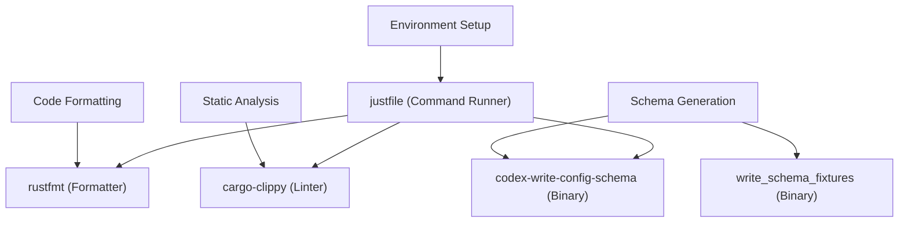

# 开发环境设置

相关源文件

-   [.gitignore](https://github.com/openai/codex/blob/d807d44a/.gitignore)
-   [AGENTS.md](https://github.com/openai/codex/blob/d807d44a/AGENTS.md?plain=1)
-   [codex-rs/default.nix](https://github.com/openai/codex/blob/d807d44a/codex-rs/default.nix)
-   [docs/authentication.md](https://github.com/openai/codex/blob/d807d44a/docs/authentication.md?plain=1)
-   [docs/contributing.md](https://github.com/openai/codex/blob/d807d44a/docs/contributing.md?plain=1)
-   [docs/exec.md](https://github.com/openai/codex/blob/d807d44a/docs/exec.md?plain=1)
-   [docs/getting-started.md](https://github.com/openai/codex/blob/d807d44a/docs/getting-started.md?plain=1)
-   [docs/install.md](https://github.com/openai/codex/blob/d807d44a/docs/install.md?plain=1)
-   [docs/license.md](https://github.com/openai/codex/blob/d807d44a/docs/license.md?plain=1)
-   [docs/open-source-fund.md](https://github.com/openai/codex/blob/d807d44a/docs/open-source-fund.md?plain=1)
-   [docs/sandbox.md](https://github.com/openai/codex/blob/d807d44a/docs/sandbox.md?plain=1)
-   [flake.lock](https://github.com/openai/codex/blob/d807d44a/flake.lock)
-   [flake.nix](https://github.com/openai/codex/blob/d807d44a/flake.nix)
-   [justfile](https://github.com/openai/codex/blob/d807d44a/justfile)

## 目的与范围

本页记录 Codex 代码库的开发环境设置。内容涵盖工具链要求、工作区组织、构建配置、开发工作流（格式化、lint、修复）以及 schema 生成。

---

## 前置条件与工具链

Codex 项目是一个基于 Rust 的 monorepo，需要现代 Rust 工具链与平台相关的构建依赖。

### Rust 工具链

该工作区将 **Rust 2024 edition** 作为所有成员 crate 的默认版本 [codex-rs/Cargo.toml80](https://github.com/openai/codex/blob/d807d44a/codex-rs/Cargo.toml#L80-L80)

### 系统依赖

构建系统依赖若干原生库与工具。

| Requirement | Details | Purpose |
| --- | --- | --- |
| **OS** | macOS 12+, Ubuntu 20.04+, or Windows 11 (WSL2) [docs/install.md7](https://github.com/openai/codex/blob/d807d44a/docs/install.md?plain=1#L7-L7) | 支持的开发环境 |
| **Rust** | `rustup`, `rustfmt`, `clippy` [docs/install.md23-26](https://github.com/openai/codex/blob/d807d44a/docs/install.md?plain=1#L23-L26) | 核心编译器与标准工具链 |
| **Just** | `cargo install just` [docs/install.md28](https://github.com/openai/codex/blob/d807d44a/docs/install.md?plain=1#L28-L28) | 开发任务的命令运行器 |
| **Nextest** | `cargo install cargo-nextest` [docs/install.md30](https://github.com/openai/codex/blob/d807d44a/docs/install.md?plain=1#L30-L30) | 优化的测试运行器（推荐） |
| **Native Libs** | `cmake`, `openssl`, `pkg-config`, `libcap` (Linux) [codex-rs/default.nix30-38](https://github.com/openai/codex/blob/d807d44a/codex-rs/default.nix#L30-L38) | C 绑定与安全相关依赖 |

对于 Nix 用户，项目提供了 `flake.nix`，可搭建完整开发 shell，包含 `rust-analyzer`、`clang` 以及所需库 [flake.nix67-85](https://github.com/openai/codex/blob/d807d44a/flake.nix#L67-L85)

**Sources:** [docs/install.md5-30](https://github.com/openai/codex/blob/d807d44a/docs/install.md?plain=1#L5-L30) [codex-rs/default.nix30-38](https://github.com/openai/codex/blob/d807d44a/codex-rs/default.nix#L30-L38) [flake.nix67-85](https://github.com/openai/codex/blob/d807d44a/flake.nix#L67-L85)

---

## 工作区结构与构建组织

Codex 代码库组织为一个 Cargo workspace，针对核心引擎、用户界面与专用工具划分了特定 crate。

### 关键工作区成员

-   **`codex-cli`**：主 multitool 分发器与入口点 [codex-rs/Cargo.toml13](https://github.com/openai/codex/blob/d807d44a/codex-rs/Cargo.toml#L13-L13)
-   **`codex-core`**：核心代理引擎、会话管理与工具编排 [codex-rs/Cargo.toml15](https://github.com/openai/codex/blob/d807d44a/codex-rs/Cargo.toml#L15-L15)
-   **`codex-tui`**：Terminal User Interface 实现 [codex-rs/Cargo.toml63](https://github.com/openai/codex/blob/d807d44a/codex-rs/Cargo.toml#L63-L63)
-   **`codex-app-server`**：用于 IDE 集成的 JSON-RPC 服务器 [codex-rs/Cargo.toml6](https://github.com/openai/codex/blob/d807d44a/codex-rs/Cargo.toml#L6-L6)
-   **`codex-mcp-server`**：Model Context Protocol 服务器实现 [codex-rs/Cargo.toml41](https://github.com/openai/codex/blob/d807d44a/codex-rs/Cargo.toml#L41-L41)

### 构建配置档

工作区定义了自定义 profile 以优化构建时间与二进制体积：

| Profile | Purpose | Optimization |
| --- | --- | --- |
| `dev` | 本地开发 | 快速编译、增量构建 [codex-rs/Cargo.toml367](https://github.com/openai/codex/blob/d807d44a/codex-rs/Cargo.toml#L367-L367) |
| `release` | 生产二进制 | `lto = "fat"`, `strip = "symbols"`, `codegen-units = 1` [codex-rs/Cargo.toml367-372](https://github.com/openai/codex/blob/d807d44a/codex-rs/Cargo.toml#L367-L372) |
| `ci-test` | 持续集成 | `debug = 1`，继承自 `test` [codex-rs/Cargo.toml374-380](https://github.com/openai/codex/blob/d807d44a/codex-rs/Cargo.toml#L374-L380) |

**Sources:** [codex-rs/Cargo.toml1-80](https://github.com/openai/codex/blob/d807d44a/codex-rs/Cargo.toml#L1-L80) [codex-rs/Cargo.toml367-380](https://github.com/openai/codex/blob/d807d44a/codex-rs/Cargo.toml#L367-L380)

---

## 开发工作流

项目使用 `just` 作为命令运行器，以标准化常见开发任务。

### 核心开发命令

| Command | Action | Implementation |
| --- | --- | --- |
| `just fmt` | 格式化所有代码 | `cargo fmt -- --config imports_granularity=Item` [justfile27-28](https://github.com/openai/codex/blob/d807d44a/justfile#L27-L28) |
| `just fix` | 运行 clippy 修复 | `cargo clippy --fix --tests --allow-dirty` [justfile30-31](https://github.com/openai/codex/blob/d807d44a/justfile#L30-L31) |
| `just clippy` | 检查 lint | `cargo clippy --tests` [justfile33-34](https://github.com/openai/codex/blob/d807d44a/justfile#L33-L34) |
| `just test` | 通过 nextest 运行测试 | `cargo nextest run --no-fail-fast` [justfile46-47](https://github.com/openai/codex/blob/d807d44a/justfile#L46-L47) |
| `just install` | 拉取依赖 | `rustup show active-toolchain && cargo fetch` [justfile36-38](https://github.com/openai/codex/blob/d807d44a/justfile#L36-L38) |

### Schema 生成

多个 crate 需要生成 schema 以实现配置或协议同步。

-   **Config Schema**：从 Rust 类型生成 `config.schema.json` [AGENTS.md22](https://github.com/openai/codex/blob/d807d44a/AGENTS.md?plain=1#L22-L22)
    -   Command: `just write-config-schema` [justfile78-79](https://github.com/openai/codex/blob/d807d44a/justfile#L78-L79)
-   **App Server Protocol**：生成 vendored 协议产物。
    -   Command: `just write-app-server-schema` [justfile82-83](https://github.com/openai/codex/blob/d807d44a/justfile#L82-L83)
-   **Hooks Schema**：为 hooks 系统生成 fixtures。
    -   Command: `just write-hooks-schema` [justfile85-87](https://github.com/openai/codex/blob/d807d44a/justfile#L85-L87)

**Sources:** [justfile26-87](https://github.com/openai/codex/blob/d807d44a/justfile#L26-L87) [AGENTS.md22-26](https://github.com/openai/codex/blob/d807d44a/AGENTS.md?plain=1#L22-L26)

---

## 代码约定与格式化

### 通用规则

-   **变量内联**：在 `format!` 宏中始终将变量内联到 `{}` 中 [AGENTS.md6](https://github.com/openai/codex/blob/d807d44a/AGENTS.md?plain=1#L6-L6)
-   **Clippy 默认项**：遵循 `collapsible_if`、`uninlined_format_args` 与 `redundant_closure_for_method_calls` [AGENTS.md11-13](https://github.com/openai/codex/blob/d807d44a/AGENTS.md?plain=1#L11-L13)
-   **位置参数**：对不透明字面量使用 `/*param_name*/` 注释（例如 `foo(/*is_enabled*/ true)`）[AGENTS.md14-18](https://github.com/openai/codex/blob/d807d44a/AGENTS.md?plain=1#L14-L18)
-   **模块大小**：目标模块小于 500 行代码；若文件超过 800 行则提取新模块 [AGENTS.md32-40](https://github.com/openai/codex/blob/d807d44a/AGENTS.md?plain=1#L32-L40)

### TUI 样式（Ratatui）

TUI 使用 `Stylize` trait 实现简洁样式 [AGENTS.md61](https://github.com/openai/codex/blob/d807d44a/AGENTS.md?plain=1#L61-L61)

-   **辅助方法**：使用 `.red()`、`.dim()`、`.bold()`，而非手动编写 `Style` 结构体 [AGENTS.md63-70](https://github.com/openai/codex/blob/d807d44a/AGENTS.md?plain=1#L63-L70)
-   **类型转换**：对 spans 优先使用 `"text".into()`，对 lines 优先使用 `vec![...].into()` [AGENTS.md71-76](https://github.com/openai/codex/blob/d807d44a/AGENTS.md?plain=1#L71-L76)
-   **颜色**：避免硬编码 `.white()`；使用默认前景色 [AGENTS.md73](https://github.com/openai/codex/blob/d807d44a/AGENTS.md?plain=1#L73-L73)

### 构建系统映射桥接（NL 空间到代码实体空间）

下图将高层开发概念映射到实现它们的具体代码实体。

**Sources:** [justfile1-101](https://github.com/openai/codex/blob/d807d44a/justfile#L1-L101) [AGENTS.md1-80](https://github.com/openai/codex/blob/d807d44a/AGENTS.md?plain=1#L1-L80) [codex-rs/Cargo.toml1-400](https://github.com/openai/codex/blob/d807d44a/codex-rs/Cargo.toml#L1-L400)

---

## 集成与测试流程

开发者在完成变更时应遵循特定顺序，以确保稳定性。

### 开发循环

> **[Mermaid sequence]**
> *(图表结构无法解析)*

### 开发中的沙箱限制

在开发或测试工具时，请注意基于环境的沙箱标志：

-   `CODEX_SANDBOX_NETWORK_DISABLED=1`：使用 `shell` 工具时自动设置 [AGENTS.md9](https://github.com/openai/codex/blob/d807d44a/AGENTS.md?plain=1#L9-L9)
-   `CODEX_SANDBOX=seatbelt`：在 macOS 上通过 `/usr/bin/sandbox-exec` 启动进程时设置 [AGENTS.md10](https://github.com/openai/codex/blob/d807d44a/AGENTS.md?plain=1#L10-L10)
-   测试通常会检查这些变量；若环境不支持所需权限则提前退出 [AGENTS.md9-10](https://github.com/openai/codex/blob/d807d44a/AGENTS.md?plain=1#L9-L10)

**Sources:** [AGENTS.md8-10](https://github.com/openai/codex/blob/d807d44a/AGENTS.md?plain=1#L8-L10) [AGENTS.md44-51](https://github.com/openai/codex/blob/d807d44a/AGENTS.md?plain=1#L44-L51) [justfile46-48](https://github.com/openai/codex/blob/d807d44a/justfile#L46-L48)
