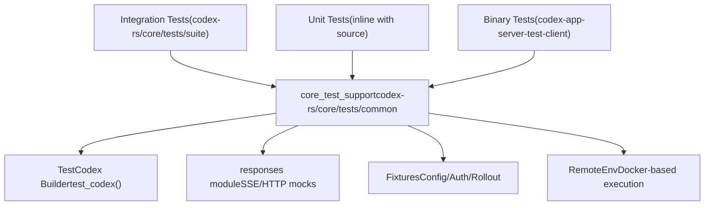
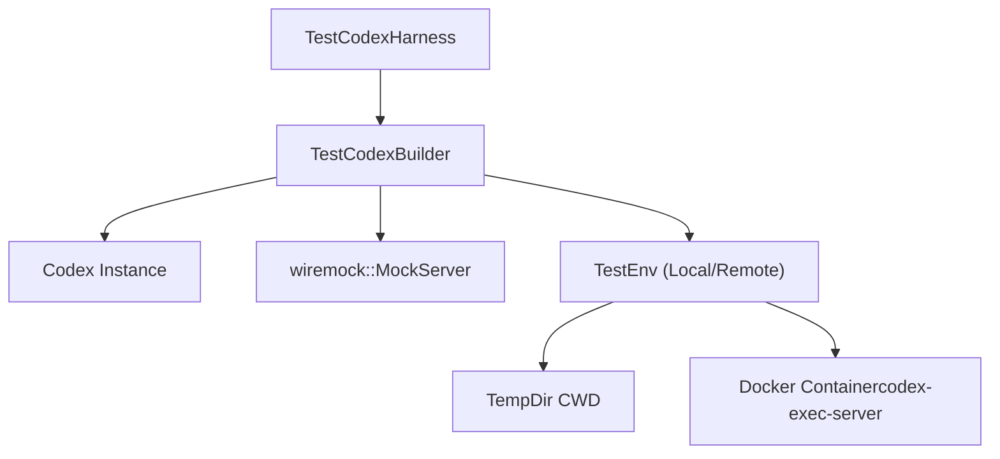

# 测试基础设施

相关源文件

-   [codex-rs/app-server-test-client/Cargo.toml](https://github.com/openai/codex/blob/d807d44a/codex-rs/app-server-test-client/Cargo.toml)
-   [codex-rs/app-server-test-client/README.md](https://github.com/openai/codex/blob/d807d44a/codex-rs/app-server-test-client/README.md?plain=1)
-   [codex-rs/app-server-test-client/src/lib.rs](https://github.com/openai/codex/blob/d807d44a/codex-rs/app-server-test-client/src/lib.rs)
-   [codex-rs/core/tests/common/Cargo.toml](https://github.com/openai/codex/blob/d807d44a/codex-rs/core/tests/common/Cargo.toml)
-   [codex-rs/core/tests/common/lib.rs](https://github.com/openai/codex/blob/d807d44a/codex-rs/core/tests/common/lib.rs)
-   [codex-rs/core/tests/common/test\_codex.rs](https://github.com/openai/codex/blob/d807d44a/codex-rs/core/tests/common/test_codex.rs)
-   [codex-rs/core/tests/suite/apply\_patch\_cli.rs](https://github.com/openai/codex/blob/d807d44a/codex-rs/core/tests/suite/apply_patch_cli.rs)
-   [codex-rs/core/tests/suite/fork\_thread.rs](https://github.com/openai/codex/blob/d807d44a/codex-rs/core/tests/suite/fork_thread.rs)
-   [codex-rs/core/tests/suite/mod.rs](https://github.com/openai/codex/blob/d807d44a/codex-rs/core/tests/suite/mod.rs)
-   [codex-rs/core/tests/suite/remote\_env.rs](https://github.com/openai/codex/blob/d807d44a/codex-rs/core/tests/suite/remote_env.rs)
-   [codex-rs/core/tests/suite/stream\_error\_allows\_next\_turn.rs](https://github.com/openai/codex/blob/d807d44a/codex-rs/core/tests/suite/stream_error_allows_next_turn.rs)
-   [codex-rs/core/tests/suite/stream\_no\_completed.rs](https://github.com/openai/codex/blob/d807d44a/codex-rs/core/tests/suite/stream_no_completed.rs)
-   [scripts/test-remote-env.sh](https://github.com/openai/codex/blob/d807d44a/scripts/test-remote-env.sh)

本文档说明 Codex Rust 代码库的测试基础设施，包括测试组织、关键测试工具、支撑工具以及编写测试的模式。关于开发环境设置，请参见 [9.1](https://github.com/openai/codex/blob/d807d44a/9.1)；关于代码组织模式与约定，请参见 [9.3](https://github.com/openai/codex/blob/d807d44a/9.3)

## 概览

Codex 测试基础设施以 **cargo nextest** 作为主要测试运行器，使用 **快照测试**（通过 `insta`）进行输出校验，并使用 **HTTP Mock**（通过 `wiremock`）进行集成测试。测试组织为单元测试（与源文件内联）、集成测试（位于 `tests/` 目录）以及测试支撑 crate（提供可复用的 fixture、mock 与工具）。

该测试方法强调：

-   **隔离性**：测试使用临时目录与 mock 服务器，避免外部依赖。
-   **可复现性**：快照测试记录预期输出以进行回归检测。
-   **可维护性**：共享测试工具减少各测试套件中的样板代码。
-   **速度**：Nextest 并行执行测试并提供改进的输出。

Sources: [codex-rs/core/tests/suite/mod.rs1-145](https://github.com/openai/codex/blob/d807d44a/codex-rs/core/tests/suite/mod.rs#L1-L145) [codex-rs/core/tests/common/lib.rs1-161](https://github.com/openai/codex/blob/d807d44a/codex-rs/core/tests/common/lib.rs#L1-L161)

## 测试组织

Sources: [codex-rs/core/tests/suite/mod.rs1-145](https://github.com/openai/codex/blob/d807d44a/codex-rs/core/tests/suite/mod.rs#L1-L145) [codex-rs/core/tests/common/Cargo.toml1-42](https://github.com/openai/codex/blob/d807d44a/codex-rs/core/tests/common/Cargo.toml#L1-L42)

### 集成测试

集成测试汇总在 `codex-rs/core/tests/suite/mod.rs` 中。该文件使用 `#[ctor]` 属性在任何测试运行前执行全局初始化，具体是初始化 `arg0_dispatch`，以便测试二进制能够像 `codex` CLI 一样工作（例如处理 `apply_patch` 或 `codex-linux-sandbox` 调用）[codex-rs/core/tests/suite/mod.rs17-55](https://github.com/openai/codex/blob/d807d44a/codex-rs/core/tests/suite/mod.rs#L17-L55)

### 测试支撑 Crate

`core_test_support` crate（位于 `codex-rs/core/tests/common`）是共享基础设施的主要提供者。其包括：

-   **`test_codex`**：用于以 mock 配置启动 `Codex` 实例的 harness [codex-rs/core/tests/common/test\_codex.rs124-149](https://github.com/openai/codex/blob/d807d44a/codex-rs/core/tests/common/test_codex.rs#L124-L149)
-   **`responses`**：用于挂载 `wiremock` 响应与 SSE 流的工具 [codex-rs/core/tests/common/lib.rs203-215](https://github.com/openai/codex/blob/d807d44a/codex-rs/core/tests/common/lib.rs#L203-L215)
-   **`process`**：用于管理外部进程与 `codex-exec-server` 的辅助函数 [codex-rs/core/tests/common/test\_codex.rs60-91](https://github.com/openai/codex/blob/d807d44a/codex-rs/core/tests/common/test_codex.rs#L60-L91)

Sources: [codex-rs/core/tests/common/lib.rs1-161](https://github.com/openai/codex/blob/d807d44a/codex-rs/core/tests/common/lib.rs#L1-L161) [codex-rs/core/tests/common/test\_codex.rs1-149](https://github.com/openai/codex/blob/d807d44a/codex-rs/core/tests/common/test_codex.rs#L1-L149)

## 关键测试依赖

### cargo nextest

项目使用 `cargo nextest` 进行并行测试执行。它能高效处理大规模集成测试套件，相比标准 `cargo test` 提供更好的隔离能力与重试逻辑。

### 快照测试（insta）

`insta` crate 用于快照测试。该基础设施确保在测试初始化期间正确设置 `INSTA_WORKSPACE_ROOT`，从而将快照存储到仓库中的正确位置 [codex-rs/core/tests/common/lib.rs43-60](https://github.com/openai/codex/blob/d807d44a/codex-rs/core/tests/common/lib.rs#L43-L60)

### HTTP Mock（wiremock）

`wiremock` 是模型提供方 API mock 的标准方案。它用于模拟 OpenAI 兼容端点，包括用于流式响应的复杂 SSE 流 [codex-rs/core/tests/suite/stream\_no\_completed.rs32-42](https://github.com/openai/codex/blob/d807d44a/codex-rs/core/tests/suite/stream_no_completed.rs#L32-L42)

Sources: [codex-rs/core/tests/common/lib.rs43-60](https://github.com/openai/codex/blob/d807d44a/codex-rs/core/tests/common/lib.rs#L43-L60) [codex-rs/core/tests/common/Cargo.toml35-41](https://github.com/openai/codex/blob/d807d44a/codex-rs/core/tests/common/Cargo.toml#L35-L41)

## 测试支撑基础设施

### TestCodex Builder 模式

`TestCodex` 与 `TestCodexHarness` 为集成测试提供高层 API。

Sources: [codex-rs/core/tests/common/test\_codex.rs94-122](https://github.com/openai/codex/blob/d807d44a/codex-rs/core/tests/common/test_codex.rs#L94-L122) [codex-rs/core/tests/suite/apply\_patch\_cli.rs44-55](https://github.com/openai/codex/blob/d807d44a/codex-rs/core/tests/suite/apply_patch_cli.rs#L44-L55)

### 远程执行测试

Codex 支持使用 Docker 针对远程环境进行测试。`TestEnv` 结构体可以在容器内初始化 `codex-exec-server`，以验证工具与 shell 命令在跨网络边界场景下是否正确工作 [codex-rs/core/tests/common/test\_codex.rs124-149](https://github.com/openai/codex/blob/d807d44a/codex-rs/core/tests/common/test_codex.rs#L124-L149)

关键组件：

-   **`start_remote_exec_server`**：将 `codex-exec-server` 二进制部署到容器并启动 [codex-rs/core/tests/common/test\_codex.rs156-199](https://github.com/openai/codex/blob/d807d44a/codex-rs/core/tests/common/test_codex.rs#L156-L199)
-   **`scripts/test-remote-env.sh`**：用于手动或 CI 测试环境搭建的辅助脚本 [scripts/test-remote-env.sh18-54](https://github.com/openai/codex/blob/d807d44a/scripts/test-remote-env.sh#L18-L54)

Sources: [codex-rs/core/tests/common/test\_codex.rs156-199](https://github.com/openai/codex/blob/d807d44a/codex-rs/core/tests/common/test_codex.rs#L156-L199) [scripts/test-remote-env.sh1-79](https://github.com/openai/codex/blob/d807d44a/scripts/test-remote-env.sh#L1-L79)

### SSE Mock 工具

测试通常需要模拟不完整或错误流，以验证代理的健壮性。

-   **`load_sse_fixture`**：将 JSON 事件数组转换为有效 SSE 流体 [codex-rs/core/tests/common/lib.rs203-215](https://github.com/openai/codex/blob/d807d44a/codex-rs/core/tests/common/lib.rs#L203-L215)
-   **`StreamingSseServer`**：围绕 `wiremock` 的专用封装，用于测试流中故障与重试 [codex-rs/core/tests/suite/stream\_no\_completed.rs32-42](https://github.com/openai/codex/blob/d807d44a/codex-rs/core/tests/suite/stream_no_completed.rs#L32-L42)

Sources: [codex-rs/core/tests/common/lib.rs203-215](https://github.com/openai/codex/blob/d807d44a/codex-rs/core/tests/common/lib.rs#L203-L215) [codex-rs/core/tests/suite/stream\_no\_completed.rs1-100](https://github.com/openai/codex/blob/d807d44a/codex-rs/core/tests/suite/stream_no_completed.rs#L1-L100)

## 常见测试模式

### 多操作集成

像 `apply_patch_cli_multiple_operations_integration` 这样的测试通过以下方式验证复杂工具工作流：

1.  使用文件初始化临时工作区 [codex-rs/core/tests/suite/apply\_patch\_cli.rs103-106](https://github.com/openai/codex/blob/d807d44a/codex-rs/core/tests/suite/apply_patch_cli.rs#L103-L106)
2.  mock 会调用工具（例如 `apply_patch`）的模型响应 [codex-rs/core/tests/suite/apply\_patch\_cli.rs111-113](https://github.com/openai/codex/blob/d807d44a/codex-rs/core/tests/suite/apply_patch_cli.rs#L111-L113)
3.  使用正则匹配器验证文件系统状态与 CLI 输出 [codex-rs/core/tests/suite/apply\_patch\_cli.rs115-133](https://github.com/openai/codex/blob/d807d44a/codex-rs/core/tests/suite/apply_patch_cli.rs#L115-L133)

### 线程分叉与 Rollout 校验

集成测试会验证线程分叉是否正确截断历史。测试 `fork_thread_twice_drops_to_first_message` 会执行多轮交互，在特定索引处分叉线程，并检查生成的 `.jsonl` rollout 文件，以确保 `RolloutItem` 序列符合预期 [codex-rs/core/tests/suite/fork\_thread.rs21-151](https://github.com/openai/codex/blob/d807d44a/codex-rs/core/tests/suite/fork_thread.rs#L21-L151)

Sources: [codex-rs/core/tests/suite/apply\_patch\_cli.rs95-135](https://github.com/openai/codex/blob/d807d44a/codex-rs/core/tests/suite/apply_patch_cli.rs#L95-L135) [codex-rs/core/tests/suite/fork\_thread.rs21-151](https://github.com/openai/codex/blob/d807d44a/codex-rs/core/tests/suite/fork_thread.rs#L21-L151)

### App Server 测试

`codex-app-server-test-client` 是用于测试 JSON-RPC 协议的专用工具。它可以：

-   将 `app-server` 作为子进程启动 [codex-rs/app-server-test-client/src/lib.rs110-113](https://github.com/openai/codex/blob/d807d44a/codex-rs/app-server-test-client/src/lib.rs#L110-L113)
-   发送 V2 协议消息，如 `SendMessageV2` 或 `ThreadResume` [codex-rs/app-server-test-client/src/lib.rs168-185](https://github.com/openai/codex/blob/d807d44a/codex-rs/app-server-test-client/src/lib.rs#L168-L185)
-   监听原始入站流量，以调试协议切换 [codex-rs/app-server-test-client/README.md21-28](https://github.com/openai/codex/blob/d807d44a/codex-rs/app-server-test-client/README.md?plain=1#L21-L28)

Sources: [codex-rs/app-server-test-client/src/lib.rs1-185](https://github.com/openai/codex/blob/d807d44a/codex-rs/app-server-test-client/src/lib.rs#L1-L185) [codex-rs/app-server-test-client/README.md1-59](https://github.com/openai/codex/blob/d807d44a/codex-rs/app-server-test-client/README.md?plain=1#L1-L59)

## 测试配置与环境

### 确定性 ID

为使快照与日志可复现，测试使用全局 `#[ctor]` 启用确定性进程 ID 与线程管理器测试模式 [codex-rs/core/tests/common/lib.rs31-35](https://github.com/openai/codex/blob/d807d44a/codex-rs/core/tests/common/lib.rs#L31-L35)

### 配置覆盖

测试使用带 `harness_overrides` 的 `ConfigBuilder`，以确保诸如 `codex_linux_sandbox_exe` 的路径指向测试构建的二进制，而非系统安装版本 [codex-rs/core/tests/common/lib.rs154-171](https://github.com/openai/codex/blob/d807d44a/codex-rs/core/tests/common/lib.rs#L154-L171)

Sources: [codex-rs/core/tests/common/lib.rs31-40](https://github.com/openai/codex/blob/d807d44a/codex-rs/core/tests/common/lib.rs#L31-L40) [codex-rs/core/tests/common/lib.rs154-171](https://github.com/openai/codex/blob/d807d44a/codex-rs/core/tests/common/lib.rs#L154-L171)
